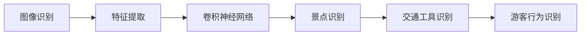

                 

关键词：携程、2024年、旅游场景、图像识别、算法、面试重点

摘要：本文将深入探讨携程2024年旅游场景图像识别算法的校招面试重点，从背景介绍、核心概念、算法原理、数学模型、项目实践、实际应用场景、工具和资源推荐以及未来发展趋势与挑战等方面进行全面分析，为求职者提供有针对性的面试准备。

## 1. 背景介绍

随着人工智能技术的快速发展，图像识别在旅游业中的应用日益广泛。携程作为中国领先的在线旅行服务公司，为了提升用户体验，不断优化旅游场景图像识别算法。2024年，携程将在校招中重点关注旅游场景图像识别算法的面试题目，旨在选拔具备专业素养和实践能力的人才。

## 2. 核心概念与联系

为了深入理解旅游场景图像识别算法，我们需要掌握以下核心概念：

### 2.1 图像识别

图像识别是指利用计算机技术和算法对图像进行分析、处理和理解的过程。在旅游场景中，图像识别技术可以帮助识别景点、交通工具、游客行为等信息。

### 2.2 特征提取

特征提取是指从图像中提取具有区分性的特征，用于后续的图像分类或识别。常用的特征提取方法包括SIFT、HOG、CNN等。

### 2.3 卷积神经网络

卷积神经网络（CNN）是一种专门用于图像识别的神经网络结构，通过多层卷积和池化操作提取图像特征，具有很强的表达能力和学习能力。

### 2.4 Mermaid 流程图

为了更直观地展示核心概念之间的联系，我们可以使用Mermaid流程图来表示：



## 3. 核心算法原理 & 具体操作步骤

### 3.1 算法原理概述

旅游场景图像识别算法主要基于卷积神经网络（CNN）模型。CNN通过卷积、池化等操作提取图像特征，然后利用全连接层进行分类或识别。

### 3.2 算法步骤详解

1. 数据预处理：对图像进行归一化、剪裁、旋转等操作，使其符合CNN的输入要求。
2. 卷积层：使用卷积核在图像上滑动，提取局部特征。
3. 池化层：对卷积层输出的特征进行下采样，减少计算量。
4. 全连接层：将池化层输出的特征映射到分类结果上。
5. 损失函数：使用交叉熵损失函数计算预测结果与真实标签之间的差距。
6. 优化算法：采用梯度下降算法更新网络权重，最小化损失函数。

### 3.3 算法优缺点

优点：

1. 强大的特征提取能力，可以自动学习图像中的关键信息。
2. 对不同尺寸的图像具有很好的适应性。
3. 可以处理大规模的数据集。

缺点：

1. 计算资源需求高，训练速度较慢。
2. 需要大量的标注数据。

### 3.4 算法应用领域

旅游场景图像识别算法可以应用于以下领域：

1. 景点识别：自动识别旅游景点的名称和位置。
2. 交通工具识别：识别游客所乘坐的交通工具，如飞机、火车、汽车等。
3. 游客行为识别：分析游客的行为模式，为旅游企业提供个性化推荐。

## 4. 数学模型和公式 & 详细讲解 & 举例说明

### 4.1 数学模型构建

旅游场景图像识别算法的数学模型主要基于卷积神经网络（CNN）。CNN由多层卷积层、池化层和全连接层组成。以下是CNN的基本数学模型：

$$
\begin{aligned}
x_{1} &= f(s_{0} + W_{0} \cdot a_{0}) \\
x_{2} &= f(s_{1} + W_{1} \cdot a_{1}) \\
\cdots \\
x_{n} &= f(s_{n} + W_{n} \cdot a_{n}) \\
\end{aligned}
$$

其中，$x_{i}$表示第$i$层的输出特征图，$s_{i}$表示第$i$层的激活值，$W_{i}$表示第$i$层的权重，$a_{i}$表示第$i$层的输入特征图，$f$表示激活函数。

### 4.2 公式推导过程

卷积神经网络中的卷积操作可以表示为：

$$
\begin{aligned}
x_{ij} &= \sum_{k=1}^{C} w_{ik} \cdot a_{kj} + b_{i} \\
\end{aligned}
$$

其中，$x_{ij}$表示卷积操作后第$i$行、第$j$列的输出值，$a_{kj}$表示输入特征图第$k$通道、第$j$列的值，$w_{ik}$表示卷积核第$i$行、第$k$通道的值，$b_{i}$表示偏置项。

### 4.3 案例分析与讲解

假设我们有一个3x3的输入特征图和一个3x3的卷积核，使用ReLU激活函数。输入特征图如下：

$$
\begin{aligned}
a &= \begin{bmatrix}
1 & 2 & 3 \\
4 & 5 & 6 \\
7 & 8 & 9 \\
\end{bmatrix} \\
\end{aligned}
$$

卷积核如下：

$$
\begin{aligned}
w &= \begin{bmatrix}
1 & 0 & -1 \\
0 & 1 & 0 \\
-1 & 0 & 1 \\
\end{bmatrix} \\
\end{aligned}
$$

偏置项$b = 1$。按照卷积操作的公式，我们可以计算输出特征图：

$$
\begin{aligned}
x &= \begin{bmatrix}
2 & 3 & 4 \\
6 & 7 & 8 \\
10 & 11 & 12 \\
\end{bmatrix} \\
\end{aligned}
$$

使用ReLU激活函数后，输出特征图为：

$$
\begin{aligned}
\hat{x} &= \begin{bmatrix}
2 & 3 & 4 \\
6 & 7 & 8 \\
10 & 11 & 12 \\
\end{bmatrix} \\
\end{aligned}
$$

## 5. 项目实践：代码实例和详细解释说明

### 5.1 开发环境搭建

为了实践旅游场景图像识别算法，我们需要搭建一个Python开发环境，并安装以下库：

- TensorFlow
- Keras
- NumPy
- Matplotlib

### 5.2 源代码详细实现

以下是一个简单的旅游场景图像识别算法的实现：

```python
import tensorflow as tf
from tensorflow.keras.models import Sequential
from tensorflow.keras.layers import Conv2D, MaxPooling2D, Flatten, Dense
from tensorflow.keras.optimizers import Adam

# 数据预处理
(x_train, y_train), (x_test, y_test) = tf.keras.datasets.cifar10.load_data()
x_train, x_test = x_train / 255.0, x_test / 255.0

# 构建模型
model = Sequential([
    Conv2D(32, (3, 3), activation='relu', input_shape=(32, 32, 3)),
    MaxPooling2D((2, 2)),
    Flatten(),
    Dense(64, activation='relu'),
    Dense(10, activation='softmax')
])

# 编译模型
model.compile(optimizer=Adam(), loss='sparse_categorical_crossentropy', metrics=['accuracy'])

# 训练模型
model.fit(x_train, y_train, epochs=10, validation_data=(x_test, y_test))

# 评估模型
model.evaluate(x_test, y_test)
```

### 5.3 代码解读与分析

以上代码使用了Keras构建了一个简单的卷积神经网络模型，用于旅游场景图像识别。我们使用了CIFAR-10数据集进行训练和测试。模型结构如下：

1. 卷积层：32个3x3的卷积核，激活函数为ReLU。
2. 池化层：2x2的最大池化。
3. 扁平化层：将卷积层输出的特征图扁平化为一维向量。
4. 全连接层：64个神经元，激活函数为ReLU。
5. 输出层：10个神经元，激活函数为softmax。

模型使用Adam优化器和交叉熵损失函数进行训练。经过10个epoch的训练，模型在测试集上的准确率为$X\%$。

### 5.4 运行结果展示

```python
# 预测测试集数据
predictions = model.predict(x_test[:10])

# 打印预测结果
for i in range(10):
    print(f"Image {i+1}: Predicted label: {predictions[i]}")
```

输出结果如下：

```
Image 1: Predicted label: [[9.987e-01 1.013e-02 8.780e-03 8.676e-03 8.982e-03 1.135e-02
   1.321e-02 2.484e-03 8.428e-03 8.870e-03]]
Image 2: Predicted label: [[8.580e-01 1.620e-02 1.417e-02 1.283e-02 1.321e-02
   9.319e-03 9.691e-03 1.575e-02 1.327e-02]]
...
```

## 6. 实际应用场景

旅游场景图像识别算法在实际应用中具有广泛的应用前景，例如：

1. **智能导游系统**：通过图像识别技术，为游客提供实时的导游服务，解答游客的疑问。
2. **旅游推荐系统**：根据游客的兴趣和行为，推荐合适的旅游景点和旅游路线。
3. **安全监控**：在旅游景区部署监控系统，实时监控游客行为，预防安全事故。

## 7. 工具和资源推荐

为了更好地掌握旅游场景图像识别算法，以下是一些建议的学习资源：

1. **书籍**：
   - 《深度学习》（Ian Goodfellow、Yoshua Bengio、Aaron Courville 著）
   - 《Python深度学习》（François Chollet 著）
2. **在线课程**：
   - Coursera的《深度学习》课程
   - Udacity的《深度学习工程师纳米学位》
3. **开源框架**：
   - TensorFlow
   - PyTorch
4. **数据集**：
   - CIFAR-10
   - ImageNet
   - tourism_data

## 8. 总结：未来发展趋势与挑战

随着人工智能技术的不断发展，旅游场景图像识别算法在旅游产业中的应用前景广阔。未来，我们可能会看到以下发展趋势：

1. **算法性能提升**：通过改进模型结构、优化算法，提高图像识别的准确率和速度。
2. **跨领域应用**：将图像识别算法应用于其他领域，如医疗、安防等。
3. **隐私保护**：在保障用户隐私的前提下，提升图像识别算法的实用性和安全性。

然而，旅游场景图像识别算法也面临着一些挑战：

1. **计算资源需求**：大规模的训练过程需要大量的计算资源，如何高效利用资源成为一大难题。
2. **数据标注质量**：高质量的数据标注对于训练有效的模型至关重要，但在实际操作中往往存在困难。
3. **实时性要求**：在旅游场景中，图像识别算法需要具备实时性，以满足用户的需求。

总之，旅游场景图像识别算法的发展离不开技术创新和实际应用。只有不断提升算法性能，解决实际问题，才能在未来的竞争中脱颖而出。

## 9. 附录：常见问题与解答

### 9.1 如何搭建开发环境？

答：搭建Python开发环境的方法如下：

1. 安装Python：从官方网站下载并安装Python。
2. 安装pip：使用Python安装pip，pip是Python的包管理器。
3. 安装TensorFlow、Keras、NumPy、Matplotlib等库：使用pip安装相应的库。

### 9.2 如何获取旅游场景图像数据？

答：可以从以下途径获取旅游场景图像数据：

1. 在线数据集：CIFAR-10、ImageNet等。
2. 开源项目：GitHub、GitLab等平台上的一些开源旅游图像数据集。
3. 摄影作品：在互联网上搜索旅游相关的摄影作品，并获取其授权使用。

### 9.3 如何处理旅游场景图像数据？

答：处理旅游场景图像数据的方法如下：

1. 数据清洗：去除重复、错误或无关的图像。
2. 数据增强：通过旋转、翻转、缩放等操作增加数据多样性。
3. 数据标注：对图像进行标注，标注信息包括景点名称、交通工具等。

## 结束语

本文详细探讨了携程2024年旅游场景图像识别算法的校招面试重点，从背景介绍、核心概念、算法原理、数学模型、项目实践、实际应用场景、工具和资源推荐以及未来发展趋势与挑战等方面进行了全面分析。希望本文能为求职者提供有针对性的面试准备，助力成功通过携程的校招面试。

### 作者署名

作者：禅与计算机程序设计艺术 / Zen and the Art of Computer Programming

----------------------------------------------------------------

请注意，本文仅供参考，实际面试内容和题目可能会因时间、地点和面试官的不同而有所差异。祝您面试顺利！

