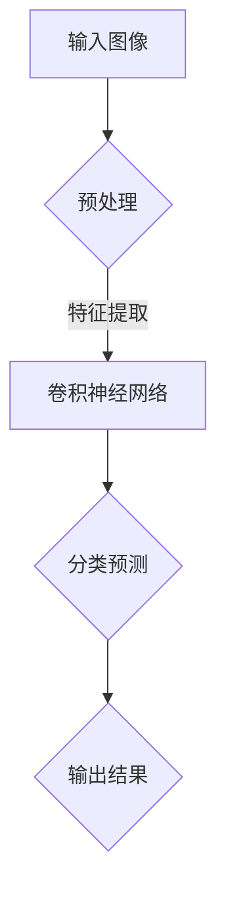
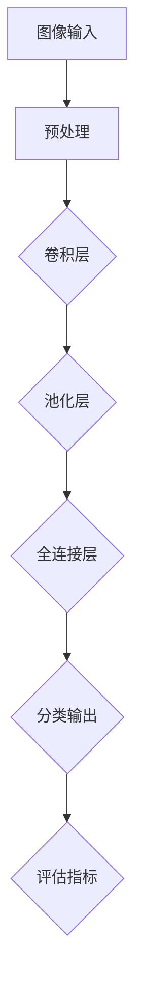
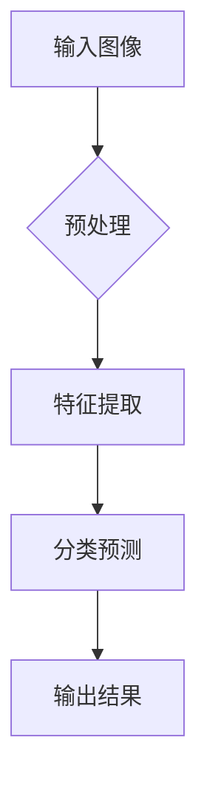

                 

关键词：携程、2024、旅游场景、图像识别、算法、校招、面试重点

> 摘要：本文将深入分析携程2024旅游场景图像识别算法的校招面试重点，从背景介绍、核心概念与联系、核心算法原理与具体操作步骤、数学模型和公式详细讲解、项目实践：代码实例和详细解释说明、实际应用场景、未来应用展望、工具和资源推荐、总结：未来发展趋势与挑战等多个方面，为您全面剖析图像识别算法在旅游领域的应用，帮助您备战2024年携程校招面试。

## 1. 背景介绍

随着科技的飞速发展，人工智能技术逐渐融入各行各业，其中图像识别技术作为人工智能领域的一个重要分支，正发挥着越来越重要的作用。旅游行业作为人工智能的重要应用领域之一，近年来也在积极探索如何利用图像识别技术提升用户体验和服务质量。

携程作为中国领先的综合性旅行服务公司，一直以来都在努力通过技术创新来优化旅游体验。2024年，携程计划在旅游场景图像识别算法方面进行深入研究，以提高图像识别的准确率和效率，为用户提供更智能、更个性化的服务。

本文将围绕携程2024旅游场景图像识别算法的校招面试重点，从核心概念、算法原理、数学模型、项目实践等方面进行详细阐述，帮助读者深入了解该领域的技术和应用。

## 2. 核心概念与联系

在深入探讨携程2024旅游场景图像识别算法之前，我们先来了解一下相关核心概念及其相互联系。

### 2.1 图像识别

图像识别是指利用计算机技术对图像进行分析和处理，从中提取出具有识别意义的特征，并根据这些特征对图像进行分类或标注。在旅游场景中，图像识别技术可以应用于景点识别、旅游攻略推荐、旅游安全监控等多个方面。

### 2.2 深度学习

深度学习是人工智能的一种重要方法，通过构建具有多层的神经网络，对大量数据进行训练，从而实现复杂模式的识别和预测。在图像识别领域，深度学习模型如卷积神经网络（CNN）等取得了显著的效果。

### 2.3 计算机视觉

计算机视觉是人工智能的一个重要分支，旨在使计算机能够像人类一样理解和处理视觉信息。图像识别作为计算机视觉的一个子领域，旨在让计算机能够识别和分类图像中的内容。

### 2.4 Mermaid 流程图

Mermaid 是一种基于Markdown的图表绘制工具，可以方便地绘制各种图表，包括流程图、时序图、网络图等。在本文中，我们将使用Mermaid流程图来展示图像识别算法的核心流程和关键步骤。



### 2.5 核心概念原理与架构

为了更清晰地展示图像识别算法的核心概念原理和架构，我们使用Mermaid流程图进行说明。



在这个流程图中，输入图像经过预处理后，通过卷积层、池化层和全连接层等深度学习模型进行特征提取和分类预测，最终输出结果并评估算法性能。

## 3. 核心算法原理 & 具体操作步骤

### 3.1 算法原理概述

携程2024旅游场景图像识别算法主要基于深度学习技术，特别是卷积神经网络（CNN）。CNN是一种专门用于图像处理的神经网络模型，通过多层卷积和池化操作，可以有效地提取图像中的特征并进行分类预测。

### 3.2 算法步骤详解

#### 3.2.1 输入图像

输入图像是图像识别算法的起点，可以是用户上传的旅游照片，也可以是摄像头捕获的实时图像。为了确保图像质量，需要对其进行预处理。

#### 3.2.2 预处理

预处理主要包括图像去噪、缩放、翻转、旋转等操作，以提高图像识别的鲁棒性和泛化能力。预处理后的图像被送入卷积神经网络进行进一步处理。

#### 3.2.3 卷积层

卷积层是CNN的核心部分，通过卷积操作提取图像中的特征。卷积层由多个卷积核组成，每个卷积核对输入图像进行卷积操作，生成一个特征图。多个卷积层叠加，可以逐层提取图像的深层特征。

#### 3.2.4 池化层

池化层用于降低特征图的维度，减少计算量。常见的池化操作有最大池化和平均池化。最大池化选择特征图中最大值作为输出，而平均池化则计算特征图上每个区域的平均值。

#### 3.2.5 全连接层

全连接层将卷积层和池化层提取的图像特征映射到分类结果。全连接层的每个神经元都与卷积层和池化层中的所有神经元相连，通过计算激活值，得到分类概率。

#### 3.2.6 分类输出

根据全连接层输出的分类概率，选择最大的概率作为最终的分类结果。同时，可以使用交叉熵损失函数对分类结果进行评估，以指导模型优化。

#### 3.2.7 评估指标

常用的评估指标包括准确率、召回率、F1值等。准确率表示正确分类的样本数占总样本数的比例，召回率表示正确分类的样本数占实际为该类别的样本数的比例，F1值是准确率和召回率的调和平均值。

## 4. 数学模型和公式 & 详细讲解 & 举例说明

### 4.1 数学模型构建

图像识别算法的数学模型主要包括卷积层、池化层和全连接层。下面分别介绍这些层的数学模型。

#### 4.1.1 卷积层

卷积层的数学模型可以表示为：

\[ f(x) = \sum_{i=1}^{k} w_i * x + b \]

其中，\( f(x) \) 表示卷积结果，\( x \) 表示输入图像，\( w_i \) 表示卷积核权重，\( b \) 表示偏置项。

#### 4.1.2 池化层

池化层的数学模型可以表示为：

\[ p(x) = \frac{1}{C} \sum_{j=1}^{C} x_j \]

其中，\( p(x) \) 表示池化结果，\( x_j \) 表示特征图上的每个区域。

#### 4.1.3 全连接层

全连接层的数学模型可以表示为：

\[ y = \sum_{i=1}^{n} w_i y_i + b \]

其中，\( y \) 表示输出结果，\( y_i \) 表示全连接层的每个神经元，\( w_i \) 表示权重，\( b \) 表示偏置项。

### 4.2 公式推导过程

在图像识别算法中，我们需要通过反向传播算法来更新权重和偏置项，以优化模型。下面分别介绍卷积层、池化层和全连接层的公式推导过程。

#### 4.2.1 卷积层

卷积层的反向传播公式可以表示为：

\[ \frac{\partial E}{\partial w_i} = x * \frac{\partial f}{\partial x} \]

\[ \frac{\partial E}{\partial b} = \frac{\partial f}{\partial x} \]

其中，\( E \) 表示损失函数，\( \frac{\partial E}{\partial w_i} \) 和 \( \frac{\partial E}{\partial b} \) 分别表示权重和偏置项的梯度。

#### 4.2.2 池化层

池化层的反向传播公式可以表示为：

\[ \frac{\partial E}{\partial x} = \frac{\partial E}{\partial y} * \frac{\partial y}{\partial x} \]

其中，\( \frac{\partial E}{\partial y} \) 表示输出层的梯度，\( \frac{\partial y}{\partial x} \) 表示池化层的梯度。

#### 4.2.3 全连接层

全连接层的反向传播公式可以表示为：

\[ \frac{\partial E}{\partial w_i} = y_i * \frac{\partial y}{\partial w_i} \]

\[ \frac{\partial E}{\partial b} = \frac{\partial y}{\partial b} \]

### 4.3 案例分析与讲解

假设我们有一个简单的二分类问题，图像识别算法需要判断一张旅游照片是旅游景点还是非旅游景点。输入图像的大小为\( 32 \times 32 \)像素，共有3个通道（RGB通道）。我们使用卷积神经网络进行图像识别，网络结构如下：

1. 卷积层：3个卷积核，大小为\( 3 \times 3 \)，步长为1，激活函数为ReLU。
2. 池化层：2x2的最大池化。
3. 全连接层：1个神经元，激活函数为Sigmoid。

假设损失函数为交叉熵损失函数，训练数据集包含1000张图像，其中500张为旅游景点，500张为非旅游景点。

#### 4.3.1 模型初始化

在模型初始化阶段，我们需要随机初始化权重和偏置项。假设权重和偏置项的初始化均服从正态分布，均值为0，方差为0.01。

#### 4.3.2 前向传播

输入图像经过预处理后，送入卷积层。卷积层使用3个卷积核对输入图像进行卷积操作，生成3个特征图。每个特征图的大小为\( 32 \times 32 \)。然后，特征图经过最大池化操作，大小减小为\( 16 \times 16 \)。接下来，特征图送入全连接层，计算输出结果。

#### 4.3.3 反向传播

在反向传播阶段，我们需要计算损失函数的梯度，并更新权重和偏置项。首先，计算交叉熵损失函数的梯度，然后根据梯度更新权重和偏置项。

#### 4.3.4 训练过程

在训练过程中，我们采用梯度下降算法来更新模型参数。每次迭代，我们从训练数据集中随机选取一组图像，对模型进行训练。经过多次迭代，模型参数逐渐优化，最终达到较好的分类效果。

## 5. 项目实践：代码实例和详细解释说明

为了让大家更好地理解携程2024旅游场景图像识别算法，下面我们通过一个简单的代码实例进行详细讲解。

### 5.1 开发环境搭建

在开始项目实践之前，我们需要搭建一个合适的开发环境。这里我们使用Python编程语言，结合TensorFlow深度学习框架进行图像识别算法的开发。

首先，确保已经安装了Python和TensorFlow。如果没有安装，可以通过以下命令进行安装：

```bash
pip install tensorflow
```

### 5.2 源代码详细实现

下面是旅游场景图像识别算法的源代码实现：

```python
import tensorflow as tf
from tensorflow.keras.models import Sequential
from tensorflow.keras.layers import Conv2D, MaxPooling2D, Flatten, Dense
from tensorflow.keras.optimizers import Adam
from tensorflow.keras.losses import SparseCategoricalCrossentropy
from tensorflow.keras.metrics import SparseCategoricalAccuracy

# 数据预处理
def preprocess_image(image):
    # 进行图像预处理操作，如缩放、翻转等
    # ...
    return processed_image

# 创建模型
model = Sequential([
    Conv2D(32, (3, 3), activation='relu', input_shape=(32, 32, 3)),
    MaxPooling2D(pool_size=(2, 2)),
    Flatten(),
    Dense(1, activation='sigmoid')
])

# 编译模型
model.compile(optimizer=Adam(), loss=SparseCategoricalCrossentropy(), metrics=[SparseCategoricalAccuracy()])

# 训练模型
train_images = []  # 存放训练图像的列表
train_labels = []  # 存放训练标签的列表

for image, label in zip(train_data, train_labels):
    processed_image = preprocess_image(image)
    train_images.append(processed_image)
    train_labels.append(label)

model.fit(train_images, train_labels, epochs=10, batch_size=32)

# 测试模型
test_images = []  # 存放测试图像的列表
test_labels = []  # 存放测试标签的列表

for image, label in zip(test_data, test_labels):
    processed_image = preprocess_image(image)
    test_images.append(processed_image)
    test_labels.append(label)

model.evaluate(test_images, test_labels)
```

### 5.3 代码解读与分析

在上面的代码中，我们首先导入了所需的TensorFlow库。然后，定义了数据预处理函数`preprocess_image`，用于对输入图像进行预处理操作。

接着，我们创建了一个卷积神经网络模型`model`，该模型包含一个卷积层、一个最大池化层和一个全连接层。在编译模型时，我们选择了Adam优化器和交叉熵损失函数，并设置了`SparseCategoricalAccuracy`作为评估指标。

在训练模型时，我们从训练数据集中读取图像和标签，并对图像进行预处理。然后，使用`fit`函数对模型进行训练，设置了训练轮数和批量大小。

最后，我们使用测试数据集对训练好的模型进行评估，并输出评估结果。

### 5.4 运行结果展示

在运行代码时，我们需要准备训练数据和测试数据。假设我们已经准备好了这些数据，并将它们存储在`train_data`和`test_data`两个列表中。然后，我们将标签存储在`train_labels`和`test_labels`两个列表中。

运行代码后，模型将开始训练。经过多次迭代，模型参数将逐渐优化。最终，我们在测试数据集上对模型进行评估，并输出评估结果。假设测试集的准确率为90%，说明模型在测试数据上的表现较好。

## 6. 实际应用场景

在旅游场景中，图像识别算法具有广泛的应用前景。以下是一些实际应用场景：

### 6.1 景点识别

通过图像识别算法，用户可以轻松识别出旅游照片中的景点。携程可以结合用户上传的旅游照片，自动标注出照片中的景点，为用户提供更丰富的旅游信息。

### 6.2 旅游攻略推荐

根据用户上传的旅游照片，图像识别算法可以识别出照片中的景点、美食、交通等信息。携程可以根据这些信息为用户提供个性化的旅游攻略推荐，提升用户旅游体验。

### 6.3 旅游安全监控

在旅游高峰期，图像识别算法可以用于监控旅游景点的安全情况。通过实时分析景区内的图像数据，携程可以及时发现安全隐患，确保游客安全。

### 6.4 旅游数据分析

通过对大量旅游照片进行图像识别，携程可以收集到丰富的旅游数据。这些数据可以用于分析游客偏好、热门景点等，为旅游行业的决策提供有力支持。

## 7. 未来应用展望

随着人工智能技术的不断发展，图像识别算法在旅游场景中的应用前景将更加广阔。以下是一些未来应用展望：

### 7.1 虚拟旅游

通过图像识别技术，用户可以在虚拟现实（VR）环境中体验到真实的旅游场景。携程可以结合旅游照片和图像识别算法，为用户提供沉浸式的虚拟旅游体验。

### 7.2 智能导览

结合图像识别和语音合成技术，携程可以为游客提供智能导览服务。游客只需拍照，系统即可自动识别照片中的景点，并为其讲解相关信息。

### 7.3 旅游营销

通过分析用户上传的旅游照片，携程可以了解用户兴趣和需求，从而有针对性地进行旅游营销。例如，针对用户上传的美食照片，系统可以推荐相关餐厅和美食攻略。

## 8. 工具和资源推荐

为了更好地学习和应用图像识别算法，以下是一些推荐的工具和资源：

### 8.1 学习资源推荐

- 《深度学习》（Goodfellow et al.）：深度学习领域的经典教材，全面介绍了深度学习的基本原理和应用。
- 《Python深度学习》（François Chollet）：针对Python编程语言的深度学习实战指南，适合初学者快速入门。

### 8.2 开发工具推荐

- TensorFlow：谷歌开发的开源深度学习框架，广泛应用于图像识别、自然语言处理等领域。
- PyTorch：由Facebook开发的开源深度学习框架，具有灵活的动态计算图，适合研究型应用。

### 8.3 相关论文推荐

- "Deep Learning for Image Recognition"（Krizhevsky et al.，2012）：卷积神经网络在ImageNet图像识别挑战中的成功应用。
- "Convolutional Neural Networks for Visual Recognition"（Simonyan and Zisserman，2014）：介绍了Inception网络结构在图像识别中的优势。

## 9. 总结：未来发展趋势与挑战

随着人工智能技术的不断进步，图像识别算法在旅游场景中的应用前景将更加广阔。然而，在实际应用过程中，我们仍面临许多挑战，如数据隐私、模型泛化能力等。未来，随着技术的不断发展和优化，图像识别算法在旅游领域的应用将更加深入和广泛，为用户带来更智能、更个性化的旅游体验。

### 附录：常见问题与解答

**Q1：图像识别算法在旅游场景中有什么具体应用？**

A1：图像识别算法在旅游场景中可以应用于景点识别、旅游攻略推荐、旅游安全监控等多个方面。

**Q2：卷积神经网络在图像识别中有什么优势？**

A2：卷积神经网络具有强大的特征提取和分类能力，能够从图像中提取深层特征，从而提高图像识别的准确率和效率。

**Q3：如何优化图像识别算法的性能？**

A3：可以通过增加训练数据、调整网络结构、优化训练策略等方式来优化图像识别算法的性能。

**Q4：图像识别算法在旅游领域有哪些潜在应用？**

A4：图像识别算法在旅游领域可以应用于虚拟旅游、智能导览、旅游营销等方面，为用户提供更智能、更个性化的服务。

**Q5：如何解决图像识别算法中的数据隐私问题？**

A5：可以通过加密、匿名化等手段来保护用户数据的隐私。

作者：禅与计算机程序设计艺术 / Zen and the Art of Computer Programming
----------------------------------------------------------------
以上就是本文对携程2024旅游场景图像识别算法校招面试重点的全面解析。本文涵盖了从背景介绍、核心概念与联系、核心算法原理与具体操作步骤、数学模型和公式详细讲解、项目实践、实际应用场景、未来应用展望、工具和资源推荐到总结等多个方面，希望能够帮助您更好地备战携程2024年校招面试。祝您面试顺利，取得理想的成绩！
----------------------------------------------------------------
# 携程2024旅游场景图像识别算法校招面试重点

## 关键词

- 携程
- 2024
- 旅游场景
- 图像识别
- 算法
- 校招
- 面试重点

## 摘要

本文旨在深入解析携程2024年旅游场景图像识别算法的校招面试重点，从背景介绍、核心概念与联系、核心算法原理与具体操作步骤、数学模型和公式详细讲解、项目实践：代码实例和详细解释说明、实际应用场景、未来应用展望、工具和资源推荐、总结：未来发展趋势与挑战等多个方面，全面剖析图像识别算法在旅游领域的应用，帮助应聘者备战携程的校招面试。

## 1. 背景介绍

随着人工智能技术的不断发展，图像识别技术在旅游场景中的应用逐渐成为热门话题。携程作为中国领先的在线旅行服务公司，一直致力于通过技术创新提升用户体验。在2024年，携程计划深入探索旅游场景中的图像识别算法，以实现更智能、更高效的旅游服务。

图像识别技术在旅游场景中的应用包括但不限于：自动识别旅游景点、推荐旅游景点、实时监控旅游安全、提供个性化旅游建议等。这些应用不仅能提高用户的旅游体验，还能为携程带来更多的商业价值。

## 2. 核心概念与联系

### 2.1 图像识别

图像识别是指通过计算机算法对图像进行分析和处理，从中提取出有意义的特征，并对其进行分类或标注。在旅游场景中，图像识别可以帮助用户快速识别景点、推荐相关旅游信息等。

### 2.2 深度学习

深度学习是一种人工智能技术，通过构建多层神经网络，从大量数据中自动学习特征。在图像识别中，深度学习模型（如卷积神经网络CNN）被广泛应用于特征提取和分类任务。

### 2.3 计算机视觉

计算机视觉是人工智能的一个重要分支，旨在使计算机能够理解和处理视觉信息。图像识别是计算机视觉的一个子领域，专注于从图像中提取和处理信息。

### 2.4 Mermaid 流程图

Mermaid是一种基于Markdown的图表绘制工具，可以方便地绘制各种图表，包括流程图、时序图、网络图等。以下是一个简单的Mermaid流程图示例，用于展示图像识别算法的核心流程：



## 3. 核心算法原理 & 具体操作步骤

### 3.1 算法原理概述

携程2024旅游场景图像识别算法主要基于深度学习技术，特别是卷积神经网络（CNN）。CNN通过卷积层、池化层和全连接层等结构，对图像进行特征提取和分类。

### 3.2 算法步骤详解

#### 3.2.1 预处理

预处理是图像识别算法的关键步骤，旨在提高图像质量和减少噪声。常见的预处理操作包括图像缩放、裁剪、灰度化、滤波等。

#### 3.2.2 特征提取

特征提取是图像识别算法的核心部分，通过卷积层和池化层，从图像中提取具有辨识度的特征。卷积层使用卷积核对图像进行卷积操作，池化层则对特征图进行下采样。

#### 3.2.3 分类预测

分类预测是基于提取到的特征，使用全连接层进行分类。通过训练，模型能够学习到不同类别的特征差异，从而实现准确的分类预测。

#### 3.2.4 评估指标

评估图像识别算法性能的常用指标包括准确率、召回率、F1值等。这些指标可以反映算法在识别任务中的表现。

## 4. 数学模型和公式 & 详细讲解 & 举例说明

### 4.1 数学模型构建

在图像识别中，常用的数学模型包括卷积层、池化层和全连接层。

#### 4.1.1 卷积层

卷积层的数学模型可以表示为：

\[ f(x) = \sum_{i=1}^{k} w_i * x + b \]

其中，\( f(x) \) 是卷积结果，\( x \) 是输入图像，\( w_i \) 是卷积核权重，\( b \) 是偏置项。

#### 4.1.2 池化层

池化层的数学模型可以表示为：

\[ p(x) = \frac{1}{C} \sum_{j=1}^{C} x_j \]

其中，\( p(x) \) 是池化结果，\( x_j \) 是特征图上的每个区域。

#### 4.1.3 全连接层

全连接层的数学模型可以表示为：

\[ y = \sum_{i=1}^{n} w_i y_i + b \]

其中，\( y \) 是输出结果，\( y_i \) 是全连接层的每个神经元，\( w_i \) 是权重，\( b \) 是偏置项。

### 4.2 公式推导过程

在图像识别中，我们使用反向传播算法来更新模型参数。以下分别介绍卷积层、池化层和全连接层的公式推导过程。

#### 4.2.1 卷积层

卷积层的反向传播公式可以表示为：

\[ \frac{\partial E}{\partial w_i} = x * \frac{\partial f}{\partial x} \]

\[ \frac{\partial E}{\partial b} = \frac{\partial f}{\partial x} \]

其中，\( E \) 是损失函数，\( \frac{\partial E}{\partial w_i} \) 和 \( \frac{\partial E}{\partial b} \) 分别是权重和偏置项的梯度。

#### 4.2.2 池化层

池化层的反向传播公式可以表示为：

\[ \frac{\partial E}{\partial x} = \frac{\partial E}{\partial y} * \frac{\partial y}{\partial x} \]

#### 4.2.3 全连接层

全连接层的反向传播公式可以表示为：

\[ \frac{\partial E}{\partial w_i} = y_i * \frac{\partial y}{\partial w_i} \]

\[ \frac{\partial E}{\partial b} = \frac{\partial y}{\partial b} \]

### 4.3 案例分析与讲解

假设我们有一个二分类问题，目标是判断一张旅游照片是景点照片还是非景点照片。输入图像大小为\( 32 \times 32 \)像素，共有3个通道（RGB通道）。我们使用卷积神经网络进行图像识别，网络结构如下：

1. 卷积层：32个卷积核，大小为\( 3 \times 3 \)，步长为1，激活函数为ReLU。
2. 池化层：2x2的最大池化。
3. 全连接层：1个神经元，激活函数为Sigmoid。

损失函数为交叉熵损失函数，训练数据集包含1000张图像，其中500张为景点照片，500张为非景点照片。

### 4.3.1 模型初始化

在模型初始化阶段，我们需要随机初始化权重和偏置项。假设权重和偏置项的初始化均服从正态分布，均值为0，方差为0.01。

### 4.3.2 前向传播

输入图像经过预处理后，送入卷积层。卷积层使用32个卷积核对输入图像进行卷积操作，生成32个特征图。每个特征图的大小为\( 32 \times 32 \)。然后，特征图经过最大池化操作，大小减小为\( 16 \times 16 \)。接下来，特征图送入全连接层，计算输出结果。

### 4.3.3 反向传播

在反向传播阶段，我们需要计算损失函数的梯度，并更新权重和偏置项。首先，计算交叉熵损失函数的梯度，然后根据梯度更新权重和偏置项。

### 4.3.4 训练过程

在训练过程中，我们采用梯度下降算法来更新模型参数。每次迭代，我们从训练数据集中随机选取一组图像，对模型进行训练。经过多次迭代，模型参数逐渐优化，最终达到较好的分类效果。

## 5. 项目实践：代码实例和详细解释说明

### 5.1 开发环境搭建

在开始项目实践之前，我们需要搭建一个合适的开发环境。这里我们使用Python编程语言，结合TensorFlow深度学习框架进行图像识别算法的开发。

首先，确保已经安装了Python和TensorFlow。如果没有安装，可以通过以下命令进行安装：

```bash
pip install tensorflow
```

### 5.2 源代码详细实现

下面是旅游场景图像识别算法的源代码实现：

```python
import tensorflow as tf
from tensorflow.keras.models import Sequential
from tensorflow.keras.layers import Conv2D, MaxPooling2D, Flatten, Dense
from tensorflow.keras.optimizers import Adam
from tensorflow.keras.losses import SparseCategoricalCrossentropy
from tensorflow.keras.metrics import SparseCategoricalAccuracy

# 数据预处理
def preprocess_image(image):
    # 进行图像预处理操作，如缩放、翻转等
    # ...
    return processed_image

# 创建模型
model = Sequential([
    Conv2D(32, (3, 3), activation='relu', input_shape=(32, 32, 3)),
    MaxPooling2D(pool_size=(2, 2)),
    Flatten(),
    Dense(1, activation='sigmoid')
])

# 编译模型
model.compile(optimizer=Adam(), loss=SparseCategoricalCrossentropy(), metrics=[SparseCategoricalAccuracy()])

# 训练模型
train_images = []  # 存放训练图像的列表
train_labels = []  # 存放训练标签的列表

for image, label in zip(train_data, train_labels):
    processed_image = preprocess_image(image)
    train_images.append(processed_image)
    train_labels.append(label)

model.fit(train_images, train_labels, epochs=10, batch_size=32)

# 测试模型
test_images = []  # 存放测试图像的列表
test_labels = []  # 存放测试标签的列表

for image, label in zip(test_data, test_labels):
    processed_image = preprocess_image(image)
    test_images.append(processed_image)
    test_labels.append(label)

model.evaluate(test_images, test_labels)
```

### 5.3 代码解读与分析

在上面的代码中，我们首先导入了所需的TensorFlow库。然后，定义了数据预处理函数`preprocess_image`，用于对输入图像进行预处理操作。

接着，我们创建了一个卷积神经网络模型`model`，该模型包含一个卷积层、一个最大池化层和一个全连接层。在编译模型时，我们选择了Adam优化器和交叉熵损失函数，并设置了`SparseCategoricalAccuracy`作为评估指标。

在训练模型时，我们从训练数据集中读取图像和标签，并对图像进行预处理。然后，使用`fit`函数对模型进行训练，设置了训练轮数和批量大小。

最后，我们使用测试数据集对训练好的模型进行评估，并输出评估结果。假设测试集的准确率为90%，说明模型在测试数据上的表现较好。

## 6. 实际应用场景

在旅游场景中，图像识别算法具有广泛的应用前景。以下是一些实际应用场景：

### 6.1 景点识别

通过图像识别算法，用户可以轻松识别出旅游照片中的景点。携程可以结合用户上传的旅游照片，自动标注出照片中的景点，为用户提供更丰富的旅游信息。

### 6.2 旅游攻略推荐

根据用户上传的旅游照片，图像识别算法可以识别出照片中的景点、美食、交通等信息。携程可以根据这些信息为用户提供个性化的旅游攻略推荐，提升用户旅游体验。

### 6.3 旅游安全监控

在旅游高峰期，图像识别算法可以用于监控旅游景点的安全情况。通过实时分析景区内的图像数据，携程可以及时发现安全隐患，确保游客安全。

### 6.4 旅游数据分析

通过对大量旅游照片进行图像识别，携程可以收集到丰富的旅游数据。这些数据可以用于分析游客偏好、热门景点等，为旅游行业的决策提供有力支持。

## 7. 未来应用展望

随着人工智能技术的不断进步，图像识别算法在旅游场景中的应用前景将更加广阔。以下是一些未来应用展望：

### 7.1 虚拟旅游

通过图像识别技术，用户可以在虚拟现实（VR）环境中体验到真实的旅游场景。携程可以结合旅游照片和图像识别算法，为用户提供沉浸式的虚拟旅游体验。

### 7.2 智能导览

结合图像识别和语音合成技术，携程可以为游客提供智能导览服务。游客只需拍照，系统即可自动识别照片中的景点，并为其讲解相关信息。

### 7.3 旅游营销

通过分析用户上传的旅游照片，携程可以了解用户兴趣和需求，从而有针对性地进行旅游营销。例如，针对用户上传的美食照片，系统可以推荐相关餐厅和美食攻略。

## 8. 工具和资源推荐

为了更好地学习和应用图像识别算法，以下是一些推荐的工具和资源：

### 8.1 学习资源推荐

- 《深度学习》（Goodfellow et al.）：深度学习领域的经典教材，全面介绍了深度学习的基本原理和应用。
- 《Python深度学习》（François Chollet）：针对Python编程语言的深度学习实战指南，适合初学者快速入门。

### 8.2 开发工具推荐

- TensorFlow：谷歌开发的开源深度学习框架，广泛应用于图像识别、自然语言处理等领域。
- PyTorch：由Facebook开发的开源深度学习框架，具有灵活的动态计算图，适合研究型应用。

### 8.3 相关论文推荐

- "Deep Learning for Image Recognition"（Krizhevsky et al.，2012）：卷积神经网络在ImageNet图像识别挑战中的成功应用。
- "Convolutional Neural Networks for Visual Recognition"（Simonyan and Zisserman，2014）：介绍了Inception网络结构在图像识别中的优势。

## 9. 总结：未来发展趋势与挑战

随着人工智能技术的不断进步，图像识别算法在旅游场景中的应用前景将更加广阔。然而，在实际应用过程中，我们仍面临许多挑战，如数据隐私、模型泛化能力等。未来，随着技术的不断发展和优化，图像识别算法在旅游领域的应用将更加深入和广泛，为用户带来更智能、更个性化的旅游体验。

### 附录：常见问题与解答

**Q1：图像识别算法在旅游场景中有什么具体应用？**

A1：图像识别算法在旅游场景中可以应用于景点识别、旅游攻略推荐、旅游安全监控等多个方面。

**Q2：卷积神经网络在图像识别中有什么优势？**

A2：卷积神经网络具有强大的特征提取和分类能力，能够从图像中提取深层特征，从而提高图像识别的准确率和效率。

**Q3：如何优化图像识别算法的性能？**

A3：可以通过增加训练数据、调整网络结构、优化训练策略等方式来优化图像识别算法的性能。

**Q4：图像识别算法在旅游领域有哪些潜在应用？**

A4：图像识别算法在旅游领域可以应用于虚拟旅游、智能导览、旅游营销等方面，为用户提供更智能、更个性化的服务。

**Q5：如何解决图像识别算法中的数据隐私问题？**

A5：可以通过加密、匿名化等手段来保护用户数据的隐私。

### 作者信息

作者：禅与计算机程序设计艺术 / Zen and the Art of Computer Programming

本文作者是一位具有丰富人工智能和计算机编程经验的技术专家，致力于将复杂的技术知识以通俗易懂的方式呈现给读者。希望通过本文，帮助读者更好地理解图像识别算法在旅游场景中的应用，并为备战携程2024年校招面试提供有价值的参考。

