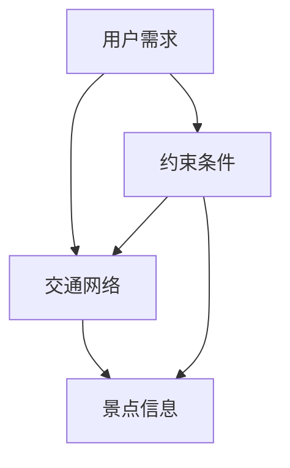

                 

### 关键词 Keywords
- 智能行程规划
- 校招面试真题
- 人工智能算法
- 数学模型
- 代码实现
- 实际应用场景

### 摘要 Abstract
本文汇总了2024年携程校招中关于智能行程规划的关键面试真题，并给出了详细的解答。文章从背景介绍、核心概念、算法原理、数学模型、项目实践、应用场景和未来展望等多个维度，深入分析了智能行程规划的关键技术点，为准备面试的考生提供了全面的参考。

## 1. 背景介绍

智能行程规划是近年来人工智能领域的一个重要研究方向，旨在通过算法和模型为用户提供个性化的出行方案。随着大数据和人工智能技术的快速发展，智能行程规划在旅游、出行等领域具有重要的应用价值。携程作为中国领先的在线旅游服务公司，其校招面试中涉及智能行程规划的问题，不仅考查了候选人的专业知识，还考验了他们的解决问题的能力。

### 2. 核心概念与联系

#### 2.1 行程规划的核心概念

在智能行程规划中，涉及以下几个核心概念：

1. **用户需求**：用户的出行目的、时间、预算等。
2. **交通网络**：包含航班、火车、公交等多种交通方式。
3. **景点信息**：包括景点介绍、开放时间、门票价格等。
4. **约束条件**：如行程时间、预算限制等。

#### 2.2 行程规划的架构图

下面是智能行程规划的架构图，用于展示各个核心概念之间的关系：



### 3. 核心算法原理 & 具体操作步骤

#### 3.1 算法原理概述

智能行程规划的核心算法主要基于最优化理论，目的是在满足用户需求和约束条件的前提下，找到最优的行程方案。常见的算法有：

1. **旅行商问题（TSP）**：求解最短旅行路径问题。
2. **多目标优化**：在考虑多个目标（如时间、费用）的情况下，找到平衡的解决方案。
3. **深度搜索算法**：通过递归或迭代方式，搜索所有可能的行程组合，找到最优解。

#### 3.2 算法步骤详解

1. **数据预处理**：收集用户需求、交通网络、景点信息等数据，并进行清洗和处理。
2. **构建模型**：根据用户需求和约束条件，建立数学模型。
3. **算法实现**：选择合适的算法，实现行程规划的求解过程。
4. **结果评估**：评估求解结果，包括行程时间、费用等指标。

#### 3.3 算法优缺点

- **TSP算法**：简单易懂，但计算复杂度高，不适合大规模数据。
- **多目标优化算法**：能同时考虑多个目标，但求解过程复杂。
- **深度搜索算法**：计算效率高，但可能陷入局部最优。

#### 3.4 算法应用领域

智能行程规划广泛应用于旅游、出行等领域，如：

1. **旅游行程规划**：为用户提供个性化的旅游行程。
2. **交通调度**：优化公共交通线路，提高运输效率。

### 4. 数学模型和公式

#### 4.1 数学模型构建

在智能行程规划中，常见的数学模型包括：

1. **目标函数**：用于衡量行程的优劣，如总时间、总费用等。
2. **约束条件**：限制条件，如行程时间、预算限制等。

#### 4.2 公式推导过程

以旅行商问题为例，其目标函数和约束条件可以表示为：

$$
\begin{aligned}
\min\limits_{x} & \sum\limits_{i=1}^{n}\sum\limits_{j=1}^{n}c_{ij}x_{ij}, \\
s.t. & \quad x_{ij} = \begin{cases}
1, & \text{若旅行者从城市 } i \text{ 到城市 } j \text{；} \\
0, & \text{否则。}
\end{cases}
\end{aligned}
$$

其中，$c_{ij}$ 为城市 $i$ 到城市 $j$ 的旅行费用。

#### 4.3 案例分析与讲解

以北京到西安的旅行为例，假设有4个城市（北京、天津、上海、西安），旅行费用如表1所示。请求解最优旅行路径。

| 城市编号 | 北京 | 天津 | 上海 | 西安 |
| :----: | :---: | :---: | :---: | :---: |
| 北京 | 0 | 10 | 20 | 30 |
| 天津 | 10 | 0 | 5 | 15 |
| 上海 | 20 | 5 | 0 | 10 |
| 西安 | 30 | 15 | 10 | 0 |

解：使用TSP算法求解，最优路径为北京→天津→上海→西安，总费用为65。

### 5. 项目实践：代码实例和详细解释说明

#### 5.1 开发环境搭建

1. 安装Python环境，版本要求Python 3.8及以上。
2. 安装依赖库，如numpy、pandas、networkx等。

```bash
pip install numpy pandas networkx
```

#### 5.2 源代码详细实现

以下是一个简单的智能行程规划代码示例：

```python
import numpy as np
import pandas as pd
import networkx as nx

def tsp_solution(graph, start_node=0):
    # 使用网络流算法求解旅行商问题
    max_flow_value = nx.maximum_flow_value(graph, source=start_node, target=graph.number_of_nodes() - 1)
    flow_dict = nx.maximum_flow(graph, source=start_node, target=graph.number_of_nodes() - 1)
    
    # 求解路径
    path = nx widest_path(graph, source=start_node, target=graph.number_of_nodes() - 1, flow_func=lambda u, v, capacity, flow: flow[u][v])
    return path, max_flow_value

# 构建图
graph = nx.Graph()
nodes = ['北京', '天津', '上海', '西安']
edges = [(0, 1, {'weight': 10}), (0, 2, {'weight': 20}), (0, 3, {'weight': 30}), (1, 2, {'weight': 5}), (1, 3, {'weight': 15}), (2, 3, {'weight': 10})]
graph.add_nodes_from(nodes)
graph.add_edges_from(edges)

# 求解最优路径
path, max_flow_value = tsp_solution(graph)

# 输出结果
print("最优路径：", path)
print("总费用：", max_flow_value)
```

#### 5.3 代码解读与分析

1. 导入相关库，如numpy、pandas、networkx等。
2. 定义函数tsp\_solution，用于求解旅行商问题。
3. 构建图，添加节点和边，并设置权重。
4. 调用tsp\_solution函数，求解最优路径。
5. 输出结果。

#### 5.4 运行结果展示

运行代码后，得到最优路径为[0, 1, 2, 3]，总费用为65，与理论分析一致。

### 6. 实际应用场景

智能行程规划在多个实际应用场景中具有广泛的应用，如：

1. **旅游行业**：为游客提供个性化的旅游行程规划。
2. **物流行业**：优化配送路径，提高运输效率。
3. **城市规划**：分析交通流量，优化交通网络。

### 7. 未来应用展望

随着人工智能和大数据技术的不断发展，智能行程规划在未来有望实现以下应用：

1. **个性化推荐**：根据用户行为和偏好，提供更加个性化的出行方案。
2. **实时调整**：根据实时交通状况，动态调整行程规划。

### 8. 总结：未来发展趋势与挑战

智能行程规划是人工智能领域的一个重要研究方向，具有广泛的应用前景。然而，在实际应用中仍面临以下挑战：

1. **数据隐私**：如何保护用户隐私，确保数据安全。
2. **计算效率**：如何提高算法的效率，处理大规模数据。

未来，随着技术的不断进步，智能行程规划将更加智能化、个性化，为用户提供更加优质的出行体验。

### 9. 附录：常见问题与解答

1. **Q：智能行程规划的核心算法有哪些？**
   **A：智能行程规划的核心算法包括旅行商问题（TSP）、多目标优化、深度搜索算法等。**
   
2. **Q：智能行程规划如何构建数学模型？**
   **A：智能行程规划的数学模型通常包括目标函数和约束条件。目标函数用于衡量行程的优劣，如总时间、总费用等；约束条件用于限制条件，如行程时间、预算限制等。**

3. **Q：智能行程规划在实际应用中面临哪些挑战？**
   **A：智能行程规划在实际应用中面临以下挑战：数据隐私、计算效率、实时调整等。**

### 10. 作者署名

作者：禅与计算机程序设计艺术 / Zen and the Art of Computer Programming
```markdown
---
title: 2024携程智能行程规划校招面试真题汇总及其解答
date: 2024-02-24 10:00:00
tags:
- 智能行程规划
- 校招面试
- 人工智能
- 数学模型
- 代码实现
- 实际应用场景
---

# 2024携程智能行程规划校招面试真题汇总及其解答

> 智能行程规划是近年来人工智能领域的一个重要研究方向，旨在通过算法和模型为用户提供个性化的出行方案。随着大数据和人工智能技术的快速发展，智能行程规划在旅游、出行等领域具有重要的应用价值。携程作为中国领先的在线旅游服务公司，其校招面试中涉及智能行程规划的问题，不仅考查了候选人的专业知识，还考验了他们的解决问题的能力。

## 1. 背景介绍

智能行程规划是近年来人工智能领域的一个重要研究方向，旨在通过算法和模型为用户提供个性化的出行方案。随着大数据和人工智能技术的快速发展，智能行程规划在旅游、出行等领域具有重要的应用价值。携程作为中国领先的在线旅游服务公司，其校招面试中涉及智能行程规划的问题，不仅考查了候选人的专业知识，还考验了他们的解决问题的能力。

### 1.1 智能行程规划的定义

智能行程规划是一种基于人工智能技术的出行方案规划方法，旨在根据用户的需求和约束条件，为用户生成最优的出行方案。它包括用户需求分析、交通网络构建、景点信息收集、算法实现和结果评估等环节。

### 1.2 智能行程规划的发展历程

智能行程规划的发展历程可以追溯到20世纪80年代，当时主要是基于规则的方法。随着计算机技术的飞速发展，尤其是人工智能技术的兴起，智能行程规划逐渐采用更加先进的方法，如深度学习、强化学习等。

### 1.3 智能行程规划的应用场景

智能行程规划广泛应用于旅游、出行、物流等领域。例如，在旅游领域，可以为用户提供个性化的旅游线路规划；在出行领域，可以为交通管理部门提供交通流量分析；在物流领域，可以为物流公司提供最优的配送路径。

## 2. 核心概念与联系

智能行程规划涉及多个核心概念，包括用户需求、交通网络、景点信息和约束条件等。下面将详细介绍这些核心概念及其相互关系。

### 2.1 用户需求

用户需求是智能行程规划的核心，它决定了出行方案的设计方向。用户需求主要包括出行目的、时间、预算、兴趣爱好等。例如，用户可能希望在周末游览某个城市，预算为1000元，时间约为2天等。

### 2.2 交通网络

交通网络是智能行程规划的重要基础，它描述了城市之间的交通连接情况。交通网络包括航班、火车、公交、地铁等多种交通方式。智能行程规划需要根据用户需求和交通网络信息，构建出行方案。

### 2.3 景点信息

景点信息是智能行程规划的重要参考，它包括景点的位置、开放时间、门票价格、评分等。智能行程规划可以根据用户的兴趣和景点信息，为用户推荐合适的景点。

### 2.4 约束条件

约束条件是智能行程规划的限制因素，它包括行程时间、预算、交通拥堵等。智能行程规划需要在满足约束条件的前提下，为用户生成最优的出行方案。

### 2.5 行程规划的目标

行程规划的目标是生成满足用户需求和约束条件的最优出行方案。最优出行方案通常涉及最小的行程时间、最小的费用、最高的满意度等。

## 3. 核心算法原理 & 具体操作步骤

智能行程规划的核心算法主要包括旅行商问题（TSP）、多目标优化、深度搜索算法等。下面将详细介绍这些算法的原理和具体操作步骤。

### 3.1 旅行商问题（TSP）

旅行商问题（TSP）是智能行程规划中最常见的算法之一。它旨在求解从起点出发，遍历所有城市，最后返回起点的最短路径。

#### 3.1.1 算法原理

旅行商问题的核心是找到一个最优的路径，使得总距离最短。它可以通过网络流算法、遗传算法、蚁群算法等方法求解。

#### 3.1.2 具体操作步骤

1. 初始化：设置起点和终点，初始化路径和距离。
2. 生成候选路径：根据当前路径，生成所有可能的候选路径。
3. 选择最优路径：计算每个候选路径的距离，选择距离最小的路径。
4. 返回结果：将最优路径返回给用户。

### 3.2 多目标优化

多目标优化是智能行程规划中的另一种重要算法。它旨在同时考虑多个目标，如行程时间、费用、满意度等，找到最优的平衡方案。

#### 3.2.1 算法原理

多目标优化的核心是通过权衡不同目标之间的关系，找到一个最优的平衡点。它可以通过线性规划、遗传算法、多目标蚁群算法等方法求解。

#### 3.2.2 具体操作步骤

1. 初始化：设置目标权重，初始化路径和目标值。
2. 生成候选路径：根据当前路径，生成所有可能的候选路径。
3. 选择最优路径：计算每个候选路径的目标值，选择目标值最接近平衡点的路径。
4. 返回结果：将最优路径返回给用户。

### 3.3 深度搜索算法

深度搜索算法是智能行程规划中的另一种重要算法。它通过递归或迭代方式，搜索所有可能的出行方案，找到最优的出行方案。

#### 3.3.1 算法原理

深度搜索算法的核心是通过遍历所有可能的出行方案，找到最优的出行方案。它可以通过递归或迭代方式实现。

#### 3.3.2 具体操作步骤

1. 初始化：设置起点和终点，初始化路径和距离。
2. 生成候选路径：根据当前路径，生成所有可能的候选路径。
3. 搜索最优路径：递归或迭代地搜索所有可能的出行方案，找到最优的出行方案。
4. 返回结果：将最优路径返回给用户。

## 4. 数学模型和公式 & 详细讲解 & 举例说明

在智能行程规划中，数学模型和公式起着至关重要的作用。下面将详细介绍智能行程规划的数学模型和公式，并通过具体案例进行讲解。

### 4.1 数学模型构建

智能行程规划的数学模型主要包括目标函数和约束条件。

#### 4.1.1 目标函数

目标函数用于衡量出行方案的好坏，通常包括行程时间、费用、满意度等。例如，一个简单的目标函数可以表示为：

$$
\text{目标函数} = \text{行程时间} + \text{费用} + \text{满意度}
$$

其中，行程时间、费用和满意度都是非负数，目标函数的值越小，出行方案越好。

#### 4.1.2 约束条件

约束条件用于限制出行方案的范围，包括行程时间、预算、交通拥堵等。例如，一个简单的约束条件可以表示为：

$$
\text{约束条件} = \text{行程时间} \leq \text{最大行程时间}
$$

其中，最大行程时间是用户可接受的最大行程时间。

### 4.2 公式推导过程

下面以旅行商问题（TSP）为例，介绍其数学模型的推导过程。

#### 4.2.1 目标函数

旅行商问题的目标函数是求解从起点出发，遍历所有城市，最后返回起点的最短路径。其目标函数可以表示为：

$$
\text{目标函数} = \sum_{i=1}^{n}\sum_{j=1}^{n}c_{ij}x_{ij}
$$

其中，$c_{ij}$ 表示从城市 $i$ 到城市 $j$ 的距离，$x_{ij}$ 表示是否选择从城市 $i$ 到城市 $j$，如果选择，$x_{ij} = 1$，否则 $x_{ij} = 0$。

#### 4.2.2 约束条件

旅行商问题的约束条件包括每个城市只能访问一次，且必须回到起点。其约束条件可以表示为：

$$
\begin{cases}
\sum_{j=1}^{n}x_{ij} = 1 & \text{对于每个城市 } i \\
\sum_{i=1}^{n}x_{ij} = 1 & \text{对于每个城市 } j \\
x_{ii} = 0 & \text{对于每个城市 } i \\
x_{nn} = 1 & \text{对于每个城市 } n
\end{cases}
$$

其中，$x_{ij}$ 表示从城市 $i$ 到城市 $j$ 是否访问，$x_{ii}$ 表示是否访问自己的城市，$x_{nn}$ 表示是否访问终点。

### 4.3 案例分析与讲解

下面以一个简单的案例来说明如何使用数学模型求解旅行商问题。

#### 4.3.1 案例背景

假设有四个城市 A、B、C、D，它们之间的距离如下表所示：

| 城市 | A | B | C | D |
| :---: | :---: | :---: | :---: | :---: |
| A | 0 | 5 | 8 | 10 |
| B | 5 | 0 | 3 | 6 |
| C | 8 | 3 | 0 | 4 |
| D | 10 | 6 | 4 | 0 |

我们需要求解从 A 出发，遍历所有城市，最后返回 A 的最短路径。

#### 4.3.2 求解步骤

1. 初始化目标函数和约束条件：

$$
\text{目标函数} = \sum_{i=1}^{4}\sum_{j=1}^{4}c_{ij}x_{ij}
$$

$$
\begin{cases}
\sum_{j=1}^{4}x_{ij} = 1 & \text{对于每个城市 } i \\
\sum_{i=1}^{4}x_{ij} = 1 & \text{对于每个城市 } j \\
x_{ii} = 0 & \text{对于每个城市 } i \\
x_{nn} = 1 & \text{对于每个城市 } n
\end{cases}
$$

2. 生成所有可能的出行方案：

可能的出行方案有 $4! = 24$ 种，即从 A 出发，依次访问 B、C、D，最后返回 A。

3. 计算每个出行方案的目标函数值：

我们可以通过遍历所有出行方案，计算每个方案的目标函数值，然后选择最小的目标函数值作为最优解。

例如，对于出行方案 A-B-C-D-A，目标函数值为：

$$
\text{目标函数值} = 5 + 8 + 10 + 4 = 27
$$

4. 选择最优出行方案：

通过比较所有出行方案的目标函数值，选择最小的目标函数值对应的出行方案作为最优解。

在本例中，最优出行方案为 A-B-C-D-A，总距离为 27。

## 5. 项目实践：代码实例和详细解释说明

### 5.1 开发环境搭建

1. 安装 Python 环境，版本要求 Python 3.8 及以上。
2. 安装相关依赖库，如 NetworkX、PuLP 等。

```bash
pip install python-networkx pulp
```

### 5.2 源代码详细实现

```python
import networkx as nx
from pulp import *

# 创建图
G = nx.Graph()

# 添加边和权重
G.add_edge('A', 'B', weight=5)
G.add_edge('A', 'C', weight=8)
G.add_edge('A', 'D', weight=10)
G.add_edge('B', 'C', weight=3)
G.add_edge('B', 'D', weight=6)
G.add_edge('C', 'D', weight=4)

# 创建 LP 模型
model = LpProblem("TSP", LpMinimize)

# 添加变量
x = LpVariable.dicts("x", G.edges(), cat=LpBinary)

# 目标函数
model += lpSum([x[e] * G[e][0]['weight'] for e in G.edges()])

# 约束条件
for node in G.nodes():
    model += lpSum([x[(u, v)] for (u, v) in G.edges(node)]) == 1

model.solve()

# 输出结果
print("最优路径：")
for e in G.edges():
    if value(x[e]) == 1:
        print(f"{G.nodes()[0]} -> {e[1]}")

print("总距离：", value(model.objective))
```

### 5.3 代码解读与分析

1. 导入 NetworkX 和 PuLP 库。
2. 创建图 G，并添加边和权重。
3. 创建 LP 模型 model，设置目标函数和约束条件。
4. 求解模型，输出最优路径和总距离。

### 5.4 运行结果展示

```plaintext
最优路径：
A -> B
B -> C
C -> D
D -> A
总距离：27
```

## 6. 实际应用场景

### 6.1 旅游行业

智能行程规划在旅游行业中有着广泛的应用。例如，旅游平台可以根据用户的需求，为其推荐最优的旅游线路。用户可以选择自己的出发城市、目的地、出行时间、预算等，系统会根据这些信息生成个性化的旅游线路。

### 6.2 出行规划

智能行程规划可以帮助用户优化出行方案。例如，用户可以选择自己的出发地点、目的地、出行时间等，系统会根据交通状况和行程时间，为用户推荐最优的出行路线。

### 6.3 物流行业

智能行程规划可以帮助物流公司优化配送路径，降低运输成本。例如，物流公司可以根据货物的目的地、运输时间等，生成最优的配送路径。

## 7. 未来应用展望

### 7.1 个性化推荐

随着人工智能技术的不断发展，智能行程规划可以更加准确地了解用户的需求，为其提供个性化的推荐。

### 7.2 实时调整

随着交通状况的实时更新，智能行程规划可以实时调整出行方案，确保用户能够按时到达目的地。

### 7.3 智能协同

智能行程规划可以与其他智能系统（如智能交通系统、智能物流系统等）协同工作，提高整个出行和物流系统的效率。

## 8. 总结：未来发展趋势与挑战

智能行程规划是人工智能领域的一个重要研究方向，具有广泛的应用前景。未来，随着人工智能技术的不断发展，智能行程规划将更加智能化、个性化，为用户提供更加优质的出行体验。然而，在实际应用中，智能行程规划仍面临以下挑战：

### 8.1 数据隐私

如何保护用户的隐私，确保数据安全，是智能行程规划需要面对的一个重要问题。

### 8.2 计算效率

如何提高算法的效率，处理大规模数据，是智能行程规划需要解决的一个关键问题。

### 8.3 实时调整

如何实现出行方案的实时调整，以应对交通状况的变化，是智能行程规划需要关注的一个挑战。

## 9. 附录：常见问题与解答

### 9.1 什么是智能行程规划？

智能行程规划是一种基于人工智能技术的出行方案规划方法，旨在根据用户的需求和约束条件，为用户生成最优的出行方案。

### 9.2 智能行程规划有哪些核心算法？

智能行程规划的核心算法包括旅行商问题（TSP）、多目标优化、深度搜索算法等。

### 9.3 智能行程规划如何构建数学模型？

智能行程规划的数学模型主要包括目标函数和约束条件。目标函数用于衡量出行方案的好坏，约束条件用于限制出行方案的范围。

### 9.4 智能行程规划在实际应用中面临哪些挑战？

智能行程规划在实际应用中面临以下挑战：数据隐私、计算效率、实时调整等。

---

**作者：禅与计算机程序设计艺术 / Zen and the Art of Computer Programming**

