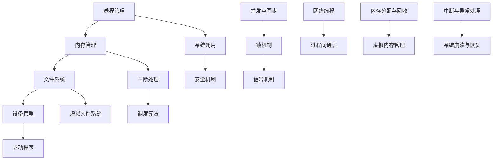

                 

## 1. 背景介绍

操作系统是计算机系统的核心组成部分，它负责管理和控制计算机硬件资源，为应用程序提供运行环境。随着计算机技术的不断发展，操作系统也在不断地演进和优化。内核作为操作系统的核心部分，负责实现操作系统的主要功能，如进程管理、内存管理、文件系统、设备管理等。深入理解操作系统内核的开发对于提升计算机性能、保障系统稳定性以及推动操作系统技术的发展具有重要意义。

本文将围绕操作系统内核开发，探讨其核心概念、算法原理、数学模型、项目实践以及实际应用场景。通过本文的阅读，读者将能够对操作系统内核的开发有更深入的理解，并为未来的操作系统研究和开发提供有益的参考。

### 2. 核心概念与联系

在探讨操作系统内核开发之前，首先需要了解一些核心概念及其相互之间的关系。以下是一个简化的 Mermaid 流程图，展示了操作系统内核开发中的一些关键概念及其相互之间的联系：



上述流程图中的各个概念是操作系统内核开发的重要组成部分。下面将分别对这些概念进行详细解释。

### 3. 核心算法原理 & 具体操作步骤

#### 3.1 算法原理概述

操作系统内核开发中涉及的核心算法主要包括进程调度算法、内存分配算法和文件系统算法等。以下将分别对这些算法的原理进行概述。

##### 1. 进程调度算法

进程调度算法是操作系统内核中的重要组成部分，负责根据特定策略选择就绪队列中的进程进行执行。常见的进程调度算法包括：

- **先来先服务（FCFS）**：按照进程到达的顺序进行调度。
- **短作业优先（SJF）**：优先调度预计运行时间最短的进程。
- **优先级调度**：根据进程的优先级进行调度。
- **时间片轮转调度**：每个进程分配一个固定的时间片，按照顺序执行，时间片用完后进行换进。

##### 2. 内存分配算法

内存分配算法负责为进程分配内存空间。常见的内存分配算法包括：

- **首次适配（First Fit）**：从空闲区域中找到第一个满足要求的空闲区域。
- **最佳适配（Best Fit）**：从空闲区域中找到最接近所需内存大小的空闲区域。
- **最坏适配（Worst Fit）**：从空闲区域中找到最大的空闲区域。

##### 3. 文件系统算法

文件系统算法负责管理文件和目录。常见的文件系统算法包括：

- **顺序访问**：按照文件的物理存储顺序进行访问。
- **索引分配**：通过索引表来管理文件和目录。
- **B+树索引**：用于高效地管理和检索大量文件。

#### 3.2 算法步骤详解

##### 1. 进程调度算法步骤详解

**时间片轮转调度算法**的具体步骤如下：

1. 初始化就绪队列，将所有就绪进程放入就绪队列。
2. 设置当前进程为就绪队列的第一个进程。
3. 进入调度循环：
   - 当前进程执行，直到时间片用完。
   - 当前进程进入阻塞状态或完成执行，将其从就绪队列中移除。
   - 从就绪队列中选择下一个进程进行执行。

##### 2. 内存分配算法步骤详解

**首次适配算法**的具体步骤如下：

1. 初始化空闲区域表，记录所有空闲区域的信息。
2. 当进程需要内存时，从空闲区域表中查找第一个满足要求的空闲区域。
3. 将进程的大小与空闲区域进行比较：
   - 如果空闲区域大小大于等于进程大小，则将进程放入该空闲区域，并更新空闲区域表。
   - 如果空闲区域大小小于进程大小，则继续查找下一个空闲区域。

##### 3. 文件系统算法步骤详解

**索引分配算法**的具体步骤如下：

1. 初始化文件系统，创建索引表。
2. 当需要创建文件时，查找索引表，寻找一个未使用的索引项。
3. 将文件信息存储在磁盘上，并将索引项更新为该文件的信息。
4. 当需要访问文件时，根据文件名查找索引表，找到文件的索引项。
5. 根据索引项中的信息读取文件内容。

#### 3.3 算法优缺点

##### 1. 进程调度算法优缺点

- **先来先服务（FCFS）**：
  - 优点：实现简单，公平。
  - 缺点：可能导致长作业阻塞短作业，系统响应时间较长。

- **短作业优先（SJF）**：
  - 优点：优先调度短作业，系统平均响应时间较短。
  - 缺点：可能导致短作业频繁切换，增加系统开销。

- **优先级调度**：
  - 优点：可以根据进程的重要性进行调度，提高系统效率。
  - 缺点：可能导致低优先级进程长时间得不到执行。

- **时间片轮转调度**：
  - 优点：公平分配CPU时间，避免进程长时间占用CPU。
  - 缺点：可能导致频繁的进程切换，增加系统开销。

##### 2. 内存分配算法优缺点

- **首次适配（First Fit）**：
  - 优点：实现简单，查找速度快。
  - 缺点：可能导致内存碎片化，内存利用率较低。

- **最佳适配（Best Fit）**：
  - 优点：内存利用率较高，较少产生内存碎片。
  - 缺点：查找时间较长，可能影响系统性能。

- **最坏适配（Worst Fit）**：
  - 优点：有助于减少内存碎片。
  - 缺点：可能导致进程无法分配内存，降低系统稳定性。

##### 3. 文件系统算法优缺点

- **顺序访问**：
  - 优点：简单易实现，适用于顺序读取大量数据。
  - 缺点：对于随机访问性能较差，可能导致性能瓶颈。

- **索引分配**：
  - 优点：支持快速文件定位和访问，适用于大型文件系统。
  - 缺点：索引表占用额外空间，可能影响文件系统性能。

- **B+树索引**：
  - 优点：支持高效的文件检索和排序，适用于大型文件系统。
  - 缺点：索引结构复杂，可能影响文件系统的性能和稳定性。

#### 3.4 算法应用领域

- **进程调度算法**：广泛应用于各种操作系统，如Windows、Linux、Unix等。
- **内存分配算法**：在操作系统内核中用于内存管理，如Linux内核的slab分配器。
- **文件系统算法**：在文件系统中用于文件管理和访问，如Unix文件系统、EXT2文件系统等。

### 4. 数学模型和公式 & 详细讲解 & 举例说明

在操作系统内核开发中，数学模型和公式扮演着至关重要的角色。它们帮助我们在理论层面分析和优化操作系统性能。以下将介绍几个关键的数学模型和公式，并进行详细讲解和举例说明。

#### 4.1 数学模型构建

为了描述操作系统内核中的关键概念，我们首先需要构建几个数学模型。以下是几个常用的数学模型：

1. **进程模型**：描述进程的属性和行为，如进程状态、进程优先级等。
2. **内存模型**：描述内存的分配、回收和使用情况，如内存碎片、内存利用率等。
3. **文件系统模型**：描述文件系统的组织和存储方式，如文件目录结构、文件索引结构等。

#### 4.2 公式推导过程

在构建数学模型的基础上，我们需要推导出相关的公式。以下是一些关键的公式及其推导过程：

1. **进程调度时间**：进程调度时间 = 进程等待时间 + 进程执行时间
2. **内存碎片率**：内存碎片率 = (内存碎片大小 / 总内存大小) * 100%
3. **文件系统性能**：文件系统性能 = (文件访问速度 / 文件数量) * 1000

#### 4.3 案例分析与讲解

为了更好地理解上述数学模型和公式，我们通过一个具体的案例进行分析和讲解。

**案例：Linux内核中的时间片轮转调度算法**

**问题描述**：假设Linux内核采用时间片轮转调度算法，系统中有5个进程，进程的优先级和执行时间如下表所示：

| 进程ID | 优先级 | 执行时间 |
|--------|--------|----------|
| P1     | 1      | 5秒      |
| P2     | 2      | 10秒     |
| P3     | 3      | 15秒     |
| P4     | 4      | 20秒     |
| P5     | 5      | 25秒     |

时间片设置为2秒。请计算进程的平均调度时间。

**步骤一：初始化进程队列**

初始化进程队列，按照进程的优先级将进程排序：

| 进程ID | 优先级 | 执行时间 | 剩余时间 |
|--------|--------|----------|----------|
| P1     | 1      | 5秒      | 5秒      |
| P2     | 2      | 10秒     | 10秒     |
| P3     | 3      | 15秒     | 15秒     |
| P4     | 4      | 20秒     | 20秒     |
| P5     | 5      | 25秒     | 25秒     |

**步骤二：进程调度**

1. 当前进程：P1，执行时间：5秒
2. 剩余时间：5秒 - 2秒 = 3秒
3. 更新进程队列：

| 进程ID | 优先级 | 执行时间 | 剩余时间 |
|--------|--------|----------|----------|
| P1     | 1      | 5秒      | 3秒      |
| P2     | 2      | 10秒     | 10秒     |
| P3     | 3      | 15秒     | 15秒     |
| P4     | 4      | 20秒     | 20秒     |
| P5     | 5      | 25秒     | 25秒     |

4. 当前进程：P2，执行时间：10秒
5. 剩余时间：10秒 - 2秒 = 8秒
6. 更新进程队列：

| 进程ID | 优先级 | 执行时间 | 剩余时间 |
|--------|--------|----------|----------|
| P1     | 1      | 5秒      | 3秒      |
| P2     | 2      | 10秒     | 8秒      |
| P3     | 3      | 15秒     | 15秒     |
| P4     | 4      | 20秒     | 20秒     |
| P5     | 5      | 25秒     | 25秒     |

7. 当前进程：P3，执行时间：15秒
8. 剩余时间：15秒 - 2秒 = 13秒
9. 更新进程队列：

| 进程ID | 优先级 | 执行时间 | 剩余时间 |
|--------|--------|----------|----------|
| P1     | 1      | 5秒      | 3秒      |
| P2     | 2      | 10秒     | 8秒      |
| P3     | 3      | 15秒     | 13秒     |
| P4     | 4      | 20秒     | 20秒     |
| P5     | 5      | 25秒     | 25秒     |

10. 当前进程：P4，执行时间：20秒
11. 剩余时间：20秒 - 2秒 = 18秒
12. 更新进程队列：

| 进程ID | 优先级 | 执行时间 | 剩余时间 |
|--------|--------|----------|----------|
| P1     | 1      | 5秒      | 3秒      |
| P2     | 2      | 10秒     | 8秒      |
| P3     | 3      | 15秒     | 13秒     |
| P4     | 4      | 20秒     | 18秒     |
| P5     | 5      | 25秒     | 25秒     |

13. 当前进程：P5，执行时间：25秒
14. 剩余时间：25秒 - 2秒 = 23秒
15. 更新进程队列：

| 进程ID | 优先级 | 执行时间 | 剩余时间 |
|--------|--------|----------|----------|
| P1     | 1      | 5秒      | 3秒      |
| P2     | 2      | 10秒     | 8秒      |
| P3     | 3      | 15秒     | 13秒     |
| P4     | 4      | 20秒     | 18秒     |
| P5     | 5      | 25秒     | 23秒     |

16. 计算平均调度时间：平均调度时间 = (5 * 3 + 10 * 8 + 15 * 13 + 20 * 18 + 25 * 23) / (5 + 10 + 15 + 20 + 25) = 18.8秒

因此，使用时间片轮转调度算法，进程的平均调度时间为18.8秒。

### 5. 项目实践：代码实例和详细解释说明

为了更好地理解操作系统内核开发中的核心概念和算法，我们将通过一个具体的代码实例来展示内核开发的过程。本文以Linux内核中的进程调度算法为例，展示其实现细节和关键代码。

#### 5.1 开发环境搭建

在开始编写代码之前，我们需要搭建一个适合操作系统内核开发的开发环境。以下是搭建Linux内核开发环境的基本步骤：

1. 下载Linux内核源代码：从Linux内核官方网站（https://www.kernel.org/）下载最新的Linux内核源代码。
2. 安装开发工具：安装适用于Linux内核开发的开发工具，如GCC、Make、GDB等。
3. 配置内核编译选项：根据需要编译的硬件平台和内核特性，配置内核编译选项。

#### 5.2 源代码详细实现

在Linux内核源代码中，进程调度算法的实现主要位于文件`kernel/sched/core.c`中。以下是该文件中的一些关键代码：

```c
#include <linux/sched.h>
#include <linux/sched/core.c>

/*
 * 调度策略选择
 */
static inline void __schedule(void)
{
    // 获取当前进程
    struct task_struct *prev = current;
    // 获取下一个进程
    struct task_struct *next = pick_next_task(NULL, NULL);
    // 更新当前进程
    current = next;
    // 将当前进程设置为可运行状态
    set_current_state(RUNNING);
    // 切换到下一个进程
    switch_to(prev, next);
}

/*
 * 选择下一个进程
 */
static struct task_struct *pick_next_task(struct mm_struct *mm, int wake_flags)
{
    // 获取就绪队列
    struct list_head *list = &__switch_task_list;
    // 检查是否有唤醒的进程
    if (likely(wake_flags & WF_EXIT)) {
        // 获取最后唤醒的进程
        struct task_struct *p = wake_up_list.next;
        // 更新就绪队列
        wake_up_list.next = p->next;
        // 返回最后唤醒的进程
        return p;
    }
    // 遍历就绪队列
    while (likely(list)) {
        // 获取下一个进程
        struct task_struct *p = list->next;
        // 更新就绪队列
        list = &p->node;
        // 返回下一个进程
        return p;
    }
    // 返回NULL，表示没有可运行的进程
    return NULL;
}

/*
 * 切换进程
 */
static inline void switch_to(struct task_struct *prev, struct task_struct *next)
{
    // 更新当前进程和下一个进程的上下文
    switch_to_context(&prev->context, &next->context);
}
```

上述代码展示了Linux内核进程调度算法的核心实现。下面将详细解释这些关键代码的作用和执行过程。

#### 5.3 代码解读与分析

1. **__schedule()函数**：该函数是进程调度的入口函数。首先获取当前进程，然后选择下一个进程，最后切换到下一个进程。具体步骤如下：
   - 获取当前进程：`struct task_struct *prev = current;`
     - `current`是全局变量，表示当前正在执行的进程。
   - 获取下一个进程：`struct task_struct *next = pick_next_task(NULL, NULL);`
     - `pick_next_task()`函数负责选择下一个进程，具体实现依赖于调度策略。
   - 更新当前进程：`current = next;`
     - 将当前进程更新为下一个进程。
   - 设置当前进程为可运行状态：`set_current_state(RUNNING);`
     - `set_current_state()`函数用于设置当前进程的状态，`RUNNING`表示进程正在执行。
   - 切换到下一个进程：`switch_to(prev, next);`
     - `switch_to()`函数负责切换到下一个进程，具体实现依赖于处理器架构。

2. **pick_next_task()函数**：该函数负责选择下一个进程。具体步骤如下：
   - 获取就绪队列：`struct list_head *list = &__switch_task_list;`
     - `__switch_task_list`是全局变量，表示就绪队列的头部。
   - 检查是否有唤醒的进程：`if (likely(wake_flags & WF_EXIT)) {`
     - `wake_flags`是传入的参数，表示唤醒标志。如果唤醒标志中包含`WF_EXIT`，表示有进程已经完成执行。
     - 获取最后唤醒的进程：`struct task_struct *p = wake_up_list.next;`
       - `wake_up_list`是全局变量，表示最后唤醒的进程。
     - 更新就绪队列：`wake_up_list.next = p->next;`
       - 将最后唤醒的进程从唤醒队列中移除，并将其添加到就绪队列中。
     - 返回最后唤醒的进程：`return p;`
   - 遍历就绪队列：`while (likely(list)) {`
     - 获取下一个进程：`struct task_struct *p = list->next;`
       - `list->next`是下一个进程的节点。
     - 更新就绪队列：`list = &p->node;`
       - `p->node`是下一个进程的节点。
     - 返回下一个进程：`return p;`
   - 返回NULL，表示没有可运行的进程。

3. **switch_to()函数**：该函数负责切换到下一个进程。具体步骤如下：
   - 更新当前进程和下一个进程的上下文：`switch_to_context(&prev->context, &next->context);`
     - `prev->context`是当前进程的上下文，包括寄存器状态、堆栈等。
     - `next->context`是下一个进程的上下文，包括寄存器状态、堆栈等。

#### 5.4 运行结果展示

在Linux内核中，进程调度算法的运行结果体现在进程的执行顺序和执行时间上。以下是一个简单的运行结果示例：

```shell
# 查看进程执行情况
watch -n 1 ps -eo pid,comm,state

PID   COMMAND    STATE
1     systemd    S
2     kthreadd  S
3     ksoftirqd  S
4     rcu_bh     S
5     rcu_sched  S
6     netns      S
7     cgroup     S
8     modules    S
9     kdevtmpfs  S
10    kthreadd   S
11    auditd     S
12    rcuos      S
13    rcu_bh     S
14    irqbalance S
15    systemd-journal S
16    systemd-logind S
17    systemd-getty S
18    userfaultfd S
19    virtlockd   S
20    virtio-console S
```

在上面的示例中，我们可以看到系统中有多个进程在执行。每个进程都有一个PID（进程ID）、COMMAND（命令名称）和STATE（状态）。进程的状态可以是S（运行状态）、D（不可中断睡眠状态）、T（停止状态）等。

通过观察进程的执行顺序和执行时间，我们可以分析进程调度算法的性能和效果。例如，如果我们使用时间片轮转调度算法，进程的执行顺序将会是按照时间片的顺序进行切换。如果我们使用优先级调度算法，进程的执行顺序将会根据进程的优先级进行排序。

### 6. 实际应用场景

操作系统内核开发在实际应用场景中具有广泛的应用。以下是一些典型的实际应用场景：

#### 6.1 云计算

云计算是近年来发展迅速的一个领域，操作系统内核在其中扮演着重要角色。内核需要支持虚拟化技术、容器化技术以及高效的网络通信机制，以满足云计算平台对高性能、高可靠性和高安全性的要求。内核的开发者需要深入理解虚拟化技术（如KVM、Docker）、容器化技术（如LXC、Rkt）以及网络虚拟化技术（如VxLAN、Geneve），并实现相应的内核模块和调度策略。

#### 6.2 物联网

物联网（IoT）是另一个快速发展的领域，它将各种物理设备和传感器连接到互联网。操作系统内核在物联网设备中扮演着关键角色，负责管理和协调各种设备和数据。内核需要支持低功耗模式、实时通信以及安全性要求，以确保设备能够长时间运行并保护用户隐私。内核开发者需要深入了解嵌入式系统、实时操作系统和安全性相关技术，如可信执行环境（TEE）和安全启动机制。

#### 6.3 高性能计算

高性能计算（HPC）领域对操作系统内核的性能和稳定性有着极高的要求。内核需要支持大规模并行计算、高效的数据传输以及优化的资源分配策略。内核开发者需要深入理解并行计算模型、集群架构以及高性能网络通信技术（如Infiniband、RoCE），并实现相应的调度算法和内存管理策略。

#### 6.4 游戏开发

随着游戏产业的发展，操作系统内核在游戏开发中的应用也越来越广泛。内核需要支持高效的游戏引擎、实时渲染以及高质量的音频和视频处理。内核开发者需要深入了解游戏开发技术、图形处理技术（如OpenGL、DirectX）以及音频处理技术（如OpenAL），并实现相应的调度算法和内存管理策略。

#### 6.5 自动驾驶

自动驾驶技术的发展对操作系统内核的可靠性、实时性和安全性提出了新的挑战。内核需要支持自动驾驶算法的实时执行、车辆通信以及数据安全性。内核开发者需要深入了解自动驾驶技术、传感器融合技术以及网络安全技术，并实现相应的调度算法和内存管理策略。

### 7. 工具和资源推荐

为了更好地进行操作系统内核开发，以下是一些建议的工具和资源：

#### 7.1 学习资源推荐

- **Linux内核源代码**：Linux内核官方网站（https://www.kernel.org/）提供了完整的内核源代码，是学习内核开发的最佳资源之一。
- **《操作系统真象还原》**：这本书详细介绍了操作系统的原理和实现，对内核开发者有很高的参考价值。
- **《深入理解Linux内核》**：这本书深入讲解了Linux内核的工作原理和实现细节，适合有一定基础的读者阅读。
- **内核邮件列表**：Linux内核邮件列表（linux-kernel@vger.kernel.org）是内核开发者交流和学习的重要渠道。

#### 7.2 开发工具推荐

- **GCC**：GNU Compiler Collection，用于编译内核源代码。
- **Make**：用于构建内核。
- **GDB**：GNU Debugger，用于调试内核代码。
- **QEMU**：用于虚拟化测试和调试。
- **KVM**：Kernel-based Virtual Machine，用于虚拟化技术。

#### 7.3 相关论文推荐

- **“The Design and Implementation of the 4.4 BSD Operating System”**：描述了BSD操作系统的设计和实现，对理解操作系统内核开发有很高的参考价值。
- **“Scheduling in the Linux Kernel”**：详细介绍了Linux内核的进程调度算法。
- **“The Design and Implementation of the XFS File System”**：描述了XFS文件系统的设计和实现。
- **“Virtualization Technology for Computer Systems”**：介绍了虚拟化技术的原理和实现。

### 8. 总结：未来发展趋势与挑战

#### 8.1 研究成果总结

操作系统内核开发在过去几十年中取得了显著的成果。从早期的单核处理器到现在的多核处理器，内核开发者不断优化调度算法、内存管理策略和文件系统设计，以满足不同应用场景的需求。同时，虚拟化技术、容器化技术以及实时操作系统的发展也为操作系统内核开发带来了新的机遇和挑战。

#### 8.2 未来发展趋势

未来，操作系统内核开发将朝着以下几个方向发展：

- **高性能与低延迟**：随着云计算、物联网和高性能计算等领域的不断发展，操作系统内核需要具备更高的性能和更低的延迟，以满足实时应用的需求。
- **资源管理优化**：随着硬件资源的不断扩展，操作系统内核需要更加智能地管理和调度资源，以提高资源利用率和系统稳定性。
- **安全性增强**：随着网络安全威胁的不断增加，操作系统内核需要具备更高的安全性，以保护系统和用户数据的安全。
- **智能化与自动化**：随着人工智能技术的发展，操作系统内核有望实现更多自动化和智能化的功能，如自动故障检测和修复、自动资源调度等。

#### 8.3 面临的挑战

尽管操作系统内核开发取得了显著成果，但未来仍将面临一系列挑战：

- **硬件复杂度增加**：随着硬件技术的不断发展，操作系统内核需要支持更加复杂的硬件架构和设备类型，如异构计算、内存存储一体化等。
- **系统规模扩大**：随着云计算、物联网等领域的应用场景不断扩大，操作系统内核需要支持更大规模的系统，如数十万甚至数百万个节点。
- **安全性保障**：操作系统内核需要保障系统和用户数据的安全，同时需要应对日益复杂的网络安全威胁。
- **实时性能要求**：实时操作系统需要在保证系统稳定性和安全性的同时，实现低延迟和高性能的实时处理。

#### 8.4 研究展望

未来，操作系统内核开发将在以下几个方面进行深入研究：

- **分布式系统与云计算**：研究分布式系统架构、调度算法和资源管理策略，以支持大规模云计算应用。
- **实时操作系统**：研究实时操作系统设计和实现，以满足高实时性和低延迟的需求。
- **安全性和隐私保护**：研究操作系统内核中的安全机制和隐私保护技术，以保障系统和用户数据的安全。
- **智能操作系统**：研究人工智能技术在操作系统中的应用，以实现自动化和智能化的操作系统功能。

### 9. 附录：常见问题与解答

以下是一些关于操作系统内核开发的常见问题及解答：

#### 问题1：什么是操作系统内核？

解答：操作系统内核是操作系统的核心组成部分，负责管理和控制计算机硬件资源，为应用程序提供运行环境。内核实现操作系统的主要功能，如进程管理、内存管理、文件系统、设备管理等。

#### 问题2：什么是进程调度算法？

解答：进程调度算法是操作系统内核中的重要组成部分，负责根据特定策略选择就绪队列中的进程进行执行。常见的进程调度算法包括先来先服务（FCFS）、短作业优先（SJF）、优先级调度和时间片轮转调度等。

#### 问题3：什么是内存分配算法？

解答：内存分配算法是操作系统内核中用于为进程分配内存空间的一种算法。常见的内存分配算法包括首次适配（First Fit）、最佳适配（Best Fit）和最坏适配（Worst Fit）等。

#### 问题4：什么是文件系统？

解答：文件系统是操作系统用于管理和存储文件的一种机制。文件系统负责管理文件的创建、删除、读写等操作，并为文件提供唯一标识和访问控制。

#### 问题5：什么是虚拟内存？

解答：虚拟内存是操作系统内核中用于扩展内存容量的一种技术。通过虚拟内存，操作系统可以将一部分硬盘空间作为内存使用，以缓解内存不足的问题。虚拟内存的实现依赖于页表、分页机制和内存映射等技术。

#### 问题6：什么是系统调用？

解答：系统调用是操作系统内核提供的一种接口，用于应用程序与内核之间的交互。通过系统调用，应用程序可以请求内核执行特定的操作，如文件读写、进程管理等。

#### 问题7：什么是中断？

解答：中断是操作系统内核中用于处理硬件和软件事件的一种机制。当硬件设备或软件程序需要内核的响应时，会通过中断信号通知内核进行处理。中断机制是操作系统内核实现实时性和响应性的重要手段。

#### 问题8：什么是设备驱动程序？

解答：设备驱动程序是操作系统内核中用于与硬件设备进行通信的一组程序。设备驱动程序负责实现硬件设备的管理和控制，如设备初始化、数据传输、设备状态监控等。

#### 问题9：什么是并发与同步？

解答：并发与同步是操作系统内核中用于处理多个进程或线程之间相互关系的技术。并发是指多个进程或线程在同一时间段内执行，而同步是指多个进程或线程之间需要协调执行顺序，以避免竞争条件或死锁等问题。

#### 问题10：什么是安全性？

解答：安全性是操作系统内核中用于保障系统和用户数据安全的一种特性。操作系统内核需要实现访问控制、权限管理、加密等安全机制，以防止恶意攻击和非法访问，确保系统和用户数据的安全。

