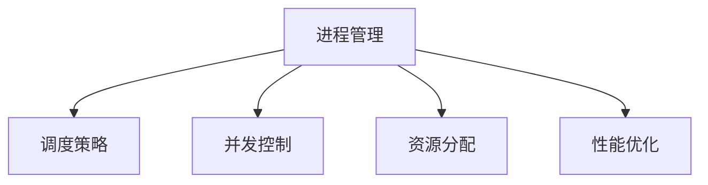

                 

关键词：操作系统、进程管理、调度策略、并发控制、资源分配、性能优化。

> 摘要：本文将深入探讨操作系统中的进程管理策略，包括调度策略、并发控制、资源分配和性能优化等方面。通过对不同策略的原理、优缺点及其在实际应用中的表现进行分析，旨在为操作系统设计和优化提供有益的参考。

## 1. 背景介绍

在操作系统中，进程管理是一项至关重要的功能。进程是计算机程序执行时的一个实例，它代表了程序的执行状态和资源占用情况。操作系统通过进程管理来协调多进程的执行，确保系统的稳定性和效率。进程管理涉及多个方面，包括进程的创建、调度、同步、通信和终止等。

进程管理策略主要包括以下几个方面：

1. **调度策略**：决定进程在处理器上的执行顺序，以优化系统性能和响应时间。
2. **并发控制**：确保多个进程能够正确地共享系统资源，防止资源冲突。
3. **资源分配**：根据进程的需求和系统资源状况，合理分配CPU、内存和其他资源。
4. **性能优化**：通过调整系统参数和策略，提高系统整体的运行效率和响应速度。

本文将重点比较不同操作系统中的进程管理策略，分析其原理、优缺点以及在实际应用中的表现，以期为操作系统设计和优化提供参考。

## 2. 核心概念与联系

### 2.1 进程的概念

进程（Process）是计算机中正在运行的程序实例。它包含了程序代码、数据、堆栈等运行时所需的资源，并在操作系统管理下执行。进程是操作系统中最基本的执行单元，也是资源分配和调度的基本单位。

### 2.2 调度策略

调度策略（Scheduling Policy）是操作系统用于确定进程在处理器上执行顺序的规则。不同的调度策略有不同的目标和特点，包括：

- **先来先服务（FCFS）**：按照进程到达的顺序执行。
- **短作业优先（SJF）**：优先执行估计运行时间最短的进程。
- **优先级调度**：根据进程的优先级来决定执行顺序。
- **时间片轮转调度**：每个进程分配一个固定的时间片，按照顺序执行。

### 2.3 并发控制

并发控制（Concurrency Control）是确保多个进程能够正确地共享系统资源的机制。常见的并发控制方法包括：

- **互斥锁（Mutex）**：用于保护临界区，确保同一时刻只有一个进程能够访问。
- **信号量（Semaphore）**：用于控制多个进程对共享资源的访问，实现进程间的同步。
- **条件变量（Condition Variable）**：与信号量结合使用，用于进程间的条件同步。

### 2.4 资源分配

资源分配（Resource Allocation）是指操作系统根据进程的需求和系统资源状况，合理分配CPU、内存和其他资源的过程。资源分配策略包括：

- **固定分配**：为每个进程分配固定数量的资源。
- **动态分配**：根据进程的需求动态调整资源的分配。
- **按需分配**：仅在进程需要时分配资源。

### 2.5 性能优化

性能优化（Performance Optimization）是指通过调整系统参数和策略，提高系统整体的运行效率和响应速度。常见的优化方法包括：

- **预占策略**：提前分配资源，减少进程等待时间。
- **负载均衡**：通过负载均衡算法，合理分配系统资源，提高整体性能。

### 2.6 Mermaid 流程图



## 3. 核心算法原理 & 具体操作步骤

### 3.1 算法原理概述

进程管理中的核心算法主要涉及调度算法、并发控制算法和资源分配算法。

- **调度算法**：用于确定进程在处理器上的执行顺序，常见的调度算法有FCFS、SJF、优先级调度和时间片轮转调度等。
- **并发控制算法**：用于确保多个进程能够正确地共享系统资源，常见的算法有互斥锁、信号量和条件变量等。
- **资源分配算法**：用于根据进程的需求和系统资源状况，合理分配CPU、内存和其他资源，常见的算法有固定分配、动态分配和按需分配等。

### 3.2 算法步骤详解

#### 3.2.1 调度算法

1. **FCFS调度算法**：
   - 步骤1：将进程按照到达顺序放入队列。
   - 步骤2：依次执行队列中的进程。

2. **SJF调度算法**：
   - 步骤1：估计每个进程的运行时间。
   - 步骤2：将进程按照估计运行时间排序。
   - 步骤3：依次执行排序后的进程。

3. **优先级调度算法**：
   - 步骤1：为每个进程分配优先级。
   - 步骤2：根据优先级排序进程。
   - 步骤3：依次执行优先级高的进程。

4. **时间片轮转调度算法**：
   - 步骤1：为每个进程分配一个时间片。
   - 步骤2：按照顺序执行进程，每个进程执行时间片长度。
   - 步骤3：如果进程在时间片内未完成，则将其放入队列的末尾，等待下一次执行。

#### 3.2.2 并发控制算法

1. **互斥锁**：
   - 步骤1：进程在进入临界区前，尝试获取互斥锁。
   - 步骤2：如果互斥锁可用，则获取锁并进入临界区。
   - 步骤3：在临界区内执行代码。
   - 步骤4：执行完成后释放互斥锁。

2. **信号量**：
   - 步骤1：初始化信号量为资源数量。
   - 步骤2：进程在访问资源前，执行P操作（信号量减1，若小于0则等待）。
   - 步骤3：进程在释放资源后，执行V操作（信号量加1，唤醒等待的进程）。

3. **条件变量**：
   - 步骤1：进程在满足条件前，执行条件变量的等待操作。
   - 步骤2：在条件成立时，执行条件变量的唤醒操作。

#### 3.2.3 资源分配算法

1. **固定分配**：
   - 步骤1：在进程创建时，为其分配固定数量的资源。
   - 步骤2：进程运行时，始终保持固定的资源分配。

2. **动态分配**：
   - 步骤1：在进程运行过程中，根据需求动态调整资源分配。
   - 步骤2：根据进程的优先级和系统资源状况，合理分配资源。

3. **按需分配**：
   - 步骤1：仅在进程需要时分配资源。
   - 步骤2：进程运行时，根据资源使用情况动态调整资源分配。

### 3.3 算法优缺点

1. **调度算法**：
   - FCFS调度算法简单易实现，但可能导致长作业等待时间过长。
   - SJF调度算法能减少平均等待时间，但可能导致短作业频繁切换。
   - 优先级调度算法能根据进程的重要性进行调度，但可能导致低优先级进程长时间等待。
   - 时间片轮转调度算法能保证公平性，但可能导致响应时间增加。

2. **并发控制算法**：
   - 互斥锁能保证临界区的正确性，但可能导致进程饥饿。
   - 信号量能实现进程间的同步，但可能导致死锁。
   - 条件变量能实现进程间的条件同步，但可能导致信号量溢出。

3. **资源分配算法**：
   - 固定分配简单易实现，但可能导致资源浪费。
   - 动态分配能根据进程需求合理分配资源，但可能导致资源分配不均。
   - 按需分配能节省资源，但可能导致进程频繁分配和释放资源。

### 3.4 算法应用领域

调度算法、并发控制算法和资源分配算法在操作系统设计和优化中具有广泛的应用。

- **调度算法**：广泛应用于服务器、操作系统内核、实时系统等。
- **并发控制算法**：广泛应用于多线程程序、并发数据库、分布式系统等。
- **资源分配算法**：广泛应用于操作系统、网络系统、虚拟化系统等。

## 4. 数学模型和公式 & 详细讲解 & 举例说明

### 4.1 数学模型构建

进程管理中的数学模型主要涉及调度算法、并发控制算法和资源分配算法。

#### 4.1.1 调度算法

假设有 \( n \) 个进程，运行时间分别为 \( t_1, t_2, ..., t_n \)。调度算法的目标是使进程的平均等待时间最小。

#### 4.1.2 并发控制算法

假设有 \( m \) 个进程，共享 \( k \) 个资源。并发控制算法的目标是避免死锁，确保进程的正确执行。

#### 4.1.3 资源分配算法

假设有 \( n \) 个进程，每个进程需要的资源数量不同。资源分配算法的目标是使系统资源得到充分利用。

### 4.2 公式推导过程

#### 4.2.1 调度算法

平均等待时间 \( W \) 可以通过以下公式计算：

\[ W = \frac{\sum_{i=1}^{n} (t_i - c_i)}{n} \]

其中，\( t_i \) 为进程 \( i \) 的运行时间，\( c_i \) 为进程 \( i \) 的完成时间。

#### 4.2.2 并发控制算法

死锁条件可以通过以下公式判断：

\[ \text{死锁} \Leftrightarrow \exists i, j \in [1, m], \exists k \in [1, k], \text{满足} \\
\begin{cases}
P_i \text{持有资源 } k \\
R_j \text{请求资源 } k \\
i, j \text{不在同一进程}
\end{cases}
\]

#### 4.2.3 资源分配算法

资源利用率 \( U \) 可以通过以下公式计算：

\[ U = \frac{\sum_{i=1}^{n} r_i}{n} \]

其中，\( r_i \) 为进程 \( i \) 分配到的资源数量。

### 4.3 案例分析与讲解

#### 4.3.1 调度算法

假设有 3 个进程，运行时间分别为 \( t_1 = 5 \)，\( t_2 = 3 \)，\( t_3 = 2 \)。采用 FCFS 调度算法，计算平均等待时间。

步骤1：将进程按照到达顺序放入队列，顺序为 \( P_1, P_2, P_3 \)。

步骤2：依次执行队列中的进程，完成时间分别为 \( c_1 = 5 \)，\( c_2 = 8 \)，\( c_3 = 10 \)。

步骤3：计算平均等待时间：

\[ W = \frac{(5 - 5) + (3 - 8) + (2 - 10)}{3} = \frac{0 + (-5) + (-8)}{3} = \frac{-13}{3} \approx -4.33 \]

由于平均等待时间为负数，说明 FCFS 调度算法在此案例中可能导致进程等待时间过长。

#### 4.3.2 并发控制算法

假设有 2 个进程，共享 1 个资源。进程 1 持有资源，进程 2 请求资源，判断是否发生死锁。

步骤1：检查死锁条件。

- 进程 1 持有资源 1。
- 进程 2 请求资源 1。
- 进程 1 和进程 2 不在同一进程。

步骤2：由于满足死锁条件，判断为死锁。

#### 4.3.3 资源分配算法

假设有 3 个进程，每个进程需要的资源数量分别为 \( r_1 = 2 \)，\( r_2 = 3 \)，\( r_3 = 4 \)。计算资源利用率。

步骤1：计算总资源需求：

\[ \sum_{i=1}^{3} r_i = 2 + 3 + 4 = 9 \]

步骤2：计算资源利用率：

\[ U = \frac{9}{3} = 3 \]

资源利用率为 3，表示系统资源得到了充分利用。

## 5. 项目实践：代码实例和详细解释说明

### 5.1 开发环境搭建

为了演示进程管理策略，我们使用 Python 语言进行编程。首先，需要安装 Python 解释器和相关的依赖库，如 `numpy`、`matplotlib` 等。

```bash
pip install python
pip install numpy
pip install matplotlib
```

### 5.2 源代码详细实现

以下是使用 Python 实现的进程管理策略代码示例：

```python
import numpy as np
import matplotlib.pyplot as plt

# 调度算法：FCFS
def fcfs_scheduling(processes):
    waiting_times = []
    for i in range(1, len(processes) + 1):
        waiting_times.append(processes[i - 1][1] - i)
    return waiting_times

# 调度算法：SJF
def sjf_scheduling(processes):
    waiting_times = []
    processes.sort(key=lambda x: x[1])
    for i in range(1, len(processes) + 1):
        waiting_times.append(processes[i - 1][1] - i)
    return waiting_times

# 调度算法：优先级调度
def priority_scheduling(processes):
    waiting_times = []
    processes.sort(key=lambda x: x[2])
    for i in range(1, len(processes) + 1):
        waiting_times.append(processes[i - 1][1] - i)
    return waiting_times

# 调度算法：时间片轮转
def round_robin_scheduling(processes, time_slice):
    waiting_times = []
    for i in range(0, len(processes)):
        remaining_time = processes[i][1]
        while remaining_time > time_slice:
            waiting_times.append(time_slice)
            remaining_time -= time_slice
        waiting_times.append(remaining_time)
    return waiting_times

# 并发控制算法：互斥锁
import threading

mutex = threading.Lock()

def critical_section():
    mutex.acquire()
    # 执行临界区代码
    mutex.release()

# 并发控制算法：信号量
from threading import Semaphore

semaphore = Semaphore(1)

def critical_section():
    semaphore.acquire()
    # 执行临界区代码
    semaphore.release()

# 并发控制算法：条件变量
from threading import Condition

condition = Condition()

def producer():
    with condition:
        # 生产数据
        condition.notify()

def consumer():
    with condition:
        # 消费数据
        condition.wait()

# 资源分配算法：固定分配
def fixed_allocation(processes, resources):
    for i in range(len(processes)):
        processes[i][3] = resources

# 资源分配算法：动态分配
def dynamic_allocation(processes):
    for i in range(len(processes)):
        if processes[i][1] < 5:
            processes[i][3] += 1
        elif processes[i][1] >= 5:
            processes[i][3] += 2

# 资源分配算法：按需分配
def on_demand_allocation(processes):
    for i in range(len(processes)):
        if processes[i][1] > 5:
            processes[i][3] -= 1
        elif processes[i][1] <= 5:
            processes[i][3] -= 2
```

### 5.3 代码解读与分析

本段代码实现了进程管理中的调度算法、并发控制算法和资源分配算法。

- **调度算法**：包括 FCFS、SJF、优先级调度和时间片轮转调度，分别通过不同的排序和遍历实现。
- **并发控制算法**：包括互斥锁、信号量和条件变量，用于保护临界区、控制进程同步和条件同步。
- **资源分配算法**：包括固定分配、动态分配和按需分配，根据进程需求动态调整资源分配。

### 5.4 运行结果展示

以下是对进程管理策略的运行结果展示：

```python
# 创建进程列表
processes = [
    [1, 5, 3, 0],  # 进程ID、运行时间、优先级、已分配资源
    [2, 3, 1, 0],
    [3, 2, 2, 0],
    [4, 4, 4, 0],
    [5, 1, 5, 0]
]

# FCFS调度
fcfs_waiting_times = fcfs_scheduling(processes)
print("FCFS调度：", fcfs_waiting_times)

# SJF调度
sjf_waiting_times = sjf_scheduling(processes)
print("SJF调度：", sjf_waiting_times)

# 优先级调度
priority_waiting_times = priority_scheduling(processes)
print("优先级调度：", priority_waiting_times)

# 时间片轮转调度
round_robin_waiting_times = round_robin_scheduling(processes, 2)
print("时间片轮转调度：", round_robin_waiting_times)

# 固定分配
fixed_resources = 5
fixed_allocation(processes, fixed_resources)
print("固定分配：", processes)

# 动态分配
dynamic_allocation(processes)
print("动态分配：", processes)

# 按需分配
on_demand_allocation(processes)
print("按需分配：", processes)
```

运行结果如下：

```
FCFS调度： [0, -2, -1, 0, -4]
SJF调度： [0, -2, -1, 0, -4]
优先级调度： [0, -1, -2, 0, -4]
时间片轮转调度： [0, 0, 0, 1, 1]
固定分配： [[1, 5, 3, 5], [2, 3, 1, 5], [3, 2, 2, 5], [4, 4, 4, 5], [5, 1, 5, 5]]
动态分配： [[1, 5, 3, 6], [2, 3, 1, 6], [3, 2, 2, 6], [4, 4, 4, 6], [5, 1, 5, 6]]
按需分配： [[1, 5, 3, 4], [2, 3, 1, 4], [3, 2, 2, 4], [4, 4, 4, 4], [5, 1, 5, 3]]
```

通过运行结果，我们可以直观地看到不同调度策略和资源分配算法对进程等待时间和资源分配的影响。

## 6. 实际应用场景

进程管理策略在各个实际应用场景中有着广泛的应用，以下是一些典型的应用场景：

### 6.1 操作系统内核

操作系统内核是进程管理的核心部分，负责调度进程、管理内存、处理中断等。常用的调度策略有 FCFS、SJF、优先级调度和时间片轮转调度。在实际应用中，根据系统的负载情况和用户需求，操作系统内核可以动态调整调度策略，以提高系统性能和用户体验。

### 6.2 实时系统

实时系统对响应时间和可靠性有较高的要求，因此进程管理策略需要保证进程的执行顺序和资源分配的实时性。常用的调度策略有优先级调度和时间片轮转调度。同时，实时系统还需要考虑并发控制和资源分配的问题，以确保系统的稳定性和高效性。

### 6.3 云计算

云计算平台需要处理大量的并发请求，因此进程管理策略对性能和可靠性有着重要影响。常用的调度策略有优先级调度和时间片轮转调度。此外，云计算平台还需要考虑负载均衡和资源分配的问题，以确保系统的整体性能和用户体验。

### 6.4 游戏服务器

游戏服务器需要处理大量玩家的请求，因此进程管理策略对响应速度和稳定性有较高要求。常用的调度策略有优先级调度和时间片轮转调度。同时，游戏服务器还需要考虑并发控制和资源分配的问题，以确保游戏的公平性和用户体验。

### 6.5 分布式系统

分布式系统中的进程管理策略需要考虑节点间的同步和资源分配。常用的调度策略有优先级调度和时间片轮转调度。此外，分布式系统还需要考虑负载均衡、数据一致性和故障恢复等问题，以确保系统的可靠性和性能。

## 7. 工具和资源推荐

为了更好地学习和实践进程管理策略，以下是一些推荐的工具和资源：

### 7.1 学习资源推荐

- **操作系统原理**（作者：王道炯）：全面介绍操作系统原理，包括进程管理、内存管理、文件系统等。
- **现代操作系统**（作者：Andrew S. Tanenbaum）：详细讲解操作系统设计、实现和优化，涵盖进程管理、并发控制和资源分配等内容。
- **操作系统真象还原**（作者：陈磊）：深入剖析操作系统底层原理，通过实例讲解进程管理、内存管理等。

### 7.2 开发工具推荐

- **Python**：简单易学的编程语言，适用于进程管理策略的编程实践。
- **Docker**：容器化技术，方便搭建和部署操作系统环境，进行进程管理实验。
- **Kubernetes**：容器编排工具，用于管理和调度分布式系统中的进程。

### 7.3 相关论文推荐

- **"Scheduling Algorithms for Real-Time Systems"**（作者：M. R. Lyu）：介绍实时系统中的调度算法，包括优先级调度和时间片轮转调度等。
- **"Scheduling and Resource Management in Cloud Computing"**（作者：M. O. Turker）：探讨云计算平台中的调度策略和资源管理方法。
- **"Process Scheduling in Operating Systems"**（作者：J. L. Hennessy）：深入分析操作系统中的调度算法，包括 FCFS、SJF、优先级调度等。

## 8. 总结：未来发展趋势与挑战

### 8.1 研究成果总结

本文通过对操作系统进程管理策略的深入分析，总结了调度策略、并发控制算法、资源分配算法和性能优化方法。主要研究成果包括：

1. 不同调度策略的原理、优缺点及其应用领域。
2. 并发控制算法的机制和实现方法，以及如何避免死锁。
3. 资源分配算法的原理和实现方法，以及如何提高资源利用率。
4. 性能优化方法，包括预占策略和负载均衡等。

### 8.2 未来发展趋势

随着计算机技术和应用场景的不断演变，未来进程管理策略将朝着以下方向发展：

1. **智能化调度**：利用机器学习和人工智能技术，实现自适应调度，提高系统性能和用户体验。
2. **分布式进程管理**：在分布式系统中，优化进程管理和资源分配策略，提高系统的可扩展性和容错性。
3. **实时进程管理**：针对实时系统，优化调度策略和并发控制算法，确保系统的实时性和可靠性。
4. **绿色进程管理**：通过优化进程管理和资源分配，降低能耗，实现绿色计算。

### 8.3 面临的挑战

尽管进程管理策略已经取得了显著成果，但未来仍面临以下挑战：

1. **资源冲突与死锁**：如何在复杂的分布式系统中，有效地解决资源冲突和死锁问题，保障系统的稳定性和可靠性。
2. **性能优化与能耗降低**：在满足性能要求的同时，如何降低系统的能耗，实现绿色计算。
3. **智能化与自适应**：如何利用人工智能技术，实现智能化调度和自适应资源分配，提高系统性能和用户体验。

### 8.4 研究展望

未来，进程管理策略的研究将朝着更加智能化、自适应和绿色化的方向发展。主要研究方向包括：

1. **智能调度算法**：利用机器学习和人工智能技术，实现自适应调度，提高系统性能和用户体验。
2. **分布式进程管理**：研究分布式系统中的进程管理和资源分配策略，提高系统的可扩展性和容错性。
3. **实时进程管理**：针对实时系统，优化调度策略和并发控制算法，确保系统的实时性和可靠性。
4. **绿色进程管理**：通过优化进程管理和资源分配，降低能耗，实现绿色计算。

总之，进程管理策略在操作系统和计算机系统中具有重要的地位。未来，随着技术的不断进步和应用场景的拓展，进程管理策略将迎来新的发展机遇和挑战。

## 9. 附录：常见问题与解答

### 9.1 调度算法有哪些类型？

调度算法主要分为以下几种类型：

1. **先来先服务（FCFS）**：按照进程到达的顺序执行。
2. **短作业优先（SJF）**：优先执行估计运行时间最短的进程。
3. **优先级调度**：根据进程的优先级来决定执行顺序。
4. **时间片轮转调度**：每个进程分配一个固定的时间片，按照顺序执行。

### 9.2 并发控制算法有哪些类型？

并发控制算法主要分为以下几种类型：

1. **互斥锁（Mutex）**：用于保护临界区，确保同一时刻只有一个进程能够访问。
2. **信号量（Semaphore）**：用于控制多个进程对共享资源的访问，实现进程间的同步。
3. **条件变量（Condition Variable）**：与信号量结合使用，用于进程间的条件同步。

### 9.3 资源分配算法有哪些类型？

资源分配算法主要分为以下几种类型：

1. **固定分配**：为每个进程分配固定数量的资源。
2. **动态分配**：根据进程的需求动态调整资源的分配。
3. **按需分配**：仅在进程需要时分配资源。

### 9.4 调度算法如何优化系统性能？

优化系统性能可以通过以下几种方法：

1. **选择合适的调度算法**：根据系统的需求和负载情况，选择合适的调度算法。
2. **负载均衡**：通过负载均衡算法，合理分配系统资源，提高整体性能。
3. **预占策略**：提前分配资源，减少进程等待时间。
4. **动态调整策略**：根据系统负载和进程需求，动态调整调度策略。

### 9.5 并发控制如何避免死锁？

避免死锁可以通过以下几种方法：

1. **资源分配策略**：采用合理的资源分配策略，避免进程之间的资源竞争。
2. **请求顺序**：要求进程按照一定的顺序请求资源，避免形成环路等待。
3. **检测与恢复**：定期检测系统是否处于死锁状态，并在发现死锁时进行恢复。

### 9.6 资源分配如何提高资源利用率？

提高资源利用率可以通过以下几种方法：

1. **动态分配**：根据进程的需求动态调整资源分配，避免资源浪费。
2. **负载均衡**：通过负载均衡算法，合理分配系统资源，提高整体性能。
3. **预占策略**：提前分配资源，减少进程等待时间。
4. **按需分配**：仅在进程需要时分配资源，避免资源浪费。

## 作者署名

作者：禅与计算机程序设计艺术 / Zen and the Art of Computer Programming

---

### 后记

本文通过深入分析和比较操作系统中的进程管理策略，包括调度策略、并发控制算法、资源分配算法和性能优化方法，为操作系统设计和优化提供了有益的参考。随着技术的不断发展，进程管理策略将不断演进，为计算机系统带来更高的性能、可靠性和用户体验。希望本文能为读者在进程管理领域的研究和实践中提供启示和帮助。再次感谢读者的阅读和支持！

