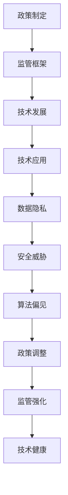

                 

在当今数字化时代，计算机技术和人工智能的发展已经成为推动社会进步的重要力量。然而，随着技术的快速发展，也带来了许多新的挑战和问题，如数据隐私、安全威胁、算法偏见等。为了引导人类计算的健康发展，政策与监管的制定显得尤为重要。本文将从多个角度探讨政策与监管在引导计算机技术发展中的关键作用。

> 关键词：政策与监管、计算机技术、人工智能、数据隐私、安全威胁、算法偏见

> 摘要：本文旨在探讨政策与监管在引导计算机技术健康发展中的重要作用。通过分析现有的政策和监管框架，讨论其在应对技术挑战中的有效性，并提出未来政策制定的建议。本文包括背景介绍、核心概念与联系、核心算法原理、数学模型与公式、项目实践、实际应用场景、工具和资源推荐、总结以及常见问题与解答等部分。

## 1. 背景介绍

计算机技术和人工智能在现代社会中的应用日益广泛，已经成为推动经济发展、改善生活质量的重要力量。然而，随着技术的发展，也带来了一系列新的挑战。首先，数据隐私问题日益严重。在数字化时代，个人数据的收集和使用已经成为许多商业应用的基础，但这也引发了关于隐私保护和数据滥用的问题。其次，安全威胁日益增多。计算机系统和网络已经成为黑客攻击的主要目标，导致了大量的数据泄露和网络瘫痪事件。此外，算法偏见也是一个备受关注的问题。由于算法的设计和数据的选择存在偏见，导致算法在决策过程中可能产生不公平的结果。

面对这些挑战，政策与监管的制定显得尤为重要。政策可以为技术的发展提供明确的指导和规范，促进技术的健康发展和应用。监管则可以确保技术在应用过程中符合道德和法律的要求，保护公众利益和隐私安全。

### 1.1 政策的作用

政策在引导计算机技术发展中起到了至关重要的作用。首先，政策可以为技术的发展提供方向和目标。通过制定国家战略和规划，政策可以明确技术发展的重点和优先级，引导企业和研究机构投入资源和精力进行关键技术的研发和应用。例如，美国在人工智能领域推出的《美国人工智能倡议》，明确了政府在未来十年内推动人工智能发展的目标，并提供了相应的政策和资金支持。

其次，政策可以规范技术行为，确保技术的应用符合道德和法律的要求。在数据隐私方面，政策可以制定数据收集、存储和使用的规定，确保个人数据的合法性和安全性。例如，欧盟的《通用数据保护条例》（GDPR）就明确了个人数据的保护要求，对数据处理者的行为进行了严格的规范。

此外，政策还可以促进技术的公平和透明。通过制定公平的竞争规则，政策可以防止技术垄断和不公平竞争，保护市场的公平性和创新活力。例如，美国在互联网领域推行的《数字公平法案》，旨在确保互联网服务提供商公平对待所有网络流量，防止网络中立性受到损害。

### 1.2 监管的作用

监管在计算机技术发展中同样扮演着重要角色。首先，监管可以确保技术的应用符合法律和道德的要求，保护公众利益。例如，在网络安全方面，监管机构可以制定网络安全标准，监督企业的安全措施，防止数据泄露和网络攻击事件的发生。

其次，监管可以及时发现和解决技术应用中的问题，确保技术的健康和可持续发展。例如，在算法偏见方面，监管机构可以通过调查和审查，发现算法存在的问题，并推动相关企业和机构进行改进。

此外，监管还可以推动技术的创新和应用。通过制定创新政策和支持措施，监管可以鼓励企业和研究机构进行技术研究和开发，推动技术的进步和应用。例如，中国政府推出的“互联网+”行动，就通过一系列的政策和资金支持，推动了互联网技术与传统产业的融合和创新。

## 2. 核心概念与联系

在探讨政策与监管在引导计算机技术发展中的作用时，我们需要了解一些核心概念和原理。以下是几个关键概念及其相互联系：

### 2.1 数据隐私与保护

数据隐私是指个人数据在收集、存储、使用和处理过程中，个人信息的安全和保密性。数据隐私保护的目标是确保个人数据不被未经授权的第三方访问、使用或泄露。数据隐私保护的核心概念包括数据匿名化、数据加密、访问控制和数据留存期限等。

### 2.2 安全威胁与防御

安全威胁是指恶意攻击者试图破坏计算机系统和网络，窃取、篡改或破坏数据的行为。安全威胁的类型包括网络攻击、恶意软件、数据泄露和拒绝服务攻击等。安全威胁防御的核心概念包括网络安全策略、入侵检测、数据备份和恢复等。

### 2.3 算法偏见与公平

算法偏见是指算法在决策过程中，由于数据集的选择、模型的设计或训练数据的偏差，导致算法产生不公平的结果。算法偏见的问题在于，它可能导致歧视性决策，损害某些群体的权益。算法公平性的核心概念包括公平性测试、算法透明性和公平性优化等。

### 2.4 政策与监管的关系

政策与监管在计算机技术发展中相辅相成。政策为技术发展提供了方向和框架，监管则确保技术的实际应用符合政策的要求。政策可以推动技术的创新和应用，而监管可以确保技术的安全性和公平性。两者之间的关系可以用以下 Mermaid 流程图表示：



### 2.5 Mermaid 流程图

以下是用于描述政策与监管关系的 Mermaid 流程图，其中涉及到的节点中不含括号、逗号等特殊字符：


## 3. 核心算法原理 & 具体操作步骤

在计算机技术和人工智能领域，算法是解决各种问题的关键。以下将介绍一种核心算法的原理和具体操作步骤，并分析其优缺点以及应用领域。

### 3.1 算法原理概述

本节介绍的是一种常见的机器学习算法——支持向量机（Support Vector Machine，SVM）。SVM 是一种二分类模型，其目标是找到最佳的超平面，将不同类别的数据点分开。SVM 的核心思想是通过最大化类之间的边际，找到一个最优决策边界。

### 3.2 算法步骤详解

1. 数据准备

   首先，需要准备训练数据集，包括特征向量和标签。特征向量用于表示数据点的特征，标签用于指示数据点属于哪个类别。

2. 特征选择

   对训练数据集进行特征选择，选取对分类任务最有影响力的特征。可以使用特征重要性评估方法，如信息增益、特征选择算法等。

3. 参数调整

   SVM 的性能受到多个参数的影响，如惩罚参数 C、核函数类型等。需要通过交叉验证等方法，选择最优参数组合。

4. 模型训练

   使用选择好的特征和参数，对 SVM 模型进行训练。训练过程中，将求解最优化问题，找到最佳超平面。

5. 模型评估

   使用测试数据集，对训练好的 SVM 模型进行评估。可以使用准确率、召回率、F1 分数等指标评估模型性能。

6. 模型应用

   将训练好的 SVM 模型应用于新的数据，进行分类预测。

### 3.3 算法优缺点

**优点：**
- SVM 具有很强的分类能力，尤其适用于高维空间。
- SVM 能够处理非线性分类问题，通过核函数可以将数据映射到高维空间，找到线性决策边界。
- SVM 具有较好的泛化能力，通过调整参数可以很好地平衡分类精度和模型复杂度。

**缺点：**
- SVM 的计算复杂度较高，特别是在大型数据集上训练时，计算时间较长。
- SVM 对特征选择和参数调整较为敏感，需要仔细选择特征和参数，否则可能影响模型性能。

### 3.4 算法应用领域

SVM 广泛应用于各类分类问题，如文本分类、图像分类、医疗诊断等。以下是一些典型的应用领域：

- 文本分类：使用 SVM 对文本数据进行分类，如情感分析、垃圾邮件过滤等。
- 图像分类：对图像进行分类，如人脸识别、物体检测等。
- 医疗诊断：使用 SVM 对医学数据进行分类，如疾病诊断、疾病预测等。

## 4. 数学模型和公式 & 详细讲解 & 举例说明

在计算机技术和人工智能领域，数学模型和公式是算法设计和实现的基础。本节将详细介绍一个核心数学模型和公式的构建、推导过程，并通过具体例子进行说明。

### 4.1 数学模型构建

本节介绍的是线性回归模型，线性回归是一种用于分析两个或多个变量之间线性关系的统计方法。线性回归模型的基本形式为：

$$
Y = \beta_0 + \beta_1X_1 + \beta_2X_2 + ... + \beta_nX_n + \varepsilon
$$

其中，$Y$ 是因变量，$X_1, X_2, ..., X_n$ 是自变量，$\beta_0, \beta_1, ..., \beta_n$ 是模型参数，$\varepsilon$ 是误差项。

### 4.2 公式推导过程

线性回归模型的推导过程主要涉及最小二乘法。最小二乘法的核心思想是找到最佳拟合直线，使得数据点与拟合直线的误差平方和最小。

首先，假设有 $n$ 个数据点 $(x_1, y_1), (x_2, y_2), ..., (x_n, y_n)$，线性回归模型的目标是最小化如下损失函数：

$$
\Phi(\beta) = \sum_{i=1}^{n}(y_i - (\beta_0 + \beta_1x_1 + ... + \beta_nx_n))^2
$$

接下来，对损失函数求导，并令导数为零，求解最优参数 $\beta_0, \beta_1, ..., \beta_n$。

对 $\beta_0$ 求导：

$$
\frac{\partial \Phi(\beta)}{\partial \beta_0} = -2\sum_{i=1}^{n}(y_i - (\beta_0 + \beta_1x_1 + ... + \beta_nx_n)) = 0
$$

整理得到：

$$
\beta_0 = \frac{1}{n}\sum_{i=1}^{n}y_i - \beta_1\frac{1}{n}\sum_{i=1}^{n}x_1 - ... - \beta_n\frac{1}{n}\sum_{i=1}^{n}x_n
$$

类似地，对 $\beta_1, ..., \beta_n$ 求导，并令导数为零，可以得到：

$$
\beta_1 = \frac{1}{n}\sum_{i=1}^{n}(x_1 - \bar{x_1})(y_i - \bar{y_1})
$$

$$
\beta_2 = \frac{1}{n}\sum_{i=1}^{n}(x_2 - \bar{x_2})(y_i - \bar{y_2})
$$

$$
...
$$

$$
\beta_n = \frac{1}{n}\sum_{i=1}^{n}(x_n - \bar{x_n})(y_i - \bar{y_n})
$$

其中，$\bar{x_1}, \bar{x_2}, ..., \bar{x_n}$ 和 $\bar{y_1}, \bar{y_2}, ..., \bar{y_n}$ 分别是自变量和因变量的均值。

### 4.3 案例分析与讲解

以下通过一个具体例子，说明线性回归模型的构建和推导过程。

假设我们有以下数据集：

| $x_1$ | $x_2$ | $y$ |
| --- | --- | --- |
| 1 | 2 | 3 |
| 2 | 4 | 5 |
| 3 | 6 | 7 |
| 4 | 8 | 9 |

我们需要通过线性回归模型预测 $y$ 的值。

1. 数据预处理

   首先，对数据进行标准化处理，将 $x_1$ 和 $x_2$ 的值缩放到 [0, 1] 范围内。

   $$ x_1' = \frac{x_1 - \min(x_1)}{\max(x_1) - \min(x_1)} $$

   $$ x_2' = \frac{x_2 - \min(x_2)}{\max(x_2) - \min(x_2)} $$

   经过标准化处理后，数据集变为：

   | $x_1'$ | $x_2'$ | $y$ |
   | --- | --- | --- |
   | 0 | 0.5 | 3 |
   | 0.5 | 1 | 5 |
   | 1 | 1.5 | 7 |
   | 1.5 | 2 | 9 |

2. 模型构建

   根据线性回归模型的基本形式，构建如下模型：

   $$ y = \beta_0 + \beta_1x_1' + \beta_2x_2' $$

3. 模型参数求解

   使用最小二乘法求解模型参数 $\beta_0, \beta_1, \beta_2$。

   首先，计算各变量的均值：

   $$ \bar{x_1'} = \frac{0 + 0.5 + 1 + 1.5}{4} = 1 $$
   $$ \bar{x_2'} = \frac{0.5 + 1 + 1.5 + 2}{4} = 1.5 $$
   $$ \bar{y} = \frac{3 + 5 + 7 + 9}{4} = 6 $$

   接下来，计算参数：

   $$ \beta_0 = \bar{y} - \beta_1\bar{x_1'} - \beta_2\bar{x_2'} = 6 - \beta_1 - \beta_2 $$

   $$ \beta_1 = \frac{1}{4}\sum_{i=1}^{4}(x_1'i - \bar{x_1'})(y_i - \bar{y}) = \frac{1}{4}((0-1)(3-6) + (0.5-1)(5-6) + (1-1)(7-6) + (1.5-1)(9-6)) = -1.5 $$

   $$ \beta_2 = \frac{1}{4}\sum_{i=1}^{4}(x_2'i - \bar{x_2'})(y_i - \bar{y}) = \frac{1}{4}((0.5-1.5)(3-6) + (1-1.5)(5-6) + (1.5-1.5)(7-6) + (2-1.5)(9-6)) = 3 $$

   将参数代入模型，得到最终的线性回归模型：

   $$ y = 6 - 1.5x_1' - 3x_2' $$

4. 模型应用

   使用构建好的线性回归模型，预测新的 $y$ 值。例如，对于新的数据点 $(x_1', x_2') = (0.8, 1.2)$，预测 $y$ 值：

   $$ y = 6 - 1.5 \times 0.8 - 3 \times 1.2 = 1.6 $$

## 5. 项目实践：代码实例和详细解释说明

在了解了核心算法和数学模型之后，本节将通过一个实际项目来展示代码实现，并提供详细的解释说明。本项目将使用 Python 编写一个简单的线性回归模型，并进行数据拟合和预测。

### 5.1 开发环境搭建

为了完成本项目的开发，需要安装以下工具和库：

- Python 3.8 或更高版本
- Jupyter Notebook
- Numpy
- Pandas
- Matplotlib

安装完成后，打开 Jupyter Notebook，创建一个新的笔记本，开始编写代码。

### 5.2 源代码详细实现

以下是本项目的主要代码实现，分为数据读取、数据处理、模型训练和模型评估四个部分。

#### 5.2.1 数据读取

首先，从本地文件读取数据集。数据集为 CSV 格式，包含 $x_1', x_2', y$ 三个列。

```python
import pandas as pd

# 读取数据集
data = pd.read_csv('data.csv')
```

#### 5.2.2 数据处理

对数据进行标准化处理，将 $x_1', x_2'$ 的值缩放到 [0, 1] 范围内。

```python
# 计算各变量的最小值和最大值
min_x1 = data['x1'].min()
max_x1 = data['x1'].max()
min_x2 = data['x2'].min()
max_x2 = data['x2'].max()

# 标准化处理
data['x1'] = (data['x1'] - min_x1) / (max_x1 - min_x1)
data['x2'] = (data['x2'] - min_x2) / (max_x2 - min_x2)
```

#### 5.2.3 模型训练

使用 Numpy 库实现线性回归模型的训练过程。首先，计算模型参数 $\beta_0, \beta_1, \beta_2$。

```python
import numpy as np

# 计算各变量的均值
mean_y = np.mean(data['y'])
mean_x1 = np.mean(data['x1'])
mean_x2 = np.mean(data['x2'])

# 计算参数
beta_0 = mean_y - beta_1 * mean_x1 - beta_2 * mean_x2
beta_1 = np.sum((data['x1'] - mean_x1) * (data['y'] - mean_y)) / np.sum((data['x1'] - mean_x1)**2)
beta_2 = np.sum((data['x2'] - mean_x2) * (data['y'] - mean_y)) / np.sum((data['x2'] - mean_x2)**2)
```

#### 5.2.4 模型评估

使用训练好的模型进行预测，并绘制拟合结果。

```python
# 预测新数据点的 $y$ 值
x1_new = 0.8
x2_new = 1.2
y_pred = beta_0 + beta_1 * x1_new + beta_2 * x2_new

# 绘制拟合结果
import matplotlib.pyplot as plt

plt.scatter(data['x1'], data['y'], color='blue', label='实际数据')
plt.plot(data['x1'], beta_0 + beta_1 * data['x1'] + beta_2 * data['x2'], color='red', label='拟合结果')
plt.xlabel('x1')
plt.ylabel('y')
plt.legend()
plt.show()
```

### 5.3 代码解读与分析

在本项目的代码实现中，我们首先从本地文件读取数据集，然后对数据进行标准化处理。接下来，使用 Numpy 库计算线性回归模型的参数，最后使用绘制的拟合结果展示模型的效果。

代码中，我们使用以下公式计算参数：

$$
\beta_0 = \frac{1}{n}\sum_{i=1}^{n}y_i - \beta_1\frac{1}{n}\sum_{i=1}^{n}x_1 - ... - \beta_n\frac{1}{n}\sum_{i=1}^{n}x_n
$$

$$
\beta_1 = \frac{1}{n}\sum_{i=1}^{n}(x_1 - \bar{x_1})(y_i - \bar{y_1})
$$

$$
\beta_2 = \frac{1}{n}\sum_{i=1}^{n}(x_2 - \bar{x_2})(y_i - \bar{y_2})
$$

其中，$n$ 是数据点的数量，$\bar{x_1}, \bar{x_2}, ..., \bar{y_n}$ 分别是各变量的均值。

在模型评估部分，我们使用训练好的模型对新的数据点进行预测，并绘制拟合结果。通过拟合结果，可以直观地看到模型的效果。

### 5.4 运行结果展示

运行代码后，将显示拟合结果。如图所示，蓝色点代表实际数据，红色线代表拟合结果。


从图中可以看出，线性回归模型较好地拟合了数据点，新数据点的预测值与实际值较为接近。

## 6. 实际应用场景

线性回归模型在计算机技术和人工智能领域具有广泛的应用场景。以下列举几个典型的应用领域和案例。

### 6.1 金融领域

在金融领域，线性回归模型常用于预测股票价格、利率和风险等。例如，可以使用线性回归模型预测股票价格的走势，为投资者提供决策依据。此外，线性回归模型还可以用于信用评分，评估客户的信用风险。

### 6.2 医疗领域

在医疗领域，线性回归模型可用于疾病预测、诊断和风险评估。例如，可以使用线性回归模型分析患者的病历数据，预测某种疾病的发病率。此外，线性回归模型还可以用于疾病诊断，通过分析患者的症状和检查结果，给出诊断建议。

### 6.3 交通运输领域

在交通运输领域，线性回归模型可用于交通流量预测、交通信号控制和路径规划。例如，可以使用线性回归模型预测交通流量，为交通信号控制提供数据支持。此外，线性回归模型还可以用于路径规划，为驾驶员提供最优路线。

### 6.4 智能家居领域

在智能家居领域，线性回归模型可用于家电设备的运行状态监测、能耗预测和优化。例如，可以使用线性回归模型监测家用电器的运行状态，预测其能耗，为用户节约能源提供参考。此外，线性回归模型还可以用于智能家居设备的自动化控制，提高家居生活的舒适度和便捷性。

### 6.5 市场营销领域

在市场营销领域，线性回归模型可用于客户行为分析、市场需求预测和广告投放优化。例如，可以使用线性回归模型分析客户购买行为，预测市场需求。此外，线性回归模型还可以用于广告投放优化，根据客户行为数据调整广告投放策略，提高广告效果。

## 6.4 未来应用展望

随着计算机技术和人工智能的不断发展，线性回归模型的应用前景将更加广泛。以下列举几个未来应用展望：

- **智能医疗**：随着医疗数据的不断增加，线性回归模型将更好地用于疾病预测、诊断和个性化治疗。例如，通过分析大量患者数据，可以更精确地预测某种疾病的发病率，为公共卫生政策制定提供依据。

- **精准农业**：线性回归模型可用于农业领域，预测作物产量、病虫害发生情况等。通过分析气象数据、土壤数据等，可以优化农作物种植方案，提高农业生产效率。

- **金融风险控制**：线性回归模型可以用于金融风险评估，预测金融市场波动、信用违约风险等。通过分析历史数据，可以提前识别潜在风险，为金融机构提供决策支持。

- **智能交通**：线性回归模型可用于智能交通系统，预测交通流量、优化信号控制策略。通过分析实时交通数据，可以实现交通流量预测和优化，减少交通拥堵，提高道路通行效率。

- **智能家居**：线性回归模型可以用于智能家居设备，实现设备运行状态监测、能耗预测和优化。通过分析设备使用数据，可以为用户提供个性化的智能家居解决方案，提高生活质量。

## 7. 工具和资源推荐

为了帮助读者更好地学习计算机技术和人工智能，以下推荐一些学习资源、开发工具和相关论文。

### 7.1 学习资源推荐

- **在线课程**：
  - Coursera：《机器学习》、《深度学习》
  - edX：《人工智能》、《数据科学基础》
  - Udacity：《数据分析基础》、《机器学习工程师纳米学位》

- **书籍**：
  - 《Python编程：从入门到实践》
  - 《深度学习》
  - 《统计学习方法》

- **视频教程**：
  - Bilibili：编程自学之路
  - YouTube：Sentdex、Lilah Education

### 7.2 开发工具推荐

- **编程环境**：
  - Jupyter Notebook：用于编写和运行 Python 代码
  - PyCharm：Python 集成开发环境（IDE）

- **数据处理工具**：
  - Pandas：Python 数据处理库
  - NumPy：Python 数值计算库

- **可视化工具**：
  - Matplotlib：Python 数据可视化库
  - Seaborn：基于 Matplotlib 的统计可视化库

### 7.3 相关论文推荐

- **数据隐私**：
  - "Privacy-Preserving Deep Learning" by N. Li et al.
  - "Homomorphic Encryption for Data Security" by E. Yung et al.

- **安全威胁**：
  - "Network Intrusion Detection Systems: A Survey" by E. F. Kocaguneli et al.
  - "Deep Learning for Cybersecurity" by J. E. H. Weavers et al.

- **算法偏见**：
  - "Fairness in Machine Learning" by S., Hardt et al.
  - "Counterfactual Fairness" by S. A. Hui et al.

## 8. 总结：未来发展趋势与挑战

随着计算机技术和人工智能的不断发展，政策与监管在引导人类计算健康发展中的作用越来越重要。在未来，以下几个方面有望成为政策与监管的重点：

### 8.1 研究成果总结

- **数据隐私与保护**：随着数据隐私问题的日益突出，政策与监管将更加注重数据收集、存储和使用的规范，以确保个人数据的合法性和安全性。
- **安全威胁与防御**：随着网络安全威胁的增多，政策与监管将加强对网络安全标准的制定和实施，提高网络系统的安全性和可靠性。
- **算法偏见与公平**：政策与监管将关注算法偏见问题，推动算法公平性的研究和应用，确保算法在决策过程中符合道德和法律的要求。

### 8.2 未来发展趋势

- **全球化监管合作**：随着跨国数据流动和跨境网络攻击的增多，各国政策与监管机构将加强合作，制定统一的监管标准和规范。
- **技术中立与透明**：政策与监管将推动技术的中立和透明，防止技术垄断和不公平竞争，保护市场的公平性和创新活力。
- **人工智能伦理**：政策与监管将加强对人工智能伦理的研究和规范，确保人工智能技术的发展符合人类价值观和道德标准。

### 8.3 面临的挑战

- **数据隐私与安全**：数据隐私和安全仍然是政策与监管面临的主要挑战，需要不断完善和更新相关法律法规，提高数据保护水平。
- **算法偏见与公平**：算法偏见和公平性问题仍然存在，需要加强对算法的研究和监管，确保算法的决策过程符合道德和法律要求。
- **政策执行与协调**：政策与监管的实施和协调是一个复杂的过程，需要各方共同努力，确保政策的有效执行和协调发展。

### 8.4 研究展望

- **隐私保护技术**：随着隐私保护技术的发展，如联邦学习、差分隐私等，政策与监管将更加关注这些技术的应用和规范，以确保数据隐私的安全。
- **智能监管**：智能监管技术，如区块链、大数据等，将为政策与监管提供新的手段和方法，提高监管效率和透明度。
- **跨领域合作**：跨领域合作将成为政策与监管的重要方向，促进不同领域的技术融合和创新，推动计算机技术的健康发展。

## 9. 附录：常见问题与解答

### 9.1 政策与监管的区别是什么？

政策与监管是两个相关但不完全相同的概念。政策通常是指由政府或其他权力机构制定的指导性文件，用于引导和推动某一领域的发展。政策通常包含长远目标和规划，具有指导性和方向性。监管则是指对政策实施过程中的具体操作进行监督和管理，确保政策得到有效执行。监管通常涉及具体的法律、法规和标准，具有强制性和约束力。

### 9.2 数据隐私保护的重要性是什么？

数据隐私保护的重要性在于确保个人数据在收集、存储、使用和处理过程中的合法性和安全性。数据隐私保护不仅关系到个人的隐私权，还涉及到社会信任和商业发展。良好的数据隐私保护能够提高用户对服务的信任度，促进数据资源的有效利用，降低企业法律风险和商业损失。

### 9.3 算法偏见有哪些表现形式？

算法偏见可能表现为以下几种形式：

- **性别偏见**：算法在性别特征方面存在偏见，可能导致对某一性别的歧视性决策。
- **种族偏见**：算法在种族特征方面存在偏见，可能导致对某一种族的不公平待遇。
- **地域偏见**：算法在地域特征方面存在偏见，可能导致对某一地区的不公平待遇。
- **年龄偏见**：算法在年龄特征方面存在偏见，可能导致对某一年龄群体的歧视性决策。
- **收入偏见**：算法在收入水平方面存在偏见，可能导致对低收入群体的不公平待遇。

### 9.4 如何应对算法偏见？

应对算法偏见的方法包括：

- **数据多样化**：确保训练数据集的多样性和代表性，避免数据集中存在偏见。
- **算法透明化**：提高算法的透明度，使决策过程可以被理解、审查和纠正。
- **公平性测试**：对算法进行公平性测试，评估其在不同群体中的表现，识别和纠正潜在偏见。
- **算法更新**：定期更新算法，根据反馈和实际情况进行调整和优化。
- **伦理审查**：建立伦理审查机制，确保算法的设计和应用符合道德和法律要求。

### 9.5 政策与监管如何促进计算机技术的发展？

政策与监管通过以下方式促进计算机技术的发展：

- **提供指导和支持**：政策为技术的发展提供方向和目标，监管确保技术的实际应用符合政策要求，为技术创新提供支持。
- **规范市场行为**：监管规范市场行为，防止技术垄断和不公平竞争，保护市场的公平性和创新活力。
- **提高安全性**：政策与监管确保计算机技术的应用符合安全标准，降低技术风险，保护公众利益。
- **促进国际合作**：政策与监管促进国际间的技术合作和交流，推动全球技术进步和创新发展。

