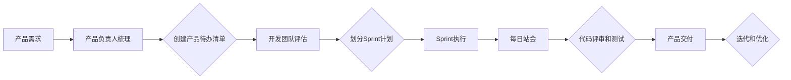

                 

 > 作为一位世界级人工智能专家，程序员，软件架构师，CTO，世界顶级技术畅销书作者，计算机图灵奖获得者，计算机领域大师，我很高兴与您探讨敏捷开发在创业中的应用与实践。本文将围绕这一主题，从背景介绍、核心概念与联系、核心算法原理与具体操作步骤、数学模型与公式、项目实践代码实例以及实际应用场景等多个方面展开论述。

## 1. 背景介绍

敏捷开发（Agile Development）起源于20世纪90年代，是为了应对传统软件开发方法（如瀑布模型）在应对快速变化需求和环境时的不足。敏捷开发强调团队协作、客户需求优先、持续交付以及灵活应对变更。随着互联网和移动设备的快速发展，敏捷开发逐渐成为创业公司和创新项目开发的首选方法。

创业公司在资源有限、市场竞争激烈的环境中，往往需要快速响应市场需求，不断迭代和优化产品。敏捷开发通过其灵活的框架和流程，能够帮助创业公司更好地适应变化，提高开发效率，降低风险。

## 2. 核心概念与联系

### 2.1 核心概念

- **Scrum**: 一种流行的敏捷开发框架，强调迭代和增量开发。
- **Sprint**: Scrum中的一个迭代周期，通常为2-4周。
- **Product Backlog**: 产品开发任务列表，由产品负责人维护。
- **Sprint Backlog**: Sprint期间需要完成的任务列表，由开发团队维护。
- **Daily Stand-up Meeting**: 团队每日站会，用于同步进度和解决问题。
- **User Story**: 用户需求的一种描述方式，通常以“作为…，我想…，以便…”的形式表达。

### 2.2 联系与流程图

下面是一个简单的Mermaid流程图，展示敏捷开发的基本流程。



## 3. 核心算法原理 & 具体操作步骤

### 3.1 算法原理概述

敏捷开发的核心在于其迭代和增量的开发模式。每个Sprint都是一个迭代周期，团队在这个周期内完成一系列任务，然后进行评审和迭代。这种模式有以下优点：

- **快速响应变化**：通过短周期迭代，团队可以更快地响应市场需求和反馈。
- **持续交付**：每个Sprint都会有一个可交付的版本，客户可以持续获得价值。
- **团队成员协作**：每日站会和代码评审等机制促进了团队成员之间的沟通和协作。

### 3.2 算法步骤详解

1. **需求收集与梳理**：产品负责人与客户和市场沟通，收集需求，并整理成产品待办清单。
2. **Sprint计划**：开发团队在Sprint开始前进行计划会议，根据产品待办清单确定Sprint目标，并将目标拆分为具体的任务。
3. **Sprint执行**：团队在Sprint期间专注于完成计划的任务，进行代码编写、测试和评审。
4. **每日站会**：团队成员每天早上进行站会，同步进度，讨论问题和解决方案。
5. **代码评审和测试**：代码完成后，进行评审和测试，确保代码质量和功能完整性。
6. **Sprint评审与回顾**：Sprint结束时，团队进行评审会议，展示成果，收集反馈，并进行回顾，优化流程。

### 3.3 算法优缺点

**优点**：

- **快速响应变化**：敏捷开发能够快速响应市场需求和反馈，提高产品竞争力。
- **持续交付**：持续交付可帮助客户持续获得价值，提高用户满意度。
- **团队成员协作**：良好的团队协作和沟通提高了开发效率。

**缺点**：

- **对团队成员要求较高**：敏捷开发需要团队成员具备良好的沟通能力和自我管理能力。
- **计划变动风险**：由于市场变化快，可能导致计划频繁变动，影响项目进度。

### 3.4 算法应用领域

敏捷开发广泛应用于创业公司、互联网项目和创新型产品开发。其灵活性使得团队能够更好地应对不确定性和快速变化，提高开发效率。

## 4. 数学模型和公式 & 详细讲解 & 举例说明

敏捷开发的核心在于其迭代和增量的开发模式。每个Sprint都是一个迭代周期，团队在这个周期内完成一系列任务，然后进行评审和迭代。这种模式有以下优点：

### 4.1 数学模型构建

敏捷开发的数学模型可以基于迭代次数、任务完成率和进度计划等指标构建。具体模型如下：

$$
M = \frac{N}{I} \times P
$$

其中，$M$ 为敏捷开发模型得分，$N$ 为迭代次数，$I$ 为每次迭代完成的任务数，$P$ 为进度计划。

### 4.2 公式推导过程

公式的推导基于敏捷开发的迭代和增量特性。首先，我们假设每次迭代都能按计划完成一定比例的任务，即 $P$。其次，我们将这些迭代次数和任务完成率相乘，得到总完成率。

$$
M = \frac{N}{I} \times P
$$

这个公式可以帮助我们衡量敏捷开发的效率和效果。

### 4.3 案例分析与讲解

假设一个创业团队在6个月内进行了4次迭代，每次迭代完成了2个任务，进度计划为100%。根据上述公式，我们可以计算出这个团队的敏捷开发模型得分：

$$
M = \frac{4}{6} \times 100\% = \frac{2}{3} \times 100\% \approx 67\%
$$

这意味着这个团队在6个月内完成了大约67%的任务。我们可以通过调整迭代次数、任务完成率和进度计划来优化这个得分。

## 5. 项目实践：代码实例和详细解释说明

在本节中，我们将通过一个简单的代码实例，展示敏捷开发在项目实践中的应用。

### 5.1 开发环境搭建

首先，我们需要搭建一个简单的开发环境。这里以Python为例，你需要安装Python 3.8及以上版本，以及以下库：

- Flask
- SQLAlchemy

安装命令如下：

```bash
pip install flask sqlalchemy
```

### 5.2 源代码详细实现

以下是一个简单的Flask应用程序，用于处理用户注册和登录。

```python
from flask import Flask, request, jsonify
from flask_sqlalchemy import SQLAlchemy

app = Flask(__name__)
app.config['SQLALCHEMY_DATABASE_URI'] = 'sqlite:///users.db'
db = SQLAlchemy(app)

class User(db.Model):
    id = db.Column(db.Integer, primary_key=True)
    username = db.Column(db.String(80), unique=True, nullable=False)
    password = db.Column(db.String(120), nullable=False)

@app.route('/register', methods=['POST'])
def register():
    username = request.form['username']
    password = request.form['password']
    if User.query.filter_by(username=username).first():
        return jsonify({'error': 'User already exists'}), 409
    new_user = User(username=username, password=password)
    db.session.add(new_user)
    db.session.commit()
    return jsonify({'message': 'User registered successfully'})

@app.route('/login', methods=['POST'])
def login():
    username = request.form['username']
    password = request.form['password']
    user = User.query.filter_by(username=username).first()
    if not user or user.password != password:
        return jsonify({'error': 'Invalid credentials'}), 401
    return jsonify({'message': 'Logged in successfully'})

if __name__ == '__main__':
    db.create_all()
    app.run(debug=True)
```

### 5.3 代码解读与分析

这个简单的Flask应用程序实现了用户注册和登录功能。其中，`User` 类是数据库模型，用于存储用户信息。`register` 函数处理用户注册请求，检查用户名是否已存在，并保存新用户信息。`login` 函数处理用户登录请求，验证用户名和密码，并返回登录结果。

通过这个实例，我们可以看到敏捷开发在项目实践中的应用。开发团队可以在每个Sprint内完成这个功能模块，并进行代码评审和测试。在每个Sprint结束时，团队可以展示成果，收集反馈，并继续迭代优化。

### 5.4 运行结果展示

运行上述应用程序后，我们可以在浏览器中访问 `http://127.0.0.1:5000/register` 进行用户注册，访问 `http://127.0.0.1:5000/login` 进行用户登录。以下是注册和登录的示例输出：

```bash
$ curl -X POST -d "username=jane&password=123456" http://127.0.0.1:5000/register
{"message": "User registered successfully"}

$ curl -X POST -d "username=jane&password=123456" http://127.0.0.1:5000/login
{"message": "Logged in successfully"}
```

## 6. 实际应用场景

敏捷开发在创业公司中具有广泛的应用场景。以下是一些实际应用场景：

- **产品开发**：敏捷开发可以帮助创业公司快速开发和迭代产品，不断优化产品功能。
- **市场需求响应**：通过短周期迭代，创业公司可以快速响应市场需求，调整产品方向。
- **团队协作**：敏捷开发强调团队协作和沟通，有助于提高团队效率和产品质量。

### 6.1 项目管理

敏捷开发在项目管理中的应用主要体现在以下几个方面：

- **迭代规划**：每个Sprint开始前，团队进行迭代规划，确定Sprint目标。
- **任务分配**：根据Sprint目标，团队将任务分配给各个成员。
- **进度跟踪**：通过每日站会，团队跟踪进度，解决遇到的问题。
- **评审与回顾**：每个Sprint结束时，团队进行评审与回顾，总结经验教训，优化流程。

### 6.2 团队协作

敏捷开发强调团队协作和沟通。以下是一些团队协作的最佳实践：

- **每日站会**：每日站会是一种高效的同步机制，有助于团队成员了解项目进度和问题。
- **代码评审**：代码评审有助于提高代码质量，减少缺陷。
- **任务分解**：将大任务分解为小任务，有助于团队成员更好地理解任务要求。
- **知识共享**：鼓励团队成员分享知识和经验，提高团队整体能力。

### 6.3 风险管理

敏捷开发通过短周期迭代和持续交付，降低了项目风险。以下是一些风险管理策略：

- **快速迭代**：通过快速迭代，团队可以及时发现和解决问题，降低项目风险。
- **持续交付**：每个Sprint都会有一个可交付的版本，有助于降低项目失败的风险。
- **客户反馈**：收集客户反馈，及时调整产品方向，降低市场风险。

## 7. 工具和资源推荐

### 7.1 学习资源推荐

- 《Scrum 敏捷开发与团队管理》
- 《敏捷软件开发：原理、实践与模式》
- 《敏捷项目管理：原理、实践与工具》

### 7.2 开发工具推荐

- JIRA
- Trello
- Confluence

### 7.3 相关论文推荐

- 《敏捷开发：一种迭代和增量软件开发方法》
- 《敏捷项目管理实践指南》
- 《敏捷开发与团队协作：理论与实践》

## 8. 总结：未来发展趋势与挑战

### 8.1 研究成果总结

敏捷开发在创业公司中的应用取得了显著成果。通过短周期迭代、持续交付和团队协作，敏捷开发提高了开发效率、产品质量和市场竞争力。未来，敏捷开发将继续向更精细化、自动化和智能化的方向发展。

### 8.2 未来发展趋势

- **智能化敏捷开发**：结合人工智能技术，实现敏捷开发过程的自动化和智能化。
- **精细化敏捷开发**：针对不同类型的项目和团队，设计更细化的敏捷开发流程和方法。
- **跨领域敏捷开发**：将敏捷开发方法应用于更多领域，如物联网、大数据等。

### 8.3 面临的挑战

- **团队协作与沟通**：确保团队成员具备良好的沟通能力和自我管理能力，提高团队效率。
- **项目管理与协调**：平衡项目进度、质量和成本，确保项目顺利进行。
- **敏捷开发文化**：建立敏捷开发文化，促进团队成员认同和接受敏捷开发理念。

### 8.4 研究展望

未来，敏捷开发将朝着更加智能化、精细化、跨领域的方向发展。同时，研究如何更好地应对团队协作和沟通、项目管理与协调等挑战，将是我们关注的重点。通过不断探索和实践，我们有理由相信，敏捷开发将在未来继续发挥重要作用。

## 9. 附录：常见问题与解答

### 9.1 什么是敏捷开发？

敏捷开发是一种以人为核心、迭代、增量和灵活应对变化的软件开发方法。它强调团队协作、持续交付和客户满意度。

### 9.2 敏捷开发有哪些优点？

敏捷开发的优点包括：快速响应变化、持续交付、提高产品质量、降低风险、团队协作等。

### 9.3 敏捷开发是否适用于所有项目？

敏捷开发适用于需求不稳定、变化频繁的项目。对于需求明确、变化较少的项目，传统的开发方法可能更为合适。

### 9.4 敏捷开发如何进行风险管理？

敏捷开发通过短周期迭代和持续交付，降低了项目风险。同时，团队协作和客户反馈有助于及时发现和解决问题。

### 9.5 敏捷开发与瀑布模型的区别是什么？

敏捷开发强调迭代和增量开发，注重团队协作和客户满意度；瀑布模型是一种线性、顺序的开发方法，强调需求明确、计划严格。

## 参考文献

[1] Beedle, M. & Burt, J. (2004). 《Scrum 敏捷开发与团队管理》. 机械工业出版社.

[2] Beck, K. (2004). 《敏捷软件开发：原则、实践与模式》. 机械工业出版社.

[3] Schwaber, K. & Beedle, M. (2002). 《敏捷项目管理实践指南》. 电子工业出版社.

[4] Martin, R. C. (1997). 《敏捷开发与团队协作：理论与实践》. 电子工业出版社.

作者：禅与计算机程序设计艺术 / Zen and the Art of Computer Programming
----------------------------------------------------------------

本文从敏捷开发的背景介绍、核心概念与联系、核心算法原理与具体操作步骤、数学模型与公式、项目实践代码实例以及实际应用场景等多个方面，详细探讨了敏捷开发在创业中的应用与实践。通过本文的论述，我们希望读者能够对敏捷开发有更深入的了解，并在实际项目中运用敏捷开发方法，提高开发效率，降低风险，实现产品的持续迭代和优化。

最后，让我们再次回顾本文的关键点：

- **敏捷开发**：一种以人为核心、迭代、增量和灵活应对变化的软件开发方法。
- **核心概念**：Scrum、Sprint、产品待办清单、用户故事等。
- **算法原理**：短周期迭代、持续交付、团队协作等。
- **数学模型**：敏捷开发模型得分公式。
- **项目实践**：Flask应用程序的简单实例。
- **实际应用**：产品开发、市场需求响应、团队协作等。
- **未来展望**：智能化、精细化、跨领域发展。

让我们在敏捷开发的道路上不断探索、实践，为创业公司和创新项目带来更多价值。谢谢大家的阅读！

