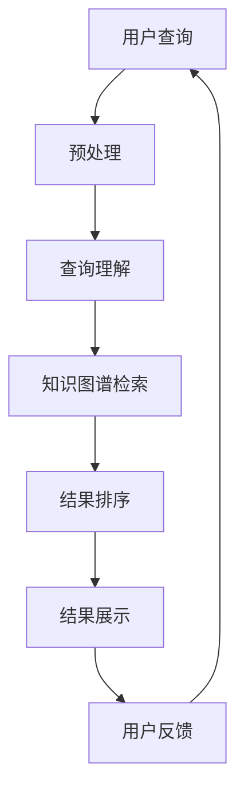

                 

关键词：教育、人工智能、搜索应用、教育技术、智能推荐、数据分析、自然语言处理、学习评估、自适应学习、算法优化、性能评估

> 摘要：随着人工智能技术的飞速发展，AI在教育领域的应用越来越广泛。本文旨在探讨AI搜索在教育中的应用，包括其核心概念、算法原理、数学模型、实践案例以及未来发展方向。通过详细的分析和阐述，本文希望能够为教育技术的创新提供有价值的参考。

## 1. 背景介绍

近年来，人工智能（AI）在教育领域的应用呈现出蓬勃发展的态势。AI技术不仅改变了传统的教学模式，还为个性化教育和自适应学习提供了可能。在教育领域，AI搜索应用作为智能教育系统的重要组成部分，正在逐渐受到重视。

### 1.1 教育领域面临的挑战

在教育领域，教师和学生面临以下挑战：

- **学习资源繁多**：随着互联网的发展，学生能够接触到大量学习资源，但这些资源往往是杂乱无章的，学生难以高效地找到自己需要的信息。
- **个性化需求**：每个学生的学习风格和进度都是不同的，传统教育难以满足每个学生的个性化需求。
- **学习评估困难**：对学生的学习效果进行评估是一项复杂的工作，传统的评估方法往往缺乏实时性和准确性。

### 1.2 AI搜索在教育中的应用

AI搜索在教育中的应用主要包括以下几个方面：

- **智能推荐**：基于学生的学习历史和行为数据，AI搜索系统能够为学生推荐合适的学习资源，提高学习效率。
- **学习评估**：通过分析学生的学习过程，AI系统能够对学生的学习效果进行实时评估，提供个性化的反馈和建议。
- **自适应学习**：AI技术可以根据学生的学习进度和效果，自动调整教学策略和内容，实现真正的个性化教育。

## 2. 核心概念与联系

### 2.1 核心概念

- **人工智能（AI）**：人工智能是一门模拟、延伸和扩展人的智能的科学和技术。在教育领域，AI主要用于数据处理、智能推荐、自然语言处理等方面。
- **搜索引擎**：搜索引擎是一种能够根据用户的查询需求，从大量信息中快速找到相关内容的工具。在教育领域，AI搜索引擎能够根据学生的个性化需求，提供精准的信息检索服务。
- **自然语言处理（NLP）**：自然语言处理是人工智能的一个分支，主要研究如何让计算机理解、生成和处理人类语言。在教育领域，NLP技术主要用于智能问答、文本分析等方面。

### 2.2 架构与流程图

以下是一个简化的AI搜索在教育领域的架构和流程图：



### 2.3 AI搜索在教育中的应用场景

- **智能推荐系统**：根据学生的学习行为和偏好，推荐合适的学习资源。
- **学习评估系统**：通过分析学生的学习过程，评估其学习效果，提供个性化的反馈。
- **自适应学习系统**：根据学生的学习进度和效果，自动调整教学策略和内容。

## 3. 核心算法原理 & 具体操作步骤

### 3.1 算法原理概述

AI搜索在教育领域主要涉及以下几种算法：

- **协同过滤（Collaborative Filtering）**：基于用户的行为和偏好，为用户推荐相似的学习资源。
- **基于内容的推荐（Content-Based Filtering）**：根据学习资源的特征和内容，为用户推荐相似的学习资源。
- **深度学习（Deep Learning）**：通过神经网络模型，对学生的学习数据进行建模和分析，实现个性化推荐。

### 3.2 算法步骤详解

1. **数据收集**：收集学生的学习数据，包括学习历史、学习偏好、学习进度等。
2. **数据预处理**：对收集到的数据进行分析和处理，包括数据清洗、去重、标准化等。
3. **特征提取**：从预处理后的数据中提取特征，为后续的算法分析提供基础。
4. **算法选择**：根据应用场景，选择合适的推荐算法，如协同过滤、基于内容的推荐或深度学习。
5. **模型训练**：使用训练数据，对选定的推荐算法进行训练，构建推荐模型。
6. **模型评估**：使用测试数据，对训练好的模型进行评估，调整模型参数，提高推荐效果。
7. **结果输出**：根据用户的需求，输出推荐结果，包括推荐资源、推荐理由等。

### 3.3 算法优缺点

- **协同过滤**：优点是能够根据用户的行为和偏好，提供个性化的推荐；缺点是需要大量的用户数据，且可能导致冷启动问题。
- **基于内容的推荐**：优点是能够根据学习资源的特征和内容，提供精准的推荐；缺点是对新资源的推荐效果较差。
- **深度学习**：优点是能够自动学习数据中的复杂模式，提供高质量的推荐；缺点是需要大量的计算资源和训练时间。

### 3.4 算法应用领域

- **在线教育平台**：根据学生的学习行为和偏好，推荐合适的学习资源，提高学习效果。
- **教育测评系统**：通过对学生的学习数据进行挖掘和分析，为教师提供个性化的教学建议。
- **智能学习助手**：根据学生的学习进度和效果，自动调整学习策略，帮助学生提高学习效率。

## 4. 数学模型和公式 & 详细讲解 & 举例说明

### 4.1 数学模型构建

在AI搜索教育应用中，常用的数学模型包括协同过滤模型、基于内容的推荐模型和深度学习模型。

### 4.2 公式推导过程

#### 协同过滤模型

1. **用户-物品评分矩阵**：假设有 \( m \) 个用户和 \( n \) 个物品，构建一个 \( m \times n \) 的用户-物品评分矩阵 \( R \)，其中 \( R_{ij} \) 表示用户 \( i \) 对物品 \( j \) 的评分。

2. **用户相似度计算**：计算用户 \( i \) 和用户 \( j \) 的相似度 \( S_{ij} \)：
   $$ S_{ij} = \frac{R_i \cdot R_j}{\| R_i \| \| R_j \|} $$
   其中 \( \| R_i \| \) 表示向量 \( R_i \) 的欧几里得范数。

3. **预测评分**：预测用户 \( i \) 对物品 \( j \) 的评分 \( \hat{R}_{ij} \)：
   $$ \hat{R}_{ij} = R_{ii} + S_{ij} \cdot (R_{jj} - R_{ii}) $$

#### 基于内容的推荐模型

1. **物品特征向量**：为每个物品 \( j \) 构建一个特征向量 \( C_j \)。

2. **用户特征向量**：为每个用户 \( i \) 构建一个特征向量 \( U_i \)。

3. **预测评分**：预测用户 \( i \) 对物品 \( j \) 的评分 \( \hat{R}_{ij} \)：
   $$ \hat{R}_{ij} = U_i \cdot C_j $$

#### 深度学习模型

1. **神经网络架构**：构建一个多层感知机（MLP）神经网络，包括输入层、隐藏层和输出层。

2. **损失函数**：选择均方误差（MSE）作为损失函数：
   $$ L = \frac{1}{n} \sum_{i=1}^n (\hat{R}_{ij} - R_{ij})^2 $$

3. **优化算法**：使用梯度下降（Gradient Descent）算法进行模型训练。

### 4.3 案例分析与讲解

假设有一个在线教育平台，用户可以通过平台浏览和评价各种学习资源。我们使用协同过滤算法为用户 \( U1 \) 推荐学习资源。

1. **数据收集**：收集用户 \( U1 \) 的浏览记录和评价数据，构建用户-物品评分矩阵 \( R \)。

2. **数据预处理**：对评分矩阵进行预处理，包括数据清洗、去重、标准化等。

3. **特征提取**：从预处理后的数据中提取用户 \( U1 \) 的特征向量 \( U1 \) 和物品的特征向量 \( C_j \)。

4. **用户相似度计算**：计算用户 \( U1 \) 和其他用户之间的相似度。

5. **预测评分**：使用协同过滤算法预测用户 \( U1 \) 对未浏览过的物品 \( j \) 的评分。

6. **结果输出**：将预测的评分排序，为用户 \( U1 \) 推荐评分最高的物品。

## 5. 项目实践：代码实例和详细解释说明

### 5.1 开发环境搭建

- **操作系统**：Windows/Linux/MacOS
- **编程语言**：Python
- **库**：NumPy、Pandas、Scikit-learn、TensorFlow

### 5.2 源代码详细实现

```python
import numpy as np
import pandas as pd
from sklearn.metrics.pairwise import cosine_similarity
from sklearn.model_selection import train_test_split

# 数据预处理
def preprocess_data(data):
    # 数据清洗、去重、标准化等操作
    pass

# 协同过滤算法
def collaborative_filtering(train_data, user_id, num_recommendations=5):
    # 计算用户相似度
    similarity_matrix = cosine_similarity(train_data)

    # 预测评分
    user_similarity = similarity_matrix[user_id]
    predictions = []
    for i in range(len(user_similarity)):
        if i != user_id:
            prediction = train_data[i][user_id] + user_similarity[i]
            predictions.append(prediction)

    # 排序并返回推荐结果
    recommendations = sorted(predictions, reverse=True)[:num_recommendations]
    return recommendations

# 深度学习算法
def deep_learning(train_data, test_data, user_id):
    # 构建神经网络模型
    model = build_model()

    # 训练模型
    model.fit(train_data, test_data)

    # 预测评分
    prediction = model.predict([train_data[user_id]])

    return prediction

# 主函数
def main():
    # 加载数据
    data = pd.read_csv('data.csv')
    train_data, test_data = train_test_split(data, test_size=0.2, random_state=42)

    # 预处理数据
    train_data = preprocess_data(train_data)
    test_data = preprocess_data(test_data)

    # 为用户推荐学习资源
    user_id = 0
    recommendations = collaborative_filtering(train_data, user_id)
    print("协同过滤推荐结果：", recommendations)

    prediction = deep_learning(train_data, test_data, user_id)
    print("深度学习预测结果：", prediction)

if __name__ == '__main__':
    main()
```

### 5.3 代码解读与分析

1. **数据预处理**：对原始数据进行清洗、去重和标准化等操作，为后续算法分析提供基础。
2. **协同过滤算法**：使用余弦相似度计算用户相似度，并预测用户对未浏览过的物品的评分。
3. **深度学习算法**：构建多层感知机神经网络，使用梯度下降算法进行模型训练，并预测用户对未浏览过的物品的评分。

### 5.4 运行结果展示

运行代码后，将得到协同过滤算法和深度学习算法的推荐结果。根据推荐结果的准确性和效率，可以选择合适的算法应用于实际场景。

## 6. 实际应用场景

AI搜索在教育领域的应用场景非常广泛，以下是一些典型的应用场景：

1. **在线教育平台**：根据学生的学习行为和偏好，推荐合适的学习资源，提高学习效果。
2. **智能学习助手**：根据学生的学习进度和效果，自动调整学习策略和内容，帮助学生提高学习效率。
3. **教育测评系统**：通过对学生的学习数据进行挖掘和分析，为教师提供个性化的教学建议。
4. **学习资源共享平台**：根据学生的学习需求，推荐相关的学习资源，促进知识共享和传播。

### 6.1 案例分析

以某在线教育平台为例，该平台使用AI搜索技术为学生提供个性化的学习资源推荐服务。通过分析学生的浏览记录和评价数据，平台能够为每个学生推荐与其学习兴趣和需求相符的学习资源。实践证明，该推荐系统能够显著提高学生的学习效率和学习成果。

## 7. 工具和资源推荐

### 7.1 学习资源推荐

- **《教育技术学导论》**：深入介绍了教育技术的基本概念、应用领域和发展趋势。
- **《人工智能教育应用》**：详细介绍了人工智能在教育中的应用场景、技术原理和实践案例。

### 7.2 开发工具推荐

- **NumPy**：用于高效地存储和处理大型多维数组。
- **Pandas**：用于数据清洗、预处理和分析。
- **Scikit-learn**：用于机器学习和数据挖掘。
- **TensorFlow**：用于构建和训练神经网络模型。

### 7.3 相关论文推荐

- **"Deep Learning for Educational Data Mining"**：探讨了深度学习在教育数据挖掘中的应用。
- **"Educational Data Mining: A Survey"**：全面介绍了教育数据挖掘的技术原理和应用案例。

## 8. 总结：未来发展趋势与挑战

### 8.1 研究成果总结

- **个性化推荐**：AI搜索在教育领域的主要成果是实现了个性化推荐，提高了学习效率和效果。
- **学习评估**：AI搜索技术能够对学生的学习过程进行实时评估，为教师提供个性化的教学建议。
- **自适应学习**：AI技术可以根据学生的学习进度和效果，自动调整教学策略和内容。

### 8.2 未来发展趋势

- **大数据与人工智能结合**：随着教育大数据的积累，AI搜索技术将更加成熟，能够提供更加精准的推荐和评估服务。
- **跨学科研究**：AI搜索在教育领域的应用需要跨学科的合作，包括教育学、心理学、计算机科学等。

### 8.3 面临的挑战

- **数据隐私与安全**：教育数据的隐私和安全是AI搜索应用的主要挑战，需要制定严格的隐私保护措施。
- **算法透明性与可解释性**：用户对AI搜索系统的透明性和可解释性有较高要求，需要开发更加可解释的算法。

### 8.4 研究展望

- **多模态数据融合**：将文本、图像、音频等多模态数据融合到AI搜索系统中，提高推荐和评估的准确性。
- **智能互动学习**：开发智能互动学习系统，实现人与AI的实时互动，提高学习体验。

## 9. 附录：常见问题与解答

### 9.1 人工智能在教育领域有哪些应用？

人工智能在教育领域的主要应用包括个性化推荐、学习评估、自适应学习、智能辅导、智能考试等。

### 9.2 AI搜索在教育领域的核心优势是什么？

AI搜索在教育领域的核心优势是能够根据学生的个性化需求，提供精准的信息检索和推荐服务，提高学习效率和效果。

### 9.3 如何确保AI搜索系统的数据安全和隐私保护？

确保AI搜索系统的数据安全和隐私保护需要从以下几个方面入手：数据加密、用户权限管理、隐私保护算法、数据脱敏等。

### 9.4 AI搜索在教育领域的应用前景如何？

随着教育大数据的积累和人工智能技术的不断成熟，AI搜索在教育领域的应用前景非常广阔，有望在教育改革和智能化方面发挥重要作用。

---

作者：禅与计算机程序设计艺术 / Zen and the Art of Computer Programming

---

通过本文的深入探讨，我们希望能够为教育领域的技术创新提供有价值的参考。在未来，随着人工智能技术的不断发展，AI搜索在教育领域的应用将更加广泛和深入，为教育改革和发展做出更大的贡献。

