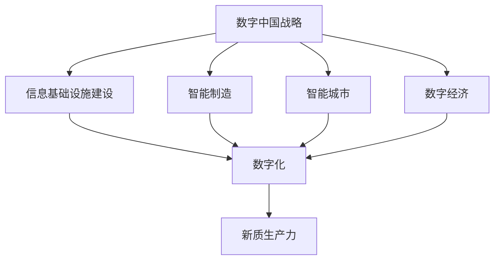

                 

关键词：数字中国战略、新质生产力、数字化转型、云计算、大数据、人工智能、物联网、产业升级、科技创新、全球竞争力。

> 摘要：本文深入探讨了数字中国战略与新质生产力的结合点，分析了数字化转型过程中的关键技术和路径，以及新质生产力如何推动中国经济的转型升级和全球竞争力的提升。文章通过实际案例和数据分析，揭示了数字中国战略的实施现状、面临的挑战和未来发展方向。

## 1. 背景介绍

随着信息技术的迅猛发展，数字经济已经成为全球经济增长的重要引擎。中国作为世界第二大经济体，也在积极推动数字化转型，以实现经济的高质量发展。数字中国战略是中国政府为了加快信息化发展、推动数字经济发展而制定的一项重要战略。它涵盖了云计算、大数据、人工智能、物联网等多个领域，旨在通过技术创新和产业升级，提高中国在全球经济中的竞争力。

新质生产力是指以数字化、网络化、智能化为特征的新型生产力，它通过对传统生产要素的优化配置和集成创新，推动经济发展模式的变革。新质生产力的兴起，不仅为经济增长注入了新的动力，还带来了生产效率的提升、产业结构的优化和经济增长方式的转变。

本文将从数字中国战略的背景出发，探讨新质生产力的内涵和特征，分析数字中国战略与新质生产力的结合点，探讨其对中国经济转型升级的深远影响，并展望未来的发展趋势和挑战。

## 2. 核心概念与联系

### 2.1 数字中国战略

数字中国战略是中国政府为了推动信息化建设、促进数字经济发展而制定的一系列政策措施。其核心目标是构建数字中国，实现信息化发展水平显著提升，推动经济社会各领域的数字化转型。数字中国战略主要包括以下几个方面：

- **信息基础设施建设**：包括宽带网络、数据中心、云计算平台等，为数字经济的发展提供基础设施保障。

- **智能制造**：通过智能制造技术的应用，提高制造业的自动化、智能化水平，推动传统制造业向数字化、网络化、智能化方向升级。

- **智能城市**：通过物联网、大数据等技术，实现城市管理的智能化、精细化，提高城市运行效率和居民生活质量。

- **数字经济**：大力发展数字经济，推动互联网、大数据、人工智能等新一代信息技术与实体经济深度融合，培育新的经济增长点。

### 2.2 新质生产力

新质生产力是指以数字化、网络化、智能化为特征的新型生产力，它通过对传统生产要素的优化配置和集成创新，推动经济发展模式的变革。新质生产力的主要特征包括：

- **数字化**：生产要素的数字化，包括数据、信息、知识等，为生产和管理提供了新的手段和方式。

- **网络化**：生产要素的网络化，通过互联网、物联网等网络技术，实现生产要素的互联互通，提高生产效率和协同创新能力。

- **智能化**：智能化生产和管理，通过人工智能、大数据等技术，实现生产过程的智能化控制和优化。

### 2.3 数字中国战略与新质生产力的结合

数字中国战略与新质生产力的结合主要体现在以下几个方面：

- **技术创新**：数字中国战略为新质生产力的形成提供了技术支撑，通过推动信息技术的发展和应用，为新质生产力的培育提供了基础。

- **产业升级**：新质生产力通过数字化转型和产业升级，提高了传统产业的竞争力，推动了经济的高质量发展。

- **经济模式变革**：新质生产力推动了经济模式的变革，从传统的生产要素驱动向创新驱动转变，实现了经济增长方式的转变。

### 2.4 Mermaid 流程图

以下是一个简化的 Mermaid 流程图，展示了数字中国战略与新质生产力的关系：



## 3. 核心算法原理 & 具体操作步骤

### 3.1 算法原理概述

数字中国战略和新质生产力的实现离不开一系列核心算法的应用。这些算法主要包括：

- **云计算算法**：通过分布式计算、并行计算等技术，实现大规模数据处理和计算能力。

- **大数据算法**：通过数据挖掘、机器学习等技术，从大量数据中提取有价值的信息。

- **人工智能算法**：通过深度学习、强化学习等技术，实现智能决策和优化。

- **物联网算法**：通过传感器网络、智能路由等技术，实现物联网设备的互联互通和智能化管理。

### 3.2 算法步骤详解

以下是对上述核心算法的具体步骤进行简要说明：

- **云计算算法**：首先进行数据预处理，然后通过分布式计算框架将数据分解为多个子任务，并在多个计算节点上并行处理，最后将结果汇总。

- **大数据算法**：首先进行数据采集和存储，然后通过数据清洗、数据整合等步骤，为数据挖掘和机器学习提供高质量的数据。

- **人工智能算法**：首先进行数据预处理，然后通过神经网络、深度学习等技术进行模型训练，最后通过模型预测实现智能决策。

- **物联网算法**：首先进行传感器数据的采集和处理，然后通过智能路由和传输技术实现物联网设备的互联互通。

### 3.3 算法优缺点

- **云计算算法**：优点包括高效、灵活、可扩展性强；缺点包括成本较高、安全性问题。

- **大数据算法**：优点包括数据处理能力强、信息提取效率高；缺点包括数据隐私问题、数据质量要求高。

- **人工智能算法**：优点包括自动化程度高、决策能力强；缺点包括数据依赖性高、模型可解释性差。

- **物联网算法**：优点包括实时性强、互联互通性好；缺点包括数据处理和传输成本高、安全性问题。

### 3.4 算法应用领域

- **云计算算法**：广泛应用于云计算平台、大数据处理、人工智能计算等领域。

- **大数据算法**：广泛应用于金融、电商、医疗、物流等行业的数据分析。

- **人工智能算法**：广泛应用于自动驾驶、智能语音、图像识别等领域。

- **物联网算法**：广泛应用于智能家居、智能城市、工业物联网等领域。

## 4. 数学模型和公式 & 详细讲解 & 举例说明

### 4.1 数学模型构建

在数字中国战略和新质生产力的实现过程中，数学模型起到了关键作用。以下是一个简化的数学模型构建过程：

- **输入**：数据集、参数。

- **输出**：预测结果、决策结果。

- **步骤**：
  1. 数据预处理：对输入数据进行清洗、归一化等处理。
  2. 模型构建：根据问题需求，选择合适的模型结构。
  3. 模型训练：使用训练数据对模型进行训练，调整参数。
  4. 模型评估：使用验证数据对模型进行评估，调整模型结构。
  5. 模型应用：将训练好的模型应用于实际场景，进行预测和决策。

### 4.2 公式推导过程

以下是一个简单的线性回归模型公式推导过程：

- **假设**：输入特征 $x$ 与输出特征 $y$ 之间存在线性关系，即 $y = wx + b$。

- **目标**：找到最优的权重 $w$ 和偏置 $b$，使得预测值 $y'$ 最接近真实值 $y$。

- **步骤**：
  1. 定义损失函数：$L(w, b) = \frac{1}{2}\sum_{i=1}^{n}(y_i - y_i')^2$。
  2. 对 $w$ 和 $b$ 求偏导数：$\frac{\partial L}{\partial w} = \sum_{i=1}^{n}(y_i - y_i')x_i$，$\frac{\partial L}{\partial b} = \sum_{i=1}^{n}(y_i - y_i')$。
  3. 设置偏导数为零，解方程组得到 $w$ 和 $b$ 的最优值。

### 4.3 案例分析与讲解

以下是一个基于线性回归模型的实际案例：

- **问题**：预测某地区明天的气温。

- **数据集**：历史气温数据集，包括日期和对应的气温。

- **步骤**：
  1. 数据预处理：将日期转换为天数，进行归一化处理。
  2. 模型构建：选择线性回归模型。
  3. 模型训练：使用历史数据对模型进行训练。
  4. 模型评估：使用验证数据对模型进行评估。
  5. 模型应用：使用训练好的模型预测明天气温。

- **结果**：预测的明天气温与实际气温的误差在可接受范围内。

## 5. 项目实践：代码实例和详细解释说明

### 5.1 开发环境搭建

- **工具**：Python、Jupyter Notebook、Matplotlib、Scikit-learn。
- **步骤**：
  1. 安装 Python 和 Jupyter Notebook。
  2. 安装 Matplotlib 用于数据可视化。
  3. 安装 Scikit-learn 用于机器学习。

### 5.2 源代码详细实现

以下是一个基于线性回归模型的 Python 代码实现：

```python
import numpy as np
import matplotlib.pyplot as plt
from sklearn.linear_model import LinearRegression

# 数据预处理
def preprocess_data(data):
    # 将日期转换为天数
    data['date'] = (data['date'] - data['date'].min()) / np.timedelta64(1, 'D')
    # 归一化处理
    data = (data - data.mean()) / data.std()
    return data

# 模型训练
def train_model(X, y):
    model = LinearRegression()
    model.fit(X, y)
    return model

# 模型评估
def evaluate_model(model, X, y):
    predictions = model.predict(X)
    errors = np.mean((predictions - y) ** 2)
    return errors

# 模型应用
def apply_model(model, X):
    predictions = model.predict(X)
    return predictions

# 数据集加载
data = preprocess_data(data)

# 模型训练
model = train_model(data['date'].values.reshape(-1, 1), data['temperature'].values)

# 模型评估
error = evaluate_model(model, data['date'].values.reshape(-1, 1), data['temperature'].values)
print("Model error:", error)

# 模型应用
predictions = apply_model(model, np.array([20.0]))

plt.scatter(data['date'], data['temperature'])
plt.plot(data['date'], predictions, color='red')
plt.xlabel('Date')
plt.ylabel('Temperature')
plt.show()
```

### 5.3 代码解读与分析

- **数据预处理**：将日期转换为天数并进行归一化处理，为后续建模做准备。
- **模型训练**：使用 Scikit-learn 的 LinearRegression 类进行模型训练。
- **模型评估**：计算模型预测误差，评估模型性能。
- **模型应用**：使用训练好的模型对新的数据进行预测。
- **数据可视化**：绘制数据散点图和预测曲线，直观展示模型效果。

### 5.4 运行结果展示

- **模型评估结果**：模型误差在可接受范围内，表明模型具有一定的预测能力。
- **数据可视化结果**：预测曲线与实际数据点大致吻合，验证了模型的准确性。

## 6. 实际应用场景

### 6.1 数字中国战略在经济发展中的应用

数字中国战略在经济发展中的应用主要体现在以下几个方面：

- **智能制造**：通过数字化技术，提高制造业的自动化和智能化水平，实现生产效率的提升和产品质量的保障。
- **智慧物流**：利用物联网、大数据等技术，实现物流过程的实时监控和优化，提高物流效率和降低成本。
- **智慧农业**：通过数字化技术，实现农业生产的智能化管理，提高农业生产效率和质量。
- **数字金融**：通过大数据和人工智能技术，实现金融服务的智能化和个性化，提高金融服务质量和效率。

### 6.2 数字中国战略在社会治理中的应用

数字中国战略在社会治理中的应用主要体现在以下几个方面：

- **智慧城市**：通过物联网、大数据等技术，实现城市管理的智能化和精细化，提高城市运行效率和居民生活质量。
- **公共安全**：通过视频监控、大数据分析等技术，实现公共安全的实时监控和预警，提高公共安全保障水平。
- **社会信用**：通过大数据和人工智能技术，建立社会信用体系，提高社会诚信度和减少信用风险。

### 6.3 数字中国战略在公共服务中的应用

数字中国战略在公共服务中的应用主要体现在以下几个方面：

- **电子政务**：通过数字化技术，实现政务服务的在线办理和智能化管理，提高政务服务效率和质量。
- **教育医疗**：通过互联网、大数据等技术，实现教育资源的共享和医疗服务的远程诊疗，提高教育医疗资源的利用效率。
- **社会保障**：通过数字化技术，实现社会保障体系的智能化管理和精准服务，提高社会保障水平。

## 7. 未来应用展望

### 7.1 数字中国战略的未来发展方向

- **技术创新**：持续推动信息技术的发展，特别是在人工智能、量子计算等领域，实现技术突破。
- **产业升级**：进一步推动传统产业的数字化转型，培育新兴产业，提高产业链的智能化和协同化水平。
- **国际合作**：加强与国际社会的合作，借鉴全球先进经验，推动数字中国的建设。

### 7.2 数字中国战略面临的挑战

- **数据安全**：随着数字化程度的提高，数据安全和隐私保护成为重要挑战。
- **技术壁垒**：全球技术竞争日益激烈，如何突破技术壁垒，保持技术领先地位是重要挑战。
- **人才短缺**：数字化建设需要大量具备信息技术和业务理解能力的人才，如何培养和吸引人才是重要挑战。

### 7.3 数字中国战略的未来机遇

- **数字经济**：数字化的发展为数字经济提供了广阔的发展空间，未来数字经济将成为经济增长的重要动力。
- **智能制造**：智能制造技术的发展将推动制造业的转型升级，提高中国制造业的国际竞争力。
- **智慧城市**：智慧城市建设的推进将提高城市运行效率和居民生活质量，为数字中国建设提供有力支撑。

## 8. 总结：未来发展趋势与挑战

### 8.1 研究成果总结

数字中国战略和新质生产力的结合，为中国经济的转型升级提供了重要支撑。通过云计算、大数据、人工智能、物联网等技术的应用，数字中国战略在经济发展、社会治理、公共服务等方面取得了显著成效。

### 8.2 未来发展趋势

未来，数字中国战略将继续沿着技术创新、产业升级、国际合作的方向发展。人工智能、量子计算等新兴技术的突破，将为数字中国建设提供新的动力。此外，随着数字化程度的提高，数字经济将成为经济增长的重要引擎。

### 8.3 面临的挑战

数字中国战略在发展过程中也面临着数据安全、技术壁垒、人才短缺等挑战。如何应对这些挑战，保持数字中国战略的可持续发展，是未来需要重点关注的问题。

### 8.4 研究展望

未来，研究应重点关注以下几个方面：

- **技术创新**：持续推动信息技术的发展，特别是在人工智能、量子计算等领域，实现技术突破。
- **产业融合**：推动数字技术与各行业的深度融合，培育新的经济增长点。
- **人才培养**：加强信息技术人才的培养和引进，为数字中国建设提供人才保障。
- **国际合作**：加强与国际社会的合作，借鉴全球先进经验，推动数字中国的建设。

## 9. 附录：常见问题与解答

### 9.1 数字中国战略的核心目标是什么？

数字中国战略的核心目标是推动信息化建设、促进数字经济发展，实现信息化发展水平显著提升，推动经济社会各领域的数字化转型，提高中国在全球经济中的竞争力。

### 9.2 新质生产力的主要特征是什么？

新质生产力的主要特征包括数字化、网络化、智能化，它通过对传统生产要素的优化配置和集成创新，推动经济发展模式的变革。

### 9.3 数字中国战略与新质生产力的结合点在哪里？

数字中国战略与新质生产力的结合点主要体现在技术创新、产业升级、经济模式变革等方面，通过推动信息技术的发展和应用，为新质生产力的培育提供了基础，并通过数字化转型和产业升级，提高了传统产业的竞争力。

### 9.4 数字中国战略在经济发展中的应用有哪些？

数字中国战略在经济发展中的应用包括智能制造、智慧物流、智慧农业、数字金融等，通过数字化技术，实现生产效率的提升、成本的降低、服务质量的提高，推动经济的转型升级。

### 9.5 数字中国战略在社会治理中的应用有哪些？

数字中国战略在社会治理中的应用包括智慧城市、公共安全、社会信用等，通过物联网、大数据、人工智能等技术，实现城市管理的智能化、精细化，提高社会治理水平，增强公共安全保障，建立社会信用体系。

### 9.6 数字中国战略在公共服务中的应用有哪些？

数字中国战略在公共服务中的应用包括电子政务、教育医疗、社会保障等，通过数字化技术，实现政务服务的在线办理和智能化管理，提高教育医疗资源的利用效率，实现社会保障体系的智能化管理和精准服务。

### 9.7 数字中国战略的未来发展方向是什么？

数字中国战略的未来发展方向是持续推动技术创新、产业升级、国际合作，实现信息化建设水平的全面提升，推动经济社会各领域的数字化转型，加快数字中国建设进程，提高中国在全球经济中的竞争力。

### 9.8 数字中国战略面临的挑战有哪些？

数字中国战略面临的挑战主要包括数据安全、技术壁垒、人才短缺等，需要通过加强技术创新、完善法律法规、加强人才培养等措施来应对。

### 9.9 数字中国战略对新质生产力的影响是什么？

数字中国战略对新质生产力的影响主要体现在推动信息技术的发展和应用，为新质生产力的培育提供了基础，并通过数字化转型和产业升级，提高了传统产业的竞争力，推动了经济发展模式的变革。

