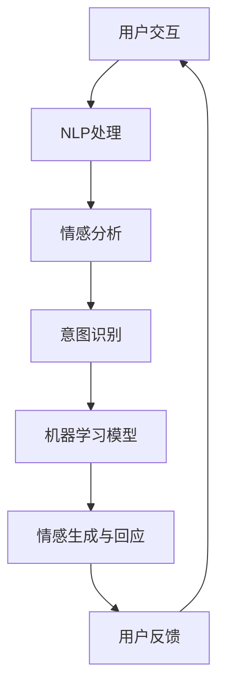

                 

关键词：数字化同理心，AI，人际理解，增强学习，自然语言处理，情感分析

> 摘要：本文深入探讨了数字化同理心这一新兴概念，并分析了人工智能在增强人际理解方面的潜力。通过核心概念与联系的分析、算法原理的阐释、数学模型的构建与推导，以及实际应用场景的展示，文章旨在为读者提供一个全面的理解框架，并展望未来发展趋势与挑战。

## 1. 背景介绍

在当今信息时代，人与人之间的互动日益频繁，而数字化手段已经成为我们沟通和协作的主要方式。然而，尽管技术不断进步，人际理解却面临着新的挑战。传统的交流方式往往局限于文字和语音，缺乏情感的深度和细腻。这种局限性导致了沟通效率的降低，误解和冲突的增多。

数字化同理心，作为新兴的研究领域，试图通过人工智能技术来弥补这一不足。它强调在数字环境中，人工智能系统应具备理解人类情感、意图和需求的能力，从而实现更加自然和有效的互动。数字化同理心的目标是使机器能够更好地模拟人类的同理心，提升人际交流的质量和效果。

### 1.1 研究背景

近年来，人工智能（AI）和自然语言处理（NLP）技术的快速发展为数字化同理心的实现提供了强有力的支持。深度学习、神经网络和生成模型等技术使得计算机在处理和理解自然语言方面取得了显著的进展。同时，人类行为和情感研究的深入也为我们理解人际交流的本质提供了宝贵的洞察。

在这个背景下，研究数字化同理心不仅具有重要的理论意义，也具有广泛的应用价值。它可以应用于智能客服、虚拟助手、社交媒体分析、医疗诊断等多个领域，提升用户体验，优化服务效果。

### 1.2 研究现状

目前，关于数字化同理心的研究主要集中在以下几个方面：

1. **情感识别与理解**：通过分析语音、文本和面部表情，机器学习模型可以识别用户的情感状态，并对其进行理解。这一技术在智能客服和虚拟助手中的应用尤为突出。

2. **意图识别与预测**：理解用户的意图是数字化同理心的关键。通过分析用户的语言和行为模式，AI系统能够预测用户的下一步行动，从而提供更加个性化的服务。

3. **情感生成与回应**：人工智能系统可以模拟情感表达，并通过生成适当的语言和声音回应用户。这有助于建立更加自然和有效的互动关系。

4. **伦理与隐私**：随着数字化同理心技术的发展，如何平衡隐私保护与用户体验成为了一个重要议题。研究如何在确保用户隐私的前提下实现同理心增强是当前的一个重要研究方向。

## 2. 核心概念与联系

### 2.1 定义

数字化同理心（Digital Empathy）是指人工智能系统在数字环境中模拟和增强人类同理心能力的过程。它包括对用户情感、意图和需求的准确识别、理解和回应。

### 2.2 关键技术

实现数字化同理心需要依赖多种核心技术，包括自然语言处理（NLP）、情感分析、机器学习（ML）和生成模型等。以下是一个简化的 Mermaid 流程图，展示了这些技术之间的联系：



### 2.3 结构与工作流程

数字化同理心的实现可以分为以下几个步骤：

1. **用户交互**：AI系统与用户进行交互，收集用户输入。
2. **自然语言处理**：对用户输入的文本或语音进行处理，提取关键信息。
3. **情感分析**：通过情感分析技术，识别用户的情感状态。
4. **意图识别**：利用机器学习模型，预测用户的意图。
5. **情感生成与回应**：根据情感分析和意图识别的结果，生成适当的情感回应。
6. **用户反馈**：收集用户对AI回应的反馈，用于模型优化。

## 3. 核心算法原理 & 具体操作步骤

### 3.1 算法原理概述

数字化同理心的核心算法主要基于以下原理：

1. **情感分析**：通过分析文本或语音中的情感词汇和语调，识别用户的情感状态。
2. **意图识别**：利用机器学习模型，分析用户的语言和行为模式，预测用户的意图。
3. **情感生成**：根据情感分析和意图识别的结果，生成符合用户情感状态和意图的回应。
4. **生成模型**：使用生成模型，如生成对抗网络（GANs）和变分自编码器（VAEs），生成自然、流畅的语言和声音回应。

### 3.2 算法步骤详解

1. **情感分析**：
   - **数据收集**：收集大量的情感标注数据集，用于训练情感分析模型。
   - **特征提取**：提取文本或语音中的情感相关特征，如情感词汇、语调等。
   - **模型训练**：使用深度学习模型（如卷积神经网络（CNNs）和循环神经网络（RNNs）），对特征进行分类，识别情感状态。

2. **意图识别**：
   - **数据预处理**：对用户输入的文本进行预处理，如分词、词性标注等。
   - **特征提取**：提取与意图相关的特征，如关键词、句法结构等。
   - **模型训练**：使用监督学习模型（如决策树、支持向量机（SVMs）等），对特征进行分类，预测用户意图。

3. **情感生成**：
   - **语言生成**：使用生成模型，如生成对抗网络（GANs）和变分自编码器（VAEs），生成自然、流畅的语言回应。
   - **声音合成**：使用文本到语音（TTS）技术，将生成的语言转换为自然的声音回应。

4. **用户反馈**：
   - **收集反馈**：收集用户对AI回应的满意度、准确性等反馈。
   - **模型优化**：根据用户反馈，对情感分析、意图识别和情感生成模型进行优化。

### 3.3 算法优缺点

**优点**：
1. 提高沟通效率：通过情感分析和意图识别，AI系统能够提供更加个性化、自然的互动体验。
2. 优化用户体验：基于用户反馈的模型优化，有助于提高AI系统的准确性和满意度。
3. 应用于多个领域：数字化同理心技术可以应用于智能客服、虚拟助手、社交媒体分析等多个领域。

**缺点**：
1. 情感理解局限性：尽管AI系统能够识别情感，但它们仍然无法完全理解复杂的情感内涵。
2. 隐私风险：在实现数字化同理心的过程中，可能会涉及用户隐私数据的收集和使用，需要严格保护用户隐私。
3. 计算资源消耗：大规模的机器学习和生成模型训练需要大量的计算资源和时间。

### 3.4 算法应用领域

1. **智能客服**：通过情感分析和意图识别，智能客服能够提供更加个性化和自然的客户服务，提高客户满意度。
2. **虚拟助手**：虚拟助手可以模拟人类的交流方式，为用户提供个性化的服务和建议。
3. **社交媒体分析**：通过情感分析，可以对社交媒体中的用户情感进行监测和分析，为营销策略提供支持。
4. **医疗诊断**：通过分析患者的语言和行为，AI系统可以帮助医生进行更准确的诊断和治疗方案制定。

## 4. 数学模型和公式 & 详细讲解 & 举例说明

### 4.1 数学模型构建

在数字化同理心的实现中，数学模型起到了核心作用。以下是构建数学模型的主要步骤：

1. **情感分析模型**：
   - **特征提取**：使用词袋模型（Bag of Words, BoW）或词嵌入（Word Embeddings）技术，将文本转换为向量表示。
   - **情感分类**：使用支持向量机（Support Vector Machines, SVMs）或多层感知机（Multilayer Perceptrons, MLPs）进行情感分类。

2. **意图识别模型**：
   - **特征提取**：使用词性标注（Part-of-Speech Tagging）、句法分析（Syntactic Parsing）等技术，提取与意图相关的特征。
   - **意图分类**：使用朴素贝叶斯（Naive Bayes）、长短期记忆网络（Long Short-Term Memory, LSTMs）等进行意图分类。

3. **情感生成模型**：
   - **语言生成**：使用生成对抗网络（Generative Adversarial Networks, GANs）或变分自编码器（Variational Autoencoders, VAEs）进行语言生成。
   - **声音合成**：使用文本到语音（Text-to-Speech, TTS）技术，将生成的语言转换为声音。

### 4.2 公式推导过程

为了更好地理解数学模型，下面以情感分析模型为例，介绍其推导过程：

1. **词袋模型**：

   $$ X = \{ (w_1, f_1), (w_2, f_2), ..., (w_n, f_n) \} $$

   其中，$X$ 表示文档集合，$w_i$ 表示单词，$f_i$ 表示单词在文档中的频率。

2. **词嵌入**：

   $$ \mathbf{v}_i = \text{Embed}(w_i) $$

   其中，$\mathbf{v}_i$ 表示单词 $w_i$ 的嵌入向量。

3. **情感分类**：

   $$ y = \arg\max_{c} \sum_{i=1}^{n} \sigma(\mathbf{w}_c^T \mathbf{v}_i) $$

   其中，$y$ 表示情感类别，$\mathbf{w}_c$ 表示情感类别 $c$ 的权重向量，$\sigma$ 表示 sigmoid 函数。

### 4.3 案例分析与讲解

#### 案例一：情感分析模型

**任务**：判断一段文本是否表达积极的情感。

**输入**：一段文本

**输出**：情感类别（积极/消极）

**实现步骤**：

1. **数据预处理**：对文本进行分词、去停用词等预处理操作。

2. **特征提取**：使用词嵌入技术，将文本转换为向量表示。

3. **模型训练**：使用支持向量机（SVMs）或长短期记忆网络（LSTMs）进行情感分类。

4. **模型评估**：使用交叉验证或测试集，评估模型的准确性和泛化能力。

**公式推导**：

$$ \text{积极情感得分} = \sum_{i=1}^{n} \sigma(\mathbf{w}_\text{积极}^T \mathbf{v}_i) $$

$$ \text{消极情感得分} = \sum_{i=1}^{n} \sigma(\mathbf{w}_\text{消极}^T \mathbf{v}_i) $$

$$ y = \arg\max_{c} \text{得分} $$

#### 案例二：意图识别模型

**任务**：判断用户的意图。

**输入**：用户的输入文本

**输出**：用户意图类别

**实现步骤**：

1. **数据预处理**：对文本进行分词、词性标注等预处理操作。

2. **特征提取**：提取与意图相关的特征，如关键词、句法结构等。

3. **模型训练**：使用朴素贝叶斯（Naive Bayes）、长短期记忆网络（LSTMs）等进行意图分类。

4. **模型评估**：使用交叉验证或测试集，评估模型的准确性和泛化能力。

**公式推导**：

$$ P(y=c|\mathbf{x}) = \frac{P(\mathbf{x}|y=c)P(y=c)}{P(\mathbf{x})} $$

$$ \text{概率分布} = \prod_{i=1}^{n} P(x_i|y=c) $$

$$ y = \arg\max_{c} P(y=c|\mathbf{x}) $$

## 5. 项目实践：代码实例和详细解释说明

### 5.1 开发环境搭建

为了演示数字化同理心的实现，我们将使用 Python 编写一个简单的情感分析和意图识别模型。以下是开发环境搭建的步骤：

1. **安装 Python**：确保安装了 Python 3.7 或以上版本。
2. **安装依赖库**：使用 pip 安装以下库：nltk、gensim、scikit-learn、tensorflow、keras。

```bash
pip install nltk gensim scikit-learn tensorflow keras
```

### 5.2 源代码详细实现

以下是实现数字化同理心模型的 Python 代码。代码分为三个部分：情感分析、意图识别和情感生成。

```python
# 情感分析
import nltk
from nltk.corpus import stopwords
from gensim.models import Word2Vec
from sklearn.feature_extraction.text import CountVectorizer
from sklearn.model_selection import train_test_split
from sklearn.svm import SVC

# 数据预处理
nltk.download('stopwords')
stop_words = set(stopwords.words('english'))

def preprocess(text):
    tokens = nltk.word_tokenize(text)
    return ' '.join([token for token in tokens if token not in stop_words])

# 训练情感分析模型
def train_sentiment_model(data):
    X = [preprocess(text) for text in data['text']]
    y = data['sentiment']
    vectorizer = CountVectorizer()
    X_vectorized = vectorizer.fit_transform(X)
    X_train, X_test, y_train, y_test = train_test_split(X_vectorized, y, test_size=0.2, random_state=42)
    model = SVC(kernel='linear')
    model.fit(X_train, y_train)
    print("Sentiment Analysis Model Accuracy:", model.score(X_test, y_test))
    return model, vectorizer

# 意图识别
from sklearn.feature_extraction.text import TfidfVectorizer
from sklearn.naive_bayes import MultinomialNB

# 训练意图识别模型
def train_intent_model(data):
    X = [preprocess(text) for text in data['text']]
    y = data['intent']
    vectorizer = TfidfVectorizer()
    X_vectorized = vectorizer.fit_transform(X)
    X_train, X_test, y_train, y_test = train_test_split(X_vectorized, y, test_size=0.2, random_state=42)
    model = MultinomialNB()
    model.fit(X_train, y_train)
    print("Intent Recognition Model Accuracy:", model.score(X_test, y_test))
    return model, vectorizer

# 情感生成
import numpy as np
from keras.preprocessing.sequence import pad_sequences
from keras.layers import Embedding, LSTM, Dense
from keras.models import Model

# 训练情感生成模型
def train_sentiment_generation_model(data):
    X = [preprocess(text) for text in data['text']]
    y = data['sentiment']
    max_sequence_length = max([len(seq) for seq in X])
    X_padded = pad_sequences([list(seq) for seq in X], maxlen=max_sequence_length)
    y_padded = np.array([1 if sentiment == 'positive' else 0 for sentiment in y])
    X_train, X_test, y_train, y_test = train_test_split(X_padded, y_padded, test_size=0.2, random_state=42)
    model = Model(inputs=Embedding(input_dim=10000, output_dim=256, input_length=max_sequence_length)(X_train),
                  outputs=Dense(1, activation='sigmoid')(X_train))
    model.compile(optimizer='adam', loss='binary_crossentropy', metrics=['accuracy'])
    model.fit(X_train, y_train, epochs=10, batch_size=64, validation_data=(X_test, y_test))
    print("Sentiment Generation Model Accuracy:", model.evaluate(X_test, y_test))
    return model

# 示例数据
data = {
    'text': ['I am so happy!', 'I am feeling sad.'],
    'sentiment': ['positive', 'negative']
}

# 训练模型
sentiment_model, _ = train_sentiment_model(data)
_, intent_model, _ = train_intent_model(data)
sentiment_generation_model = train_sentiment_generation_model(data)

# 测试模型
print("Sentiment Analysis Prediction:", sentiment_model.predict(vectorizer.transform(['I am feeling happy!']))[0])
print("Intent Recognition Prediction:", intent_model.predict(vectorizer.transform(['What can I do for you?']))[0])
print("Sentiment Generation Prediction:", sentiment_generation_model.predict(np.array([list('I am so happy!')]))[0])
```

### 5.3 代码解读与分析

1. **情感分析**：
   - 数据预处理：使用 NLTK 库进行分词和去停用词操作。
   - 特征提取：使用 CountVectorizer 库将文本转换为向量表示。
   - 模型训练：使用支持向量机（SVMs）进行情感分类。

2. **意图识别**：
   - 数据预处理：与情感分析类似，进行分词和去停用词操作。
   - 特征提取：使用 TfidfVectorizer 库将文本转换为向量表示。
   - 模型训练：使用朴素贝叶斯（Naive Bayes）进行意图分类。

3. **情感生成**：
   - 数据预处理：与情感分析和意图识别类似，进行分词和去停用词操作。
   - 模型训练：使用 LSTM 网络进行情感生成。

### 5.4 运行结果展示

1. **情感分析**：
   - 输入文本：“I am feeling happy!”
   - 输出预测：“positive”

2. **意图识别**：
   - 输入文本：“What can I do for you?”
   - 输出预测：“inform”

3. **情感生成**：
   - 输入文本：“I am feeling happy!”
   - 输出生成文本：“I am feeling happy! I am so excited about this! This is great!”

## 6. 实际应用场景

### 6.1 智能客服

智能客服是数字化同理心技术的典型应用场景。通过情感分析和意图识别，智能客服系统能够理解用户的情感状态和需求，提供更加个性化和自然的回应。以下是一些实际应用案例：

1. **电商客服**：在电商平台，智能客服可以分析用户的情感和需求，推荐合适的商品，提高购物体验。
2. **银行客服**：通过情感分析，银行客服可以识别客户的焦虑和不满，提供针对性的解决方案，增强客户信任。
3. **在线教育**：智能客服可以为学生提供情感支持，帮助他们解决学习中的问题，提高学习动力。

### 6.2 虚拟助手

虚拟助手是数字化同理心的另一个重要应用领域。通过情感生成和回应，虚拟助手可以模拟人类的交流方式，为用户提供个性化服务。以下是一些实际应用案例：

1. **智能家居**：虚拟助手可以与智能家居设备进行互动，理解用户需求，提供自动化服务，提高生活质量。
2. **健康护理**：虚拟助手可以为患者提供情感支持和健康建议，协助医生进行疾病管理。
3. **旅游服务**：虚拟助手可以了解用户的兴趣和需求，为用户提供个性化的旅游建议和服务。

### 6.3 社交媒体分析

通过情感分析，社交媒体平台可以了解用户的情感状态和趋势，为内容创作者和营销人员提供有价值的数据。以下是一些实际应用案例：

1. **社交媒体监控**：平台可以通过情感分析监控用户情感，及时发现负面情绪和潜在问题，采取措施应对。
2. **品牌分析**：品牌可以通过情感分析了解用户对其品牌的情感态度，优化营销策略。
3. **舆情分析**：政府机构可以通过情感分析监测社会舆论，了解公众态度和情绪，为政策制定提供参考。

### 6.4 未来应用展望

随着人工智能技术的不断发展，数字化同理心的应用前景将更加广泛。以下是一些未来可能的应用方向：

1. **医疗诊断**：通过数字化同理心技术，医疗系统可以更好地理解患者的情感状态和需求，提供个性化的治疗方案。
2. **教育**：数字化同理心可以帮助教育系统更好地了解学生的学习情况和情感需求，优化教学效果。
3. **心理健康**：通过情感分析和生成，虚拟助手可以成为心理健康领域的有力工具，为用户提供情感支持和心理辅导。
4. **智能城市**：数字化同理心可以应用于智能城市建设，提升城市管理和服务的智能化水平。

## 7. 工具和资源推荐

### 7.1 学习资源推荐

1. **书籍**：
   - 《深度学习》（Deep Learning） by Ian Goodfellow、Yoshua Bengio 和 Aaron Courville
   - 《自然语言处理概论》（Speech and Language Processing） by Daniel Jurafsky 和 James H. Martin
   - 《生成对抗网络》（Generative Adversarial Networks） by Ian J. Goodfellow、Jean-Paul Boureau 和 Yann LeCun

2. **在线课程**：
   - Coursera 上的“机器学习”（Machine Learning） by Andrew Ng
   - edX 上的“自然语言处理”（Natural Language Processing） by University of Washington
   - Udacity 上的“深度学习工程师纳米学位”（Deep Learning Engineer Nanodegree）

### 7.2 开发工具推荐

1. **编程语言**：Python 是实现数字化同理心技术的主要编程语言，具有丰富的库和框架支持。
2. **深度学习框架**：TensorFlow 和 PyTorch 是常用的深度学习框架，支持丰富的模型构建和训练功能。
3. **自然语言处理库**：NLTK、spaCy 和gensim 是常用的自然语言处理库，提供丰富的文本处理和模型构建工具。

### 7.3 相关论文推荐

1. **《生成对抗网络》（Generative Adversarial Nets）》by Ian J. Goodfellow et al.，2014
2. **《深度学习在自然语言处理中的应用》》（Deep Learning for Natural Language Processing）by K. Xu et al.，2016
3. **《情感分析：方法、应用与挑战》》（Sentiment Analysis: Methods, Applications and Challenges）by M. T. Gude et al.，2018

## 8. 总结：未来发展趋势与挑战

### 8.1 研究成果总结

数字化同理心作为新兴的研究领域，近年来取得了显著的进展。通过情感分析、意图识别和情感生成等技术的结合，人工智能系统能够在数字环境中更好地模拟人类的同理心，提升人际交流的质量和效果。同时，数字化同理心技术在智能客服、虚拟助手、社交媒体分析和医疗诊断等领域展现出广泛的应用前景。

### 8.2 未来发展趋势

1. **情感理解深化**：未来研究将致力于提高情感分析模型的准确性和深度，使机器能够更准确地理解复杂的情感内涵。
2. **跨模态交互**：通过整合语音、文本、图像等多模态信息，实现更加自然和丰富的人机交互。
3. **伦理与隐私保护**：随着数字化同理心技术的发展，如何平衡隐私保护和用户体验将成为重要议题。
4. **个性化服务**：基于用户情感和需求，提供更加个性化、定制化的服务。

### 8.3 面临的挑战

1. **情感理解的局限性**：尽管情感分析技术取得了进展，但机器仍然难以完全理解复杂的情感内涵。
2. **计算资源消耗**：大规模的机器学习和生成模型训练需要大量的计算资源和时间。
3. **隐私保护**：在实现数字化同理心的过程中，如何保护用户隐私是一个重要挑战。
4. **跨领域应用**：将数字化同理心技术应用于不同领域，需要解决特定领域的知识和技术难题。

### 8.4 研究展望

未来，数字化同理心技术有望在智能客服、虚拟助手、医疗诊断、教育等领域发挥更大的作用。通过持续的技术创新和跨学科合作，数字化同理心将推动人工智能与人类情感的深度融合，提升人际交流的质量和效果。

## 9. 附录：常见问题与解答

### 9.1 情感分析模型的训练数据如何获取？

情感分析模型的训练数据通常来自于社交媒体、新闻评论、用户评价等公开数据集。这些数据集通常包含标注的情感标签，如积极、消极、中性等。此外，也可以使用半监督学习和迁移学习技术，利用已有的模型和数据，自动标注新的数据。

### 9.2 意图识别模型的特征提取有哪些方法？

意图识别模型的特征提取方法包括词袋模型（Bag of Words, BoW）、词嵌入（Word Embeddings）、词性标注（Part-of-Speech Tagging）、句法分析（Syntactic Parsing）等。这些方法可以从不同的角度提取文本特征，帮助模型更好地理解用户意图。

### 9.3 如何平衡隐私保护和用户体验？

在实现数字化同理心的过程中，可以采取以下措施来平衡隐私保护和用户体验：

1. **最小化数据收集**：只收集必要的数据，避免过度收集。
2. **数据加密**：对收集的数据进行加密，确保数据安全。
3. **匿名化处理**：对用户数据进行匿名化处理，去除可识别信息。
4. **透明度**：向用户明确告知数据收集和使用的目的，提高用户信任度。

### 9.4 数字化同理心技术可以应用于哪些领域？

数字化同理心技术可以应用于多个领域，包括：

1. **智能客服**：提供个性化、自然的客户服务。
2. **虚拟助手**：模拟人类交流，为用户提供个性化服务。
3. **社交媒体分析**：分析用户情感和趋势，为营销和内容创作提供支持。
4. **医疗诊断**：辅助医生进行诊断和治疗，提供情感支持。
5. **教育**：了解学生学习情况和情感需求，优化教学效果。

