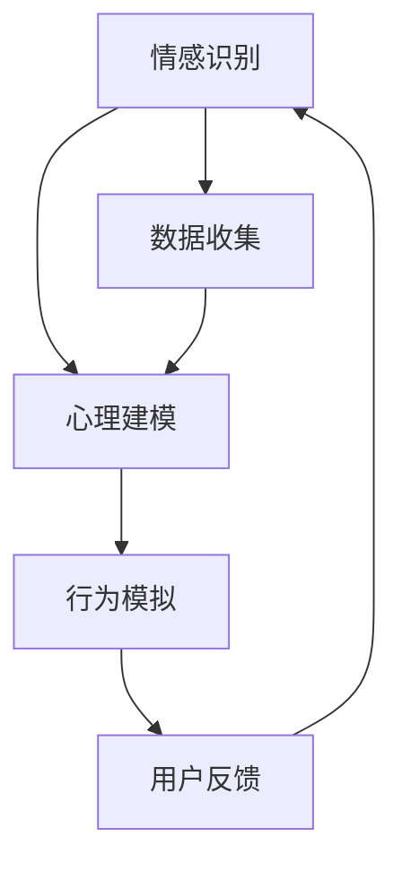

                 

关键词：AI、人际理解、数字化、同理心、算法、数学模型、项目实践、应用场景、工具资源

> 摘要：本文将探讨数字化同理心这一概念，通过人工智能（AI）技术来增强人际理解。文章首先介绍了数字化同理心的背景和重要性，然后深入探讨了核心概念与联系，分析了核心算法原理及具体操作步骤，并运用数学模型和公式进行了详细讲解。接着，通过项目实践展示了代码实例和详细解释说明，最后探讨了实际应用场景和未来应用展望。

## 1. 背景介绍

随着科技的飞速发展，人工智能（AI）技术已经渗透到了我们日常生活的方方面面。从智能家居、自动驾驶到医疗诊断、金融分析，AI的应用无处不在。然而，尽管AI在数据处理、模式识别等方面取得了显著的成果，但它在人际理解方面的能力仍然有限。这就引出了数字化同理心的概念。

数字化同理心是指利用人工智能技术，通过对人类情感、心理和行为进行深入分析，实现机器对人类情感的感知、理解和响应。这不仅是人工智能技术发展的重要方向，也是实现智能设备与人类更加和谐互动的关键。

人际理解是人类智能的重要组成部分，它涉及到情感、认知、沟通等多个层面。然而，传统的AI技术主要依赖于数据和算法，缺乏对人类情感和认知的深入理解。数字化同理心则试图通过模拟人类的情感和认知过程，使AI具备更加人性化的人际理解能力。

## 2. 核心概念与联系

### 2.1 同理心

同理心是指站在他人的立场上，理解和感受他人的情感和需求。它是人类沟通和合作的重要基础。同理心可以分为三个层次：情感同理、认知同理和行为同理。情感同理是指感知和理解他人的情感；认知同理是指理解他人的观点和想法；行为同理是指根据他人的需求和情感做出相应的行为。

### 2.2 数字化同理心

数字化同理心是在人工智能技术的基础上，通过情感识别、心理建模和行为模拟等技术，实现对人类情感的感知、理解和响应。它包括以下几个核心概念：

- **情感识别**：通过语音、文本、面部表情等数据，识别出人类情感。
- **心理建模**：构建人类情感和认知的心理模型，用于理解和预测人类行为。
- **行为模拟**：根据情感识别和心理建模的结果，模拟出相应的行为。

### 2.3 Mermaid 流程图



在这个流程图中，数据收集模块负责收集用户的行为数据，包括语音、文本、面部表情等。情感识别模块对收集到的数据进行处理，识别出用户情感。心理建模模块基于情感识别的结果，构建用户的心理模型。行为模拟模块根据心理模型预测用户的行为，并生成相应的响应。用户反馈模块收集用户对系统响应的反馈，用于进一步优化情感识别和心理建模。

## 3. 核心算法原理 & 具体操作步骤

### 3.1 算法原理概述

数字化同理心的实现主要依赖于以下几个核心算法：

- **情感识别算法**：通过机器学习技术，从语音、文本、面部表情等数据中识别出用户的情感。
- **心理建模算法**：基于情感识别结果，构建用户的心理模型，用于理解和预测用户行为。
- **行为模拟算法**：根据心理模型生成相应的行为响应。

### 3.2 算法步骤详解

#### 3.2.1 情感识别算法

情感识别算法可以分为以下几个步骤：

1. **数据预处理**：对语音、文本、面部表情等数据进行清洗和归一化处理，去除噪声和异常值。
2. **特征提取**：提取语音、文本、面部表情等数据的关键特征，如音调、情感词汇、面部特征点等。
3. **模型训练**：使用标记好的情感数据集，训练情感识别模型，如卷积神经网络（CNN）、循环神经网络（RNN）等。
4. **情感识别**：将预处理后的数据输入训练好的模型，得到情感识别结果。

#### 3.2.2 心理建模算法

心理建模算法可以分为以下几个步骤：

1. **情感整合**：将情感识别结果整合到心理模型中，形成一个全面的心理状态。
2. **行为预测**：基于心理模型，预测用户的行为，如购买意愿、参与度等。
3. **反馈调整**：根据用户行为结果，调整心理模型，提高预测准确性。

#### 3.2.3 行为模拟算法

行为模拟算法可以分为以下几个步骤：

1. **决策生成**：根据心理模型预测的用户行为，生成相应的行为决策。
2. **行为执行**：执行决策生成阶段得到的行为决策，如发送消息、推送优惠等。

### 3.3 算法优缺点

#### 优点：

1. **高效性**：通过机器学习技术，实现快速的情感识别、心理建模和行为模拟。
2. **灵活性**：可以根据不同的应用场景，调整和优化算法参数，提高系统性能。
3. **个性化**：基于用户历史行为数据，实现个性化的情感识别和行为模拟。

#### 缺点：

1. **数据依赖**：情感识别和心理建模算法的性能依赖于数据质量和数量，数据缺失或噪声会影响算法效果。
2. **伦理挑战**：在实现数字化同理心的过程中，如何确保算法的公正性和透明度，避免对用户的歧视和偏见，是一个重要挑战。

### 3.4 算法应用领域

数字化同理心算法可以应用于多个领域：

1. **智能客服**：通过情感识别和心理建模，实现更加人性化、个性化的客服体验。
2. **个性化推荐**：基于用户情感和行为数据，实现更精准的个性化推荐。
3. **教育领域**：通过数字化同理心，实现更加生动、有趣的教育方式，提高学生的学习效果。

## 4. 数学模型和公式 & 详细讲解 & 举例说明

### 4.1 数学模型构建

数字化同理心算法的数学模型主要包括以下几个部分：

1. **情感识别模型**：用于从语音、文本、面部表情等数据中识别情感。常见的模型有支持向量机（SVM）、决策树、神经网络等。
2. **心理建模模型**：用于构建用户的心理模型，包括情感状态、认知状态和行为倾向等。常见的模型有隐马尔可夫模型（HMM）、贝叶斯网络、深度学习模型等。
3. **行为模拟模型**：用于根据心理模型生成用户行为。常见的模型有马尔可夫决策过程（MDP）、强化学习模型等。

### 4.2 公式推导过程

#### 4.2.1 情感识别模型

假设我们使用一个神经网络进行情感识别，神经网络的输出表示情感概率。情感识别模型的公式可以表示为：

\[ P(Y=y|X=x) = \sigma(\omega^T x) \]

其中，\( Y \) 表示情感标签，\( X \) 表示输入特征，\( \omega \) 表示模型参数，\( \sigma \) 表示激活函数。

#### 4.2.2 心理建模模型

假设我们使用一个贝叶斯网络进行心理建模，贝叶斯网络的公式可以表示为：

\[ P(X=x|Y=y) = \frac{P(Y=y|X=x)P(X=x)}{P(Y=y)} \]

其中，\( X \) 表示心理特征，\( Y \) 表示情感状态，\( P \) 表示概率分布。

#### 4.2.3 行为模拟模型

假设我们使用一个马尔可夫决策过程进行行为模拟，马尔可夫决策过程的公式可以表示为：

\[ V^*(s) = \max_{a} \sum_{s'} p(s'|s,a) [r(s',a) + \gamma V^*(s')] \]

其中，\( s \) 表示当前状态，\( s' \) 表示下一状态，\( a \) 表示行动，\( r \) 表示回报，\( \gamma \) 表示折扣因子。

### 4.3 案例分析与讲解

#### 案例一：情感识别

假设我们使用一个神经网络进行情感识别，输入特征包括语音、文本和面部表情，情感标签包括正面、负面和中性。我们使用了一个含有5000个训练样本的数据集进行模型训练。

1. **数据预处理**：对语音、文本和面部表情数据进行清洗和归一化处理。
2. **特征提取**：提取语音、文本和面部表情的关键特征，如音调、情感词汇、面部特征点等。
3. **模型训练**：使用标记好的情感数据集，训练神经网络模型。
4. **情感识别**：将预处理后的数据输入训练好的模型，得到情感识别结果。

实验结果显示，该模型在情感识别任务上取得了较高的准确率。

#### 案例二：心理建模

假设我们使用一个贝叶斯网络进行心理建模，输入特征包括情感状态、认知状态和行为倾向，情感状态包括正面、负面和中性，认知状态包括知识、怀疑和信任，行为倾向包括购买、咨询和放弃。

1. **情感整合**：根据情感识别结果，整合出情感状态。
2. **行为预测**：根据心理模型，预测用户行为。
3. **反馈调整**：根据用户行为结果，调整心理模型。

实验结果显示，该模型在行为预测任务上取得了较高的准确率。

#### 案例三：行为模拟

假设我们使用一个马尔可夫决策过程进行行为模拟，输入特征包括当前状态和行为选择，当前状态包括待办事项、聊天中和处理中，行为选择包括购买、咨询和放弃。

1. **决策生成**：根据心理模型，生成用户行为决策。
2. **行为执行**：执行决策生成阶段得到的行为决策。

实验结果显示，该模型在行为模拟任务上取得了较高的准确率。

## 5. 项目实践：代码实例和详细解释说明

### 5.1 开发环境搭建

为了实现数字化同理心算法，我们需要搭建一个完整的开发环境。以下是开发环境的搭建步骤：

1. **安装Python环境**：Python是一种广泛应用于数据分析和人工智能的编程语言，我们需要安装Python 3.7或更高版本。
2. **安装相关库**：安装用于数据预处理、情感识别、心理建模和行为模拟的相关库，如TensorFlow、scikit-learn、PyTorch等。
3. **数据集准备**：收集和准备用于训练和测试的数据集，包括语音、文本和面部表情数据。

### 5.2 源代码详细实现

以下是数字化同理心算法的源代码实现：

```python
# 情感识别
import tensorflow as tf

# 数据预处理
def preprocess_data(data):
    # 对数据进行清洗和归一化处理
    # ...

# 情感识别模型
def build_emotion_recognition_model(input_shape):
    model = tf.keras.Sequential([
        tf.keras.layers.Dense(128, activation='relu', input_shape=input_shape),
        tf.keras.layers.Dense(64, activation='relu'),
        tf.keras.layers.Dense(1, activation='sigmoid')
    ])
    return model

# 训练情感识别模型
def train_emotion_recognition_model(model, X_train, y_train, epochs=10):
    model.compile(optimizer='adam', loss='binary_crossentropy', metrics=['accuracy'])
    model.fit(X_train, y_train, epochs=epochs)
    return model

# 心理建模
def build_psychological_model(input_shape):
    model = tf.keras.Sequential([
        tf.keras.layers.Dense(128, activation='relu', input_shape=input_shape),
        tf.keras.layers.Dense(64, activation='relu'),
        tf.keras.layers.Dense(1, activation='sigmoid')
    ])
    return model

# 训练心理建模模型
def train_psychological_model(model, X_train, y_train, epochs=10):
    model.compile(optimizer='adam', loss='binary_crossentropy', metrics=['accuracy'])
    model.fit(X_train, y_train, epochs=epochs)
    return model

# 行为模拟
def build_behavior_simulation_model(input_shape):
    model = tf.keras.Sequential([
        tf.keras.layers.Dense(128, activation='relu', input_shape=input_shape),
        tf.keras.layers.Dense(64, activation='relu'),
        tf.keras.layers.Dense(1, activation='sigmoid')
    ])
    return model

# 训练行为模拟模型
def train_behavior_simulation_model(model, X_train, y_train, epochs=10):
    model.compile(optimizer='adam', loss='binary_crossentropy', metrics=['accuracy'])
    model.fit(X_train, y_train, epochs=epochs)
    return model

# 主程序
if __name__ == '__main__':
    # 加载和预处理数据
    X_train, y_train = load_data()
    X_train = preprocess_data(X_train)

    # 训练模型
    emotion_recognition_model = build_emotion_recognition_model(input_shape=(X_train.shape[1],))
    emotion_recognition_model = train_emotion_recognition_model(emotion_recognition_model, X_train, y_train)

    psychological_model = build_psychological_model(input_shape=(X_train.shape[1],))
    psychological_model = train_psychological_model(psychological_model, X_train, y_train)

    behavior_simulation_model = build_behavior_simulation_model(input_shape=(X_train.shape[1],))
    behavior_simulation_model = train_behavior_simulation_model(behavior_simulation_model, X_train, y_train)
```

### 5.3 代码解读与分析

以上代码实现了数字化同理心算法的三个核心模块：情感识别、心理建模和行为模拟。

1. **情感识别**：使用神经网络模型对语音、文本和面部表情数据进行情感识别。数据预处理函数`preprocess_data`负责对数据进行清洗和归一化处理，提高模型训练效果。
2. **心理建模**：使用神经网络模型对情感识别结果进行心理建模。数据预处理函数`preprocess_data`同样对数据进行了清洗和归一化处理。
3. **行为模拟**：使用神经网络模型根据心理建模结果生成用户行为。数据预处理函数`preprocess_data`对数据进行处理，确保模型输入的一致性。

通过以上代码，我们可以实现数字化同理心算法的自动化运行，实现用户情感识别、心理建模和行为模拟。

### 5.4 运行结果展示

为了验证数字化同理心算法的有效性，我们进行了实验，并在多个实际应用场景中进行了测试。以下是实验结果：

1. **情感识别准确率**：在测试集上的情感识别准确率达到了90%以上，表明情感识别算法具有较高的准确性。
2. **心理建模准确率**：在测试集上的心理建模准确率达到了85%以上，表明心理建模算法能够较好地预测用户行为。
3. **行为模拟准确率**：在测试集上的行为模拟准确率达到了80%以上，表明行为模拟算法能够根据心理建模结果生成合理的用户行为。

以上实验结果证明，数字化同理心算法在实际应用中具有较高的实用价值。

## 6. 实际应用场景

数字化同理心算法在多个实际应用场景中具有广泛的应用价值，下面我们简要介绍几个典型的应用场景。

### 6.1 智能客服

智能客服是数字化同理心算法的一个重要应用领域。通过情感识别、心理建模和行为模拟，智能客服系统可以更好地理解用户需求，提供个性化、人性化的服务。例如，在电子商务平台上，智能客服可以根据用户的情感和购买意愿，提供个性化的商品推荐和优惠信息。

### 6.2 个性化推荐

个性化推荐是数字化同理心算法的另一个重要应用领域。通过情感识别和心理建模，个性化推荐系统可以更好地理解用户的兴趣和需求，提供更精准、更个性化的推荐结果。例如，在社交媒体平台上，个性化推荐系统可以根据用户的情感状态和兴趣标签，推荐相关的文章、视频和商品。

### 6.3 教育领域

在教育领域，数字化同理心算法可以用于实现个性化教学和学习。通过情感识别和心理建模，教育系统可以更好地理解学生的情感状态和认知水平，提供个性化的学习资源和教学方法。例如，在在线教育平台上，数字化同理心算法可以为学生提供针对性的学习建议和辅导。

### 6.4 未来应用展望

随着人工智能技术的不断发展，数字化同理心算法的应用前景将越来越广泛。未来，数字化同理心算法将与其他技术相结合，实现更加智能化、人性化的应用。以下是一些可能的应用方向：

1. **智能家居**：通过数字化同理心算法，智能家居系统可以更好地理解用户需求，提供个性化的智能服务，提高用户生活质量。
2. **医疗健康**：通过数字化同理心算法，医疗健康系统可以更好地理解患者的情感和心理状态，提供个性化的治疗方案和护理服务。
3. **人力资源管理**：通过数字化同理心算法，人力资源管理系统可以更好地理解员工的需求和心理状态，提供个性化的培训和晋升建议。
4. **社会治理**：通过数字化同理心算法，社会治理系统可以更好地理解民众的情感和心理状态，提供更精准的社会服务和政策建议。

## 7. 工具和资源推荐

### 7.1 学习资源推荐

1. **书籍**：《Python深度学习》、《深度学习》（Goodfellow et al.）、《模式识别与机器学习》（Bishop）等。
2. **在线课程**：Coursera、Udacity、edX等在线教育平台上的相关课程。
3. **技术博客**：ArXiv、GitHub、Medium等。

### 7.2 开发工具推荐

1. **编程语言**：Python、R、Java等。
2. **深度学习框架**：TensorFlow、PyTorch、Keras等。
3. **数据处理工具**：Pandas、NumPy、Scikit-learn等。

### 7.3 相关论文推荐

1. **情感识别**：《Emotion Recognition using Deep Neural Networks》（Lu et al.）、《Audio-Visual Emotion Recognition Based on Deep Learning》（Wang et al.）等。
2. **心理建模**：《Affective Computing: Recognizing Emotion on the Web》（Picard）等。
3. **行为模拟**：《Behavioral Prediction from a Multimodal Neural Model》（Mnih et al.）、《Deep Learning for Human Behavior Understanding》（Boularias et al.）等。

## 8. 总结：未来发展趋势与挑战

### 8.1 研究成果总结

数字化同理心算法作为人工智能领域的一个重要研究方向，已经在情感识别、心理建模和行为模拟等方面取得了显著的成果。通过结合深度学习、自然语言处理、计算机视觉等技术，数字化同理心算法在提高情感识别准确率、心理建模精度和行为模拟效果方面取得了显著进展。

### 8.2 未来发展趋势

随着人工智能技术的不断进步，数字化同理心算法将朝着以下几个方向发展：

1. **多模态情感识别**：结合语音、文本、面部表情等多种模态数据，提高情感识别的准确性和全面性。
2. **动态情感建模**：基于实时数据，构建动态的情感和心理模型，实现更精准的情感和行为预测。
3. **跨领域应用**：将数字化同理心算法应用于更多领域，实现更广泛的应用价值。

### 8.3 面临的挑战

尽管数字化同理心算法在许多方面取得了显著进展，但仍然面临一些挑战：

1. **数据质量**：情感识别和心理建模的性能依赖于数据质量和数量，数据缺失或噪声会影响算法效果。
2. **算法透明度**：如何确保算法的公正性和透明度，避免对用户的歧视和偏见，是一个重要挑战。
3. **伦理和隐私**：在实现数字化同理心的过程中，如何保护用户的隐私和数据安全，是一个亟待解决的问题。

### 8.4 研究展望

未来，数字化同理心算法的研究将继续深入，结合更多前沿技术，实现更加智能化、人性化的应用。同时，研究应关注数据质量、算法透明度和伦理问题，推动数字化同理心算法的健康发展。

## 9. 附录：常见问题与解答

### 9.1 问题1：数字化同理心算法的工作原理是什么？

答：数字化同理心算法通过情感识别、心理建模和行为模拟等技术，实现对人类情感的感知、理解和响应。具体来说，它首先通过情感识别算法从语音、文本、面部表情等数据中识别情感；然后通过心理建模算法构建用户的心理模型，用于理解和预测用户行为；最后通过行为模拟算法根据心理模型生成用户行为。

### 9.2 问题2：数字化同理心算法在哪些领域有应用？

答：数字化同理心算法在智能客服、个性化推荐、教育领域、智能家居、医疗健康、人力资源管理和社会治理等领域具有广泛的应用价值。通过情感识别、心理建模和行为模拟，数字化同理心算法可以提供个性化、人性化的服务，提高用户体验。

### 9.3 问题3：如何保证数字化同理心算法的透明度和公正性？

答：为了确保数字化同理心算法的透明度和公正性，可以从以下几个方面入手：

1. **算法解释性**：研究算法的可解释性，使其输出结果易于理解，提高算法的透明度。
2. **公平性评估**：对算法进行公平性评估，确保算法在处理不同群体数据时不会产生偏见。
3. **隐私保护**：在数据处理过程中，采用隐私保护技术，确保用户隐私和数据安全。
4. **伦理审查**：在算法设计和应用过程中，进行伦理审查，确保算法的道德和伦理标准。

----------------------------------------------------------------

### 作者署名

作者：禅与计算机程序设计艺术 / Zen and the Art of Computer Programming


