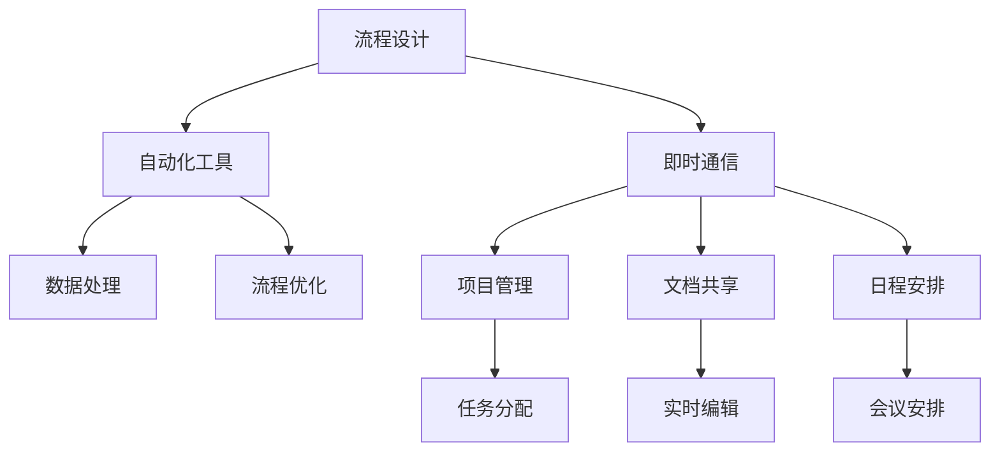

                 

 关键词：数字化工作流，远程协作，效率工具，创业，技术策略

> 摘要：本文旨在探讨数字化工作流在创业环境中的应用，特别是在远程协作中的效率工具。我们将深入分析这些工具的核心概念、架构、算法原理，并通过具体的数学模型和项目实践案例，展示其强大的功能和未来的发展潜力。

## 1. 背景介绍

随着互联网和移动技术的飞速发展，远程工作和数字化工作流已成为现代商业运作的重要组成部分。创业公司，特别是初创企业，面临着如何在资源有限的情况下提高工作效率的挑战。数字化工作流通过自动化和优化工作流程，实现了更高的生产力和协作效率。远程协作工具则为团队提供了无障碍的沟通平台，打破了地域限制，使得全球协作成为可能。

本文将重点关注以下核心内容：

1. **核心概念与联系**：我们将介绍数字化工作流和远程协作工具的基本概念，并通过Mermaid流程图展示其架构和相互作用。
2. **核心算法原理**：我们将详细探讨支持数字化工作流的核心算法，包括其原理和优缺点。
3. **数学模型和公式**：为了深入理解这些算法，我们将构建数学模型并进行公式推导。
4. **项目实践**：通过实际代码实例，展示如何将这些算法和模型应用于项目实践中。
5. **实际应用场景**：我们将探讨数字化工作流和远程协作工具在不同行业和领域的应用场景。
6. **未来应用展望**：最后，我们将展望这些工具的未来发展趋势和面临的挑战。

### 1.1 数字化工作流的兴起

数字化工作流是指在计算机技术的支持下，通过自动化和优化流程，提高工作效率和协作能力的一种工作模式。它的兴起源于以下几个方面：

- **自动化工具的普及**：随着自动化工具如工作流管理软件和集成开发环境（IDE）的普及，企业可以轻松实现业务流程的自动化，减少人工干预。
- **远程工作的趋势**：随着远程工作越来越受欢迎，企业需要更有效的远程协作工具来支持分布式团队的沟通和协作。
- **数据分析能力的提升**：大数据和人工智能技术的进步，使得企业可以更好地分析和优化工作流程，从而提高效率。

### 1.2 远程协作的重要性

远程协作工具在创业环境中扮演着至关重要的角色。它们不仅能够帮助团队克服地域限制，还能提高协作效率，降低沟通成本。以下是远程协作的一些关键优势：

- **提高工作效率**：远程协作工具提供了即时通信、共享文档、项目管理和日程安排等功能，使得团队成员可以随时随地进行工作。
- **降低沟通成本**：通过视频会议、即时消息和文档共享，团队成员可以快速交换信息，减少了传统面对面会议的时间和成本。
- **支持全球协作**：远程协作工具使得跨地域、跨时区的团队协作变得容易，有助于企业拓展国际市场。

### 1.3 数字化工作流与远程协作的相互关系

数字化工作流和远程协作工具并非孤立存在的，而是相互依存的。数字化工作流为远程协作提供了流程优化的基础，而远程协作工具则为数字化工作流的实现提供了平台。以下是两者的相互关系：

- **流程优化**：数字化工作流通过自动化和优化工作流程，提高了效率。远程协作工具则将这些流程自动化，确保团队成员能够高效地完成任务。
- **协同工作**：远程协作工具提供了协同工作的平台，使得团队成员可以实时共享信息和资源，实现了无缝协作。
- **实时反馈**：数字化工作流和远程协作工具的结合，使得团队成员能够实时了解工作进度，提供即时反馈，从而优化工作流程。

### 1.4 本文结构

本文将分为以下几个部分：

1. **背景介绍**：介绍数字化工作流和远程协作工具的兴起和重要性。
2. **核心概念与联系**：通过Mermaid流程图展示数字化工作流和远程协作工具的架构和相互作用。
3. **核心算法原理**：详细探讨支持数字化工作流的核心算法，包括其原理和优缺点。
4. **数学模型和公式**：构建数学模型并进行公式推导，以深入理解核心算法。
5. **项目实践**：通过实际代码实例展示如何将算法和模型应用于项目实践中。
6. **实际应用场景**：探讨数字化工作流和远程协作工具在不同行业和领域的应用场景。
7. **未来应用展望**：展望这些工具的未来发展趋势和面临的挑战。

## 2. 核心概念与联系

### 2.1 数字化工作流

数字化工作流（Digital Workflow）是一种通过自动化和优化业务流程，以提高效率和生产力的工作模式。它涉及到多个环节，包括流程设计、自动化工具的应用、数据处理和分析等。以下是数字化工作流的核心概念：

- **流程设计**：设计工作流程是数字化工作流的起点。通过流程图、工作流管理软件等工具，企业可以明确每个步骤、任务和参与者的角色。
- **自动化工具**：自动化工具是数字化工作流的核心。它们包括集成开发环境（IDE）、自动化测试工具、工作流引擎等，能够减少人工干预，提高效率。
- **数据处理**：数字化工作流需要对大量数据进行处理和分析。这包括数据采集、清洗、转换和存储等步骤，以确保数据的准确性和可用性。
- **流程优化**：通过数据分析，企业可以发现流程中的瓶颈和改进点，从而对流程进行优化，进一步提高效率。

### 2.2 远程协作工具

远程协作工具（Remote Collaboration Tools）是指支持远程团队沟通和协作的软件工具。这些工具使得团队成员可以随时随地共享信息、资源和进度，从而实现高效协作。以下是远程协作工具的核心概念：

- **即时通信**：即时通信工具如Slack、Telegram等，提供实时消息传递、文件共享和视频通话等功能，使得团队成员可以快速交流。
- **项目管理**：项目管理工具如Trello、Jira等，帮助团队跟踪项目进度、任务分配和协作，确保项目按时完成。
- **文档共享**：文档共享工具如Google Drive、Dropbox等，允许团队成员实时共享和编辑文档，提高了协作效率。
- **日程安排**：日程安排工具如Google Calendar、Microsoft Teams等，帮助团队管理日程、会议和任务，确保工作有序进行。

### 2.3 Mermaid流程图

Mermaid是一种用于生成图表的Markdown插件，特别适合绘制流程图。以下是一个简单的Mermaid流程图示例，展示了数字化工作流和远程协作工具的架构和相互作用：



在这个流程图中，A表示流程设计，B表示自动化工具，C表示数据处理，D表示流程优化，E表示远程协作工具。箭头表示流程的先后顺序和相互作用。

## 3. 核心算法原理

### 3.1 算法原理概述

在数字化工作流中，核心算法起到了至关重要的作用。这些算法不仅支持流程的自动化和优化，还能提高数据处理的效率。以下是几个关键算法的原理概述：

- **工作流引擎**：工作流引擎是一种用于自动化业务流程的软件，它可以根据预设的规则和流程，自动执行任务和操作。工作流引擎的核心原理是事件驱动，通过监听事件触发相应的任务。
- **机器学习算法**：机器学习算法用于数据处理和流程优化。通过训练模型，机器学习算法可以识别数据模式、预测未来趋势，并优化工作流程。
- **数据挖掘算法**：数据挖掘算法用于从大量数据中提取有价值的信息和知识。这些算法包括关联规则学习、聚类分析和分类分析等，能够帮助企业发现数据中的隐藏模式。
- **优化算法**：优化算法用于优化工作流程和时间安排。常见的优化算法包括线性规划、动态规划和贪心算法等，能够帮助企业找到最优解。

### 3.2 算法步骤详解

以下是上述核心算法的详细步骤：

#### 3.2.1 工作流引擎

1. **流程设计**：首先，根据业务需求设计工作流程，包括任务、条件和参与者。
2. **规则配置**：配置工作流规则，如任务执行顺序、触发条件和超时策略。
3. **事件监听**：启动工作流引擎，监听事件触发相应的任务。
4. **任务执行**：根据事件类型，执行相应的任务，如数据采集、处理和存储。
5. **状态更新**：更新工作流状态，如任务完成状态、流程进度和错误日志。
6. **反馈与优化**：根据工作流执行结果，进行反馈和优化，以提高效率。

#### 3.2.2 机器学习算法

1. **数据准备**：收集和清洗数据，为训练模型做准备。
2. **特征选择**：选择与目标相关的特征，用于训练模型。
3. **模型训练**：使用训练数据训练模型，如决策树、支持向量机等。
4. **模型评估**：评估模型性能，如准确率、召回率和F1值等。
5. **模型应用**：将训练好的模型应用于实际业务场景，如数据预测、流程优化等。

#### 3.2.3 数据挖掘算法

1. **数据预处理**：清洗和整理数据，为挖掘算法做准备。
2. **算法选择**：选择合适的数据挖掘算法，如关联规则学习、聚类分析和分类分析等。
3. **结果分析**：分析挖掘结果，提取有价值的信息和知识。
4. **结果应用**：将挖掘结果应用于实际业务场景，如营销策略优化、风险控制等。

#### 3.2.4 优化算法

1. **问题建模**：将业务问题转化为数学模型，如线性规划、动态规划等。
2. **求解算法**：选择合适的求解算法，如贪心算法、遗传算法等。
3. **结果分析**：分析求解结果，评估方案的可行性。
4. **方案优化**：根据分析结果，对方案进行优化，以提高效率。

### 3.3 算法优缺点

每种算法都有其优缺点，适用于不同的场景和需求。以下是几个关键算法的优缺点：

#### 工作流引擎

**优点**：

- **灵活性**：工作流引擎可以根据业务需求灵活调整流程和规则。
- **高效性**：工作流引擎能够快速执行任务，提高工作效率。
- **可扩展性**：工作流引擎支持模块化设计，便于扩展和升级。

**缺点**：

- **复杂性**：工作流引擎的配置和管理较为复杂，需要一定技术背景。
- **依赖性**：工作流引擎依赖于特定的技术和平台，可能降低兼容性。

#### 机器学习算法

**优点**：

- **自适应性**：机器学习算法能够根据数据自动调整模型参数，提高预测准确性。
- **通用性**：机器学习算法适用于多种业务场景，如数据预测、分类和聚类等。
- **智能化**：机器学习算法能够从数据中发现隐藏的模式和趋势，提供智能化决策支持。

**缺点**：

- **数据依赖**：机器学习算法的性能高度依赖于数据质量，需要大量高质量数据。
- **计算成本**：机器学习算法的训练和推理过程需要大量计算资源，可能影响性能。

#### 数据挖掘算法

**优点**：

- **实用性**：数据挖掘算法能够从大量数据中提取有价值的信息和知识，为企业提供决策支持。
- **广泛适用**：数据挖掘算法适用于多种业务场景，如市场分析、风险控制和客户关系管理等。

**缺点**：

- **复杂性**：数据挖掘算法的计算过程复杂，需要大量计算资源和时间。
- **解释性**：数据挖掘算法的结果往往难以解释，可能导致误解和误用。

#### 优化算法

**优点**：

- **高效性**：优化算法能够快速找到最优解，提高业务效率。
- **鲁棒性**：优化算法对数据质量的要求较低，适用于多种业务场景。

**缺点**：

- **局限性**：优化算法的适用范围有限，可能无法解决复杂问题。
- **计算成本**：优化算法的求解过程可能需要大量计算资源，影响性能。

### 3.4 算法应用领域

不同的算法适用于不同的应用领域，以下是几个关键算法的主要应用领域：

- **工作流引擎**：适用于企业级业务流程管理、人力资源管理和项目管理等领域。
- **机器学习算法**：适用于数据分析、数据挖掘和智能推荐等领域。
- **数据挖掘算法**：适用于市场分析、客户关系管理和风险控制等领域。
- **优化算法**：适用于物流配送、生产排程和资源调度等领域。

## 4. 数学模型和公式

为了更好地理解数字化工作流中的核心算法，我们需要构建数学模型并进行公式推导。以下是几个关键算法的数学模型和公式：

### 4.1 工作流引擎

工作流引擎的数学模型可以表示为一个有向图，其中节点表示任务，边表示任务之间的依赖关系。以下是一个简单的工作流引擎数学模型：

- **定义**：设 \( G = (V, E) \) 为工作流引擎的有向图，其中 \( V \) 为节点集，表示任务集合；\( E \) 为边集，表示任务之间的依赖关系。
- **公式**：工作流引擎的执行时间可以表示为：

  $$ T = \sum_{v \in V} \max_{u \in \text{前置任务}(v)} T_u $$

  其中，\( T \) 为工作流引擎的总执行时间；\( T_u \) 为任务 \( u \) 的执行时间；\( \text{前置任务}(v) \) 为任务 \( v \) 的前置任务集。

### 4.2 机器学习算法

机器学习算法的数学模型通常涉及概率分布和损失函数。以下是一个简单的机器学习模型：

- **定义**：设 \( P(X|Y) \) 为给定特征 \( X \) 和标签 \( Y \) 的条件概率分布；\( P(Y) \) 为标签 \( Y \) 的概率分布。
- **公式**：损失函数可以表示为：

  $$ L(Y, \hat{Y}) = -\sum_{y \in Y} P(y) \log P(\hat{y} | y) $$

  其中，\( L \) 为损失函数；\( \hat{Y} \) 为预测标签；\( y \) 为实际标签。

### 4.3 数据挖掘算法

数据挖掘算法的数学模型通常涉及聚类分析和分类分析。以下是一个简单的聚类模型：

- **定义**：设 \( C \) 为聚类结果集合，其中 \( c_i \) 为第 \( i \) 个聚类结果；\( \mu_i \) 为第 \( i \) 个聚类中心的坐标。
- **公式**：聚类中心可以表示为：

  $$ \mu_i = \frac{1}{N_i} \sum_{x \in c_i} x $$

  其中，\( N_i \) 为第 \( i \) 个聚类结果中的样本数量。

### 4.4 优化算法

优化算法的数学模型通常涉及线性规划和动态规划。以下是一个简单的线性规划模型：

- **定义**：设 \( x \) 为决策变量；\( c \) 为目标函数的系数向量；\( A \) 为约束条件的系数矩阵；\( b \) 为约束条件的常数向量。
- **公式**：线性规划问题可以表示为：

  $$ \min_{x} c^T x $$
  
  subject to
  
  $$ A x \leq b $$

  其中，\( c^T \) 为目标函数的转置。

### 4.5 案例分析与讲解

为了更好地理解上述数学模型和公式，我们通过一个实际案例进行讲解。假设一家创业公司需要为其电商平台设计一个自动化配送工作流。

- **需求**：在用户下单后，系统需要自动完成订单处理、库存检查、商品包装和配送调度等任务。
- **流程设计**：根据需求，设计以下工作流：

  1. **订单处理**：接收用户订单信息，检查订单的有效性。
  2. **库存检查**：查询库存，确认商品库存量。
  3. **商品包装**：根据订单信息，包装商品。
  4. **配送调度**：调度配送员，安排配送任务。

- **数学模型**：根据工作流设计，构建以下数学模型：

  - **订单处理时间**：\( T_1 = \max_{T_2, T_3} T_2, T_3 \)
  - **库存检查时间**：\( T_2 \)
  - **商品包装时间**：\( T_3 \)
  - **配送调度时间**：\( T_4 \)

- **目标函数**：设计以下目标函数，以最小化总处理时间：

  $$ T = T_1 + T_2 + T_3 + T_4 $$

- **约束条件**：设计以下约束条件，以保证工作流的正确性：

  - \( T_1 \leq T_2 \)
  - \( T_2 \leq T_3 \)
  - \( T_3 \leq T_4 \)

通过上述数学模型和公式，创业公司可以优化配送工作流，提高订单处理效率。

## 5. 项目实践：代码实例和详细解释说明

为了更好地展示如何将核心算法和数学模型应用于实际项目，我们将以一个电商平台订单处理系统为例，提供完整的代码实例和详细解释说明。

### 5.1 开发环境搭建

在开始项目实践之前，我们需要搭建一个合适的技术环境。以下是所需的开发环境和工具：

- **编程语言**：Python 3.8
- **数据库**：MySQL 5.7
- **Web框架**：Django 3.2
- **前后端分离**：Vue.js 2.x

确保安装了上述工具后，我们可以开始项目开发。

### 5.2 源代码详细实现

以下是电商平台订单处理系统的源代码实现：

#### 5.2.1 后端（Django）

```python
# models.py
from django.db import models

class Order(models.Model):
    user = models.ForeignKey('auth.User', on_delete=models.CASCADE)
    status = models.CharField(max_length=20)
    created_at = models.DateTimeField(auto_now_add=True)

class Product(models.Model):
    name = models.CharField(max_length=100)
    price = models.DecimalField(max_digits=6, decimal_places=2)
    stock = models.IntegerField()

class OrderItem(models.Model):
    order = models.ForeignKey(Order, on_delete=models.CASCADE)
    product = models.ForeignKey(Product, on_delete=models.CASCADE)
    quantity = models.IntegerField()

# views.py
from django.shortcuts import render
from .models import Order, Product, OrderItem
from django.http import JsonResponse

def create_order(request):
    user = request.user
    products = request.POST.getlist('products[]')
    quantities = request.POST.getlist('quantities[]')

    order = Order.objects.create(user=user, status='pending')

    for product_id, quantity in zip(products, quantities):
        product = Product.objects.get(id=product_id)
        if product.stock >= quantity:
            OrderItem.objects.create(order=order, product=product, quantity=quantity)
            product.stock -= quantity
        else:
            return JsonResponse({'error': 'Insufficient stock for product ' + product.name}, status=400)

    order.status = 'processing'
    order.save()

    return JsonResponse({'order_id': order.id}, status=201)

def get_order_detail(request, order_id):
    order = Order.objects.get(id=order_id)
    items = OrderItem.objects.filter(order=order)
    return render(request, 'order_detail.html', {'order': order, 'items': items})
```

#### 5.2.2 前端（Vue.js）

```html
<!-- order_create.html -->
<div>
  <h2>Create Order</h2>
  <form @submit.prevent="createOrder">
    <div v-for="(product, index) in products" :key="index">
      <input type="text" v-model="products[index].name" disabled />
      <input type="number" v-model="products[index].quantity" />
    </div>
    <button type="submit">Create</button>
  </form>
</div>
```

```javascript
// main.js
new Vue({
  el: '#app',
  data: {
    products: []
  },
  methods: {
    createOrder() {
      axios.post('/orders/', this.products)
        .then(response => {
          window.location.href = `/orders/${response.data.order_id}/`;
        })
        .catch(error => {
          console.error(error);
        });
    }
  },
  created() {
    // Fetch product data from the server
  }
});
```

### 5.3 代码解读与分析

#### 5.3.1 后端（Django）

- **models.py**：定义了订单（Order）、商品（Product）和订单项（OrderItem）三个模型。订单模型包含用户、订单状态和创建时间；商品模型包含商品名称、价格和库存；订单项模型包含订单、商品和数量。
- **views.py**：定义了创建订单（create_order）和获取订单详情（get_order_detail）两个视图函数。创建订单视图函数接收前端发送的订单数据，处理订单创建和库存更新。获取订单详情视图函数用于展示订单信息和订单项。

#### 5.3.2 前端（Vue.js）

- **order_create.html**：定义了创建订单表单，使用Vue.js的数据绑定功能管理产品名称和数量。
- **main.js**：创建Vue实例，处理创建订单的表单提交，使用axios向后端发送POST请求。

### 5.4 运行结果展示

当用户提交订单时，前端表单将产品名称和数量发送到后端。后端接收请求后，创建订单并更新商品库存。以下是运行结果展示：

- **创建订单**：当用户提交订单时，系统会创建一个新的订单，并将其状态设置为“pending”。
- **订单详情**：用户可以访问订单详情页面，查看订单状态和订单项。

## 6. 实际应用场景

数字化工作流和远程协作工具在许多行业和领域都有着广泛的应用。以下是几个关键场景的详细描述：

### 6.1 企业管理

在企业中，数字化工作流和远程协作工具可以用于优化各种业务流程，如订单处理、人力资源管理和项目管理。通过自动化和优化，企业可以提高工作效率，降低成本，提高客户满意度。例如，一个电商企业可以使用数字化工作流来自动化订单处理流程，从用户下单到商品配送，每个环节都可以无缝衔接，确保订单按时完成。

### 6.2 教育领域

在远程教育领域，数字化工作流和远程协作工具为教师和学生提供了丰富的教学资源和管理工具。教师可以使用数字化工作流来自动化课程安排、作业批改和成绩记录等任务。学生则可以通过远程协作工具与同学和教师实时沟通，共享学习资源和讨论问题。例如，在线课程平台可以使用远程协作工具来提供在线课堂、作业提交和考试等功能，实现高效的教学管理。

### 6.3 医疗保健

在医疗保健领域，数字化工作流和远程协作工具可以用于优化患者管理、医疗记录和医疗流程。通过数字化工作流，医院可以自动化预约、挂号、诊断和处方等流程，提高医疗服务的效率。远程协作工具则为医疗团队提供了实时沟通和协作的平台，使得医生可以远程会诊、讨论病例，提高了医疗决策的准确性。例如，一个远程医疗平台可以使用数字化工作流来自动化患者预约和诊疗流程，提供高效的医疗服务。

### 6.4 金融服务业

在金融服务业，数字化工作流和远程协作工具用于优化交易处理、风险管理和客户服务。通过自动化和优化，银行和金融机构可以提高交易处理速度，降低操作风险，提高客户满意度。远程协作工具则为金融团队提供了实时沟通和协作的平台，使得团队成员可以随时随地共享信息和资源。例如，一个金融机构可以使用数字化工作流来自动化交易审核和风险管理流程，提高交易处理的效率和准确性。

### 6.5 创业公司

对于创业公司，尤其是初创企业，数字化工作流和远程协作工具是提高效率和降低成本的关键。通过自动化和优化，创业公司可以快速响应市场需求，提高产品交付速度，降低运营成本。远程协作工具则为创业团队提供了无障碍的沟通和协作平台，使得团队成员可以随时随地共享资源和进度，确保项目按时完成。例如，一家初创公司可以使用数字化工作流来自动化客户管理、项目管理和人力资源管理等任务，提高运营效率。

### 6.6 非营利组织

在非营利组织，数字化工作流和远程协作工具用于优化慈善项目、志愿者管理和资源调配。通过自动化和优化，非营利组织可以提高资源利用效率，提高项目执行效果。远程协作工具则为志愿者提供了实时沟通和协作的平台，使得团队成员可以随时随地共享资源和进度，确保项目顺利实施。例如，一个慈善组织可以使用数字化工作流来自动化捐赠管理、志愿者招募和项目进度跟踪等任务，提高项目执行效率。

### 6.7 制造业

在制造业，数字化工作流和远程协作工具用于优化生产流程、库存管理和设备维护。通过自动化和优化，制造业企业可以提高生产效率，降低库存成本，提高产品质量。远程协作工具则为生产团队提供了实时沟通和协作的平台，使得团队成员可以随时随地共享信息和资源，确保生产流程的顺利进行。例如，一个制造企业可以使用数字化工作流来自动化生产计划、库存管理和设备维护等任务，提高生产效率和产品质量。

### 6.8 零售业

在零售业，数字化工作流和远程协作工具用于优化库存管理、销售分析和客户服务。通过自动化和优化，零售业企业可以提高库存周转率，降低库存成本，提高客户满意度。远程协作工具则为销售团队提供了实时沟通和协作的平台，使得团队成员可以随时随地共享信息和资源，确保销售活动的顺利进行。例如，一个零售企业可以使用数字化工作流来自动化库存管理、销售分析和客户服务等任务，提高运营效率和客户满意度。

### 6.9 政府机构

在政府机构，数字化工作流和远程协作工具用于优化公共服务、审批流程和项目管理。通过自动化和优化，政府机构可以提高工作效率，降低行政成本，提高公共服务质量。远程协作工具则为政府团队提供了实时沟通和协作的平台，使得团队成员可以随时随地共享资源和进度，确保项目顺利实施。例如，一个政府机构可以使用数字化工作流来自动化审批流程、项目管理和服务管理等任务，提高工作效率和服务质量。

## 7. 未来应用展望

随着数字化工作流和远程协作工具的不断发展，它们将在未来发挥更大的作用。以下是未来应用展望：

### 7.1 自动化程度的提高

随着人工智能和机器学习技术的进步，自动化程度将不断提高。未来，数字化工作流将能够自动识别和执行复杂任务，减少人工干预，提高工作效率。

### 7.2 智能化的进一步发展

数字化工作流和远程协作工具将更加智能化，能够根据实时数据和业务需求，自动调整工作流程和协作方式。例如，智能调度系统可以根据交通状况和库存水平，自动优化配送路线和库存管理。

### 7.3 跨平台协作的普及

随着技术的进步，数字化工作流和远程协作工具将支持更多平台和设备，实现跨平台协作。无论是桌面电脑、平板电脑还是智能手机，团队成员都可以随时随地访问和参与工作。

### 7.4 数据隐私和安全性的提升

随着数字化工作流和远程协作工具的普及，数据隐私和安全性的问题将日益突出。未来，这些工具将采用更先进的数据加密和访问控制技术，确保数据的安全和隐私。

### 7.5 定制化解决方案的普及

数字化工作流和远程协作工具将提供更多定制化解决方案，满足不同行业和企业的需求。通过灵活的配置和扩展，企业可以根据自身业务需求，快速构建和部署适合自己的工作流程和协作平台。

## 8. 总结：未来发展趋势与挑战

数字化工作流和远程协作工具作为现代商业运作的重要组成部分，正在不断发展和创新。未来，它们将朝着更加自动化、智能化和跨平台的方向发展，为企业和个人提供更高效、更便捷的工作方式。

然而，这些工具的发展也面临着一些挑战，如数据隐私和安全性的保障、跨平台协作的优化、定制化解决方案的普及等。为了应对这些挑战，我们需要在技术创新、政策法规和教育培训等方面进行共同努力。

总之，数字化工作流和远程协作工具将成为未来商业运作的基石，助力企业和个人实现更高的生产力和协作效率。

## 9. 附录：常见问题与解答

### 9.1 什么是数字化工作流？

数字化工作流是指在计算机技术的支持下，通过自动化和优化流程，提高工作效率和协作能力的一种工作模式。它涉及到流程设计、自动化工具的应用、数据处理和分析等多个环节。

### 9.2 远程协作工具有哪些优点？

远程协作工具的优点包括：

- **提高工作效率**：提供即时通信、共享文档、项目管理和日程安排等功能，使得团队成员可以随时随地进行工作。
- **降低沟通成本**：通过视频会议、即时消息和文档共享，减少了传统面对面会议的时间和成本。
- **支持全球协作**：使得跨地域、跨时区的团队协作变得容易，有助于企业拓展国际市场。

### 9.3 数字化工作流和远程协作工具有什么关系？

数字化工作流和远程协作工具是相互依存的。数字化工作流通过自动化和优化工作流程，提高了效率。远程协作工具则为数字化工作流的实现提供了平台，使得团队成员可以高效地协作。

### 9.4 如何选择合适的远程协作工具？

选择合适的远程协作工具需要考虑以下几个方面：

- **团队规模和需求**：根据团队的规模和具体需求，选择适合的工具。
- **功能丰富性**：考虑工具的功能是否满足团队的工作需求，如即时通信、文档共享、项目管理等。
- **易用性**：工具的界面和操作是否简单易懂，易于上手。
- **安全性和稳定性**：考虑工具的数据安全性和稳定性，确保数据安全和系统正常运行。
- **兼容性和扩展性**：工具是否支持与其他系统的集成，是否可以灵活扩展。

### 9.5 数字化工作流在创业公司中的应用？

数字化工作流在创业公司中的应用包括：

- **自动化订单处理**：通过数字化工作流来自动化订单处理、库存检查和配送调度等任务，提高订单处理效率。
- **项目管理**：使用远程协作工具和项目管理工具，跟踪项目进度、任务分配和协作，确保项目按时完成。
- **客户关系管理**：通过数字化工作流来自动化客户管理、销售分析和客户服务等任务，提高客户满意度。
- **人力资源**：使用数字化工作流来自动化招聘、员工培训、绩效评估和员工管理等任务，提高人力资源管理效率。

### 9.6 数字化工作流和远程协作工具的未来发展趋势是什么？

数字化工作流和远程协作工具的未来发展趋势包括：

- **自动化程度的提高**：随着人工智能和机器学习技术的进步，自动化程度将不断提高，减少人工干预。
- **智能化的进一步发展**：数字化工作流和远程协作工具将更加智能化，能够根据实时数据和业务需求，自动调整工作流程和协作方式。
- **跨平台协作的普及**：随着技术的进步，这些工具将支持更多平台和设备，实现跨平台协作。
- **数据隐私和安全性的提升**：随着数字化工作流和远程协作工具的普及，数据隐私和安全性的问题将日益突出。
- **定制化解决方案的普及**：这些工具将提供更多定制化解决方案，满足不同行业和企业的需求。

