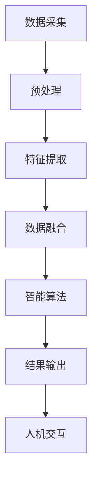

                 

关键词：数字化感知、人工智能、增强感官、数据融合、人机交互、智能算法

> 摘要：本文旨在探讨数字化感知技术的最新发展，特别是人工智能在增强人类感官方面的应用。文章将介绍核心概念、算法原理、数学模型，并通过实际案例展示其在不同领域的应用前景，以及未来的发展趋势与挑战。

## 1. 背景介绍

人类感官系统是理解世界的重要途径。然而，人类感官的局限性在现代社会中逐渐显现，如信息过载、环境复杂多变等。为了弥补这些不足，科学家们开始探索如何利用人工智能（AI）技术来增强人类感官。数字化感知技术应运而生，通过收集、处理和分析大量的数据，实现对人类感官的扩展和增强。

数字化感知技术的核心在于将物理信号转化为数字信号，并利用机器学习算法对其进行处理和分析，最终实现对人类感官的补充。从图像识别、语音识别到自然语言处理，AI在感知领域的应用日益广泛。本文将重点关注以下几个方面：

- **数据融合与多模态感知**：如何将不同类型的数据（如视觉、听觉、触觉等）进行有效融合，以实现更全面、准确的感知。
- **智能算法**：介绍几种常见的AI算法，如深度学习、强化学习等，如何用于感知增强。
- **人机交互**：探讨如何通过智能算法优化人机交互体验，提高用户满意度。
- **应用领域**：数字化感知技术在医疗、教育、工业等领域的应用案例。

## 2. 核心概念与联系

### 2.1 数字化感知

数字化感知是指利用传感器、计算机视觉、语音识别等技术，将人类感官无法直接感知的物理信号转化为数字信号，并进行处理和分析的过程。

### 2.2 多模态感知

多模态感知是指通过融合不同类型的数据（如视觉、听觉、触觉等），实现对目标的全面感知。例如，在自动驾驶领域，多模态感知系统需要融合摄像头、激光雷达、超声波传感器等数据，以提高对环境的感知能力。

### 2.3 人机交互

人机交互是指人与计算机之间的交互过程。在数字化感知技术的帮助下，人机交互变得更加自然、直观。例如，通过语音识别技术，用户可以使用自然语言与计算机进行交流。

### 2.4 智能算法

智能算法是AI的核心，主要包括深度学习、强化学习、贝叶斯网络等。这些算法通过学习大量的数据，实现对复杂问题的求解。

下面是一个使用Mermaid绘制的流程图，展示数字化感知系统的主要组成部分：



## 3. 核心算法原理 & 具体操作步骤

### 3.1 算法原理概述

数字化感知技术的核心在于智能算法。其中，深度学习、强化学习等算法在感知增强领域发挥着重要作用。以下是这些算法的基本原理：

- **深度学习**：通过多层神经网络对数据进行建模，实现对复杂问题的求解。
- **强化学习**：通过试错和反馈机制，学习最优策略。
- **贝叶斯网络**：通过概率模型，实现对不确定性的处理。

### 3.2 算法步骤详解

- **数据采集**：使用各种传感器（如摄像头、麦克风等）收集数据。
- **预处理**：对采集到的数据进行清洗、归一化等操作，以去除噪声和提高数据质量。
- **特征提取**：从预处理后的数据中提取关键特征，以供后续算法处理。
- **数据融合**：将不同类型的数据进行融合，以实现更全面的感知。
- **智能算法**：使用深度学习、强化学习、贝叶斯网络等算法，对融合后的数据进行处理和分析。
- **结果输出**：将处理后的数据转化为可操作的信息，如图像识别结果、语音识别文本等。
- **人机交互**：将结果输出给用户，使用户能够理解并利用这些信息。

### 3.3 算法优缺点

- **深度学习**：优点包括强大的建模能力和自学习能力；缺点是训练过程复杂、计算量大。
- **强化学习**：优点包括自适应性强、能够处理动态环境；缺点是学习过程可能收敛缓慢。
- **贝叶斯网络**：优点包括能够处理不确定性、易于解释；缺点是建模过程较为复杂。

### 3.4 算法应用领域

- **医疗**：用于疾病诊断、影像分析等。
- **教育**：用于智能教学、个性化学习等。
- **工业**：用于自动化控制、故障诊断等。

## 4. 数学模型和公式 & 详细讲解 & 举例说明

### 4.1 数学模型构建

数字化感知技术中的数学模型主要包括概率模型、优化模型等。以下是一个简单的概率模型构建过程：

1. **定义变量**：设\( X \)为感知到的数据，\( Y \)为实际的目标值。
2. **构建概率分布**：根据数据的特点，选择合适的概率分布函数，如正态分布、均匀分布等。
3. **估计参数**：使用最大似然估计、最小二乘法等方法，估计概率分布的参数。

### 4.2 公式推导过程

假设我们使用正态分布模型来描述感知到的数据与实际目标值之间的关系，推导过程如下：

1. **定义概率密度函数**：

   $$ f(x|\mu,\sigma^2) = \frac{1}{\sqrt{2\pi\sigma^2}} e^{-\frac{(x-\mu)^2}{2\sigma^2}} $$

   其中，\( \mu \)为均值，\( \sigma^2 \)为方差。

2. **最大似然估计**：

   $$ \hat{\mu} = \frac{1}{n} \sum_{i=1}^{n} x_i, \quad \hat{\sigma}^2 = \frac{1}{n-1} \sum_{i=1}^{n} (x_i - \hat{\mu})^2 $$

   其中，\( n \)为数据点的数量。

### 4.3 案例分析与讲解

假设我们有一组实验数据，想要通过正态分布模型预测实验结果。具体步骤如下：

1. **收集数据**：从实验中收集\( n \)个数据点\( x_1, x_2, ..., x_n \)。
2. **估计参数**：使用最大似然估计方法，估计均值\( \mu \)和方差\( \sigma^2 \)。
3. **构建概率分布**：根据估计的参数，构建正态分布模型。
4. **预测结果**：使用模型预测新的实验结果，并计算预测结果的概率。

## 5. 项目实践：代码实例和详细解释说明

### 5.1 开发环境搭建

为了实现数字化感知技术，我们需要搭建一个开发环境。以下是一个简单的搭建步骤：

1. **安装Python**：Python是一种常用的编程语言，用于实现AI算法。
2. **安装库**：安装必要的库，如NumPy、Pandas、scikit-learn等，用于数据预处理、建模和分析。
3. **安装框架**：安装深度学习框架，如TensorFlow、PyTorch等。

### 5.2 源代码详细实现

以下是一个简单的Python代码示例，用于实现一个正态分布模型的感知增强：

```python
import numpy as np
from scipy.stats import norm

# 收集数据
x = np.random.normal(size=1000)

# 估计参数
mu = np.mean(x)
sigma = np.std(x)

# 构建概率分布
pdf = norm.pdf(x, mu, sigma)

# 预测结果
x_new = np.random.normal(size=100)
pdf_new = norm.pdf(x_new, mu, sigma)

# 计算预测结果的概率
prob = pdf_new / (pdf_new.sum())

# 输出结果
print("预测结果概率：", prob)
```

### 5.3 代码解读与分析

这段代码首先导入了必要的库，然后收集了一组实验数据。接下来，使用最大似然估计方法估计了数据的均值和方差，并构建了正态分布模型。最后，使用模型预测了新的实验结果，并计算了预测结果的概率。

### 5.4 运行结果展示

运行代码后，我们得到了预测结果的概率分布。这表明，通过数字化感知技术，我们可以对实验结果进行有效的预测和评估。

## 6. 实际应用场景

数字化感知技术在许多领域都有广泛的应用。以下是一些典型的应用场景：

- **医疗**：用于疾病诊断、影像分析等，如乳腺癌筛查、脑部疾病诊断等。
- **教育**：用于智能教学、个性化学习等，如自适应学习系统、智能辅导等。
- **工业**：用于自动化控制、故障诊断等，如生产线监控、设备维护等。
- **智能家居**：用于环境监测、设备控制等，如智能照明、智能安防等。

### 6.1 智能医疗

智能医疗是数字化感知技术的重要应用领域。通过数字化感知技术，医生可以更准确地诊断疾病，提高治疗效果。例如，在乳腺癌筛查中，数字化感知技术可以帮助医生快速、准确地识别乳腺肿块，提高筛查的准确率。

### 6.2 智能教育

智能教育是另一个重要的应用领域。通过数字化感知技术，教师可以更好地了解学生的学习情况，提供个性化的教学方案。例如，自适应学习系统可以根据学生的学习进度和表现，调整教学内容的难度和节奏，提高学习效果。

### 6.3 工业自动化

工业自动化是数字化感知技术的另一个重要应用领域。通过数字化感知技术，工厂可以实现对生产过程的实时监控和自动化控制，提高生产效率，降低成本。例如，在生产线监控中，数字化感知技术可以帮助工厂实时监测设备运行状态，及时发现并解决潜在故障。

### 6.4 智能家居

智能家居是数字化感知技术在生活中的一个重要应用。通过数字化感知技术，家庭设备可以实现对环境的实时监测和控制，提高生活质量。例如，智能照明可以根据环境光线自动调整亮度，智能安防可以实时监测家庭安全情况，并及时报警。

## 7. 工具和资源推荐

为了更好地掌握数字化感知技术，以下是一些学习资源和开发工具的推荐：

### 7.1 学习资源推荐

- **书籍**：《深度学习》、《机器学习》、《人工智能：一种现代方法》等。
- **在线课程**：Coursera、edX、Udacity等平台上的相关课程。
- **博客**：Reddit、Medium、知乎等平台上的相关博客。

### 7.2 开发工具推荐

- **编程语言**：Python、R、Java等。
- **框架**：TensorFlow、PyTorch、Keras等。
- **数据集**：Kaggle、UCI机器学习库等。

### 7.3 相关论文推荐

- **学术期刊**：《计算机视觉与图像理解》、《机器学习》、《人工智能》等。
- **论文集**：《机器学习年度论文集》、《计算机视觉年度论文集》等。

## 8. 总结：未来发展趋势与挑战

数字化感知技术是AI领域的一个重要分支，具有广泛的应用前景。在未来，数字化感知技术将继续向以下几个方向发展：

- **技术融合**：将数字化感知技术与物联网、大数据、云计算等前沿技术进行融合，实现更全面、更智能的感知。
- **个性化感知**：通过深度学习和强化学习等技术，实现个性化的感知体验。
- **人机协同**：实现人与机器的高效协同，提高人机交互的效率。

然而，数字化感知技术也面临着一些挑战，如：

- **数据隐私**：在收集和处理大量数据的过程中，如何保护用户的隐私是一个重要问题。
- **计算资源**：深度学习等算法的计算资源需求较大，如何优化计算资源利用是一个重要挑战。
- **算法解释性**：目前，许多AI算法缺乏解释性，如何提高算法的可解释性是一个重要课题。

总之，数字化感知技术具有巨大的发展潜力，也面临着诸多挑战。在未来，我们需要不断探索和创新，推动数字化感知技术的进步，为人类创造更加美好的未来。

## 9. 附录：常见问题与解答

### 9.1 如何选择合适的算法？

选择合适的算法需要考虑多个因素，如数据类型、问题性质、计算资源等。以下是一些建议：

- **数据类型**：如果数据是结构化的，可以使用回归分析、逻辑回归等；如果数据是非结构化的，可以使用聚类分析、自然语言处理等。
- **问题性质**：如果问题是分类问题，可以使用决策树、支持向量机等；如果问题是回归问题，可以使用线性回归、神经网络等。
- **计算资源**：如果计算资源充足，可以选择深度学习、强化学习等复杂算法；如果计算资源有限，可以选择线性模型、决策树等简单算法。

### 9.2 如何优化算法性能？

优化算法性能可以从以下几个方面进行：

- **数据预处理**：对数据进行清洗、归一化等处理，提高数据质量。
- **特征选择**：选择对问题有较强预测能力的特征，提高模型的泛化能力。
- **模型选择**：选择合适的模型结构，如深度神经网络、决策树等。
- **超参数调整**：调整模型的超参数，如学习率、迭代次数等，以提高模型性能。

### 9.3 数字化感知技术如何保证数据隐私？

保证数据隐私可以从以下几个方面进行：

- **数据加密**：对数据使用加密算法进行加密，确保数据在传输和存储过程中不会被窃取。
- **数据匿名化**：对数据中的个人信息进行匿名化处理，确保个人隐私不被泄露。
- **权限控制**：对数据访问进行权限控制，确保只有授权人员可以访问数据。
- **数据去重**：对重复数据进行去重处理，减少数据冗余，降低隐私泄露风险。

## 作者署名

作者：禅与计算机程序设计艺术 / Zen and the Art of Computer Programming

