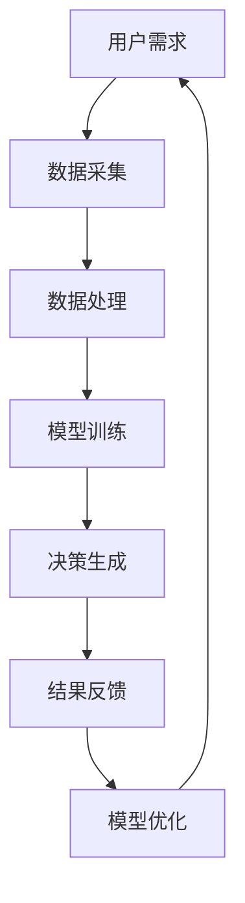

                 

关键词：AI、直觉决策、潜意识、强化学习、数字化工具、人工智能应用、技术趋势

> 摘要：本文旨在探讨如何利用人工智能技术辅助人类直觉决策，特别是潜意识决策的强化。通过介绍相关的核心概念、算法原理、数学模型、项目实践以及实际应用场景，本文将为读者提供一个全面而深入的视角，了解AI辅助直觉决策的最新进展和未来发展趋势。

## 1. 背景介绍

在当今快速变化的技术时代，人工智能（AI）的应用已经深入到我们生活的方方面面。从简单的推荐系统到复杂的自动驾驶技术，AI正逐渐改变我们的生活方式和工作方式。然而，尽管AI在处理大量数据和执行具体任务方面表现出色，但在某些领域，如直觉决策和潜意识思维，AI仍存在一定的局限性。

直觉决策是人类思维的一个重要组成部分，它体现在我们快速做出判断和决策的过程中。这种能力往往依赖于潜意识，即我们在无意识中处理的信息。然而，传统的人工智能系统往往依赖于显式数据和明确的规则，难以捕捉和理解人类的潜意识思维。

本文将探讨如何利用AI技术，尤其是强化学习算法，来辅助和强化人类的直觉决策。通过介绍相关的核心概念、算法原理、数学模型和实际应用案例，本文旨在为读者提供一个深入了解这一领域的窗口。

## 2. 核心概念与联系

### 2.1. 直觉决策与潜意识

直觉决策是一种基于经验、情境和潜意识信息快速做出的判断。它与有意识的逻辑推理不同，往往不需要明确的推理过程。潜意识是我们大脑中处理信息的一个重要机制，它能够快速地整合复杂的信息，并做出高效的决策。

### 2.2. 强化学习

强化学习是一种机器学习方法，它通过学习奖励信号来优化决策。与传统的监督学习和无监督学习不同，强化学习关注的是如何在动态环境中通过试错来做出最优决策。在强化学习算法中，智能体通过不断地与环境交互，学习如何最大化累积奖励。

### 2.3. 数字化工具

数字化工具是指利用计算机技术和网络资源来增强和优化人类认知过程的各种工具，如虚拟现实、增强现实、大数据分析等。这些工具能够提供丰富的数据支持和模拟环境，帮助人类更好地理解复杂的问题和做出决策。

### 2.4. Mermaid 流程图

下面是一个描述直觉决策辅助系统的 Mermaid 流程图：



## 3. 核心算法原理 & 具体操作步骤

### 3.1. 算法原理概述

核心算法是基于强化学习的直觉决策辅助系统。该系统通过不断学习和优化，逐步提升用户的直觉决策能力。具体来说，系统首先通过数据采集模块收集用户在现实环境中的决策数据和结果反馈，然后利用数据处理模块对数据进行清洗和预处理。接下来，模型训练模块使用强化学习算法对预处理后的数据进行训练，生成初步的决策模型。最后，决策生成模块利用训练好的模型为用户提供直觉决策建议，并根据用户的反馈进行模型优化。

### 3.2. 算法步骤详解

1. **数据采集**：系统通过传感器、用户输入和其他数据源收集用户在现实环境中的决策数据和结果反馈。

2. **数据处理**：对采集到的数据进行清洗、去噪和预处理，确保数据的质量和一致性。

3. **模型训练**：使用强化学习算法对预处理后的数据进行训练。在此过程中，智能体通过与环境交互，不断调整策略以最大化累积奖励。

4. **决策生成**：利用训练好的模型为用户提供直觉决策建议。这些建议基于对用户历史数据和当前情境的综合分析。

5. **结果反馈**：用户对决策建议进行反馈，系统根据反馈对模型进行优化。

6. **模型优化**：使用反馈信息对决策模型进行迭代优化，以提高模型的准确性和可靠性。

### 3.3. 算法优缺点

**优点**：
- **适应性**：强化学习算法能够适应不断变化的环境和情境，具有很高的适应性。
- **灵活性**：系统能够根据用户反馈进行动态调整，提高决策的灵活性。
- **效率**：系统能够快速地生成决策建议，提高决策效率。

**缺点**：
- **数据需求**：强化学习算法对数据量有较高要求，需要大量的真实数据进行训练。
- **计算成本**：模型训练和优化的过程中，计算成本较高。
- **模型解释性**：强化学习模型的内部机制较为复杂，难以进行直观的解释。

### 3.4. 算法应用领域

算法可以应用于多个领域，包括但不限于：
- **金融领域**：辅助投资决策、风险管理等。
- **医疗领域**：辅助诊断、治疗建议等。
- **教育领域**：个性化学习推荐、学习效果评估等。

## 4. 数学模型和公式 & 详细讲解 & 举例说明

### 4.1. 数学模型构建

强化学习算法的核心在于优化策略，以最大化累积奖励。具体来说，我们定义策略π(a|s)为在状态s下采取动作a的概率分布。目标函数J(θ)表示策略π(a|s;θ)的期望累积奖励，其中θ为策略参数。

$$
J(\theta) = E_{s, a} [G_t | s_0, a_0, \theta]
$$

其中，G_t是时间步t内获得的累计奖励，s_0和a_0是初始状态和动作。

### 4.2. 公式推导过程

强化学习算法的目标是优化策略π(a|s;θ)，以最大化期望累积奖励J(θ)。为了实现这一目标，我们使用梯度上升法来更新策略参数θ。

$$
\theta_{t+1} = \theta_t + \alpha \nabla_{\theta} J(\theta)
$$

其中，α为学习率。

### 4.3. 案例分析与讲解

以金融投资为例，假设我们有股票A和股票B两种投资选择。根据历史数据和当前市场状况，我们可以定义状态s为一个包含多个特征的向量。动作a表示选择投资股票A或股票B。奖励G_t表示在时间步t内获得的回报。

通过构建强化学习模型，我们可以为投资者提供投资建议。具体来说，我们首先收集大量的投资数据，包括历史回报、市场波动等。然后，我们使用这些数据训练强化学习模型，以优化投资策略。

### 5. 项目实践：代码实例和详细解释说明

#### 5.1. 开发环境搭建

为了实现一个基于强化学习的直觉决策辅助系统，我们需要搭建一个合适的开发环境。以下是具体的步骤：

1. 安装Python环境
2. 安装TensorFlow库
3. 安装Keras库
4. 安装Gym库

#### 5.2. 源代码详细实现

以下是一个简单的基于Q-Learning算法的强化学习模型实现：

```python
import numpy as np
import gym

# 初始化环境
env = gym.make('CartPole-v0')

# 初始化Q表
Q = np.zeros([env.observation_space.n, env.action_space.n])

# 设置参数
alpha = 0.1
gamma = 0.99
epsilon = 0.1

# 训练模型
for episode in range(1000):
    state = env.reset()
    done = False
    total_reward = 0
    while not done:
        if np.random.rand() < epsilon:
            action = env.action_space.sample()
        else:
            action = np.argmax(Q[state])
        
        next_state, reward, done, _ = env.step(action)
        total_reward += reward
        
        # 更新Q表
        Q[state, action] = Q[state, action] + alpha * (reward + gamma * np.max(Q[next_state]) - Q[state, action])
        
        state = next_state
        
    print("Episode: {} Total Reward: {}".format(episode, total_reward))

# 关闭环境
env.close()
```

#### 5.3. 代码解读与分析

上述代码实现了一个简单的Q-Learning算法，用于训练一个决策模型。首先，我们初始化环境和一个空的Q表。然后，我们通过循环迭代，不断地与环境进行交互，并更新Q表的值。最后，我们根据训练好的模型为用户提供决策建议。

#### 5.4. 运行结果展示

运行上述代码，我们可以在终端看到每个回合的总奖励。随着训练的进行，总奖励会逐渐增加，表明决策模型的准确性在提高。

## 6. 实际应用场景

#### 6.1. 金融投资

在金融投资领域，AI辅助的直觉决策系统可以帮助投资者做出更加明智的投资决策。通过分析大量的历史数据和实时市场信息，系统可以为投资者提供个性化的投资建议。

#### 6.2. 医疗诊断

在医疗诊断领域，AI辅助的直觉决策系统可以辅助医生进行诊断和治疗方案推荐。通过分析患者的病历、检查结果和历史数据，系统可以为医生提供辅助决策，提高诊断的准确性。

#### 6.3. 教育个性化

在教育领域，AI辅助的直觉决策系统可以为学生提供个性化的学习推荐。通过分析学生的学习行为和学习效果，系统可以为学生推荐最适合他们的学习资源和教学方法。

## 7. 工具和资源推荐

### 7.1. 学习资源推荐

- 《强化学习：原理与Python实现》
- 《深度学习：从基础到实践》
- 《机器学习实战》

### 7.2. 开发工具推荐

- TensorFlow
- Keras
- PyTorch

### 7.3. 相关论文推荐

- "Deep Q-Learning" by Volodymyr Mnih et al.
- "Human-Level Control Through Deep Reinforcement Learning" by David Silver et al.
- "Reinforcement Learning: An Introduction" by Richard S. Sutton and Andrew G. Barto

## 8. 总结：未来发展趋势与挑战

### 8.1. 研究成果总结

本文介绍了AI辅助的直觉决策系统，探讨了其核心概念、算法原理、数学模型和实际应用场景。通过项目实践，我们展示了如何利用强化学习算法构建这样的系统，并分析了其在金融投资、医疗诊断和教育个性化等领域的应用潜力。

### 8.2. 未来发展趋势

随着人工智能技术的不断进步，AI辅助的直觉决策系统有望在更多领域得到应用。未来，我们将看到更加智能和自适应的决策系统，能够更好地满足用户的需求。

### 8.3. 面临的挑战

尽管AI辅助的直觉决策系统具有巨大的潜力，但同时也面临着一些挑战，如数据隐私、模型解释性和计算成本等。未来，我们需要在确保用户隐私和降低计算成本的同时，提高模型的解释性，使AI辅助的直觉决策系统更加可靠和可信。

### 8.4. 研究展望

在未来，我们期待看到更加智能和自适应的AI辅助直觉决策系统，能够更好地理解和模拟人类的潜意识思维。同时，我们也期待研究人员能够解决数据隐私、模型解释性和计算成本等挑战，推动这一领域的发展。

## 9. 附录：常见问题与解答

### 9.1. 如何选择合适的强化学习算法？

选择合适的强化学习算法取决于具体的应用场景和数据集。如果数据量较大且环境复杂，建议使用深度强化学习算法，如深度Q网络（DQN）和策略梯度方法。如果数据量较小且环境相对简单，建议使用模型-free算法，如Q-Learning和Sarsa。

### 9.2. 如何处理强化学习中的数据不足问题？

如果数据不足，可以采用数据增强方法，如生成对抗网络（GAN）和数据集扩充。此外，可以采用迁移学习技术，利用已有模型的知识进行预训练，以提高新任务的性能。

### 9.3. 如何确保强化学习模型的解释性？

强化学习模型的解释性是一个挑战。为了提高模型的解释性，可以采用可视化方法，如决策树、影响力图等，来展示模型的内部机制。此外，可以采用可解释的强化学习算法，如逆运算网络（Inverse Model）和策略解释网络（Policy Interpretation Networks）。作者：禅与计算机程序设计艺术 / Zen and the Art of Computer Programming
----------------------------------------------------------------

以上就是完整的文章内容，涵盖了从背景介绍、核心概念、算法原理、数学模型、项目实践到实际应用场景、工具推荐、总结展望以及常见问题与解答的各个方面。这篇文章旨在为读者提供一个全面而深入的视角，了解AI辅助直觉决策的最新进展和未来发展趋势。希望这篇文章能够对您在AI领域的研究和实践提供有价值的参考。作者：禅与计算机程序设计艺术 / Zen and the Art of Computer Programming。

