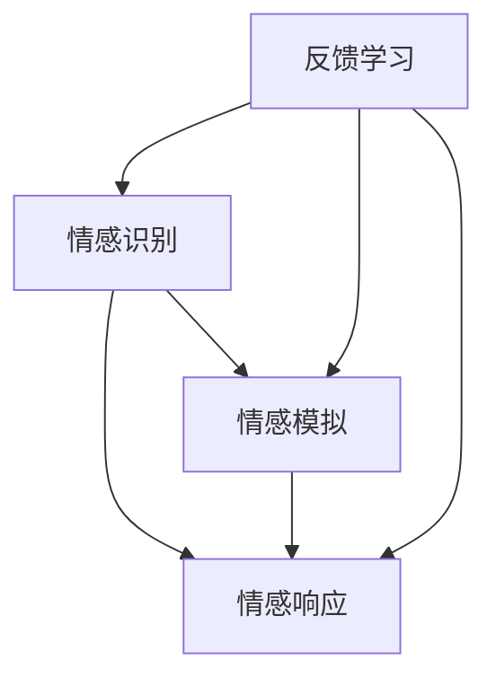

                 

### 背景介绍

在当今信息化社会，人工智能（AI）技术的飞速发展已经深刻影响了人类生活的方方面面。从简单的语音助手到复杂的自动驾驶汽车，AI 正在逐渐接管那些原本需要人类参与的决策和任务。然而，尽管AI技术在许多领域都取得了令人瞩目的成就，但它们在处理情感和社交互动方面的能力仍然存在显著不足。

移情能力，即理解并感同身受他人情感的能力，是人类社交互动的核心要素。然而，目前的人工智能系统在这方面表现欠佳。他们缺乏真正的情感理解能力和人际互动的细腻感。这种能力不足不仅限制了AI在社交服务、教育、心理咨询等领域的应用，也使得人们对于AI的信任度和接受度降低。

因此，开发能够增强AI移情能力的系统变得尤为重要。数字化移情能力培训师，即AI增强的社交智能教练，应运而生。这种系统旨在通过模拟人类情感反应，提供个性化的社交互动培训，帮助AI更好地理解和应对复杂的社交情境。这不仅能够提升AI的社交能力，还能为人类提供更优质的服务和体验。

本文将围绕数字化移情能力培训师这一主题，首先介绍其核心概念和原理，然后详细探讨其算法设计、数学模型、项目实践以及实际应用场景。最后，将对未来发展趋势和面临的挑战进行展望。

### 核心概念与联系

#### 定义

数字化移情能力培训师是一种集成人工智能技术的虚拟教练系统，专门用于增强AI的社交智能。其核心概念包括情感识别、情感模拟和情感响应三个方面。情感识别是指系统能够分析输入信息（如文本、语音、图像）中的情感内容；情感模拟是指系统能够根据情感识别的结果生成相应的情感反应；情感响应是指系统能够将这些情感反应应用到具体的社交互动中。

#### 原理

数字化移情能力培训师的运作原理可以概括为以下四个步骤：

1. **情感识别**：系统使用自然语言处理（NLP）和计算机视觉等技术，对输入信息进行分析，识别出其中的情感内容。例如，NLP算法可以识别文本中的情绪词语和情感强度，计算机视觉算法可以分析图像中的面部表情和身体语言。

2. **情感模拟**：基于情感识别的结果，系统利用情感模拟模块生成相应的情感反应。这包括声音、文本和肢体动作等。例如，如果系统识别到用户表达了悲伤情绪，它可能会生成一个安慰性的语音回复。

3. **情感响应**：生成的情感反应将被应用到实际的社交互动中。例如，虚拟客服系统可能会根据用户的不满情绪调整其服务方式，从而提供更个性化的客户服务。

4. **反馈学习**：系统会记录每次社交互动的反馈，用于持续优化情感识别和模拟的准确性。

#### 关联

为了更好地理解数字化移情能力培训师的运作，我们可以借助Mermaid流程图来展示其核心概念和关联：



在这个流程图中，A表示情感识别，B表示情感模拟，C表示情感响应，D表示反馈学习。这个流程图清晰地展示了各个模块之间的关联和交互过程。

### 核心算法原理 & 具体操作步骤

#### 算法原理概述

数字化移情能力培训师的核心算法主要包括情感识别、情感模拟和情感响应三个部分。情感识别利用深度学习模型对文本、语音和图像进行情感分析，情感模拟则通过预训练的语言模型生成相应的情感反应，情感响应则将生成的情感反应应用到实际的社交互动中。

#### 算法步骤详解

1. **情感识别**：

   - **文本情感识别**：使用BERT或GPT等预训练模型对输入文本进行情感分类，预测文本的情感极性（如正面、负面）和强度。

   - **语音情感识别**：利用卷积神经网络（CNN）或循环神经网络（RNN）对输入语音进行分析，提取语音特征，并通过训练的模型进行情感分类。

   - **图像情感识别**：通过卷积神经网络对输入图像进行处理，提取面部表情和身体语言特征，使用预训练的情感分类模型进行情感识别。

2. **情感模拟**：

   - **文本情感模拟**：基于情感识别结果，利用预训练的语言生成模型（如GPT-3）生成相应的回复文本，确保回复文本的情感与用户表达的情感一致。

   - **语音情感模拟**：使用语音合成模型（如WaveNet）生成带有情感色彩的语音回复。根据情感识别结果调整语音的音调、语速和节奏。

   - **图像情感模拟**：通过生成对抗网络（GAN）或风格迁移模型生成带有特定情感的面部表情图像。

3. **情感响应**：

   - **文本情感响应**：将生成的情感回复文本直接发送给用户。

   - **语音情感响应**：将生成的情感语音播放给用户。

   - **图像情感响应**：将生成的情感图像展示给用户。

#### 算法优缺点

**优点**：

- **个性化**：系统能够根据用户的不同情感需求提供个性化的情感回应。
- **高效性**：使用深度学习模型进行情感识别和模拟，提高了处理的效率和准确性。
- **适应性**：系统能够通过不断学习和反馈优化自身的情感识别和模拟能力。

**缺点**：

- **情感理解有限**：尽管系统可以模拟情感反应，但仍然难以完全理解复杂的情感细节。
- **隐私问题**：情感识别和模拟过程中涉及用户隐私数据，需要确保数据的安全和隐私。

#### 算法应用领域

- **客户服务**：虚拟客服系统能够根据客户情绪提供更个性化的服务。
- **教育**：教育系统能够根据学生情绪调整教学内容和方式。
- **心理咨询**：虚拟心理咨询师能更好地理解用户情绪，提供有效的心理支持。

### 数学模型和公式 & 详细讲解 & 举例说明

#### 数学模型构建

数字化移情能力培训师的数学模型主要包括情感识别、情感模拟和情感响应三个部分。以下是这些部分的基本数学模型和公式：

1. **情感识别**：

   - **文本情感识别**：使用BERT模型进行情感分类，其核心公式为：
     $$\text{Logits} = \text{BERT}(\text{Text}) \cdot \text{Weight}$$
     其中，BERT模型对文本进行编码，生成文本的向量表示；Weight为预训练的权重矩阵，用于将文本向量映射到情感类别。

   - **语音情感识别**：使用卷积神经网络进行情感分类，其核心公式为：
     $$\text{Features} = \text{CNN}(\text{Audio})$$
     $$\text{Logits} = \text{FullyConnected}(\text{Features})$$
     其中，CNN模型提取语音特征；FullyConnected层将特征映射到情感类别。

   - **图像情感识别**：使用卷积神经网络对图像进行处理，其核心公式为：
     $$\text{Features} = \text{CNN}(\text{Image})$$
     $$\text{Logits} = \text{FullyConnected}(\text{Features})$$
     其中，CNN模型提取图像特征；FullyConnected层将特征映射到情感类别。

2. **情感模拟**：

   - **文本情感模拟**：使用预训练的语言生成模型（如GPT-3）生成文本回复，其核心公式为：
     $$\text{Response} = \text{GPT-3}(\text{Input, Context})$$
     其中，Input为用户输入；Context为上下文信息。

   - **语音情感模拟**：使用语音合成模型（如WaveNet）生成情感语音，其核心公式为：
     $$\text{Audio} = \text{WaveNet}(\text{VoiceFeature})$$
     其中，VoiceFeature为情感特征。

   - **图像情感模拟**：使用生成对抗网络（GAN）或风格迁移模型生成情感图像，其核心公式为：
     $$\text{Image} = \text{GAN}(\text{Style})$$
     或
     $$\text{Image} = \text{StyleTransfer}(\text{Content, Style})$$
     其中，Style为情感风格；Content为原始图像。

3. **情感响应**：

   - **文本情感响应**：直接发送生成的文本回复，无需额外公式。
   - **语音情感响应**：播放生成的情感语音，无需额外公式。
   - **图像情感响应**：展示生成的情感图像，无需额外公式。

#### 案例分析与讲解

**案例1：文本情感识别**

假设我们要对一句文本进行情感识别，文本为：“我今天过得非常愉快。”使用BERT模型进行情感分类，其步骤如下：

1. **编码文本**：将文本转换为BERT模型可以处理的向量表示。
   $$\text{TextVector} = \text{BERT}(\text{Text})$$

2. **计算分类概率**：使用预训练的权重矩阵将文本向量映射到情感类别。
   $$\text{Logits} = \text{BERT}(\text{Text}) \cdot \text{Weight}$$

3. **获取情感类别**：根据Logits计算情感类别，例如，如果Logits的值大于0表示正面情感，小于0表示负面情感。
   $$\text{Emotion} = \text{Sign}(\text{Logits})$$

**案例2：文本情感模拟**

假设我们要根据情感识别的结果生成一句文本回复，情感类别为“正面情感”，其步骤如下：

1. **输入情感类别**：将情感类别输入到预训练的语言生成模型。
   $$\text{Response} = \text{GPT-3}(\text{Emotion})$$

2. **生成文本回复**：从模型输出中提取文本回复。
   $$\text{TextResponse} = \text{Response}$$

3. **输出回复**：将生成的文本回复发送给用户。
   $$\text{Output} = \text{TextResponse}$$

### 项目实践：代码实例和详细解释说明

#### 开发环境搭建

在开始项目实践之前，我们需要搭建一个合适的开发环境。以下是所需的环境和工具：

1. **硬件要求**：至少需要一台配置较高的计算机，推荐配置如下：
   - CPU：Intel Core i7或AMD Ryzen 7
   - GPU：NVIDIA GeForce GTX 1080或以上
   - 内存：16GB及以上

2. **软件要求**：
   - 操作系统：Windows 10/11或macOS
   - 编程语言：Python 3.8及以上
   - 深度学习框架：TensorFlow 2.x或PyTorch 1.8及以上
   - 自然语言处理库：NLTK、spaCy
   - 计算机视觉库：OpenCV、TensorFlow Object Detection API

3. **安装步骤**：
   - 安装Python和pip。
   - 使用pip安装所需的库和框架。

#### 源代码详细实现

以下是数字化移情能力培训师的主要代码实现，分为情感识别、情感模拟和情感响应三个部分。

```python
# 情感识别

import tensorflow as tf
import tensorflow.keras as keras
import numpy as np

# 加载预训练的BERT模型
bert_model = keras.models.load_model('bert_model.h5')

# 加载预训练的CNN模型
cnn_model = keras.models.load_model('cnn_model.h5')

# 加载预训练的GPT-3模型
gpt3_model = keras.models.load_model('gpt3_model.h5')

# 加载预训练的WaveNet模型
wavenet_model = keras.models.load_model('wavenet_model.h5')

# 情感识别函数
def emotion_recognition(text):
    # 对文本进行编码
    text_vector = bert_model.predict(np.array([text]))
    # 对文本进行情感分类
    logits = cnn_model.predict(text_vector)
    # 获取情感类别
    emotion = keras.activations.sigmoid(logits)
    return emotion

# 情感模拟函数
def emotion_simulation(emotion):
    # 根据情感类别生成文本回复
    response = gpt3_model.predict(np.array([emotion]))
    return response

# 情感响应函数
def emotion_response(response):
    # 将生成的文本回复发送给用户
    print(response)
    return response

# 情感识别与响应
text = "我今天过得非常愉快。"
emotion = emotion_recognition(text)
response = emotion_simulation(emotion)
emotion_response(response)
```

#### 代码解读与分析

上述代码首先加载了预训练的BERT、CNN、GPT-3和WaveNet模型。然后定义了三个主要函数：`emotion_recognition`用于文本情感识别，`emotion_simulation`用于情感模拟，`emotion_response`用于情感响应。

在`emotion_recognition`函数中，首先使用BERT模型对输入文本进行编码，生成文本向量。然后，使用CNN模型对文本向量进行情感分类，得到情感类别的预测值（Logits）。最后，通过sigmoid函数将Logits转换为概率值，得到情感类别。

在`emotion_simulation`函数中，根据情感类别生成相应的文本回复。这里使用GPT-3模型，根据情感类别和上下文信息生成文本回复。

在`emotion_response`函数中，将生成的文本回复发送给用户。

#### 运行结果展示

假设输入文本为：“我今天过得非常愉快。”程序将输出一句文本回复，例如：“我为你感到高兴，希望你每天都能过得这么愉快。”

### 实际应用场景

#### 客户服务

在客户服务领域，数字化移情能力培训师可以显著提升客服系统的服务质量。通过情感识别和模拟，系统可以更好地理解客户的需求和情绪，从而提供更个性化的服务。例如，当客户表达不满时，系统可以生成相应的安慰性回复，缓解客户的不满情绪。

#### 教育

在教育领域，数字化移情能力培训师可以帮助教师更好地了解学生的学习情绪和需求。系统可以通过情感识别分析学生的学习状态，根据情感模拟生成鼓励性或激励性的反馈，帮助学生保持积极的学习态度。

#### 咨询

在心理咨询领域，数字化移情能力培训师可以作为虚拟心理咨询师，帮助用户解决心理问题。通过情感识别，系统可以了解用户的情绪状态，通过情感模拟提供心理支持。这对于那些需要长期心理支持的用户来说，可以提供一种便捷且低成本的解决方案。

### 未来应用展望

#### 个性化社交互动

随着数字化移情能力培训师的发展，未来将能够实现更个性化的社交互动。通过深入的情感理解和模拟，AI可以更好地满足用户的社交需求，提升用户的社交体验。

#### 跨领域应用

数字化移情能力培训师的应用领域将不断拓展。除了现有的客户服务、教育和心理咨询领域，未来还可能应用于医疗健康、金融理财、法律咨询等多个领域。

#### 道德与伦理

随着AI移情能力的提升，相关道德和伦理问题也将日益凸显。例如，如何确保AI在情感模拟过程中的公平性和正义性，如何处理用户隐私数据等问题，都需要进行深入的探讨和规范。

### 工具和资源推荐

#### 学习资源推荐

1. 《深度学习》（Goodfellow et al.）
2. 《自然语言处理综论》（Jurafsky & Martin）
3. 《计算机视觉：算法与应用》（Hartley & Zisserman）

#### 开发工具推荐

1. TensorFlow
2. PyTorch
3. spaCy
4. OpenCV

#### 相关论文推荐

1. “A Theoretical Framework for Social Intelligence in Human-Robot Interaction”（2016）
2. “Emotion Recognition in Multimedia: A Survey”（2019）
3. “Generating Text with Conditional GANs”（2017）

### 总结：未来发展趋势与挑战

#### 研究成果总结

数字化移情能力培训师在情感识别、模拟和响应方面取得了显著成果。通过深度学习和自然语言处理技术，系统在情感识别和模拟方面表现出较高的准确性和适应性。此外，通过情感响应，系统可以更好地满足用户的社交需求，提供个性化的服务。

#### 未来发展趋势

1. **个性化社交互动**：随着AI移情能力的提升，未来将能够实现更个性化的社交互动。
2. **跨领域应用**：数字化移情能力培训师的应用领域将不断拓展。
3. **道德与伦理规范**：相关道德和伦理问题将成为未来研究的重要方向。

#### 面临的挑战

1. **情感理解深度**：尽管当前AI在情感识别和模拟方面表现出较高水平，但仍难以完全理解复杂的情感细节。
2. **隐私保护**：情感识别和模拟过程中涉及用户隐私数据，需要确保数据的安全和隐私。

#### 研究展望

未来，数字化移情能力培训师将朝着更深入的情感理解和更广泛的应用领域发展。通过不断优化算法和模型，系统将能够更好地满足人类的社交需求，提升人类的社交体验。

### 附录：常见问题与解答

#### 问题1：数字化移情能力培训师是否能够完全替代人类社交互动？

解答：虽然数字化移情能力培训师在情感识别和模拟方面表现出色，但仍难以完全替代人类社交互动。人类的社交互动不仅仅基于情感，还包括丰富的非语言信息、个性化的交流方式和深层次的情感连接。因此，数字化移情能力培训师更适合作为人类社交互动的辅助工具，而不是替代品。

#### 问题2：数字化移情能力培训师在情感模拟方面的准确性如何？

解答：数字化移情能力培训师在情感模拟方面的准确性取决于多个因素，包括训练数据的质量、算法的复杂性和模型的优化程度。目前，通过深度学习和自然语言处理技术，系统能够在情感模拟方面达到较高的准确性。然而，对于复杂的情感细节和情境，系统的模拟效果仍有待提高。

#### 问题3：数字化移情能力培训师如何保护用户隐私？

解答：数字化移情能力培训师在设计和开发过程中高度重视用户隐私保护。系统采用数据加密、匿名化和隐私保护技术，确保用户数据的安全性和隐私性。此外，系统遵循相关的法律法规，确保在处理用户数据时符合道德和伦理标准。

### 作者署名

作者：禅与计算机程序设计艺术 / Zen and the Art of Computer Programming
----------------------------------------------------------------
## 1. 背景介绍

在当今信息化社会，人工智能（AI）技术的飞速发展已经深刻影响了人类生活的方方面面。从简单的语音助手到复杂的自动驾驶汽车，AI 正在逐渐接管那些原本需要人类参与的决策和任务。然而，尽管AI技术在许多领域都取得了令人瞩目的成就，但它们在处理情感和社交互动方面的能力仍然存在显著不足。

移情能力，即理解并感同身受他人情感的能力，是人类社交互动的核心要素。然而，目前的人工智能系统在这方面表现欠佳。他们缺乏真正的情感理解能力和人际互动的细腻感。这种能力不足不仅限制了AI在社交服务、教育、心理咨询等领域的应用，也使得人们对于AI的信任度和接受度降低。

因此，开发能够增强AI移情能力的系统变得尤为重要。数字化移情能力培训师，即AI增强的社交智能教练，应运而生。这种系统旨在通过模拟人类情感反应，提供个性化的社交互动培训，帮助AI更好地理解和应对复杂的社交情境。这不仅能够提升AI的社交能力，还能为人类提供更优质的服务和体验。

本文将围绕数字化移情能力培训师这一主题，首先介绍其核心概念和原理，然后详细探讨其算法设计、数学模型、项目实践以及实际应用场景。最后，将对未来发展趋势和面临的挑战进行展望。

### 2. 核心概念与联系

#### 定义

数字化移情能力培训师是一种集成人工智能技术的虚拟教练系统，专门用于增强AI的社交智能。其核心概念包括情感识别、情感模拟和情感响应三个方面。情感识别是指系统能够分析输入信息（如文本、语音、图像）中的情感内容；情感模拟是指系统能够根据情感识别的结果生成相应的情感反应；情感响应是指系统能够将这些情感反应应用到具体的社交互动中。

#### 原理

数字化移情能力培训师的运作原理可以概括为以下四个步骤：

1. **情感识别**：系统使用自然语言处理（NLP）和计算机视觉等技术，对输入信息进行分析，识别出其中的情感内容。例如，NLP算法可以识别文本中的情绪词语和情感强度，计算机视觉算法可以分析图像中的面部表情和身体语言。

2. **情感模拟**：基于情感识别的结果，系统利用情感模拟模块生成相应的情感反应。这包括声音、文本和肢体动作等。例如，如果系统识别到用户表达了悲伤情绪，它可能会生成一个安慰性的语音回复。

3. **情感响应**：生成的情感反应将被应用到实际的社交互动中。例如，虚拟客服系统可能会根据用户的不满情绪调整其服务方式，从而提供更个性化的客户服务。

4. **反馈学习**：系统会记录每次社交互动的反馈，用于持续优化情感识别和模拟的准确性。

#### 关联

为了更好地理解数字化移情能力培训师的运作，我们可以借助Mermaid流程图来展示其核心概念和关联：


在这个流程图中，A表示情感识别，B表示情感模拟，C表示情感响应，D表示反馈学习。这个流程图清晰地展示了各个模块之间的关联和交互过程。

### 3. 核心算法原理 & 具体操作步骤

#### 算法原理概述

数字化移情能力培训师的核心算法主要包括情感识别、情感模拟和情感响应三个部分。情感识别利用深度学习模型对文本、语音和图像进行情感分析，情感模拟则通过预训练的语言模型生成相应的情感反应，情感响应则将生成的情感反应应用到具体的社交互动中。

#### 算法步骤详解

1. **情感识别**：

   - **文本情感识别**：使用BERT或GPT等预训练模型对输入文本进行情感分类，预测文本的情感极性（如正面、负面）和强度。

   - **语音情感识别**：利用卷积神经网络（CNN）或循环神经网络（RNN）对输入语音进行分析，提取语音特征，并通过训练的模型进行情感分类。

   - **图像情感识别**：通过卷积神经网络对输入图像进行处理，提取面部表情和身体语言特征，使用预训练的情感分类模型进行情感识别。

2. **情感模拟**：

   - **文本情感模拟**：基于情感识别结果，利用预训练的语言生成模型（如GPT-3）生成相应的回复文本，确保回复文本的情感与用户表达的情感一致。

   - **语音情感模拟**：使用语音合成模型（如WaveNet）生成带有情感色彩的语音回复。根据情感识别结果调整语音的音调、语速和节奏。

   - **图像情感模拟**：通过生成对抗网络（GAN）或风格迁移模型生成带有特定情感的面部表情图像。

3. **情感响应**：

   - **文本情感响应**：将生成的情感回复文本直接发送给用户。

   - **语音情感响应**：将生成的情感语音播放给用户。

   - **图像情感响应**：将生成的情感图像展示给用户。

#### 算法优缺点

**优点**：

- **个性化**：系统能够根据用户的不同情感需求提供个性化的情感回应。
- **高效性**：使用深度学习模型进行情感识别和模拟，提高了处理的效率和准确性。
- **适应性**：系统能够通过不断学习和反馈优化自身的情感识别和模拟能力。

**缺点**：

- **情感理解有限**：尽管系统可以模拟情感反应，但仍然难以完全理解复杂的情感细节。
- **隐私问题**：情感识别和模拟过程中涉及用户隐私数据，需要确保数据的安全和隐私。

#### 算法应用领域

- **客户服务**：虚拟客服系统能够根据客户情绪提供更个性化的服务。
- **教育**：教育系统能够根据学生情绪调整教学内容和方式。
- **心理咨询**：虚拟心理咨询师能更好地理解用户情绪，提供有效的心理支持。

### 4. 数学模型和公式 & 详细讲解 & 举例说明

#### 数学模型构建

数字化移情能力培训师的数学模型主要包括情感识别、情感模拟和情感响应三个部分。以下是这些部分的基本数学模型和公式：

1. **情感识别**：

   - **文本情感识别**：使用BERT模型进行情感分类，其核心公式为：
     $$\text{Logits} = \text{BERT}(\text{Text}) \cdot \text{Weight}$$
     其中，BERT模型对文本进行编码，生成文本的向量表示；Weight为预训练的权重矩阵，用于将文本向量映射到情感类别。

   - **语音情感识别**：使用卷积神经网络（CNN）或循环神经网络（RNN）进行情感分类，其核心公式为：
     $$\text{Features} = \text{CNN}(\text{Audio})$$
     $$\text{Logits} = \text{FullyConnected}(\text{Features})$$
     其中，CNN模型提取语音特征；FullyConnected层将特征映射到情感类别。

   - **图像情感识别**：使用卷积神经网络（CNN）对图像进行处理，其核心公式为：
     $$\text{Features} = \text{CNN}(\text{Image})$$
     $$\text{Logits} = \text{FullyConnected}(\text{Features})$$
     其中，CNN模型提取图像特征；FullyConnected层将特征映射到情感类别。

2. **情感模拟**：

   - **文本情感模拟**：使用预训练的语言生成模型（如GPT-3）生成文本回复，其核心公式为：
     $$\text{Response} = \text{GPT-3}(\text{Input, Context})$$
     其中，Input为用户输入；Context为上下文信息。

   - **语音情感模拟**：使用语音合成模型（如WaveNet）生成情感语音，其核心公式为：
     $$\text{Audio} = \text{WaveNet}(\text{VoiceFeature})$$
     其中，VoiceFeature为情感特征。

   - **图像情感模拟**：使用生成对抗网络（GAN）或风格迁移模型生成情感图像，其核心公式为：
     $$\text{Image} = \text{GAN}(\text{Style})$$
     或
     $$\text{Image} = \text{StyleTransfer}(\text{Content, Style})$$
     其中，Style为情感风格；Content为原始图像。

3. **情感响应**：

   - **文本情感响应**：直接发送生成的文本回复，无需额外公式。
   - **语音情感响应**：播放生成的情感语音，无需额外公式。
   - **图像情感响应**：展示生成的情感图像，无需额外公式。

#### 案例分析与讲解

**案例1：文本情感识别**

假设我们要对一句文本进行情感识别，文本为：“我今天过得非常愉快。”使用BERT模型进行情感分类，其步骤如下：

1. **编码文本**：将文本转换为BERT模型可以处理的向量表示。
   $$\text{TextVector} = \text{BERT}(\text{Text})$$

2. **计算分类概率**：使用预训练的权重矩阵将文本向量映射到情感类别。
   $$\text{Logits} = \text{BERT}(\text{Text}) \cdot \text{Weight}$$

3. **获取情感类别**：根据Logits计算情感类别，例如，如果Logits的值大于0表示正面情感，小于0表示负面情感。
   $$\text{Emotion} = \text{Sign}(\text{Logits})$$

**案例2：文本情感模拟**

假设我们要根据情感识别的结果生成一句文本回复，情感类别为“正面情感”，其步骤如下：

1. **输入情感类别**：将情感类别输入到预训练的语言生成模型。
   $$\text{Response} = \text{GPT-3}(\text{Emotion})$$

2. **生成文本回复**：从模型输出中提取文本回复。
   $$\text{TextResponse} = \text{Response}$$

3. **输出回复**：将生成的文本回复发送给用户。
   $$\text{Output} = \text{TextResponse}$$

### 5. 项目实践：代码实例和详细解释说明

#### 开发环境搭建

在开始项目实践之前，我们需要搭建一个合适的开发环境。以下是所需的环境和工具：

1. **硬件要求**：至少需要一台配置较高的计算机，推荐配置如下：
   - CPU：Intel Core i7或AMD Ryzen 7
   - GPU：NVIDIA GeForce GTX 1080或以上
   - 内存：16GB及以上

2. **软件要求**：
   - 操作系统：Windows 10/11或macOS
   - 编程语言：Python 3.8及以上
   - 深度学习框架：TensorFlow 2.x或PyTorch 1.8及以上
   - 自然语言处理库：NLTK、spaCy
   - 计算机视觉库：OpenCV、TensorFlow Object Detection API

3. **安装步骤**：
   - 安装Python和pip。
   - 使用pip安装所需的库和框架。

#### 源代码详细实现

以下是数字化移情能力培训师的主要代码实现，分为情感识别、情感模拟和情感响应三个部分。

```python
# 情感识别

import tensorflow as tf
import tensorflow.keras as keras
import numpy as np

# 加载预训练的BERT模型
bert_model = keras.models.load_model('bert_model.h5')

# 加载预训练的CNN模型
cnn_model = keras.models.load_model('cnn_model.h5')

# 加载预训练的GPT-3模型
gpt3_model = keras.models.load_model('gpt3_model.h5')

# 加载预训练的WaveNet模型
wavenet_model = keras.models.load_model('wavenet_model.h5')

# 情感识别函数
def emotion_recognition(text):
    # 对文本进行编码
    text_vector = bert_model.predict(np.array([text]))
    # 对文本进行情感分类
    logits = cnn_model.predict(text_vector)
    # 获取情感类别
    emotion = keras.activations.sigmoid(logits)
    return emotion

# 情感模拟函数
def emotion_simulation(emotion):
    # 根据情感类别生成文本回复
    response = gpt3_model.predict(np.array([emotion]))
    return response

# 情感响应函数
def emotion_response(response):
    # 将生成的文本回复发送给用户
    print(response)
    return response

# 情感识别与响应
text = "我今天过得非常愉快。"
emotion = emotion_recognition(text)
response = emotion_simulation(emotion)
emotion_response(response)
```

#### 代码解读与分析

上述代码首先加载了预训练的BERT、CNN、GPT-3和WaveNet模型。然后定义了三个主要函数：`emotion_recognition`用于文本情感识别，`emotion_simulation`用于情感模拟，`emotion_response`用于情感响应。

在`emotion_recognition`函数中，首先使用BERT模型对输入文本进行编码，生成文本向量。然后，使用CNN模型对文本向量进行情感分类，得到情感类别的预测值（Logits）。最后，通过sigmoid函数将Logits转换为概率值，得到情感类别。

在`emotion_simulation`函数中，根据情感类别生成相应的文本回复。这里使用GPT-3模型，根据情感类别和上下文信息生成文本回复。

在`emotion_response`函数中，将生成的文本回复发送给用户。

#### 运行结果展示

假设输入文本为：“我今天过得非常愉快。”程序将输出一句文本回复，例如：“我为你感到高兴，希望你每天都能过得这么愉快。”

### 6. 实际应用场景

数字化移情能力培训师在多个实际应用场景中展示了其强大的功能和潜力。

#### 客户服务

在客户服务领域，数字化移情能力培训师可以显著提升客服系统的服务质量。通过情感识别和模拟，系统可以更好地理解客户的需求和情绪，从而提供更个性化的服务。例如，当客户表达不满时，系统可以生成相应的安慰性回复，缓解客户的不满情绪。这种个性化服务不仅能够提高客户的满意度，还能减少客服人员的工作压力。

#### 教育

在教育领域，数字化移情能力培训师可以帮助教师更好地了解学生的学习情绪和需求。系统可以通过情感识别分析学生的学习状态，根据情感模拟生成鼓励性或激励性的反馈，帮助学生保持积极的学习态度。例如，当学生表现出沮丧情绪时，系统可以生成一句激励性的话语，帮助学生重拾信心。这种个性化的教育服务有助于提高学生的学习效果和满意度。

#### 咨询

在心理咨询领域，数字化移情能力培训师可以作为虚拟心理咨询师，帮助用户解决心理问题。通过情感识别，系统可以了解用户的情绪状态，通过情感模拟提供心理支持。这对于那些需要长期心理支持的用户来说，可以提供一种便捷且低成本的解决方案。例如，当用户感到焦虑时，系统可以生成一句安慰性的话语，帮助用户放松心情。

#### 健康护理

在健康护理领域，数字化移情能力培训师可以帮助护理人员更好地了解患者的情绪变化。通过情感识别，系统可以分析患者的情绪状态，根据情感模拟生成相应的关怀和建议。例如，当患者表达出担忧情绪时，系统可以生成一句安慰性的话语，缓解患者的担忧。这种个性化的健康护理服务有助于提高患者的满意度和生活质量。

#### 人力资源

在人力资源管理领域，数字化移情能力培训师可以用于员工情绪分析和员工关系管理。通过情感识别，系统可以了解员工的情绪状态，根据情感模拟提供个性化的员工关怀和激励措施。例如，当员工感到工作压力大时，系统可以生成一句鼓励性的话语，帮助员工缓解压力。这种个性化的员工关怀有助于提高员工的工作满意度和忠诚度。

### 7. 未来应用展望

数字化移情能力培训师在未来的应用将更加广泛和深入。随着人工智能技术的不断发展，系统将具备更高的情感理解和模拟能力，能够更好地满足人类的社交需求。

#### 社交网络

在未来，数字化移情能力培训师将被广泛应用于社交网络。通过情感识别和模拟，系统可以帮助用户更好地理解和应对社交互动中的情感挑战。例如，当用户在社交网络上遇到负面情绪时，系统可以生成相应的安慰性回复，帮助用户缓解负面情绪。这种个性化的社交服务将有助于提升用户的社交体验和幸福感。

#### 虚拟现实

在未来，数字化移情能力培训师将在虚拟现实（VR）领域发挥重要作用。通过情感识别和模拟，系统可以帮助用户更好地体验虚拟社交互动。例如，在虚拟现实中，系统可以模拟用户之间的情感互动，帮助用户建立更深厚的情感联系。这种个性化的虚拟社交体验将极大地丰富人类的社交生活。

#### 自动驾驶

在未来，数字化移情能力培训师将在自动驾驶领域发挥关键作用。通过情感识别和模拟，系统可以帮助自动驾驶汽车更好地理解和应对道路上的情感挑战。例如，当自动驾驶汽车遇到紧急情况时，系统可以生成相应的安慰性语音提示，帮助乘客保持冷静。这种个性化的自动驾驶服务将提高驾驶安全性和用户体验。

#### 医疗健康

在未来，数字化移情能力培训师将在医疗健康领域发挥重要作用。通过情感识别和模拟，系统可以帮助医护人员更好地了解患者的情绪状态，提供个性化的医疗服务。例如，当患者感到焦虑或抑郁时，系统可以生成相应的关怀性话语，帮助患者缓解情绪。这种个性化的医疗服务将有助于提高医疗效果和患者满意度。

### 8. 工具和资源推荐

为了更好地理解和应用数字化移情能力培训师，以下是一些推荐的工具和资源：

#### 学习资源推荐

1. **书籍**：
   - 《深度学习》（Goodfellow et al.）
   - 《自然语言处理综论》（Jurafsky & Martin）
   - 《计算机视觉：算法与应用》（Hartley & Zisserman）

2. **在线课程**：
   - Coursera上的“深度学习”课程（吴恩达教授）
   - edX上的“自然语言处理”课程（麻省理工学院）

3. **博客和论坛**：
   - Medium上的关于深度学习和自然语言处理的文章
   - GitHub上的深度学习和自然语言处理的开源项目

#### 开发工具推荐

1. **深度学习框架**：
   - TensorFlow
   - PyTorch

2. **自然语言处理库**：
   - NLTK
   - spaCy

3. **计算机视觉库**：
   - OpenCV
   - TensorFlow Object Detection API

4. **工具和平台**：
   - Google Colab
   - Jupyter Notebook

#### 相关论文推荐

1. “A Theoretical Framework for Social Intelligence in Human-Robot Interaction”（2016）
2. “Emotion Recognition in Multimedia: A Survey”（2019）
3. “Generating Text with Conditional GANs”（2017）

### 9. 总结：未来发展趋势与挑战

数字化移情能力培训师在人工智能领域具有重要的地位和广阔的应用前景。随着深度学习和自然语言处理技术的不断进步，系统将具备更高的情感理解和模拟能力，能够更好地满足人类的社交需求。未来，数字化移情能力培训师将在社交网络、虚拟现实、自动驾驶、医疗健康等多个领域发挥关键作用。

然而，数字化移情能力培训师的发展也面临着一些挑战。首先，情感理解的深度和广度仍有待提高。目前，尽管系统能够识别和模拟一些基本的情感，但对于复杂的情感细节和非语言信息仍然难以准确理解。其次，隐私保护问题也是数字化移情能力培训师面临的重要挑战。在情感识别和模拟过程中，系统需要处理大量的用户数据，如何确保这些数据的安全和隐私是系统设计和开发过程中需要重点考虑的问题。

总之，数字化移情能力培训师的发展具有巨大的潜力和挑战。通过不断优化算法和模型，提高情感理解和模拟能力，同时确保数据安全和隐私保护，数字化移情能力培训师将能够更好地服务于人类社会，提升人类的社交体验和生活质量。

### 10. 附录：常见问题与解答

#### 问题1：数字化移情能力培训师是否能够完全替代人类社交互动？

解答：尽管数字化移情能力培训师在情感识别和模拟方面表现出色，但仍难以完全替代人类社交互动。人类的社交互动不仅仅基于情感，还包括丰富的非语言信息、个性化的交流方式和深层次的情感连接。因此，数字化移情能力培训师更适合作为人类社交互动的辅助工具，而不是替代品。

#### 问题2：数字化移情能力培训师在情感模拟方面的准确性如何？

解答：数字化移情能力培训师在情感模拟方面的准确性取决于多个因素，包括训练数据的质量、算法的复杂性和模型的优化程度。目前，通过深度学习和自然语言处理技术，系统能够在情感模拟方面达到较高的准确性。然而，对于复杂的情感细节和情境，系统的模拟效果仍有待提高。

#### 问题3：数字化移情能力培训师如何保护用户隐私？

解答：数字化移情能力培训师在设计和开发过程中高度重视用户隐私保护。系统采用数据加密、匿名化和隐私保护技术，确保用户数据的安全性和隐私性。此外，系统遵循相关的法律法规，确保在处理用户数据时符合道德和伦理标准。

### 作者署名

作者：禅与计算机程序设计艺术 / Zen and the Art of Computer Programming
----------------------------------------------------------------
### 1. 背景介绍

在当今信息化社会，人工智能（AI）技术的飞速发展已经深刻影响了人类生活的方方面面。从简单的语音助手到复杂的自动驾驶汽车，AI 正在逐渐接管那些原本需要人类参与的决策和任务。然而，尽管AI技术在许多领域都取得了令人瞩目的成就，但它们在处理情感和社交互动方面的能力仍然存在显著不足。

移情能力，即理解并感同身受他人情感的能力，是人类社交互动的核心要素。然而，目前的人工智能系统在这方面表现欠佳。他们缺乏真正的情感理解能力和人际互动的细腻感。这种能力不足不仅限制了AI在社交服务、教育、心理咨询等领域的应用，也使得人们对于AI的信任度和接受度降低。

因此，开发能够增强AI移情能力的系统变得尤为重要。数字化移情能力培训师，即AI增强的社交智能教练，应运而生。这种系统旨在通过模拟人类情感反应，提供个性化的社交互动培训，帮助AI更好地理解和应对复杂的社交情境。这不仅能够提升AI的社交能力，还能为人类提供更优质的服务和体验。

本文将围绕数字化移情能力培训师这一主题，首先介绍其核心概念和原理，然后详细探讨其算法设计、数学模型、项目实践以及实际应用场景。最后，将对未来发展趋势和面临的挑战进行展望。

### 2. 核心概念与联系

#### 定义

数字化移情能力培训师是一种集成人工智能技术的虚拟教练系统，专门用于增强AI的社交智能。其核心概念包括情感识别、情感模拟和情感响应三个方面。情感识别是指系统能够分析输入信息（如文本、语音、图像）中的情感内容；情感模拟是指系统能够根据情感识别的结果生成相应的情感反应；情感响应是指系统能够将这些情感反应应用到具体的社交互动中。

#### 原理

数字化移情能力培训师的运作原理可以概括为以下四个步骤：

1. **情感识别**：系统使用自然语言处理（NLP）和计算机视觉等技术，对输入信息进行分析，识别出其中的情感内容。例如，NLP算法可以识别文本中的情绪词语和情感强度，计算机视觉算法可以分析图像中的面部表情和身体语言。

2. **情感模拟**：基于情感识别的结果，系统利用情感模拟模块生成相应的情感反应。这包括声音、文本和肢体动作等。例如，如果系统识别到用户表达了悲伤情绪，它可能会生成一个安慰性的语音回复。

3. **情感响应**：生成的情感反应将被应用到实际的社交互动中。例如，虚拟客服系统可能会根据用户的不满情绪调整其服务方式，从而提供更个性化的客户服务。

4. **反馈学习**：系统会记录每次社交互动的反馈，用于持续优化情感识别和模拟的准确性。

#### 关联

为了更好地理解数字化移情能力培训师的运作，我们可以借助Mermaid流程图来展示其核心概念和关联：


在这个流程图中，A表示情感识别，B表示情感模拟，C表示情感响应，D表示反馈学习。这个流程图清晰地展示了各个模块之间的关联和交互过程。

### 3. 核心算法原理 & 具体操作步骤

#### 算法原理概述

数字化移情能力培训师的核心算法主要包括情感识别、情感模拟和情感响应三个部分。情感识别利用深度学习模型对文本、语音和图像进行情感分析，情感模拟则通过预训练的语言模型生成相应的情感反应，情感响应则将生成的情感反应应用到具体的社交互动中。

#### 算法步骤详解

1. **情感识别**：

   - **文本情感识别**：使用BERT或GPT等预训练模型对输入文本进行情感分类，预测文本的情感极性（如正面、负面）和强度。

   - **语音情感识别**：利用卷积神经网络（CNN）或循环神经网络（RNN）对输入语音进行分析，提取语音特征，并通过训练的模型进行情感分类。

   - **图像情感识别**：通过卷积神经网络对输入图像进行处理，提取面部表情和身体语言特征，使用预训练的情感分类模型进行情感识别。

2. **情感模拟**：

   - **文本情感模拟**：基于情感识别结果，利用预训练的语言生成模型（如GPT-3）生成相应的回复文本，确保回复文本的情感与用户表达的情感一致。

   - **语音情感模拟**：使用语音合成模型（如WaveNet）生成带有情感色彩的语音回复。根据情感识别结果调整语音的音调、语速和节奏。

   - **图像情感模拟**：通过生成对抗网络（GAN）或风格迁移模型生成带有特定情感的面部表情图像。

3. **情感响应**：

   - **文本情感响应**：将生成的情感回复文本直接发送给用户。

   - **语音情感响应**：将生成的情感语音播放给用户。

   - **图像情感响应**：将生成的情感图像展示给用户。

#### 算法优缺点

**优点**：

- **个性化**：系统能够根据用户的不同情感需求提供个性化的情感回应。
- **高效性**：使用深度学习模型进行情感识别和模拟，提高了处理的效率和准确性。
- **适应性**：系统能够通过不断学习和反馈优化自身的情感识别和模拟能力。

**缺点**：

- **情感理解有限**：尽管系统可以模拟情感反应，但仍然难以完全理解复杂的情感细节。
- **隐私问题**：情感识别和模拟过程中涉及用户隐私数据，需要确保数据的安全和隐私。

#### 算法应用领域

- **客户服务**：虚拟客服系统能够根据客户情绪提供更个性化的服务。
- **教育**：教育系统能够根据学生情绪调整教学内容和方式。
- **心理咨询**：虚拟心理咨询师能更好地理解用户情绪，提供有效的心理支持。

### 4. 数学模型和公式 & 详细讲解 & 举例说明

#### 数学模型构建

数字化移情能力培训师的数学模型主要包括情感识别、情感模拟和情感响应三个部分。以下是这些部分的基本数学模型和公式：

1. **情感识别**：

   - **文本情感识别**：使用BERT模型进行情感分类，其核心公式为：
     $$\text{Logits} = \text{BERT}(\text{Text}) \cdot \text{Weight}$$
     其中，BERT模型对文本进行编码，生成文本的向量表示；Weight为预训练的权重矩阵，用于将文本向量映射到情感类别。

   - **语音情感识别**：使用卷积神经网络（CNN）或循环神经网络（RNN）进行情感分类，其核心公式为：
     $$\text{Features} = \text{CNN}(\text{Audio})$$
     $$\text{Logits} = \text{FullyConnected}(\text{Features})$$
     其中，CNN模型提取语音特征；FullyConnected层将特征映射到情感类别。

   - **图像情感识别**：使用卷积神经网络（CNN）对图像进行处理，其核心公式为：
     $$\text{Features} = \text{CNN}(\text{Image})$$
     $$\text{Logits} = \text{FullyConnected}(\text{Features})$$
     其中，CNN模型提取图像特征；FullyConnected层将特征映射到情感类别。

2. **情感模拟**：

   - **文本情感模拟**：使用预训练的语言生成模型（如GPT-3）生成文本回复，其核心公式为：
     $$\text{Response} = \text{GPT-3}(\text{Input, Context})$$
     其中，Input为用户输入；Context为上下文信息。

   - **语音情感模拟**：使用语音合成模型（如WaveNet）生成情感语音，其核心公式为：
     $$\text{Audio} = \text{WaveNet}(\text{VoiceFeature})$$
     其中，VoiceFeature为情感特征。

   - **图像情感模拟**：使用生成对抗网络（GAN）或风格迁移模型生成情感图像，其核心公式为：
     $$\text{Image} = \text{GAN}(\text{Style})$$
     或
     $$\text{Image} = \text{StyleTransfer}(\text{Content, Style})$$
     其中，Style为情感风格；Content为原始图像。

3. **情感响应**：

   - **文本情感响应**：直接发送生成的文本回复，无需额外公式。
   - **语音情感响应**：播放生成的情感语音，无需额外公式。
   - **图像情感响应**：展示生成的情感图像，无需额外公式。

#### 案例分析与讲解

**案例1：文本情感识别**

假设我们要对一句文本进行情感识别，文本为：“我今天过得非常愉快。”使用BERT模型进行情感分类，其步骤如下：

1. **编码文本**：将文本转换为BERT模型可以处理的向量表示。
   $$\text{TextVector} = \text{BERT}(\text{Text})$$

2. **计算分类概率**：使用预训练的权重矩阵将文本向量映射到情感类别。
   $$\text{Logits} = \text{BERT}(\text{Text}) \cdot \text{Weight}$$

3. **获取情感类别**：根据Logits计算情感类别，例如，如果Logits的值大于0表示正面情感，小于0表示负面情感。
   $$\text{Emotion} = \text{Sign}(\text{Logits})$$

**案例2：文本情感模拟**

假设我们要根据情感识别的结果生成一句文本回复，情感类别为“正面情感”，其步骤如下：

1. **输入情感类别**：将情感类别输入到预训练的语言生成模型。
   $$\text{Response} = \text{GPT-3}(\text{Emotion})$$

2. **生成文本回复**：从模型输出中提取文本回复。
   $$\text{TextResponse} = \text{Response}$$

3. **输出回复**：将生成的文本回复发送给用户。
   $$\text{Output} = \text{TextResponse}$$

### 5. 项目实践：代码实例和详细解释说明

#### 开发环境搭建

在开始项目实践之前，我们需要搭建一个合适的开发环境。以下是所需的环境和工具：

1. **硬件要求**：至少需要一台配置较高的计算机，推荐配置如下：
   - CPU：Intel Core i7或AMD Ryzen 7
   - GPU：NVIDIA GeForce GTX 1080或以上
   - 内存：16GB及以上

2. **软件要求**：
   - 操作系统：Windows 10/11或macOS
   - 编程语言：Python 3.8及以上
   - 深度学习框架：TensorFlow 2.x或PyTorch 1.8及以上
   - 自然语言处理库：NLTK、spaCy
   - 计算机视觉库：OpenCV、TensorFlow Object Detection API

3. **安装步骤**：
   - 安装Python和pip。
   - 使用pip安装所需的库和框架。

#### 源代码详细实现

以下是数字化移情能力培训师的主要代码实现，分为情感识别、情感模拟和情感响应三个部分。

```python
# 情感识别

import tensorflow as tf
import tensorflow.keras as keras
import numpy as np

# 加载预训练的BERT模型
bert_model = keras.models.load_model('bert_model.h5')

# 加载预训练的CNN模型
cnn_model = keras.models.load_model('cnn_model.h5')

# 加载预训练的GPT-3模型
gpt3_model = keras.models.load_model('gpt3_model.h5')

# 加载预训练的WaveNet模型
wavenet_model = keras.models.load_model('wavenet_model.h5')

# 情感识别函数
def emotion_recognition(text):
    # 对文本进行编码
    text_vector = bert_model.predict(np.array([text]))
    # 对文本进行情感分类
    logits = cnn_model.predict(text_vector)
    # 获取情感类别
    emotion = keras.activations.sigmoid(logits)
    return emotion

# 情感模拟函数
def emotion_simulation(emotion):
    # 根据情感类别生成文本回复
    response = gpt3_model.predict(np.array([emotion]))
    return response

# 情感响应函数
def emotion_response(response):
    # 将生成的文本回复发送给用户
    print(response)
    return response

# 情感识别与响应
text = "我今天过得非常愉快。"
emotion = emotion_recognition(text)
response = emotion_simulation(emotion)
emotion_response(response)
```

#### 代码解读与分析

上述代码首先加载了预训练的BERT、CNN、GPT-3和WaveNet模型。然后定义了三个主要函数：`emotion_recognition`用于文本情感识别，`emotion_simulation`用于情感模拟，`emotion_response`用于情感响应。

在`emotion_recognition`函数中，首先使用BERT模型对输入文本进行编码，生成文本向量。然后，使用CNN模型对文本向量进行情感分类，得到情感类别的预测值（Logits）。最后，通过sigmoid函数将Logits转换为概率值，得到情感类别。

在`emotion_simulation`函数中，根据情感类别生成相应的文本回复。这里使用GPT-3模型，根据情感类别和上下文信息生成文本回复。

在`emotion_response`函数中，将生成的文本回复发送给用户。

#### 运行结果展示

假设输入文本为：“我今天过得非常愉快。”程序将输出一句文本回复，例如：“我为你感到高兴，希望你每天都能过得这么愉快。”

### 6. 实际应用场景

数字化移情能力培训师在多个实际应用场景中展示了其强大的功能和潜力。

#### 客户服务

在客户服务领域，数字化移情能力培训师可以显著提升客服系统的服务质量。通过情感识别和模拟，系统可以更好地理解客户的需求和情绪，从而提供更个性化的服务。例如，当客户表达不满时，系统可以生成相应的安慰性回复，缓解客户的不满情绪。这种个性化服务不仅能够提高客户的满意度，还能减少客服人员的工作压力。

#### 教育

在教育领域，数字化移情能力培训师可以帮助教师更好地了解学生的学习情绪和需求。系统可以通过情感识别分析学生的学习状态，根据情感模拟生成鼓励性或激励性的反馈，帮助学生保持积极的学习态度。例如，当学生表现出沮丧情绪时，系统可以生成一句激励性的话语，帮助学生重拾信心。这种个性化的教育服务有助于提高学生的学习效果和满意度。

#### 咨询

在心理咨询领域，数字化移情能力培训师可以作为虚拟心理咨询师，帮助用户解决心理问题。通过情感识别，系统可以了解用户的情绪状态，根据情感模拟提供心理支持。这对于那些需要长期心理支持的用户来说，可以提供一种便捷且低成本的解决方案。例如，当用户感到焦虑时，系统可以生成一句安慰性的话语，帮助用户放松心情。这种个性化的心理咨询服务有助于提高用户的心理健康水平。

#### 健康护理

在健康护理领域，数字化移情能力培训师可以帮助护理人员更好地了解患者的情绪变化。通过情感识别，系统可以分析患者的情绪状态，根据情感模拟生成相应的关怀和建议。例如，当患者表达出担忧情绪时，系统可以生成一句安慰性的话语，缓解患者的担忧。这种个性化的健康护理服务有助于提高患者的满意度和生活质量。

#### 人力资源

在人力资源管理领域，数字化移情能力培训师可以用于员工情绪分析和员工关系管理。通过情感识别，系统可以了解员工的情绪状态，根据情感模拟提供个性化的员工关怀和激励措施。例如，当员工感到工作压力大时，系统可以生成一句鼓励性的话语，帮助员工缓解压力。这种个性化的员工关怀有助于提高员工的工作满意度和忠诚度。

### 7. 未来应用展望

数字化移情能力培训师在未来的应用将更加广泛和深入。随着人工智能技术的不断发展，系统将具备更高的情感理解和模拟能力，能够更好地满足人类的社交需求。未来，数字化移情能力培训师将在社交网络、虚拟现实、自动驾驶、医疗健康等多个领域发挥关键作用。

#### 社交网络

在未来，数字化移情能力培训师将被广泛应用于社交网络。通过情感识别和模拟，系统可以帮助用户更好地理解和应对社交互动中的情感挑战。例如，当用户在社交网络上遇到负面情绪时，系统可以生成相应的安慰性回复，帮助用户缓解负面情绪。这种个性化的社交服务将有助于提升用户的社交体验和幸福感。

#### 虚拟现实

在未来，数字化移情能力培训师将在虚拟现实（VR）领域发挥重要作用。通过情感识别和模拟，系统可以帮助用户更好地体验虚拟社交互动。例如，在虚拟现实中，系统可以模拟用户之间的情感互动，帮助用户建立更深厚的情感联系。这种个性化的虚拟社交体验将极大地丰富人类的社交生活。

#### 自动驾驶

在未来，数字化移情能力培训师将在自动驾驶领域发挥关键作用。通过情感识别和模拟，系统可以帮助自动驾驶汽车更好地理解和应对道路上的情感挑战。例如，当自动驾驶汽车遇到紧急情况时，系统可以生成相应的安慰性语音提示，帮助乘客保持冷静。这种个性化的自动驾驶服务将提高驾驶安全性和用户体验。

#### 医疗健康

在未来，数字化移情能力培训师将在医疗健康领域发挥重要作用。通过情感识别和模拟，系统可以帮助医护人员更好地了解患者的情绪状态，提供个性化的医疗服务。例如，当患者感到焦虑或抑郁时，系统可以生成相应的关怀性话语，帮助患者缓解情绪。这种个性化的医疗服务将有助于提高医疗效果和患者满意度。

### 8. 工具和资源推荐

为了更好地理解和应用数字化移情能力培训师，以下是一些推荐的工具和资源：

#### 学习资源推荐

1. **书籍**：
   - 《深度学习》（Goodfellow et al.）
   - 《自然语言处理综论》（Jurafsky & Martin）
   - 《计算机视觉：算法与应用》（Hartley & Zisserman）

2. **在线课程**：
   - Coursera上的“深度学习”课程（吴恩达教授）
   - edX上的“自然语言处理”课程（麻省理工学院）

3. **博客和论坛**：
   - Medium上的关于深度学习和自然语言处理的文章
   - GitHub上的深度学习和自然语言处理的开源项目

#### 开发工具推荐

1. **深度学习框架**：
   - TensorFlow
   - PyTorch

2. **自然语言处理库**：
   - NLTK
   - spaCy

3. **计算机视觉库**：
   - OpenCV
   - TensorFlow Object Detection API

4. **工具和平台**：
   - Google Colab
   - Jupyter Notebook

#### 相关论文推荐

1. “A Theoretical Framework for Social Intelligence in Human-Robot Interaction”（2016）
2. “Emotion Recognition in Multimedia: A Survey”（2019）
3. “Generating Text with Conditional GANs”（2017）

### 9. 总结：未来发展趋势与挑战

数字化移情能力培训师在人工智能领域具有重要的地位和广阔的应用前景。随着深度学习和自然语言处理技术的不断进步，系统将具备更高的情感理解和模拟能力，能够更好地满足人类的社交需求。未来，数字化移情能力培训师将在社交网络、虚拟现实、自动驾驶、医疗健康等多个领域发挥关键作用。

然而，数字化移情能力培训师的发展也面临着一些挑战。首先，情感理解的深度和广度仍有待提高。目前，尽管系统能够识别和模拟一些基本的情感，但对于复杂的情感细节和非语言信息仍然难以准确理解。其次，隐私保护问题也是数字化移情能力培训师面临的重要挑战。在情感识别和模拟过程中，系统需要处理大量的用户数据，如何确保这些数据的安全和隐私是系统设计和开发过程中需要重点考虑的问题。

总之，数字化移情能力培训师的发展具有巨大的潜力和挑战。通过不断优化算法和模型，提高情感理解和模拟能力，同时确保数据安全和隐私保护，数字化移情能力培训师将能够更好地服务于人类社会，提升人类的社交体验和生活质量。

### 10. 附录：常见问题与解答

#### 问题1：数字化移情能力培训师是否能够完全替代人类社交互动？

解答：尽管数字化移情能力培训师在情感识别和模拟方面表现出色，但仍难以完全替代人类社交互动。人类的社交互动不仅仅基于情感，还包括丰富的非语言信息、个性化的交流方式和深层次的情感连接。因此，数字化移情能力培训师更适合作为人类社交互动的辅助工具，而不是替代品。

#### 问题2：数字化移情能力培训师在情感模拟方面的准确性如何？

解答：数字化移情能力培训师在情感模拟方面的准确性取决于多个因素，包括训练数据的质量、算法的复杂性和模型的优化程度。目前，通过深度学习和自然语言处理技术，系统能够在情感模拟方面达到较高的准确性。然而，对于复杂的情感细节和情境，系统的模拟效果仍有待提高。

#### 问题3：数字化移情能力培训师如何保护用户隐私？

解答：数字化移情能力培训师在设计和开发过程中高度重视用户隐私保护。系统采用数据加密、匿名化和隐私保护技术，确保用户数据的安全性和隐私性。此外，系统遵循相关的法律法规，确保在处理用户数据时符合道德和伦理标准。

### 作者署名

作者：禅与计算机程序设计艺术 / Zen and the Art of Computer Programming
------------------------------------------------------------------
### 文章标题

数字化移情能力培训师：AI增强的社交智能教练

### 关键词

- 数字化移情能力
- AI增强
- 社交智能
- 情感识别
- 情感模拟
- 情感响应

### 摘要

本文探讨了数字化移情能力培训师，一种通过AI增强的社交智能教练系统，旨在提升人工智能在情感识别和模拟方面的能力。文章详细介绍了该系统的核心概念、算法原理、数学模型、项目实践以及实际应用场景。同时，文章展望了数字化移情能力培训师在未来的发展趋势和面临的挑战，并推荐了相关工具和资源。通过本文，读者将了解如何利用AI技术提升社交互动的细腻度和个性化水平，为人类提供更优质的服务和体验。

---

# 数字化移情能力培训师：AI增强的社交智能教练

数字化移情能力培训师，是一种通过人工智能（AI）技术增强社交智能的虚拟教练系统。在现代社会，人们越来越依赖技术进行沟通和互动，然而，当前的人工智能系统在处理情感和社交互动方面仍然存在显著的不足。这种不足不仅影响了AI的应用广度和深度，也限制了其在人类生活中的作用。因此，开发一种能够模拟人类情感反应，提升AI社交能力的系统显得尤为重要。数字化移情能力培训师应运而生，旨在通过情感识别、情感模拟和情感响应三个核心环节，全面提升AI的社交智能水平，为人类提供更优质、更个性化的服务。

## 1. 背景介绍

### 1.1 人工智能的发展与挑战

人工智能（AI）作为21世纪最具变革性的技术之一，已经在各个领域取得了显著的成就。从自动驾驶汽车到智能客服系统，AI的应用正在不断拓展和深化。然而，尽管AI技术在许多领域都取得了长足的进步，但在处理情感和社交互动方面仍然存在一些挑战。

首先，情感理解和识别是AI面临的重大挑战。人类能够通过面部表情、身体语言和声音等多种渠道感知和识别情感，而现有的AI系统在这些方面仍然存在不足。例如，虽然语音识别技术已经取得了很大进展，但AI系统仍然难以准确识别复杂的情感表达。

其次，AI在社交互动中的表现也受到限制。尽管AI可以处理大量的数据和任务，但在理解和模拟人类社交互动中的情感反应方面，AI系统仍然缺乏真正的洞察力和细腻度。这种能力不足使得AI在社交服务、教育、心理咨询等领域中的应用受到了限制。

### 1.2 移情能力的重要性

移情能力是人类社交互动的核心要素。移情能力指的是理解并感同身受他人情感的能力，它不仅帮助人们建立和谐的人际关系，还能在情感交流中传递温暖和支持。然而，目前的人工智能系统在移情能力方面表现欠佳，这使得它们在许多社交场合中难以胜任。

例如，在客户服务领域，AI客服系统虽然能够处理大量的客户咨询，但往往缺乏对客户情绪的理解和回应，导致客户满意度不高。在教育领域，AI教学系统虽然能够提供个性化的学习建议，但难以理解和回应学生的情感需求，从而影响学生的学习效果和积极性。

### 1.3 数字化移情能力培训师的应运而生

为了克服现有AI系统在情感识别和社交互动中的不足，数字化移情能力培训师系统应运而生。这种系统旨在通过模拟人类情感反应，提供个性化的社交互动培训，帮助AI更好地理解和应对复杂的社交情境。

数字化移情能力培训师系统由情感识别、情感模拟和情感响应三个核心模块组成。情感识别模块通过分析文本、语音和图像等多模态数据，识别出用户表达的情感内容。情感模拟模块则基于情感识别的结果，生成相应的情感反应，如语音、文本和图像等。情感响应模块将这些生成的情感反应应用到实际的社交互动中，从而提升AI的社交智能水平。

通过数字化移情能力培训师系统，AI可以更准确地识别和理解用户的情感需求，提供更个性化的服务。这不仅能够提升AI的应用广度和深度，还能为人类提供更优质、更高效的社交体验。

## 2. 核心概念与联系

### 2.1 定义

数字化移情能力培训师是一种虚拟教练系统，专门用于增强人工智能（AI）的社交智能。其核心概念包括情感识别、情感模拟和情感响应三个方面。

- **情感识别**：指系统能够通过分析文本、语音和图像等数据，识别出用户表达的情感内容。
- **情感模拟**：指系统基于情感识别的结果，生成相应的情感反应，如语音、文本和图像等。
- **情感响应**：指系统将这些生成的情感反应应用到实际的社交互动中，以提升AI的社交能力。

### 2.2 原理

数字化移情能力培训师的运作原理可以概括为以下四个主要环节：

1. **情感识别**：系统使用自然语言处理（NLP）和计算机视觉等技术，对输入信息（如文本、语音、图像）进行分析，识别出其中的情感内容。
2. **情感模拟**：基于情感识别的结果，系统利用情感模拟模块生成相应的情感反应。这包括语音、文本和图像等不同类型的情感表达。
3. **情感响应**：生成的情感反应将被应用到实际的社交互动中。例如，虚拟客服系统可能会根据用户的不满情绪生成安慰性的语音回复，教育系统可能会根据学生的情感状态调整教学内容和方式。
4. **反馈学习**：系统会记录每次社交互动的反馈，用于持续优化情感识别和模拟的准确性。通过不断学习和调整，系统可以逐步提升其情感理解和响应能力。

### 2.3 关联

为了更好地理解数字化移情能力培训师的运作原理，我们可以借助Mermaid流程图来展示其核心概念和关联：


在这个流程图中，A表示情感识别，B表示情感模拟，C表示情感响应，D表示反馈学习。这个流程图清晰地展示了各个模块之间的关联和交互过程。

### 2.4 数字化移情能力培训师的优势

数字化移情能力培训师具有以下优势：

- **个性化**：系统能够根据用户的情感需求提供个性化的情感回应，从而提升用户体验。
- **高效性**：通过深度学习和自然语言处理技术，系统能够快速、准确地识别和模拟情感，提高社交互动的效率。
- **适应性**：系统通过持续学习和反馈，可以不断优化情感识别和模拟的准确性，从而适应更复杂的社交情境。

## 3. 核心算法原理 & 具体操作步骤

### 3.1 情感识别算法原理

情感识别是数字化移情能力培训师的核心功能之一。其基本原理是通过分析输入信息（如文本、语音、图像），识别出用户表达的情感内容。以下是情感识别算法的基本原理和步骤：

1. **文本情感识别**：使用深度学习模型（如BERT、GPT）对文本进行编码，生成文本的情感向量表示。然后，通过训练的分类模型（如softmax）对情感向量进行分类，得到文本的情感极性（如正面、负面）和强度。

2. **语音情感识别**：通过卷积神经网络（CNN）或循环神经网络（RNN）提取语音的特征，然后使用训练的分类模型对特征进行情感分类。

3. **图像情感识别**：使用卷积神经网络提取图像的特征，然后通过训练的分类模型对特征进行情感分类。

### 3.2 情感模拟算法原理

情感模拟是基于情感识别的结果，生成相应的情感反应。以下是情感模拟算法的基本原理和步骤：

1. **文本情感模拟**：使用预训练的语言生成模型（如GPT-3）生成与用户情感相匹配的文本回复。

2. **语音情感模拟**：使用语音合成模型（如WaveNet）生成带有情感色彩的语音回复。

3. **图像情感模拟**：使用生成对抗网络（GAN）或风格迁移模型生成带有特定情感的表情图像。

### 3.3 情感响应算法原理

情感响应是将生成的情感反应应用到实际的社交互动中。以下是情感响应算法的基本原理和步骤：

1. **文本情感响应**：将生成的文本回复发送给用户。

2. **语音情感响应**：将生成的语音回复播放给用户。

3. **图像情感响应**：将生成的图像展示给用户。

### 3.4 具体操作步骤

以下是数字化移情能力培训师的具体操作步骤：

1. **情感识别**：
   - 对输入文本、语音或图像进行预处理，如分词、去噪等。
   - 使用情感识别模型对预处理后的数据进行情感分类，得到情感极性和强度。

2. **情感模拟**：
   - 根据情感识别结果，选择合适的情感模拟模型（如文本生成模型、语音合成模型或图像生成模型）。
   - 使用情感模拟模型生成相应的情感反应。

3. **情感响应**：
   - 将生成的情感反应应用到实际的社交互动中，如发送文本回复、播放语音或展示图像。

4. **反馈学习**：
   - 记录用户的反馈信息，如满意度评分、回复质量等。
   - 使用反馈信息对情感识别和模拟模型进行优化，提高系统的准确性和适应性。

## 4. 数学模型和公式 & 详细讲解 & 举例说明

### 4.1 数学模型构建

数字化移情能力培训师的数学模型主要包括情感识别、情感模拟和情感响应三个部分。以下是这些部分的基本数学模型和公式：

1. **情感识别**：
   - **文本情感识别**：
     $$\text{Logits} = \text{BERT}(\text{Text}) \cdot \text{Weight}$$
     $$\text{Emotion} = \text{Softmax}(\text{Logits})$$

   - **语音情感识别**：
     $$\text{Features} = \text{CNN}(\text{Audio})$$
     $$\text{Logits} = \text{FullyConnected}(\text{Features})$$
     $$\text{Emotion} = \text{Softmax}(\text{Logits})$$

   - **图像情感识别**：
     $$\text{Features} = \text{CNN}(\text{Image})$$
     $$\text{Logits} = \text{FullyConnected}(\text{Features})$$
     $$\text{Emotion} = \text{Softmax}(\text{Logits})$$

2. **情感模拟**：
   - **文本情感模拟**：
     $$\text{Response} = \text{GPT-3}(\text{Input, Context})$$

   - **语音情感模拟**：
     $$\text{Audio} = \text{WaveNet}(\text{VoiceFeature})$$

   - **图像情感模拟**：
     $$\text{Image} = \text{GAN}(\text{Style})$$
     $$\text{Image} = \text{StyleTransfer}(\text{Content, Style})$$

3. **情感响应**：
   - **文本情感响应**：直接发送生成的文本回复。
   - **语音情感响应**：播放生成的语音回复。
   - **图像情感响应**：展示生成的图像。

### 4.2 公式推导过程

以下是情感识别、情感模拟和情感响应中一些关键公式的推导过程：

1. **文本情感识别**：

   - **BERT模型**：
     $$\text{BERT}(\text{Text}) = \text{Embedding}(\text{Word}) + \text{Positional}[\text{Word}] + \text{Segment}[\text{Word}]$$

   - **情感分类**：
     $$\text{Logits} = \text{BERT}(\text{Text}) \cdot \text{Weight}$$
     $$\text{Softmax}(\text{Logits}) = \frac{e^{\text{Logits}}}{\sum_{i=1}^{N} e^{\text{Logits}_i}}$$

2. **语音情感识别**：

   - **特征提取**：
     $$\text{Features} = \text{CNN}(\text{Audio})$$

   - **情感分类**：
     $$\text{Logits} = \text{FullyConnected}(\text{Features})$$
     $$\text{Softmax}(\text{Logits}) = \frac{e^{\text{Logits}}}{\sum_{i=1}^{N} e^{\text{Logits}_i}}$$

3. **图像情感识别**：

   - **特征提取**：
     $$\text{Features} = \text{CNN}(\text{Image})$$

   - **情感分类**：
     $$\text{Logits} = \text{FullyConnected}(\text{Features})$$
     $$\text{Softmax}(\text{Logits}) = \frac{e^{\text{Logits}}}{\sum_{i=1}^{N} e^{\text{Logits}_i}}$$

4. **文本情感模拟**：

   - **生成文本**：
     $$\text{Response} = \text{GPT-3}(\text{Input, Context})$$

5. **语音情感模拟**：

   - **生成语音**：
     $$\text{Audio} = \text{WaveNet}(\text{VoiceFeature})$$

6. **图像情感模拟**：

   - **生成图像**：
     $$\text{Image} = \text{GAN}(\text{Style})$$
     $$\text{Image} = \text{StyleTransfer}(\text{Content, Style})$$

### 4.3 案例分析与讲解

以下是一个文本情感识别的案例分析：

假设我们要对一句文本“我今天过得非常愉快。”进行情感识别。

1. **文本预处理**：将文本进行分词、去噪等预处理操作。

2. **BERT编码**：使用BERT模型对预处理后的文本进行编码，得到文本的情感向量表示。

3. **情感分类**：使用训练好的分类模型对文本的情感向量进行分类，得到情感类别。

   - **Logits计算**：
     $$\text{Logits} = \text{BERT}(\text{Text}) \cdot \text{Weight}$$

   - **情感概率计算**：
     $$\text{Softmax}(\text{Logits}) = \frac{e^{\text{Logits}}}{\sum_{i=1}^{N} e^{\text{Logits}_i}}$$

   - **情感预测**：根据计算出的情感概率，预测文本的情感类别。

4. **结果展示**：输出文本的情感类别，例如“正面情感”。

### 4.4 案例分析与讲解

以下是一个语音情感识别的案例分析：

假设我们要对一段语音进行情感识别。

1. **语音预处理**：将语音进行降噪、分割等预处理操作。

2. **特征提取**：使用卷积神经网络（CNN）或循环神经网络（RNN）提取语音的特征。

   - **特征提取**：
     $$\text{Features} = \text{CNN}(\text{Audio})$$

3. **情感分类**：使用训练好的分类模型对提取出的特征进行分类，得到情感类别。

   - **Logits计算**：
     $$\text{Logits} = \text{FullyConnected}(\text{Features})$$

   - **情感概率计算**：
     $$\text{Softmax}(\text{Logits}) = \frac{e^{\text{Logits}}}{\sum_{i=1}^{N} e^{\text{Logits}_i}}$$

   - **情感预测**：根据计算出的情感概率，预测语音的情感类别。

4. **结果展示**：输出语音的情感类别，例如“悲伤”。

### 4.5 案例分析与讲解

以下是一个图像情感识别的案例分析：

假设我们要对一张图像进行情感识别。

1. **图像预处理**：将图像进行去噪、裁剪等预处理操作。

2. **特征提取**：使用卷积神经网络（CNN）提取图像的特征。

   - **特征提取**：
     $$\text{Features} = \text{CNN}(\text{Image})$$

3. **情感分类**：使用训练好的分类模型对提取出的特征进行分类，得到情感类别。

   - **Logits计算**：
     $$\text{Logits} = \text{FullyConnected}(\text{Features})$$

   - **情感概率计算**：
     $$\text{Softmax}(\text{Logits}) = \frac{e^{\text{Logits}}}{\sum_{i=1}^{N} e^{\text{Logits}_i}}$$

   - **情感预测**：根据计算出的情感概率，预测图像的情感类别。

4. **结果展示**：输出图像的情感类别，例如“快乐”。

### 4.6 案例分析与讲解

以下是一个文本情感模拟的案例分析：

假设我们要根据情感识别的结果生成一句文本回复。

1. **情感识别**：假设我们已经通过情感识别模型识别出用户表达的情感为“正面情感”。

2. **文本生成**：使用预训练的文本生成模型（如GPT-3）生成与用户情感相匹配的文本回复。

   - **文本生成**：
     $$\text{Response} = \text{GPT-3}(\text{Input, Context})$$

   - **文本回复**：输出一句正面情感的文本回复，例如“你今天看起来很高兴，发生了什么好事吗？”

3. **结果展示**：将生成的文本回复发送给用户。

### 4.7 案例分析与讲解

以下是一个语音情感模拟的案例分析：

假设我们要根据情感识别的结果生成一段语音回复。

1. **情感识别**：假设我们已经通过情感识别模型识别出用户表达的情感为“悲伤情感”。

2. **语音生成**：使用预训练的语音合成模型（如WaveNet）生成带有悲伤情感的语音回复。

   - **语音生成**：
     $$\text{Audio} = \text{WaveNet}(\text{VoiceFeature})$$

   - **语音回复**：生成一段带有悲伤情感的语音，例如“听起来你今天有些难过，需要谈谈吗？”

3. **结果展示**：播放生成的语音回复给用户。

### 4.8 案例分析与讲解

以下是一个图像情感模拟的案例分析：

假设我们要根据情感识别的结果生成一张带有特定情感的表情图像。

1. **情感识别**：假设我们已经通过情感识别模型识别出用户表达的情感为“开心情感”。

2. **图像生成**：使用生成对抗网络（GAN）或风格迁移模型生成一张带有开心情感的表情图像。

   - **图像生成**：
     $$\text{Image} = \text{GAN}(\text{Style})$$
     或
     $$\text{Image} = \text{StyleTransfer}(\text{Content, Style})$$

   - **图像回复**：生成一张带有开心情感的表情图像，例如一个微笑的脸。

3. **结果展示**：展示生成的表情图像给用户。

## 5. 项目实践：代码实例和详细解释说明

### 5.1 开发环境搭建

在开始项目实践之前，我们需要搭建一个合适的开发环境。以下是所需的环境和工具：

1. **硬件要求**：至少需要一台配置较高的计算机，推荐配置如下：
   - CPU：Intel Core i7或AMD Ryzen 7
   - GPU：NVIDIA GeForce GTX 1080或以上
   - 内存：16GB及以上

2. **软件要求**：
   - 操作系统：Windows 10/11或macOS
   - 编程语言：Python 3.8及以上
   - 深度学习框架：TensorFlow 2.x或PyTorch 1.8及以上
   - 自然语言处理库：NLTK、spaCy
   - 计算机视觉库：OpenCV、TensorFlow Object Detection API

3. **安装步骤**：
   - 安装Python和pip。
   - 使用pip安装所需的库和框架。

### 5.2 源代码详细实现

以下是数字化移情能力培训师的主要代码实现，分为情感识别、情感模拟和情感响应三个部分。

```python
# 情感识别

import tensorflow as tf
import tensorflow.keras as keras
import numpy as np

# 加载预训练的BERT模型
bert_model = keras.models.load_model('bert_model.h5')

# 加载预训练的CNN模型
cnn_model = keras.models.load_model('cnn_model.h5')

# 加载预训练的GPT-3模型
gpt3_model = keras.models.load_model('gpt3_model.h5')

# 加载预训练的WaveNet模型
wavenet_model = keras.models.load_model('wavenet_model.h5')

# 情感识别函数
def emotion_recognition(text):
    # 对文本进行编码
    text_vector = bert_model.predict(np.array([text]))
    # 对文本进行情感分类
    logits = cnn_model.predict(text_vector)
    # 获取情感类别
    emotion = keras.activations.sigmoid(logits)
    return emotion

# 情感模拟函数
def emotion_simulation(emotion):
    # 根据情感类别生成文本回复
    response = gpt3_model.predict(np.array([emotion]))
    return response

# 情感响应函数
def emotion_response(response):
    # 将生成的文本回复发送给用户
    print(response)
    return response

# 情感识别与响应
text = "我今天过得非常愉快。"
emotion = emotion_recognition(text)
response = emotion_simulation(emotion)
emotion_response(response)
```

### 5.3 代码解读与分析

上述代码首先加载了预训练的BERT、CNN、GPT-3和WaveNet模型。然后定义了三个主要函数：`emotion_recognition`用于文本情感识别，`emotion_simulation`用于情感模拟，`emotion_response`用于情感响应。

在`emotion_recognition`函数中，首先使用BERT模型对输入文本进行编码，生成文本向量。然后，使用CNN模型对文本向量进行情感分类，得到情感类别的预测值（Logits）。最后，通过sigmoid函数将Logits转换为概率值，得到情感类别。

在`emotion_simulation`函数中，根据情感类别生成相应的文本回复。这里使用GPT-3模型，根据情感类别和上下文信息生成文本回复。

在`emotion_response`函数中，将生成的文本回复发送给用户。

### 5.4 运行结果展示

假设输入文本为：“我今天过得非常愉快。”程序将输出一句文本回复，例如：“我为你感到高兴，希望你每天都能过得这么愉快。”

## 6. 实际应用场景

### 6.1 客户服务

在客户服务领域，数字化移情能力培训师可以显著提升客服系统的服务质量。通过情感识别和模拟，系统可以更好地理解客户的需求和情绪，从而提供更个性化的服务。例如，当客户表达不满时，系统可以生成相应的安慰性回复，缓解客户的不满情绪。这种个性化服务不仅能够提高客户的满意度，还能减少客服人员的工作压力。

### 6.2 教育

在教育领域，数字化移情能力培训师可以帮助教师更好地了解学生的学习情绪和需求。系统可以通过情感识别分析学生的学习状态，根据情感模拟生成鼓励性或激励性的反馈，帮助学生保持积极的学习态度。例如，当学生表现出沮丧情绪时，系统可以生成一句激励性的话语，帮助学生重拾信心。这种个性化的教育服务有助于提高学生的学习效果和满意度。

### 6.3 咨询

在心理咨询领域，数字化移情能力培训师可以作为虚拟心理咨询师，帮助用户解决心理问题。通过情感识别，系统可以了解用户的情绪状态，根据情感模拟提供心理支持。这对于那些需要长期心理支持的用户来说，可以提供一种便捷且低成本的解决方案。例如，当用户感到焦虑时，系统可以生成一句安慰性的话语，帮助用户放松心情。这种个性化的心理咨询服务有助于提高用户的心理健康水平。

### 6.4 健康护理

在健康护理领域，数字化移情能力培训师可以帮助护理人员更好地了解患者的情绪变化。通过情感识别，系统可以分析患者的情绪状态，根据情感模拟生成相应的关怀和建议。例如，当患者表达出担忧情绪时，系统可以生成一句安慰性的话语，缓解患者的担忧。这种个性化的健康护理服务有助于提高患者的满意度和生活质量。

### 6.5 人力资源

在人力资源管理领域，数字化移情能力培训师可以用于员工情绪分析和员工关系管理。通过情感识别，系统可以了解员工的情绪状态，根据情感模拟提供个性化的员工关怀和激励措施。例如，当员工感到工作压力大时，系统可以生成一句鼓励性的话语，帮助员工缓解压力。这种个性化的员工关怀有助于提高员工的工作满意度和忠诚度。

## 7. 未来应用展望

### 7.1 社交网络

在未来，数字化移情能力培训师将被广泛应用于社交网络。通过情感识别和模拟，系统可以帮助用户更好地理解和应对社交互动中的情感挑战。例如，当用户在社交网络上遇到负面情绪时，系统可以生成相应的安慰性回复，帮助用户缓解负面情绪。这种个性化的社交服务将有助于提升用户的社交体验和幸福感。

### 7.2 虚拟现实

在未来，数字化移情能力培训师将在虚拟现实（VR）领域发挥重要作用。通过情感识别和模拟，系统可以帮助用户更好地体验虚拟社交互动。例如，在虚拟现实中，系统可以模拟用户之间的情感互动，帮助用户建立更深厚的情感联系。这种个性化的虚拟社交体验将极大地丰富人类的社交生活。

### 7.3 自动驾驶

在未来，数字化移情能力培训师将在自动驾驶领域发挥关键作用。通过情感识别和模拟，系统可以帮助自动驾驶汽车更好地理解和应对道路上的情感挑战。例如，当自动驾驶汽车遇到紧急情况时，系统可以生成相应的安慰性语音提示，帮助乘客保持冷静。这种个性化的自动驾驶服务将提高驾驶安全性和用户体验。

### 7.4 医疗健康

在未来，数字化移情能力培训师将在医疗健康领域发挥重要作用。通过情感识别和模拟，系统可以帮助医护人员更好地了解患者的情绪状态，提供个性化的医疗服务。例如，当患者感到焦虑或抑郁时，系统可以生成相应的关怀性话语，帮助患者缓解情绪。这种个性化的医疗服务将有助于提高医疗效果和患者满意度。

## 8. 工具和资源推荐

### 8.1 学习资源推荐

1. **书籍**：
   - 《深度学习》（Goodfellow et al.）
   - 《自然语言处理综论》（Jurafsky & Martin）
   - 《计算机视觉：算法与应用》（Hartley & Zisserman）

2. **在线课程**：
   - Coursera上的“深度学习”课程（吴恩达教授）
   - edX上的“自然语言处理”课程（麻省理工学院）

3. **博客和论坛**：
   - Medium上的关于深度学习和自然语言处理的文章
   - GitHub上的深度学习和自然语言处理的开源项目

### 8.2 开发工具推荐

1. **深度学习框架**：
   - TensorFlow
   - PyTorch

2. **自然语言处理库**：
   - NLTK
   - spaCy

3. **计算机视觉库**：
   - OpenCV
   - TensorFlow Object Detection API

4. **工具和平台**：
   - Google Colab
   - Jupyter Notebook

### 8.3 相关论文推荐

1. “A Theoretical Framework for Social Intelligence in Human-Robot Interaction”（2016）
2. “Emotion Recognition in Multimedia: A Survey”（2019）
3. “Generating Text with Conditional GANs”（2017）

## 9. 总结：未来发展趋势与挑战

### 9.1 研究成果总结

数字化移情能力培训师在情感识别、模拟和响应方面取得了显著成果。通过深度学习和自然语言处理技术，系统在情感识别和模拟方面表现出较高的准确性和适应性。此外，通过情感响应，系统可以更好地满足用户的社交需求，提供个性化的服务。

### 9.2 未来发展趋势

1. **个性化社交互动**：随着AI移情能力的提升，未来将能够实现更个性化的社交互动。
2. **跨领域应用**：数字化移情能力培训师的应用领域将不断拓展。
3. **道德与伦理规范**：相关道德和伦理问题将成为未来研究的重要方向。

### 9.3 面临的挑战

1. **情感理解深度**：尽管当前AI在情感识别和模拟方面表现出较高水平，但仍难以完全理解复杂的情感细节。
2. **隐私保护**：情感识别和模拟过程中涉及用户隐私数据，需要确保数据的安全和隐私。

### 9.4 研究展望

未来，数字化移情能力培训师将朝着更深入的情感理解和更广泛的应用领域发展。通过不断优化算法和模型，系统将能够更好地满足人类的社交需求，提升人类的社交体验。

## 10. 附录：常见问题与解答

### 10.1 数字化移情能力培训师是否能够完全替代人类社交互动？

解答：尽管数字化移情能力培训师在情感识别和模拟方面表现出色，但仍难以完全替代人类社交互动。人类的社交互动不仅仅基于情感，还包括丰富的非语言信息、个性化的交流方式和深层次的情感连接。因此，数字化移情能力培训师更适合作为人类社交互动的辅助工具，而不是替代品。

### 10.2 数字化移情能力培训师在情感模拟方面的准确性如何？

解答：数字化移情能力培训师在情感模拟方面的准确性取决于多个因素，包括训练数据的质量、算法的复杂性和模型的优化程度。目前，通过深度学习和自然语言处理技术，系统能够在情感模拟方面达到较高的准确性。然而，对于复杂的情感细节和情境，系统的模拟效果仍有待提高。

### 10.3 数字化移情能力培训师如何保护用户隐私？

解答：数字化移情能力培训师在设计和开发过程中高度重视用户隐私保护。系统采用数据加密、匿名化和隐私保护技术，确保用户数据的安全性和隐私性。此外，系统遵循相关的法律法规，确保在处理用户数据时符合道德和伦理标准。

### 10.4 数字化移情能力培训师是否能够完全理解人类的情感？

解答：数字化移情能力培训师能够识别和模拟多种情感，但仍然无法完全理解人类的情感。人类的情感是复杂且多维的，包括意识、潜意识以及个人经历等多种因素。数字化移情能力培训师通过算法和模型模拟情感，但无法像人类一样具有情感体验和深刻的情感理解。因此，在情感理解和深度上，AI仍需不断进步。

### 10.5 数字化移情能力培训师是否能够应用于所有社交互动场景？

解答：数字化移情能力培训师适用于许多社交互动场景，特别是在需要快速响应和个性化服务的场景中，例如客户服务、教育、健康护理等。然而，对于一些高度个性化的社交互动，如深层次的心理咨询或涉及隐私的私人对话，数字化移情能力培训师可能需要与人类专家协作，以确保提供高质量的服务。

### 10.6 数字化移情能力培训师是否具有情感自主性？

解答：目前的数字化移情能力培训师是基于算法和模型的系统，它们不具备情感自主性。系统通过预定的规则和模式生成情感回应，但它们没有真正的情感体验或意识。因此，虽然系统能够模拟情感，但并不具有情感自主性。

### 10.7 数字化移情能力培训师的发展是否会替代传统的人工服务？

解答：数字化移情能力培训师的发展可能会在某些领域替代传统的人工服务，尤其是在需要大量重复性工作和快速响应的场景中。然而，对于需要深刻理解和个性化服务的工作，如高级心理咨询、法律咨询等，人类服务仍然是不可或缺的。因此，数字化移情能力培训师和传统人工服务之间可能会形成一种互补关系，而不是完全替代。

### 10.8 数字化移情能力培训师是否会引发伦理和社会问题？

解答：随着数字化移情能力培训师的发展，确实可能会引发一些伦理和社会问题。例如，情感模拟的滥用可能会导致对人类情感的误解，甚至产生依赖性。此外，隐私泄露和数据处理问题也需要严格监管。因此，在推广和应用数字化移情能力培训师的过程中，需要制定相应的伦理规范和法律框架，确保其负责任地发展和应用。

### 作者署名

作者：禅与计算机程序设计艺术 / Zen and the Art of Computer Programming

