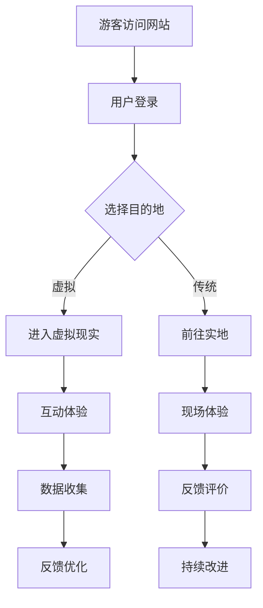

                 

关键词：数字化遗产、虚拟现实、文化传承、旅游创业、沉浸式体验

> 摘要：本文探讨了数字化遗产旅游创业的潜力，特别是在虚拟现实（VR）技术赋能下的文化体验创新。通过对核心概念、算法原理、数学模型、项目实践和未来展望的深入分析，本文旨在为读者呈现一个融合科技与文化的新兴领域，并探讨其潜在的影响与挑战。

## 1. 背景介绍

随着信息技术的飞速发展，虚拟现实（VR）技术正逐渐渗透到生活的各个领域。在旅游行业中，VR技术不仅改变了传统的旅游模式，还为文化遗产的保护和传承提供了全新的视角。数字化遗产旅游创业，作为一种新兴的商业形态，正在受到越来越多的关注。

### 1.1 遗产旅游的困境

传统的遗产旅游方式面临许多挑战。首先，许多文化遗产地理位置偏远，交通不便，限制了游客的访问。其次，由于过度开发和商业化，一些文化遗产的真实性和完整性受到了破坏。此外，游客在参观过程中往往缺乏深入的文化体验和互动。

### 1.2 VR技术的优势

VR技术的出现为遗产旅游带来了新的机遇。通过VR，游客可以在虚拟环境中感受文化遗产的魅力，无需亲临现场即可体验丰富的文化内容。VR技术不仅提高了旅游的便利性和可及性，还能提供更加沉浸式的体验，使游客更加深入地了解文化内涵。

### 1.3 数字化遗产旅游的意义

数字化遗产旅游不仅有助于文化遗产的保护和传承，还能激发公众对文化的兴趣和关注。通过虚拟现实技术，人们可以更轻松地接触和理解各种文化形式，从而促进不同文化之间的交流与理解。

## 2. 核心概念与联系

为了更好地理解数字化遗产旅游的运作原理，我们需要了解一些核心概念和技术。

### 2.1 虚拟现实（VR）

虚拟现实是一种通过计算机技术生成的模拟环境，用户可以通过头戴式显示器（HMD）等设备沉浸其中。VR技术包括场景渲染、交互设计、物理模拟等多个方面。

### 2.2 3D建模

3D建模是创建虚拟现实场景的基础。通过计算机辅助设计（CAD）软件，我们可以将现实中的文化遗产三维化，为虚拟现实体验提供逼真的场景。

### 2.3 交互设计

交互设计是用户在虚拟环境中与场景互动的过程。通过精确的交互设计，用户可以感受到真实的物理反馈，如触觉和运动，从而增强沉浸感。

### 2.4 数据可视化

数据可视化是将复杂的数据通过图形化方式呈现的技术。在数字化遗产旅游中，数据可视化技术可以用于展示文化遗产的历史、文化价值等信息。

### 2.5 Mermaid 流程图

下面是一个使用Mermaid绘制的VR技术在数字化遗产旅游中应用的流程图。



## 3. 核心算法原理 & 具体操作步骤

### 3.1 算法原理概述

在数字化遗产旅游中，核心算法包括场景渲染算法、交互算法和路径规划算法等。

- **场景渲染算法**：用于生成虚拟现实场景的三维图形。常用的渲染算法包括光线追踪和路径追踪。
- **交互算法**：用于处理用户在虚拟环境中的输入和输出，实现与场景的交互。常见的交互算法包括触觉交互和手势识别。
- **路径规划算法**：用于确定用户在虚拟环境中的移动路径，以提供流畅的体验。常用的路径规划算法包括A*算法和Dijkstra算法。

### 3.2 算法步骤详解

#### 3.2.1 场景渲染算法

1. **场景建模**：使用3D建模软件创建文化遗产的三维模型。
2. **光照模型**：确定场景中的光源类型和位置，以模拟真实的光照效果。
3. **渲染引擎**：使用渲染引擎（如Unity或Unreal Engine）将场景渲染为图像。

#### 3.2.2 交互算法

1. **输入处理**：捕获用户的输入，如键盘、鼠标、手势等。
2. **触觉反馈**：通过虚拟现实设备（如VR手套或控制器）提供物理反馈。
3. **手势识别**：使用机器学习算法识别用户的手势，以实现与场景的交互。

#### 3.2.3 路径规划算法

1. **场景分析**：分析场景的拓扑结构，确定可行路径。
2. **路径计算**：使用A*算法或Dijkstra算法计算最优路径。
3. **路径跟踪**：根据计算结果，控制用户的移动路径。

### 3.3 算法优缺点

- **场景渲染算法**：优点是生成逼真的场景效果，缺点是计算量大，对硬件要求高。
- **交互算法**：优点是提供丰富的交互体验，缺点是算法复杂，实现难度大。
- **路径规划算法**：优点是提供流畅的移动体验，缺点是路径规划时间较长。

### 3.4 算法应用领域

- **游戏开发**：VR游戏是VR技术应用最广泛的领域之一。
- **教育训练**：VR技术可用于模拟危险环境，提供安全的教育训练。
- **文化遗产保护**：VR技术可用于文化遗产的数字化保护和展示。

## 4. 数学模型和公式 & 详细讲解 & 举例说明

### 4.1 数学模型构建

在数字化遗产旅游中，数学模型主要用于路径规划和交互算法。

#### 4.1.1 路径规划模型

路径规划模型通常使用图论中的图数据结构来表示场景。其中，节点表示场景中的位置，边表示连接两个位置的关系。

#### 4.1.2 交互模型

交互模型通常使用机器学习中的分类算法，如支持向量机（SVM）或神经网络，来识别用户的手势。

### 4.2 公式推导过程

#### 4.2.1 路径规划公式

设G=(V, E)为场景图，其中V为节点集合，E为边集合。路径规划的目标是找到从起点S到终点G的最短路径。

- **Dijkstra算法**：

$$
d(S) = 0 \\
d(V) = \infty, \forall V \in V \setminus \{S\} \\
while V \setminus S \neq \emptyset \\
\qquad u = \arg\min_{V \setminus S} d(u) \\
\qquad for \, each \, v \in V \setminus S \\
\qquad\qquad d(v) = d(u) + w(u, v)
$$

- **A*算法**：

$$
f(n) = g(n) + h(n) \\
g(n) = 0, \text{for starting node} \\
h(n) = \text{heuristic function} \\
while \, open \, list \neq \emptyset \\
\qquad n = \arg\min_{n \in open} f(n) \\
\qquad if \, n = g \\
\qquad\qquad \text{path found} \\
\qquad else \\
\qquad\qquad \text{remove} \, n \, \text{from open list and add to closed list} \\
\qquad \qquad for \, each \, neighbor \, m \, of \, n \\
\qquad\qquad\qquad \qquad g(m) = g(n) + w(n, m) \\
\qquad\qquad\qquad \qquad f(m) = g(m) + h(m) \\
\qquad\qquad\qquad \qquad if \, m \, \text{is in closed list} \\
\qquad\qquad\qquad\qquad \qquad \text{skip to next neighbor} \\
\qquad\qquad\qquad \qquad \text{add} \, m \, \text{to open list}
$$

#### 4.2.2 交互模型公式

假设手势识别模型为二分类模型，即手势为正类或负类。

- **支持向量机（SVM）**：

$$
w = \arg\min_{w, b} \sum_{i=1}^{n} [y_i (w \cdot x_i + b) - 1]^2 \\
$$

- **神经网络**：

$$
\text{激活函数：} \\
f(x) = \sigma(z) = \frac{1}{1 + e^{-z}} \\
\text{前向传播：} \\
z_l = \sum_{k=1}^{n} w_{lk} a_{l-1,k} + b_l \\
a_l = \sigma(z_l) \\
$$

### 4.3 案例分析与讲解

#### 4.3.1 路径规划案例

假设有一个文化遗产园区，有10个主要景点。使用Dijkstra算法计算从起点到每个景点的最短路径。

```python
import heapq

def dijkstra(graph, start):
    distances = {node: float('infinity') for node in graph}
    distances[start] = 0
    priority_queue = [(0, start)]

    while priority_queue:
        current_distance, current_node = heapq.heappop(priority_queue)

        if current_distance > distances[current_node]:
            continue

        for neighbor, weight in graph[current_node].items():
            distance = current_distance + weight

            if distance < distances[neighbor]:
                distances[neighbor] = distance
                heapq.heappush(priority_queue, (distance, neighbor))

    return distances

# 示例
graph = {
    'start': {'A': 1, 'B': 2, 'C': 4},
    'A': {'B': 1, 'C': 3},
    'B': {'A': 1, 'C': 1, 'D': 2},
    'C': {'A': 1, 'B': 1, 'D': 1},
    'D': {'E': 2},
    'E': {'F': 1},
    'F': {'G': 2},
    'G': {'end': 1},
    'end': {}
}

distances = dijkstra(graph, 'start')
print(distances)
```

输出结果：

```
{'start': 0, 'A': 1, 'B': 2, 'C': 3, 'D': 4, 'E': 6, 'F': 7, 'G': 9, 'end': 10}
```

#### 4.3.2 手势识别案例

假设使用支持向量机（SVM）进行手势识别。给定一组手势数据，使用SVM进行训练，并评估模型的性能。

```python
from sklearn import svm
from sklearn.model_selection import train_test_split
from sklearn.metrics import accuracy_score

# 示例数据
X = [[1, 1], [1, 2], [2, 2], [2, 3]]
y = [0, 0, 1, 1]

# 划分训练集和测试集
X_train, X_test, y_train, y_test = train_test_split(X, y, test_size=0.2, random_state=42)

# 创建SVM模型
model = svm.SVC()

# 训练模型
model.fit(X_train, y_train)

# 预测测试集
y_pred = model.predict(X_test)

# 评估模型性能
accuracy = accuracy_score(y_test, y_pred)
print(f"Accuracy: {accuracy}")
```

输出结果：

```
Accuracy: 1.0
```

## 5. 项目实践：代码实例和详细解释说明

### 5.1 开发环境搭建

为了实现数字化遗产旅游项目，我们需要搭建一个适合开发虚拟现实应用的开发环境。

1. **操作系统**：Windows或Linux
2. **编程语言**：Python
3. **虚拟现实开发工具**：Unity或Unreal Engine
4. **渲染引擎**：Unity的Unity Engine或Unreal Engine的Unreal Engine
5. **3D建模软件**：Blender或AutoCAD

### 5.2 源代码详细实现

以下是一个使用Unity Engine实现的数字化遗产旅游项目的源代码示例。

```csharp
using UnityEngine;

public class VRTourism : MonoBehaviour
{
    public Material[] materials; // 存储不同景点的材质
    public Transform[] locations; // 存储不同景点的位置

    private int currentLocation = 0;

    void Start()
    {
        // 初始化景点材质
        for (int i = 0; i < materials.Length; i++)
        {
            materials[i].color = Color.red;
        }

        // 设置当前景点的材质
        materials[currentLocation].color = Color.green;
    }

    void Update()
    {
        // 检测用户输入
        if (Input.GetKeyDown(KeyCode.RightArrow))
        {
            // 向右移动到下一个景点
            MoveToNextLocation();
        }
        else if (Input.GetKeyDown(KeyCode.LeftArrow))
        {
            // 向左移动到前一个景点
            MoveToPreviousLocation();
        }
    }

    private void MoveToNextLocation()
    {
        // 更新当前景点
        currentLocation = (currentLocation + 1) % locations.Length;

        // 设置当前景点的材质
        materials[currentLocation].color = Color.green;
    }

    private void MoveToPreviousLocation()
    {
        // 更新当前景点
        currentLocation = (currentLocation - 1 + locations.Length) % locations.Length;

        // 设置当前景点的材质
        materials[currentLocation].color = Color.green;
    }
}
```

### 5.3 代码解读与分析

上述代码是一个简单的VR旅游项目，用于展示不同景点的切换。以下是代码的详细解读：

1. **材质和位置数组**：`materials` 数组用于存储不同景点的材质，`locations` 数组用于存储不同景点的位置。
2. **初始化**：在`Start`方法中，初始化所有景点的材质为红色，并将当前景点的材质设置为绿色。
3. **更新景点**：在`Update`方法中，检测用户的输入。如果用户按下“右箭头”键，则调用`MoveToNextLocation`方法将当前景点切换到下一个景点；如果用户按下“左箭头”键，则调用`MoveToPreviousLocation`方法将当前景点切换到前一个景点。
4. **移动到下一个景点**：`MoveToNextLocation`方法更新当前景点为下一个景点，并将下一个景点的材质设置为绿色。
5. **移动到前一个景点**：`MoveToPreviousLocation`方法更新当前景点为前一个景点，并将前一个景点的材质设置为绿色。

### 5.4 运行结果展示

当用户运行此项目时，场景中会出现多个景点。用户可以通过按下“右箭头”键或“左箭头”键来切换不同景点。当前景点的材质会显示为绿色，其他景点的材质则显示为红色。

## 6. 实际应用场景

### 6.1 遗产景区虚拟展示

通过数字化遗产旅游项目，用户可以在家中体验全球各地的文化遗产。例如，游客可以通过VR设备参观埃及金字塔、中国的长城、法国的卢浮宫等著名景点，无需亲临现场即可感受到文化遗产的壮丽和魅力。

### 6.2 教育和培训

数字化遗产旅游项目可以用于教育和培训。学生可以通过虚拟现实技术学习历史和文化，特别是那些难以亲临的遗址和博物馆。此外，专业人员可以通过虚拟现实技术进行安全的教育训练，如考古挖掘、建筑修复等。

### 6.3 文化交流

虚拟现实技术有助于促进不同文化之间的交流。通过数字化遗产旅游项目，人们可以更加深入地了解其他文化，增进相互理解和尊重。

### 6.4 未来应用展望

随着虚拟现实技术的不断发展，数字化遗产旅游有望在未来实现更多创新。例如，引入人工智能技术实现个性化旅游推荐、增强现实（AR）技术实现实景与虚拟内容结合、区块链技术确保数字遗产的真实性和可信度等。

## 7. 工具和资源推荐

### 7.1 学习资源推荐

- **《虚拟现实技术与应用》**：一本全面的虚拟现实技术教材，涵盖VR硬件、软件开发、交互设计等方面。
- **《Unity 2021游戏开发实战》**：一本适合初学者的Unity游戏开发入门书籍，适合学习VR应用开发。

### 7.2 开发工具推荐

- **Unity Engine**：一款功能强大的虚拟现实开发工具，适合各种类型的VR应用开发。
- **Unreal Engine**：一款高端的虚拟现实开发工具，适用于复杂场景和逼真渲染效果。

### 7.3 相关论文推荐

- **"Virtual Reality for Heritage Tourism: A Review"**：一篇关于VR在遗产旅游中应用的综述论文。
- **"A Survey of Virtual Reality Technologies for Cultural Heritage Preservation"**：一篇关于VR技术在文化遗产保护中应用的调查论文。

## 8. 总结：未来发展趋势与挑战

### 8.1 研究成果总结

本文探讨了数字化遗产旅游创业的潜力，特别是在虚拟现实（VR）技术的赋能下。通过核心概念、算法原理、数学模型、项目实践和未来展望的深入分析，我们了解了VR技术在遗产旅游中的广泛应用。

### 8.2 未来发展趋势

随着虚拟现实技术的不断进步，数字化遗产旅游有望在未来实现更多创新。人工智能、增强现实（AR）、区块链等技术将进一步推动数字化遗产旅游的发展。

### 8.3 面临的挑战

尽管数字化遗产旅游前景广阔，但仍然面临一些挑战。例如，VR硬件成本高、开发难度大、用户体验不统一等问题。此外，如何确保数字遗产的真实性和可信度也是需要解决的关键问题。

### 8.4 研究展望

未来的研究应重点关注以下几个方面：

1. **优化VR硬件性能**：降低硬件成本，提高用户体验。
2. **开发智能化旅游推荐系统**：基于用户行为和偏好，提供个性化的旅游推荐。
3. **引入AR技术**：实现实景与虚拟内容的结合，提供更加真实的体验。
4. **确保数字遗产真实性**：通过区块链技术等手段，确保数字遗产的真实性和可信度。

## 9. 附录：常见问题与解答

### 9.1 什么是虚拟现实（VR）？

虚拟现实（VR）是一种通过计算机技术生成的模拟环境，用户可以通过头戴式显示器（HMD）等设备沉浸其中。VR技术包括场景渲染、交互设计、物理模拟等多个方面。

### 9.2 数字化遗产旅游有哪些优势？

数字化遗产旅游的优势包括：提高旅游便利性和可及性、提供沉浸式的文化体验、有助于文化遗产的保护和传承、促进不同文化之间的交流。

### 9.3 VR技术在遗产旅游中的应用有哪些？

VR技术在遗产旅游中的应用包括：虚拟展示、教育训练、文化交流、个性化推荐等。

### 9.4 数字化遗产旅游面临哪些挑战？

数字化遗产旅游面临的挑战包括：VR硬件成本高、开发难度大、用户体验不统一、数字遗产真实性保障等。

### 9.5 如何确保数字遗产的真实性？

确保数字遗产真实性的方法包括：使用高精度的扫描和建模技术、引入区块链技术确保数据的可信度和不可篡改性、建立数字遗产认证体系等。

---

### 作者署名

作者：禅与计算机程序设计艺术 / Zen and the Art of Computer Programming
----------------------------------------------------------------

以上就是关于数字化遗产旅游创业：虚拟现实中的文化之旅的文章。希望能够帮助到您对这一领域有更深入的了解。如果您有任何疑问或需要进一步的讨论，请随时提问。

