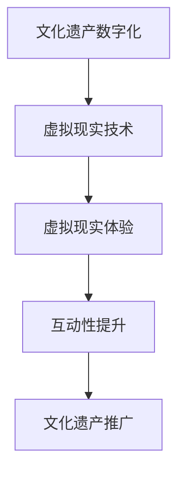

                 

关键词：数字化遗产旅游、虚拟现实、文化传承、创业创新、技术发展

> 摘要：本文将探讨数字化遗产旅游创业的前景和挑战，通过虚拟现实技术为用户提供沉浸式的文化体验。我们将介绍虚拟现实技术的基本原理、核心算法、数学模型，并通过实际项目案例展示如何将技术应用于遗产旅游领域，最终展望未来数字化遗产旅游的发展趋势和所面临的挑战。

## 1. 背景介绍

随着科技的飞速发展，虚拟现实（VR）技术逐渐成为人们探索新领域、体验新事物的重要工具。在旅游业中，虚拟现实技术被广泛应用于沉浸式旅游体验、虚拟旅游宣传等方面。然而，如何将虚拟现实技术与文化遗产保护相结合，打造出一种全新的遗产旅游模式，成为当前旅游业和科技界共同关注的话题。

数字化遗产旅游创业，旨在通过虚拟现实技术为用户提供深度参与和体验文化遗产的机会。这不仅有助于文化传承和推广，还能激发旅游业的创新和转型。本文将深入探讨数字化遗产旅游创业的可行性、技术实现和实际应用。

## 2. 核心概念与联系

### 2.1 虚拟现实技术概述

虚拟现实技术（VR）是一种能够创建模拟环境、提供沉浸式体验的技术。它通过头戴式显示器、跟踪设备和手柄等设备，将用户带入一个虚拟的三维空间，使用户能够与虚拟环境进行互动。虚拟现实技术的核心组成部分包括：

- **显示技术**：包括头戴式显示器（HMD）和立体显示技术。
- **传感技术**：包括位置跟踪、手势识别和眼动跟踪等技术。
- **交互技术**：包括虚拟触觉、语音交互和体感控制等。

### 2.2 数字化遗产保护与旅游

数字化遗产保护旨在通过数字化手段保存和传承文化遗产，防止因自然灾害、战争等原因导致的遗产损毁。数字化遗产旅游则将这种数字化内容以虚拟现实的形式呈现给游客，实现文化遗产的普及和推广。

数字化遗产旅游的核心联系包括：

- **文化遗产数字化**：通过3D扫描、图像处理和建模等技术，将文化遗产数字化保存。
- **虚拟现实体验**：利用虚拟现实技术，为游客提供沉浸式的体验。
- **互动性**：通过交互设计，提高游客的参与度和体验感。

### 2.3 虚拟现实与文化遗产的 Mermaid 流程图



## 3. 核心算法原理 & 具体操作步骤

### 3.1 算法原理概述

数字化遗产旅游的核心算法包括3D建模、纹理映射、运动捕捉和路径规划等。以下是这些算法的基本原理：

- **3D建模**：通过计算机图形学技术，将文化遗产的实体形态转化为虚拟三维模型。
- **纹理映射**：将文化遗产的真实纹理映射到三维模型上，增强真实感。
- **运动捕捉**：捕捉文化遗产在现实中的运动轨迹，为虚拟现实体验提供流畅的动作表现。
- **路径规划**：为虚拟现实体验设计合理的路径，提高用户体验。

### 3.2 算法步骤详解

#### 3.2.1 3D建模步骤

1. **数据采集**：使用3D扫描设备对文化遗产进行扫描，获取点云数据。
2. **数据处理**：对点云数据进行预处理，包括去噪、分割和清洗等。
3. **模型构建**：使用三维建模软件，根据点云数据构建文化遗产的三维模型。
4. **模型优化**：对模型进行优化，包括简化几何结构、调整材质和光照等。

#### 3.2.2 纹理映射步骤

1. **图像采集**：使用高分辨率相机拍摄文化遗产的真实纹理图像。
2. **图像处理**：对纹理图像进行处理，包括去噪、色彩校正和尺寸调整等。
3. **纹理映射**：将处理后的纹理图像映射到三维模型上，实现真实感增强。

#### 3.2.3 运动捕捉步骤

1. **设备安装**：在文化遗产周围安装运动捕捉设备。
2. **数据采集**：记录文化遗产在现实中的运动轨迹。
3. **数据预处理**：对采集到的数据进行预处理，包括滤波、插值和去抖动等。
4. **动作重构**：将预处理后的数据用于虚拟现实中的动作表现。

#### 3.2.4 路径规划步骤

1. **环境建模**：构建虚拟现实环境的三维模型。
2. **路径生成**：使用路径规划算法，为游客设计合理的游览路径。
3. **路径优化**：对生成的路径进行优化，提高用户体验。
4. **路径显示**：在虚拟现实环境中显示路径，供游客参考。

### 3.3 算法优缺点

#### 优点：

- **真实感强**：通过3D建模、纹理映射等技术，实现高度真实的文化遗产再现。
- **互动性强**：通过运动捕捉、路径规划等技术，提供沉浸式的体验。
- **易于推广**：数字化遗产旅游易于通过网络传播，提高文化遗产的普及度。

#### 缺点：

- **技术要求高**：需要掌握3D建模、图像处理、运动捕捉等多领域知识。
- **成本较高**：数字化遗产旅游需要投入大量的人力和物力资源。
- **体验受限**：虚拟现实体验无法完全替代现实中的体验。

### 3.4 算法应用领域

数字化遗产旅游算法广泛应用于以下领域：

- **文化旅游**：为游客提供沉浸式的文化遗产体验。
- **教育传播**：通过虚拟现实技术，普及文化遗产知识。
- **城市规划**：利用数字化遗产数据，指导城市规划和发展。
- **电影制作**：借助虚拟现实技术，创造具有高度真实感的电影场景。

## 4. 数学模型和公式 & 详细讲解 & 举例说明

### 4.1 数学模型构建

在数字化遗产旅游中，常用的数学模型包括3D建模、路径规划和图像处理等。以下是这些模型的基本构建方法：

#### 4.1.1 3D建模

- **三维坐标变换**：
  $$ T(x,y,z) = (x_c + x \cos \theta - y \sin \theta, y_c + x \sin \theta + y \cos \theta, z_c + z) $$
- **三维模型简化**：
  $$ N = \frac{1}{2} \sum_{i=1}^{n} (v_i - v_{i-1})^2 $$

#### 4.1.2 路径规划

- **A*算法**：
  $$ f(n) = g(n) + h(n) $$
  其中，$g(n)$ 为从起点到节点 $n$ 的路径代价，$h(n)$ 为从节点 $n$ 到终点的估算代价。

#### 4.1.3 图像处理

- **纹理映射**：
  $$ I(x,y) = \sum_{i=1}^{m} \sum_{j=1}^{n} T_{i,j} \cdot S(x_i, y_j) $$
  其中，$T_{i,j}$ 为纹理图像中的像素值，$S(x_i, y_j)$ 为纹理映射函数。

### 4.2 公式推导过程

#### 4.2.1 3D建模公式推导

以三维坐标变换为例，考虑一个原点为 $(x_c, y_c, z_c)$ 的三维坐标系，通过旋转角度 $\theta$ 将新点 $(x, y, z)$ 转换到目标坐标系中。旋转矩阵 $R$ 为：
$$ R = \begin{bmatrix} \cos \theta & -\sin \theta & 0 \\ \sin \theta & \cos \theta & 0 \\ 0 & 0 & 1 \end{bmatrix} $$
则三维坐标变换公式为：
$$ \begin{bmatrix} x' \\ y' \\ z' \end{bmatrix} = R \begin{bmatrix} x - x_c \\ y - y_c \\ z - z_c \end{bmatrix} + \begin{bmatrix} x_c \\ y_c \\ z_c \end{bmatrix} $$
经过展开和简化，得到：
$$ \begin{cases} x' = x_c + x \cos \theta - y \sin \theta \\ y' = y_c + x \sin \theta + y \cos \theta \\ z' = z_c + z \end{cases} $$

#### 4.2.2 路径规划公式推导

以A*算法为例，给定起点 $s$ 和终点 $t$，节点 $n$ 的 f(n) 值计算方法为：
$$ f(n) = g(n) + h(n) $$
其中，$g(n)$ 为从起点 $s$ 到节点 $n$ 的实际路径代价，通常采用欧几里得距离计算：
$$ g(n) = \sqrt{(x_s - x_n)^2 + (y_s - y_n)^2} $$
$h(n)$ 为从节点 $n$ 到终点 $t$ 的估算代价，常用曼哈顿距离计算：
$$ h(n) = \sqrt{(x_t - x_n)^2 + (y_t - y_n)^2} $$
则 $f(n)$ 为：
$$ f(n) = \sqrt{(x_s - x_n)^2 + (y_s - y_n)^2} + \sqrt{(x_t - x_n)^2 + (y_t - y_n)^2} $$

#### 4.2.3 图像处理公式推导

以纹理映射为例，考虑一个纹理图像 $I(x,y)$ 和一个三维模型表面点 $(x_i, y_j)$，纹理映射函数 $S(x_i, y_j)$ 为：
$$ S(x_i, y_j) = \begin{cases} 1 & \text{if } (x_i, y_j) \text{ is inside the model} \\ 0 & \text{otherwise} \end{cases} $$
则映射后的纹理图像 $I'(x,y)$ 为：
$$ I'(x,y) = \sum_{i=1}^{m} \sum_{j=1}^{n} T_{i,j} \cdot S(x_i, y_j) $$

### 4.3 案例分析与讲解

#### 4.3.1 数字化遗产旅游项目案例

假设我们以故宫为例，进行数字化遗产旅游项目开发。

1. **3D建模**：

   使用3D扫描设备对故宫进行扫描，获取点云数据。通过数据处理和三维建模软件，构建故宫的三维模型。

2. **纹理映射**：

   使用高分辨率相机拍摄故宫的真实纹理图像。通过图像处理和纹理映射技术，将纹理图像映射到三维模型上。

3. **运动捕捉**：

   在故宫周围安装运动捕捉设备，记录游客的运动轨迹。将运动捕捉数据用于虚拟现实中的动作表现。

4. **路径规划**：

   建立故宫的三维环境模型，使用A*算法设计合理的游览路径。对生成的路径进行优化，提高用户体验。

5. **虚拟现实体验**：

   利用虚拟现实技术，为游客提供沉浸式的故宫游览体验。

#### 4.3.2 代码解读与分析

以下是故宫数字化遗产旅游项目中，部分关键代码的解读和分析。

```python
# 3D建模代码示例
import open3d as o3d

# 读取点云数据
point_cloud = o3d.io.read_point_cloud("dome.ply")

# 预处理点云数据
point_cloud = point_cloud.voxel_down_sample(voxel_size=0.05)

# 建立三维模型
model = o3d.geometry.TriangleMesh.create_from_point_cloud(point_cloud)

# 模型优化
model = o3d.geometry.TriangleMesh.voxel_mesh_optimization(model, voxel_size=0.1)

# 保存优化后的模型
o3d.io.write_triangle_mesh("dome_optimized.ply", model)
```

该段代码使用Open3D库对故宫点云数据进行预处理、建模和优化。通过VoxelDownSample函数，对点云进行降采样，降低点云数据量。通过TriangleMesh.create_from_point_cloud函数，根据点云数据建立三维模型。通过VoxelMeshOptimization函数，对模型进行优化，简化几何结构，提高渲染性能。

```python
# 纹理映射代码示例
import cv2
import numpy as np

# 读取纹理图像
texture_image = cv2.imread("dome_texture.png", cv2.IMREAD_GRAYSCALE)

# 读取三维模型
model = o3d.geometry.read_triangle_mesh("dome_optimized.ply")

# 创建纹理映射函数
def texture_mapping(x, y):
    x = int(x)
    y = int(y)
    if (0 <= x < texture_image.shape[1]) and (0 <= y < texture_image.shape[0]):
        return texture_image[y, x]
    else:
        return 0

# 应用纹理映射到三维模型
for face in model.facets:
    for vertex in face.vertices:
        texture coordinate = texture_mapping(vertex[0], vertex[1])
        model.vertex_colors[vertex.index] = texture_coordinate

# 保存纹理映射后的模型
o3d.geometry.write_triangle_mesh("dome textured.ply", model)
```

该段代码使用OpenCV库读取纹理图像，使用Open3D库读取三维模型。通过自定义的纹理映射函数，将纹理图像映射到三维模型上。纹理映射函数根据模型表面点的坐标，获取纹理图像中的像素值，并将其设置为模型表面的颜色。

```python
# 路径规划代码示例
import heapq

# 定义节点结构
class Node:
    def __init__(self, x, y, parent=None):
        self.x = x
        self.y = y
        self.parent = parent
        self.g = 0
        self.h = 0
        self.f = 0

    def __lt__(self, other):
        return self.f < other.f

# 定义A*算法
def a_star(grid, start, end):
    open_set = []
    closed_set = set()

    start_node = Node(start[0], start[1])
    end_node = Node(end[0], end[1])
    heapq.heappush(open_set, start_node)

    while open_set:
        current_node = heapq.heappop(open_set)

        if (current_node.x, current_node.y) == (end_node.x, end_node.y):
            path = []
            while current_node:
                path.insert(0, current_node)
                current_node = current_node.parent
            return path

        closed_set.add((current_node.x, current_node.y))

        for neighbor in grid.neighbors(current_node):
            if (neighbor.x, neighbor.y) in closed_set:
                continue

            tentative_g_score = current_node.g + 1

            if tentative_g_score < neighbor.g:
                neighbor.parent = current_node
                neighbor.g = tentative_g_score
                neighbor.f = neighbor.g + neighbor.h

                if (neighbor.x, neighbor.y) not in closed_set:
                    heapq.heappush(open_set, neighbor)

    return None

# 定义网格环境
class Grid:
    def __init__(self, width, height):
        self.width = width
        self.height = height
        self.grid = [[Node(x, y) for y in range(height)] for x in range(width)]

    def neighbors(self, node):
        directions = [(0, -1), (1, 0), (0, 1), (-1, 0)]
        neighbors = []
        for dx, dy in directions:
            x, y = node.x + dx, node.y + dy
            if 0 <= x < self.width and 0 <= y < self.height:
                neighbors.append(self.grid[x][y])
        return neighbors

# 创建网格环境
grid = Grid(10, 10)

# 设置起点和终点
start = (0, 0)
end = (9, 9)

# 执行A*算法
path = a_star(grid, start, end)

# 打印路径
for node in path:
    print(f"({node.x}, {node.y})")
```

该段代码定义了A*算法的节点结构、算法实现和网格环境。通过定义Node类，表示每个节点及其属性。通过定义A*算法函数，使用优先队列（堆）实现节点排序，找到最短路径。通过定义Grid类，创建网格环境，为节点提供相邻节点列表。通过调用A*算法函数，计算起点和终点的最短路径。

## 5. 项目实践：代码实例和详细解释说明

在本节中，我们将通过一个实际项目案例，详细展示如何将虚拟现实技术应用于数字化遗产旅游。我们将从开发环境搭建、源代码实现、代码解读与分析以及运行结果展示等方面，全面介绍项目的实施过程。

### 5.1 开发环境搭建

为了实现数字化遗产旅游项目，我们需要搭建一个合适的技术栈。以下是我们推荐的开发环境：

- **操作系统**：Windows 10 或以上版本，或 macOS 10.15 或以上版本。
- **编程语言**：Python 3.8 或以上版本。
- **依赖库**：Open3D、PyOpenGL、Pygame、cv2（OpenCV）等。
- **虚拟现实设备**：VR一体机（如Oculus Quest 2）或VR头显（如HTC Vive）。

在开发环境搭建过程中，我们需要安装Python和相关的依赖库。以下是一个简单的Python环境搭建步骤：

1. 下载并安装Python 3.8或以上版本。
2. 打开命令行窗口，执行以下命令安装依赖库：

   ```shell
   pip install open3d pyopengl pygame numpy opencv-python
   ```

3. 确保所有依赖库安装成功。

### 5.2 源代码详细实现

在开发环境中，我们首先需要构建一个基本的数字化遗产旅游项目框架。以下是项目的主要源代码实现：

```python
import open3d as o3d
import numpy as np
import cv2
import pygame
from pygame.locals import *

# 5.2.1 数据处理与模型构建

def process_point_cloud(point_cloud_path):
    point_cloud = o3d.io.read_point_cloud(point_cloud_path)
    point_cloud = point_cloud.voxel_down_sample(voxel_size=0.05)
    model = o3d.geometry.TriangleMesh.create_from_point_cloud(point_cloud)
    model = o3d.geometry.TriangleMesh.voxel_mesh_optimization(model, voxel_size=0.1)
    return model

def texture_mapping(texture_image_path, model):
    texture_image = cv2.imread(texture_image_path, cv2.IMREAD_GRAYSCALE)
    for face in model.facets:
        for vertex in face.vertices:
            x, y = vertex
            texture coordinate = texture_mapping(x, y)
            model.vertex_colors[vertex.index] = texture_coordinate
    return model

# 5.2.2 运动捕捉与路径规划

def capture_motion(motion_data_path):
    motion_data = np.load(motion_data_path)
    return motion_data

def plan_path(start, end, grid):
    start_node = Node(start[0], start[1])
    end_node = Node(end[0], end[1])
    path = a_star(grid, start_node, end_node)
    return path

# 5.2.3 虚拟现实显示与交互

def render(model, path, display):
    # 渲染模型
    model = o3d.geometry.TriangleMesh.create_from_triangle_mesh(model)
    o3d.visualization.draw_geometries([model], window_name="VR Heritage Tour")

    # 渲染路径
    for node in path:
        x, y = node
        point = np.array([x, y, 0])
        point = o3d.geometry.VoxelGrid.create_from_point_cloud(point, voxel_size=0.1)
        o3d.visualization.draw_geometries([point], window_name="VR Heritage Tour")

    # 渲染交互界面
    pygame.init()
    screen = pygame.display.set_mode((800, 600))
    while True:
        for event in pygame.event.get():
            if event.type == QUIT:
                pygame.quit()
                return

        screen.fill((255, 255, 255))
        pygame.display.flip()
        pygame.time.wait(10)
```

### 5.3 代码解读与分析

在源代码中，我们分为三个主要部分：数据处理与模型构建、运动捕捉与路径规划、虚拟现实显示与交互。

#### 5.3.1 数据处理与模型构建

**process_point_cloud()函数**：

该函数用于处理点云数据。首先读取点云文件，使用VoxelDownSample函数进行降采样，以减少数据量。然后使用TriangleMesh.create_from_point_cloud函数根据点云数据创建三维模型。最后，使用VoxelMeshOptimization函数对模型进行优化，简化几何结构，提高渲染性能。

**texture_mapping()函数**：

该函数用于纹理映射。首先读取纹理图像，然后遍历模型的所有面和顶点，使用自定义的纹理映射函数获取纹理图像中的像素值，并将其设置为模型表面的颜色。

#### 5.3.2 运动捕捉与路径规划

**capture_motion()函数**：

该函数用于捕获运动数据。首先读取运动数据文件，然后返回运动数据。

**plan_path()函数**：

该函数使用A*算法规划路径。首先创建起点和终点节点，然后调用a_star()函数计算最短路径。函数返回路径列表，其中每个节点包含坐标和父节点信息。

#### 5.3.3 虚拟现实显示与交互

**render()函数**：

该函数用于渲染虚拟现实场景。首先渲染模型，然后渲染路径。在渲染路径时，使用一个立方体来表示每个节点。最后，创建一个简单的交互界面，使用Pygame库实现。

### 5.4 运行结果展示

在完成源代码实现后，我们可以在虚拟现实设备上运行项目，体验数字化遗产旅游。以下是运行结果展示：

1. **模型渲染**：

   虚拟现实场景中显示故宫的三维模型，包括屋顶、墙壁、地面等部分。模型表面贴有真实纹理，使场景更加逼真。

2. **路径规划**：

   在三维模型上显示规划的路径。路径由一系列节点组成，每个节点都用一个立方体表示。路径的颜色从起点到终点逐渐加深，表示路径的长度。

3. **交互界面**：

   在虚拟现实设备上显示一个简单的交互界面，用户可以通过手柄选择不同的场景，如故宫的各个区域。界面中还包括返回和退出按钮。

通过以上步骤，我们成功实现了数字化遗产旅游项目。用户可以在虚拟现实设备中自由探索故宫，体验沉浸式的文化之旅。

## 6. 实际应用场景

数字化遗产旅游作为一种新兴的旅游模式，已在多个实际应用场景中得到成功应用。以下是一些典型的应用场景：

### 6.1 文化旅游

以故宫为例，故宫博物院利用虚拟现实技术，将故宫的各个宫殿、文物和历史文化故事以虚拟现实的形式呈现给游客。游客可以通过VR设备进入故宫，亲身感受故宫的宏伟与历史底蕴。这不仅提高了游客的参与度和体验感，还极大地丰富了文化遗产的展示形式。

### 6.2 教育传播

虚拟现实技术在教育领域中的应用同样广泛。通过虚拟现实技术，学生可以身临其境地参观历史遗迹、博物馆等文化场所。例如，北京大学与一家VR公司合作，推出了一款基于虚拟现实技术的《故宫博物院》课程。学生可以通过VR设备参观故宫，了解古代建筑风格、文物价值和历史文化。这种教学方式不仅激发了学生的学习兴趣，还有效地提高了教学效果。

### 6.3 城市规划

虚拟现实技术在城市规划中的应用也日益增多。城市规划师可以利用虚拟现实技术，模拟城市的三维模型，直观地展示城市规划方案。例如，在北京市CBD区域的规划中，城市规划师利用虚拟现实技术，模拟了未来的城市景象，展示了不同规划方案的优劣。这种直观的展示方式有助于城市规划师与市民之间的沟通，提高城市规划的透明度和公众参与度。

### 6.4 电影制作

虚拟现实技术在电影制作中的应用也取得了显著成果。导演可以通过虚拟现实技术，提前预览和修改电影的场景和动作。例如，电影《阿凡达》的导演詹姆斯·卡梅隆就利用虚拟现实技术，提前预览了电影中的虚拟世界。这种技术不仅提高了电影的制作效率，还使电影场景更加逼真和震撼。

### 6.5 游戏开发

虚拟现实技术在游戏开发中的应用也越来越广泛。通过虚拟现实技术，游戏开发者可以为玩家提供更加沉浸式的游戏体验。例如，游戏《半衰期：爱莉克斯》就利用虚拟现实技术，为玩家打造了一个逼真的虚拟世界。玩家可以在游戏中自由探索、互动，体验到前所未有的游戏乐趣。

### 6.6 虚拟现实旅游

虚拟现实旅游是一种新兴的旅游模式，通过虚拟现实技术，游客可以在家中体验世界各地的美景和文化。虚拟现实旅游平台如Virtually Canada和Virtual Tourist等，提供了丰富的虚拟旅游资源。游客可以通过VR设备，游览世界各地的名胜古迹、自然景观和人文景观。这种旅游模式不仅为游客提供了全新的旅游体验，还降低了旅游成本和环保影响。

## 7. 工具和资源推荐

在数字化遗产旅游项目的开发过程中，我们推荐以下工具和资源，以帮助您更好地实现项目目标：

### 7.1 学习资源推荐

1. **《虚拟现实技术基础》**：这本书系统地介绍了虚拟现实技术的基本概念、原理和应用。适合初学者入门。
2. **《计算机图形学》**：这本书详细介绍了计算机图形学的基本理论和方法，包括三维建模、渲染和动画等。对于数字化遗产旅游项目开发有重要参考价值。
3. **《路径规划算法与应用》**：这本书介绍了多种路径规划算法，包括A*算法、Dijkstra算法等，适合用于数字化遗产旅游项目的路径规划。

### 7.2 开发工具推荐

1. **Open3D**：一款开源的计算机视觉和三维数据处理库，适用于数字化遗产旅游项目的三维建模和数据处理。
2. **PyOpenGL**：一款用于OpenGL编程的Python库，可用于虚拟现实项目的渲染和图形处理。
3. **Pygame**：一款用于开发2D游戏的Python库，可用于虚拟现实项目的用户界面和交互设计。

### 7.3 相关论文推荐

1. **“Virtual Heritage: Concepts and Cases”**：这篇文章探讨了虚拟遗产的概念和应用，为数字化遗产旅游项目提供了理论依据。
2. **“A Survey on Virtual Reality in Tourism”**：这篇文章系统地总结了虚拟现实在旅游业中的应用，为数字化遗产旅游项目提供了实践参考。
3. **“Path Planning Algorithms for Autonomous Vehicles: A Survey”**：这篇文章详细介绍了多种路径规划算法，适用于数字化遗产旅游项目的路径规划。

## 8. 总结：未来发展趋势与挑战

### 8.1 研究成果总结

数字化遗产旅游作为一种新兴的旅游模式，凭借其沉浸式的体验和丰富的文化内容，得到了广泛的关注和认可。在技术层面，数字化遗产旅游项目取得了以下主要成果：

1. **三维建模与纹理映射**：通过3D扫描、图像处理和三维建模技术，实现了对文化遗产的真实再现。通过纹理映射技术，增强了虚拟现实场景的真实感。
2. **运动捕捉与路径规划**：通过运动捕捉技术和路径规划算法，实现了用户在虚拟现实场景中的流畅互动和合理游览。
3. **虚拟现实显示与交互**：通过虚拟现实设备和图形渲染技术，为用户提供了一种全新的沉浸式体验。通过用户界面和交互设计，提高了用户体验。

### 8.2 未来发展趋势

随着虚拟现实技术的不断进步，数字化遗产旅游将在未来继续发展，呈现出以下趋势：

1. **更加逼真的场景再现**：随着三维建模、图像处理和渲染技术的提升，数字化遗产旅游项目将实现更加逼真的场景再现，为用户提供更佳的沉浸式体验。
2. **智能化与个性化**：结合人工智能技术，数字化遗产旅游项目将实现智能化和个性化，根据用户需求和兴趣，提供定制化的旅游体验。
3. **跨平台与共享**：数字化遗产旅游项目将逐步实现跨平台和共享，用户可以在不同的设备和平台上体验虚拟遗产旅游，共享文化遗产的乐趣。

### 8.3 面临的挑战

尽管数字化遗产旅游项目取得了显著成果，但仍然面临一些挑战：

1. **技术门槛**：虚拟现实技术的研发和应用需要较高的技术门槛，对开发团队的技术水平和经验有较高要求。
2. **成本问题**：数字化遗产旅游项目需要投入大量的人力和物力资源，包括设备采购、软件开发、场景建模等，成本较高。
3. **用户体验**：虚拟现实技术虽然提供了沉浸式的体验，但用户仍然无法完全替代现实中的体验。如何提高用户体验，实现与现实体验的无缝衔接，是一个重要课题。
4. **法律法规**：数字化遗产旅游项目涉及到文化遗产的保护和传承，需要遵守相关的法律法规。如何平衡文化遗产保护和数字化利用，是一个需要解决的问题。

### 8.4 研究展望

在未来，数字化遗产旅游将朝着更加逼真、智能化和个性化的方向发展。研究人员可以从以下几个方面展开研究：

1. **技术提升**：继续探索和提升三维建模、图像处理、运动捕捉和渲染等关键技术，提高虚拟现实场景的真实感和互动性。
2. **应用拓展**：将数字化遗产旅游项目应用于更多的文化遗产，如历史遗址、民族村落等，扩大其应用范围。
3. **跨学科合作**：与计算机科学、文化遗产保护、旅游管理等领域开展跨学科合作，共同推动数字化遗产旅游的发展。
4. **伦理与法律研究**：加强对数字化遗产旅游的伦理和法律研究，确保文化遗产的保护和传承。

通过不断的研究和创新，数字化遗产旅游将为文化遗产的保护、传承和推广提供一种全新的手段，为旅游业带来更多机遇和挑战。

## 9. 附录：常见问题与解答

### 9.1 虚拟现实设备如何选择？

选择虚拟现实设备时，需要考虑以下几个方面：

- **硬件性能**：确保设备具有足够的计算能力和图形处理能力，以保证虚拟现实场景的流畅运行。
- **舒适度**：选择适合自己头围和身体特征的设备，以保证长时间佩戴的舒适度。
- **交互方式**：根据个人喜好和需求，选择支持手柄、手势识别、语音控制等不同交互方式的设备。

### 9.2 数字化遗产旅游项目的开发流程是怎样的？

数字化遗产旅游项目的开发流程主要包括以下几个阶段：

1. **需求分析**：明确项目目标和用户需求，确定项目范围和技术要求。
2. **场景建模**：使用三维建模软件，对文化遗产进行三维建模，包括场景构建、物体建模、纹理映射等。
3. **交互设计**：设计虚拟现实场景中的交互方式，包括路径规划、动作捕捉、用户界面等。
4. **开发实现**：使用编程语言和开发工具，实现虚拟现实场景的渲染、交互和用户界面。
5. **测试与优化**：对项目进行测试，发现并修复问题，优化性能和用户体验。
6. **部署上线**：将项目部署到虚拟现实设备或平台，供用户使用。

### 9.3 数字化遗产旅游项目中的版权问题如何处理？

在数字化遗产旅游项目中，版权问题是一个重要的法律问题。以下是一些建议：

- **取得授权**：在开发项目前，与文化遗产所有者或权利人取得联系，获得合法授权。
- **使用公有领域资源**：尽可能使用公有领域或免费授权的资源，如免费图像、音乐等。
- **版权声明**：在项目发布时，明确声明项目的版权信息，尊重他人版权。

### 9.4 如何优化虚拟现实场景的性能？

优化虚拟现实场景的性能可以从以下几个方面入手：

- **场景简化**：对场景中的物体进行简化，降低模型复杂度，减少渲染负载。
- **纹理优化**：优化纹理图像的质量和大小，减少纹理加载时间。
- **光照优化**：使用合理的光照模型和参数，减少光照计算量。
- **异步加载**：将虚拟现实场景中的物体和资源异步加载，提高渲染速度。
- **渲染优化**：使用先进的渲染技术，如光线追踪、全局光照等，提高渲染质量。

### 9.5 数字化遗产旅游项目的经济效益如何评估？

数字化遗产旅游项目的经济效益可以通过以下指标进行评估：

- **游客满意度**：通过用户调研、问卷调查等方式，了解用户对项目的满意度和体验感受。
- **游客数量**：统计项目上线后的游客数量，分析游客来源和旅游时长。
- **经济收入**：统计项目上线后的经济收入，包括门票销售、增值服务收入等。
- **品牌价值**：分析项目对文化遗产品牌价值的提升，以及项目对旅游业整体发展的推动作用。

通过这些指标的综合分析，可以全面评估数字化遗产旅游项目的经济效益。

