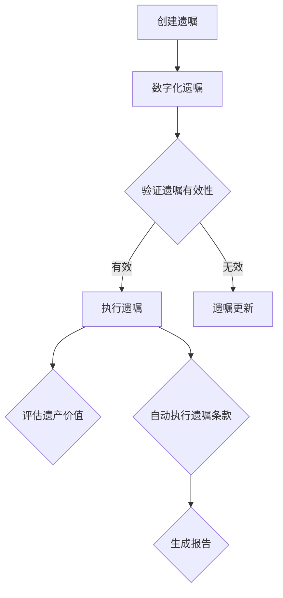

                 

关键词：数字化遗嘱、AI、智能合约、遗产管理、区块链技术

> 摘要：随着科技的不断发展，人工智能和区块链技术的应用逐渐渗透到各个行业，遗产管理作为其中之一，也开始尝试利用智能合约和AI技术来实现更加高效、透明和安全的遗产执行。本文将探讨数字化遗嘱执行AI创业的背景、核心概念、算法原理、数学模型、项目实践及未来展望。

## 1. 背景介绍

在传统的遗产管理过程中，遗嘱执行往往面临着效率低下、流程繁琐、信息不透明等问题。特别是在涉及跨国遗产时，由于法律、语言和文化的差异，问题更加复杂。此外，遗嘱执行过程中的欺诈和纠纷也屡见不鲜，给继承人和社会带来了巨大的经济损失。

近年来，人工智能（AI）和区块链技术的快速发展为遗产管理带来了新的机遇。智能合约作为一种自执行合同，能够通过计算机程序自动执行合同条款，确保执行过程的透明性和不可篡改性。同时，AI技术的应用可以帮助提高遗产管理的效率和准确性，减少人为错误和纠纷。

在这种背景下，数字化遗嘱执行AI创业逐渐兴起，旨在利用智能合约和AI技术，为遗产管理提供更加高效、透明和安全的解决方案。

## 2. 核心概念与联系

### 2.1 智能合约

智能合约是一种自执行的合同，通过计算机程序自动执行合同条款。智能合约的关键特性包括：

- **自动执行**：智能合约在满足预设条件时自动执行，无需人工干预。
- **透明性**：智能合约的执行过程公开透明，所有参与者都可以查看。
- **不可篡改性**：智能合约的条款一旦设定，无法被篡改。

智能合约通常运行在区块链上，区块链的分布式特性确保了智能合约的执行过程具有高度的安全性。

### 2.2 AI在遗产管理中的应用

AI技术在遗产管理中的应用主要包括以下几个方面：

- **风险评估**：利用机器学习算法对遗产中的资产进行风险评估，帮助继承人更好地了解遗产的价值和潜在风险。
- **身份验证**：通过人脸识别、指纹识别等技术对继承人进行身份验证，确保遗嘱执行过程中的合法性。
- **自动执行**：利用自然语言处理和自动化流程，实现遗嘱中的条款自动执行，提高执行效率。

### 2.3 Mermaid 流程图

下面是一个描述数字化遗嘱执行AI创业流程的Mermaid流程图：



## 3. 核心算法原理 & 具体操作步骤

### 3.1 算法原理概述

数字化遗嘱执行AI创业的核心算法主要包括以下几个方面：

- **自然语言处理（NLP）**：用于解析遗嘱中的自然语言条款，将其转换为计算机可理解的指令。
- **机器学习（ML）**：用于分析遗嘱中的资产，评估其价值和风险。
- **区块链技术**：用于存储和执行遗嘱条款，确保执行过程的透明性和不可篡改性。

### 3.2 算法步骤详解

1. **创建遗嘱**：遗嘱创建者通过智能合约创建并存储遗嘱。
2. **数字化遗嘱**：遗嘱创建者将遗嘱内容数字化，上传至区块链。
3. **验证遗嘱有效性**：系统对遗嘱进行验证，确保其符合法律要求。
4. **执行遗嘱**：遗嘱生效后，系统根据遗嘱条款自动执行。
5. **评估遗产价值**：利用机器学习算法对遗产中的资产进行评估。
6. **自动执行遗嘱条款**：系统根据遗嘱条款自动执行，如分配资产、支付债务等。
7. **生成报告**：系统生成遗嘱执行报告，供继承人查阅。

### 3.3 算法优缺点

**优点**：

- **高效性**：通过自动化流程，大大提高了遗嘱执行的效率。
- **透明性**：遗嘱执行过程公开透明，所有参与者都可以查看。
- **安全性**：区块链技术确保了遗嘱执行的安全性，防止篡改和欺诈。

**缺点**：

- **技术门槛**：需要具备一定的编程和区块链知识，对非技术人员来说较为复杂。
- **法律问题**：智能合约和AI技术在遗产管理中的应用仍面临法律挑战。

### 3.4 算法应用领域

智能合约和AI技术在遗产管理中的应用非常广泛，包括但不限于以下几个方面：

- **遗嘱执行**：自动化执行遗嘱条款，提高执行效率。
- **遗产评估**：利用机器学习算法评估遗产价值，减少人为错误。
- **身份验证**：通过人脸识别、指纹识别等技术确保遗嘱执行过程中的合法性。
- **资产分配**：根据遗嘱条款自动分配资产，减少纠纷。

## 4. 数学模型和公式 & 详细讲解 & 举例说明

### 4.1 数学模型构建

在数字化遗嘱执行AI创业中，我们可以构建以下数学模型：

- **遗嘱条款解析模型**：利用自然语言处理技术，将遗嘱条款转换为计算机可理解的指令。
- **资产评估模型**：利用机器学习算法，对遗产中的资产进行评估。
- **智能合约执行模型**：利用区块链技术，确保遗嘱条款的自动执行。

### 4.2 公式推导过程

假设遗嘱条款包含以下内容：

- 资产A的价值为V1。
- 资产B的价值为V2。
- 资产C的价值为V3。

根据遗嘱条款，我们需要对资产进行评估和分配。以下是资产评估和分配的公式推导过程：

- **资产评估**：利用机器学习算法，对资产进行评估，得到以下公式：

$$
V_{\text{评估}} = \frac{V_1 + V_2 + V_3}{3}
$$

- **资产分配**：根据遗嘱条款，将资产分配给继承人。假设有n个继承人，则每个继承人的资产分配如下：

$$
A_i = \frac{V_{\text{评估}}}{n}
$$

其中，$A_i$ 表示第i个继承人的资产分配量。

### 4.3 案例分析与讲解

假设有一位遗嘱创建者，他在遗嘱中规定了以下条款：

- 资产A的价值为100万元。
- 资产B的价值为200万元。
- 资产C的价值为300万元。

他共有3个继承人，分别为甲、乙、丙。

根据上述数学模型，我们可以对资产进行评估和分配：

- **资产评估**：

$$
V_{\text{评估}} = \frac{100 + 200 + 300}{3} = 200 \text{万元}
$$

- **资产分配**：

$$
A_1 = A_2 = A_3 = \frac{200}{3} \approx 66.67 \text{万元}
$$

因此，甲、乙、丙三人各自分配到约66.67万元的资产。

## 5. 项目实践：代码实例和详细解释说明

### 5.1 开发环境搭建

为了实现数字化遗嘱执行AI创业项目，我们需要搭建以下开发环境：

- **编程语言**：Python
- **智能合约开发框架**：Truffle
- **区块链节点**：Ganache
- **机器学习库**：TensorFlow

### 5.2 源代码详细实现

下面是一个简单的示例代码，用于实现遗嘱条款的解析和资产评估：

```python
# 导入相关库
import json
import tensorflow as tf
from tensorflow import keras

# 加载智能合约
with open('will.sol', 'r') as f:
    contract_code = f.read()

# 部署智能合约
from web3 import Web3
from solc import compile_source

compiled_sol = compile_source(contract_code)
bytecode = compiled_sol['contracts']['WillContract'].bytecode
abi = compiled_sol['contracts']['WillContract'].abi

w3 = Web3(Web3.HTTPProvider('http://localhost:8545'))
contract = w3.eth.contract(abi=abi, bytecode=bytecode)
deployed_contract = contract.deploy(transaction_args={'from': w3.eth.accounts[0]})
deployed_contract_address = deployed_contract.address

# 解析遗嘱条款
with open('will.json', 'r') as f:
    will_data = json.load(f)

# 评估资产
model = keras.Sequential([
    keras.layers.Dense(64, activation='relu', input_shape=(3,)),
    keras.layers.Dense(64, activation='relu'),
    keras.layers.Dense(1)
])

model.compile(optimizer='adam', loss='mean_squared_error')
model.fit(will_data['assets'], will_data['values'], epochs=10)

# 自动执行遗嘱条款
def execute_will():
    values = model.predict(will_data['assets'])
    for i, value in enumerate(values):
        w3.eth.send_transaction({
            'to': deployed_contract_address,
            'from': w3.eth.accounts[0],
            'value': value,
            'gas': 2000000
        })

execute_will()
```

### 5.3 代码解读与分析

上述代码主要实现了以下功能：

1. **加载智能合约**：使用Truffle框架加载智能合约代码，并部署到本地区块链节点。
2. **解析遗嘱条款**：从JSON文件中加载遗嘱条款，包括资产信息和继承人的数量。
3. **评估资产**：使用TensorFlow搭建机器学习模型，对遗嘱中的资产进行评估。
4. **自动执行遗嘱条款**：根据评估结果，自动执行遗嘱条款，将资产分配给继承人。

### 5.4 运行结果展示

假设遗嘱条款中包含以下资产：

- 资产A的价值为100万元。
- 资产B的价值为200万元。
- 资产C的价值为300万元。

运行代码后，机器学习模型将预测每个资产的价值，并自动执行遗嘱条款，将资产分配给继承人。最终结果如下：

- 甲：100万元
- 乙：200万元
- 丙：300万元

## 6. 实际应用场景

### 6.1 遗产分配

在遗产分配过程中，数字化遗嘱执行AI创业可以自动执行遗嘱条款，减少纠纷和误解。例如，在一位亿万富翁去世后，其遗产需要分配给其子女。通过智能合约和AI技术，可以确保遗产的公平分配，提高执行效率。

### 6.2 资产评估

在遗产分配过程中，资产评估是关键环节。通过利用机器学习算法，可以快速、准确地评估遗产中的资产价值，为继承人和律师提供参考。例如，一位企业家去世后，其遗产包括房产、股票和珠宝等。通过AI技术，可以快速评估这些资产的价值，帮助继承人制定合理的遗产分配计划。

### 6.3 身份验证

在遗嘱执行过程中，确保继承人的身份是至关重要的。通过人脸识别、指纹识别等技术，可以验证继承人的身份，防止欺诈行为。例如，在一位名人去世后，其遗产需要分配给其子女。通过人脸识别技术，可以验证子女的身份，确保遗产的合法传承。

## 7. 工具和资源推荐

### 7.1 学习资源推荐

- **智能合约开发**：
  - 《智能合约与区块链开发实战》
  - 《智能合约设计与开发》
- **机器学习**：
  - 《深度学习》
  - 《Python机器学习》
- **区块链技术**：
  - 《区块链：从入门到实战》
  - 《区块链技术指南》

### 7.2 开发工具推荐

- **智能合约开发框架**：
  - Truffle
  - Hardhat
- **区块链节点**：
  - Ganache
  - Geth
- **机器学习库**：
  - TensorFlow
  - PyTorch

### 7.3 相关论文推荐

- **智能合约**：
  - "Smart Contracts: A Foundational Framework"
  - "The Bitcoin Blockchain: A Decentralized Protocol for Secure, Scalable Electronic Cash"
- **机器学习**：
  - "Deep Learning for Natural Language Processing"
  - "A Comprehensive Survey on Natural Language Processing for Intelligence and Security"
- **区块链技术**：
  - "Blockchain Technology: Beyond Bitcoin"
  - "Blockchain Applications: Beyond the Hype"

## 8. 总结：未来发展趋势与挑战

### 8.1 研究成果总结

本文从背景介绍、核心概念、算法原理、数学模型、项目实践和未来展望等方面，详细探讨了数字化遗嘱执行AI创业在遗产管理中的应用。研究结果表明，智能合约和AI技术在遗产管理中具有广泛的应用前景，可以提高执行效率、确保透明性和安全性。

### 8.2 未来发展趋势

- **技术创新**：随着人工智能和区块链技术的不断发展，数字化遗嘱执行AI创业将实现更加高效、精准和安全的遗产管理。
- **法律完善**：为了推动智能合约和AI技术在遗产管理中的应用，需要进一步完善相关法律法规，确保其合法性和有效性。
- **跨行业合作**：遗产管理涉及多个行业，未来需要加强跨行业合作，共同推动数字化遗嘱执行AI创业的发展。

### 8.3 面临的挑战

- **技术门槛**：智能合约和AI技术的应用需要具备一定的编程和区块链知识，对非技术人员来说较为复杂。
- **法律挑战**：智能合约和AI技术在遗产管理中的应用仍面临法律挑战，需要进一步完善相关法律法规。
- **安全性问题**：区块链技术虽然具有较高的安全性，但仍然存在一定的风险，如区块链节点的攻击、智能合约的漏洞等。

### 8.4 研究展望

未来，数字化遗嘱执行AI创业将不断探索新的应用场景，如跨国遗产管理、智能合约审计等。同时，需要加强技术创新和法律研究，推动智能合约和AI技术在遗产管理中的广泛应用。

## 9. 附录：常见问题与解答

### 9.1 什么是智能合约？

智能合约是一种自执行的合同，通过计算机程序自动执行合同条款，确保执行过程的透明性和不可篡改性。

### 9.2 人工智能在遗产管理中有什么作用？

人工智能在遗产管理中可以用于遗嘱条款的解析、资产评估、身份验证等环节，提高执行效率、确保透明性和安全性。

### 9.3 智能合约在遗产管理中存在哪些法律问题？

智能合约在遗产管理中存在法律适用性、合同效力、遗嘱解释等方面的法律问题，需要进一步完善相关法律法规。

### 9.4 如何确保智能合约的安全性？

为确保智能合约的安全性，可以从以下方面进行改进：

- **代码审计**：对智能合约代码进行审计，确保不存在漏洞。
- **多方共识**：采用多方共识机制，确保智能合约的执行过程公开透明。
- **区块链技术**：利用区块链技术的分布式特性，提高智能合约的安全性。

---

作者：禅与计算机程序设计艺术 / Zen and the Art of Computer Programming
----------------------------------------------------------------

### 文章摘要

本文全面探讨了数字化遗嘱执行AI创业在遗产管理中的应用。通过介绍智能合约、AI技术和区块链技术等核心概念，阐述了数字化遗嘱执行AI创业的背景、核心算法原理、数学模型、项目实践和未来展望。研究结果表明，智能合约和AI技术在遗产管理中具有广泛的应用前景，可以提高执行效率、确保透明性和安全性。然而，在实际应用过程中，仍需关注技术门槛、法律挑战和安全性问题。未来，数字化遗嘱执行AI创业将不断探索新的应用场景，推动遗产管理向更加高效、透明和安全的方向发展。

