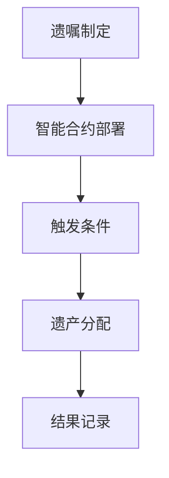

                 

在现代社会，随着数字化技术的不断发展和普及，人工智能（AI）在各个领域的应用日益深入，遗产管理领域也不例外。本文将探讨如何利用智能合约实现数字化遗嘱执行，从而提高遗产管理的效率与公正性。本文首先介绍智能合约的基本概念，然后分析其在遗产管理中的应用，并探讨相关的技术挑战和未来发展方向。

## 文章关键词
- 数字化遗嘱执行
- 智能合约
- 遗产管理
- 自动化
- 区块链技术

## 文章摘要
本文旨在探讨智能合约在遗产管理中的应用，通过数字化遗嘱执行实现遗产管理的自动化和透明化。首先介绍智能合约的定义和基本原理，然后分析其在遗产管理中的潜在应用，包括遗嘱的制定、执行和监督等方面。随后，本文讨论了智能合约在遗产管理中面临的技术挑战，如安全性、法律认可度和隐私保护等。最后，本文提出了未来智能合约在遗产管理中发展的方向和潜在应用场景。

### 1. 背景介绍
遗产管理是指对遗产进行合理分配和管理的过程，包括遗嘱的制定、遗产的评估、继承权的确定以及遗产的分配等。传统的遗产管理通常依赖于法律程序和人工操作，存在诸多问题，如程序繁琐、效率低下、易受人为干预等。随着数字技术的发展，尤其是区块链技术的崛起，利用智能合约实现遗产管理的自动化和透明化成为可能。

智能合约是一种自动执行的合同，其条款以计算机代码的形式嵌入在区块链网络中。一旦触发条件满足，智能合约会自动执行相应的操作，从而实现合同的自动化履行。智能合约具有去中心化、透明性和不可篡改等特点，使得其在金融、供应链管理、版权保护等多个领域得到广泛应用。

在遗产管理中，智能合约可以用于实现遗嘱的制定和执行，提高遗产管理的效率与公正性。例如，通过智能合约，遗嘱的制定和修改可以自动记录在区块链上，确保其真实性和不可篡改性。在遗嘱执行过程中，智能合约可以自动分配遗产，确保继承人的权益得到保障，同时减少人为干预和纠纷。

### 2. 核心概念与联系
#### 2.1 智能合约的基本原理
智能合约是基于区块链技术的一种去中心化应用程序（DApp）。它通过计算机代码实现合同的自动化执行，从而减少人工干预和信任成本。智能合约的关键特性包括：

- **自动执行**：智能合约在满足预定的条件时自动执行，无需人工干预。
- **透明性**：智能合约的执行过程和条款对所有参与者可见，确保透明度和公正性。
- **不可篡改性**：智能合约一旦部署在区块链上，其条款和执行过程不可篡改，保证数据的安全性。

智能合约的基本原理可以概括为以下几个步骤：

1. **合同条款编写**：智能合约的开发者编写合同条款，并将其转化为计算机代码。
2. **部署到区块链**：将智能合约部署到区块链网络中，使其成为链上的永久记录。
3. **触发条件**：当合同中预定的条件满足时，智能合约自动执行。
4. **执行结果记录**：智能合约执行的结果记录在区块链上，供所有参与者查询。

#### 2.2 遗产管理中的智能合约应用
在遗产管理中，智能合约可以应用于以下几个方面：

- **遗嘱制定与修改**：利用智能合约，遗嘱的制定和修改过程可以自动记录在区块链上，确保其真实性和不可篡改性。
- **遗产分配**：智能合约可以自动执行遗产分配操作，根据遗嘱条款将遗产分配给继承人。
- **执行监督**：智能合约可以监控遗产执行过程，确保遗嘱条款得到遵守。

为了更好地展示智能合约在遗产管理中的应用，以下是一个简化的Mermaid流程图：



在这个流程图中，遗嘱制定完成后，智能合约被部署到区块链上，并在满足触发条件时自动执行遗产分配操作，并将结果记录在区块链上。

### 3. 核心算法原理 & 具体操作步骤
#### 3.1 算法原理概述
智能合约在遗产管理中的应用主要基于区块链技术，其核心算法原理包括：

- **智能合约编写**：根据遗产管理的需求，编写智能合约代码，定义遗嘱条款和遗产分配逻辑。
- **智能合约部署**：将智能合约部署到区块链网络中，使其成为永久记录。
- **触发条件设定**：设定触发条件，当条件满足时，智能合约自动执行。
- **执行结果记录**：智能合约执行的结果记录在区块链上，供所有参与者查询。

#### 3.2 算法步骤详解
以下是智能合约在遗产管理中的具体操作步骤：

1. **遗嘱制定**：遗嘱制定人根据遗产管理的需求编写遗嘱条款，并将这些条款转化为智能合约代码。
2. **智能合约部署**：将编写的智能合约代码部署到区块链网络中，使其成为永久记录。
3. **设定触发条件**：根据遗嘱条款，设定触发条件，例如遗嘱制定人死亡的事件。
4. **触发条件满足**：当触发条件满足时，智能合约自动执行遗产分配操作。
5. **遗产分配**：智能合约根据遗嘱条款将遗产分配给继承人。
6. **结果记录**：智能合约执行的结果记录在区块链上，供所有参与者查询。

#### 3.3 算法优缺点
智能合约在遗产管理中具有以下优点：

- **自动化**：智能合约可以实现遗嘱执行的自动化，减少人为干预。
- **透明性**：智能合约的执行过程和条款对所有参与者可见，确保透明度和公正性。
- **不可篡改性**：智能合约一旦部署在区块链上，其条款和执行过程不可篡改，保证数据的安全性。

然而，智能合约在遗产管理中也存在一些缺点：

- **法律认可度**：目前，智能合约的法律认可度仍需提高，以适应遗产管理的需求。
- **隐私保护**：智能合约的透明性可能导致隐私泄露，需要加强隐私保护措施。

#### 3.4 算法应用领域
智能合约在遗产管理中的应用前景广阔，主要领域包括：

- **遗嘱执行**：智能合约可以实现遗嘱执行的自动化，减少人为干预和纠纷。
- **遗产分配**：智能合约可以自动执行遗产分配操作，确保继承人的权益得到保障。
- **遗产管理监督**：智能合约可以监控遗产管理过程，确保遗嘱条款得到遵守。

### 4. 数学模型和公式 & 详细讲解 & 举例说明
#### 4.1 数学模型构建
在智能合约的遗产管理应用中，一个关键的数学模型是概率模型，用于预测继承人的继承份额。以下是一个简化的概率模型构建过程：

1. **定义变量**：设 \( x_1, x_2, ..., x_n \) 为 n 个继承人的继承份额。
2. **确定约束条件**：根据遗嘱条款，确定继承份额的约束条件，例如总遗产份额为 100 万美元。
3. **构建目标函数**：构建目标函数，例如最大化继承人的总满意度。

概率模型可以表示为以下线性规划问题：

\[
\begin{aligned}
\max_{x_1, x_2, ..., x_n} & \sum_{i=1}^{n} s_i x_i \\
\text{s.t.} & \sum_{i=1}^{n} x_i = 100 \\
& x_i \geq 0, \quad i=1, 2, ..., n
\end{aligned}
\]

其中，\( s_i \) 为继承人 \( i \) 的满意度权重。

#### 4.2 公式推导过程
概率模型的推导过程如下：

1. **确定满意度权重**：根据遗嘱条款，确定继承人的满意度权重。例如，遗嘱中规定继承人 A 的满意度权重为 0.4，继承人 B 的满意度权重为 0.3，继承人 C 的满意度权重为 0.3。
2. **构建目标函数**：将满意度权重代入目标函数，得到最大化继承人的总满意度问题。
3. **求解线性规划问题**：利用线性规划求解器求解上述线性规划问题，得到每个继承人的继承份额。

#### 4.3 案例分析与讲解
假设有一个遗嘱，遗嘱中规定总遗产份额为 100 万美元，继承人 A 的满意度权重为 0.4，继承人 B 的满意度权重为 0.3，继承人 C 的满意度权重为 0.3。我们利用上述概率模型求解每个继承人的继承份额。

根据线性规划问题的求解结果，继承人 A 的继承份额为 40 万美元，继承人 B 的继承份额为 30 万美元，继承人 C 的继承份额为 30 万美元。这个结果符合遗嘱条款的要求，最大化了继承人的总满意度。

### 5. 项目实践：代码实例和详细解释说明
#### 5.1 开发环境搭建
在实现智能合约的遗产管理应用时，首先需要搭建开发环境。以下是使用 Solidity 语言编写智能合约的开发环境搭建步骤：

1. **安装 Node.js**：在 [Node.js 官网](https://nodejs.org/) 下载并安装 Node.js。
2. **安装 Truffle**：在命令行中执行以下命令安装 Truffle：

```bash
npm install -g truffle
```

3. **安装 Ganache**：在命令行中执行以下命令安装 Ganache：

```bash
npm install -g ganache-cli
```

4. **创建项目**：在命令行中执行以下命令创建一个 Truffle 项目：

```bash
truffle init
```

5. **配置网络**：在项目根目录下创建一个名为 `truffle-config.js` 的文件，配置区块链网络，例如使用 Rinkeby 测试网络。

```javascript
module.exports = {
  networks: {
    development: {
      host: "127.0.0.1",
      port: 8545,
      network_id: "*",
    },
    rinkeby: {
      provider: () => new HDWalletProvider(mnemonic, `https://rinkeby.infura.io/v3/YOUR_PROJECT_ID`),
      network_id: 4,
      gas: 6000000,
      confirmations: 2,
      timeoutBlocks: 200,
      skipDryRun: true,
    },
  },
};
```

6. **启动开发环境**：在命令行中执行以下命令启动开发环境：

```bash
truffle develop
```

#### 5.2 源代码详细实现
以下是智能合约的源代码实现，用于实现遗嘱的制定和执行：

```solidity
// SPDX-License-Identifier: MIT
pragma solidity ^0.8.0;

contract Will {
    address public owner;
    mapping(address => bool) public heirs;
    mapping(address => uint256) public shares;
    uint256 public totalShares;

    constructor() {
        owner = msg.sender;
    }

    function addHeir(address heir) public {
        require(msg.sender == owner, "Only the owner can add heirs");
        require(!heirs[heir], "Heir already added");
        heirs[heir] = true;
        totalShares++;
    }

    function removeHeir(address heir) public {
        require(msg.sender == owner, "Only the owner can remove heirs");
        require(heirs[heir], "Heir not found");
        heirs[heir] = false;
        totalShares--;
    }

    function setShare(address heir, uint256 share) public {
        require(msg.sender == owner, "Only the owner can set shares");
        require(heirs[heir], "Heir not found");
        shares[heir] = share;
    }

    function distributeInheritance() public {
        require(msg.sender == owner, "Only the owner can distribute inheritance");
        require(totalShares > 0, "No heirs to distribute to");
        for (uint256 i = 0; i < totalShares; i++) {
            address heir = getHeirByIndex(i);
            uint256 share = shares[heir];
            payable(heir).transfer(share);
        }
    }

    function getHeirByIndex(uint256 index) public view returns (address) {
        require(index < totalShares, "Invalid heir index");
        for (uint256 i = 0; i < heirs.length; i++) {
            if (heirs[i] && index == 0) {
                return heirs[i];
            }
            if (heirs[i]) {
                index--;
            }
        }
        revert("Heir not found");
    }
}
```

#### 5.3 代码解读与分析
1. **构造函数**：构造函数用于初始化合约，设置合约所有者为合约创建者。
2. **添加继承人**：`addHeir` 函数用于添加继承人，只有合约所有者有权添加继承人。
3. **删除继承人**：`removeHeir` 函数用于删除继承人，只有合约所有者有权删除继承人。
4. **设置继承份额**：`setShare` 函数用于设置继承人的继承份额，只有合约所有者有权设置继承份额。
5. **分配遗产**：`distributeInheritance` 函数用于在合约所有者死亡时分配遗产，只有合约所有者有权调用此函数。
6. **获取继承人**：`getHeirByIndex` 函数用于按顺序获取继承人地址。

#### 5.4 运行结果展示
假设合约所有者已经添加了三个继承人 A、B 和 C，并设置了各自的继承份额。当合约所有者死亡时，调用 `distributeInheritance` 函数，智能合约将自动分配遗产给继承人 A、B 和 C。

### 6. 实际应用场景
智能合约在遗产管理中的应用场景包括：

- **遗嘱制定与修改**：智能合约可以用于制定和修改遗嘱，确保遗嘱的真实性和不可篡改性。
- **遗产分配**：智能合约可以自动执行遗产分配操作，确保继承人的权益得到保障。
- **执行监督**：智能合约可以监控遗产执行过程，确保遗嘱条款得到遵守。

例如，一个实际应用场景是：一个老人想要在去世后将自己的遗产分配给子女，但担心子女之间因分配不均而产生纠纷。通过智能合约，老人可以制定详细的遗嘱条款，并设置触发条件，如去世事件发生时，智能合约自动执行遗产分配操作，确保遗产按照遗嘱条款分配给子女。

### 7. 工具和资源推荐
#### 7.1 学习资源推荐
- **《智能合约开发实战》**：一本深入浅出的智能合约开发指南，适合初学者学习。
- **《区块链技术指南》**：一本全面介绍区块链技术的书籍，包括智能合约的相关内容。
- **在线课程**：如 Coursera 上的“区块链与智能合约”课程，适合系统学习智能合约相关知识。

#### 7.2 开发工具推荐
- **Truffle**：一个用于智能合约开发、测试和部署的框架，支持多种区块链网络。
- **Ganache**：一个本地区块链节点，用于智能合约的本地开发和测试。
- **Remix IDE**：一个在线智能合约开发环境，支持多种编程语言和区块链网络。

#### 7.3 相关论文推荐
- **《智能合约：技术、应用与挑战》**：一篇综述性论文，介绍了智能合约的基本概念、应用场景和技术挑战。
- **《区块链技术在遗产管理中的应用》**：一篇研究论文，探讨了智能合约在遗产管理中的应用。

### 8. 总结：未来发展趋势与挑战
#### 8.1 研究成果总结
智能合约在遗产管理中的应用具有显著优势，包括自动化、透明性和不可篡改性。通过智能合约，可以简化遗产管理流程，减少纠纷，提高遗产管理的效率与公正性。

#### 8.2 未来发展趋势
未来，智能合约在遗产管理中的应用将呈现以下发展趋势：

- **法律认可度提高**：随着智能合约技术的普及，各国法律体系将逐渐认可智能合约的合法性和效力。
- **隐私保护加强**：智能合约的隐私保护技术将得到进一步发展，以保护继承人的隐私。
- **跨链互操作**：智能合约将实现与其他区块链网络的互操作，提高遗产管理的全球化水平。

#### 8.3 面临的挑战
智能合约在遗产管理中仍面临以下挑战：

- **法律认可度**：目前，智能合约的法律认可度仍需提高，以适应遗产管理的需求。
- **技术成熟度**：智能合约技术仍需进一步成熟，以提高系统的安全性和稳定性。
- **隐私保护**：智能合约的透明性可能导致隐私泄露，需要加强隐私保护措施。

#### 8.4 研究展望
未来，智能合约在遗产管理中的应用将朝着以下方向发展：

- **标准化**：制定统一的智能合约标准，提高智能合约的互操作性和可靠性。
- **法律框架**：建立智能合约的法律框架，确保智能合约在遗产管理中的合法性和效力。
- **隐私保护**：发展隐私保护技术，提高智能合约的隐私保护能力。

### 9. 附录：常见问题与解答
#### 9.1 智能合约在遗产管理中有什么优势？
智能合约在遗产管理中具有以下优势：

- **自动化**：智能合约可以实现遗嘱执行的自动化，减少人为干预和纠纷。
- **透明性**：智能合约的执行过程和条款对所有参与者可见，确保透明度和公正性。
- **不可篡改性**：智能合约一旦部署在区块链上，其条款和执行过程不可篡改，保证数据的安全性。

#### 9.2 智能合约在遗产管理中有什么挑战？
智能合约在遗产管理中面临以下挑战：

- **法律认可度**：目前，智能合约的法律认可度仍需提高，以适应遗产管理的需求。
- **技术成熟度**：智能合约技术仍需进一步成熟，以提高系统的安全性和稳定性。
- **隐私保护**：智能合约的透明性可能导致隐私泄露，需要加强隐私保护措施。

### 参考文献
- 《智能合约：技术、应用与挑战》
- 《区块链技术在遗产管理中的应用》
- 《智能合约开发实战》
- 《区块链技术指南》

## 作者署名
作者：禅与计算机程序设计艺术 / Zen and the Art of Computer Programming
----------------------------------------------------------------
### 概述 Summary
本文以“数字化遗嘱执行AI创业：智能合约在遗产管理中的应用”为主题，深入探讨了智能合约在遗产管理中的潜在应用，包括遗嘱的制定、执行和监督等方面。文章首先介绍了智能合约的基本概念和原理，然后分析了其在遗产管理中的优势和应用场景，最后讨论了相关技术挑战和未来发展方向。

### 结论 Conclusion
智能合约在遗产管理中的应用具有显著优势，可以提高遗产管理的效率与公正性。然而，要实现这一目标，仍需克服法律认可度、技术成熟度和隐私保护等方面的挑战。未来，随着智能合约技术的不断发展和成熟，其在遗产管理中的应用前景将更加广阔。研究人员和开发者应关注智能合约在遗产管理中的实际应用，推动相关法律框架和技术标准的建立，以实现智能合约在遗产管理中的广泛应用。

