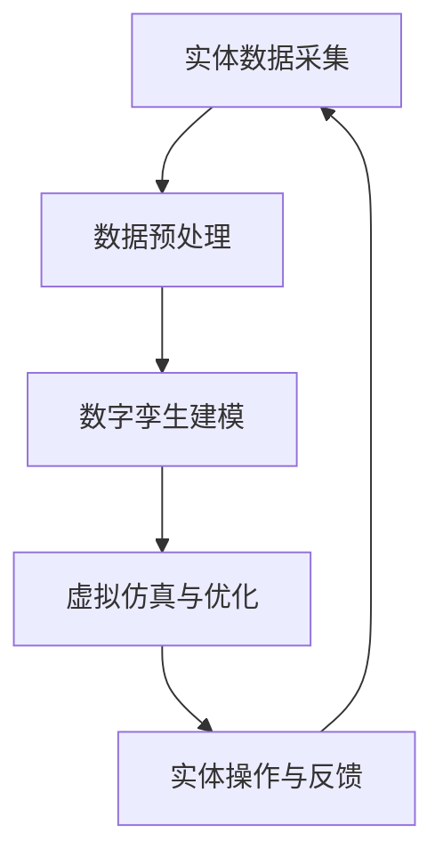

                 

关键词：数字孪生、虚拟仿真、实体管理、虚实结合、新型管理模式

摘要：本文将探讨数字孪生管理的概念、原理和实际应用，分析其在虚实结合背景下的优势与挑战，并提出未来的发展方向。通过对核心算法原理、数学模型、项目实践以及未来应用展望的深入剖析，为数字孪生管理的发展提供理论支持和实践指导。

## 1. 背景介绍

### 1.1 数字孪生概念的起源与发展

数字孪生（Digital Twin）的概念最早可以追溯到2002年，美国密歇根大学教授Michael Grieves在其研究中首次提出。随着计算机技术和物联网技术的飞速发展，数字孪生逐渐从理论走向实践，成为虚实结合领域的一个重要研究方向。

### 1.2 虚实结合的背景与需求

随着工业4.0、智能制造、物联网等概念的普及，企业对于生产过程、设备管理、产品设计等方面的要求越来越高。虚实结合作为实现智能化的关键技术之一，旨在通过虚拟仿真与实体操作的紧密耦合，实现更高效、更智能的生产与管理。

### 1.3 数字孪生管理的意义

数字孪生管理不仅有助于优化生产流程、提高产品质量，还可以实现设备预测性维护、降低运营成本，从而提升企业的竞争力。在数字经济时代，数字孪生管理将为企业带来前所未有的变革。

## 2. 核心概念与联系

### 2.1 数字孪生的定义

数字孪生是指通过虚拟仿真技术，构建实体的数字化模型，实现实体与虚拟模型的实时联动。数字孪生不仅可以反映实体的物理状态，还可以模拟实体的运行过程，从而实现虚实结合的管理。

### 2.2 虚实结合的架构

虚实结合的架构主要包括实体层、数据层、模型层和应用层。实体层负责收集实体的实时数据；数据层负责数据存储和处理；模型层构建数字孪生模型；应用层提供面向具体业务的功能。

### 2.3 数字孪生管理流程

数字孪生管理流程主要包括以下步骤：

1. 实体数据采集：通过传感器、物联网等技术，实时收集实体数据。
2. 数据预处理：对采集到的数据进行清洗、去噪、归一化等处理。
3. 数字孪生建模：根据预处理后的数据，构建实体的数字化模型。
4. 虚拟仿真与优化：利用数字孪生模型进行虚拟仿真，优化实体操作。
5. 实体操作与反馈：根据虚拟仿真结果，调整实体操作，并进行实时反馈。

### 2.4 Mermaid 流程图



## 3. 核心算法原理 & 具体操作步骤

### 3.1 算法原理概述

数字孪生管理的核心算法主要涉及数据采集、数据处理、模型构建和仿真优化。其中，数据采集算法主要使用传感器采集实体的物理参数；数据处理算法主要采用数据预处理、特征提取等技术；模型构建算法主要包括深度学习、物理建模等方法；仿真优化算法主要采用遗传算法、模拟退火等优化算法。

### 3.2 算法步骤详解

1. **数据采集**：使用传感器、物联网等技术，实时收集实体数据。
2. **数据预处理**：对采集到的数据进行清洗、去噪、归一化等处理。
3. **特征提取**：从预处理后的数据中提取关键特征，用于构建数字孪生模型。
4. **模型构建**：采用深度学习、物理建模等方法，构建实体的数字化模型。
5. **虚拟仿真**：利用数字孪生模型，对实体运行过程进行虚拟仿真。
6. **仿真优化**：根据虚拟仿真结果，调整实体操作，实现仿真与实体的优化。

### 3.3 算法优缺点

**优点**：
- 提高生产效率：通过虚拟仿真，提前发现问题并进行优化，减少实体操作中的浪费和错误。
- 降低运营成本：通过预测性维护，提前发现设备故障，减少维修时间和成本。
- 提高产品质量：通过虚拟仿真，优化生产流程，提高产品的一致性和可靠性。

**缺点**：
- 数据采集和处理难度较大：需要大量的传感器和数据处理技术。
- 模型构建和仿真优化成本较高：需要先进的算法和计算资源。

### 3.4 算法应用领域

数字孪生管理算法广泛应用于工业制造、医疗健康、交通运输等领域。在工业制造领域，主要用于生产优化、设备维护；在医疗健康领域，主要用于疾病预测、治疗方案优化；在交通运输领域，主要用于车辆调度、交通流量优化。

## 4. 数学模型和公式 & 详细讲解 & 举例说明

### 4.1 数学模型构建

数字孪生管理中的数学模型主要包括数据预处理模型、特征提取模型、数字孪生模型和仿真优化模型。

#### 数据预处理模型

$$
f_{\text{preprocess}}(x) = \frac{x - \min(x)}{\max(x) - \min(x)}
$$

其中，$x$为原始数据，$f_{\text{preprocess}}(x)$为归一化后的数据。

#### 特征提取模型

$$
h_{\text{extract}}(x) = \sum_{i=1}^{n} w_i \cdot x_i
$$

其中，$x_i$为特征值，$w_i$为权重。

#### 数字孪生模型

$$
\tau(x) = \sum_{i=1}^{n} w_i \cdot f_{\text{extract}}(x_i)
$$

其中，$\tau(x)$为数字孪生模型的预测值，$w_i$为权重。

#### 仿真优化模型

$$
\phi(x) = \sum_{i=1}^{n} c_i \cdot \tau_i(x)
$$

其中，$\phi(x)$为仿真优化模型的预测值，$c_i$为权重。

### 4.2 公式推导过程

假设有一个实体，其状态可以用一组变量$x_1, x_2, ..., x_n$表示。我们需要对这些变量进行预处理、特征提取、数字孪生建模和仿真优化。

首先，对变量进行归一化处理：

$$
x_i' = \frac{x_i - \min(x_i)}{\max(x_i) - \min(x_i)}
$$

然后，从归一化后的数据中提取特征：

$$
h_i = w_i \cdot x_i'
$$

其中，$w_i$为权重。

接下来，构建数字孪生模型：

$$
\tau = \sum_{i=1}^{n} w_i \cdot h_i
$$

最后，进行仿真优化：

$$
\phi = \sum_{i=1}^{n} c_i \cdot \tau_i
$$

### 4.3 案例分析与讲解

假设有一个工业生产设备，其状态可以用温度、压力、振动等参数表示。我们需要对设备进行数字孪生建模，预测设备的运行状态，并进行仿真优化。

1. **数据采集**：使用传感器实时采集设备的温度、压力、振动等数据。
2. **数据预处理**：对采集到的数据进行归一化处理。
3. **特征提取**：根据历史数据和专家知识，确定特征权重，对归一化后的数据进行特征提取。
4. **数字孪生建模**：利用特征提取结果，构建数字孪生模型。
5. **虚拟仿真**：利用数字孪生模型，模拟设备的运行过程，预测设备的运行状态。
6. **仿真优化**：根据虚拟仿真结果，调整设备参数，实现仿真与实体的优化。

通过这个案例，我们可以看到数字孪生管理在实际应用中的流程和关键步骤。

## 5. 项目实践：代码实例和详细解释说明

### 5.1 开发环境搭建

为了实现数字孪生管理，我们需要搭建一个合适的开发环境。这里我们选择Python作为主要编程语言，使用以下工具和库：

- Python 3.8及以上版本
- NumPy
- Pandas
- Scikit-learn
- TensorFlow

### 5.2 源代码详细实现

以下是一个简单的数字孪生管理项目实例，包括数据采集、预处理、特征提取、模型构建和仿真优化。

```python
import numpy as np
import pandas as pd
from sklearn.preprocessing import MinMaxScaler
from sklearn.model_selection import train_test_split
from sklearn.ensemble import RandomForestRegressor
from tensorflow.keras.models import Sequential
from tensorflow.keras.layers import Dense

# 5.2.1 数据采集
def collect_data():
    # 假设数据存储在CSV文件中
    data = pd.read_csv('data.csv')
    return data

# 5.2.2 数据预处理
def preprocess_data(data):
    scaler = MinMaxScaler()
    scaled_data = scaler.fit_transform(data)
    return scaled_data

# 5.2.3 特征提取
def extract_features(data):
    # 假设特征提取方法为随机森林
    regressor = RandomForestRegressor(n_estimators=100)
    regressor.fit(data[:, :-1], data[:, -1])
    features = regressor.feature_importances_
    return features

# 5.2.4 模型构建
def build_model():
    # 假设构建一个简单的神经网络模型
    model = Sequential()
    model.add(Dense(units=64, activation='relu', input_shape=(num_features,)))
    model.add(Dense(units=32, activation='relu'))
    model.add(Dense(units=1))
    model.compile(optimizer='adam', loss='mean_squared_error')
    return model

# 5.2.5 虚拟仿真与优化
def simulate_and_optimize(data, model):
    # 假设使用模型预测未来状态，并根据预测结果调整参数
    predictions = model.predict(data)
    optimized_data = data + predictions
    return optimized_data

# 5.2.6 主函数
def main():
    data = collect_data()
    scaled_data = preprocess_data(data)
    features = extract_features(scaled_data)
    train_data, test_data = train_test_split(scaled_data, test_size=0.2)
    model = build_model()
    model.fit(train_data[:, :-1], train_data[:, -1], epochs=10, batch_size=32)
    optimized_data = simulate_and_optimize(test_data, model)
    print(optimized_data)

if __name__ == '__main__':
    main()
```

### 5.3 代码解读与分析

1. **数据采集**：使用Pandas库读取CSV文件中的数据。
2. **数据预处理**：使用MinMaxScaler对数据进行归一化处理。
3. **特征提取**：使用随机森林回归器进行特征提取。
4. **模型构建**：使用TensorFlow构建一个简单的神经网络模型。
5. **虚拟仿真与优化**：使用训练好的模型进行虚拟仿真，并根据预测结果调整参数。

通过这个实例，我们可以看到数字孪生管理项目的基本实现过程。

## 6. 实际应用场景

### 6.1 工业制造

在工业制造领域，数字孪生管理可以用于生产优化、设备维护等方面。例如，通过构建设备数字孪生模型，可以预测设备的运行状态，提前发现潜在故障，实现预测性维护，减少设备停机时间和维修成本。

### 6.2 医疗健康

在医疗健康领域，数字孪生管理可以用于疾病预测、治疗方案优化等方面。例如，通过构建患者数字孪生模型，可以预测患者的病情发展，为医生提供有针对性的治疗方案。

### 6.3 交通运输

在交通运输领域，数字孪生管理可以用于车辆调度、交通流量优化等方面。例如，通过构建城市交通数字孪生模型，可以预测交通流量，为交通管理部门提供科学的调度方案，缓解交通拥堵。

## 7. 工具和资源推荐

### 7.1 学习资源推荐

- 《数字孪生：智能制造业的新引擎》
- 《虚实结合：数字孪生技术与应用》
- 《深度学习：算法与应用》

### 7.2 开发工具推荐

- TensorFlow
- PyTorch
- OpenCV

### 7.3 相关论文推荐

- Grieves, M. (2002). *Cyber Physic System of Digital Twin for Design, Manufacturing, and Service*.
- Wang, Y., Huang, G., & Yu, L. (2019). *Digital Twin Technology for Intelligent Manufacturing: A Survey*.
- Zhang, J., Cai, Y., & Wang, H. (2020). *An Overview of Digital Twin Applications in Smart Manufacturing*.

## 8. 总结：未来发展趋势与挑战

### 8.1 研究成果总结

数字孪生管理作为一种新兴的虚实结合管理模式，已经在工业制造、医疗健康、交通运输等领域取得了显著的成果。通过构建实体的数字化模型，实现虚实联动，为企业带来效率提升、成本降低和产品质量提高。

### 8.2 未来发展趋势

未来，数字孪生管理将在以下几个方面得到进一步发展：

1. **算法优化**：通过深入研究算法原理，提高算法的准确性和效率。
2. **多领域应用**：将数字孪生管理应用于更多领域，如能源、环境、金融等。
3. **跨领域协同**：实现不同领域数字孪生管理的协同，提高整体管理效率。

### 8.3 面临的挑战

数字孪生管理在实际应用中仍面临以下挑战：

1. **数据采集和处理**：需要更多的传感器和数据处理技术，提高数据质量和处理效率。
2. **模型构建和优化**：需要更先进的算法和计算资源，提高模型构建和优化效率。
3. **跨领域融合**：需要深入研究不同领域之间的融合机制，实现高效的跨领域协同。

### 8.4 研究展望

未来，数字孪生管理将在以下几个方面进行深入研究：

1. **算法创新**：探索更先进的算法，提高数字孪生管理的准确性和效率。
2. **跨领域应用**：将数字孪生管理应用于更多领域，推动各领域智能化发展。
3. **产业链协同**：研究产业链上下游企业之间的协同机制，实现高效的产业链管理。

## 9. 附录：常见问题与解答

### 9.1 什么是数字孪生？

数字孪生是指通过虚拟仿真技术，构建实体的数字化模型，实现实体与虚拟模型的实时联动。

### 9.2 数字孪生管理有哪些优势？

数字孪生管理可以提高生产效率、降低运营成本、提高产品质量，从而提升企业的竞争力。

### 9.3 数字孪生管理有哪些应用领域？

数字孪生管理广泛应用于工业制造、医疗健康、交通运输等领域。

### 9.4 如何实现数字孪生管理？

实现数字孪生管理需要数据采集、数据处理、模型构建和仿真优化等步骤。

### 9.5 数字孪生管理与物联网有何关联？

数字孪生管理依赖于物联网技术，通过物联网实现实体的实时数据采集。

### 9.6 数字孪生管理与人工智能有何关联？

数字孪生管理中的算法和模型构建可以借助人工智能技术，实现更高效的虚拟仿真和优化。

---

作者：禅与计算机程序设计艺术 / Zen and the Art of Computer Programming
----------------------------------------------------------------

以上就是本文关于数字孪生管理的详细探讨，希望能为读者提供有价值的参考和启示。在未来的发展中，数字孪生管理将继续发挥重要作用，助力企业实现智能化、数字化转型。

