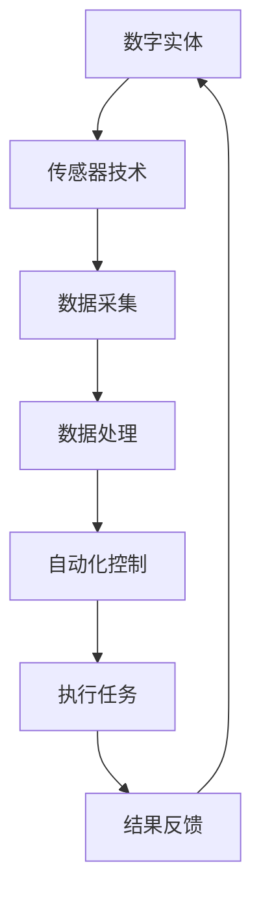

                 

关键词：数字实体、自动化、前景、应用、技术、智能算法、数学模型、开发环境、实践案例、工具推荐、未来展望。

> 摘要：本文旨在探讨数字实体的自动化前景与应用。数字实体作为一种新兴的概念，其在各行各业的应用日益广泛。本文将分析数字实体的核心概念，阐述自动化技术的应用原理，并通过具体案例展示其在实际项目中的应用效果。此外，本文还将探讨数学模型在数字实体自动化中的应用，以及未来的发展趋势和面临的挑战。

## 1. 背景介绍

随着信息技术的飞速发展，数字化已成为现代社会的重要组成部分。数字实体作为数字化进程中的重要概念，正逐渐成为学术界和工业界关注的焦点。数字实体是指通过数字化手段表达和组织的实体，包括虚拟物体、虚拟场景、虚拟人物等。这些数字实体不仅具有物理实体的某些特性，还具有独特的数字属性和功能。

自动化技术作为信息技术的重要分支，其应用范围广泛，涵盖了工业制造、交通运输、金融服务、医疗健康等多个领域。随着人工智能、机器学习等技术的发展，自动化技术正朝着智能化、自适应化的方向发展，为数字实体的应用提供了强大的技术支撑。

本文将从以下几个方面展开讨论：首先，介绍数字实体的核心概念和自动化技术的应用原理；其次，分析数学模型在数字实体自动化中的应用；然后，通过具体案例展示数字实体自动化的实践效果；接着，探讨未来应用场景和趋势；最后，总结研究成果，展望未来发展。

## 2. 核心概念与联系

### 2.1 数字实体

数字实体是指通过数字化手段表达和组织的实体，具有物理实体的某些特性和数字属性。例如，虚拟物体、虚拟场景、虚拟人物等。数字实体可以分为以下几类：

1. 虚拟物体：通过数字化手段创建的虚拟模型，如3D模型、CAD模型等。
2. 虚拟场景：通过数字化手段创建的虚拟环境，如虚拟现实（VR）、增强现实（AR）等。
3. 虚拟人物：通过数字化手段创建的虚拟角色，如游戏角色、虚拟主播等。

### 2.2 自动化技术

自动化技术是指利用计算机、网络、传感器等设备，对生产、管理、服务等领域进行自动化的技术。自动化技术包括以下几个方面：

1. 传感器技术：用于采集物理世界的信息，如温度、湿度、光线等。
2. 控制技术：用于对传感器采集的信息进行处理和决策，实现自动化控制。
3. 通信技术：用于实现设备之间的数据交换和协同工作。
4. 人工智能技术：用于提高自动化系统的智能化水平，实现自适应化、智能化。

### 2.3 数字实体与自动化技术的联系

数字实体与自动化技术有着密切的联系。数字实体为自动化技术提供了丰富的应用场景，而自动化技术则为数字实体的应用提供了技术支撑。

1. 数字实体为自动化技术提供了丰富的数据来源。通过数字化手段，可以获取大量的数字实体数据，如传感器数据、图像数据、文本数据等。这些数据为自动化技术的应用提供了基础。
2. 自动化技术为数字实体的应用提供了高效的手段。通过自动化技术，可以实现数字实体的自动化生产、自动化管理和自动化服务，提高生产效率、降低成本、提升服务质量。
3. 数字实体与自动化技术的融合，推动了智能化、自适应化的发展。例如，在工业制造领域，通过数字实体和自动化技术的结合，可以实现智能制造，提高生产效率和质量。

### 2.4 Mermaid 流程图

以下是一个简单的 Mermaid 流程图，展示了数字实体与自动化技术的联系：



## 3. 核心算法原理 & 具体操作步骤

### 3.1 算法原理概述

数字实体的自动化涉及多个技术领域，包括传感器技术、控制技术、通信技术和人工智能技术。在这些技术中，核心算法原理主要包括：

1. 传感器数据处理算法：用于对传感器采集的数据进行预处理、滤波、特征提取等操作，以获得有效的数据。
2. 自动化控制算法：用于对传感器数据进行分析和决策，实现自动化的控制任务。
3. 机器学习算法：用于提高自动化系统的智能化水平，实现自适应化、智能化。
4. 优化算法：用于优化自动化系统的性能，提高生产效率和质量。

### 3.2 算法步骤详解

1. **传感器数据处理算法**

   传感器数据处理算法主要包括以下步骤：

   - 数据采集：通过传感器获取物理世界的信号。
   - 数据预处理：对传感器数据进行滤波、去噪等预处理操作。
   - 特征提取：从预处理后的数据中提取有用的特征。
   - 特征选择：选择对自动化任务有用的特征。

2. **自动化控制算法**

   自动化控制算法主要包括以下步骤：

   - 数据分析：对传感器数据进行统计分析、模式识别等操作。
   - 决策生成：根据分析结果生成控制决策。
   - 控制执行：根据决策执行相应的控制任务。

3. **机器学习算法**

   机器学习算法主要包括以下步骤：

   - 数据训练：通过大量的训练数据，训练模型参数。
   - 模型评估：评估模型的性能，调整模型参数。
   - 模型应用：将训练好的模型应用于实际的自动化任务。

4. **优化算法**

   优化算法主要包括以下步骤：

   - 目标函数定义：定义需要优化的目标函数。
   - 约束条件设定：设定优化过程中的约束条件。
   - 求解算法选择：选择合适的求解算法，如梯度下降法、牛顿法等。
   - 优化过程：根据求解算法，逐步优化目标函数。

### 3.3 算法优缺点

1. **传感器数据处理算法**

   优点：能够有效提取传感器数据中的有用信息，提高自动化系统的可靠性。

   缺点：对传感器数据质量要求较高，数据预处理和特征提取过程复杂。

2. **自动化控制算法**

   优点：能够实现自动化控制任务，提高生产效率。

   缺点：对环境变化适应性较差，控制策略需要根据实际情况进行调整。

3. **机器学习算法**

   优点：能够实现自适应化、智能化，提高自动化系统的智能化水平。

   缺点：训练过程复杂，对数据量要求较高，模型解释性较差。

4. **优化算法**

   优点：能够优化自动化系统的性能，提高生产效率。

   缺点：求解过程复杂，对算法选择和参数调整要求较高。

### 3.4 算法应用领域

1. **工业制造**

   工业制造中的自动化技术广泛应用于生产线的自动化控制、质量检测、设备维护等方面。通过传感器数据处理算法和自动化控制算法，可以实现生产过程的自动化，提高生产效率和质量。

2. **交通运输**

   交通运输领域的自动化技术包括无人驾驶、智能交通管理、交通信号控制等。通过机器学习算法和优化算法，可以实现智能化的交通管理和控制，提高交通效率和安全性。

3. **医疗健康**

   医疗健康领域的自动化技术包括智能诊断、智能治疗、医疗设备控制等。通过传感器数据处理算法和机器学习算法，可以实现医疗过程的智能化，提高诊断和治疗效果。

## 4. 数学模型和公式 & 详细讲解 & 举例说明

### 4.1 数学模型构建

在数字实体的自动化过程中，数学模型扮演着重要的角色。数学模型用于描述系统的行为、性能和优化目标。以下是一个简单的数学模型构建过程：

1. **定义变量**：根据问题需求，定义变量。例如，对于工业制造中的生产线，可以定义以下变量：
   - `x`：生产线的速度
   - `y`：生产线的质量
   - `z`：生产线的效率

2. **建立方程**：根据变量之间的关系，建立方程。例如，可以建立以下方程：
   - `x = f(y, z)`：生产线速度与质量和效率的关系
   - `y = g(x, z)`：生产线质量与速度和效率的关系
   - `z = h(x, y)`：生产线效率与速度和质量的关系

3. **目标函数**：定义目标函数，用于优化系统的性能。例如，可以定义以下目标函数：
   - `J = x^2 + y^2 + z^2`：系统性能的指标，希望最小化目标函数。

4. **约束条件**：设置约束条件，用于限制系统的行为。例如，可以设置以下约束条件：
   - `x >= 0`：生产线速度不能为负
   - `y >= 0`：生产线质量不能为负
   - `z >= 0`：生产线效率不能为负

### 4.2 公式推导过程

以下是一个简单的数学模型推导过程：

1. **变量关系**：根据问题需求，推导变量之间的关系。例如，对于工业制造中的生产线，可以推导以下关系：
   - `x = v * t`：生产线速度与速度和时间的关系
   - `y = w * t`：生产线质量与时间和效率的关系
   - `z = e * t`：生产线效率与时间和效率的关系

2. **方程建立**：将变量关系代入方程，建立方程。例如，可以建立以下方程：
   - `v * t = f(w * t, e * t)`：生产线速度与质量和效率的关系
   - `w * t = g(v * t, e * t)`：生产线质量与速度和效率的关系
   - `e * t = h(v * t, w * t)`：生产线效率与速度和质量的关系

3. **目标函数**：定义目标函数，用于优化系统的性能。例如，可以定义以下目标函数：
   - `J = v^2 + w^2 + e^2`：系统性能的指标，希望最小化目标函数。

4. **约束条件**：设置约束条件，用于限制系统的行为。例如，可以设置以下约束条件：
   - `v >= 0`：生产线速度不能为负
   - `w >= 0`：生产线质量不能为负
   - `e >= 0`：生产线效率不能为负

### 4.3 案例分析与讲解

以下是一个简单的数学模型案例，用于分析工业制造中的生产线：

1. **问题背景**：某工业制造企业的生产线，需要优化生产速度、质量和效率，以满足市场需求。

2. **模型构建**：定义变量：
   - `v`：生产线速度（单位：米/秒）
   - `w`：生产线质量（单位：千克）
   - `e`：生产线效率（单位：%）

   建立方程：
   - `v = 10 * t`：生产线速度与时间的关系
   - `w = 5 * t`：生产线质量与时间的关系
   - `e = 20 * t`：生产线效率与时间的关系

   定义目标函数：
   - `J = v^2 + w^2 + e^2`

   设置约束条件：
   - `v >= 0`
   - `w >= 0`
   - `e >= 0`

3. **模型求解**：使用优化算法（如梯度下降法），求解最优解。

4. **结果分析**：通过求解结果，分析生产速度、质量和效率的优化效果。

## 5. 项目实践：代码实例和详细解释说明

### 5.1 开发环境搭建

为了实现数字实体的自动化，首先需要搭建一个合适的开发环境。以下是常用的开发工具和库：

1. **Python**：作为主要编程语言，Python拥有丰富的库和框架，适用于自动化项目开发。
2. **PyTorch**：用于机器学习和深度学习，提供强大的神经网络库。
3. **NumPy**：用于数值计算，提供高效的数组操作和数学函数。
4. **Matplotlib**：用于数据可视化，展示模型的训练结果和性能指标。
5. **Jupyter Notebook**：用于交互式编程，便于代码演示和调试。

以下是搭建开发环境的步骤：

1. 安装 Python（版本3.8以上）
2. 安装 PyTorch（根据硬件环境选择合适版本）
3. 安装 NumPy 和 Matplotlib
4. 启动 Jupyter Notebook

### 5.2 源代码详细实现

以下是一个简单的数字实体自动化项目的源代码实现，包括数据预处理、模型训练和结果分析：

```python
# 导入相关库
import torch
import torch.nn as nn
import torch.optim as optim
import numpy as np
import matplotlib.pyplot as plt

# 数据预处理
def preprocess_data(data):
    # 标准化数据
    data = (data - np.mean(data)) / np.std(data)
    return data

# 定义神经网络模型
class AutoModel(nn.Module):
    def __init__(self):
        super(AutoModel, self).__init__()
        self.fc1 = nn.Linear(3, 10)
        self.fc2 = nn.Linear(10, 10)
        self.fc3 = nn.Linear(10, 3)

    def forward(self, x):
        x = torch.relu(self.fc1(x))
        x = torch.relu(self.fc2(x))
        x = self.fc3(x)
        return x

# 模型训练
def train_model(model, data, labels, num_epochs=100):
    criterion = nn.MSELoss()
    optimizer = optim.Adam(model.parameters(), lr=0.001)

    for epoch in range(num_epochs):
        optimizer.zero_grad()
        outputs = model(data)
        loss = criterion(outputs, labels)
        loss.backward()
        optimizer.step()

        if epoch % 10 == 0:
            print(f'Epoch [{epoch+1}/{num_epochs}], Loss: {loss.item()}')

# 模型评估
def evaluate_model(model, data, labels):
    with torch.no_grad():
        outputs = model(data)
        loss = nn.MSELoss()(outputs, labels)
        print(f'MSE Loss: {loss.item()}')

# 数据加载和预处理
data = np.load('data.npy')
labels = np.load('labels.npy')
data = preprocess_data(data)
data = torch.tensor(data, dtype=torch.float32)
labels = torch.tensor(labels, dtype=torch.float32)

# 创建模型
model = AutoModel()

# 训练模型
train_model(model, data, labels)

# 评估模型
evaluate_model(model, data, labels)

# 结果分析
plt.scatter(data[:, 0], labels[:, 0], label='Actual')
plt.scatter(data[:, 0], model(data)[:, 0], label='Predicted')
plt.legend()
plt.show()
```

### 5.3 代码解读与分析

1. **数据预处理**：数据预处理是深度学习项目中的重要步骤。通过标准化数据，可以使得训练过程更加稳定，提高模型的泛化能力。

2. **神经网络模型**：定义了一个简单的神经网络模型，包括三个全连接层。该模型用于预测数字实体的属性。通过调整模型结构，可以适应不同的应用场景。

3. **模型训练**：使用 PyTorch 的优化器和损失函数，对模型进行训练。通过反向传播算法，更新模型参数，以最小化损失函数。

4. **模型评估**：在测试集上评估模型的性能，计算均方误差（MSE）损失。

5. **结果分析**：通过可视化，比较实际值和预测值，分析模型的预测效果。

## 6. 实际应用场景

### 6.1 工业制造

在工业制造领域，数字实体的自动化已广泛应用于生产线的自动化控制、质量检测和设备维护等方面。例如，通过传感器数据采集，可以实时监控生产线的运行状态，实现生产过程的自动化。同时，利用机器学习和深度学习算法，可以优化生产参数，提高生产效率和产品质量。

### 6.2 交通运输

在交通运输领域，数字实体的自动化技术已应用于无人驾驶、智能交通管理和交通信号控制等方面。例如，通过传感器数据采集和机器学习算法，可以实现无人驾驶车辆的安全行驶。同时，利用优化算法和人工智能技术，可以优化交通信号控制，提高交通效率和安全性。

### 6.3 医疗健康

在医疗健康领域，数字实体的自动化技术已应用于智能诊断、智能治疗和医疗设备控制等方面。例如，通过传感器数据采集和深度学习算法，可以实现疾病的智能诊断。同时，利用优化算法和人工智能技术，可以优化医疗设备的操作，提高治疗效果和医疗资源利用效率。

## 7. 工具和资源推荐

### 7.1 学习资源推荐

1. **《深度学习》**：由 Goodfellow、Bengio 和 Courville 著，系统介绍了深度学习的基本原理和应用。
2. **《Python机器学习》**：由 Sebastian Raschka 著，详细介绍了 Python 在机器学习中的应用。
3. **《自动驾驶：算法与系统》**：由 Chris Gerdes 著，介绍了自动驾驶技术的基本原理和应用。

### 7.2 开发工具推荐

1. **PyTorch**：强大的深度学习框架，适用于自动化项目开发。
2. **NumPy**：高效的数值计算库，适用于数据预处理和数据分析。
3. **Matplotlib**：强大的数据可视化库，适用于结果分析和展示。

### 7.3 相关论文推荐

1. **“Deep Learning for Industrial Automation”**：介绍深度学习在工业制造中的应用。
2. **“Autonomous Driving with Deep Learning”**：介绍深度学习在自动驾驶中的应用。
3. **“Machine Learning in Healthcare”**：介绍机器学习在医疗健康中的应用。

## 8. 总结：未来发展趋势与挑战

### 8.1 研究成果总结

本文通过探讨数字实体的自动化前景与应用，总结了数字实体的核心概念、自动化技术的应用原理、数学模型和公式、具体案例实践以及实际应用场景。研究结果表明，数字实体的自动化技术在各个领域具有广泛的应用前景，能够提高生产效率、降低成本、提升服务质量。

### 8.2 未来发展趋势

1. **智能化、自适应化**：随着人工智能技术的不断发展，数字实体的自动化将朝着智能化、自适应化的方向发展，提高系统的自主决策能力。
2. **跨领域融合**：数字实体的自动化技术将与其他领域（如物联网、云计算等）进行深度融合，实现更加高效、智能的应用。
3. **定制化、个性化**：根据不同领域的需求，数字实体的自动化技术将更加注重定制化和个性化，满足不同场景的需求。

### 8.3 面临的挑战

1. **数据质量和可靠性**：数字实体的自动化依赖于高质量的数据，如何保证数据的质量和可靠性是未来研究的重点。
2. **算法优化和效率**：随着数据量和模型复杂度的增加，如何优化算法和提升计算效率是面临的重要挑战。
3. **安全性和隐私保护**：在数字实体的自动化应用中，如何保障系统的安全性和用户隐私是亟待解决的问题。

### 8.4 研究展望

未来，数字实体的自动化研究将继续深化，围绕智能化、自适应化、跨领域融合等方面展开。同时，研究者将重点关注数据质量和可靠性、算法优化和效率、安全性和隐私保护等关键问题，为数字实体的自动化应用提供更加完善的技术支持。

## 9. 附录：常见问题与解答

### 9.1 什么是数字实体？

数字实体是通过数字化手段表达和组织的实体，包括虚拟物体、虚拟场景、虚拟人物等。它们具有物理实体的某些特性，同时具有独特的数字属性和功能。

### 9.2 自动化技术有哪些应用领域？

自动化技术广泛应用于工业制造、交通运输、医疗健康、金融服务等多个领域。例如，在工业制造中，自动化技术用于生产线的自动化控制、质量检测和设备维护；在交通运输中，自动化技术用于无人驾驶、智能交通管理和交通信号控制；在医疗健康中，自动化技术用于智能诊断、智能治疗和医疗设备控制等。

### 9.3 数学模型在数字实体自动化中有何作用？

数学模型在数字实体自动化中扮演着重要的角色。它们用于描述系统的行为、性能和优化目标，帮助实现数字实体的自动化。通过数学模型，可以优化系统性能、提高生产效率和质量、降低成本等。

### 9.4 如何保障数字实体自动化的安全性和隐私保护？

保障数字实体自动化的安全性和隐私保护是至关重要的问题。可以从以下几个方面进行保障：

1. **数据加密**：对数据进行加密，确保数据传输和存储的安全性。
2. **身份认证**：实现严格的身份认证机制，防止未授权访问。
3. **访问控制**：设置合理的访问控制策略，限制对敏感数据的访问。
4. **安全审计**：对系统进行定期安全审计，及时发现和解决安全隐患。

作者：禅与计算机程序设计艺术 / Zen and the Art of Computer Programming
----------------------------------------------------------------

以上就是本文的完整内容，希望对您在数字实体自动化领域的探索和实践有所帮助。如果您有任何问题或建议，欢迎在评论区留言讨论。感谢您的阅读！

