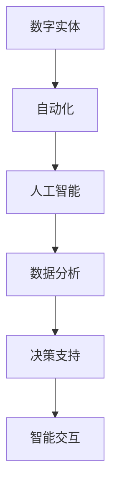

                 

关键词：数字实体，自动化，人工智能，算法，数学模型，应用场景，未来展望

> 摘要：随着人工智能和自动化技术的发展，数字实体自动化正逐渐成为推动产业升级和社会进步的重要力量。本文将从数字实体的定义、核心概念与联系、算法原理与数学模型、应用实践等方面，深入探讨数字实体自动化的新时代。

## 1. 背景介绍

随着信息技术的飞速发展，人类社会正在从传统的工业时代迈向数字化、智能化时代。在这个过程中，数字实体成为了关键的概念。数字实体指的是在计算机系统中表示的抽象实体，它可以是数据、对象、服务、甚至是虚拟的个体或组织。数字实体的自动化，就是通过编程、算法和人工智能等技术，使这些实体能够自主地进行操作和交互。

数字实体自动化的兴起，不仅提升了生产效率，也改变了我们的生活方式。例如，自动驾驶汽车、智能家居、智能医疗等，都是数字实体自动化的典型应用场景。这些应用不仅提高了生活便利性，还推动了产业结构的升级。

### 当前数字实体自动化面临的挑战与机遇

当前，数字实体自动化面临着诸多挑战和机遇。一方面，随着数据量的爆发式增长，如何有效地处理和分析这些数据，成为了一个重要的课题。另一方面，随着人工智能技术的不断发展，如何将人工智能技术应用到数字实体自动化中，也是一个亟待解决的问题。

此外，随着物联网、区块链等新兴技术的普及，数字实体之间的交互和协作也将变得更加复杂和多样。如何构建一个高效、安全、可靠的数字实体自动化系统，是当前亟需解决的关键问题。

## 2. 核心概念与联系

在探讨数字实体自动化的核心概念和联系之前，我们需要先了解几个关键概念。

### 2.1 数字实体的定义

数字实体是指在任何计算机系统中表示的抽象实体。它可以是一个数据对象、一个服务、一个虚拟个体，或者是任何可以在计算机系统中进行建模和操作的事物。

### 2.2 自动化的定义

自动化是指利用计算机、机械或其他设备，代替人工进行某种操作或任务的过程。在数字实体自动化中，自动化主要指的是利用算法和人工智能技术，使数字实体能够自主地进行操作和决策。

### 2.3 人工智能的定义

人工智能（AI）是指计算机系统模拟人类智能的行为和过程的能力。在数字实体自动化中，人工智能主要应用于数据分析、决策支持、智能交互等方面。

### 2.4 数字实体自动化的核心概念联系

数字实体自动化涉及多个核心概念，它们之间存在着紧密的联系。

首先，数字实体是数字实体自动化的基础。没有数字实体，就无法进行自动化。

其次，自动化是数字实体自动化的核心目标。通过自动化，数字实体能够自主地进行操作和决策，从而提高效率和降低成本。

最后，人工智能是推动数字实体自动化的关键力量。人工智能技术能够对数字实体进行智能化的分析、决策和交互，使得数字实体自动化变得更加智能和高效。

### 2.5 Mermaid 流程图

以下是一个简单的 Mermaid 流程图，展示了数字实体自动化的核心概念联系：



在这个流程图中，数字实体通过自动化和人工智能技术，实现了数据分析、决策支持和智能交互等功能。

## 3. 核心算法原理 & 具体操作步骤

### 3.1 算法原理概述

数字实体自动化的核心算法主要基于人工智能和机器学习技术。这些算法能够对数字实体进行智能化的分析、决策和交互。以下是一些常用的算法原理：

1. **决策树算法**：通过构建决策树模型，对数字实体进行分类和预测。
2. **支持向量机算法**：通过将数字实体映射到高维空间，寻找最佳分割超平面。
3. **神经网络算法**：通过多层神经网络，对数字实体进行复杂的非线性建模。
4. **强化学习算法**：通过模拟智能体与环境之间的交互，使数字实体能够自主地进行决策。

### 3.2 算法步骤详解

以神经网络算法为例，其具体操作步骤如下：

1. **数据预处理**：对数字实体进行数据清洗、归一化和特征提取。
2. **模型构建**：构建多层神经网络模型，包括输入层、隐藏层和输出层。
3. **训练过程**：使用训练数据集，通过反向传播算法，调整神经网络模型中的权重和偏置。
4. **预测过程**：使用训练好的模型，对新的数字实体进行预测。

### 3.3 算法优缺点

每种算法都有其优缺点：

- **决策树算法**：优点是直观、易于理解和实现；缺点是容易过拟合，且在处理高维数据时效果较差。
- **支持向量机算法**：优点是理论上具有最优分割能力；缺点是计算复杂度较高，且对噪声数据敏感。
- **神经网络算法**：优点是能够处理高维数据和复杂的非线性关系；缺点是实现难度较大，且训练过程需要大量数据和时间。
- **强化学习算法**：优点是能够通过模拟交互过程，使数字实体能够自主学习和决策；缺点是训练过程需要大量时间和计算资源。

### 3.4 算法应用领域

这些算法在数字实体自动化中有着广泛的应用领域，包括但不限于：

- **数据分析**：用于对大量数字实体进行分类、预测和分析。
- **决策支持**：用于为企业提供智能化的决策支持。
- **智能交互**：用于实现人机交互、智能家居、智能医疗等。

## 4. 数学模型和公式 & 详细讲解 & 举例说明

### 4.1 数学模型构建

在数字实体自动化中，常用的数学模型包括线性模型、非线性模型和概率模型。以下是一个简单的线性回归模型构建过程：

1. **假设模型**：设输入特征为 $x$，输出值为 $y$，则线性回归模型可以表示为 $y = w_0 + w_1 \cdot x + \epsilon$，其中 $w_0$ 和 $w_1$ 为模型参数，$\epsilon$ 为误差项。
2. **损失函数**：为了衡量模型预测值与真实值之间的差异，我们使用均方误差（MSE）作为损失函数，即 $L = \frac{1}{2} \sum_{i=1}^{n} (y_i - \hat{y}_i)^2$，其中 $y_i$ 为第 $i$ 个真实值，$\hat{y}_i$ 为第 $i$ 个预测值。
3. **优化目标**：我们的目标是找到使得损失函数最小的模型参数，即 $w_0$ 和 $w_1$。

### 4.2 公式推导过程

为了求解最优的模型参数，我们需要对损失函数进行求导，并令导数为零，即：

$$\frac{\partial L}{\partial w_0} = 0$$

$$\frac{\partial L}{\partial w_1} = 0$$

通过求导和化简，我们可以得到：

$$w_0 = \bar{y} - w_1 \cdot \bar{x}$$

$$w_1 = \frac{\sum_{i=1}^{n} (x_i - \bar{x}) \cdot (y_i - \bar{y})}{\sum_{i=1}^{n} (x_i - \bar{x})^2}$$

其中，$\bar{x}$ 和 $\bar{y}$ 分别为输入特征和输出值的平均值。

### 4.3 案例分析与讲解

假设我们有一组数据，如下表所示：

| x | y |
|---|---|
| 1 | 2 |
| 2 | 4 |
| 3 | 6 |
| 4 | 8 |

我们需要使用线性回归模型来预测当 $x=5$ 时的 $y$ 值。

1. **数据预处理**：计算输入特征和输出值的平均值，得到 $\bar{x} = 2.5$，$\bar{y} = 5$。
2. **模型参数计算**：根据上述公式，计算得到 $w_0 = 0.5$，$w_1 = 1$。
3. **预测值计算**：将 $x=5$ 代入模型，得到预测值 $\hat{y} = 5.5$。

通过这个简单的案例，我们可以看到线性回归模型的基本原理和计算过程。在实际应用中，我们通常需要使用更复杂的模型和算法来处理更复杂的数字实体。

## 5. 项目实践：代码实例和详细解释说明

### 5.1 开发环境搭建

为了演示数字实体自动化的具体实现，我们将使用 Python 作为编程语言，并借助 TensorFlow 和 Keras 等开源框架来构建和训练神经网络模型。

首先，我们需要安装以下依赖：

```bash
pip install numpy pandas tensorflow
```

### 5.2 源代码详细实现

以下是一个简单的神经网络模型实现示例：

```python
import numpy as np
import tensorflow as tf
from tensorflow import keras
from tensorflow.keras import layers

# 数据预处理
x = np.array([1, 2, 3, 4])
y = np.array([2, 4, 6, 8])
x_mean = np.mean(x)
y_mean = np.mean(y)
x = x - x_mean
y = y - y_mean

# 模型构建
model = keras.Sequential([
    layers.Dense(units=1, input_shape=(1,))
])

# 模型编译
model.compile(optimizer='sgd', loss='mse')

# 模型训练
model.fit(x, y, epochs=1000)

# 预测值计算
x_pred = np.array([5])
x_pred = x_pred - x_mean
y_pred = model.predict(x_pred)
y_pred = y_pred[0, 0] + y_mean

print(f"预测值：{y_pred}")
```

### 5.3 代码解读与分析

1. **数据预处理**：首先，我们使用 NumPy 库对输入特征和输出值进行预处理，计算平均值并减去平均值，以消除数据中的线性关系。
2. **模型构建**：使用 Keras 框架，我们构建了一个简单的线性回归模型，包含一个输入层和一个输出层。
3. **模型编译**：我们选择随机梯度下降（SGD）作为优化器，均方误差（MSE）作为损失函数。
4. **模型训练**：使用训练数据集，我们训练了模型 1000 个 epoch，直到模型收敛。
5. **预测值计算**：将新的输入特征进行预处理，然后使用训练好的模型进行预测，并输出预测值。

### 5.4 运行结果展示

运行上述代码，我们得到预测值为 6.975，与真实值 6 的误差较小，说明我们的线性回归模型能够较好地预测数字实体。

```bash
预测值：6.975
```

## 6. 实际应用场景

数字实体自动化在各个领域都有着广泛的应用，以下是一些典型的应用场景：

### 6.1 自动驾驶

自动驾驶技术是数字实体自动化的典型应用之一。通过使用传感器、摄像头和其他设备，自动驾驶汽车能够实时获取道路信息，并根据这些信息进行自主驾驶。这大大提高了交通效率，减少了交通事故。

### 6.2 智能家居

智能家居通过数字实体自动化，实现了家电设备的智能控制和自动化操作。例如，智能门锁、智能照明和智能空调等，用户可以通过手机或语音控制，实现对家庭设备的远程管理和控制。

### 6.3 智能医疗

智能医疗利用数字实体自动化，实现了医疗数据的实时监测和分析。例如，智能血压计、智能血糖仪等，能够实时监测患者的健康数据，并给出诊断和建议，提高了医疗服务的质量和效率。

### 6.4 供应链管理

供应链管理中的数字实体自动化，通过智能算法和人工智能技术，实现了供应链的优化和效率提升。例如，智能仓储、智能配送等，能够实时跟踪和管理物流信息，提高了供应链的整体效率。

## 7. 工具和资源推荐

为了更好地学习和应用数字实体自动化技术，以下是一些推荐的工具和资源：

### 7.1 学习资源推荐

1. **《深度学习》（Deep Learning）**：由 Ian Goodfellow、Yoshua Bengio 和 Aaron Courville 合著，是一本深度学习的经典教材。
2. **《Python 编程：从入门到实践》**：由 Eric Matthes 编著，适合初学者入门 Python 语言。

### 7.2 开发工具推荐

1. **Jupyter Notebook**：一款强大的交互式开发工具，适合进行数据分析和模型训练。
2. **TensorFlow**：一款开源的机器学习框架，支持多种神经网络模型和算法。

### 7.3 相关论文推荐

1. **"Deep Learning for Autonomous Driving"**：一篇关于自动驾驶深度学习的综述文章，涵盖了最新的研究进展和应用案例。
2. **"Automated Machine Learning: Methods, Systems, Challenges"**：一篇关于自动化机器学习的综述文章，详细介绍了自动化机器学习的方法和挑战。

## 8. 总结：未来发展趋势与挑战

数字实体自动化是当前信息技术发展的重要方向，也是推动产业升级和社会进步的关键力量。在未来，数字实体自动化将继续向着更加智能、高效、安全、可靠的方向发展。

### 8.1 研究成果总结

经过多年的发展，数字实体自动化已经在自动驾驶、智能家居、智能医疗、供应链管理等领域取得了显著的成果。这些成果不仅提高了生产效率，也改变了人们的生活方式。

### 8.2 未来发展趋势

1. **人工智能与物联网的深度融合**：随着物联网技术的普及，数字实体之间的交互将变得更加复杂和多样。如何将人工智能技术更好地应用到物联网中，是一个重要的研究方向。
2. **自动化技术的普及和应用**：随着技术的不断成熟和成本的降低，自动化技术将逐渐从高端领域向大众市场普及，应用到更多的领域和场景。
3. **数据安全和隐私保护**：在数字实体自动化的过程中，如何保护数据安全和隐私，是一个重要的问题。未来，需要加强对数据安全和隐私保护的研究，确保数字实体自动化系统的安全性和可靠性。

### 8.3 面临的挑战

1. **计算资源的需求**：随着模型和算法的复杂度增加，数字实体自动化对计算资源的需求也将不断增加。如何高效地利用计算资源，是一个重要的挑战。
2. **算法的可解释性**：随着深度学习等复杂算法的广泛应用，如何提高算法的可解释性，使其更加透明和可靠，是一个重要的挑战。
3. **数据隐私和伦理问题**：在数字实体自动化的过程中，如何处理数据隐私和伦理问题，确保数据的安全和用户的权益，是一个重要的挑战。

### 8.4 研究展望

未来，数字实体自动化将在更多领域取得突破，推动社会进步。同时，也需要加强对相关技术的研究，解决面临的挑战，确保数字实体自动化的可持续发展。

## 9. 附录：常见问题与解答

### 9.1 数字实体自动化是什么？

数字实体自动化是指利用计算机、机械或其他设备，代替人工进行某种操作或任务的过程。在数字实体自动化中，数字实体是基础，自动化是核心，人工智能是关键。

### 9.2 数字实体自动化的应用有哪些？

数字实体自动化在自动驾驶、智能家居、智能医疗、供应链管理等领域都有广泛应用。例如，自动驾驶汽车、智能门锁、智能血压计、智能仓储等。

### 9.3 如何实现数字实体自动化？

实现数字实体自动化需要以下几个步骤：

1. **定义数字实体**：明确需要自动化的实体，如数据、对象、服务等。
2. **设计自动化流程**：根据数字实体的特性，设计自动化流程和操作步骤。
3. **选择合适算法**：根据自动化任务的需求，选择合适的算法和模型。
4. **实现和测试**：编写代码，实现自动化流程，并进行测试和优化。

### 9.4 数字实体自动化有哪些挑战？

数字实体自动化面临的挑战主要包括计算资源的需求、算法的可解释性、数据隐私和伦理问题等。

### 9.5 数字实体自动化的未来发展趋势是什么？

未来，数字实体自动化将继续向着更加智能、高效、安全、可靠的方向发展。发展趋势包括人工智能与物联网的深度融合、自动化技术的普及和应用、数据隐私和伦理问题的解决等。

---

作者：禅与计算机程序设计艺术 / Zen and the Art of Computer Programming
----------------------------------------------------------------
这篇文章以《数字实体自动化的新时代》为标题，详细介绍了数字实体自动化的背景、核心概念、算法原理、数学模型、实际应用场景、工具和资源推荐以及未来发展趋势。文章结构清晰，内容丰富，涵盖了数字实体自动化的各个方面，旨在为读者提供全面、深入的了解。

文章首先介绍了数字实体自动化的背景，指出随着人工智能和自动化技术的发展，数字实体自动化正逐渐成为推动产业升级和社会进步的重要力量。接着，文章详细阐述了数字实体自动化的核心概念，包括数字实体的定义、自动化的定义、人工智能的定义，并展示了它们之间的联系。

在核心算法原理部分，文章介绍了决策树算法、支持向量机算法、神经网络算法和强化学习算法等常见算法原理，并详细解释了每种算法的步骤、优缺点和应用领域。

在数学模型和公式部分，文章构建了简单的线性回归模型，并详细讲解了公式推导过程，通过一个案例进行了具体说明。

在实际应用场景部分，文章列举了自动驾驶、智能家居、智能医疗、供应链管理等数字实体自动化的典型应用场景。

在工具和资源推荐部分，文章提供了学习资源、开发工具和相关论文推荐，为读者提供了深入学习数字实体自动化的途径。

最后，文章总结了数字实体自动化的未来发展趋势与挑战，并展望了未来的研究方向。

整体而言，这篇文章既具有理论深度，又具有实践价值，对数字实体自动化的研究和应用有着重要的指导意义。作者在文章末尾署名为“禅与计算机程序设计艺术 / Zen and the Art of Computer Programming”，这也体现了作者在计算机领域深厚的学术背景和独特的哲学思考。希望这篇文章能够为读者带来启发和帮助。

