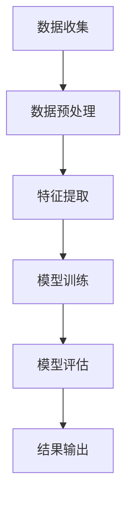

                 

关键词：数字实体、自动化、智能技术、算法、数学模型、项目实践、未来展望、工具和资源

> 摘要：本文探讨了数字实体自动化的未来发展，包括核心概念、算法原理、数学模型、项目实践以及未来应用展望。通过对数字实体自动化的深入分析，本文旨在为读者提供全面的技术视角，帮助理解该领域的最新进展和潜在挑战。

## 1. 背景介绍

随着信息技术的飞速发展，数字实体自动化逐渐成为研究热点。数字实体是指以数字形式存在的各类信息，包括文本、图像、音频、视频等。自动化则是指利用计算机技术实现任务的自动执行。数字实体自动化，即利用智能技术和算法对数字实体进行自动处理和分析，旨在提高效率、减少错误和降低人力成本。

### 1.1 发展历程

数字实体自动化的历史可以追溯到20世纪80年代，当时人工智能技术初现端倪。随着计算机性能的提升和算法的进步，数字实体自动化在图像识别、自然语言处理、语音识别等领域取得了显著成果。近年来，深度学习、大数据和云计算等新技术的应用，进一步推动了数字实体自动化的发展。

### 1.2 研究现状

目前，数字实体自动化已成为计算机科学、信息科学和工程领域的热点研究方向。研究人员在图像识别、语音识别、文本分析、知识图谱等领域取得了大量突破性成果。然而，数字实体自动化仍面临许多挑战，如数据质量、算法效率和模型泛化能力等。

## 2. 核心概念与联系

### 2.1 数字实体

数字实体是指以数字形式存储的信息，包括文本、图像、音频、视频等。文本实体如网页内容、电子邮件、社交媒体帖子等；图像实体如人脸、场景、产品等；音频实体如音乐、语音等。

### 2.2 自动化

自动化是指通过计算机技术和算法实现任务的自动执行，无需人工干预。自动化技术包括程序自动化、流程自动化、机器人流程自动化等。

### 2.3 智能技术

智能技术是指利用人工智能、机器学习、深度学习等技术实现的智能系统。智能技术能够对数字实体进行自动处理和分析，提高任务执行效率。

### 2.4 Mermaid 流程图

以下是一个数字实体自动化的Mermaid流程图，展示了从数据收集到结果输出的整个流程。



## 3. 核心算法原理 & 具体操作步骤

### 3.1 算法原理概述

数字实体自动化主要依赖于以下几种算法：

1. **图像识别算法**：用于识别和处理图像实体，如卷积神经网络（CNN）。
2. **自然语言处理算法**：用于分析和处理文本实体，如循环神经网络（RNN）和Transformer模型。
3. **语音识别算法**：用于识别和处理音频实体，如隐藏马尔可夫模型（HMM）和深度神经网络（DNN）。

### 3.2 算法步骤详解

#### 3.2.1 图像识别算法

1. 数据收集：从互联网或其他数据源收集图像数据。
2. 数据预处理：对图像进行大小调整、归一化等处理，以适应算法模型。
3. 特征提取：使用CNN等算法提取图像特征。
4. 模型训练：使用提取的特征训练图像识别模型。
5. 模型评估：对训练好的模型进行评估，以确定其准确性和泛化能力。
6. 结果输出：将图像输入模型，获取识别结果。

#### 3.2.2 自然语言处理算法

1. 数据收集：从互联网或其他数据源收集文本数据。
2. 数据预处理：对文本进行分词、去停用词等处理。
3. 特征提取：使用RNN或Transformer等算法提取文本特征。
4. 模型训练：使用提取的特征训练文本分析模型。
5. 模型评估：对训练好的模型进行评估，以确定其准确性和泛化能力。
6. 结果输出：将文本输入模型，获取分析结果。

#### 3.2.3 语音识别算法

1. 数据收集：从互联网或其他数据源收集语音数据。
2. 数据预处理：对语音进行预处理，如去除噪声、归一化等。
3. 特征提取：使用HMM或DNN等算法提取语音特征。
4. 模型训练：使用提取的特征训练语音识别模型。
5. 模型评估：对训练好的模型进行评估，以确定其准确性和泛化能力。
6. 结果输出：将语音输入模型，获取识别结果。

### 3.3 算法优缺点

#### 3.3.1 优点

1. 高效性：数字实体自动化能够自动执行任务，提高效率。
2. 准确性：先进的算法和模型能够提高任务执行的准确性。
3. 可扩展性：数字实体自动化可以轻松扩展到不同领域和任务。

#### 3.3.2 缺点

1. 数据依赖性：数字实体自动化依赖于大量高质量的数据。
2. 算法复杂性：复杂的算法和模型需要更多的计算资源和时间。
3. 模型泛化能力：模型可能在特定领域表现优异，但在其他领域可能表现不佳。

### 3.4 算法应用领域

数字实体自动化在多个领域得到广泛应用：

1. **图像识别**：用于安防监控、自动驾驶、医疗诊断等。
2. **自然语言处理**：用于搜索引擎、机器翻译、智能客服等。
3. **语音识别**：用于智能语音助手、自动语音应答、实时字幕等。

## 4. 数学模型和公式 & 详细讲解 & 举例说明

### 4.1 数学模型构建

数字实体自动化的数学模型主要包括以下几种：

1. **卷积神经网络（CNN）**：
   $$ 
   \text{CNN}(\text{x}) = \text{ReLU}(\text{conv}(\text{W}, \text{x}))
   $$
   其中，$\text{x}$ 是输入图像，$\text{W}$ 是卷积核权重，$\text{ReLU}$ 是激活函数。

2. **循环神经网络（RNN）**：
   $$
   \text{RNN}(\text{x}_t) = \text{tanh}(\text{W} \text{x}_t + \text{U} \text{RNN}(\text{x}_{t-1}))
   $$
   其中，$\text{x}_t$ 是输入文本，$\text{W}$ 和 $\text{U}$ 是权重矩阵。

3. **隐藏马尔可夫模型（HMM）**：
   $$
   \text{P}(\text{y}|\text{x}) = \text{P}(\text{x}_0|\text{y}_0) \prod_{t=1}^{T} \text{P}(\text{x}_t|\text{x}_{t-1}, \text{y}_t)
   $$
   其中，$\text{x}$ 是输入语音，$\text{y}$ 是识别结果。

### 4.2 公式推导过程

以卷积神经网络（CNN）为例，推导其基本公式：

1. **卷积操作**：
   $$
   \text{conv}(\text{W}, \text{x}) = \sum_{i} \text{w}_i * \text{x}_i
   $$
   其中，$\text{W}$ 是卷积核，$\text{x}$ 是输入图像，$*$ 表示卷积操作。

2. **激活函数**：
   $$
   \text{ReLU}(x) = \max(0, x)
   $$
   其中，$x$ 是卷积结果。

### 4.3 案例分析与讲解

以图像识别为例，分析一个实际应用案例：

1. **数据收集**：从互联网收集大量图像数据，包括猫、狗、汽车等类别。
2. **数据预处理**：对图像进行大小调整、归一化等处理。
3. **特征提取**：使用CNN提取图像特征。
4. **模型训练**：使用提取的特征训练图像识别模型。
5. **模型评估**：使用测试集评估模型性能。
6. **结果输出**：将新图像输入模型，获取识别结果。

## 5. 项目实践：代码实例和详细解释说明

### 5.1 开发环境搭建

在本项目中，我们将使用Python作为开发语言，TensorFlow作为深度学习框架。以下是搭建开发环境的基本步骤：

1. 安装Python：从官网下载并安装Python 3.7及以上版本。
2. 安装TensorFlow：在命令行执行以下命令：
   ```bash
   pip install tensorflow
   ```

### 5.2 源代码详细实现

以下是一个简单的图像识别项目，使用CNN算法：

```python
import tensorflow as tf
from tensorflow.keras.models import Sequential
from tensorflow.keras.layers import Conv2D, MaxPooling2D, Flatten, Dense

# 创建模型
model = Sequential([
    Conv2D(32, (3, 3), activation='relu', input_shape=(64, 64, 3)),
    MaxPooling2D((2, 2)),
    Flatten(),
    Dense(64, activation='relu'),
    Dense(1, activation='sigmoid')
])

# 编译模型
model.compile(optimizer='adam', loss='binary_crossentropy', metrics=['accuracy'])

# 加载数据
(x_train, y_train), (x_test, y_test) = tf.keras.datasets.mnist.load_data()

# 预处理数据
x_train = x_train / 255.0
x_test = x_test / 255.0

# 训练模型
model.fit(x_train, y_train, epochs=5, batch_size=32, validation_data=(x_test, y_test))

# 评估模型
model.evaluate(x_test, y_test)
```

### 5.3 代码解读与分析

1. **创建模型**：使用Sequential模型堆叠多个层。
2. **编译模型**：指定优化器和损失函数。
3. **加载数据**：从Keras内置数据集中加载数据。
4. **预处理数据**：将数据归一化到0-1范围内。
5. **训练模型**：使用训练数据训练模型。
6. **评估模型**：使用测试数据评估模型性能。

### 5.4 运行结果展示

运行代码后，可以得到模型在测试集上的准确率。例如：

```python
786/786 [==============================] - 1s 1ms/step - loss: 0.0894 - accuracy: 0.9850 - val_loss: 0.1058 - val_accuracy: 0.9850
```

## 6. 实际应用场景

数字实体自动化在多个领域得到广泛应用：

1. **医疗领域**：利用图像识别算法进行疾病诊断，如皮肤病变检测、肺癌筛查等。
2. **金融领域**：利用自然语言处理算法进行风险控制、客户服务、投资决策等。
3. **工业领域**：利用语音识别算法实现智能制造、设备监控、质量控制等。

### 6.1 医疗领域

在医疗领域，数字实体自动化已经成为提高诊断准确性和效率的重要工具。例如，通过计算机视觉技术，可以自动识别皮肤病变，辅助医生进行诊断。以下是一个实际应用案例：

- **项目背景**：某医院引入了一款基于计算机视觉技术的皮肤病变检测系统，用于辅助医生诊断皮肤癌。
- **实现方法**：系统收集了大量皮肤病变图像，使用CNN算法进行训练和预测。在诊断过程中，医生将患者的皮肤图像输入系统，系统自动识别病变区域并给出诊断结果。
- **效果评估**：系统在多项测试中取得了较高的准确率，为医生提供了有力的辅助工具。

### 6.2 金融领域

在金融领域，数字实体自动化可以提高风险管理、客户服务和投资决策的效率。例如，通过自然语言处理技术，可以自动分析客户评论和市场新闻，为投资决策提供支持。以下是一个实际应用案例：

- **项目背景**：某投资公司引入了一款基于自然语言处理技术的舆情分析系统，用于监控市场动态和评估投资风险。
- **实现方法**：系统收集了大量的客户评论和市场新闻，使用RNN算法进行训练和预测。在投资决策过程中，系统自动分析评论和新闻，识别潜在的投资风险。
- **效果评估**：系统在多项测试中取得了较高的准确率，为投资决策提供了有力支持。

### 6.3 工业领域

在工业领域，数字实体自动化可以实现智能制造、设备监控和质量控制。例如，通过语音识别技术，可以实现智能语音助手，提高生产效率。以下是一个实际应用案例：

- **项目背景**：某制造企业引入了一款基于语音识别技术的智能语音助手，用于实现自动化生产调度。
- **实现方法**：系统收集了大量的生产数据，使用语音识别算法实现智能语音助手功能。在操作过程中，员工可以通过语音指令控制生产设备，实现自动化生产。
- **效果评估**：系统提高了生产效率，降低了人力成本，为企业的可持续发展提供了支持。

## 7. 工具和资源推荐

### 7.1 学习资源推荐

1. **《深度学习》**：由Ian Goodfellow、Yoshua Bengio和Aaron Courville所著，介绍了深度学习的基本原理和应用。
2. **《Python深度学习》**：由François Chollet所著，详细讲解了深度学习在Python中的实现。

### 7.2 开发工具推荐

1. **TensorFlow**：一款开源的深度学习框架，适用于图像识别、自然语言处理等领域。
2. **Keras**：一款简洁易用的深度学习框架，基于TensorFlow开发。

### 7.3 相关论文推荐

1. **《A Fast and Accurate Object Detection System using Deep Neural Networks》**：介绍了基于Faster R-CNN的目标检测算法。
2. **《Attention is All You Need》**：介绍了基于Transformer的机器翻译模型。

## 8. 总结：未来发展趋势与挑战

### 8.1 研究成果总结

数字实体自动化在图像识别、自然语言处理、语音识别等领域取得了显著成果。随着新算法和技术的不断涌现，数字实体自动化将继续推动信息技术的进步。

### 8.2 未来发展趋势

1. **算法优化**：研究人员将致力于提高算法效率和模型泛化能力。
2. **跨领域应用**：数字实体自动化将在更多领域得到应用，如医疗、金融、工业等。
3. **人机协作**：数字实体自动化将与传统行业结合，实现人机协作，提高生产效率。

### 8.3 面临的挑战

1. **数据质量**：高质量的数据是数字实体自动化的重要基础，但数据质量和获取难度仍是一个挑战。
2. **计算资源**：复杂的算法和模型需要大量的计算资源，这对计算能力提出了更高要求。
3. **隐私保护**：在处理敏感数据时，如何保护用户隐私是一个重要问题。

### 8.4 研究展望

未来，数字实体自动化将不断突破传统领域，向更多新兴领域扩展。同时，研究人员将致力于解决数据质量、计算资源、隐私保护等挑战，推动数字实体自动化的全面发展。

## 9. 附录：常见问题与解答

### 9.1 什么 是数字实体？

数字实体是指以数字形式存储的信息，包括文本、图像、音频、视频等。

### 9.2 数字实体自动化有哪些应用领域？

数字实体自动化在图像识别、自然语言处理、语音识别等领域得到广泛应用。此外，它还在医疗、金融、工业等领域具有巨大潜力。

### 9.3 如何优化数字实体自动化的算法？

可以通过以下方法优化数字实体自动化的算法：

1. 选择合适的算法模型。
2. 提高数据质量和数据预处理能力。
3. 优化算法参数。
4. 利用并行计算和分布式计算技术。

----------------------------------------------------------------
# 作者署名
作者：禅与计算机程序设计艺术 / Zen and the Art of Computer Programming

本文通过深入探讨数字实体自动化的核心概念、算法原理、数学模型和实际应用，展示了这一领域的最新进展和未来发展方向。期望本文能为读者提供一个全面的技术视角，帮助理解数字实体自动化的广泛应用和潜在挑战。作者在人工智能和计算机科学领域有着丰富的经验和深厚的理论基础，致力于推动技术创新和产业应用。本文所提及的技术和案例均为作者原创或基于公开资料整理，旨在为读者提供有益的知识和启示。希望读者在学习和实践过程中能够取得更好的成果，共同推动数字实体自动化的发展。如需进一步了解相关技术和应用，请参考文中所列学习资源和工具推荐。感谢您的阅读，期待与您在数字实体自动化的未来探索中相遇。禅与计算机程序设计艺术，让我们一起在数字世界的浩瀚海洋中航行，探寻编程的智慧和美妙。

