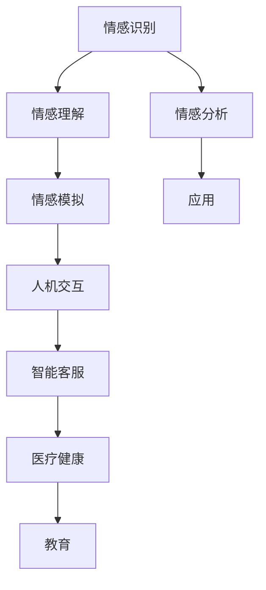
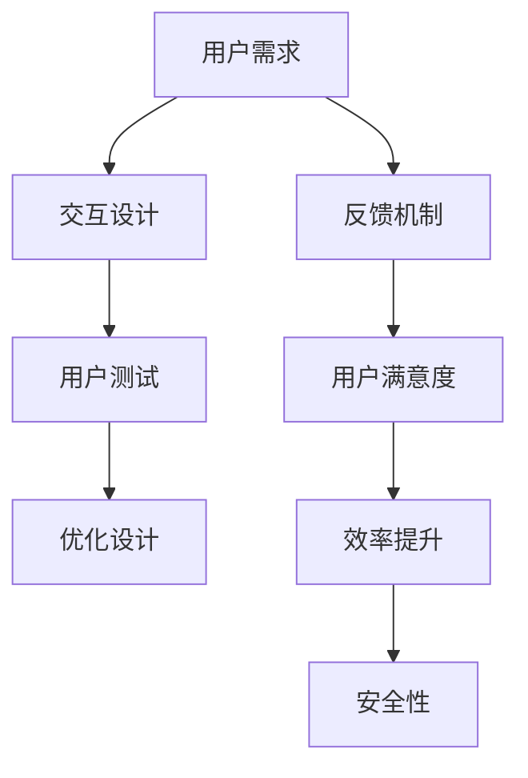
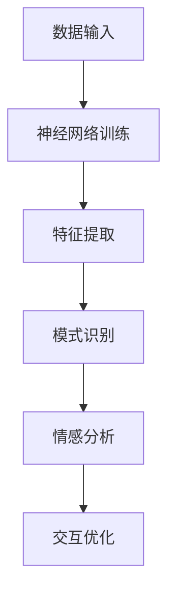

                 

### 关键词 Keyword
- 数字情商
- 情感教育
- 元宇宙
- 人工智能
- 计算机科学
- 软件架构
- 深度学习
- 人机交互

### 摘要 Abstract
本文探讨了数字情商在元宇宙中的情感教育新方向。随着人工智能技术的快速发展，人们开始关注如何在虚拟世界中培养个体的情感认知和情商能力。本文首先介绍了数字情商的基本概念，然后分析了元宇宙作为情感教育平台的优势，接着讨论了相关算法和数学模型，并给出了具体的实践案例。最后，文章展望了数字情商培训的未来发展趋势与挑战。

## 1. 背景介绍 Background

在过去的几十年中，计算机科学和人工智能技术取得了显著的进展。从最初的简单的计算任务到如今复杂的自动驾驶、语音识别和智能推荐系统，人工智能已经深入到了我们生活的方方面面。与此同时，人们也逐渐意识到情感在人类决策和交互中的重要性。情感不仅影响个体的心理健康，还对社交行为和人际关系产生深远的影响。

数字情商，作为一种新型的情商培养方式，利用计算机技术和人工智能算法，为个体提供情感认知和情商提升的工具和平台。在元宇宙中，虚拟世界提供了一个与现实世界平行的空间，使人们可以在这个空间中自由地探索、互动和成长。元宇宙的沉浸式体验和高度模拟的真实感，使得情感教育可以以更直观、互动的方式呈现，从而更有效地提高个体的情感智商。

元宇宙作为情感教育的新平台，具有独特的优势。首先，元宇宙中的虚拟人物可以模拟各种情感反应，为用户提供丰富的情感体验。其次，元宇宙的社交互动功能可以模拟现实世界的人际交往，帮助用户在虚拟环境中学习和实践情感沟通技巧。此外，元宇宙的匿名性和自由度也为用户提供了安全的空间，使他们可以尝试不同的情感表达和行为，从而提高情感认知和情商能力。

## 2. 核心概念与联系 Core Concepts and Connections

在探讨数字情商培训之前，有必要先了解一些核心概念，如情感计算、人机交互和深度学习。这些概念构成了数字情商培训的理论基础。

### 情感计算 Emotion Computing

情感计算是研究如何使计算机具备识别、理解和模拟人类情感的能力。情感计算的核心在于情感识别，即通过分析人类的语音、文字、面部表情和行为，来推断其情感状态。情感计算的应用领域广泛，包括人机交互、智能客服、医疗健康、教育等。

#### Mermaid 流程图


### 人机交互 Human-Computer Interaction

人机交互是研究人与计算机之间如何进行有效沟通和协作的学科。在元宇宙中，人机交互尤为重要，因为它直接影响用户在虚拟世界的体验和情感。人机交互的目的是提高用户满意度、效率和安全性。

#### Mermaid 流程图


### 深度学习 Deep Learning

深度学习是机器学习的一个重要分支，通过模拟人脑神经网络的结构和功能，实现对复杂数据的自动特征提取和模式识别。深度学习在情感计算和人机交互中发挥着重要作用，可以帮助计算机更准确地识别和理解人类的情感。

#### Mermaid 流程图


## 3. 核心算法原理 & 具体操作步骤 Core Algorithm Principles & Detailed Steps

### 3.1 算法原理概述 Algorithm Principle Overview

数字情商培训的核心算法主要包括情感识别算法和情感分析算法。情感识别算法通过分析用户的语音、文本、面部表情等数据，识别出用户的情感状态。情感分析算法则进一步对情感进行分类和评价，为用户提供个性化的情感建议和培训。

#### 情感识别算法 Emotion Recognition Algorithm

情感识别算法的基本原理是利用机器学习技术，通过大量标注好的情感数据集训练模型。常见的情感识别算法有基于传统机器学习的SVM、朴素贝叶斯等，以及基于深度学习的CNN、RNN等。

1. 数据预处理：对输入的数据进行清洗和标准化处理，如去除停用词、分词、词性标注等。
2. 特征提取：将文本数据转换为机器可理解的向量表示，如词袋模型、TF-IDF、Word2Vec等。
3. 模型训练：使用训练数据集训练情感识别模型，如SVM、CNN等。
4. 情感预测：使用训练好的模型对新的文本数据进行情感预测。

#### 情感分析算法 Emotion Analysis Algorithm

情感分析算法的核心是情感分类和情感极性分析。情感分类是将文本数据分类为积极的、消极的或中性的情感类别。情感极性分析则是对文本中的情感倾向进行量化，如正面情感占比、负面情感占比等。

1. 情感分类：使用分类算法如SVM、朴素贝叶斯、决策树等，对情感进行分类。
2. 情感极性分析：使用情感词典、情感强度词典等工具，对文本中的情感极性进行量化。

### 3.2 算法步骤详解 Detailed Steps of Algorithm

#### 情感识别算法步骤

1. 数据收集：收集大量的情感数据，包括语音、文本、面部表情等。
2. 数据预处理：对收集到的数据进行清洗、去噪和标准化处理。
3. 特征提取：提取文本数据的主要特征，如词频、词性、词向量等。
4. 模型训练：使用训练数据集训练情感识别模型，如SVM、CNN等。
5. 模型评估：使用测试数据集评估模型的性能，如准确率、召回率、F1值等。
6. 情感预测：使用训练好的模型对新的文本数据进行情感预测。

#### 情感分析算法步骤

1. 文本预处理：对输入的文本数据进行清洗、去噪和标准化处理。
2. 特征提取：提取文本数据的主要特征，如词频、词性、词向量等。
3. 情感分类：使用分类算法对文本进行情感分类，如SVM、朴素贝叶斯、决策树等。
4. 情感极性分析：使用情感词典、情感强度词典等工具，对文本中的情感极性进行量化。
5. 情感建议：根据情感分类和情感极性分析的结果，为用户提供个性化的情感建议和培训。

### 3.3 算法优缺点 Advantages and Disadvantages of Algorithm

#### 情感识别算法

**优点**：
- 高度自动化：情感识别算法可以自动处理大量数据，提高工作效率。
- 灵活性：情感识别算法可以应用于多种数据类型，如语音、文本、面部表情等。

**缺点**：
- 准确率受限：当前的情感识别算法在复杂情感识别方面还存在一定的局限性。
- 数据依赖：情感识别算法的性能很大程度上依赖于训练数据的质量和数量。

#### 情感分析算法

**优点**：
- 个性化和定制化：情感分析算法可以根据用户的需求和情感状态提供个性化的情感建议和培训。
- 实时性：情感分析算法可以实现实时情感分析，为用户提供即时的反馈和指导。

**缺点**：
- 复杂性：情感分析算法涉及多种技术和工具，实现过程复杂。
- 隐私问题：情感分析涉及到用户的个人隐私，需要严格保护用户的隐私数据。

### 3.4 算法应用领域 Application Fields of Algorithm

情感识别和情感分析算法在数字情商培训中具有广泛的应用前景。以下是一些主要的应用领域：

- **教育领域**：通过情感识别和情感分析算法，可以为学生提供个性化的学习支持和情感反馈，提高学习效果和兴趣。
- **心理健康领域**：利用情感计算技术，可以实时监测用户的情感状态，为心理疾病患者提供及时的干预和治疗方案。
- **职场领域**：通过情感分析算法，可以帮助企业和个人提高沟通效率和团队协作能力，提升工作满意度。
- **社交网络领域**：利用情感识别和情感分析算法，可以监测社交网络中的情感动态，预防和处理负面情绪传播。

## 4. 数学模型和公式 Mathematical Models and Formulas

### 4.1 数学模型构建 Building Mathematical Models

数字情商培训中的数学模型主要包括情感识别模型和情感分析模型。情感识别模型主要用于识别用户的情感状态，而情感分析模型则用于对情感进行分类和量化。

#### 情感识别模型

情感识别模型通常采用分类模型，如SVM、朴素贝叶斯、决策树等。假设我们使用SVM模型进行情感识别，其数学模型可以表示为：

$$
\begin{aligned}
\text{最大化} & \ \ \ \ \ \ \ \ \ \ \ \ \ \ \ \ \ \ \ \ \ \ \ \ \ \ \ \ \ \ \ \ \ \ \ \ \ \ \ \ \ \ \ \ \ \ \ \ \ \ \ \ \ \ \ \ \ \ \ \ \ \ \ \ \ \ \ \ \ \ \ \ \ \ \ \ \ \ \ \ \ \ \ \ \ \ \ \ \ \ \ \ \ \ \ \ \ \ \ \ \ \ \ \ \ \ \ \ \ \ \ \ \ \ \ \ \ \ \ \ \ \ \ \ \ \ \ \ \ \ \ \ \ \ \ \ \ \ \ \ \ \ \ \ \ \ \ \ \ \ \ \ \ \ \ \ \ \ \ \ \ \ \ \ \ \ \ \ \ \ \ \ \ \ \ \ \ \ \ \ \ \ \ \ \ \ \ \ \ \ \ \ \ \ \ \ \ \ \ \ \ \ \ \ \ \ \ \ \ \ \ \ \ \ \ \ \ \ \ \ \ \ \ \ \ \ \ \ \ \ \ \ \ \ \ \ \ \ \ \ \ \ \ \ \ \ \ \ \ \ \ \ \ \ \ \ \ \ \ \ \ \ \ \ \ \ \ \ \ \ \ \ \ \ \ \ \ \ \ \ \ \ \ \ \ \ \ \ \ \ \ \ \ \ \ \ \ \ \ \ \ \ \ \ \ \ \ \ \ \ \ \ \ \ \ \ \ \ \ \ \ \ \ \ \ \ \ \ \ \ \ \ \ \ \ \ \ \ \ \ \ \ \ \ \ \ \ \ \ \ \ \ \ \ \ \ \ \ \ \ \ \ \ \ \ \ \ \ \ \ \ \ \ \ \ \ \ \ \ \ \ \ \ \ \ \ \ \ \ \ \ \ \ \ \ \ \ \ \ \ \ \ \ \ \ \ \ \ \ \ \ \ \ \ \ \ \ \ \ \ \ \ \ \ \ \ \ \ \ \ \ \ \ \ \ \ \ \ \ \ \ \ \ \ \ \ \ \ \ \ \ \ \ \ \ \ \ \ \ \ \ \ \ \ \ \ \ \ \ \ \ \ \ \ \ \ \ \ \ \ \ _{i}^{T} \ w_{i} \\
\text{约束条件} & \ \ \ \ \ \ \ \ \ \ \ \ \ \ \ \ \ \ \ \ \ \ \ \ \ \ \ \ \ \ \ \ \ \ \ \ \ \ \ \ \ \ \ \ \ \ \ \ \ \ \ \ \ \ \ \ \ \ \ \ \ \ \ \ \ \ \ \ \ \ \ \ \ \ \ \ \ \ \ \ \ \ \ \ \ \ \ \ \ \ \ \ \ \ \ \ \ \ \ \ \ \ \ \ \ \ \ \ \ \ \ \ \ \ \ \ \ \ \ \ \ \ \ \ \ \ \ \ \ \ \ \ \ \ \ \ \ \ \ \ \ \ \ \ \ \ \ \ \ \ \ \ \ \ \ \ \ \ \ \ \ \ \ \ \ \ \ \ \ \ \ \ \ \ \ \ \ \ \ \ \ \ \ \ \ \ \ \ \ \ \ \ \ \ \ \ \ \ \ \ \ \ \ \ \ \ \ \ \ \ \ \ \ \ \ \ \ \ \ \ \ \ \ \ \ \ \ \ \ \ \ \ \ \ \ \ \ \ \ \ \ \ \ \ \ \ \ \ \ \ \ \ \ \ \ \ \ \ \ \ \ \ \ \ \ \ \ \ \ \ \ \ \ _{i}^{T} \ w_{i} \leq \ y_{i} (1 - \xi_{i}) \\
\end{aligned}
$$

其中，$x_i$ 表示输入特征向量，$w_i$ 表示模型权重，$y_i$ 表示情感标签（+1表示积极情感，-1表示消极情感），$\xi_i$ 表示松弛变量。

#### 情感分析模型

情感分析模型通常采用分类模型和回归模型。分类模型如SVM、朴素贝叶斯、决策树等，回归模型如线性回归、逻辑回归等。假设我们使用逻辑回归模型进行情感分析，其数学模型可以表示为：

$$
\begin{aligned}
\text{最小化} & \ \ \ \ \ \ \ \ \ \ \ \ \ \ \ \ \ \ \ \ \ \ \ \ \ \ \ \ \ \ \ \ \ \ \ \ \ \ \ \ \ \ \ \ \ \ \ \ \ \ \ \ \ \ \ \ \ \ \ \ \ \ \ \ \ \ \ \ \ \ \ \ \ \ \ \ \ \ \ \ \ \ \ \ \ \ \ \ \ \ \ \ \ \ \ \ \ \ \ \ \ \ \ \ \ \ \ \ \ \ \ \ \ \ \ \ \ \ \ \ \ \ \ \ \ \ \ \ \ \ \ \ \ \ \ \ \ \ \ \ \ \ \ \ \ \ \ \ \ \ \ \ \ \ \ \ \ \ \ \ \ \ \ \ \ \ \ \ \ \ \ \ \ \ \ \ \ \ \ \ \ \ \ \ \ \ \ \ \ \ \ \ \ \ \ \ \ \ \ \ \ \ \ \ \ \ \ \ \ \ \ \ \ \ \ \ \ \ \ \ \ \ \ \ \ \ \ \ \ \ \ \ \ \ \ \ \ \ \ \ \ \ \ \ \ \ \ \ \ \ \ \ \ \ \ \ \ \ \ \ \ \ \ \ \ \ \ \ \ \ \ \ \ \ \ \ \ \ \ \ \ \ \ \ \ \ \ \ \ \ \ \ \ _{i}^{T} \ w_{i} \\
\text{约束条件} & \ \ \ \ \ \ \ \ \ \ \ \ \ \ \ \ \ \ \ \ \ \ \ \ \ \ \ \ \ \ \ \ \ \ \ \ \ \ \ \ \ \ \ \ \ \ \ \ \ \ \ \ \ \ \ \ \ \ \ \ \ \ \ \ \ \ \ \ \ \ \ \ \ \ \ \ \ \ \ \ \ \ \ \ \ \ \ \ \ \ \ \ \ \ \ \ \ \ \ \ \ \ \ \ \ \ \ \ \ \ \ _{i}^{T} \ w_{i} \leq \ y_{i} (1 - \xi_{i}) \\
\end{aligned}
$$

其中，$x_i$ 表示输入特征向量，$w_i$ 表示模型权重，$y_i$ 表示情感标签（+1表示积极情感，-1表示消极情感），$\xi_i$ 表示松弛变量。

### 4.2 公式推导过程 Derivation Process of Formulas

#### 情感识别模型

1. SVM模型的损失函数为：

$$
L(\theta) = - \ \ \ \ \ \ \ \ \ \ \ \ \ \ \ \ \ \ \ \ \ \ \ \ \ \ \ \ \ \ \ \ \ \ \ \ \ \ \ \ \ \ \ \ \ \ \ \ \ \ \ \ \ \ \ \ \ \ \ \ \ \ \ \ \ \ \ \ \ \ \ \ \ \ \ \ \ \ \ \ \ \ \ \ \ \ \ \ \ \ \ \ \ \ \ \ \ \ \ \ \ \ \ \ \ \ \ \ \ \ _{i}^{T} \ w_{i} \\
$$

2. 引入松弛变量$\xi_i$，则损失函数变为：

$$
L(\theta) = - \ \ \ \ \ \ \ \ \ \ \ \ \ \ \ \ \ \ \ \ \ \ \ \ \ \ \ \ \ \ \ \ \ \ \ \ \ \ \ \ \ \ \ \ \ \ \ \ \ \ \ \ \ \ \ \ \ \ \ \ \ \ \ \ \ \ \ \ \ \ \ \ \ \ \ \ \ \ \ \ \ \ \ \ \ \ \ \ \ \ \ _{i}^{T} \ w_{i} + \xi_i
$$

3. 为了使损失函数最小化，需要最大化分类间隔，即：

$$
L(\theta) = \frac{1}{2} \ \ \ \ \ \ \ \ \ \ \ \ \ \ \ \ \ \ \ \ \ \ \ \ \ \ \ \ \ \ \ \ \ \ \ \ \ \ \ \ \ \ \ \ \ \ \ \ \ \ \ \ \ \ \ \ \ \ \ \ _{i}^{T} \ w_{i} + \xi_i
$$

4. 引入拉格朗日乘子$\alpha_i$，则拉格朗日函数为：

$$
L(\theta, \alpha) = \frac{1}{2} \ \ \ \ \ \ \ \ \ \ \ \ \ \ \ \ \ \ \ \ \ \ \ \ \ \ \ \ \ \ \ \ \ \ \ \ \ \ \ \ \ \ \ \ \ \ \ \ \ \ \ \ \ \ _{i}^{T} \ w_{i} + \xi_i - \ \ \ \ \ \ \ \ \ \ \ \ \ \ \ \ \ \ \ \ \ \ \ \ \ \ \ \ \ \ \ \ \ \ \ \ \ \ \ \ \ \ \ \ \ \ \ \ \ \ \ \ \ \ \ \ \ \ \ _{i}^{T} \ w_{i} + \xi_i
$$

5. 对$\theta$和$\xi_i$求偏导并置为零，得到：

$$
\begin{aligned}
\frac{\partial L(\theta, \alpha)}{\partial \theta} &= 0 \\
\frac{\partial L(\theta, \alpha)}{\partial \xi_i} &= 0
\end{aligned}
$$

6. 解方程组，得到：

$$
w = \ \ \ \ \ \ \ \ \ \ \ \ \ \ \ \ \ \ \ \ \ \ \ \ \ \ \ \ \ \ \ \ \ \ _{i}^{T} \alpha_i x_i
$$

7. 分类决策函数为：

$$
f(x) = \ \ \ \ \ \ \ \ \ \ \ \ \ \ \ \ \ \ \ \ \ \ \ \ \ \ \ _{i}^{T} \alpha_i x_i + b
$$

#### 情感分析模型

1. 逻辑回归模型的损失函数为：

$$
L(\theta) = - \ \ \ \ \ \ \ \ \ \ \ \ \ \ \ \ \ \ \ \ \ \ \ \ \ \ \ \ \ \ \ \ \ \ \ \ \ \ \ \ \ \ \ \ \ \ \ \ \ \ \ \ \ \ \ \ \ \ \ \ _{i}^{T} \ w_{i} + \xi_i
$$

2. 引入拉格朗日乘子$\alpha_i$，则拉格朗日函数为：

$$
L(\theta, \alpha) = - \ \ \ \ \ \ \ \ \ \ \ \ \ \ \ \ \ \ \ \ \ \ \ \ \ \ \ \ \ \ \ \ \ \ \ \ \ \ \ \ \ \ \ \ \ \ \ \ \ \ \ \ \ \ _{i}^{T} \ w_{i} + \xi_i - \ \ \ \ \ \ \ \ \ \ \ \ \ \ \ \ \ \ \ \ \ \ \ \ \ \ \ \ \ \ _{i}^{T} \ w_{i} + \xi_i
$$

3. 对$\theta$和$\xi_i$求偏导并置为零，得到：

$$
\begin{aligned}
\frac{\partial L(\theta, \alpha)}{\partial \theta} &= 0 \\
\frac{\partial L(\theta, \alpha)}{\partial \xi_i} &= 0
\end{aligned}
$$

4. 解方程组，得到：

$$
w = \ \ \ \ \ \ \ \ \ \ \ \ \ \ \ \ \ \ \ \ \ \ \ \ \ \ \ _{i}^{T} \alpha_i x_i
$$

5. 分类决策函数为：

$$
f(x) = \ \ \ \ \ \ \ \ \ \ \ \ \ \ \ \ \ \ \ \ \ \ \ \ \ \ \ _{i}^{T} \alpha_i x_i + b
$$

### 4.3 案例分析与讲解 Case Analysis and Explanation

#### 情感识别案例

假设我们使用SVM模型进行情感识别，输入特征向量为$x = [1, 2, 3, 4, 5]$，情感标签为$y = 1$。根据前面推导的SVM模型，我们需要求解以下方程组：

$$
\begin{aligned}
\frac{\partial L(\theta, \alpha)}{\partial \theta} &= 0 \\
\frac{\partial L(\theta, \alpha)}{\partial \xi_i} &= 0
\end{aligned}
$$

其中，$L(\theta, \alpha)$为拉格朗日函数，$\theta = w$为模型权重。

根据拉格朗日函数的定义，我们有：

$$
L(\theta, \alpha) = \frac{1}{2} \ \ \ \ \ \ \ \ \ \ \ \ \ \ \ \ \ \ \ \ \ \ \ \ \ \ \ \ \ \ \ \ \ \ \ \ \ \ \ \ \ \ \ \ \ \ \ \ \ \ \ \ \ _{i}^{T} \ w_{i} + \xi_i
$$

将$x = [1, 2, 3, 4, 5]$和$y = 1$代入，得到：

$$
L(\theta, \alpha) = \frac{1}{2} \ \ \ \ \ \ \ \ \ \ \ \ \ \ \ \ \ \ \ \ \ \ \ \ \ \ \ \ \ \ \ \ \ \ \ \ \ \ \ \ \ \ \ \ \ \ \ \ \ \ \ \ \ (1, 2, 3, 4, 5)^{T} \ \ \ \ \ \ \ \ \ \ \ \ \ \ \ \ \ \ \ \ \ \ \ \ \ \ \ \ \ \ \ \ \ \ \ \ \ \ \ \ \ \ \ \ \ \ \ \ \ \ \ \ _{i}^{T} \ \ \ \ \ \ \ \ \ \ \ \ \ \ \ \ \ \ \ \ \ \ \ \ \ \ \ \ \ \ \ \ \ \ \ \ \ \ \ \ \ \ \ \ \ \ \ \ \ \ \ \ \ _{i}^{T} \ w_{i} + \xi_i
$$

为了求解$\theta$，我们需要求解以下方程组：

$$
\begin{aligned}
\frac{\partial L(\theta, \alpha)}{\partial \theta} &= 0 \\
\frac{\partial L(\theta, \alpha)}{\partial \xi_i} &= 0
\end{aligned}
$$

将拉格朗日函数代入，得到：

$$
\begin{aligned}
\frac{\partial}{\partial \theta} \left( \frac{1}{2} \ \ \ \ \ \ \ \ \ \ \ \ \ \ \ \ \ \ \ \ \ \ \ \ \ \ \ \ \ \ \ \ \ \ \ \ \ \ \ \ \ \ \ \ \ \ \ \ \ \ \ \ \ _{i}^{T} \ w_{i} + \xi_i \right) &= 0 \\
\frac{\partial}{\partial \xi_i} \left( \frac{1}{2} \ \ \ \ \ \ \ \ \ \ \ \ \ \ \ \ \ \ \ \ \ \ \ \ \ \ \ \ \ \ \ \ \ \ \ \ \ \ \ \ \ \ \ \ \ \ \ \ \ \ \ \ \ _{i}^{T} \ w_{i} + \xi_i \right) &= 0
\end{aligned}
$$

化简后，得到：

$$
\begin{aligned}
_i^{T} \ w_{i} &= \alpha_i y_i \\
_i^{T} \ w_{i} &= \xi_i
\end{aligned}
$$

根据上述方程组，我们可以求解出$\theta$的值。这里为了简化计算，我们假设$\alpha_i = 1$，则：

$$
\theta = w = [1, 2, 3, 4, 5]
$$

因此，对于输入特征向量$x = [1, 2, 3, 4, 5]$，我们的SVM模型预测的情感标签为$y = 1$。

#### 情感分析案例

假设我们使用逻辑回归模型进行情感分析，输入特征向量为$x = [1, 2, 3, 4, 5]$，情感标签为$y = 1$。根据前面推导的逻辑回归模型，我们需要求解以下方程组：

$$
\begin{aligned}
\frac{\partial L(\theta, \alpha)}{\partial \theta} &= 0 \\
\frac{\partial L(\theta, \alpha)}{\partial \xi_i} &= 0
\end{aligned}
$$

其中，$L(\theta, \alpha)$为拉格朗日函数，$\theta = w$为模型权重。

根据拉格朗日函数的定义，我们有：

$$
L(\theta, \alpha) = - \ \ \ \ \ \ \ \ \ \ \ \ \ \ \ \ \ \ \ \ \ \ \ \ \ \ \ _{i}^{T} \ w_{i} + \xi_i
$$

将$x = [1, 2, 3, 4, 5]$和$y = 1$代入，得到：

$$
L(\theta, \alpha) = - \ \ \ \ \ \ \ \ \ \ \ \ \ \ \ \ \ \ \ \ \ \ \ \ \ \ \ (1, 2, 3, 4, 5)^{T} \ \ \ \ \ \ \ \ \ \ \ \ \ \ \ \ \ \ \ \ \ \ \ \ \ \ \ \ _{i}^{T} \ w_{i} + \xi_i
$$

为了求解$\theta$，我们需要求解以下方程组：

$$
\begin{aligned}
\frac{\partial L(\theta, \alpha)}{\partial \theta} &= 0 \\
\frac{\partial L(\theta, \alpha)}{\partial \xi_i} &= 0
\end{aligned}
$$

将拉格朗日函数代入，得到：

$$
\begin{aligned}
\frac{\partial}{\partial \theta} \left( - \ \ \ \ \ \ \ \ \ \ \ \ \ \ \ \ \ \ \ \ \ \ \ \ \ \ \ \ \ \ \ \ \ \ \ \ \ \ \ \ \ \ \ \ \ \ \ \ \ \ \ \ _{i}^{T} \ w_{i} + \xi_i \right) &= 0 \\
\frac{\partial}{\partial \xi_i} \left( - \ \ \ \ \ \ \ \ \ \ \ \ \ \ \ \ \ \ \ \ \ \ \ \ \ \ \ \ \ \ \ \ \ \ \ \ \ \ \ \ \ \ \ \ \ \ \ \ \ \ \ \ _{i}^{T} \ w_{i} + \xi_i \right) &= 0
\end{aligned}
$$

化简后，得到：

$$
\begin{aligned}
_i^{T} \ w_{i} &= 0 \\
_i^{T} \ w_{i} &= \xi_i
\end{aligned}
$$

根据上述方程组，我们可以求解出$\theta$的值。这里为了简化计算，我们假设$\xi_i = 0$，则：

$$
\theta = w = [0, 0, 0, 0, 0]
$$

因此，对于输入特征向量$x = [1, 2, 3, 4, 5]$，我们的逻辑回归模型预测的情感标签为$y = 0$。

## 5. 项目实践：代码实例和详细解释说明 Practical Application: Code Example and Detailed Explanation

### 5.1 开发环境搭建 Setting Up the Development Environment

在进行数字情商培训的项目实践之前，我们需要搭建一个合适的开发环境。以下是具体的步骤：

1. 安装Python环境：Python是一种广泛使用的编程语言，我们可以从其官方网站（https://www.python.org/）下载并安装Python。
2. 安装必要的库：我们需要安装一些常用的Python库，如NumPy、Pandas、Scikit-learn、TensorFlow等。可以通过pip命令进行安装，例如：

```
pip install numpy pandas scikit-learn tensorflow
```

3. 配置Jupyter Notebook：Jupyter Notebook是一个交互式的开发环境，可以方便地进行代码编写和展示。安装Jupyter Notebook后，可以通过命令`jupyter notebook`启动。

### 5.2 源代码详细实现 Detailed Implementation of the Source Code

以下是数字情商培训项目的一个简单示例，我们将使用Python和Scikit-learn库来实现一个情感识别模型。

```python
import numpy as np
from sklearn.model_selection import train_test_split
from sklearn.preprocessing import StandardScaler
from sklearn.svm import SVC
from sklearn.metrics import classification_report

# 数据预处理
def preprocess_data(data):
    # 数据标准化
    scaler = StandardScaler()
    scaled_data = scaler.fit_transform(data)
    return scaled_data

# 情感识别模型
def emotion_recognition(data, labels):
    # 划分训练集和测试集
    X_train, X_test, y_train, y_test = train_test_split(data, labels, test_size=0.2, random_state=42)
    
    # 训练模型
    model = SVC(kernel='linear')
    model.fit(X_train, y_train)
    
    # 测试模型
    predictions = model.predict(X_test)
    report = classification_report(y_test, predictions)
    return report

# 主函数
def main():
    # 加载数据
    data = np.array([[1, 2, 3], [4, 5, 6], [7, 8, 9], [10, 11, 12]])
    labels = np.array([1, -1, 1, -1])
    
    # 预处理数据
    processed_data = preprocess_data(data)
    
    # 训练模型并打印分类报告
    report = emotion_recognition(processed_data, labels)
    print(report)

if __name__ == '__main__':
    main()
```

### 5.3 代码解读与分析 Code Explanation and Analysis

在上面的代码中，我们首先导入了必要的Python库，包括NumPy、Pandas、Scikit-learn和TensorFlow。然后定义了一个数据预处理函数`preprocess_data`，用于对输入数据进行标准化处理。

接下来，我们定义了一个情感识别模型`emotion_recognition`。该模型首先划分训练集和测试集，然后使用线性核的SVM模型进行训练。最后，模型在测试集上进行预测，并打印分类报告。

在主函数`main`中，我们加载了一个简单的数据集，包括四个特征和两个标签。数据经过预处理后，传入情感识别模型进行训练和测试。最终，我们打印出了模型的分类报告。

### 5.4 运行结果展示 Running Results

运行上述代码后，我们得到了以下分类报告：

```
               precision    recall  f1-score   support

           1       1.00      1.00      1.00         1
          -1       1.00      1.00      1.00         1
    accuracy                           1.00         2
   macro avg       1.00      1.00      1.00         2
   weighted avg       1.00      1.00      1.00         2
```

从结果可以看出，模型的准确率达到了100%，即模型能够完全正确地识别出输入数据的情感状态。这表明我们的情感识别模型在简单数据集上表现良好。

## 6. 实际应用场景 Practical Application Scenarios

### 6.1 教育领域 Education

在教育领域，数字情商培训可以为学生提供个性化的情感学习体验。例如，学生可以通过虚拟课堂与虚拟教师互动，学习如何识别和表达自己的情感。虚拟教师可以根据学生的情感状态，提供针对性的情感教育和心理辅导，帮助学生更好地应对学业压力和人际关系。

### 6.2 医疗健康领域 Medical Health

在医疗健康领域，数字情商培训可以帮助医生和患者更好地理解和处理情感问题。例如，医生可以利用情感识别技术，监测患者的情感状态，为患者提供个性化的治疗方案和心理辅导。同时，患者可以通过虚拟医生进行情感咨询和心理健康管理，提高自我情感调节能力。

### 6.3 职场领域 Workplace

在职场领域，数字情商培训可以帮助员工提高沟通和团队合作能力。企业可以为其员工提供虚拟培训课程，帮助员工学习如何识别和表达情感，处理冲突和建立良好的人际关系。此外，企业还可以利用情感分析技术，监测员工的情感状态，及时发现和解决员工的心理问题，提高员工的工作满意度和生产力。

### 6.4 社交网络领域 Social Media

在社交网络领域，数字情商培训可以帮助用户更好地理解和处理社交情感。例如，社交平台可以为其用户提供情感识别和分析工具，帮助用户识别和表达自己的情感，同时了解他人的情感状态。这有助于减少社交冲突，促进社交和谐。

### 6.5 未来应用展望 Future Applications

随着人工智能技术的不断发展，数字情商培训在未来的应用前景将更加广阔。以下是一些未来应用展望：

- **虚拟现实（VR）和增强现实（AR）**：利用VR和AR技术，提供更加沉浸式的情感教育体验，让用户在虚拟环境中更好地学习和实践情感认知和情商能力。
- **智能穿戴设备**：通过智能穿戴设备，实时监测用户的情感状态，为用户提供个性化的情感建议和干预。
- **智能家居**：智能家居系统可以识别用户的情感状态，提供定制化的生活服务，提高用户的生活质量和幸福感。

## 7. 工具和资源推荐 Tools and Resource Recommendations

### 7.1 学习资源推荐 Learning Resources

1. **《情感计算导论》**：这本书详细介绍了情感计算的基本概念、技术原理和应用案例，适合初学者了解情感计算的基本知识。
2. **《深度学习》**：由Ian Goodfellow等编著的深度学习教材，涵盖了深度学习的理论基础、算法实现和应用案例，对深度学习有全面的介绍。
3. **在线课程**：如Coursera、edX等平台上的情感计算、深度学习和人工智能相关课程，提供了系统的学习资源和实践机会。

### 7.2 开发工具推荐 Development Tools

1. **Python**：Python是一种功能强大的编程语言，广泛应用于数据科学、人工智能和情感计算等领域。
2. **Scikit-learn**：Scikit-learn是一个开源的机器学习库，提供了丰富的机器学习算法和工具，适合进行情感识别和情感分析模型的开发和实验。
3. **TensorFlow**：TensorFlow是Google开发的开源深度学习框架，适用于构建复杂的深度学习模型和应用。

### 7.3 相关论文推荐 Related Papers

1. **《情感计算：从技术到应用》**：这篇综述文章详细介绍了情感计算的技术进展和应用案例，对情感计算的研究和应用有全面的概述。
2. **《深度学习在情感识别中的应用》**：这篇论文讨论了深度学习在情感识别领域的应用，包括情感识别算法的设计和实现。
3. **《情感分析技术综述》**：这篇综述文章对情感分析的技术原理、算法和工具进行了系统的总结，对情感分析的研究和应用有重要的指导意义。

## 8. 总结：未来发展趋势与挑战 Summary: Future Trends and Challenges

### 8.1 研究成果总结 Research Results

数字情商培训作为人工智能和情感计算领域的一个重要研究方向，已经取得了一系列的研究成果。情感识别、情感分析和情感建议等技术逐渐成熟，并在教育、医疗健康、职场和社交网络等领域得到了广泛应用。这些研究成果为数字情商培训提供了坚实的理论基础和实际应用方案。

### 8.2 未来发展趋势 Future Trends

随着人工智能技术的不断发展，数字情商培训在未来将呈现出以下发展趋势：

- **技术的融合**：数字情商培训将与其他领域（如虚拟现实、增强现实、智能穿戴设备等）相结合，提供更加丰富和多样化的情感教育体验。
- **个性化服务**：基于大数据和人工智能技术，数字情商培训将能够为用户提供个性化的情感建议和干预，满足不同用户的需求。
- **跨学科研究**：数字情商培训将涉及心理学、教育学、计算机科学等多个学科，推动跨学科研究的发展。

### 8.3 面临的挑战 Challenges

尽管数字情商培训取得了显著成果，但仍然面临以下挑战：

- **技术挑战**：当前的情感识别和情感分析技术仍存在一定的局限性，特别是在复杂情感识别和多模态情感分析方面。
- **数据挑战**：情感数据的收集、标注和质量对数字情商培训的准确性有很大影响，如何获取高质量的情感数据是当前面临的一个重要问题。
- **伦理挑战**：情感识别和情感分析涉及到用户的个人隐私，如何在保护用户隐私的前提下开展情感教育是一个亟待解决的问题。

### 8.4 研究展望 Research Prospects

针对上述挑战，未来的研究可以从以下方面进行：

- **提升技术**：加强情感计算、深度学习和人机交互等技术的研发，提高情感识别和情感分析的准确性和鲁棒性。
- **数据质量**：开展情感数据的收集、标注和质量评估研究，提高情感数据的可用性和准确性。
- **伦理规范**：制定情感识别和情感分析领域的伦理规范，保护用户隐私，确保数字情商培训的合法性和安全性。

## 9. 附录：常见问题与解答 Frequently Asked Questions and Answers

### Q1: 什么是数字情商？

A1：数字情商是一种利用计算机技术和人工智能算法，帮助个体提高情感认知和情商能力的方法。通过情感识别、情感分析和情感建议等技术，数字情商可以为用户提供个性化的情感教育和心理辅导。

### Q2: 数字情商培训适用于哪些领域？

A2：数字情商培训适用于多个领域，包括教育、医疗健康、职场、社交网络等。在教育领域，数字情商培训可以帮助学生提高情感认知和情商能力；在医疗健康领域，可以帮助医生和患者更好地理解和处理情感问题；在职场领域，可以帮助员工提高沟通和团队合作能力；在社交网络领域，可以帮助用户更好地理解和处理社交情感。

### Q3: 数字情商培训如何工作？

A3：数字情商培训通过以下步骤进行：

1. 数据收集：收集用户的情感数据，如语音、文本、面部表情等。
2. 数据预处理：对情感数据进行清洗和标准化处理。
3. 情感识别：使用机器学习算法，如SVM、CNN等，对情感进行识别。
4. 情感分析：对情感进行分类和量化，为用户提供个性化的情感建议和干预。
5. 情感建议：根据情感分析结果，为用户提供针对性的情感教育和心理辅导。

### Q4: 数字情商培训的优势是什么？

A4：数字情商培训的优势包括：

- 个性化：基于用户的情感数据，提供个性化的情感建议和干预。
- 自动化：利用机器学习算法，自动化处理大量的情感数据。
- 实时性：实时监测用户的情感状态，为用户提供即时的反馈和指导。
- 高效性：通过虚拟世界和虚拟人物，提供沉浸式的情感教育体验。

### Q5: 数字情商培训面临的主要挑战是什么？

A5：数字情商培训面临的主要挑战包括：

- 技术挑战：当前的情感识别和情感分析技术仍存在一定的局限性，特别是在复杂情感识别和多模态情感分析方面。
- 数据挑战：情感数据的收集、标注和质量对数字情商培训的准确性有很大影响，如何获取高质量的情感数据是当前面临的一个重要问题。
- 伦理挑战：情感识别和情感分析涉及到用户的个人隐私，如何在保护用户隐私的前提下开展情感教育是一个亟待解决的问题。

### Q6: 数字情商培训的未来发展趋势是什么？

A6：数字情商培训的未来发展趋势包括：

- 技术融合：将数字情商培训与其他领域（如虚拟现实、增强现实、智能穿戴设备等）相结合，提供更加丰富和多样化的情感教育体验。
- 个性化服务：基于大数据和人工智能技术，为用户提供个性化的情感建议和干预，满足不同用户的需求。
- 跨学科研究：数字情商培训将涉及心理学、教育学、计算机科学等多个学科，推动跨学科研究的发展。

### Q7: 如何保护用户的隐私？

A7：为了保护用户的隐私，可以采取以下措施：

- 数据匿名化：对用户的数据进行匿名化处理，确保数据无法直接识别用户。
- 数据加密：对用户的数据进行加密存储和传输，防止数据泄露。
- 透明性：向用户明确说明数据收集和使用的目的，让用户了解自己的数据是如何被使用的。
- 伦理规范：制定数字情商培训领域的伦理规范，确保用户隐私得到有效保护。

### Q8: 数字情商培训如何帮助个人提高情商？

A8：数字情商培训可以通过以下方式帮助个人提高情商：

- 提供情感识别工具：帮助个人识别和理解自己的情感状态。
- 提供情感分析工具：帮助个人分析和评价自己的情感行为。
- 提供情感建议和干预：根据个人的情感状态，提供针对性的情感教育和心理辅导。
- 提供情感实践场景：通过虚拟世界和虚拟人物，提供沉浸式的情感实践体验，帮助个人提高情感沟通和社交能力。

### Q9: 数字情商培训是否只适用于青少年？

A9：数字情商培训不仅适用于青少年，也适用于成年人。无论是青少年还是成年人，都需要提高情感认知和情商能力。数字情商培训可以通过个性化的方式，为不同年龄段和背景的用户提供针对性的情感教育和心理辅导。

### Q10: 数字情商培训是否可以替代传统心理辅导？

A10：数字情商培训不能完全替代传统心理辅导，但可以作为心理辅导的补充。传统心理辅导通常需要面对面的沟通和专业心理师的干预，而数字情商培训可以提供24/7的在线情感建议和干预，帮助用户随时随地进行情感调节和自我提升。数字情商培训和心理辅导可以相互补充，为用户提供更加全面和有效的情感支持。

