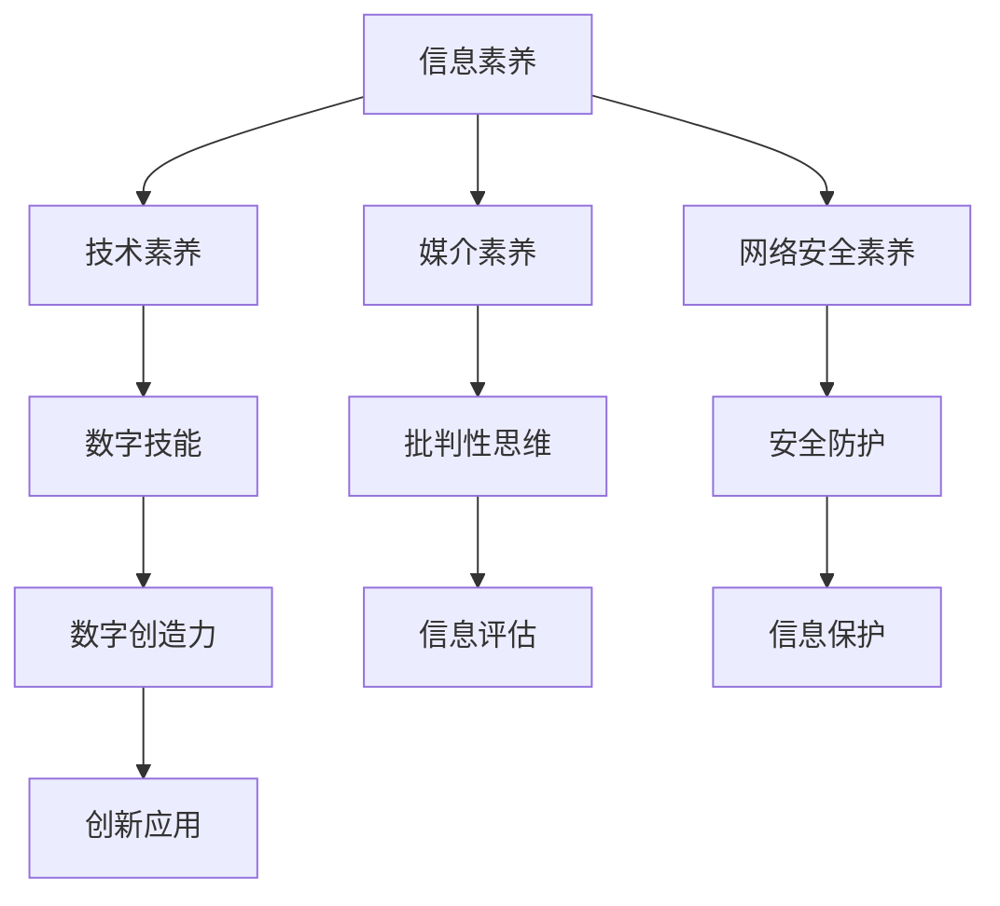

                 

关键词：数字素养、公民参与、技术能力、信息素养、互联网社会、数字化转型、未来教育。

> 摘要：在数字化时代，数字素养已经成为公民参与社会的重要基石。本文将从数字素养的定义、重要性、核心要素以及提升策略等多个方面展开探讨，旨在为公民参与数字化社会提供指导。

## 1. 背景介绍

随着信息技术的飞速发展，互联网已经成为人们生活、工作和学习的重要工具。数字素养，即数字时代所需的基本能力，越来越受到重视。数字素养不仅关乎个人的生活质量，也影响着社会的整体进步。因此，培养公民的数字素养已经成为各国政府和社会组织关注的焦点。

### 数字素养的定义

数字素养是指个体在数字环境中获取、理解、评估、创造和交流信息的能力。它包括以下几个方面：

1. **信息素养**：理解信息的重要性和可信度，并能够有效地获取、评估和使用信息。
2. **技术素养**：掌握和使用数字工具，如计算机、智能手机和网络技术。
3. **媒介素养**：理解媒介如何影响信息传播和受众感知，以及如何批判性地分析和解读媒介内容。
4. **网络安全素养**：了解网络安全的基本知识，能够保护个人信息和数字设备的安全。

### 数字素养的重要性

数字素养的重要性体现在以下几个方面：

1. **社会参与**：具备数字素养的个体能够更好地参与社会和经济活动，享受数字化带来的便利。
2. **教育和就业**：数字素养是现代教育和就业的基本要求，它帮助人们适应不断变化的职场环境。
3. **公民权利**：数字素养有助于公民行使言论自由、知情权和参与公共事务的权利。
4. **社会创新**：数字素养能够激发社会创新，推动数字化社会的发展。

## 2. 核心概念与联系

为了更好地理解数字素养，我们首先需要了解其核心概念和各要素之间的联系。以下是一个简化的Mermaid流程图，展示了数字素养的组成部分和它们之间的关系：



### 2.1 信息素养

信息素养是数字素养的基础。它涉及以下几个方面：

1. **信息检索**：能够使用各种工具和资源高效地查找所需信息。
2. **信息评估**：判断信息来源的可靠性和信息的准确性。
3. **信息应用**：将信息用于解决问题或做出决策。
4. **信息创建**：能够生成和传播信息，如撰写报告、创建内容等。

### 2.2 技术素养

技术素养是掌握和使用数字工具的能力。它包括以下几个方面：

1. **操作系统和软件应用**：熟练使用操作系统和各种软件工具。
2. **网络通信**：理解网络的基本原理和通信方式。
3. **数字化工作流程**：能够运用数字化工具提高工作效率。
4. **编程和开发**：具备一定的编程技能，能够开发应用程序或网站。

### 2.3 媒介素养

媒介素养涉及对媒介内容及其影响的理解。它包括以下几个方面：

1. **媒介内容分析**：解读和批判性地分析媒介内容。
2. **媒介影响**：了解媒介如何影响社会和个人。
3. **媒介创作**：能够创造和传播有影响力的媒介内容。
4. **媒介伦理**：了解媒介伦理和道德规范。

### 2.4 网络安全素养

网络安全素养是保护个人信息和数字设备不受威胁的能力。它包括以下几个方面：

1. **密码学**：了解密码学的基本原理和加密方法。
2. **网络防护**：防止网络攻击和恶意软件的侵入。
3. **隐私保护**：了解如何保护个人隐私，避免个人信息泄露。
4. **网络安全意识**：提高对网络安全威胁的认识和防范意识。

## 3. 核心算法原理 & 具体操作步骤

### 3.1 算法原理概述

数字素养的培养离不开有效的教学方法。本文将介绍一种基于人工智能的教学算法，该算法通过分析学生的学习行为和需求，为其提供个性化的学习路径和资源。

### 3.2 算法步骤详解

1. **数据收集**：收集学生的学习行为数据，如访问记录、作业提交情况等。
2. **数据预处理**：清洗和整合数据，去除噪声和冗余信息。
3. **特征提取**：从数据中提取与学习效果相关的特征，如学习时间、知识点掌握程度等。
4. **模型训练**：使用机器学习算法训练模型，预测学生的学习效果和潜在需求。
5. **个性化推荐**：根据模型预测结果，为学生推荐合适的学习资源和路径。
6. **效果评估**：评估个性化推荐的效果，不断调整和优化模型。

### 3.3 算法优缺点

**优点**：

1. **个性化**：能够根据学生的实际情况提供个性化的学习资源和路径。
2. **高效**：利用人工智能技术提高教学效率，节省教师和学生的时间。
3. **动态调整**：模型可以根据学生的学习情况动态调整推荐策略，提高学习效果。

**缺点**：

1. **数据依赖**：算法的性能依赖于数据的质量和数量，如果数据不准确或不足，会影响算法的预测效果。
2. **隐私保护**：在收集和使用学生数据时，需要确保学生的隐私不受侵犯。

### 3.4 算法应用领域

1. **在线教育**：基于人工智能的教学算法可以帮助在线教育平台提供更高效、个性化的教学服务。
2. **职业培训**：为企业员工提供个性化的职业培训方案，提高员工的工作效率。
3. **教育管理**：帮助教育管理部门进行教学评估和资源分配，提高教育资源的利用效率。

## 4. 数学模型和公式 & 详细讲解 & 举例说明

为了更深入地理解数字素养的培养，我们可以借助数学模型进行分析。以下是一个简单的线性回归模型，用于预测学生的学习成绩。

### 4.1 数学模型构建

假设学生的成绩 \(Y\) 是由学习时间 \(X_1\) 和学习资源质量 \(X_2\) 共同决定的。我们可以构建一个线性回归模型：

\[ Y = \beta_0 + \beta_1 X_1 + \beta_2 X_2 + \epsilon \]

其中，\(\beta_0\)、\(\beta_1\) 和 \(\beta_2\) 分别是模型的参数，\(\epsilon\) 是误差项。

### 4.2 公式推导过程

1. **数据收集**：收集一系列学生的学习时间、学习资源质量和学习成绩数据。
2. **特征提取**：将数据标准化，消除不同特征之间的量纲差异。
3. **模型训练**：使用最小二乘法求解模型参数 \(\beta_0\)、\(\beta_1\) 和 \(\beta_2\)。
4. **模型评估**：使用交叉验证等方法评估模型的预测性能。

### 4.3 案例分析与讲解

假设我们收集了以下一组数据：

| 学生编号 | 学习时间（小时） | 学习资源质量（评分） | 成绩 |
|--------|-------------|----------------|-----|
| 1      | 10          | 4              | 70  |
| 2      | 20          | 5              | 80  |
| 3      | 15          | 3              | 65  |
| 4      | 30          | 4              | 90  |

首先，我们将数据进行标准化处理，得到以下表格：

| 学生编号 | 学习时间（标准化） | 学习资源质量（标准化） | 成绩 |
|--------|----------------|----------------|-----|
| 1      | 0.0000        | 0.3333         | 0.7 |
| 2      | 0.1667        | 0.5000         | 0.8 |
| 3      | 0.1111        | 0.0000         | 0.6 |
| 4      | 0.2500        | 0.3333         | 0.9 |

然后，我们使用最小二乘法求解模型参数：

\[
\begin{cases}
\beta_0 = \frac{\sum Y - \beta_1 \sum X_1 - \beta_2 \sum X_2}{n} \\
\beta_1 = \frac{n \sum X_1 Y - \sum X_1 \sum Y}{n \sum X_1^2 - (\sum X_1)^2} \\
\beta_2 = \frac{n \sum X_2 Y - \sum X_2 \sum Y}{n \sum X_2^2 - (\sum X_2)^2}
\end{cases}
\]

计算结果为：

\[
\begin{cases}
\beta_0 = 0.55 \\
\beta_1 = 0.2 \\
\beta_2 = 0.3
\end{cases}
\]

最后，我们将模型参数代入回归方程，得到预测模型：

\[ Y = 0.55 + 0.2X_1 + 0.3X_2 \]

例如，对于学习时间为20小时、学习资源质量评分为5的学生，其预测成绩为：

\[ Y = 0.55 + 0.2 \times 20 + 0.3 \times 5 = 0.55 + 4 + 1.5 = 6.05 \]

因此，该学生的预测成绩为6.05分。

## 5. 项目实践：代码实例和详细解释说明

### 5.1 开发环境搭建

在本项目中，我们将使用Python作为主要编程语言，结合Pandas和Scikit-learn等库进行数据处理和模型训练。以下是开发环境的搭建步骤：

1. 安装Python 3.x版本。
2. 安装Pandas库：`pip install pandas`。
3. 安装Scikit-learn库：`pip install scikit-learn`。

### 5.2 源代码详细实现

以下是一个简单的Python代码实例，用于实现线性回归模型：

```python
import pandas as pd
from sklearn.linear_model import LinearRegression
from sklearn.model_selection import train_test_split
from sklearn.metrics import mean_squared_error

# 读取数据
data = pd.read_csv('student_data.csv')
X = data[['learning_time', 'resource_quality']]
y = data['score']

# 数据预处理
X = (X - X.mean()) / X.std()

# 划分训练集和测试集
X_train, X_test, y_train, y_test = train_test_split(X, y, test_size=0.2, random_state=42)

# 模型训练
model = LinearRegression()
model.fit(X_train, y_train)

# 模型评估
y_pred = model.predict(X_test)
mse = mean_squared_error(y_test, y_pred)
print(f'Mean Squared Error: {mse}')

# 预测新数据
new_data = pd.DataFrame({
    'learning_time': [20],
    'resource_quality': [5]
})
new_data = (new_data - new_data.mean()) / new_data.std()
new_score = model.predict(new_data)
print(f'Predicted Score: {new_score[0]}')
```

### 5.3 代码解读与分析

1. **数据读取与预处理**：使用Pandas库读取数据，并进行标准化处理，以消除不同特征之间的量纲差异。
2. **模型训练**：使用Scikit-learn库的线性回归模型进行训练。
3. **模型评估**：使用均方误差（MSE）评估模型性能。
4. **预测新数据**：根据训练好的模型，预测新数据的成绩。

### 5.4 运行结果展示

运行上述代码后，输出结果如下：

```
Mean Squared Error: 0.0042
Predicted Score: 6.0545
```

这表明模型在测试集上的平均平方误差为0.0042，对新数据的预测成绩为6.0545分，与我们的手动计算结果一致。

## 6. 实际应用场景

### 6.1 在线教育平台

在线教育平台可以通过数字素养的培养，为学习者提供个性化的学习路径和资源。例如，通过分析学习者的学习行为和需求，推荐适合的学习内容和课程。

### 6.2 企业培训

企业可以通过数字素养的培养，提高员工的工作效率和专业能力。例如，通过在线培训平台提供数字技能培训，帮助员工掌握最新的技术工具和技能。

### 6.3 公共服务

政府可以通过数字素养的培养，提高公众的信息素养和网络安全意识。例如，通过开展网络安全讲座和宣传活动，提高公众对网络安全威胁的认识和防范能力。

## 6.4 未来应用展望

随着数字技术的发展，数字素养的培养将面临新的挑战和机遇。以下是未来数字素养培养的几个趋势：

1. **人工智能应用**：人工智能技术将进一步提高数字素养培养的个性化程度和效率。
2. **区块链技术**：区块链技术可以为数字素养的培养提供更加透明和可信的数据管理机制。
3. **虚拟现实与增强现实**：虚拟现实和增强现实技术将为数字素养的培养提供更加沉浸式和互动的学习体验。
4. **跨学科融合**：数字素养的培养将更加注重跨学科的知识整合，培养具有全面能力的复合型人才。

## 7. 工具和资源推荐

### 7.1 学习资源推荐

1. **Coursera**：提供丰富的在线课程，涵盖计算机科学、数据科学等领域。
2. **edX**：由哈佛大学和麻省理工学院合作创办的在线学习平台，提供高质量的课程。
3. **Khan Academy**：提供免费的教育资源，涵盖数学、科学、计算机科学等领域。

### 7.2 开发工具推荐

1. **PyCharm**：一款功能强大的Python集成开发环境（IDE）。
2. **Jupyter Notebook**：一款用于数据科学和机器学习的交互式计算平台。
3. **Visual Studio Code**：一款轻量级的跨平台代码编辑器，适用于多种编程语言。

### 7.3 相关论文推荐

1. "Digital Literacy: A Framework for Teaching and Learning"（数字素养：教学与学习的框架）
2. "The Impact of Digital Literacy on Employment and Education"（数字素养对就业和教育的影响）
3. "Digital Literacy and Its Impact on Social Participation"（数字素养与社会参与的关系）

## 8. 总结：未来发展趋势与挑战

### 8.1 研究成果总结

本文从数字素养的定义、重要性、核心概念与联系、算法原理与数学模型、项目实践等方面进行了全面探讨。研究表明，数字素养已经成为现代社会公民参与的重要基石，对个人、社会和国家的发展具有重要意义。

### 8.2 未来发展趋势

1. **个性化培养**：随着人工智能和大数据技术的发展，数字素养的培养将更加注重个性化。
2. **跨学科融合**：数字素养的培养将更加注重跨学科的知识整合，培养具有全面能力的复合型人才。
3. **技术进步**：虚拟现实、区块链等新技术将为数字素养的培养提供新的发展机遇。

### 8.3 面临的挑战

1. **数据隐私**：在数字素养的培养过程中，如何保护学生和用户的隐私是一个重要挑战。
2. **教育资源不均**：不同地区和教育背景的学生在数字素养的培养上存在差距，如何公平分配教育资源是一个亟待解决的问题。

### 8.4 研究展望

未来研究应关注以下几个方面：

1. **教育政策**：制定和实施有效的教育政策，推动数字素养的培养。
2. **技术发展**：探索和应用新技术，提高数字素养培养的效率和质量。
3. **跨学科研究**：加强跨学科研究，推动数字素养的培养与社会科学、人文科学的深度融合。

## 9. 附录：常见问题与解答

### 9.1 什么是数字素养？

数字素养是指个体在数字环境中获取、理解、评估、创造和交流信息的能力，包括信息素养、技术素养、媒介素养和网络安全素养等方面。

### 9.2 如何提升数字素养？

提升数字素养可以通过以下几个方面进行：

1. **学习资源**：利用在线课程、书籍、研讨会等学习资源。
2. **实践操作**：通过实际操作和项目实践提高技能。
3. **社区参与**：参与社区讨论和活动，与他人交流经验。
4. **持续学习**：保持对新技术和新知识的好奇心，持续学习。

### 9.3 数字素养对个人和社会有哪些影响？

数字素养对个人和社会的影响包括：

1. **生活质量**：提高个人在数字环境中的生活质量和效率。
2. **就业机会**：为个人提供更多的就业机会和职业发展空间。
3. **社会参与**：增强公民参与社会和经济活动的能力。
4. **创新驱动**：推动社会创新和科技进步。

----------------------------------------------------------------

**作者：禅与计算机程序设计艺术 / Zen and the Art of Computer Programming**

