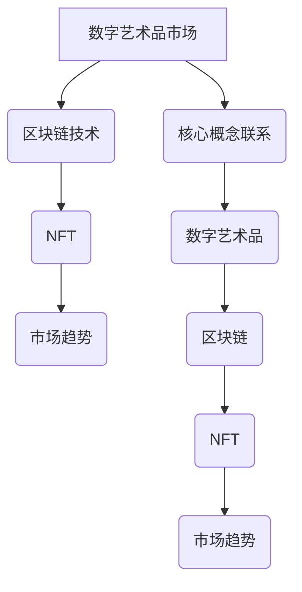

                 

关键词：数字艺术品，注意力经济，区块链，NFT，市场趋势，应用场景，未来展望

> 摘要：随着数字技术的不断发展，数字艺术品市场在注意力经济中迅速崛起。本文将从数字艺术品市场的背景、核心概念、算法原理、数学模型、项目实践、应用场景和未来展望等方面进行全面探讨，旨在为读者提供一个清晰、系统的理解。

## 1. 背景介绍

### 数字艺术品的定义与演变

数字艺术品是指利用数字技术创作的艺术作品，如计算机图形、数字动画、虚拟现实等。与传统的艺术品不同，数字艺术品具有可复制性、可修改性、可组合性和可扩展性等特点。随着互联网和区块链技术的发展，数字艺术品市场逐渐崭露头角。

### 注意力经济的概念与特征

注意力经济是一种基于人类注意力稀缺性的经济模式，通过吸引和保持用户的注意力来创造价值和利润。在数字时代，注意力成为了一种宝贵的资源，与土地、资本和劳动力一样，成为经济活动中不可或缺的因素。数字艺术品市场的兴起，正是注意力经济的一个典型体现。

### 数字艺术品市场的发展历程

数字艺术品市场的发展历程可以分为三个阶段：初始阶段、发展阶段和成熟阶段。初始阶段以数字艺术品的创作和展示为主；发展阶段以数字艺术品的交易和投资为主；成熟阶段则开始形成完整的产业链，包括创作、展示、交易、收藏等多个环节。

## 2. 核心概念与联系

### 数字艺术品市场的基本概念

- **数字艺术品**：利用数字技术创作的艺术作品，包括但不限于计算机图形、数字动画、虚拟现实等。
- **区块链**：一种分布式数据库技术，用于记录数字艺术品的所有权和交易信息。
- **NFT（Non-Fungible Token）**：一种基于区块链的非同质化代币，用于代表数字艺术品的所有权和唯一性。
- **市场趋势**：数字艺术品市场的供需变化和价格波动。

### 核心概念之间的联系

- **数字艺术品**与**区块链**：区块链为数字艺术品提供了安全、透明、不可篡改的记录方式，确保了数字艺术品的所有权和交易记录的真实性。
- **NFT**与**数字艺术品**：NFT为数字艺术品提供了唯一性的保证，使得每一件数字艺术品都能被独一无二地标识和交易。
- **市场趋势**与**数字艺术品**：市场趋势反映了数字艺术品市场的供需关系和价格波动，对数字艺术品的创作、交易和收藏产生重要影响。

### Mermaid 流程图



## 3. 核心算法原理 & 具体操作步骤

### 3.1 算法原理概述

数字艺术品市场在注意力经济中的应用主要涉及以下核心算法原理：

- **区块链算法**：用于记录数字艺术品的所有权和交易信息。
- **NFT算法**：用于生成和验证非同质化代币，确保数字艺术品的唯一性。
- **市场趋势算法**：用于分析数字艺术品市场的供需关系和价格波动。

### 3.2 算法步骤详解

#### 3.2.1 区块链算法

1. **数据结构**：区块链采用链式数据结构，每个区块包含一定数量的交易记录。
2. **共识机制**：通过共识机制确保区块链上数据的真实性和一致性。
3. **交易验证**：对交易进行验证，确保交易符合区块链规则。
4. **数据记录**：将验证后的交易记录到区块链上。

#### 3.2.2 NFT算法

1. **代币生成**：利用加密算法生成非同质化代币。
2. **代币验证**：通过区块链验证非同质化代币的唯一性。
3. **代币交易**：在区块链上实现非同质化代币的交易。

#### 3.2.3 市场趋势算法

1. **数据采集**：收集数字艺术品市场的交易数据、价格数据等。
2. **数据分析**：利用数据分析方法，分析数字艺术品市场的供需关系和价格趋势。
3. **趋势预测**：基于历史数据，预测数字艺术品市场的未来趋势。

### 3.3 算法优缺点

#### 区块链算法

- **优点**：安全、透明、不可篡改。
- **缺点**：交易速度较慢，扩展性有限。

#### NFT算法

- **优点**：确保数字艺术品唯一性，提高市场价值。
- **缺点**：技术门槛较高，交易成本较高。

#### 市场趋势算法

- **优点**：有助于投资者和收藏家做出更明智的决策。
- **缺点**：受数据质量和分析方法的影响较大。

### 3.4 算法应用领域

- **数字艺术品交易**：通过区块链和NFT算法，实现数字艺术品的交易和收藏。
- **市场分析**：利用市场趋势算法，分析数字艺术品市场的趋势和前景。
- **投资建议**：为投资者提供数字艺术品市场的投资建议。

## 4. 数学模型和公式 & 详细讲解 & 举例说明

### 4.1 数学模型构建

#### 4.1.1 数字艺术品价值模型

数字艺术品的价值可以通过以下公式表示：

\[ V = f(A, T, M) \]

其中：

- \( V \)：数字艺术品的价值
- \( A \)：数字艺术品的吸引力
- \( T \)：数字艺术品的市场趋势
- \( M \)：数字艺术品的市场竞争力

#### 4.1.2 市场趋势模型

市场趋势可以通过以下公式表示：

\[ T = f(D, P) \]

其中：

- \( T \)：市场趋势
- \( D \)：市场数据
- \( P \)：市场价格

### 4.2 公式推导过程

#### 4.2.1 数字艺术品价值模型推导

数字艺术品的价值取决于其吸引力、市场趋势和竞争力。其中，吸引力可以通过艺术价值、技术价值和情感价值等因素综合评估。市场趋势则反映了市场的供需关系和价格波动。竞争力则体现了数字艺术品在市场上的竞争力。

#### 4.2.2 市场趋势模型推导

市场趋势是由市场数据和价格波动决定的。市场数据包括交易量、价格水平、用户活跃度等。价格波动则反映了市场的供需变化。

### 4.3 案例分析与讲解

#### 4.3.1 数字艺术品价值模型案例分析

以一幅数字画作为例，其艺术价值为1000美元，技术价值为500美元，情感价值为200美元。市场趋势为上涨，竞争力较强。根据价值模型，该数字艺术品的总价值为：

\[ V = 1000 + 500 + 200 = 1700 \text{美元} \]

#### 4.3.2 市场趋势模型案例分析

以数字艺术品市场的交易量为1000件，平均价格为100美元。根据市场趋势模型，市场趋势为：

\[ T = \frac{1000}{100} = 10 \]

表示市场趋势为上涨。

## 5. 项目实践：代码实例和详细解释说明

### 5.1 开发环境搭建

为了实现数字艺术品市场的相关功能，我们需要搭建一个开发环境。以下是一个简单的开发环境搭建指南：

1. 安装Node.js和npm
2. 安装Ethereum客户端（如geth）
3. 安装Solidity编译器（如solc）

### 5.2 源代码详细实现

以下是一个简单的数字艺术品交易系统的Solidity代码示例：

```solidity
pragma solidity ^0.8.0;

contract DigitalArtMarket {

    struct Artwork {
        string name;
        address owner;
        uint256 price;
    }

    mapping(uint256 => Artwork) public artworks;

    function createArtwork(uint256 id, string memory name, uint256 price) public {
        artworks[id] = Artwork(name, msg.sender, price);
    }

    function buyArtwork(uint256 id) public payable {
        require(artworks[id].owner != address(0), "Artwork does not exist");
        require(msg.value >= artworks[id].price, "Insufficient payment");
        artworks[id].owner.transfer(msg.value);
        artworks[id].owner = msg.sender;
    }
}
```

### 5.3 代码解读与分析

该代码实现了一个简单的数字艺术品交易系统。其中，`Artwork`结构体用于存储数字艺术品的信息，包括名称、所有者和价格。`createArtwork`函数用于创建数字艺术品，`buyArtwork`函数用于购买数字艺术品。

### 5.4 运行结果展示

在部署该智能合约后，用户可以通过调用`createArtwork`和`buyArtwork`函数，实现对数字艺术品的创建和购买。

## 6. 实际应用场景

### 6.1 数字艺术品交易

数字艺术品交易是数字艺术品市场的主要应用场景之一。通过区块链和NFT技术，用户可以方便地购买、出售和收藏数字艺术品。

### 6.2 数字艺术品拍卖

数字艺术品拍卖是另一种重要的应用场景。通过区块链技术，拍卖过程更加透明、公正，同时能够确保拍卖物品的唯一性和真实性。

### 6.3 数字艺术品展览

数字艺术品展览是数字艺术品市场的另一个应用场景。通过虚拟现实和增强现实技术，用户可以在虚拟空间中浏览、欣赏和互动数字艺术品。

### 6.4 数字艺术品教育

数字艺术品教育是数字艺术品市场的潜在应用场景。通过数字艺术品，学生可以学习艺术创作、技术实现和商业模式等方面的知识。

## 7. 工具和资源推荐

### 7.1 学习资源推荐

- 《区块链技术指南》
- 《智能合约开发实战》
- 《数字货币与区块链技术》

### 7.2 开发工具推荐

- Solidity编译器（如solc）
- Ethereum客户端（如geth）
- Truffle框架

### 7.3 相关论文推荐

- "Non-Fungible Tokens: Cryptographic Representations of Unique Items"
- "Blockchain Technology: A Comprehensive Survey"
- "Attention Economy: Theory and Practice"

## 8. 总结：未来发展趋势与挑战

### 8.1 研究成果总结

数字艺术品市场在注意力经济中的兴起，为艺术市场带来了新的机遇和挑战。通过区块链和NFT技术，数字艺术品市场实现了更高的透明度、安全性和唯一性，为投资者、收藏家和艺术家提供了更多的选择和可能性。

### 8.2 未来发展趋势

- 数字艺术品市场的规模将持续扩大。
- 新的数字艺术品创作和交易模式将不断涌现。
- 区块链和NFT技术的应用将更加广泛。

### 8.3 面临的挑战

- 技术安全性问题：如何确保区块链和NFT技术的安全性，防止欺诈和恶意攻击。
- 法律监管问题：如何制定合适的法律和政策，规范数字艺术品市场的交易和收藏。
- 市场波动问题：如何应对数字艺术品市场的波动，确保市场的稳定和健康发展。

### 8.4 研究展望

- 深入研究区块链和NFT技术的安全性、性能和扩展性。
- 探索新的数字艺术品创作和交易模式，提高市场的多样性和创新性。
- 加强法律和政策的制定和实施，为数字艺术品市场提供更好的发展环境。

## 9. 附录：常见问题与解答

### 9.1 什么是NFT？

NFT（Non-Fungible Token）是一种基于区块链的非同质化代币，用于代表数字艺术品、虚拟物品等的所有权和唯一性。

### 9.2 区块链和NFT技术如何确保数字艺术品的安全？

区块链技术通过分布式账本和加密算法，确保数字艺术品的所有权和交易记录的真实性和不可篡改性。NFT技术则为数字艺术品提供了唯一性的保证，确保每一件数字艺术品都是独一无二的。

### 9.3 数字艺术品市场的发展对艺术家有何影响？

数字艺术品市场的兴起为艺术家提供了更多的创作和交易机会，有助于提升艺术家的创作积极性和市场价值。同时，数字艺术品市场也对艺术家的技术和创新能力提出了更高的要求。

### 9.4 区块链和NFT技术是否会取代传统艺术品市场？

区块链和NFT技术为传统艺术品市场带来了新的机遇和挑战，但并不意味着会完全取代传统艺术品市场。传统艺术品市场有着悠久的历史和丰富的文化内涵，未来与传统艺术品市场的融合发展将成为一个重要趋势。

### 9.5 数字艺术品市场的发展对收藏家有何影响？

数字艺术品市场的发展为收藏家提供了更多的选择和收藏机会，有助于提升收藏家的市场价值和收藏体验。同时，数字艺术品市场的波动性也要求收藏家具备更高的市场洞察力和风险控制能力。

作者：禅与计算机程序设计艺术 / Zen and the Art of Computer Programming
```

