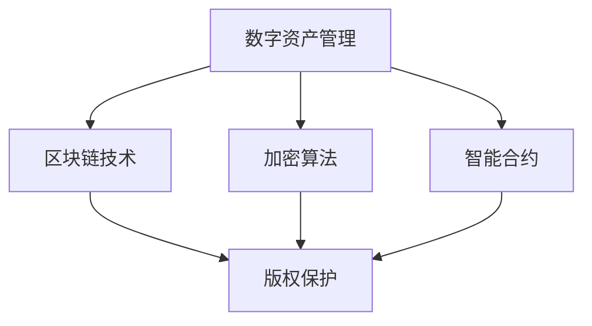

                 

关键词：数字资产管理、版权保护、区块链技术、加密算法、智能合约、创业公司、合规性、数据隐私

摘要：随着数字化转型的推进，数字资产和版权保护成为创业公司面临的重要挑战。本文将从数字资产管理的背景、核心概念、算法原理、数学模型、项目实践以及未来展望等方面，探讨如何在创业公司中实现有效的数字资产管理与版权保护。

## 1. 背景介绍

在互联网和数字技术迅速发展的今天，数字资产和版权保护已成为各行各业关注的焦点。数字资产不仅包括数字货币、数字股票等，还涵盖了音乐、电影、书籍、图片等数字内容。版权保护则是确保创作者权益、促进内容创新和传播的重要手段。

然而，数字资产和版权保护在创业公司中面临诸多挑战。首先，创业公司通常缺乏足够的资源和技术实力来处理复杂的数字资产和版权问题。其次，由于区块链和加密算法等技术的应用，数字资产和版权保护的方式也在不断演变，创业公司需要不断学习和适应。此外，合规性和数据隐私问题也增加了创业公司在数字资产管理与版权保护方面的挑战。

## 2. 核心概念与联系

为了更好地理解数字资产管理和版权保护，我们需要明确以下核心概念：

### 2.1 数字资产

数字资产是指以数字化形式存在的各种财产，包括数字货币、数字股票、数字债券、数字艺术品等。数字资产具有易转移、易复制、易篡改等特点，因此对其进行有效的管理和保护至关重要。

### 2.2 版权

版权是指创作者对其作品享有的专有权利，包括复制权、发行权、出租权、展示权、表演权等。版权保护有助于激发创作热情、保障创作者权益，促进文化产业的繁荣发展。

### 2.3 区块链技术

区块链技术是一种去中心化的分布式数据库技术，具有去信任、不可篡改、透明等特点。区块链技术在数字资产管理和版权保护中发挥着重要作用，可以实现数字资产的全程追踪和版权确权。

### 2.4 加密算法

加密算法是一种将明文转换为密文的算法，用于保护数字资产和数据隐私。常见的加密算法包括对称加密、非对称加密、哈希算法等。加密算法在数字资产管理和版权保护中发挥着关键作用。

### 2.5 智能合约

智能合约是一种基于区块链技术的自动执行合约，能够自动执行预先设定的条件。智能合约在数字资产管理和版权保护中可以用于自动执行版权交易、授权等操作，提高交易效率和透明度。

### 2.6 Mermaid 流程图



## 3. 核心算法原理 & 具体操作步骤

### 3.1 算法原理概述

数字资产管理与版权保护的核心算法主要包括区块链技术、加密算法和智能合约。

- **区块链技术**：通过分布式账本技术实现数字资产的全程追踪，确保数据的真实性和完整性。
- **加密算法**：通过加密技术保护数字资产和数据隐私，防止非法篡改和泄露。
- **智能合约**：通过自动化执行合约条款，提高数字资产和版权交易的效率和透明度。

### 3.2 算法步骤详解

#### 3.2.1 区块链技术应用

1. **数字资产注册**：将数字资产信息（如数字货币、数字艺术品等）上传至区块链，实现数字资产的注册和确权。
2. **数字资产追踪**：通过区块链技术实现对数字资产的全过程追踪，确保数字资产的安全和透明。
3. **数字资产转移**：在区块链上进行数字资产的所有权转移，确保转移过程的合法性和透明度。

#### 3.2.2 加密算法应用

1. **数据加密**：使用加密算法对数字资产和数据信息进行加密，防止非法篡改和泄露。
2. **密钥管理**：合理管理加密密钥，确保数字资产和数据的安全。
3. **加密通信**：使用加密算法实现数字资产和版权交易过程中的安全通信。

#### 3.2.3 智能合约应用

1. **版权交易**：通过智能合约实现版权交易的自动化执行，提高交易效率和透明度。
2. **授权管理**：使用智能合约实现版权授权和撤销的自动化操作，确保授权过程的合法性和透明度。
3. **收益分配**：通过智能合约实现版权收益的自动分配，确保创作者权益。

### 3.3 算法优缺点

#### 区块链技术

优点：去中心化、不可篡改、透明度高。
缺点：交易速度较慢、存储容量有限、部分应用场景受限。

#### 加密算法

优点：安全性高、适用范围广。
缺点：加密过程复杂、计算成本较高、密钥管理难度大。

#### 智能合约

优点：自动化执行、提高效率、透明度高。
缺点：编写难度大、可能出现漏洞、依赖区块链技术。

### 3.4 算法应用领域

数字资产管理与版权保护算法在多个领域具有广泛应用，如金融、文化、娱乐、版权交易等。随着技术的不断发展，这些算法的应用领域将进一步扩大。

## 4. 数学模型和公式 & 详细讲解 & 举例说明

### 4.1 数学模型构建

数字资产管理与版权保护涉及多个数学模型，主要包括密码学模型、博弈论模型、统计分析模型等。

#### 密码学模型

密码学模型主要包括加密算法、签名算法、认证算法等。这些算法在数字资产管理和版权保护中发挥着关键作用。

#### 博弈论模型

博弈论模型主要用于分析数字资产和版权交易中的竞争和合作行为，帮助创业公司制定合理的策略。

#### 统计分析模型

统计分析模型用于对数字资产和版权交易数据进行挖掘和分析，为创业公司提供决策支持。

### 4.2 公式推导过程

以下是一个简单的加密算法公式的推导过程：

假设我们使用AES（高级加密标准）加密算法，其密钥长度为128位。加密过程如下：

$$
c = E_k(p)
$$

其中，$c$ 表示加密后的数据，$k$ 表示密钥，$p$ 表示明文。

假设密钥$k$由三个32位的子密钥组成：$k_0, k_1, k_2$。加密过程可以分为以下几步：

1. **初始轮变换**：对明文进行初始轮变换，包括字节替换、行移位和列混淆。
2. **循环轮变换**：对每个轮次进行变换，包括字节替换、行移位和列混淆，共进行10轮。
3. **最终轮变换**：对加密数据进行最终轮变换，包括字节替换、行移位和列混淆。

### 4.3 案例分析与讲解

以下是一个基于区块链技术的数字资产管理案例：

**案例背景**：一家创业公司开发了一款数字艺术品交易平台，使用区块链技术进行数字资产注册、追踪和交易。

**解决方案**：

1. **数字资产注册**：将数字艺术品信息上传至区块链，实现数字资产的注册和确权。
2. **数字资产追踪**：通过区块链技术实现对数字艺术品的全过程追踪，确保数字艺术品的安全和透明。
3. **数字资产交易**：在区块链上进行数字艺术品的所有权转移，确保转移过程的合法性和透明度。

**案例分析**：

- **安全性**：区块链技术确保了数字艺术品的安全性和透明度，防止非法篡改和泄露。
- **效率**：区块链技术提高了数字艺术品交易的速度和效率，降低了交易成本。
- **合规性**：区块链技术帮助创业公司实现了合规经营，提高了市场竞争力。

## 5. 项目实践：代码实例和详细解释说明

### 5.1 开发环境搭建

在开始数字资产管理与版权保护项目的开发之前，我们需要搭建以下开发环境：

- **区块链平台**：选择一个合适的区块链平台，如Ethereum、Hyperledger Fabric等。
- **开发工具**：安装相关开发工具，如Visual Studio Code、Node.js、Golang等。
- **加密库**：选择一个合适的加密库，如OpenSSL、CryptoJS等。

### 5.2 源代码详细实现

以下是一个基于Ethereum区块链的数字资产管理项目的源代码实现：

```solidity
// SPDX-License-Identifier: MIT
pragma solidity ^0.8.0;

contract DigitalAsset {
    // 数字资产结构体
    struct Asset {
        string id;
        string title;
        address owner;
    }

    // 数字资产映射表
    mapping(string => Asset) public assets;

    // 注册数字资产
    function registerAsset(string memory _id, string memory _title) public {
        require(assets[_id].id == "", "Asset already registered");
        assets[_id] = Asset(_id, _title, msg.sender);
    }

    // 转让数字资产
    function transferAsset(string memory _id, address _to) public {
        require(assets[_id].id != "", "Asset not found");
        require(assets[_id].owner == msg.sender, "Not the owner");
        assets[_id].owner = _to;
    }
}
```

### 5.3 代码解读与分析

- **数字资产结构体**：定义了数字资产的结构体，包括ID、标题和所有者。
- **数字资产映射表**：使用映射表存储数字资产信息，便于查询和修改。
- **注册数字资产**：允许用户注册数字资产，并将数字资产信息存储在区块链上。
- **转让数字资产**：允许所有者将数字资产转让给其他用户，更新所有者信息。

### 5.4 运行结果展示

通过区块链浏览器查看数字资产管理智能合约的运行结果，可以验证数字资产的注册和转让操作是否成功。

## 6. 实际应用场景

数字资产管理与版权保护在多个实际应用场景中具有广泛应用：

- **金融领域**：数字货币、数字债券、数字股票等数字资产的安全管理和版权保护。
- **文化领域**：数字艺术品、数字音乐、数字电影等数字内容的版权保护和收益分配。
- **版权交易**：数字版权的交易和授权管理，提高交易效率和透明度。
- **物联网**：物联网设备的数据管理和隐私保护，防止数据泄露和非法篡改。

### 6.4 未来应用展望

随着区块链技术和加密算法的不断发展，数字资产管理与版权保护将在更多领域得到应用。未来，我们期待看到：

- **更高效的交易**：利用智能合约和区块链技术实现更高效的数字资产交易。
- **更安全的隐私保护**：利用加密算法和零知识证明等新技术提高数据隐私保护水平。
- **更广泛的合作**：跨行业、跨领域的合作，推动数字资产管理与版权保护技术的发展。

## 7. 工具和资源推荐

### 7.1 学习资源推荐

- **区块链技术**：
  - 《区块链技术指南》
  - 《精通区块链开发》
- **加密算法**：
  - 《密码学原理与应用》
  - 《现代密码学教程》
- **智能合约开发**：
  - 《Solidity编程》
  - 《Ethereum开发指南》

### 7.2 开发工具推荐

- **区块链平台**：
  - Ethereum
  - Hyperledger Fabric
- **开发工具**：
  - Visual Studio Code
  - Truffle
- **加密库**：
  - OpenSSL
  - CryptoJS

### 7.3 相关论文推荐

- **数字资产管理**：
  - "A Survey on Digital Asset Management"
  - "Blockchain-based Digital Asset Management"
- **版权保护**：
  - "Copyright Protection Using Blockchain Technology"
  - "Smart Contracts for Digital Content Licensing"

## 8. 总结：未来发展趋势与挑战

### 8.1 研究成果总结

本文从数字资产管理与版权保护的背景、核心概念、算法原理、数学模型、项目实践等方面进行了深入探讨。研究表明，区块链技术和加密算法在数字资产管理与版权保护中具有广泛应用前景。

### 8.2 未来发展趋势

未来，数字资产管理与版权保护将在更多领域得到应用，如金融、文化、版权交易等。随着技术的不断发展，我们将看到更高效的交易、更安全的隐私保护和更广泛的合作。

### 8.3 面临的挑战

尽管数字资产管理与版权保护具有巨大潜力，但创业公司在实际应用过程中仍面临诸多挑战，如技术门槛、合规性、数据隐私等。此外，技术发展和应用场景的多样性也对创业公司提出了更高的要求。

### 8.4 研究展望

未来，我们需要关注以下研究方向：

- **跨领域合作**：推动区块链技术和加密算法在更多领域的应用。
- **隐私保护**：研究新型隐私保护技术，提高数据隐私保护水平。
- **合规性**：研究如何实现数字资产管理与版权保护的合规性。

## 9. 附录：常见问题与解答

### 9.1 什么是数字资产？

数字资产是指以数字化形式存在的各种财产，包括数字货币、数字股票、数字债券、数字艺术品等。

### 9.2 区块链技术如何确保数字资产的安全？

区块链技术通过去中心化、分布式账本技术和加密算法确保数字资产的安全。去中心化意味着没有单一的权威机构可以篡改数据，分布式账本技术确保数据的真实性和完整性，加密算法则用于保护数字资产和数据隐私。

### 9.3 加密算法在数字资产管理中有哪些应用？

加密算法在数字资产管理中主要用于数据加密、密钥管理和加密通信。数据加密用于保护数字资产和数据隐私，密钥管理确保数字资产的安全，加密通信用于保护数字资产交易过程中的通信安全。

### 9.4 智能合约在数字资产管理中有哪些应用？

智能合约在数字资产管理中主要用于版权交易、授权管理和收益分配。通过智能合约，可以自动化执行版权交易、授权等操作，提高交易效率和透明度。

### 9.5 数字资产管理与版权保护在哪些领域有应用？

数字资产管理与版权保护在金融、文化、版权交易等领域有广泛应用。随着技术的不断发展，这些领域的应用将进一步扩大。

## 作者署名

作者：禅与计算机程序设计艺术 / Zen and the Art of Computer Programming
----------------------------------------------------------------

以上就是针对“数字资产管理与版权保护：创业公司的新挑战”这一主题的详细技术博客文章。这篇文章涵盖了数字资产管理与版权保护的核心概念、算法原理、数学模型、项目实践以及未来展望等内容，旨在为创业公司提供有价值的参考。希望这篇文章能够帮助您更好地理解和应用数字资产管理与版权保护技术。如果您有任何疑问或建议，欢迎在评论区留言。再次感谢您的阅读！

