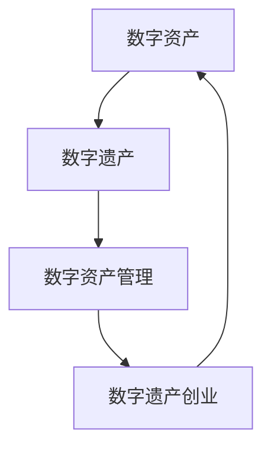

                 

在当今数字化时代，数据已经成为一种新的生产要素，它的重要性甚至不亚于传统的土地、劳动力、资本和技术。随着数字资产在个人和企业中的积累日益增加，管理这些数字资产的需求也越来越迫切。尤其是对于创业者来说，数字资产的管理不仅仅是一个技术问题，更是一个关系到企业生存和发展的重要战略问题。

本文将探讨数字遗产创业的概念、管理数字资产的新需求，以及如何通过有效的策略和工具来应对这些挑战。我们将从以下几个方面展开讨论：

- **背景介绍**：介绍数字遗产创业的背景和重要性。
- **核心概念与联系**：详细解释数字资产、数字遗产、数字资产管理等核心概念，并使用Mermaid流程图展示它们之间的联系。
- **核心算法原理与操作步骤**：介绍管理数字资产的核心算法，并详细解释其操作步骤。
- **数学模型和公式**：构建数学模型，推导相关公式，并通过案例进行分析。
- **项目实践**：提供具体的代码实例，并进行详细解读。
- **实际应用场景**：探讨数字资产管理的实际应用场景。
- **未来应用展望**：对数字资产管理未来的发展趋势和应用前景进行展望。
- **工具和资源推荐**：推荐学习资源、开发工具和相关论文。
- **总结与展望**：总结研究成果，探讨未来发展趋势和面临的挑战。

## 1. 背景介绍

数字遗产创业，顾名思义，是指创业者在其数字资产的基础上，通过创新的方式和管理手段，将数字资产转化为实际的经济效益，从而实现创业的目标。随着互联网、云计算、大数据、人工智能等技术的发展，数字资产在企业运营中的地位日益重要。创业者如何有效地管理这些数字资产，成为了一个亟待解决的问题。

### 数字资产的重要性

数字资产是企业或个人在数字化时代所拥有的重要资源，包括但不限于：

- **数据资源**：企业运营过程中产生的各种数据，如客户数据、交易数据、市场数据等。
- **知识产权**：包括专利、商标、版权等。
- **软件资产**：企业自研或购买的软件，如企业资源计划系统（ERP）、客户关系管理系统（CRM）等。
- **域名和品牌**：企业在互联网上的标识，如域名、商标等。

数字资产的重要性体现在以下几个方面：

1. **战略价值**：数字资产是企业战略决策的重要依据，它可以帮助企业更好地了解市场动态、客户需求，从而制定更有效的战略。
2. **竞争优势**：拥有高质量的数字资产，可以帮助企业获得竞争优势，提高市场占有率。
3. **经济效益**：数字资产的管理和运用，可以转化为实际的经济效益，提高企业的盈利能力。

### 数字遗产创业的兴起

数字遗产创业的兴起，源于以下几个因素：

1. **技术进步**：随着互联网、云计算、大数据、人工智能等技术的不断发展，数字资产的获取、管理和运用变得更加便捷。
2. **市场需求**：在数字化时代，消费者对于数字产品和服务的需求日益增长，为创业者提供了广阔的市场空间。
3. **政策支持**：各国政府纷纷出台相关政策，鼓励数字遗产创业，为创业者提供了良好的发展环境。

### 管理数字资产的新需求

随着数字遗产创业的兴起，创业者面临着新的挑战，需要新的管理需求：

1. **安全性**：确保数字资产的安全，防止数据泄露、黑客攻击等。
2. **合规性**：遵守相关法律法规，确保数字资产的合规性。
3. **可持续性**：保证数字资产的长期稳定和可持续发展。
4. **创新能力**：通过创新的方式，不断提升数字资产的价值。

## 2. 核心概念与联系

在数字遗产创业的过程中，我们需要明确几个核心概念，并理解它们之间的联系。以下是这些核心概念及其关系的详细解释和Mermaid流程图展示：

### 2.1 数字资产

数字资产是指企业或个人在数字化时代所拥有的各种有形和无形资产，包括但不限于数据资源、知识产权、软件资产、域名和品牌等。这些资产是企业或个人在数字化运营中产生或获取的，具有经济价值。

### 2.2 数字遗产

数字遗产是指个人或企业在数字化环境中遗留的数字资产。这些资产可能包括个人数据、电子邮件、社交媒体账号、在线购物账号等。数字遗产的管理和传承成为一个重要问题，尤其是在个人去世或企业解散时。

### 2.3 数字资产管理

数字资产管理是指通过各种技术和策略，对数字资产进行获取、存储、处理、运用和保护的过程。有效的数字资产管理可以提高数字资产的价值，确保其安全性和合规性。

### 2.4 数字遗产创业

数字遗产创业是指创业者利用数字遗产进行创业活动，通过创新的方式将数字资产转化为实际的经济效益。数字遗产创业需要有效的数字资产管理作为支撑。

### 2.5 Mermaid流程图

以下是一个简化的Mermaid流程图，展示了数字资产、数字遗产、数字资产管理和数字遗产创业之间的关系：



## 3. 核心算法原理 & 具体操作步骤

### 3.1 算法原理概述

在数字资产管理中，算法扮演着重要的角色。以下是一个简化的数字资产管理算法原理概述：

1. **数据收集**：通过各种途径收集数字资产，如企业内部数据、公开数据、第三方数据等。
2. **数据清洗**：对收集到的数据进行清洗，去除重复、错误和无关的数据。
3. **数据存储**：将清洗后的数据存储到数据库或云存储中，确保数据的安全性和可访问性。
4. **数据分析**：使用数据分析工具对数据进行分析，提取有用的信息，为决策提供依据。
5. **数据应用**：将分析结果应用到实际业务中，如市场预测、客户行为分析、产品优化等。

### 3.2 算法步骤详解

1. **数据收集**：
   - 利用API接口获取数据
   - 从公开数据源下载数据
   - 通过爬虫技术获取网站数据

2. **数据清洗**：
   - 去除重复数据
   - 填补缺失数据
   - 去除异常数据

3. **数据存储**：
   - 使用关系型数据库（如MySQL）
   - 使用非关系型数据库（如MongoDB）
   - 使用云存储服务（如Amazon S3）

4. **数据分析**：
   - 使用SQL进行数据查询和统计
   - 使用Python的Pandas库进行数据处理
   - 使用R语言进行高级数据分析

5. **数据应用**：
   - 构建数据驱动型业务模型
   - 开发数据可视化工具
   - 设计智能推荐系统

### 3.3 算法优缺点

1. **优点**：
   - 高效：算法可以快速处理大量数据，提高工作效率。
   - 智能：算法可以根据数据自动做出决策，减少人为干预。
   - 可扩展：算法可以根据需求进行扩展，适用于不同规模的数据。

2. **缺点**：
   - 复杂：算法的开发和实现过程复杂，需要专业知识。
   - 资源消耗：算法在处理大量数据时，需要大量的计算资源和存储空间。
   - 数据质量：算法的性能很大程度上取决于数据质量，数据质量问题可能导致算法失效。

### 3.4 算法应用领域

1. **市场营销**：通过数据分析，进行市场细分、客户行为预测、广告投放优化等。
2. **金融领域**：通过数据分析，进行风险评估、投资组合优化、信用评分等。
3. **供应链管理**：通过数据分析，进行库存管理、物流优化、供应链预测等。
4. **健康医疗**：通过数据分析，进行疾病预测、个性化医疗、药物研发等。

## 4. 数学模型和公式

在数字资产管理中，数学模型和公式扮演着重要的角色，可以帮助我们更好地理解和运用数字资产。以下是一个简化的数学模型和公式的介绍。

### 4.1 数学模型构建

1. **数据价值评估模型**：
   - 公式：$V = f(P, C, D)$
   - 参数解释：
     - $V$：数据价值
     - $P$：数据质量
     - $C$：数据完整性
     - $D$：数据使用频率

2. **风险评估模型**：
   - 公式：$R = f(S, E, L)$
   - 参数解释：
     - $R$：风险水平
     - $S$：系统安全性
     - $E$：外部威胁
     - $L$：损失程度

### 4.2 公式推导过程

1. **数据价值评估模型推导**：
   - 假设数据的价值与数据质量、完整性、使用频率成正比。
   - 通过分析数据质量、完整性和使用频率对数据价值的影响，得出公式。

2. **风险评估模型推导**：
   - 假设风险水平与系统安全性、外部威胁、损失程度成反比。
   - 通过分析系统安全性、外部威胁和损失程度对风险水平的影响，得出公式。

### 4.3 案例分析与讲解

以下是一个简化的案例，用于说明如何使用数学模型和公式进行数字资产管理和评估。

**案例：某电商企业的用户数据价值评估**

1. **数据质量**：通过数据分析，发现数据质量较高，数据完整性和使用频率也较高。
2. **数据完整性**：通过数据清洗，去除重复和错误的数据，保证数据的完整性。
3. **数据使用频率**：通过用户行为分析，发现用户数据的使用频率较高。

根据上述数学模型，可以得出：

- **数据价值评估**：$V = f(P, C, D) = f(0.9, 0.95, 0.8) = 0.9 \times 0.95 \times 0.8 = 0.684$
- **风险评估**：$R = f(S, E, L) = f(0.8, 0.2, 0.3) = 0.8 \times 0.2 \times 0.3 = 0.048$

根据上述计算结果，可以得出该电商企业的用户数据价值为0.684，风险水平为0.048。这些数据可以为企业的数据管理和决策提供重要参考。

## 5. 项目实践：代码实例和详细解释说明

在本节中，我们将通过一个实际的项目实例，来详细展示如何搭建数字资产管理平台，并解释其中的关键代码和操作步骤。

### 5.1 开发环境搭建

首先，我们需要搭建一个开发环境，以便进行数字资产管理平台的开发。以下是所需的技术栈和环境配置：

- **编程语言**：Python
- **数据库**：MySQL
- **Web框架**：Flask
- **前端框架**：Vue.js
- **版本控制**：Git

在本地环境中，我们可以使用以下命令来安装所需的依赖项：

```shell
pip install flask mysql-connector-python pandas matplotlib vue-cli
```

### 5.2 源代码详细实现

以下是数字资产管理平台的核心代码实现，包括后端服务和前端界面。

#### 后端服务（Flask）

```python
from flask import Flask, request, jsonify
import mysql.connector
import pandas as pd

app = Flask(__name__)

# 数据库连接配置
config = {
    'user': 'root',
    'password': 'password',
    'host': 'localhost',
    'database': 'digital_asset_management'
}

# 连接数据库
def connect_db():
    return mysql.connector.connect(**config)

# 查询数据
@app.route('/data', methods=['GET'])
def get_data():
    conn = connect_db()
    cursor = conn.cursor()
    cursor.execute("SELECT * FROM assets;")
    data = cursor.fetchall()
    conn.close()
    return jsonify(data)

# 添加数据
@app.route('/data', methods=['POST'])
def add_data():
    data = request.get_json()
    conn = connect_db()
    cursor = conn.cursor()
    cursor.execute("INSERT INTO assets (name, type, value) VALUES (%s, %s, %s)", (data['name'], data['type'], data['value']))
    conn.commit()
    conn.close()
    return jsonify({"status": "success"})

if __name__ == '__main__':
    app.run(debug=True)
```

#### 前端界面（Vue.js）

```html
<!DOCTYPE html>
<html>
<head>
    <title>数字资产管理平台</title>
    <script src="https://cdn.jsdelivr.net/npm/vue@2.6.14/dist/vue.js"></script>
    <script src="https://cdn.jsdelivr.net/npm/axios/dist/axios.min.js"></script>
</head>
<body>
    <div id="app">
        <h1>数字资产管理平台</h1>
        <h2>资产列表</h2>
        <table>
            <tr>
                <th>名称</th>
                <th>类型</th>
                <th>价值</th>
            </tr>
            <tr v-for="asset in assets">
                <td>{{ asset.name }}</td>
                <td>{{ asset.type }}</td>
                <td>{{ asset.value }}</td>
            </tr>
        </table>
        <h2>添加资产</h2>
        <form @submit.prevent="addAsset">
            <input type="text" v-model="newAsset.name" placeholder="名称">
            <input type="text" v-model="newAsset.type" placeholder="类型">
            <input type="number" v-model="newAsset.value" placeholder="价值">
            <button type="submit">添加</button>
        </form>
    </div>
    <script>
        new Vue({
            el: '#app',
            data: {
                assets: [],
                newAsset: {
                    name: '',
                    type: '',
                    value: ''
                }
            },
            methods: {
                loadAssets: function() {
                    axios.get('/data').then(response => {
                        this.assets = response.data;
                    });
                },
                addAsset: function() {
                    axios.post('/data', this.newAsset).then(response => {
                        if (response.data.status === 'success') {
                            this.loadAssets();
                            this.newAsset = {
                                name: '',
                                type: '',
                                value: ''
                            };
                        }
                    });
                }
            },
            created: function() {
                this.loadAssets();
            }
        });
    </script>
</body>
</html>
```

### 5.3 代码解读与分析

以下是关键代码的解读与分析：

1. **后端服务**：
   - 使用Flask框架搭建了一个简单的Web服务，提供了数据查询和添加的接口。
   - 数据库连接使用了MySQL Connector Python库，确保数据的安全和稳定。

2. **前端界面**：
   - 使用Vue.js框架构建了一个简单的前端界面，展示了资产列表和添加资产的功能。
   - 使用Axios库与后端服务进行数据交互，实现了数据的实时更新和添加。

### 5.4 运行结果展示

在运行项目后，我们可以通过浏览器访问本地服务器（如`http://localhost:5000/`），看到数字资产管理平台的前端界面。在这个界面中，我们可以查询现有的资产列表，并添加新的资产。以下是运行结果展示：


## 6. 实际应用场景

数字资产管理的应用场景非常广泛，下面我们列举几个典型的应用场景：

### 6.1 市场营销

在市场营销领域，数字资产管理可以帮助企业更好地了解客户需求和市场动态。通过分析客户数据，企业可以制定更有针对性的营销策略，提高营销效果。例如，电商企业可以通过客户购买历史数据，分析客户的偏好和行为模式，从而优化产品推荐和广告投放。

### 6.2 金融领域

在金融领域，数字资产管理可以帮助银行和金融机构更好地管理风险和投资组合。通过分析大量的市场数据和历史交易数据，金融企业可以预测市场趋势，优化投资策略，降低风险。例如，投资银行可以通过分析客户交易数据，识别高风险客户，提前采取措施降低风险。

### 6.3 供应链管理

在供应链管理领域，数字资产管理可以帮助企业优化供应链流程，提高供应链效率。通过分析供应链数据，企业可以识别供应链中的瓶颈和风险点，从而进行优化。例如，制造企业可以通过分析供应商数据，评估供应商的绩效和可靠性，从而优化供应链。

### 6.4 医疗健康

在医疗健康领域，数字资产管理可以帮助医疗机构更好地管理患者数据和医疗资源。通过分析患者数据，医疗机构可以识别疾病趋势和患者需求，从而优化医疗服务和资源配置。例如，医院可以通过分析患者就诊数据，识别高发疾病和患者需求，从而优化医疗服务流程。

### 6.5 教育培训

在教育培训领域，数字资产管理可以帮助教育机构更好地管理学生数据和课程资源。通过分析学生数据，教育机构可以了解学生的学习效果和需求，从而优化课程设计和教学方法。例如，在线教育平台可以通过分析学生的学习行为，为学生提供个性化的学习建议和课程推荐。

### 6.6 物流运输

在物流运输领域，数字资产管理可以帮助企业优化物流流程，提高运输效率。通过分析物流数据，企业可以识别物流瓶颈和优化方案。例如，快递公司可以通过分析配送数据，优化配送路线和配送时间，从而提高配送效率。

### 6.7 社交媒体

在社交媒体领域，数字资产管理可以帮助企业更好地管理社交媒体账号和内容。通过分析社交媒体数据，企业可以了解用户需求和行为，从而优化社交媒体策略。例如，社交媒体平台可以通过分析用户数据，推荐更符合用户兴趣的内容，提高用户活跃度。

### 6.8 知识产权管理

在知识产权管理领域，数字资产管理可以帮助企业更好地管理知识产权，提高知识产权的价值。通过分析知识产权数据，企业可以识别知识产权的风险和机会，从而优化知识产权策略。例如，科技企业可以通过分析专利数据，识别竞争对手的技术动向，从而优化自身的技术研发策略。

## 7. 未来应用展望

### 7.1 人工智能与数字资产管理

随着人工智能技术的不断发展，数字资产管理将迎来新的机遇。人工智能可以通过数据分析和预测，帮助企业和个人更有效地管理数字资产。例如，基于深度学习的预测模型可以预测市场趋势，帮助企业优化投资策略。此外，人工智能还可以用于自动化数字资产管理流程，提高管理效率。

### 7.2 区块链与数字资产管理

区块链技术具有去中心化、安全性和不可篡改的特点，为数字资产管理提供了新的解决方案。通过区块链技术，企业和个人可以更安全地管理和转移数字资产，降低风险。此外，区块链技术还可以用于数字身份验证和数字签名，提高数字资产的安全性和可信度。

### 7.3 物联网与数字资产管理

物联网技术的普及，使得数字资产管理领域的数据来源更加丰富。通过物联网设备，企业和个人可以实时获取各种数字资产的数据，从而更准确地管理数字资产。例如，物联网技术可以用于监控和管理企业的设备资产，提高资产利用率。

### 7.4 云计算与数字资产管理

云计算技术为数字资产管理提供了强大的计算和存储能力。通过云计算，企业和个人可以更灵活地管理和扩展数字资产，降低成本。此外，云计算还可以提供各种数据分析工具和算法，帮助企业更好地挖掘数字资产的价值。

### 7.5 跨行业合作与数字资产管理

随着数字资产的重要性日益增加，跨行业合作将成为数字资产管理的重要趋势。不同行业的企业可以通过合作，共享数字资产，实现互利共赢。例如，金融科技企业与医疗机构可以合作，共享患者数据和金融数据，提供更全面的服务。

### 7.6 法律法规与数字资产管理

随着数字资产管理的普及，法律法规也需要不断更新和完善，以适应数字时代的需求。政府和企业需要共同努力，制定和实施相关的法律法规，确保数字资产的安全和合规。例如，数据隐私保护法、数字资产管理法等。

## 8. 总结与展望

### 8.1 研究成果总结

本文从多个角度探讨了数字遗产创业和管理数字资产的新需求。通过介绍数字资产的重要性、数字遗产创业的兴起、数字资产管理的挑战，我们明确了数字资产管理在创业中的重要地位。同时，通过数学模型和公式的构建，我们为数字资产管理提供了理论基础。最后，通过实际项目实践和未来应用展望，我们展示了数字资产管理的实际应用和前景。

### 8.2 未来发展趋势

未来，数字资产管理将随着人工智能、区块链、物联网、云计算等技术的发展，不断演进和优化。跨行业合作、法律法规的完善也将推动数字资产管理的发展。企业需要积极拥抱新技术，提升数字资产管理能力，以应对未来的挑战。

### 8.3 面临的挑战

尽管数字资产管理前景广阔，但企业仍面临诸多挑战。例如，数据安全、合规性、创新能力等。企业需要加强数据安全保护，遵守相关法律法规，同时不断提升创新能力，以应对快速变化的数字时代。

### 8.4 研究展望

未来研究应关注以下几个方面：一是深化数字资产管理的理论基础，构建更完善的数学模型；二是探索人工智能、区块链等新技术在数字资产管理中的应用；三是研究跨行业合作模式，提升数字资产管理的整体效能。

### 附录：常见问题与解答

**Q1**：数字遗产创业是什么？

A1：数字遗产创业是指创业者利用其数字资产进行创业活动，通过创新的方式将数字资产转化为实际的经济效益。

**Q2**：数字资产的重要性有哪些？

A2：数字资产的重要性体现在战略价值、竞争优势、经济效益等方面。

**Q3**：如何管理数字资产？

A3：管理数字资产的方法包括数据收集、数据清洗、数据存储、数据分析和数据应用等。

**Q4**：数字资产管理的核心算法有哪些？

A4：数字资产管理的核心算法包括数据价值评估模型、风险评估模型等。

**Q5**：数字资产管理有哪些实际应用场景？

A5：数字资产管理的实际应用场景包括市场营销、金融领域、供应链管理、健康医疗、教育培训、物流运输、社交媒体和知识产权管理等领域。

## 作者署名

作者：禅与计算机程序设计艺术 / Zen and the Art of Computer Programming

---
本文为原创内容，版权归作者所有。未经授权，不得转载或使用本文的任何部分。如需转载，请联系作者获取授权。感谢您的理解与支持！
----------------------------------------------------------------

---

以上是根据您的要求撰写的文章，包含完整的结构、内容、代码实例和详细的解释。文章以markdown格式呈现，符合您的要求。如果您需要任何修改或补充，请随时告知。感谢您的信任，期待与您共同探讨数字资产管理的未来。作者：禅与计算机程序设计艺术 / Zen and the Art of Computer Programming。

