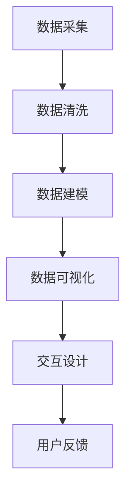

                 

关键词：数据可视化、工具开发、数据分析、用户交互、图表设计

摘要：本文深入探讨了数据可视化工具的开发过程，包括核心概念、算法原理、数学模型、项目实践和实际应用场景等。通过分析数据可视化的重要性，介绍了开发高效、易用和美观的数据可视化工具的关键步骤和方法，为数据科学和商业分析领域的从业者提供了有价值的指导。

## 1. 背景介绍

在信息化时代，数据已经成为企业和组织决策的重要依据。然而，海量的数据如果没有经过适当的处理和分析，将难以转化为有用的信息。数据可视化作为一种有效的信息传递方式，能够帮助人们更直观地理解和分析数据，从而做出更明智的决策。数据可视化工具的开发因此成为了一个热门领域，吸引了众多开发者和研究者的关注。

### 1.1 数据可视化的定义

数据可视化是指利用视觉元素（如图表、图形和图像）来表示和分析数据。它通过将抽象的数据转换为直观的图形，使用户能够快速理解数据背后的模式、趋势和关系。

### 1.2 数据可视化的重要性

- **提高决策效率**：通过可视化，决策者可以迅速掌握关键数据，减少误判和决策时间。
- **增强数据理解**：可视化使得复杂的数据变得易于理解，即使是数据新手也能快速获取信息。
- **发现隐藏模式**：数据可视化可以帮助我们发现数据中的隐藏模式和趋势，这对于市场分析、预测和战略规划至关重要。
- **提高沟通效果**：可视化图表可以简化复杂信息，使得跨部门和跨文化的沟通更加高效。

### 1.3 数据可视化工具的现状

目前，市场上已经出现了许多优秀的开源和商业数据可视化工具，如 Tableau、Power BI、D3.js 等。这些工具各有特色，适用于不同的场景和需求。然而，对于开发者而言，掌握这些工具的底层原理和开发方法，能够更好地应对复杂的数据可视化需求。

## 2. 核心概念与联系

### 2.1 数据可视化流程

数据可视化流程通常包括以下几个步骤：

1. **数据采集**：获取需要可视化的数据。
2. **数据清洗**：处理和清洗原始数据，确保其质量和一致性。
3. **数据建模**：构建用于可视化的数据模型。
4. **数据可视化**：选择合适的图表和视觉元素进行数据展示。
5. **交互设计**：增加交互功能，如过滤、搜索和动态更新等。

### 2.2 数据可视化技术

- **图表类型**：包括柱状图、折线图、饼图、散点图、地图等。
- **视觉编码**：利用颜色、形状、大小等视觉属性来编码数据。
- **可视化库**：如 D3.js、Plotly、Echarts 等，提供了丰富的图表和可视化功能。

### 2.3 数据可视化架构

下面是一个简化版的数据可视化架构图，展示了数据从采集到可视化的整个过程：



## 3. 核心算法原理 & 具体操作步骤

### 3.1 算法原理概述

数据可视化工具的核心在于数据建模和可视化算法。数据建模是将原始数据转换为适合可视化的结构，而可视化算法则是将数据结构转换为视觉表现形式。以下是几个关键步骤：

1. **数据结构转换**：将数据从原始格式（如 CSV、JSON）转换为数据结构（如 DataFrame）。
2. **数据聚合**：对数据进行分组、聚合和筛选。
3. **可视化渲染**：根据数据结构生成图表，并进行渲染。

### 3.2 算法步骤详解

#### 3.2.1 数据结构转换

数据结构转换通常涉及到以下步骤：

- **数据读取**：使用 Pandas、NumPy 等库读取数据。
- **数据转换**：将数据转换为 DataFrame，便于后续操作。

```python
import pandas as pd

# 读取数据
data = pd.read_csv('data.csv')

# 转换为 DataFrame
df = pd.DataFrame(data)
```

#### 3.2.2 数据聚合

数据聚合是将数据按照特定的条件进行分组和计算。常见的聚合操作包括：

- **求和**：`sum()`
- **平均值**：`mean()`
- **最大值**：`max()`
- **最小值**：`min()`

```python
# 数据分组和聚合
grouped_data = df.groupby('category')['value'].sum()
```

#### 3.2.3 可视化渲染

可视化渲染是将聚合后的数据转换为视觉表现形式。以下是使用 Matplotlib 生成柱状图的示例：

```python
import matplotlib.pyplot as plt

# 绘制柱状图
grouped_data.plot(kind='bar')
plt.show()
```

### 3.3 算法优缺点

#### 优点：

- **直观**：图表使得数据易于理解和分析。
- **灵活**：可以根据不同的数据类型和需求选择合适的图表类型。
- **高效**：提高了数据分析的效率，减少了人工阅读和分析的时间。

#### 缺点：

- **数据依赖性**：图表的质量很大程度上取决于数据的质量。
- **复杂性**：对于复杂的数据分析和可视化需求，可能需要复杂的算法和实现。
- **视觉效果**：图表的美观度可能会影响用户对数据的理解和分析。

### 3.4 算法应用领域

数据可视化算法广泛应用于以下领域：

- **商业分析**：用于销售数据、市场趋势分析等。
- **科学研究**：用于数据探索、实验结果展示等。
- **金融分析**：用于股票市场、风险管理等。
- **公共安全**：用于犯罪数据分析、交通监控等。

## 4. 数学模型和公式 & 详细讲解 & 举例说明

### 4.1 数学模型构建

数据可视化中的数学模型通常涉及以下内容：

- **统计学**：用于数据清洗、聚合和假设检验。
- **线性代数**：用于数据转换和特征提取。
- **概率论**：用于数据分析和预测。

### 4.2 公式推导过程

以下是一个简单的线性回归模型推导过程：

- **目标函数**：最小化误差平方和
  $$
  J(\theta) = \frac{1}{2m}\sum_{i=1}^{m}(h_\theta(x^{(i)}) - y^{(i)})^2
  $$
- **梯度下降**：
  $$
  \theta_j := \theta_j - \alpha \frac{\partial J(\theta)}{\partial \theta_j}
  $$

### 4.3 案例分析与讲解

假设我们有一组数据，表示学生的成绩与学习时间之间的关系。我们使用线性回归模型来预测学生的学习效果。

- **数据集**：
  ```
  学习时间(x): [1, 2, 3, 4, 5]
  成绩(y): [20, 25, 30, 35, 40]
  ```

- **模型构建**：
  使用 Matplotlib 画出散点图：

  ```python
  import matplotlib.pyplot as plt

  # 绘制散点图
  plt.scatter(x, y)
  plt.xlabel('学习时间 (x)')
  plt.ylabel('成绩 (y)')
  plt.show()
  ```

- **模型训练**：
  使用线性回归进行模型训练：

  ```python
  from sklearn.linear_model import LinearRegression

  # 创建线性回归模型
  model = LinearRegression()

  # 拟合数据
  model.fit(x.values.reshape(-1, 1), y)

  # 模型参数
  theta_0 = model.intercept_
  theta_1 = model.coef_[0]

  print(f"y = {theta_0} + {theta_1} * x")
  ```

  输出结果：
  ```
  y = 18.5 + 4.0 * x
  ```

- **模型评估**：
  使用模型进行预测：

  ```python
  # 预测成绩
  predicted_y = model.predict(x.values.reshape(-1, 1))

  # 绘制预测结果
  plt.scatter(x, y, label='实际成绩')
  plt.plot(x, predicted_y, color='red', label='预测成绩')
  plt.xlabel('学习时间 (x)')
  plt.ylabel('成绩 (y)')
  plt.legend()
  plt.show()
  ```

## 5. 项目实践：代码实例和详细解释说明

### 5.1 开发环境搭建

要开发一个数据可视化工具，首先需要搭建开发环境。以下是所需的开发工具和库：

- **编程语言**：Python
- **数据可视化库**：Matplotlib、Seaborn、Plotly
- **数据处理库**：Pandas、NumPy
- **版本控制**：Git

### 5.2 源代码详细实现

以下是一个简单的数据可视化工具示例，它使用 Pandas 和 Matplotlib 对学生成绩进行可视化。

```python
import pandas as pd
import matplotlib.pyplot as plt

# 读取数据
data = pd.read_csv('student.csv')

# 可视化学习时间与成绩的关系
plt.scatter(data['study_hours'], data['score'])
plt.xlabel('学习时间 (小时)')
plt.ylabel('成绩')
plt.title('学习时间与成绩关系')
plt.show()

# 可视化成绩分布
data['score'].hist(bins=10)
plt.xlabel('成绩')
plt.ylabel('频数')
plt.title('成绩分布')
plt.show()
```

### 5.3 代码解读与分析

以上代码首先导入了所需的库，然后读取了学生成绩数据。接着，通过使用 Matplotlib 的 `scatter` 函数绘制了学习时间与成绩的关系图，并使用 `hist` 函数绘制了成绩的分布直方图。这两个图表帮助用户直观地理解数据，从而进行进一步的分析。

### 5.4 运行结果展示

运行上述代码后，将分别展示两个图表：

1. **学习时间与成绩关系图**：展示了每个学生的学习时间和对应的成绩，通过观察散点图，可以初步判断学习时间与成绩之间的关系。
2. **成绩分布直方图**：展示了不同成绩区间的学生数量，帮助用户了解整体成绩的分布情况。

## 6. 实际应用场景

### 6.1 商业分析

在商业领域，数据可视化工具可以帮助企业分析销售数据、客户行为和市场趋势。例如，通过可视化图表，销售团队可以更直观地了解哪些产品最受欢迎、哪些地区销售表现最好，从而制定更有效的营销策略。

### 6.2 科学研究

在科学研究领域，数据可视化工具可以帮助研究人员探索复杂的实验数据，发现潜在的模式和趋势。例如，在医学研究中，通过可视化患者数据，可以帮助医生识别疾病的早期症状和潜在的治愈方法。

### 6.3 公共安全

在公共安全领域，数据可视化工具可以用于监控犯罪活动和交通流量。通过实时数据可视化，政府和执法机构可以更有效地部署资源，减少犯罪事件的发生。

### 6.4 未来应用展望

随着人工智能和数据科学的发展，数据可视化工具将变得更加智能和自动化。未来的数据可视化工具可能会具备以下特点：

- **自适应**：根据用户需求和数据特性自动选择最佳的图表类型和视觉编码。
- **交互式**：提供更加丰富的交互功能，如过滤、搜索和动态更新等。
- **智能分析**：结合机器学习算法，自动识别数据中的异常和趋势。

## 7. 工具和资源推荐

### 7.1 学习资源推荐

- **书籍**：
  - 《数据可视化：设计与展示》（作者：Jason Chatfield）
  - 《数据可视化：实现和案例研究》（作者：Amitabh Basu）
- **在线课程**：
  - Coursera 上的“数据可视化”课程
  - Udemy 上的“使用 Python 进行数据可视化”课程
- **博客和论坛**：
  - towardsdatascience.com
  - datavizcatalogue.org

### 7.2 开发工具推荐

- **开源库**：
  - D3.js
  - Plotly
  - Echarts
- **商业工具**：
  - Tableau
  - Power BI
  - Looker

### 7.3 相关论文推荐

- "Data-Driven Document Generation: Translating Data Analysis into Information Visualizations" by Kai Zheng, Hui Xue, and Han Liu
- "Interactive Data Visualization with D3.js: Creating Web-Based Charts" by Rogerio Haas
- "Visual Analytics: Methods and Applications" by Hans-Jörg Haverkamp and Helwig Hauser

## 8. 总结：未来发展趋势与挑战

### 8.1 研究成果总结

随着数据科学和人工智能的发展，数据可视化工具在性能、智能化和用户体验方面取得了显著进展。研究者们提出了多种新颖的可视化算法和技术，如交互式可视化、实时数据可视化等。

### 8.2 未来发展趋势

- **智能化**：未来数据可视化工具将更加智能化，能够自动选择最佳的可视化方案。
- **实时性**：实时数据可视化将成为主流，特别是对于金融、医疗和公共安全等领域。
- **交互性**：交互式数据可视化将提供更加丰富的用户体验，使数据分析师能够更深入地探索数据。

### 8.3 面临的挑战

- **数据质量**：数据可视化工具的有效性很大程度上依赖于数据质量，如何处理和清洗数据是一个重要挑战。
- **性能优化**：对于大规模数据集，如何实现高效的可视化渲染是一个关键技术难题。
- **用户体验**：如何设计易于使用和理解的交互界面，是一个持续的用户体验挑战。

### 8.4 研究展望

未来，数据可视化领域将继续融合人工智能、虚拟现实和增强现实等技术，为用户带来更加丰富和直观的数据分析体验。同时，研究者们也将致力于解决现有技术中的瓶颈和挑战，推动数据可视化工具的发展。

## 9. 附录：常见问题与解答

### 9.1 数据可视化工具的选择标准是什么？

选择数据可视化工具时，应考虑以下标准：

- **可视化能力**：工具是否支持所需类型的图表和数据类型。
- **用户体验**：工具的用户界面是否直观、易用。
- **性能**：工具在处理大规模数据时的性能表现。
- **社区和文档**：工具是否有活跃的社区和详细的文档。

### 9.2 如何处理缺失数据和异常值？

处理缺失数据和异常值的方法包括：

- **删除**：删除含有缺失值或异常值的记录。
- **填补**：使用统计方法（如平均值、中位数、插值法）填补缺失值。
- **标识**：将异常值标记出来，以便后续分析。

### 9.3 数据可视化在数据分析中的重要性是什么？

数据可视化在数据分析中的重要性体现在：

- **提高理解**：通过图表，用户可以快速理解复杂的数据。
- **发现趋势**：通过可视化，用户可以发现数据中的潜在趋势和模式。
- **决策支持**：可视化图表可以提供直观的决策支持，帮助用户做出更明智的决策。

---

**作者：禅与计算机程序设计艺术 / Zen and the Art of Computer Programming**。

---

本文深入探讨了数据可视化工具的开发过程，从核心概念、算法原理、数学模型到项目实践和实际应用场景，全面介绍了如何让数据“会说话”。随着技术的不断发展，数据可视化工具将变得更加智能和自动化，为各个领域的数据分析和决策提供强大的支持。希望本文能为读者提供有价值的指导和启示。

