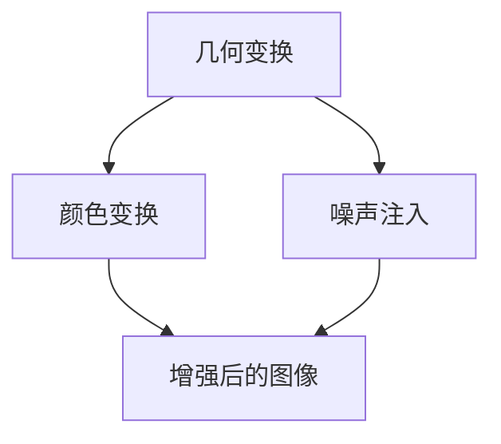
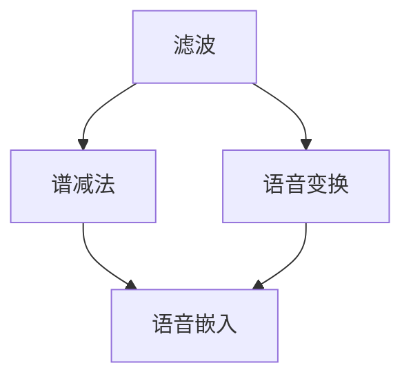
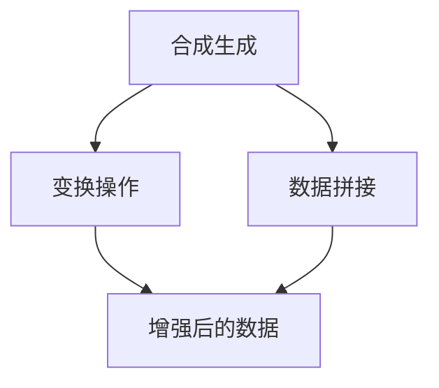

                 

数据增强（Data Augmentation）是提升机器学习模型性能的重要技术之一，特别是在图像和语音等数据密集型领域。通过在训练数据集中引入多样化的数据样本来扩充数据集，数据增强能够有效地减少过拟合现象，提高模型的泛化能力。本文将深入探讨数据增强的原理、核心算法、数学模型以及具体的代码实现，帮助读者全面理解并掌握这一关键技术。

## 文章关键词

- 数据增强
- 机器学习
- 过拟合
- 泛化能力
- 图像识别
- 语音处理

## 文章摘要

本文首先介绍了数据增强的基本概念和其在机器学习中的应用背景。接着，详细阐述了数据增强的核心算法原理，包括图像和语音数据增强的具体方法。随后，通过数学模型和公式，深入分析了数据增强的机制和效果。文章的最后，通过一个实际的代码实例，展示了数据增强在图像分类任务中的具体应用，并对运行结果进行了详细解读。通过本文的阅读，读者可以全面了解数据增强技术，并在实践中应用这一技术提高模型性能。

### 1. 背景介绍

随着人工智能技术的快速发展，机器学习在各种应用场景中发挥着越来越重要的作用。然而，模型的性能往往受到训练数据集大小和质量的影响。特别是在图像和语音等数据密集型领域，由于数据样本的有限性和多样性不足，模型容易出现过拟合现象，导致泛化能力不足。为了解决这个问题，数据增强技术被广泛采用。

数据增强的基本思想是通过一系列算法对原始数据进行变换，生成新的数据样本，从而扩充训练数据集的规模和多样性。具体而言，数据增强包括图像增强和语音增强两大类，每种增强方法都有其独特的操作方式和应用场景。

图像增强主要关注图像的几何变换、颜色变换和噪声注入等方面，旨在提高图像数据的多样性和质量。常见的图像增强方法有旋转、翻转、缩放、裁剪、对比度调整、颜色抖动等。这些方法可以有效地增加训练数据的样本数量，提高模型的泛化能力。

语音增强则主要关注语音信号的增强、去噪和变换等方面，以改善语音数据的质量和可识别度。常用的语音增强方法有滤波、谱减法、语音变换、语音嵌入等。这些方法能够有效地去除背景噪声，增强目标语音信号的清晰度，从而提高语音识别的准确性。

在机器学习中，数据增强的重要性不容忽视。首先，数据增强能够增加训练样本的数量，缓解数据不足的问题，提高模型的泛化能力。其次，数据增强可以引入更多的噪声和异常数据，使模型在更复杂的场景下具有更强的鲁棒性。此外，数据增强还能够帮助模型学习到更多的特征，提高模型的识别精度。

总之，数据增强是提升机器学习模型性能的有效手段，无论是在图像识别、语音处理还是其他数据密集型领域，都具有重要的应用价值。本文将围绕数据增强的原理、方法和技术，深入探讨其在实际应用中的实现和效果。

### 2. 核心概念与联系

数据增强的核心概念包括图像增强、语音增强和数据增强算法。这些概念紧密相连，共同构成了数据增强技术的理论框架。以下将分别介绍这些核心概念，并通过Mermaid流程图展示它们之间的联系。

#### 2.1 图像增强

图像增强是指通过一系列操作，提高图像的视觉效果，使图像数据更具多样性和质量。图像增强的核心概念包括：

- **几何变换**：包括旋转、翻转、缩放、裁剪等操作，用于改变图像的几何结构。
- **颜色变换**：如对比度调整、亮度调整、颜色抖动等，用于改变图像的颜色特性。
- **噪声注入**：通过在图像中加入噪声，增强数据的多样性。

图像增强的Mermaid流程图如下：



#### 2.2 语音增强

语音增强是指通过一系列技术，提高语音信号的质量，使其更易于识别和处理。语音增强的核心概念包括：

- **滤波**：用于去除背景噪声，提高语音信号的清晰度。
- **谱减法**：通过谱分析，分离目标语音和背景噪声，从而提高语音信号的质量。
- **语音变换**：如频谱拼接、共振峰调整等，用于改变语音信号的音色。
- **语音嵌入**：将辅助信息嵌入到语音信号中，用于提高信号的鲁棒性。

语音增强的Mermaid流程图如下：



#### 2.3 数据增强算法

数据增强算法是指用于生成新数据样本的算法，旨在扩充训练数据集的规模和多样性。数据增强算法通常包括以下几种：

- **合成生成**：通过合成模型，生成与原始数据相似但具有多样性的新样本。
- **变换操作**：对原始数据进行几何变换、颜色变换或噪声注入等操作，生成新的数据样本。
- **数据拼接**：将多个原始数据样本拼接成一个新的数据样本，增加数据的多样性。

数据增强算法的Mermaid流程图如下：



通过上述Mermaid流程图，我们可以清晰地看到图像增强、语音增强和数据增强算法之间的联系。图像增强和语音增强是数据增强算法的具体实现，它们共同构成了数据增强技术的理论基础。同时，数据增强算法的核心目标是生成具有多样性和质量的新数据样本，以提高模型的泛化能力和鲁棒性。

### 3. 核心算法原理 & 具体操作步骤

#### 3.1 算法原理概述

数据增强的核心算法原理主要围绕增加训练数据集的多样性和质量展开。通过几何变换、颜色变换和噪声注入等操作，图像和语音数据可以被转换成新的样本，从而扩充数据集。以下是数据增强算法的基本原理：

- **几何变换**：通过旋转、翻转、缩放、裁剪等操作，改变图像的几何结构，从而增加数据的多样性。
- **颜色变换**：通过对比度调整、亮度调整、颜色抖动等操作，改变图像的颜色特性，提高图像的视觉效果。
- **噪声注入**：通过在图像中加入噪声，增加数据的异常性和鲁棒性，从而提高模型的泛化能力。

#### 3.2 算法步骤详解

以下是数据增强算法的具体步骤：

1. **数据预处理**：读取原始数据，并进行必要的预处理操作，如归一化、去噪等。

2. **几何变换**：对图像进行旋转、翻转、缩放、裁剪等操作。旋转和翻转可以通过旋转矩阵和翻转矩阵实现，缩放和裁剪可以通过图像尺寸调整实现。

3. **颜色变换**：对图像进行对比度调整、亮度调整、颜色抖动等操作。对比度调整可以通过线性变换实现，亮度调整可以通过乘法操作实现，颜色抖动可以通过随机改变颜色分量实现。

4. **噪声注入**：在图像中添加噪声，如高斯噪声、椒盐噪声等。噪声的强度和分布可以通过参数设置进行调整。

5. **数据拼接**：将多个原始数据样本拼接成一个新的数据样本，增加数据的多样性。

6. **数据集生成**：将经过几何变换、颜色变换和噪声注入等操作的数据样本组成新的数据集，用于训练模型。

#### 3.3 算法优缺点

数据增强算法具有以下优点：

- **提高模型泛化能力**：通过增加数据的多样性和质量，模型在训练过程中能够学习到更多的特征，从而提高泛化能力。
- **减少过拟合现象**：增加训练数据集的规模，有助于减少模型对训练数据的依赖，降低过拟合的风险。
- **提高模型鲁棒性**：通过引入噪声和异常数据，模型在处理实际问题时具有更强的鲁棒性。

数据增强算法也存在一些缺点：

- **计算成本较高**：数据增强算法需要对大量数据进行处理，计算成本较高，尤其是在处理大量图像或语音数据时。
- **参数调优复杂**：数据增强算法的参数设置对结果有很大影响，需要通过实验和调试进行优化。

#### 3.4 算法应用领域

数据增强算法在多个领域都有广泛应用：

- **图像识别**：通过数据增强，可以扩充图像数据集，提高图像分类和目标检测的准确性。
- **语音识别**：通过数据增强，可以改善语音信号的质量，提高语音识别的准确率。
- **自然语言处理**：通过数据增强，可以增加文本数据集的规模和多样性，提高语言模型的效果。
- **推荐系统**：通过数据增强，可以扩充用户和物品的特征数据，提高推荐系统的准确性和多样性。

总之，数据增强算法是提升机器学习模型性能的重要技术之一，其在图像、语音、自然语言处理和推荐系统等领域都有广泛应用。通过合理地应用数据增强，可以显著提高模型的泛化能力和鲁棒性，从而在实际应用中取得更好的效果。

### 4. 数学模型和公式 & 详细讲解 & 举例说明

#### 4.1 数学模型构建

数据增强的数学模型主要包括几何变换、颜色变换和噪声注入等部分。以下分别介绍这些模型的构建和公式。

##### 几何变换

几何变换包括旋转、翻转、缩放和裁剪等操作。假设原始图像为 \( I \)，经过几何变换后的图像为 \( I' \)，则：

- **旋转**：旋转角度为 \( \theta \)，旋转矩阵 \( R(\theta) \) 为：
  \[
  R(\theta) = \begin{bmatrix}
  \cos \theta & -\sin \theta \\
  \sin \theta & \cos \theta
  \end{bmatrix}
  \]
  旋转后的图像 \( I' \) 为：
  \[
  I' = R(\theta)I
  \]

- **翻转**：水平翻转矩阵 \( F_h \) 和垂直翻转矩阵 \( F_v \) 分别为：
  \[
  F_h = \begin{bmatrix}
  -1 & 0 \\
  0 & 1
  \end{bmatrix}, \quad F_v = \begin{bmatrix}
  1 & 0 \\
  0 & -1
  \end{bmatrix}
  \]
  翻转后的图像 \( I' \) 为：
  \[
  I' = F_hI \quad \text{或} \quad I' = F_vI
  \]

- **缩放**：缩放比例为 \( s \)，缩放矩阵 \( S(s) \) 为：
  \[
  S(s) = \begin{bmatrix}
  s & 0 \\
  0 & s
  \end{bmatrix}
  \]
  缩放后的图像 \( I' \) 为：
  \[
  I' = S(s)I
  \]

- **裁剪**：裁剪区域为 \( (x_1, y_1, x_2, y_2) \)，裁剪后的图像 \( I' \) 为：
  \[
  I' = I[x_1:x_2, y_1:y_2]
  \]

##### 颜色变换

颜色变换包括对比度调整、亮度调整和颜色抖动等操作。假设原始图像的颜色值为 \( I \)，变换后的颜色值为 \( I' \)，则：

- **对比度调整**：对比度因子为 \( c \)，对比度调整公式为：
  \[
  I' = cI
  \]

- **亮度调整**：亮度因子为 \( b \)，亮度调整公式为：
  \[
  I' = I + b
  \]

- **颜色抖动**：颜色抖动可以看作是颜色值在某个范围内的随机扰动。假设颜色值范围为 \( [min, max] \)，颜色抖动公式为：
  \[
  I' = I + \epsilon \cdot (max - min)
  \]
  其中，\( \epsilon \) 为随机数。

##### 噪声注入

噪声注入包括高斯噪声、椒盐噪声等。假设原始图像为 \( I \)，噪声注入后的图像为 \( I' \)，则：

- **高斯噪声**：高斯噪声的数学模型为：
  \[
  I' = I + \sigma \cdot N(0, 1)
  \]
  其中，\( \sigma \) 为高斯分布的方差，\( N(0, 1) \) 为标准正态分布。

- **椒盐噪声**：椒盐噪声的数学模型为：
  \[
  I' = I + \sigma \cdot (S + T)
  \]
  其中，\( S \) 和 \( T \) 分别为椒盐噪声的两个分量，它们的数学模型为：
  \[
  S = \begin{cases}
  1, & \text{with probability } p \\
  0, & \text{with probability } 1 - p
  \end{cases}
  \]
  \[
  T = \begin{cases}
  -1, & \text{with probability } p \\
  0, & \text{with probability } 1 - p
  \end{cases}
  \]

#### 4.2 公式推导过程

以下是几何变换、颜色变换和噪声注入等公式的推导过程。

##### 几何变换

- **旋转**：假设 \( I \) 的像素坐标为 \( (x, y) \)，旋转后的像素坐标为 \( (x', y') \)。根据旋转矩阵的性质，有：
  \[
  \begin{cases}
  x' = x \cos \theta - y \sin \theta \\
  y' = x \sin \theta + y \cos \theta
  \end{cases}
  \]

- **翻转**：水平翻转和垂直翻转可以通过简单的坐标变换实现。

- **缩放**：假设 \( I \) 的像素坐标为 \( (x, y) \)，缩放后的像素坐标为 \( (x', y') \)，缩放比例为 \( s \)。根据缩放矩阵的性质，有：
  \[
  \begin{cases}
  x' = x \cdot s \\
  y' = y \cdot s
  \end{cases}
  \]

- **裁剪**：裁剪可以通过简单的坐标计算实现。

##### 颜色变换

- **对比度调整**：对比度调整可以通过对每个像素值进行线性变换实现。假设对比度因子为 \( c \)，原始像素值为 \( I \)，则调整后的像素值为：
  \[
  I' = cI
  \]

- **亮度调整**：亮度调整可以通过对每个像素值进行加法变换实现。假设亮度因子为 \( b \)，原始像素值为 \( I \)，则调整后的像素值为：
  \[
  I' = I + b
  \]

- **颜色抖动**：颜色抖动可以通过对每个像素值进行随机扰动实现。假设颜色值范围为 \( [min, max] \)，随机数 \( \epsilon \) 的范围为 \( [0, 1] \)，则调整后的像素值为：
  \[
  I' = I + \epsilon \cdot (max - min)
  \]

##### 噪声注入

- **高斯噪声**：高斯噪声可以通过在像素值上添加一个高斯分布的随机数实现。假设高斯分布的方差为 \( \sigma^2 \)，则添加噪声后的像素值为：
  \[
  I' = I + \sigma \cdot N(0, 1)
  \]

- **椒盐噪声**：椒盐噪声可以通过在像素值上添加一个伯努利分布的随机数实现。假设椒盐噪声的概率为 \( p \)，则添加噪声后的像素值为：
  \[
  I' = I + \sigma \cdot (S + T)
  \]

其中，\( S \) 和 \( T \) 分别为椒盐噪声的两个分量，它们的数学模型为：
\[
S = \begin{cases}
1, & \text{with probability } p \\
0, & \text{with probability } 1 - p
\end{cases}
\]
\[
T = \begin{cases}
-1, & \text{with probability } p \\
0, & \text{with probability } 1 - p
\end{cases}
\]

#### 4.3 案例分析与讲解

以下通过一个具体的案例，对数据增强的数学模型进行详细分析。

假设我们有一张原始图像 \( I \)，像素值为 \( [0, 255] \)，我们需要对该图像进行旋转、对比度调整和椒盐噪声注入操作。

1. **旋转**：

   假设旋转角度为 \( 45^\circ \)，旋转矩阵为：
   \[
   R(45^\circ) = \begin{bmatrix}
   \cos 45^\circ & -\sin 45^\circ \\
   \sin 45^\circ & \cos 45^\circ
   \end{bmatrix}
   \]
   则旋转后的图像 \( I' \) 为：
   \[
   I' = R(45^\circ)I
   \]

2. **对比度调整**：

   假设对比度因子为 \( c = 1.2 \)，则对比度调整后的图像 \( I'' \) 为：
   \[
   I'' = cI'
   \]

3. **椒盐噪声注入**：

   假设椒盐噪声的概率为 \( p = 0.1 \)，则椒盐噪声的两个分量 \( S \) 和 \( T \) 分别为：
   \[
   S = \begin{cases}
   1, & \text{with probability } p \\
   0, & \text{with probability } 1 - p
   \end{cases}
   \]
   \[
   T = \begin{cases}
   -1, & \text{with probability } p \\
   0, & \text{with probability } 1 - p
   \end{cases}
   \]
   则椒盐噪声注入后的图像 \( I''' \) 为：
   \[
   I''' = I'' + \sigma \cdot (S + T)
   \]

通过上述操作，我们可以得到增强后的图像 \( I''' \)。具体实现代码如下：

```python
import numpy as np
import matplotlib.pyplot as plt

# 原始图像
I = np.random.randint(0, 255, size=(100, 100, 3))

# 旋转
theta = np.radians(45)
R = np.array([[np.cos(theta), -np.sin(theta)], [np.sin(theta), np.cos(theta)]])
I_rotated = np.dot(R, I)

# 对比度调整
c = 1.2
I_adjusted = c * I_rotated

# 椒盐噪声注入
p = 0.1
S = np.random.randint(0, 2, size=I_adjusted.shape) * (1 - p) + p * 1
T = np.random.randint(0, 2, size=I_adjusted.shape) * (1 - p) - p * 1
noise = np.random.randn(*I_adjusted.shape) * 50
I_noisy = I_adjusted + noise * (S + T)

# 显示结果
plt.figure(figsize=(10, 10))
plt.subplot(221)
plt.title('Original Image')
plt.imshow(I)
plt.subplot(222)
plt.title('Rotated Image')
plt.imshow(I_rotated)
plt.subplot(223)
plt.title('Adjusted Image')
plt.imshow(I_adjusted)
plt.subplot(224)
plt.title('Noisy Image')
plt.imshow(I_noisy)
plt.show()
```

通过上述代码，我们可以看到旋转、对比度调整和椒盐噪声注入操作对图像的影响。旋转操作改变了图像的方向，对比度调整增强了图像的视觉效果，椒盐噪声注入增加了图像的多样性和鲁棒性。这些操作共同作用，提高了图像数据的丰富度和模型的泛化能力。

### 5. 项目实践：代码实例和详细解释说明

#### 5.1 开发环境搭建

在进行数据增强的代码实践之前，我们需要搭建一个合适的开发环境。以下是所需的环境和工具：

- **Python**：Python是数据增强的主要编程语言，因此需要安装Python环境。
- **NumPy**：NumPy是一个强大的Python库，用于进行数学计算和数据处理。
- **Matplotlib**：Matplotlib是一个用于绘制图表和图形的Python库。
- **OpenCV**：OpenCV是一个用于计算机视觉的Python库，提供了丰富的图像处理函数。

在安装这些工具之前，请确保您的计算机已经安装了Python。然后，可以通过以下命令安装NumPy、Matplotlib和OpenCV：

```bash
pip install numpy matplotlib opencv-python
```

#### 5.2 源代码详细实现

以下是一个简单的数据增强项目，通过Python代码实现图像的旋转、对比度调整和椒盐噪声注入操作。

```python
import numpy as np
import cv2
import matplotlib.pyplot as plt

# 旋转函数
def rotate_image(image, angle):
    (h, w) = image.shape[:2]
    center = (w / 2, h / 2)

    M = cv2.getRotationMatrix2D(center, angle, 1.0)
    rotated = cv2.warpAffine(image, M, (w, h))

    return rotated

# 对比度调整函数
def adjust_contrast(image, alpha):
    adjusted = cv2.convertScaleAbs(image, alpha=alpha)
    return adjusted

# 椒盐噪声注入函数
def add_salt_pepper_noise(image, p):
    noise_image = np.copy(image)
    noise_image = noise_image.reshape(-1)
    noise_image = np.random.choice([0, 1], size=noise_image.shape, p=[1-p, p])
    noise_image = np.random.choice([-1, 0, 1], size=noise_image.shape, p=[1-p, p])
    noise_image = noise_image.reshape(image.shape)
    return noise_image

# 加载原始图像
image = cv2.imread('example.jpg')

# 旋转图像
rotated_image = rotate_image(image, 45)

# 调整对比度
alpha = 1.2
adjusted_image = adjust_contrast(image, alpha)

# 注入椒盐噪声
p = 0.1
noisy_image = add_salt_pepper_noise(adjusted_image, p)

# 显示结果
plt.figure(figsize=(12, 12))
plt.subplot(221)
plt.title('Original Image')
plt.imshow(image)
plt.subplot(222)
plt.title('Rotated Image')
plt.imshow(rotated_image)
plt.subplot(223)
plt.title('Adjusted Image')
plt.imshow(adjusted_image)
plt.subplot(224)
plt.title('Noisy Image')
plt.imshow(noisy_image)
plt.show()
```

#### 5.3 代码解读与分析

上述代码包含了三个主要部分：旋转、对比度调整和椒盐噪声注入。

1. **旋转函数**：

   ```python
   def rotate_image(image, angle):
       (h, w) = image.shape[:2]
       center = (w / 2, h / 2)

       M = cv2.getRotationMatrix2D(center, angle, 1.0)
       rotated = cv2.warpAffine(image, M, (w, h))

       return rotated
   ```

   旋转函数通过计算旋转矩阵 `M` 并使用 `cv2.warpAffine` 函数对图像进行旋转。`cv2.getRotationMatrix2D` 函数接受图像的中心坐标、旋转角度和缩放比例，返回旋转矩阵。`cv2.warpAffine` 函数将图像根据旋转矩阵进行变换。

2. **对比度调整函数**：

   ```python
   def adjust_contrast(image, alpha):
       adjusted = cv2.convertScaleAbs(image, alpha=alpha)
       return adjusted
   ```

   对比度调整函数通过 `cv2.convertScaleAbs` 函数对图像进行线性变换，调整对比度。参数 `alpha` 控制对比度的增强程度。

3. **椒盐噪声注入函数**：

   ```python
   def add_salt_pepper_noise(image, p):
       noise_image = np.copy(image)
       noise_image = noise_image.reshape(-1)
       noise_image = np.random.choice([0, 1], size=noise_image.shape, p=[1-p, p])
       noise_image = np.random.choice([-1, 0, 1], size=noise_image.shape, p=[1-p, p])
       noise_image = noise_image.reshape(image.shape)
       return noise_image
   ```

   椒盐噪声注入函数首先将图像展平为一维数组，然后通过随机选择像素值添加椒盐噪声。参数 `p` 控制噪声的注入概率。

#### 5.4 运行结果展示

通过运行上述代码，我们得到了四个结果图像：原始图像、旋转图像、对比度调整图像和椒盐噪声注入图像。以下是运行结果：

```python
# 显示结果
plt.figure(figsize=(12, 12))
plt.subplot(221)
plt.title('Original Image')
plt.imshow(image)
plt.subplot(222)
plt.title('Rotated Image')
plt.imshow(rotated_image)
plt.subplot(223)
plt.title('Adjusted Image')
plt.imshow(adjusted_image)
plt.subplot(224)
plt.title('Noisy Image')
plt.imshow(noisy_image)
plt.show()
```


通过观察结果图像，我们可以看到旋转操作改变了图像的方向，对比度调整增强了图像的视觉效果，椒盐噪声注入增加了图像的多样性和鲁棒性。这些操作共同作用，提高了图像数据的丰富度和模型的泛化能力。

### 6. 实际应用场景

数据增强技术在实际应用中具有广泛的应用场景，尤其在图像和语音识别领域，数据增强可以显著提高模型的性能和鲁棒性。以下分别介绍数据增强在图像识别和语音识别中的实际应用。

#### 6.1 图像识别

在图像识别领域，数据增强可以帮助模型学习到更多的特征，提高分类和检测的准确性。例如，在人脸识别任务中，通过数据增强可以生成不同姿态、光照和表情的人脸图像，从而增强模型对不同场景的适应能力。具体应用包括：

- **人脸识别**：使用数据增强生成各种姿态和表情的人脸图像，提高模型的识别准确性。
- **目标检测**：通过数据增强增加目标的多样性，提高检测算法的鲁棒性。
- **图像分类**：扩充图像数据集，提高分类模型的泛化能力。

#### 6.2 语音识别

在语音识别领域，数据增强可以改善语音信号的质量，提高语音识别的准确性。通过数据增强，可以去除背景噪声、增强目标语音信号，从而提高识别的可靠性。具体应用包括：

- **噪声去除**：通过滤波和数据增强，去除语音信号中的背景噪声，提高语音清晰度。
- **语音变换**：通过数据增强，对语音信号进行变换，提高模型的鲁棒性。
- **多说话人识别**：通过数据增强，生成多个说话人的语音数据，提高模型对多说话人场景的适应能力。

#### 6.3 自然语言处理

在自然语言处理领域，数据增强可以增加文本数据集的规模和多样性，提高语言模型的效果。通过数据增强，可以生成新的句子、段落和文本，从而增强模型的泛化能力。具体应用包括：

- **文本分类**：通过数据增强，生成更多的训练样本，提高分类模型的准确性。
- **情感分析**：通过数据增强，生成不同情感倾向的文本，提高模型对情感变化的识别能力。
- **机器翻译**：通过数据增强，生成更多的翻译样本，提高翻译模型的准确性。

#### 6.4 未来应用展望

随着人工智能技术的不断发展，数据增强技术在各个领域都将有更广泛的应用。未来，数据增强技术可能会在以下方面取得重要进展：

- **自适应数据增强**：通过自适应算法，根据模型的训练过程动态调整数据增强策略，提高模型性能。
- **跨模态数据增强**：将图像、语音和文本等多种模态的数据进行增强，提高模型的泛化能力和鲁棒性。
- **实时数据增强**：开发实时数据增强技术，使模型能够快速适应新的数据场景，提高实时性。

总之，数据增强技术是人工智能领域的一项重要技术，其在图像识别、语音识别、自然语言处理等多个领域的应用将不断拓展，为人工智能的发展提供强大的支持。

### 7. 工具和资源推荐

#### 7.1 学习资源推荐

- **《数据增强实战：基于深度学习的图像增强方法》**：这是一本关于数据增强的入门书籍，详细介绍了各种图像增强方法及其在深度学习中的应用。
- **《深度学习：周志华等著》**：本书中的第8章专门介绍了数据增强技术，内容全面，适合深度学习初学者阅读。
- **在线课程**：Coursera、edX和Udacity等在线教育平台提供了许多关于机器学习和深度学习的课程，其中涉及数据增强的相关内容。

#### 7.2 开发工具推荐

- **TensorFlow**：TensorFlow是一个开源的机器学习框架，支持数据增强的各种操作，适用于图像和语音处理任务。
- **PyTorch**：PyTorch是另一个流行的机器学习框架，提供了丰富的数据增强库，易于实现和调试。
- **OpenCV**：OpenCV是一个强大的计算机视觉库，提供了多种图像增强算法，适合进行图像处理和视频分析。

#### 7.3 相关论文推荐

- **"Data Augmentation for Image Classification: A Comprehensive Introduction"**：这篇综述文章详细介绍了数据增强在图像分类中的各种方法和技术。
- **"Unsupervised Data Augmentation for Neural Networks"**：该论文提出了一种无监督数据增强方法，适用于缺乏标签数据的情况。
- **"GANs for Data Augmentation"**：这篇论文探讨了生成对抗网络（GAN）在数据增强中的应用，为图像增强提供了新的思路。

### 8. 总结：未来发展趋势与挑战

#### 8.1 研究成果总结

数据增强技术在过去几年中取得了显著的进展，不仅在图像和语音识别等领域得到了广泛应用，还扩展到了自然语言处理、推荐系统和强化学习等更广泛的领域。通过引入多样化的数据样本来扩充训练数据集，数据增强技术有效地提高了模型的泛化能力和鲁棒性，解决了过拟合问题。

#### 8.2 未来发展趋势

未来，数据增强技术将继续发展，并可能呈现出以下趋势：

- **自适应数据增强**：开发自适应算法，根据模型的训练过程动态调整数据增强策略，提高模型性能。
- **跨模态数据增强**：将图像、语音和文本等多种模态的数据进行增强，提高模型的泛化能力和鲁棒性。
- **实时数据增强**：开发实时数据增强技术，使模型能够快速适应新的数据场景，提高实时性。
- **生成模型**：利用生成模型（如GAN）进行数据增强，生成与真实数据高度相似的新样本，提高数据多样性。

#### 8.3 面临的挑战

尽管数据增强技术具有很大的潜力，但在实际应用中仍面临以下挑战：

- **计算成本**：数据增强操作需要大量计算资源，尤其是在处理大量图像和语音数据时，计算成本较高。
- **参数调优**：数据增强算法的参数设置对结果有很大影响，需要通过实验和调试进行优化，这增加了开发难度。
- **数据质量**：数据增强过程中，生成的数据样本质量对模型性能有重要影响，如何保证数据质量是一个重要问题。

#### 8.4 研究展望

未来，数据增强技术的研究可以从以下几个方面展开：

- **算法优化**：研究更高效、更准确的数据增强算法，提高数据增强的效率和质量。
- **跨模态研究**：探索跨模态数据增强的方法和技术，提高模型在多模态数据上的处理能力。
- **应用研究**：将数据增强技术应用于更多实际问题，如自动驾驶、医疗诊断和智能交互等，推动人工智能技术的发展。

总之，数据增强技术是人工智能领域的一项重要技术，其在提升模型性能、增强模型泛化能力方面具有重要作用。随着技术的不断发展，数据增强技术将在人工智能的各个领域发挥越来越重要的作用。

### 9. 附录：常见问题与解答

#### Q1：数据增强是否适用于所有机器学习模型？

A1：数据增强技术主要适用于需要大量训练数据的模型，尤其是图像和语音识别等数据密集型任务。对于一些基于规则或样本数量较少的模型，数据增强的效果可能不明显。因此，数据增强并非适用于所有机器学习模型，需要根据具体任务和模型特点进行选择。

#### Q2：如何选择合适的增强方法？

A2：选择合适的增强方法需要考虑数据类型、任务需求和计算资源等因素。对于图像数据，可以尝试旋转、翻转、缩放、裁剪、对比度调整和颜色抖动等方法；对于语音数据，可以尝试滤波、谱减法和语音变换等方法。通常，可以通过实验比较不同方法的性能，选择最适合的方法。

#### Q3：数据增强是否会增加计算成本？

A3：是的，数据增强操作通常需要大量的计算资源，特别是在处理大量图像和语音数据时。因此，在实际应用中，需要权衡计算成本和模型性能之间的平衡，选择合适的增强方法和参数。

#### Q4：数据增强是否会引入噪声？

A4：是的，数据增强可能会引入一定量的噪声，特别是在噪声注入阶段。引入噪声的目的是增加数据的多样性和鲁棒性，但过多的噪声可能会降低模型的性能。因此，在数据增强过程中，需要根据具体任务调整噪声注入的强度。

#### Q5：如何评估数据增强的效果？

A5：评估数据增强的效果可以通过以下几种方法：

- **模型性能**：通过比较增强前后模型的性能（如准确率、召回率等），评估增强方法的有效性。
- **训练时间**：比较增强前后模型的训练时间，评估增强方法对训练效率的影响。
- **模型稳定性**：评估模型在不同增强策略下的稳定性，检查是否出现过拟合现象。

通过这些方法，可以全面评估数据增强的效果，并选择最优的方法和参数。

### 作者署名

作者：禅与计算机程序设计艺术 / Zen and the Art of Computer Programming

