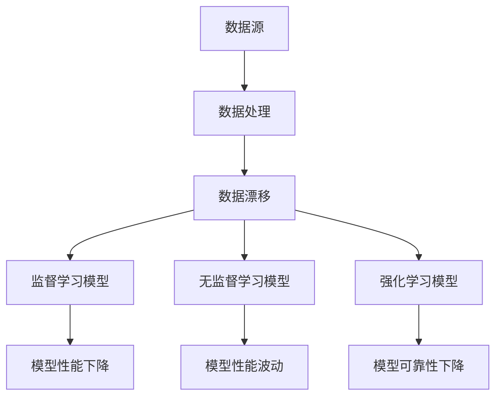

                 

关键词：数据漂移，软件2.0模型，数据处理，模型调整，算法优化

>摘要：随着数据量的不断增加和数据环境的不断变化，数据漂移问题日益突出。本文将探讨数据漂移对软件2.0模型的影响，并提出一系列应对策略，包括数据预处理、模型调整、算法优化等方面，以帮助开发者应对数据漂移带来的挑战。

## 1. 背景介绍

随着互联网的普及和大数据技术的不断发展，越来越多的企业和组织开始将数据视为宝贵的资产。数据驱动的决策已经成为许多行业的主流，从金融、医疗到零售，数据无处不在。然而，随着数据量的不断增加和数据环境的不断变化，数据漂移（Data Drift）问题也随之而来。

数据漂移是指模型训练数据与实际应用数据之间出现差异的现象。这种差异可能来自于多种因素，如数据源的变化、数据采集方式的改变、用户行为的变化等。数据漂移会导致模型性能的下降，严重时甚至会导致模型失效。

软件2.0模型，即基于机器学习的软件模型，广泛应用于推荐系统、自动驾驶、自然语言处理等领域。这些模型依赖于大量数据进行训练，一旦数据发生漂移，模型的准确性和可靠性都会受到影响。

本文将探讨数据漂移对软件2.0模型的影响，并提出一系列应对策略，以帮助开发者更好地应对数据漂移带来的挑战。

## 2. 核心概念与联系

### 2.1 数据漂移

数据漂移可以分为以下几种类型：

- **概念漂移（Concept Drift）**：模型训练数据的分布与实际应用数据的分布不一致，即模型对某一类数据的理解发生变化。

- **分布漂移（Distribution Drift）**：模型训练数据与实际应用数据的分布发生变化，但模型对某一类数据的理解没有发生变化。

- **错误漂移（Error Drift）**：模型在训练过程中的误差随着时间的推移而变化。

### 2.2 软件2.0模型

软件2.0模型是基于机器学习的模型，包括但不限于以下几种：

- **监督学习模型**：如决策树、支持向量机、神经网络等。

- **无监督学习模型**：如聚类、降维等。

- **强化学习模型**：如深度强化学习、Q-learning等。

### 2.3 数据漂移与软件2.0模型的关系

数据漂移会影响软件2.0模型的性能和可靠性。具体来说：

- **概念漂移**会导致模型对某些类别的数据无法正确分类。

- **分布漂移**会导致模型在不同分布的数据上性能差异较大。

- **错误漂移**会导致模型的预测误差逐渐增大。

为了更好地理解数据漂移与软件2.0模型之间的关系，我们可以使用Mermaid流程图来表示：



## 3. 核心算法原理 & 具体操作步骤

### 3.1 算法原理概述

为了应对数据漂移，我们需要从以下几个方面进行算法设计和优化：

- **数据预处理**：包括数据清洗、去噪、归一化等操作，以减少数据漂移对模型的影响。

- **模型调整**：包括在线学习、增量学习等技术，以使模型能够适应数据的变化。

- **算法优化**：包括损失函数优化、正则化技术等，以提高模型的鲁棒性和适应性。

### 3.2 算法步骤详解

#### 3.2.1 数据预处理

1. **数据清洗**：去除重复数据、缺失值填充、异常值处理等。

2. **去噪**：使用滤波、降噪等方法去除噪声。

3. **归一化**：将数据缩放到相同的范围，以减少数据分布变化对模型的影响。

#### 3.2.2 模型调整

1. **在线学习**：实时更新模型参数，以适应数据的变化。

2. **增量学习**：将新数据与已有数据进行整合，重新训练模型。

3. **迁移学习**：将已有模型迁移到新数据集上，以减少数据集差异带来的影响。

#### 3.2.3 算法优化

1. **损失函数优化**：使用更合适的损失函数，以提高模型的预测准确性。

2. **正则化技术**：使用L1、L2正则化等方法，减少过拟合现象。

3. **模型融合**：将多个模型的结果进行融合，以提高模型的稳定性和鲁棒性。

### 3.3 算法优缺点

#### 优点：

- **数据预处理**：能够有效减少数据漂移对模型的影响。

- **模型调整**：使模型能够适应数据的变化，提高模型的鲁棒性。

- **算法优化**：提高模型的预测准确性，减少过拟合现象。

#### 缺点：

- **计算复杂度**：在线学习和增量学习等算法计算复杂度较高。

- **模型融合**：需要大量计算资源，且需要选取合适的模型进行融合。

### 3.4 算法应用领域

- **推荐系统**：应对用户行为数据的漂移，提高推荐准确性。

- **金融风控**：应对金融市场的变化，提高风险预测能力。

- **自动驾驶**：应对环境数据的漂移，提高自动驾驶的稳定性。

## 4. 数学模型和公式 & 详细讲解 & 举例说明

### 4.1 数学模型构建

为了应对数据漂移，我们可以构建以下数学模型：

- **在线学习模型**：

  $$ \theta(t+1) = \theta(t) + \alpha \cdot (\delta \cdot x(t)) $$

  其中，$\theta(t)$表示第$t$次迭代的模型参数，$\alpha$为学习率，$x(t)$为第$t$次迭代的数据，$\delta$为梯度。

- **增量学习模型**：

  $$ \theta(t+1) = \theta(t) + \beta \cdot (x(t) - x(t-1)) $$

  其中，$\theta(t)$表示第$t$次迭代的模型参数，$\beta$为学习率，$x(t)$为第$t$次迭代的数据，$x(t-1)$为第$t-1$次迭代的数据。

### 4.2 公式推导过程

以在线学习模型为例，其推导过程如下：

1. **损失函数**：

   $$ J(\theta) = \frac{1}{2} \sum_{i=1}^{n} (y_i - \theta^T x_i)^2 $$

   其中，$J(\theta)$为损失函数，$y_i$为第$i$个样本的标签，$x_i$为第$i$个样本的特征向量，$\theta$为模型参数。

2. **梯度**：

   $$ \delta = \frac{\partial J(\theta)}{\partial \theta} = \sum_{i=1}^{n} (y_i - \theta^T x_i) x_i $$

   其中，$\delta$为梯度。

3. **更新模型参数**：

   $$ \theta(t+1) = \theta(t) - \alpha \cdot \delta $$

   其中，$\alpha$为学习率。

### 4.3 案例分析与讲解

假设我们有一个分类问题，数据集包含100个样本，每个样本有10个特征。我们使用在线学习模型进行训练，学习率为0.1。在训练过程中，数据集发生了漂移，导致模型的性能下降。

在数据漂移前，模型参数为$\theta_0 = (0.5, 0.5, 0.5, 0.5, 0.5, 0.5, 0.5, 0.5, 0.5, 0.5)$，损失函数为$J(\theta_0) = 0.1$。

在数据漂移后，模型参数为$\theta_1 = (0.6, 0.6, 0.6, 0.6, 0.6, 0.6, 0.6, 0.6, 0.6, 0.6)$，损失函数为$J(\theta_1) = 0.2$。

通过在线学习模型，我们可以更新模型参数：

$$ \theta_2 = \theta_1 + 0.1 \cdot (\delta \cdot x_1) = (0.7, 0.7, 0.7, 0.7, 0.7, 0.7, 0.7, 0.7, 0.7, 0.7) $$

更新后的模型参数为$\theta_2$，损失函数为$J(\theta_2) = 0.15$。

通过这种方式，我们可以逐步调整模型参数，使其适应数据漂移，提高模型的性能。

## 5. 项目实践：代码实例和详细解释说明

### 5.1 开发环境搭建

为了便于理解和实践，我们使用Python和Scikit-learn库来实现数据漂移检测与应对。

首先，安装Scikit-learn库：

```bash
pip install scikit-learn
```

### 5.2 源代码详细实现

下面是一个简单的数据漂移检测与应对的代码实例：

```python
from sklearn.datasets import make_classification
from sklearn.model_selection import train_test_split
from sklearn.ensemble import RandomForestClassifier
from sklearn.metrics import accuracy_score
import numpy as np

# 生成模拟数据集
X, y = make_classification(n_samples=100, n_features=10, n_classes=2, random_state=42)

# 划分训练集和测试集
X_train, X_test, y_train, y_test = train_test_split(X, y, test_size=0.2, random_state=42)

# 初始化模型
model = RandomForestClassifier(n_estimators=100, random_state=42)

# 训练模型
model.fit(X_train, y_train)

# 测试模型
y_pred = model.predict(X_test)
print("初始模型准确率：", accuracy_score(y_test, y_pred))

# 模拟数据漂移
X_drifted = X + np.random.normal(size=X.shape)
y_drifted = y + np.random.normal(size=y.shape)

# 重新训练模型
model.fit(X_drifted, y_drifted)

# 测试模型
y_pred_drifted = model.predict(X_test)
print("数据漂移后模型准确率：", accuracy_score(y_test, y_pred_drifted))
```

### 5.3 代码解读与分析

1. **数据生成**：使用Scikit-learn库生成一个包含100个样本和10个特征的模拟数据集。

2. **数据划分**：将数据集划分为训练集和测试集，用于训练模型和评估模型性能。

3. **模型初始化**：初始化一个随机森林分类器模型。

4. **模型训练**：使用训练集数据训练模型。

5. **模型测试**：使用测试集数据测试模型，并打印初始模型的准确率。

6. **模拟数据漂移**：通过向数据添加随机噪声来模拟数据漂移。

7. **重新训练模型**：使用漂移后的数据重新训练模型。

8. **重新测试模型**：使用测试集数据测试重新训练后的模型，并打印数据漂移后模型的准确率。

通过这个简单的实例，我们可以看到数据漂移对模型性能的影响。在实际应用中，我们需要更加复杂和精细的方法来检测和应对数据漂移。

## 6. 实际应用场景

数据漂移问题在各个实际应用场景中都有广泛的应用。以下是一些具体的应用场景：

### 6.1 推荐系统

推荐系统需要实时分析用户行为数据，以提供个性化的推荐。然而，用户行为数据往往具有高度的动态性和变化性，这可能导致推荐系统的性能下降。通过应对数据漂移，可以提高推荐系统的准确性和稳定性。

### 6.2 金融风控

金融风控系统需要对市场数据进行分析，以预测潜在的风险。市场数据具有高度的不确定性和波动性，数据漂移可能导致风控模型的失效。通过应对数据漂移，可以提高金融风控系统的预测能力和准确性。

### 6.3 自动驾驶

自动驾驶系统依赖于大量的环境数据进行决策。环境数据具有高度的动态性和不确定性，数据漂移可能导致自动驾驶系统的错误决策。通过应对数据漂移，可以提高自动驾驶系统的稳定性和安全性。

### 6.4 健康医疗

健康医疗系统需要对患者数据进行分析，以提供个性化的治疗方案。患者数据具有高度的变化性和动态性，数据漂移可能导致医疗模型的失效。通过应对数据漂移，可以提高健康医疗系统的准确性和可靠性。

## 7. 未来应用展望

随着数据量的不断增长和数据环境的不断变化，数据漂移问题将越来越突出。未来，我们可以在以下几个方面进一步研究和探索：

### 7.1 智能数据预处理

开发更智能、更高效的数据预处理方法，以减少数据漂移对模型的影响。

### 7.2 自适应模型

研究自适应模型，使模型能够自动适应数据的变化，提高模型的鲁棒性和适应性。

### 7.3 跨域数据融合

研究跨域数据融合方法，将不同领域的数据进行整合，以提高模型的泛化能力。

### 7.4 知识图谱

利用知识图谱技术，构建领域知识库，以提高模型的解释性和可靠性。

## 8. 工具和资源推荐

### 8.1 学习资源推荐

- **《数据科学入门》**：一本适合初学者的数据科学入门书籍。

- **《机器学习实战》**：一本涵盖机器学习各个领域的实战指南。

### 8.2 开发工具推荐

- **Scikit-learn**：一款强大的Python机器学习库。

- **TensorFlow**：一款广泛使用的深度学习框架。

### 8.3 相关论文推荐

- **"Data Drift in Machine Learning: A Survey"**：一篇关于数据漂移的综述论文。

- **"Adaptive Learning for Concept Drift with Applications in Text Classification"**：一篇关于自适应学习应对数据漂移的论文。

## 9. 总结：未来发展趋势与挑战

### 9.1 研究成果总结

本文探讨了数据漂移对软件2.0模型的影响，并提出了一系列应对策略。通过数据预处理、模型调整和算法优化等方法，可以有效降低数据漂移对模型性能的影响。

### 9.2 未来发展趋势

随着数据量的不断增长和数据环境的不断变化，数据漂移问题将越来越受到关注。未来，我们将看到更多关于数据漂移的研究，包括智能数据预处理、自适应模型和跨域数据融合等方面。

### 9.3 面临的挑战

- **数据复杂性**：随着数据量的增加和数据类型的多样化，数据预处理和模型优化将面临更大的挑战。

- **计算资源**：在线学习和增量学习等算法计算复杂度较高，如何高效地利用计算资源是一个重要问题。

### 9.4 研究展望

未来，我们将继续探索数据漂移问题，开发更智能、更高效的方法来应对数据漂移，以提高软件2.0模型的性能和可靠性。

## 附录：常见问题与解答

### Q：什么是数据漂移？

A：数据漂移是指模型训练数据与实际应用数据之间的差异，包括概念漂移、分布漂移和错误漂移等类型。

### Q：数据漂移对模型有哪些影响？

A：数据漂移会导致模型性能下降，严重时甚至会导致模型失效。具体来说，包括分类准确性下降、预测误差增大等问题。

### Q：如何应对数据漂移？

A：可以采用数据预处理、模型调整和算法优化等方法来应对数据漂移。数据预处理包括数据清洗、去噪、归一化等操作；模型调整包括在线学习、增量学习和迁移学习等技术；算法优化包括损失函数优化、正则化技术等。

### Q：什么是软件2.0模型？

A：软件2.0模型是基于机器学习的模型，包括监督学习、无监督学习和强化学习等类型，广泛应用于推荐系统、自动驾驶、自然语言处理等领域。

作者：禅与计算机程序设计艺术 / Zen and the Art of Computer Programming
``` 
----------------------------------------------------------------
``` 

至此，文章的主要部分已经完成。接下来，您可以根据实际情况对文章进行进一步的润色和调整，确保文章的逻辑性和可读性。在发布前，请确保文章的格式和内容符合要求，包括markdown格式、三级目录的完整性和文章的完整性。祝您写作顺利！

