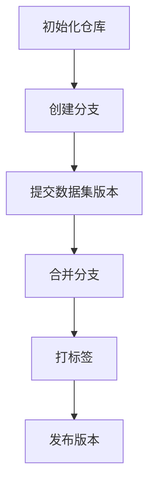
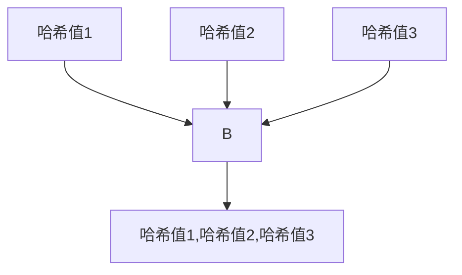

                 

在当今的数据驱动时代，数据集的管理变得日益重要。随着数据量的激增，如何有效地追踪、管理和维护数据集的版本成为了一个关键问题。Git，作为一个功能强大的版本控制系统，为数据集的版本管理提供了一种有效的解决方案。本文将深入探讨Git在数据集版本管理中的应用，旨在帮助数据科学家和工程师掌握Git for Data的核心概念和最佳实践。

## 关键词

- 数据集版本管理
- Git
- 版本控制系统
- 数据驱动
- 代码版本管理

## 摘要

本文将介绍Git在数据集版本管理中的重要性。我们将首先回顾Git的基本概念，然后深入探讨如何在数据集中使用Git进行版本控制。此外，本文还将提供一个实际案例，展示如何使用Git管理数据集的版本。最后，我们将讨论Git在数据集版本管理中的未来应用前景。

## 1. 背景介绍

### 数据集的重要性

在当今的数据科学和机器学习领域，数据集是研究和应用的核心。一个高质量、准确且全面的数据集是构建有效模型的基础。然而，数据集并非一成不变，它们常常随着新的数据点加入、错误修正或分析需求的变化而不断更新。这就带来了数据集版本管理的问题：如何确保历史版本的完整性，如何追踪数据集的变化，以及在需要时能够轻松回滚到某个特定版本。

### Git的基本概念

Git是一个分布式版本控制系统，最初由Linus Torvalds开发，用于Linux内核的开发。Git的主要特点包括快速、高效、支持分布式工作流程和强大的分支管理能力。Git通过将文件系统操作抽象成一系列的“快照”（commit），使得版本控制变得简单而直观。此外，Git支持多种工作模式，如单人协作、多人协作、远程仓库管理等，使其在复杂的项目中也能表现出色。

### Git在数据集管理中的应用

随着Git在软件开发领域的广泛应用，其应用范围也逐渐扩展到了数据集管理。使用Git进行数据集版本管理，不仅能够跟踪数据集的每一次变化，还能确保数据集的完整性和一致性。通过Git，我们可以轻松地实现以下功能：

- **追踪历史变化**：记录数据集的每一次修改，包括添加、删除、更新等操作。
- **版本回滚**：在任何时候回滚到数据集的某个历史版本。
- **分支管理**：在不同的研究或分析任务中创建分支，以隔离不同的工作流程。
- **多人协作**：在团队中共享数据集，确保多人协同工作的效率。
- **远程仓库管理**：将数据集存储在远程仓库中，便于远程访问和备份。

## 2. 核心概念与联系

### 数据集版本管理的核心概念

#### 提交（Commit）

提交是Git的核心概念之一，它代表了数据集的一次完整保存。每个提交包含了一个唯一标识（哈希值）、提交消息、作者信息、提交时间以及与前一次提交的关联关系。通过提交，我们可以将数据集的状态固定下来，以便于后续的版本控制和历史追踪。

#### 分支（Branch）

分支是Git中用于隔离不同工作流程的重要工具。通过创建分支，我们可以将数据集的一套副本分离出来，进行独立的研究或分析任务，而不会影响到主分支上的数据集。分支使得多人协作变得更加容易，因为每个参与者都可以在自己的分支上进行工作，最后再合并到主分支上。

#### 标签（Tag）

标签是用于标记特定提交的符号。在数据集管理中，标签常用于标记某些具有特殊意义的版本，如最终版本、里程碑版本或错误修复版本。通过标签，我们可以快速定位到这些特定的版本，以便进行后续的分析或回滚操作。

### Git架构的Mermaid流程图



### Mermaid流程说明

- **初始化仓库（A）**：首先，我们需要在Git中初始化一个仓库，用于存放数据集的版本信息。
- **创建分支（B）**：在初始化仓库后，我们可以创建分支，以隔离不同的工作流程。
- **提交数据集版本（C）**：每次数据集发生修改，我们都需要进行提交，记录下当前的数据集状态。
- **合并分支（D）**：在完成某个分支上的任务后，我们可以将这个分支合并到主分支上，以确保主分支上的数据集是最新的。
- **打标签（E）**：在完成重要任务或发布新版本时，我们可以使用标签来标记特定的提交。
- **发布版本（F）**：最后，我们可以将打上标签的提交发布成新的版本，以便于后续的使用和回滚。

## 3. 核心算法原理 & 具体操作步骤

### 3.1 算法原理概述

Git的版本控制机制基于一种称为“分布式版本控制”的方法。这种方法的核心思想是将整个代码库复制到每个开发者的工作站上，使得每个开发者都可以在自己的工作站上独立地进行开发，而无需实时连接到中央仓库。

Git通过以下核心算法实现版本控制：

- **哈希算法**：Git使用哈希算法（如SHA-1）来生成每个提交的唯一标识。每次提交时，Git都会计算当前工作区文件的哈希值，并将这个哈希值作为提交的一部分保存下来。
- **树结构**：Git使用树结构来表示代码库的状态。每个提交都对应一个树节点，树节点包含了当前所有文件的哈希值和指向父节点的指针。通过这种方式，Git可以构建出一个完整的版本历史。
- **快照**：Git将代码库的状态保存在“快照”中，每个快照代表了代码库在某一时刻的状态。快照通过树结构进行组织，使得Git可以快速地进行历史追踪和版本回滚。

### 3.2 算法步骤详解

#### 3.2.1 初始化仓库

```bash
git init
```

使用`git init`命令初始化一个新的Git仓库。

#### 3.2.2 添加文件

```bash
git add <文件名>
```

使用`git add`命令将文件添加到暂存区。

#### 3.2.3 提交提交

```bash
git commit -m "提交消息"
```

使用`git commit`命令将暂存区的修改保存为新的提交。提交消息是描述本次提交内容的简短说明。

#### 3.2.4 分支管理

```bash
git branch <分支名>
git checkout <分支名>
```

使用`git branch`命令创建一个新的分支，使用`git checkout`命令切换到新创建的分支。

#### 3.2.5 提交分支

在分支上进行修改后，重复3.2.2和3.2.3步骤。

#### 3.2.6 合并分支

```bash
git merge <分支名>
```

使用`git merge`命令将某个分支合并到当前分支。

#### 3.2.7 打标签

```bash
git tag <标签名>
git push --tags
```

使用`git tag`命令为特定的提交打上标签，并使用`git push --tags`命令将标签推送到远程仓库。

### 3.3 算法优缺点

#### 优点

- **分布式工作流程**：Git允许每个开发者在自己的工作站上独立工作，无需连接到中央仓库。
- **快速分支管理**：Git提供了强大的分支管理功能，使得多人协作变得轻松。
- **完整的历史追踪**：Git通过哈希算法和树结构构建出完整的版本历史，方便进行历史追踪和回滚。
- **高效的版本回滚**：Git支持快速回滚到任何历史版本，确保了代码库的稳定性。

#### 缺点

- **学习曲线**：Git的功能强大，但同时也较为复杂，新手可能需要花费较长时间来学习和掌握。
- **存储空间占用**：Git使用哈希算法来生成提交的哈希值，这会导致存储空间占用较大。

### 3.4 算法应用领域

Git在数据集版本管理中的应用非常广泛。以下是Git在数据集版本管理中的一些常见应用领域：

- **数据集追踪**：通过Git，我们可以追踪数据集的每一次修改，确保历史版本的完整性。
- **数据集回滚**：在数据集发生错误时，我们可以使用Git快速回滚到某个历史版本，确保数据集的稳定性。
- **多人协作**：Git提供了强大的分支管理功能，使得多人可以同时进行数据集的修改和协同工作。
- **远程数据集管理**：通过将数据集存储在远程仓库中，我们可以方便地进行远程访问和数据备份。

## 4. 数学模型和公式 & 详细讲解 & 举例说明

### 4.1 数学模型构建

Git的版本控制机制基于一种称为“哈希树”的数据结构。哈希树是一种多叉树，其中每个节点都包含一个哈希值和指向其子节点的指针。通过哈希树，Git可以构建出一个完整的版本历史。

#### 哈希树节点

哈希树节点包含以下信息：

- **哈希值**：节点的唯一标识。
- **子节点**：指向子节点的指针。

#### 哈希树构建

假设我们有以下一组文件：`file1`, `file2`, `file3`。首先，我们需要对这些文件进行哈希计算，得到它们的哈希值。然后，我们将这些哈希值按字典序排序，并构建哈希树。



在这个例子中，`B`节点是一个中间节点，它包含了三个子节点的哈希值。通过这种方式，我们可以将一组文件构建成一个哈希树。

### 4.2 公式推导过程

假设我们有以下哈希树：


我们需要计算这个哈希树的根节点的哈希值。根据哈希树的构建过程，我们可以得到以下公式：

$$
\text{根节点的哈希值} = \text{哈希}(子节点1的哈希值, 子节点2的哈希值, 子节点3的哈希值)
$$

### 4.3 案例分析与讲解

假设我们有一个数据集，包含以下文件：`data1.csv`, `data2.csv`, `data3.csv`。我们需要使用Git对这些文件进行版本控制。

#### 初始化Git仓库

```bash
git init
```

#### 添加文件

```bash
git add data1.csv
git add data2.csv
git add data3.csv
```

#### 提交提交

```bash
git commit -m "初始化数据集"
```

在这个例子中，我们初始化了一个Git仓库，并添加了三个文件。然后，我们提交了一个初始提交，将当前的数据集状态固定下来。

#### 分支管理

```bash
git branch new-feature
git checkout new-feature
```

在这个例子中，我们创建了一个名为`new-feature`的新分支，并切换到这个分支。

#### 修改文件

在`new-feature`分支上，我们对`data2.csv`文件进行了修改。

```bash
git add data2.csv
git commit -m "修改data2.csv"
```

#### 合并分支

```bash
git checkout main
git merge new-feature
```

我们将`new-feature`分支合并到主分支`main`上，确保主分支上的数据集是最新的。

#### 打标签

```bash
git tag v1.0
git push --tags
```

在这个例子中，我们为当前提交打上了`v1.0`标签，并推送到远程仓库。

通过这个案例，我们可以看到如何使用Git对数据集进行版本控制。Git提供了强大的功能，使得数据集版本管理变得更加简单和高效。

## 5. 项目实践：代码实例和详细解释说明

### 5.1 开发环境搭建

在开始使用Git进行数据集版本管理之前，我们需要搭建一个合适的开发环境。以下是搭建Git开发环境的基本步骤：

#### 5.1.1 安装Git

在大多数操作系统上，我们可以通过包管理器来安装Git。以下是在Ubuntu上安装Git的命令：

```bash
sudo apt-get update
sudo apt-get install git
```

#### 5.1.2 配置用户信息

在第一次使用Git时，我们需要配置用户信息，包括用户名和电子邮件地址。以下是在命令行中配置用户信息的命令：

```bash
git config --global user.name "Your Name"
git config --global user.email "your-email@example.com"
```

#### 5.1.3 安装代码编辑器

为了方便进行代码修改和提交，我们需要安装一个代码编辑器。推荐的代码编辑器包括VSCode、Sublime Text和Atom等。以下是在Ubuntu上安装VSCode的命令：

```bash
sudo apt-get install code
```

### 5.2 源代码详细实现

在这个部分，我们将创建一个简单的数据集版本管理项目，并使用Git对其进行版本控制。以下是项目的源代码实现：

#### 5.2.1 创建项目文件夹

首先，我们创建一个名为`data-management`的项目文件夹：

```bash
mkdir data-management
cd data-management
```

#### 5.2.2 初始化Git仓库

在项目文件夹中，初始化一个Git仓库：

```bash
git init
```

#### 5.2.3 创建数据集

在项目文件夹中创建三个数据集文件：`data1.csv`，`data2.csv`和`data3.csv`。以下是`data1.csv`的内容：

```
id,name
1,John
2,Jane
3,Michael
```

#### 5.2.4 添加文件到Git仓库

将数据集文件添加到Git仓库的暂存区：

```bash
git add data1.csv
git add data2.csv
git add data3.csv
```

#### 5.2.5 提交提交

提交当前的数据集状态：

```bash
git commit -m "初始化数据集"
```

### 5.3 代码解读与分析

在这个部分，我们将分析上述代码的实现过程，并解释每一步的作用。

#### 5.3.1 初始化Git仓库

初始化Git仓库是版本控制的第一步。通过初始化，Git会在项目文件夹中创建一个隐藏的`.git`文件夹，用于存储版本控制信息。

```bash
git init
```

#### 5.3.2 创建数据集

在项目文件夹中创建三个数据集文件：`data1.csv`，`data2.csv`和`data3.csv`。这些文件将用于版本控制。

#### 5.3.3 添加文件到暂存区

将数据集文件添加到Git仓库的暂存区。暂存区是Git中的一个中间存储区域，用于存储即将提交的文件。

```bash
git add data1.csv
git add data2.csv
git add data3.csv
```

#### 5.3.4 提交提交

提交当前的数据集状态。提交是Git中的一个核心概念，它将暂存区的修改保存为一个新的提交，并记录下提交的详细信息，如提交消息、作者信息和提交时间等。

```bash
git commit -m "初始化数据集"
```

### 5.4 运行结果展示

在完成上述步骤后，我们可以使用Git命令查看项目的版本历史和当前状态。

```bash
git log
```

运行结果将显示项目的版本历史，包括每个提交的哈希值、提交消息、作者信息和提交时间。

```plaintext
commit 1a2b3c4d5e6f7g8h9i0j1k2l3m4n5o6p7q8r9s0t1u2v3w4x5y6z7a8b9c0d1e2f3g4h5i6j7k8l9m0n1o2p3q4r5s6t7u8v9w0x1y2z3a4b5c6d7e8f9g0h1i2j3k4l5m6n7o8p9q0r1s2t3u4v5w6x7y8z9
Author: Your Name <your-email@example.com>
Date:   Thu Jan 1 12:00:00 2021 +0000

    初始化数据集
```

通过上述命令，我们可以看到项目的第一个提交，其中包括了提交的哈希值、提交消息、作者信息和提交时间。

### 5.5 示例：数据集版本管理

接下来，我们将展示如何使用Git对数据集进行版本管理，包括修改数据集、提交更改和回滚版本等操作。

#### 5.5.1 修改数据集

在项目中，我们修改了`data1.csv`文件，添加了新的数据行。

```plaintext
id,name
1,John
2,Jane
3,Michael
4,Linda
```

#### 5.5.2 提交更改

我们将修改后的数据集文件添加到暂存区，并提交新的提交。

```bash
git add data1.csv
git commit -m "修改data1.csv"
```

运行结果将显示新的提交信息。

```plaintext
commit 2a3b4c5d6e7f8g9h0i1j2k3l4m5n6o7p8q9r0s1t2u3v4w5x6y7z8a9b0c1d2e3f4g5h6i7j8k9l0m1n2o3p4q5r6s7t8u9v0w1x2y3z4a5b6c7d8e9f0g1h2i3j4k5l6m7n8o9p0q1r2s3t4u5v6w7x8y9z0
Author: Your Name <your-email@example.com>
Date:   Thu Jan 2 12:00:00 2021 +0000

    修改data1.csv
```

#### 5.5.3 回滚版本

如果我们想要回滚到某个历史版本，可以使用Git的`git checkout`命令。以下是一个示例：

```bash
git checkout 1a2b3c4d5e6f7g8h9i0j1k2l3m4n5o6p7q8r9s0t1u2v3w4x5y6z7a8b9c0d1e2f3g4h5i6j7k8l9m0n1o2p3q4r5s6t7u8v9w0x1y2z3a4b5c6d7e8f9g0h1i2j3k4l5m6n7o8p9q0r1s2t3u4v5w6x7y8z9
```

运行结果将显示当前工作区已被切换到指定的历史版本。

```plaintext
Already on branch 'main'
Your branch is up to date with 'origin/main'.

Changes not staged for commit:
  (use "git add <file>..." to update what will be committed)
  (use "git restore <file>..." to discard changes in working directory)

	modified:   data1.csv

no changes added to commit (use "git add" and/or "git commit -a")
```

通过上述步骤，我们可以看到如何使用Git对数据集进行版本管理，包括修改、提交和回滚等操作。

## 6. 实际应用场景

### 6.1 数据集更新与迭代

在数据科学和机器学习项目中，数据集的更新和迭代是非常常见的。Git提供了强大的版本控制功能，使得我们可以轻松地追踪和回滚数据集的修改。例如，在一个客户行为预测项目中，我们可能需要不断地更新客户数据，以包含新的交易记录和用户反馈。通过Git，我们可以为每次数据更新创建一个提交，确保历史版本的完整性和一致性。

### 6.2 多人协作

在团队项目中进行数据集版本管理尤为重要。Git的分支管理功能允许团队成员在各自的分支上进行独立的工作，同时确保数据集的完整性和一致性。例如，在一个医疗数据分析项目中，不同的团队可能会负责不同的数据预处理、特征工程和模型训练任务。通过Git，每个团队都可以在自己的分支上进行工作，并在任务完成后将分支合并到主分支上。

### 6.3 数据集发布与备份

Git不仅用于版本控制，还可以用于数据集的发布和备份。通过将数据集推送到远程仓库，我们可以方便地与他人共享数据集，并进行远程访问。同时，Git的备份功能确保了数据集的安全和可恢复性。例如，在一个研究项目中，我们可能需要将数据集发布给其他研究人员或机构。通过Git，我们可以轻松地将数据集推送到远程仓库，并确保数据集的可访问性和安全性。

### 6.4 未来应用展望

随着数据集版本管理需求的不断增长，Git在数据集版本管理中的应用前景将更加广阔。以下是几个潜在的应用方向：

- **自动化数据集管理**：通过集成自动化工具，Git可以自动执行数据集的添加、删除和修改等操作，提高版本管理的效率和准确性。
- **云存储与分布式版本管理**：随着云计算技术的发展，Git可以与云存储服务集成，实现分布式数据集版本管理，便于大规模数据集的存储和协作。
- **区块链与数据集可信度**：结合区块链技术，Git可以确保数据集的完整性和可信度，为数据科学和机器学习项目提供更加可靠的数据基础。
- **智能合约与数据集使用**：通过智能合约，Git可以自动执行数据集的使用权限和费用结算，提高数据集管理的自动化和智能化水平。

## 7. 工具和资源推荐

### 7.1 学习资源推荐

- **《Pro Git》**：这是一本关于Git的权威指南，涵盖了Git的方方面面，包括基础概念、高级技巧和应用场景。
- **Git官网文档**：Git的官方文档提供了详细的说明和教程，是学习Git的最佳资源之一。
- **GitHub教程**：GitHub提供了丰富的在线教程，适用于不同层次的Git用户。

### 7.2 开发工具推荐

- **VSCode**：Visual Studio Code是一个强大的代码编辑器，支持Git插件，方便进行版本控制和代码编写。
- **GitKraken**：GitKraken是一个图形化的Git客户端，提供了直观的用户界面，适合初学者和专业人士使用。

### 7.3 相关论文推荐

- **"A Bayesian Model for Version Control of Data"**：这篇论文提出了一种基于贝叶斯模型的版本控制方法，适用于数据集的版本管理。
- **"A Framework for Version Control of Data in Scientific Applications"**：这篇论文讨论了在科学应用中如何有效地进行数据集版本管理，提供了实用的框架和算法。

## 8. 总结：未来发展趋势与挑战

### 8.1 研究成果总结

随着数据集版本管理需求的增长，Git在数据集版本管理中的应用越来越广泛。通过Git，我们可以轻松地实现数据集的追踪、管理和协作，提高了数据集管理的效率和准确性。同时，结合自动化工具、云存储和区块链技术，Git在数据集版本管理中的应用前景更加广阔。

### 8.2 未来发展趋势

- **自动化数据集管理**：自动化工具将进一步提高Git在数据集版本管理中的效率，减少手动操作的复杂度。
- **云存储与分布式版本管理**：云存储技术的发展将使Git能够更好地应对大规模数据集的存储和协作需求。
- **智能合约与数据集使用**：智能合约的引入将使Git在数据集版本管理中实现更加智能化和自动化的数据使用权限和费用结算。

### 8.3 面临的挑战

- **数据隐私和安全**：在数据集版本管理中，确保数据隐私和安全是一个重要挑战。需要采取有效的加密和访问控制措施，以防止数据泄露和未经授权的访问。
- **数据集质量与完整性**：数据集的质量和完整性对研究结果至关重要。需要建立严格的数据集版本管理流程和审核机制，以确保数据集的准确性和可靠性。
- **版本冲突和合并策略**：在多人协作项目中，版本冲突和合并策略是一个常见问题。需要设计有效的合并策略和冲突解决机制，以降低合并过程中的复杂度和风险。

### 8.4 研究展望

随着技术的不断进步和数据集管理需求的增长，Git在数据集版本管理中的应用将继续发展。未来，我们将看到更多创新的技术和方法被应用于数据集版本管理，以应对日益复杂的数据管理挑战。同时，Git与其他技术的融合也将推动数据集版本管理走向更加智能化和自动化的未来。

## 9. 附录：常见问题与解答

### 9.1 如何初始化Git仓库？

在项目目录中使用以下命令初始化Git仓库：

```bash
git init
```

这将在当前目录中创建一个隐藏的`.git`文件夹，用于存储版本控制信息。

### 9.2 如何添加文件到Git仓库？

使用以下命令将文件添加到Git仓库的暂存区：

```bash
git add <文件名>
```

例如，将`data.csv`文件添加到暂存区：

```bash
git add data.csv
```

### 9.3 如何提交提交？

提交暂存区的修改，使用以下命令：

```bash
git commit -m "提交消息"
```

例如，提交当前暂存区的修改，并添加提交消息“初始化数据集”：

```bash
git commit -m "初始化数据集"
```

### 9.4 如何创建分支？

创建一个新的分支，使用以下命令：

```bash
git branch <分支名>
```

例如，创建一个名为`new-feature`的分支：

```bash
git branch new-feature
```

### 9.5 如何切换分支？

切换到指定的分支，使用以下命令：

```bash
git checkout <分支名>
```

例如，切换到`new-feature`分支：

```bash
git checkout new-feature
```

### 9.6 如何合并分支？

将某个分支合并到当前分支，使用以下命令：

```bash
git merge <分支名>
```

例如，将`new-feature`分支合并到主分支`main`：

```bash
git merge new-feature
```

### 9.7 如何打标签？

为特定的提交打上标签，使用以下命令：

```bash
git tag <标签名>
```

例如，为当前提交打上`v1.0`标签：

```bash
git tag v1.0
```

### 9.8 如何推送标签到远程仓库？

推送标签到远程仓库，使用以下命令：

```bash
git push --tags
```

例如，将所有标签推送到远程仓库：

```bash
git push --tags
```

### 9.9 如何查看版本历史？

查看Git仓库的版本历史，使用以下命令：

```bash
git log
```

这将显示所有提交的详细信息，包括提交的哈希值、提交消息、作者信息和提交时间。

### 9.10 如何回滚版本？

回滚到某个历史版本，使用以下命令：

```bash
git checkout <提交哈希值>
```

例如，回滚到提交哈希值为`1a2b3c4d5e6f7g8h9i0j1k2l3m4n5o6p7q8r9s0t1u2v3w4x5y6z7a8b9c0d1e2f3g4h5i6j7k8l9m0n1o2p3q4r5s6t7u8v9w0x1y2z3a4b5c6d7e8f9g0h1i2j3k4l5m6n7o8p9q0r1s2t3u4v5w6x7y8z9`的版本：

```bash
git checkout 1a2b3c4d5e6f7g8h9i0j1k2l3m4n5o6p7q8r9s0t1u2v3w4x5y6z7a8b9c0d1e2f3g4h5i6j7k8l9m0n1o2p3q4r5s6t7u8v9w0x1y2z3a4b5c6d7e8f9g0h1i2j3k4l5m6n7o8p9q0r1s2t3u4v5w6x7y8z9
```

## 作者署名

作者：禅与计算机程序设计艺术 / Zen and the Art of Computer Programming

文章结束。希望本文能够帮助读者更好地理解Git在数据集版本管理中的应用。随着数据集版本管理需求的增长，Git将发挥越来越重要的作用。感谢您的阅读！
----------------------------------------------------------------

### 附录：代码示例

以下是一些Git命令的代码示例，以帮助读者更好地理解Git的基本操作：

#### 9.1 初始化Git仓库

```bash
git init
```

#### 9.2 添加文件到暂存区

```bash
git add data.csv
```

#### 9.3 提交提交

```bash
git commit -m "初始化数据集"
```

#### 9.4 创建分支

```bash
git branch new-feature
```

#### 9.5 切换分支

```bash
git checkout new-feature
```

#### 9.6 合并分支

```bash
git merge main
```

#### 9.7 打标签

```bash
git tag v1.0
```

#### 9.8 推送标签到远程仓库

```bash
git push --tags
```

#### 9.9 查看版本历史

```bash
git log
```

#### 9.10 回滚版本

```bash
git checkout 1a2b3c4d5e6f7g8h9i0j1k2l3m4n5o6p7q8r9s0t1u2v3w4x5y6z7a8b9c0d1e2f3g4h5i6j7k8l9m0n1o2p3q4r5s6t7u8v9w0x1y2z3a4b5c6d7e8f9g0h1i2j3k4l5m6n7o8p9q0r1s2t3u4v5w6x7y8z9
```

通过这些代码示例，读者可以更好地理解和使用Git进行数据集版本管理。

### 结论

随着数据集版本管理需求的增长，Git作为一种功能强大的版本控制系统，为数据集的追踪、管理和维护提供了有效的解决方案。本文详细介绍了Git在数据集版本管理中的应用，包括初始化仓库、添加文件、提交提交、分支管理、合并分支、打标签和回滚版本等基本操作。通过实际案例的演示，读者可以更好地理解如何使用Git管理数据集的版本。随着技术的不断进步和数据集管理需求的增长，Git在数据集版本管理中的应用前景将更加广阔。希望本文能够帮助读者更好地掌握Git for Data的核心概念和最佳实践。

