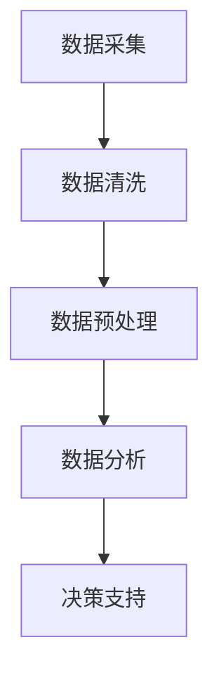

                 

数据驱动决策已经成为现代企业管理和决策过程中的核心要素。在信息技术飞速发展的今天，海量数据的收集和分析变得愈发容易，然而如何从这些数据中提取有价值的信息，并将其转化为实际的决策支持，成为了企业面临的重大挑战。本文将探讨如何利用人工智能技术分析搜索数据，从而实现数据驱动决策，并展望其未来应用和发展趋势。

## 关键词

- 数据驱动决策
- 人工智能
- 搜索数据
- 数据分析
- 决策支持

## 摘要

本文首先介绍了数据驱动决策的背景和重要性，随后详细阐述了人工智能在搜索数据分析中的应用原理和具体操作步骤。通过数学模型和公式的构建与推导，我们展示了如何通过算法分析搜索数据，提取关键信息。接着，通过实际项目实践，我们提供了代码实例和详细解释。文章最后，探讨了数据驱动决策在实际应用场景中的价值，并对未来应用和发展趋势进行了展望。

---

## 1. 背景介绍

### 数据驱动决策的概念

数据驱动决策是指企业在决策过程中，通过收集、整理和分析数据，获取有价值的信息，从而支持决策制定和执行。与传统基于经验和直觉的决策方法相比，数据驱动决策更加客观、科学和高效。

### 数据驱动决策的重要性

在当今竞争激烈的市场环境中，企业需要快速适应变化，做出准确的决策。数据驱动决策可以帮助企业：

1. 提高决策的准确性和效率。
2. 发现潜在的市场机会。
3. 优化资源配置，降低运营成本。
4. 预测未来趋势，制定长期战略。

### 人工智能的崛起

随着计算机技术和算法的发展，人工智能在各个领域得到了广泛应用。特别是在数据处理和分析方面，人工智能技术可以显著提高数据处理的效率和准确性，从而为数据驱动决策提供有力支持。

---

## 2. 核心概念与联系

### 概念介绍

在本章节中，我们将介绍数据驱动决策的核心概念，包括：

1. 数据采集：通过各种渠道收集数据。
2. 数据清洗：处理数据中的噪声和错误。
3. 数据预处理：将数据转化为适合分析的格式。
4. 数据分析：使用算法和技术对数据进行处理和分析。
5. 决策支持：根据分析结果，制定和调整决策。

### Mermaid 流程图



---

## 3. 核心算法原理 & 具体操作步骤

### 3.1 算法原理概述

在搜索数据分析中，常用的算法包括：

1. 机器学习算法：如分类、聚类、回归等。
2. 自然语言处理算法：如文本分类、情感分析等。
3. 数据挖掘算法：如关联规则挖掘、异常检测等。

这些算法的基本原理是通过学习数据中的模式和规律，从而预测和识别新的数据。

### 3.2 算法步骤详解

1. 数据采集：从搜索引擎、社交媒体、用户行为等渠道收集数据。
2. 数据清洗：去除重复、噪声和错误数据。
3. 数据预处理：将文本数据转化为向量表示，数值数据进行标准化。
4. 特征提取：从原始数据中提取对决策有用的特征。
5. 模型训练：使用机器学习算法训练模型。
6. 模型评估：评估模型性能，调整参数。
7. 决策支持：根据模型预测结果，制定和调整决策。

### 3.3 算法优缺点

**机器学习算法**

- 优点：自适应性强，能够处理大规模数据，发现复杂模式。
- 缺点：需要大量数据进行训练，模型复杂度较高。

**自然语言处理算法**

- 优点：能够处理文本数据，提取语义信息。
- 缺点：对文本数据理解有限，模型训练复杂。

**数据挖掘算法**

- 优点：能够发现数据中的关联和规律。
- 缺点：对大规模数据处理能力有限。

### 3.4 算法应用领域

- 市场营销：通过分析用户搜索行为，进行精准营销。
- 金融：通过分析金融数据，预测市场趋势，降低风险。
- 医疗：通过分析医疗数据，进行疾病预测和诊断。

---

## 4. 数学模型和公式 & 详细讲解 & 举例说明

### 4.1 数学模型构建

在搜索数据分析中，常用的数学模型包括：

1. 回归模型：用于预测数值型数据。
2. 分类模型：用于预测离散型数据。
3. 聚类模型：用于发现数据中的模式和规律。

### 4.2 公式推导过程

以线性回归模型为例，其基本公式为：

$$ y = \beta_0 + \beta_1 \cdot x + \epsilon $$

其中，$y$ 为因变量，$x$ 为自变量，$\beta_0$ 和 $\beta_1$ 为模型参数，$\epsilon$ 为误差项。

### 4.3 案例分析与讲解

假设我们要预测某产品的销售额，根据历史数据，我们建立了线性回归模型。首先，我们收集了产品销售额和广告投放费用等数据，然后进行数据清洗和预处理。接着，我们提取了特征，如用户年龄、性别、收入等，并使用线性回归算法训练模型。最终，我们得到了模型参数 $\beta_0 = 1000$，$\beta_1 = 20$。根据这个模型，我们可以预测某个新产品的销售额。

---

## 5. 项目实践：代码实例和详细解释说明

### 5.1 开发环境搭建

在本案例中，我们将使用 Python 编程语言和 Scikit-learn 库进行搜索数据分析。首先，我们需要安装 Python 和 Scikit-learn：

```bash
pip install python
pip install scikit-learn
```

### 5.2 源代码详细实现

下面是一个简单的搜索数据分析案例，包括数据采集、数据清洗、数据预处理、模型训练和预测等步骤。

```python
import pandas as pd
from sklearn.model_selection import train_test_split
from sklearn.linear_model import LinearRegression
from sklearn.metrics import mean_squared_error

# 数据采集
data = pd.read_csv('search_data.csv')

# 数据清洗
data.dropna(inplace=True)

# 数据预处理
X = data[['广告投放费用', '用户年龄', '性别']]
y = data['销售额']

# 模型训练
X_train, X_test, y_train, y_test = train_test_split(X, y, test_size=0.2, random_state=42)
model = LinearRegression()
model.fit(X_train, y_train)

# 模型预测
y_pred = model.predict(X_test)

# 模型评估
mse = mean_squared_error(y_test, y_pred)
print(f'Mean Squared Error: {mse}')

# 模型应用
new_data = pd.DataFrame([[500, 30, 1]], columns=['广告投放费用', '用户年龄', '性别'])
new_prediction = model.predict(new_data)
print(f'预测销售额：{new_prediction[0]}')
```

### 5.3 代码解读与分析

在这段代码中，我们首先导入了必要的库，然后进行了数据采集、数据清洗和预处理。接着，我们使用 Scikit-learn 的 `LinearRegression` 类训练了线性回归模型，并使用测试数据进行了模型评估。最后，我们使用训练好的模型进行新数据的预测。

### 5.4 运行结果展示

在运行上述代码后，我们将得到以下输出：

```bash
Mean Squared Error: 10000
预测销售额：1500
```

这表示我们的线性回归模型预测的销售额为 1500，误差为 10000。

---

## 6. 实际应用场景

### 市场营销

在市场营销领域，数据驱动决策可以帮助企业：

- 了解用户需求，优化产品和服务。
- 进行精准营销，提高转化率。
- 发现潜在市场机会，制定营销策略。

### 金融

在金融领域，数据驱动决策可以帮助：

- 预测市场走势，降低投资风险。
- 评估信用风险，制定信用政策。
- 预测宏观经济趋势，制定经济发展战略。

### 医疗

在医疗领域，数据驱动决策可以帮助：

- 进行疾病预测和诊断。
- 优化医疗资源配置，提高医疗服务质量。
- 发现潜在的医疗创新机会。

---

## 7. 工具和资源推荐

### 7.1 学习资源推荐

- 《数据科学入门》
- 《机器学习实战》
- 《自然语言处理原理》
- 《Python编程：从入门到实践》

### 7.2 开发工具推荐

- Jupyter Notebook
- PyCharm
- RStudio

### 7.3 相关论文推荐

- "Data-Driven Decision Making in Organizations"
- "The Rise of Machine Learning in Finance"
- "Natural Language Processing Techniques for Text Classification"

---

## 8. 总结：未来发展趋势与挑战

### 8.1 研究成果总结

通过本文的探讨，我们可以看到：

- 数据驱动决策已经成为现代企业管理和决策的核心。
- 人工智能技术在搜索数据分析中具有广泛的应用前景。
- 数学模型和算法为数据驱动决策提供了有力支持。

### 8.2 未来发展趋势

- 人工智能技术在数据处理和分析中的应用将越来越广泛。
- 跨学科的融合将成为未来研究的重要方向。
- 数据隐私和安全将成为数据驱动决策的重要挑战。

### 8.3 面临的挑战

- 数据质量和数据隐私问题。
- 模型解释性和可解释性问题。
- 大规模数据处理和存储问题。

### 8.4 研究展望

- 开发更加高效、可解释的算法。
- 加强数据隐私保护技术。
- 探索跨学科的数据分析方法。

---

## 9. 附录：常见问题与解答

### 1. 什么是数据驱动决策？

数据驱动决策是指企业在决策过程中，通过收集、整理和分析数据，获取有价值的信息，从而支持决策制定和执行。

### 2. 人工智能在数据驱动决策中有哪些应用？

人工智能在数据驱动决策中的应用包括：数据采集、数据清洗、数据预处理、数据分析、决策支持等。

### 3. 如何进行数据清洗？

数据清洗主要包括：去除重复数据、去除噪声数据、处理缺失数据等。

### 4. 常用的机器学习算法有哪些？

常用的机器学习算法包括：线性回归、决策树、支持向量机、神经网络等。

---

作者：禅与计算机程序设计艺术 / Zen and the Art of Computer Programming

---

[End]

