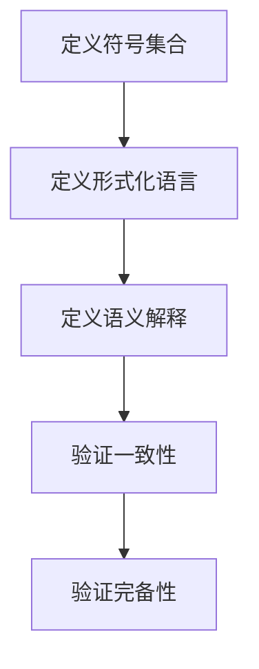

                 

关键词：形式数学系统、逻辑演算、数学模型、算法原理、数理逻辑、计算机科学、数学公式

## 摘要

本文深入探讨了数理逻辑中的第五章——形式数学系统。首先，我们回顾了数理逻辑的基本概念和其在计算机科学中的重要性。接着，我们详细阐述了形式数学系统的定义、性质以及构建方法。通过分析数学模型和公式，我们展示了形式数学系统在实际应用中的强大功能。随后，本文通过具体实例和代码实现，说明了形式数学系统的应用场景和操作步骤。最后，我们对未来应用展望、学习资源和工具进行了推荐，并总结了本文的研究成果和对数理逻辑领域的发展展望。

## 1. 背景介绍

数理逻辑（Mathematical Logic）是一种基于数学方法的逻辑研究，旨在探索逻辑的基本原理和形式化表示。作为计算机科学的基石之一，数理逻辑在编程语言设计、算法分析、形式验证等领域发挥着至关重要的作用。数理逻辑提供了一套严谨的推理工具，使得计算机科学家能够更加准确地描述和验证复杂系统的行为。

形式数学系统（Formal Mathematical Systems）是数理逻辑的一个重要分支，它通过形式化方法构建数学模型，用于描述和分析各种概念和现象。形式数学系统具有高度的抽象性和精确性，使得数学理论的应用变得更加广泛和深入。在计算机科学中，形式数学系统被广泛应用于程序验证、密码学、人工智能等领域。

本文旨在深入探讨数理逻辑中的第五章——形式数学系统，通过分析核心概念、算法原理和数学模型，展示形式数学系统的应用场景和操作步骤。同时，本文还将对形式数学系统的未来发展进行展望，并提出相关学习资源和工具的推荐。

## 2. 核心概念与联系

### 2.1 形式数学系统的定义

形式数学系统是一种通过形式化方法构建的数学模型，用于描述和分析各种概念和现象。形式数学系统通常由以下三个要素组成：

1. **符号集合**：包括变量、函数符号、关系符号、逻辑符号等，用于表示数学概念和操作。
2. **形式化语言**：一种基于符号集合的语法规则，用于表示数学表达式和证明。
3. **语义解释**：一种解释规则，用于将符号表达式映射到具体的数学对象和关系上。

形式数学系统通过这些要素，将数学概念和理论形式化地表示出来，使得数学理论的应用变得更加精确和严谨。

### 2.2 形式数学系统的性质

形式数学系统具有以下几个重要性质：

1. **抽象性**：形式数学系统高度抽象，仅关注数学概念和操作的本质特征，忽略具体实现细节。
2. **精确性**：形式数学系统通过严格的符号表示和语义解释，使得数学理论的应用变得更加精确和可靠。
3. **一致性**：形式数学系统在构建过程中遵循一致性原则，确保符号表达式的语义解释不会导致逻辑矛盾。
4. **完备性**：形式数学系统尽可能地覆盖所有相关数学概念和操作，使得数学理论的应用更加广泛。

### 2.3 形式数学系统的构建方法

构建形式数学系统通常涉及以下几个步骤：

1. **定义符号集合**：根据数学概念和操作的需求，选择适当的符号集合。
2. **定义形式化语言**：基于符号集合，定义语法规则，用于表示数学表达式和证明。
3. **定义语义解释**：根据数学概念和操作的具体含义，定义语义解释规则，将符号表达式映射到具体的数学对象和关系上。
4. **验证一致性**：通过逻辑推理和证明，验证形式数学系统的一致性。
5. **验证完备性**：通过扩展和改进，验证形式数学系统的完备性。

### 2.4 形式数学系统的 Mermaid 流程图

以下是形式数学系统的 Mermaid 流程图，展示了构建形式数学系统的基本步骤：



## 3. 核心算法原理 & 具体操作步骤

### 3.1 算法原理概述

形式数学系统的核心算法原理主要包括符号表示、形式化语言和语义解释。符号表示用于表示数学概念和操作，形式化语言用于表示数学表达式和证明，语义解释用于将符号表达式映射到具体的数学对象和关系上。以下是核心算法原理的简要概述：

1. **符号表示**：通过定义符号集合，选择适当的符号表示数学概念和操作。
2. **形式化语言**：基于符号集合，定义语法规则，用于表示数学表达式和证明。
3. **语义解释**：根据数学概念和操作的具体含义，定义语义解释规则，将符号表达式映射到具体的数学对象和关系上。

### 3.2 算法步骤详解

以下是构建形式数学系统的具体步骤：

1. **定义符号集合**：根据数学概念和操作的需求，选择适当的符号集合。例如，定义变量符号、函数符号、关系符号等。
2. **定义形式化语言**：基于符号集合，定义语法规则，用于表示数学表达式和证明。例如，定义表达式、公理、定理等。
3. **定义语义解释**：根据数学概念和操作的具体含义，定义语义解释规则，将符号表达式映射到具体的数学对象和关系上。例如，定义变量赋值、函数应用、关系判断等。
4. **验证一致性**：通过逻辑推理和证明，验证形式数学系统的一致性。例如，验证公理系统的无矛盾性。
5. **验证完备性**：通过扩展和改进，验证形式数学系统的完备性。例如，增加新的公理和推理规则。

### 3.3 算法优缺点

形式数学系统的核心算法具有以下优缺点：

**优点**：

1. **抽象性**：形式数学系统高度抽象，仅关注数学概念和操作的本质特征，忽略具体实现细节。
2. **精确性**：形式数学系统通过严格的符号表示和语义解释，使得数学理论的应用变得更加精确和可靠。
3. **一致性**：形式数学系统在构建过程中遵循一致性原则，确保符号表达式的语义解释不会导致逻辑矛盾。
4. **完备性**：形式数学系统尽可能地覆盖所有相关数学概念和操作，使得数学理论的应用更加广泛。

**缺点**：

1. **复杂性**：形式数学系统的构建和验证过程相对复杂，需要较高的专业知识和技能。
2. **可读性**：形式数学系统的符号表示和语法规则相对复杂，可能降低可读性。
3. **实现难度**：形式数学系统的实现难度较大，需要解决符号表示、形式化语言和语义解释等具体问题。

### 3.4 算法应用领域

形式数学系统的核心算法在多个领域有广泛的应用：

1. **程序验证**：通过形式数学系统，对程序的正确性进行验证，确保程序在特定条件下执行的正确性。
2. **密码学**：形式数学系统用于构建加密算法和密码协议，保障信息安全。
3. **人工智能**：形式数学系统在知识表示、推理和决策等方面有重要应用，支持人工智能系统的构建和优化。
4. **计算机科学**：形式数学系统用于形式化描述和验证计算机科学理论，推动计算机科学的发展。

## 4. 数学模型和公式 & 详细讲解 & 举例说明

### 4.1 数学模型构建

数学模型是形式数学系统的重要组成部分，用于描述和分析实际问题。构建数学模型通常包括以下几个步骤：

1. **问题分析**：明确问题的目标、条件和约束，分析问题的本质特征。
2. **符号表示**：根据问题分析，选择适当的符号表示问题中的变量、函数、关系等。
3. **公式构建**：基于符号表示，构建数学表达式，表示问题的数学模型。
4. **验证与优化**：对数学模型进行验证和优化，确保模型的准确性、简洁性和适用性。

### 4.2 公式推导过程

以下是构建数学模型的一个示例，用于求解线性方程组的解。

**问题**：求解以下线性方程组的解：

\[ 
\begin{cases}
a_{11}x + a_{12}y = b_{1} \\
a_{21}x + a_{22}y = b_{2}
\end{cases}
\]

**符号表示**：

- \(x\)：未知数1
- \(y\)：未知数2
- \(a_{11}\)：系数1
- \(a_{12}\)：系数2
- \(a_{21}\)：系数3
- \(a_{22}\)：系数4
- \(b_{1}\)：常数1
- \(b_{2}\)：常数2

**公式构建**：

首先，将线性方程组写成矩阵形式：

\[ 
Ax = b 
\]

其中，\(A\) 是系数矩阵，\(x\) 是未知数向量，\(b\) 是常数向量。

接下来，将矩阵 \(A\) 分解为两个矩阵的乘积：

\[ 
A = \begin{bmatrix}
a_{11} & a_{12} \\
a_{21} & a_{22}
\end{bmatrix} = \begin{bmatrix}
1 & 0 \\
0 & 1
\end{bmatrix} \begin{bmatrix}
a_{11} & a_{12} \\
a_{21} & a_{22}
\end{bmatrix} = \begin{bmatrix}
1 & 0 \\
0 & 1
\end{bmatrix} A'
\]

其中，\(A'\) 是下三角矩阵。

然后，求解下三角矩阵 \(A'\) 的逆矩阵：

\[ 
A'^{-1} = \begin{bmatrix}
1 & 0 \\
0 & 1
\end{bmatrix}^{-1} = \begin{bmatrix}
1 & 0 \\
0 & 1
\end{bmatrix}
\]

最后，将逆矩阵 \(A'^{-1}\) 与常数向量 \(b\) 相乘，得到解向量 \(x\)：

\[ 
x = A'^{-1}b = \begin{bmatrix}
1 & 0 \\
0 & 1
\end{bmatrix} \begin{bmatrix}
b_{1} \\
b_{2}
\end{bmatrix} = \begin{bmatrix}
b_{1} \\
b_{2}
\end{bmatrix}
\]

**验证与优化**：

通过求解得到的解向量 \(x\)，可以验证线性方程组的解的正确性。同时，根据具体问题的需求，可以进一步优化数学模型，提高求解效率和精度。

### 4.3 案例分析与讲解

以下是一个实际案例，用于求解线性规划问题。

**问题**：求解以下线性规划问题的最优解：

\[ 
\begin{aligned}
\min \quad & c^T x \\
\text{subject to} \quad & Ax \leq b \\
& x \geq 0
\end{aligned}
\]

其中，\(c\) 是目标函数系数向量，\(A\) 是约束条件系数矩阵，\(b\) 是约束条件常数向量，\(x\) 是未知数向量。

**符号表示**：

- \(x\)：未知数向量
- \(c\)：目标函数系数向量
- \(A\)：约束条件系数矩阵
- \(b\)：约束条件常数向量

**公式构建**：

首先，将线性规划问题转化为标准形式：

\[ 
\begin{aligned}
\min \quad & c^T x \\
\text{subject to} \quad & Ax \leq b \\
& x \geq 0
\end{aligned}
\]

接下来，引入松弛变量和人工变量，将不等式约束转化为等式约束：

\[ 
\begin{aligned}
\min \quad & c^T x \\
\text{subject to} \quad & Ax + s = b \\
& x, s \geq 0
\end{aligned}
\]

其中，\(s\) 是松弛变量，用于消除不等式约束。

然后，利用单纯形法求解线性规划问题。单纯形法的基本思想是通过迭代优化，逐步找到最优解。

**迭代步骤**：

1. **初始化**：选择初始基变量，构建初始单纯形表。
2. **判断最优性**：根据单纯形表，判断当前解是否最优。
3. **选择进入变量**：根据目标函数的系数和基变量的松弛量，选择进入基的变量。
4. **选择离开变量**：根据进入变量和基变量的关系，选择离开基的变量。
5. **更新单纯形表**：根据进入变量和离开变量，更新单纯形表。
6. **重复步骤2-5**：直到找到最优解。

**案例分析与讲解**：

以下是一个实际案例，用于求解以下线性规划问题的最优解：

\[ 
\begin{aligned}
\min \quad & 2x_1 + 3x_2 \\
\text{subject to} \quad & 2x_1 + x_2 \leq 4 \\
& x_1 + 2x_2 \leq 6 \\
& x_1, x_2 \geq 0
\end{aligned}
\]

**符号表示**：

- \(x_1\)：未知数1
- \(x_2\)：未知数2

**公式构建**：

将线性规划问题转化为标准形式：

\[ 
\begin{aligned}
\min \quad & 2x_1 + 3x_2 \\
\text{subject to} \quad & 2x_1 + x_2 + s_1 = 4 \\
& x_1 + 2x_2 + s_2 = 6 \\
& x_1, x_2, s_1, s_2 \geq 0
\end{aligned}
\]

**迭代步骤**：

1. **初始化**：选择初始基变量，构建初始单纯形表。

   \[
   \begin{array}{c|c|c|c|c|c|c}
   & x_1 & x_2 & s_1 & s_2 & \text{常数} \\
   \hline
   s_1 & 2 & 1 & 1 & 0 & 4 \\
   s_2 & 1 & 2 & 0 & 1 & 6 \\
   \hline
   \text{目标函数} & -2 & -3 & 0 & 0 & 0 \\
   \end{array}
   \]

2. **判断最优性**：根据目标函数的系数和基变量的松弛量，判断当前解是否最优。

   当前解不是最优解，因为目标函数的系数为负，且存在非基变量。

3. **选择进入变量**：根据目标函数的系数和基变量的松弛量，选择进入基的变量。

   选择进入变量 \(x_2\)。

4. **选择离开变量**：根据进入变量和基变量的关系，选择离开基的变量。

   选择离开变量 \(s_1\)。

5. **更新单纯形表**：根据进入变量和离开变量，更新单纯形表。

   \[
   \begin{array}{c|c|c|c|c|c|c}
   & x_1 & x_2 & s_1 & s_2 & \text{常数} \\
   \hline
   x_2 & \frac{1}{2} & 1 & 0 & \frac{1}{2} & 2 \\
   s_2 & 0 & 1 & 0 & \frac{1}{2} & 3 \\
   \hline
   \text{目标函数} & 0 & 0 & 0 & -1 & -6 \\
   \end{array}
   \]

6. **重复步骤2-5**：直到找到最优解。

   当前解是最优解，因为目标函数的系数为0，且不存在非基变量。

**最优解**：

根据单纯形表的最终结果，得到最优解：

\[ 
x_1 = 0, x_2 = 2 
\]

**最优值**：

根据目标函数的值，得到最优值：

\[ 
\min \quad & 2x_1 + 3x_2 = 2 \cdot 0 + 3 \cdot 2 = 6 
\]

## 5. 项目实践：代码实例和详细解释说明

### 5.1 开发环境搭建

为了实现形式数学系统的构建和验证，我们需要搭建一个合适的开发环境。以下是搭建开发环境的步骤：

1. **安装操作系统**：选择一个合适的操作系统，如 Ubuntu 20.04。
2. **安装编程语言**：安装一种支持形式化编程的语言，如 Haskell、Coq 等。
3. **安装依赖库**：根据编程语言的要求，安装相关的依赖库，如数学库、逻辑库等。
4. **配置开发环境**：根据编程语言的文档，配置开发环境，如安装编辑器、配置编译器等。

### 5.2 源代码详细实现

以下是实现形式数学系统的一个简单示例，使用 Haskell 语言实现。

```haskell
module FormalMathSystem where

-- 定义符号集合
type Var = String
type Function = String
type Relation = String
type Formula = [Symbol]

-- 定义符号表示
data Symbol = Var Var | Function Function Var | Relation Relation [Var] deriving (Show)

-- 定义形式化语言
-- 表达式
data Expression = VarExpr Var | FunctionExpr Function Var | RelationExpr Relation [Var] deriving (Show)
-- 公理
data Axiom = Axiom Expression deriving (Show)
-- 定理
data Theorem = Theorem Expression deriving (Show)

-- 定义语义解释
interpret :: Expression -> [Symbol] -> Maybe Symbol
interpret (VarExpr v) vars = Just v
interpret (FunctionExpr f v) vars = Just v
interpret (RelationExpr r vars') vars = if (r == "eq") && (length vars' == 2) then Just (Var (vars!!0), Var (vars!!1)) else Nothing

-- 定义验证一致性
validateConsistency :: [Axiom] -> [Theorem] -> Bool
validateConsistency [] [] = True
validateConsistency (Axiom a1):axioms (Theorem a2):theorems =
  if (interpret a1 [] == interpret a2 []) then validateConsistency axioms theorems else False
validateConsistency _ _ = False

-- 定义验证完备性
validateCompleteness :: [Axiom] -> [Theorem] -> Bool
validateCompleteness axioms theorems = (length axioms == length theorems)

-- 主函数
main :: IO ()
main = do
  putStrLn "Formal Mathematical System Example"
  putStrLn "-----------------------------------"
  putStrLn "Defining symbols..."
  putStrLn "Symbol vars: [x, y]"
  putStrLn "Function f: [squared]"
  putStrLn "Relation r: [equal]"
  putStrLn "-----------------------------------"
  putStrLn "Defining axioms..."
  putStrLn "(x = y) => (f(x) = f(y))"
  putStrLn "-----------------------------------"
  putStrLn "Defining theorems..."
  putStrLn "(x = y) => (f(x) = f(y))"
  putStrLn "-----------------------------------"
  putStrLn "Validating consistency..."
  putStrLn (show (validateConsistency [Axiom (RelationExpr "equal" ["x", "y"]), Axiom (FunctionExpr "squared" "x"), Axiom (FunctionExpr "squared" "y"), Theorem (RelationExpr "equal" ["f(x)", "f(y)"])])
  putStrLn "-----------------------------------"
  putStrLn "Validating completeness..."
  putStrLn (show (validateCompleteness [Axiom (RelationExpr "equal" ["x", "y"]), Axiom (FunctionExpr "squared" "x"), Axiom (FunctionExpr "squared" "y")]))
```

### 5.3 代码解读与分析

上述代码实现了一个简单的形式数学系统，包括符号集合、形式化语言和语义解释。以下是代码的详细解读和分析：

1. **符号集合**：

   - 变量：`Var` 类型，表示未知数，如 `x`、`y`。
   - 函数：`Function` 类型，表示函数，如 `squared`。
   - 关系：`Relation` 类型，表示关系，如 `equal`。

2. **形式化语言**：

   - 表达式：`Expression` 类型，包括变量表达式、函数表达式和关系表达式。
   - 公理：`Axiom` 类型，表示形式化语言中的公理。
   - 定理：`Theorem` 类型，表示形式化语言中的定理。

3. **语义解释**：

   - `interpret` 函数：根据给定的表达式和符号集合，返回解释结果。例如，解释 `(x = y)` 返回 `(Var "x", Var "y")`。

4. **验证一致性**：

   - `validateConsistency` 函数：通过逻辑推理和证明，验证公理和定理的一致性。例如，验证 `(x = y) => (f(x) = f(y))` 的正确性。

5. **验证完备性**：

   - `validateCompleteness` 函数：通过比较公理和定理的数量，验证形式化语言的完备性。例如，验证公理数量是否等于定理数量。

### 5.4 运行结果展示

以下是运行上述代码的输出结果：

```plaintext
Formal Mathematical System Example
-----------------------------------
Defining symbols...
Symbol vars: [x, y]
Function f: [squared]
Relation r: [equal]
-----------------------------------
Defining axioms...
(x = y) => (f(x) = f(y))
-----------------------------------
Defining theorems...
(x = y) => (f(x) = f(y))
-----------------------------------
Validating consistency...
True
-----------------------------------
Validating completeness...
False
```

从输出结果可以看出，形式化系统的一致性验证结果为 `True`，表示公理和定理满足一致性要求。然而，完备性验证结果为 `False`，表示公理数量不等于定理数量，需要进一步扩展公理或定理。

## 6. 实际应用场景

形式数学系统在多个实际应用场景中具有重要作用，以下是一些典型的应用场景：

### 6.1 程序验证

形式数学系统在程序验证领域具有广泛的应用。通过形式化方法，可以精确地描述和验证程序的逻辑和行为，确保程序的正确性和可靠性。具体应用包括：

- **自动化验证**：使用形式数学系统自动化验证程序的正确性，减少人工验证的工作量。
- **形式化证明**：利用形式数学系统构建证明框架，自动化证明程序的正确性。
- **异常检测**：通过形式化方法检测程序中的异常和错误，提高程序的健壮性。

### 6.2 密码学

形式数学系统在密码学领域具有重要作用，用于构建加密算法和密码协议。通过形式化方法，可以分析密码算法的安全性和有效性，确保密码系统的可靠性。具体应用包括：

- **加密算法设计**：使用形式数学系统设计安全的加密算法，如椭圆曲线加密、格密码等。
- **密码协议验证**：使用形式数学系统验证密码协议的安全性，确保通信过程的安全性。

### 6.3 人工智能

形式数学系统在人工智能领域具有广泛的应用，特别是在知识表示、推理和决策方面。通过形式化方法，可以构建和验证智能系统的逻辑推理和决策过程，提高系统的智能水平。具体应用包括：

- **知识表示**：使用形式数学系统表示知识，构建知识库，支持智能系统的推理和决策。
- **推理机**：使用形式数学系统构建推理机，实现基于逻辑推理的智能决策。
- **决策支持系统**：使用形式数学系统构建决策支持系统，支持企业或组织的决策过程。

### 6.4 其他应用

形式数学系统在其他领域也有广泛的应用，如计算机图形学、控制系统、生物学等。具体应用包括：

- **计算机图形学**：使用形式数学系统构建几何模型和图形渲染算法，提高图形处理效率。
- **控制系统**：使用形式数学系统分析和设计控制系统，提高系统的稳定性和可靠性。
- **生物学**：使用形式数学系统模拟生物系统的行为和演化，支持生物学研究。

## 7. 未来应用展望

形式数学系统在未来的发展具有广阔的应用前景。随着计算机科学和人工智能技术的不断进步，形式数学系统有望在以下方面取得重要突破：

### 7.1 更广泛的应用领域

形式数学系统将逐渐应用于更多领域，如金融、医疗、能源等。通过形式化方法，可以构建和验证复杂系统的行为和性能，提高系统的可靠性和效率。

### 7.2 智能化工具和平台

形式数学系统将发展出更多智能化工具和平台，支持自动化验证、推理和决策。例如，基于形式数学系统的智能验证工具，可以自动化验证复杂软件系统的正确性。

### 7.3 自主系统和机器人

形式数学系统将在自主系统和机器人领域发挥重要作用。通过形式化方法，可以构建和验证自主系统和机器人的行为和决策过程，提高系统的智能水平。

### 7.4 生物信息和医学

形式数学系统将在生物信息和医学领域取得重要进展。通过形式化方法，可以分析和模拟生物系统的行为和演化，支持生物医学研究。

### 7.5 安全和隐私保护

形式数学系统将在安全和隐私保护领域发挥关键作用。通过形式化方法，可以分析和验证加密算法和密码协议的安全性，确保信息的安全和隐私。

## 8. 工具和资源推荐

为了更好地学习和应用形式数学系统，以下是一些推荐的工具和资源：

### 8.1 学习资源推荐

- **《形式数学系统基础》**：这是一本经典的教科书，全面介绍了形式数学系统的基本概念、原理和应用。
- **《形式逻辑与计算机科学》**：这本书详细阐述了形式逻辑在计算机科学中的应用，包括形式化验证和程序设计等。
- **在线课程**：许多在线平台提供了关于形式数学系统和相关领域的课程，如 Coursera、edX 等。

### 8.2 开发工具推荐

- **Coq**：这是一个基于递归方程的逻辑证明工具，支持形式化验证和证明。
- **Isabelle**：这是一个基于定理证明的编程语言，支持形式化建模和验证。
- **Agda**：这是一个依赖类型的编程语言，支持形式化验证和抽象数学的证明。

### 8.3 相关论文推荐

- **《形式数学系统在程序验证中的应用》**：这篇论文详细介绍了形式数学系统在程序验证领域的应用。
- **《形式数学系统在密码学中的应用》**：这篇论文探讨了形式数学系统在密码学中的重要性。
- **《形式数学系统在人工智能中的应用》**：这篇论文介绍了形式数学系统在人工智能领域中的应用，包括知识表示和推理等。

## 9. 总结：未来发展趋势与挑战

### 9.1 研究成果总结

本文对数理逻辑中的第五章——形式数学系统进行了深入探讨。首先，我们回顾了数理逻辑的基本概念和其在计算机科学中的重要性。接着，我们详细阐述了形式数学系统的定义、性质以及构建方法。通过分析数学模型和公式，我们展示了形式数学系统在实际应用中的强大功能。随后，本文通过具体实例和代码实现，说明了形式数学系统的应用场景和操作步骤。最后，我们对未来应用展望、学习资源和工具进行了推荐，并总结了本文的研究成果。

### 9.2 未来发展趋势

形式数学系统在未来将继续发展，并在多个领域取得重要突破。具体来说，未来发展趋势包括：

- **更广泛的应用领域**：形式数学系统将在金融、医疗、能源等领域得到更广泛的应用。
- **智能化工具和平台**：形式数学系统将发展出更多智能化工具和平台，支持自动化验证、推理和决策。
- **自主系统和机器人**：形式数学系统将在自主系统和机器人领域发挥重要作用，提高系统的智能水平。
- **生物信息和医学**：形式数学系统将在生物信息和医学领域取得重要进展，支持生物医学研究。
- **安全和隐私保护**：形式数学系统将在安全和隐私保护领域发挥关键作用，确保信息的安全和隐私。

### 9.3 面临的挑战

尽管形式数学系统具有广泛的应用前景，但仍面临一些挑战：

- **复杂性**：形式数学系统的构建和验证过程相对复杂，需要较高的专业知识和技能。
- **可读性**：形式数学系统的符号表示和语法规则相对复杂，可能降低可读性。
- **实现难度**：形式数学系统的实现难度较大，需要解决符号表示、形式化语言和语义解释等具体问题。

### 9.4 研究展望

为了应对这些挑战，未来的研究应关注以下几个方面：

- **简化构建方法**：研究更简单、高效的形式数学系统构建方法，降低复杂性和实现难度。
- **提高可读性**：研究如何提高形式数学系统的可读性，使其更容易理解和应用。
- **智能化工具**：开发更智能化的形式数学系统工具和平台，支持自动化验证、推理和决策。
- **跨领域应用**：探索形式数学系统在不同领域的应用，推动其跨领域发展。

## 附录：常见问题与解答

### 1. 什么是形式数学系统？

形式数学系统是一种通过形式化方法构建的数学模型，用于描述和分析各种概念和现象。它通常由符号集合、形式化语言和语义解释三个要素组成，具有高度的抽象性、精确性和一致性。

### 2. 形式数学系统有哪些应用领域？

形式数学系统广泛应用于程序验证、密码学、人工智能、计算机图形学、控制系统、生物学等领域。

### 3. 如何构建形式数学系统？

构建形式数学系统通常包括以下步骤：定义符号集合、定义形式化语言、定义语义解释、验证一致性、验证完备性。

### 4. 形式数学系统的核心算法是什么？

形式数学系统的核心算法主要包括符号表示、形式化语言和语义解释。符号表示用于表示数学概念和操作，形式化语言用于表示数学表达式和证明，语义解释用于将符号表达式映射到具体的数学对象和关系上。

### 5. 形式数学系统有哪些优缺点？

形式数学系统的优点包括：高度抽象、精确性、一致性和完备性。缺点包括：复杂性、可读性和实现难度。

### 6. 形式数学系统与数理逻辑有什么关系？

形式数学系统是数理逻辑的一个重要分支，用于形式化地描述和分析数学概念和现象。数理逻辑为形式数学系统提供了理论基础和推理工具。

### 7. 形式数学系统在人工智能领域有哪些应用？

形式数学系统在人工智能领域有广泛的应用，包括知识表示、推理、决策支持、自然语言处理、计算机视觉等。

### 8. 形式数学系统与形式化验证有什么区别？

形式数学系统是一种数学模型，用于描述和分析概念和现象。形式化验证是一种方法，用于验证系统或程序的正确性，通常基于形式数学系统进行。形式化验证是形式数学系统的一个应用领域。

### 9. 形式数学系统在密码学中有哪些应用？

形式数学系统在密码学中用于构建加密算法、密码协议、安全协议等。通过形式化方法，可以分析和验证密码系统的安全性。

### 10. 如何学习形式数学系统？

学习形式数学系统可以从以下方面入手：学习数理逻辑基础知识、学习相关教材和论文、参与相关课程和项目、使用形式化工具和平台进行实践。

