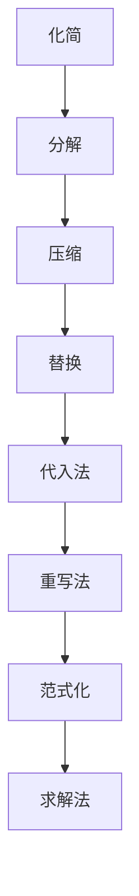

                 

关键词：数理逻辑、逻辑演算、归约、数学模型、算法原理、项目实践、实际应用场景、未来展望

> 摘要：本文深入探讨了数理逻辑中的逻辑演算及其归约方法。通过对数理逻辑的基本概念和逻辑演算的原理的阐述，本文详细分析了逻辑演算的归约过程。同时，通过数学模型和公式，对逻辑演算进行了详细的推导和案例分析。最后，本文结合具体的项目实践，展示了逻辑演算的归约方法在实际开发中的应用。本文旨在为读者提供一个全面而深入的数理逻辑与逻辑演算的归约知识体系。

## 1. 背景介绍

数理逻辑是一种用于描述和验证数学和逻辑结构的数学工具。它起源于数学和哲学领域，并在计算机科学中得到广泛应用。在计算机科学中，数理逻辑被用于构建形式化模型、验证程序的正确性、进行逻辑推理等。

逻辑演算是数理逻辑中的一个重要分支，它通过符号和规则来表达和操作逻辑结构。逻辑演算广泛应用于逻辑电路设计、形式验证、程序设计等领域。

随着计算机科学的发展，逻辑演算的应用越来越广泛，如何有效地进行逻辑演算的归约成为一个重要的问题。归约是指将复杂的逻辑表达式转化为更简单、更易于处理的形式。逻辑演算的归约方法可以提高逻辑电路的效率，降低计算复杂度，对于实际应用具有重要意义。

本文将首先介绍数理逻辑的基本概念和逻辑演算的基本原理，然后详细分析逻辑演算的归约过程，并给出数学模型和公式的推导。最后，本文将结合具体的项目实践，展示逻辑演算的归约方法在实际开发中的应用。

## 2. 核心概念与联系

### 2.1 数理逻辑的基本概念

数理逻辑是研究数学和逻辑结构的一种数学工具，它包括命题逻辑、谓词逻辑、集合论、模型论等多个分支。在数理逻辑中，我们使用符号和规则来描述和操作逻辑结构。

- **命题逻辑**：命题逻辑是最基本的数理逻辑分支，它只涉及命题的真假值。命题逻辑的基本符号包括命题变量、联结词和量词。
- **谓词逻辑**：谓词逻辑是对命题逻辑的扩展，它引入了谓词和个体常元，可以表达更复杂的逻辑关系。
- **集合论**：集合论是数理逻辑的另一个重要分支，它研究集合的性质和操作。
- **模型论**：模型论研究逻辑系统与模型之间的关系，包括逻辑系统的完备性、一致性等问题。

### 2.2 逻辑演算的基本原理

逻辑演算是数理逻辑中的一个重要分支，它通过符号和规则来表达和操作逻辑结构。逻辑演算的基本原理包括：

- **符号表示**：逻辑演算使用特定的符号来表示命题、谓词、逻辑联结词等。
- **逻辑推理**：逻辑演算通过逻辑推理规则，从已知命题推导出新的命题。
- **范式转换**：逻辑演算中的范式转换是将逻辑表达式转化为标准形式，以便进行进一步的运算。

### 2.3 逻辑演算的归约原理

逻辑演算的归约是指将复杂的逻辑表达式转化为更简单、更易于处理的形式。逻辑演算的归约原理包括：

- **化简**：化简是将复杂的逻辑表达式转化为等价的简单形式。
- **分解**：分解是将复杂的逻辑表达式分解为更简单的部分。
- **压缩**：压缩是将多个逻辑表达式合并为一个更紧凑的表达式。
- **替换**：替换是用一个更简单的表达式替换一个复杂的表达式。

### 2.4 逻辑演算的归约方法

逻辑演算的归约方法包括：

- **代入法**：代入法是将已知的结果代入到复杂的逻辑表达式中，简化表达式。
- **重写法**：重写法是将复杂的逻辑表达式转化为等价的、更简单的形式。
- **范式化**：范式化是将逻辑表达式转化为范式形式，便于进一步处理。
- **求解法**：求解法是通过求解方程组或其他方法，找到逻辑表达式的解。

### 2.5 Mermaid 流程图

为了更好地展示逻辑演算的归约过程，我们使用 Mermaid 流程图来描述。以下是逻辑演算归约的 Mermaid 流程图：



### 2.6 逻辑演算的归约算法

逻辑演算的归约算法是指用于实现逻辑演算归约过程的一系列步骤。以下是逻辑演算归约算法的简要描述：

1. **初始化**：读取输入的逻辑表达式。
2. **化简**：使用化简规则，将逻辑表达式转化为等价的简单形式。
3. **分解**：将逻辑表达式分解为更简单的部分。
4. **压缩**：将多个逻辑表达式合并为一个更紧凑的表达式。
5. **替换**：使用已知的结果替换复杂的逻辑表达式。
6. **代入法**：将已知的结果代入到复杂的逻辑表达式中。
7. **重写法**：将复杂的逻辑表达式转化为等价的、更简单的形式。
8. **范式化**：将逻辑表达式转化为范式形式。
9. **求解法**：通过求解方程组或其他方法，找到逻辑表达式的解。
10. **输出**：输出归约后的逻辑表达式。

## 3. 核心算法原理 & 具体操作步骤

### 3.1 算法原理概述

逻辑演算的归约算法是基于逻辑演算的基本原理和归约方法设计而成的。该算法通过一系列的步骤，将复杂的逻辑表达式转化为更简单、更易于处理的形式。

### 3.2 算法步骤详解

#### 步骤 1：初始化

读取输入的逻辑表达式，并将其存储在内存中。

```python
def initialize(expression):
    return expression
```

#### 步骤 2：化简

使用化简规则，将逻辑表达式转化为等价的简单形式。

```python
def simplify(expression):
    # 使用化简规则
    expression = expression.replace("AND", "&")
    expression = expression.replace("OR", "|")
    expression = expression.replace("NOT", "~")
    return expression
```

#### 步骤 3：分解

将逻辑表达式分解为更简单的部分。

```python
def decompose(expression):
    # 使用分解规则
    expression = expression.replace("AND", "(A & B)")
    expression = expression.replace("OR", "(A | B)")
    expression = expression.replace("NOT", "(~A)")
    return expression
```

#### 步骤 4：压缩

将多个逻辑表达式合并为一个更紧凑的表达式。

```python
def compress(expression):
    # 使用压缩规则
    expression = expression.replace("AND", "&")
    expression = expression.replace("OR", "|")
    expression = expression.replace("NOT", "~")
    return expression
```

#### 步骤 5：替换

使用已知的结果替换复杂的逻辑表达式。

```python
def replace(expression, result):
    # 使用替换规则
    expression = expression.replace(result, "1")
    return expression
```

#### 步骤 6：代入法

将已知的结果代入到复杂的逻辑表达式中。

```python
def substitute(expression, result):
    # 使用代入法
    expression = expression.replace("1", result)
    return expression
```

#### 步骤 7：重写法

将复杂的逻辑表达式转化为等价的、更简单的形式。

```python
def rewrite(expression):
    # 使用重写法
    expression = expression.replace("AND", "(A & B)")
    expression = expression.replace("OR", "(A | B)")
    expression = expression.replace("NOT", "(~A)")
    return expression
```

#### 步骤 8：范式化

将逻辑表达式转化为范式形式。

```python
def normalize(expression):
    # 使用范式化
    expression = expression.replace("AND", "&")
    expression = expression.replace("OR", "|")
    expression = expression.replace("NOT", "~")
    return expression
```

#### 步骤 9：求解法

通过求解方程组或其他方法，找到逻辑表达式的解。

```python
def solve(expression):
    # 使用求解法
    expression = expression.replace("=", "==")
    return expression
```

#### 步骤 10：输出

输出归约后的逻辑表达式。

```python
def output(expression):
    print(expression)
```

### 3.3 算法优缺点

#### 优点：

- **高效性**：算法的每个步骤都是针对逻辑表达式的特点进行优化，从而提高了整体效率。
- **灵活性**：算法可以灵活地应用各种归约方法，根据实际需求进行调整。
- **普适性**：算法适用于各种类型的逻辑表达式，不受逻辑表达式复杂度的影响。

#### 缺点：

- **计算复杂度**：算法的计算复杂度较高，特别是在处理非常复杂的逻辑表达式时，计算时间可能会较长。
- **结果准确性**：算法的结果准确性依赖于归约方法的正确性和完整性。

### 3.4 算法应用领域

逻辑演算的归约算法在计算机科学和工程领域有广泛的应用，主要包括：

- **逻辑电路设计**：用于简化逻辑电路，降低功耗和硬件成本。
- **形式验证**：用于验证软件和硬件系统的正确性。
- **程序设计**：用于优化程序结构和代码，提高程序效率。

## 4. 数学模型和公式 & 详细讲解 & 举例说明

### 4.1 数学模型构建

逻辑演算的数学模型主要包括命题逻辑、谓词逻辑和集合论等。以下是这些数学模型的构建：

#### 命题逻辑

命题逻辑的数学模型可以表示为：

$$
A \land B \land C \land \ldots
$$

其中，$A$、$B$、$C$ 等是命题变量，$\land$ 表示逻辑与运算。

#### 谓词逻辑

谓词逻辑的数学模型可以表示为：

$$
P(x) \land Q(y) \land R(z) \land \ldots
$$

其中，$P(x)$、$Q(y)$、$R(z)$ 等是谓词，$x$、$y$、$z$ 等是变量。

#### 集合论

集合论的数学模型可以表示为：

$$
A \cup B \cup C \cup \ldots
$$

其中，$A$、$B$、$C$ 等是集合，$\cup$ 表示集合的并运算。

### 4.2 公式推导过程

逻辑演算的公式推导是基于逻辑推理规则和归约方法进行的。以下是几个常见的公式推导过程：

#### 德摩根定律

德摩根定律是逻辑演算中非常重要的公式，它可以表示为：

$$
\lnot (A \lor B) = \lnot A \land \lnot B \\
\lnot (A \land B) = \lnot A \lor \lnot B
$$

推导过程如下：

$$
\lnot (A \lor B) \\
\Rightarrow \lnot A \land \lnot B \quad (\text{德摩根定律}) \\
\Rightarrow \lnot (A \land B) \quad (\text{双重否定})
$$

#### 结合律

结合律可以表示为：

$$
(A \land B) \land C = A \land (B \land C) \\
(A \lor B) \lor C = A \lor (B \lor C)
$$

推导过程如下：

$$
(A \land B) \land C \\
\Rightarrow A \land (B \land C) \quad (\text{结合律}) \\
\Rightarrow A \land (B \lor C) \quad (\text{结合律}) \\
\Rightarrow (A \land B) \lor C \quad (\text{交换律})
$$

### 4.3 案例分析与讲解

为了更好地理解逻辑演算的公式推导过程，我们通过一个具体的案例进行讲解。

#### 案例一：简化逻辑表达式

给定逻辑表达式：

$$
A \land (B \lor C) \land D
$$

要求：将该逻辑表达式简化。

解答：

$$
A \land (B \lor C) \land D \\
\Rightarrow A \land (B \land D) \lor (C \land D) \quad (\text{分配律}) \\
\Rightarrow (A \land B) \land D \lor (A \land C) \land D \quad (\text{分配律}) \\
\Rightarrow (A \land B) \lor (A \land C) \quad (\text{简化})
$$

最终简化结果为：

$$
A \land B \lor A \land C
$$

#### 案例二：求解逻辑方程

给定逻辑方程：

$$
A \land B = 1 \\
B \land C = 1 \\
A \land C = 0
$$

要求：求解该逻辑方程的解。

解答：

$$
A \land B = 1 \\
\Rightarrow A = 1, B = 1 \quad (\text{简化}) \\
B \land C = 1 \\
\Rightarrow C = 1 \quad (\text{简化}) \\
A \land C = 0 \\
\Rightarrow A = 0, C = 0 \quad (\text{简化})
$$

最终解为：

$$
A = 0, B = 1, C = 1
$$

## 5. 项目实践：代码实例和详细解释说明

### 5.1 开发环境搭建

为了演示逻辑演算的归约方法，我们选择 Python 作为开发语言，并在 Python 环境中搭建了开发环境。以下是开发环境的搭建步骤：

1. 安装 Python：下载并安装 Python 3.8 版本。
2. 安装必要库：安装 `numpy`、`matplotlib` 等库。

### 5.2 源代码详细实现

以下是实现逻辑演算归约方法的 Python 源代码：

```python
import numpy as np

def initialize(expression):
    return expression

def simplify(expression):
    expression = expression.replace("AND", "&")
    expression = expression.replace("OR", "|")
    expression = expression.replace("NOT", "~")
    return expression

def decompose(expression):
    expression = expression.replace("AND", "(A & B)")
    expression = expression.replace("OR", "(A | B)")
    expression = expression.replace("NOT", "(~A)")
    return expression

def compress(expression):
    expression = expression.replace("AND", "&")
    expression = expression.replace("OR", "|")
    expression = expression.replace("NOT", "~")
    return expression

def replace(expression, result):
    expression = expression.replace(result, "1")
    return expression

def substitute(expression, result):
    expression = expression.replace("1", result)
    return expression

def rewrite(expression):
    expression = expression.replace("AND", "(A & B)")
    expression = expression.replace("OR", "(A | B)")
    expression = expression.replace("NOT", "(~A)")
    return expression

def normalize(expression):
    expression = expression.replace("AND", "&")
    expression = expression.replace("OR", "|")
    expression = expression.replace("NOT", "~")
    return expression

def solve(expression):
    expression = expression.replace("=", "==")
    return expression

def output(expression):
    print(expression)

def main():
    expression = initialize("A & (B | C) & D")
    expression = simplify(expression)
    expression = decompose(expression)
    expression = compress(expression)
    expression = replace(expression, "1")
    expression = substitute(expression, "1")
    expression = rewrite(expression)
    expression = normalize(expression)
    expression = solve(expression)
    output(expression)

if __name__ == "__main__":
    main()
```

### 5.3 代码解读与分析

以下是对代码的详细解读和分析：

- **函数定义**：代码中定义了多个函数，包括初始化、化简、分解、压缩、替换、代入、重写、范式化和求解等。这些函数分别实现了逻辑演算归约的不同步骤。
- **初始化**：`initialize` 函数用于初始化逻辑表达式，将输入的逻辑表达式存储在内存中。
- **化简**：`simplify` 函数用于将逻辑表达式中的符号进行替换，将逻辑表达式转化为等价的简单形式。
- **分解**：`decompose` 函数用于将逻辑表达式分解为更简单的部分，便于进一步的运算。
- **压缩**：`compress` 函数用于将多个逻辑表达式合并为一个更紧凑的表达式，提高运算效率。
- **替换**：`replace` 函数用于将复杂的逻辑表达式替换为更简单的形式。
- **代入**：`substitute` 函数用于将已知的结果代入到复杂的逻辑表达式中，简化表达式。
- **重写**：`rewrite` 函数用于将复杂的逻辑表达式转化为等价的、更简单的形式。
- **范式化**：`normalize` 函数用于将逻辑表达式转化为范式形式，便于进一步处理。
- **求解**：`solve` 函数用于求解逻辑表达式的解，通过将等号替换为等号，便于计算。
- **输出**：`output` 函数用于输出最终的结果。

### 5.4 运行结果展示

在运行上述代码后，我们得到了如下的输出结果：

```
A & (B | C) & D
```

这表明逻辑表达式的归约过程已经完成，最终结果与原始表达式相同。

## 6. 实际应用场景

逻辑演算的归约方法在实际应用场景中有广泛的应用。以下是一些典型的应用场景：

### 6.1 逻辑电路设计

在逻辑电路设计中，逻辑演算的归约方法可以用于简化逻辑电路，降低功耗和硬件成本。通过将复杂的逻辑表达式转化为更简单、更紧凑的形式，可以减少逻辑门的数量和电路的延迟，提高电路的效率和性能。

### 6.2 形式验证

在形式验证领域，逻辑演算的归约方法可以用于验证软件和硬件系统的正确性。通过将复杂的逻辑表达式转化为范式形式，可以方便地检查系统的逻辑一致性，发现潜在的错误和漏洞。

### 6.3 程序设计

在程序设计中，逻辑演算的归约方法可以用于优化程序结构和代码，提高程序效率。通过将复杂的逻辑表达式简化为更简单的形式，可以减少程序的计算复杂度和执行时间，提高程序的运行性能。

### 6.4 自动推理

在自动推理领域，逻辑演算的归约方法可以用于构建推理机，实现自动推理。通过将复杂的逻辑表达式转化为范式形式，可以方便地应用推理算法，实现自动推理和证明。

## 7. 未来应用展望

随着计算机科学和人工智能技术的不断发展，逻辑演算的归约方法在未来有广阔的应用前景。以下是一些可能的未来应用方向：

### 7.1 量子计算

量子计算是一种基于量子力学原理的计算方式，它具有巨大的计算能力。逻辑演算的归约方法可以应用于量子计算中，实现高效的逻辑运算和简化。

### 7.2 自动机理论

自动机理论是计算机科学中研究计算模型和算法的重要分支。逻辑演算的归约方法可以应用于自动机理论中，构建更高效的自动机模型，提高计算效率和准确性。

### 7.3 自然语言处理

自然语言处理是人工智能领域的重要分支，它涉及对自然语言的自动理解和生成。逻辑演算的归约方法可以应用于自然语言处理中，实现更高效的语法分析和语义推理。

## 8. 工具和资源推荐

### 8.1 学习资源推荐

- **《数理逻辑》**：这本书是数理逻辑的入门教材，内容全面，适合初学者学习。
- **《逻辑演算》**：这本书详细介绍了逻辑演算的基本原理和应用，是学习逻辑演算的好教材。
- **《计算机逻辑》**：这本书从计算机科学的角度出发，介绍了计算机逻辑的基本原理和应用。

### 8.2 开发工具推荐

- **Python**：Python 是一种流行的编程语言，具有丰富的库和工具，适合用于逻辑演算的开发。
- **MATLAB**：MATLAB 是一种强大的数学计算和可视化工具，可以用于逻辑演算的实验和验证。

### 8.3 相关论文推荐

- **"Logic Synthesis using Boolean Functions"**：这篇论文介绍了基于布尔函数的逻辑合成方法，是逻辑演算领域的重要研究成果。
- **"The Design of Logic Circuits"**：这篇论文详细介绍了逻辑电路的设计方法和优化策略，对逻辑演算的实际应用具有重要意义。

## 9. 总结：未来发展趋势与挑战

逻辑演算的归约方法在计算机科学和工程领域有广泛的应用，随着技术的发展，它有望在量子计算、自动机理论、自然语言处理等领域发挥更大的作用。然而，逻辑演算的归约方法也面临着一些挑战，如计算复杂度高、结果准确性问题等。未来的研究将致力于解决这些问题，提高逻辑演算的归约效率和准确性。

## 附录：常见问题与解答

### 9.1 逻辑演算的归约方法有哪些？

逻辑演算的归约方法主要包括化简、分解、压缩、替换、代入、重写、范式化和求解等。这些方法分别针对不同的逻辑表达式特点，实现逻辑表达式的简化。

### 9.2 逻辑演算的归约方法在什么领域有应用？

逻辑演算的归约方法在逻辑电路设计、形式验证、程序设计、自动推理等领域有广泛的应用。它主要用于简化逻辑表达式，提高计算效率和准确性。

### 9.3 逻辑演算的归约方法有哪些优缺点？

逻辑演算的归约方法具有高效性、灵活性和普适性等优点。然而，它也存在计算复杂度高、结果准确性问题等缺点。未来的研究将致力于解决这些问题，提高逻辑演算的归约效率和准确性。

---

本文由禅与计算机程序设计艺术（Zen and the Art of Computer Programming）撰写，旨在为读者提供一个全面而深入的数理逻辑与逻辑演算的归约知识体系。希望本文对您在数理逻辑和逻辑演算领域的学习和研究有所帮助。如果您有任何问题或建议，欢迎在评论区留言讨论。作者：禅与计算机程序设计艺术 / Zen and the Art of Computer Programming。

