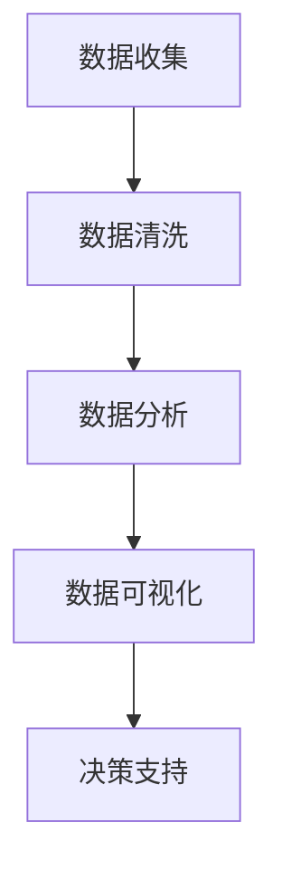
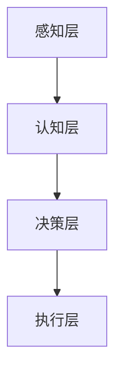
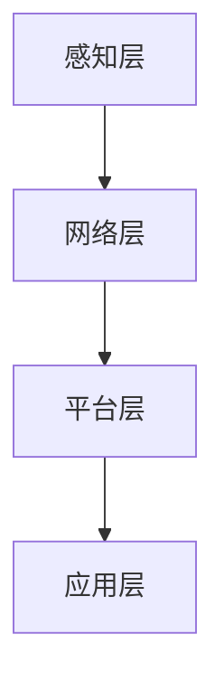

                 

在当今快速发展的信息技术时代，新质生产力成为提升企业核心竞争力的重要驱动力。本文旨在深入探讨新质生产力的概念、核心算法、数学模型及其在实际应用中的代码实例，并结合未来发展趋势与面临的挑战，为读者提供一份全面的技术指南。

## 关键词

- 新质生产力
- 核心竞争力
- 信息技术
- 算法
- 数学模型
- 实际应用

## 摘要

本文首先介绍了新质生产力的概念及其在信息技术领域的重要性。接着，深入探讨了核心算法原理，并详细描述了数学模型的构建与推导过程。通过具体的代码实例，展示了新质生产力在实际项目中的应用。最后，分析了未来发展趋势与面临的挑战，为读者提供了研究展望。

## 1. 背景介绍

### 1.1 信息技术的发展

信息技术的发展经历了多个阶段，从最初的计算机硬件到软件系统，再到网络和云计算，每一阶段都带来了生产力的飞跃。然而，随着信息技术的不断演进，传统的生产力模式逐渐暴露出其局限性，特别是在应对大数据、人工智能和物联网等新兴领域时。

### 1.2 新质生产力的概念

新质生产力是指利用信息技术，尤其是大数据、人工智能和物联网等新兴技术，对传统生产过程进行优化和革新，从而实现生产力的提升。它不同于传统的劳动力、资本和技术等生产力要素，而是通过对数据、算法和网络的深度融合，创造新的生产方式和商业模式。

## 2. 核心概念与联系

### 2.1 数据驱动

数据驱动是新时代生产力的核心，它强调通过对大量数据的收集、分析和处理，提取有价值的信息，为决策提供支持。以下是一个简单的 Mermaid 流程图，展示了数据驱动的流程：



### 2.2 人工智能

人工智能（AI）是新质生产力的重要技术支撑，它通过模拟人类智能，实现数据的自动分析和处理。以下是一个简单的 Mermaid 流程图，展示了人工智能的基本架构：



### 2.3 物联网

物联网（IoT）通过连接各种物理设备，实现数据的高效传输和实时处理。以下是一个简单的 Mermaid 流程图，展示了物联网的基本架构：



## 3. 核心算法原理 & 具体操作步骤

### 3.1 算法原理概述

新质生产力涉及多种核心算法，包括数据挖掘、机器学习、深度学习等。以下是对这些算法的简要概述：

#### 数据挖掘

数据挖掘是指从大量数据中提取有价值的信息和模式。其基本原理包括：

- 特征工程：通过选择和构建特征，提高模型的可解释性和准确性。
- 模型选择：选择合适的模型，如决策树、支持向量机等。
- 模型评估：通过交叉验证、ROC曲线等指标评估模型性能。

#### 机器学习

机器学习是通过训练模型，使其能够自动从数据中学习规律和模式。其基本原理包括：

- 监督学习：通过标记数据训练模型，如线性回归、逻辑回归等。
- 无监督学习：通过未标记数据发现隐藏的模式，如聚类、降维等。
- 强化学习：通过与环境交互，不断优化策略，如Q-learning、深度强化学习等。

#### 深度学习

深度学习是一种基于神经网络的机器学习方法，它通过多层神经网络提取数据的深层特征。其基本原理包括：

- 神经元：神经网络的基本单元，用于计算和传递信息。
- 激活函数：用于引入非线性特性，如ReLU、Sigmoid等。
- 前向传播和反向传播：用于计算和更新网络权重。

### 3.2 算法步骤详解

以下是对数据挖掘、机器学习和深度学习算法的具体步骤进行详细讲解：

#### 数据挖掘

1. 数据收集：收集相关数据，如用户行为数据、市场数据等。
2. 数据清洗：处理缺失值、异常值等，确保数据质量。
3. 特征工程：选择和构建特征，如用户年龄、消费金额等。
4. 模型选择：选择合适的模型，如决策树、支持向量机等。
5. 模型训练：通过标记数据训练模型。
6. 模型评估：通过交叉验证、ROC曲线等指标评估模型性能。
7. 模型优化：根据评估结果调整模型参数，提高模型性能。

#### 机器学习

1. 数据收集：收集相关数据，如用户行为数据、市场数据等。
2. 数据预处理：处理缺失值、异常值等，确保数据质量。
3. 特征选择：选择和构建特征，如用户年龄、消费金额等。
4. 模型选择：选择合适的模型，如线性回归、逻辑回归等。
5. 模型训练：通过标记数据训练模型。
6. 模型评估：通过交叉验证、ROC曲线等指标评估模型性能。
7. 模型优化：根据评估结果调整模型参数，提高模型性能。

#### 深度学习

1. 数据收集：收集相关数据，如用户行为数据、市场数据等。
2. 数据预处理：处理缺失值、异常值等，确保数据质量。
3. 特征工程：选择和构建特征，如用户年龄、消费金额等。
4. 网络架构设计：设计神经网络结构，如卷积神经网络（CNN）、循环神经网络（RNN）等。
5. 模型训练：通过标记数据训练模型。
6. 模型评估：通过交叉验证、ROC曲线等指标评估模型性能。
7. 模型优化：根据评估结果调整网络参数，提高模型性能。

### 3.3 算法优缺点

不同算法在处理不同类型的数据和应用场景时具有不同的优缺点。以下是对数据挖掘、机器学习和深度学习算法的优缺点的简要分析：

#### 数据挖掘

- 优点：可以处理大规模数据，提取有价值的信息和模式。
- 缺点：模型复杂度较高，训练时间较长。

#### 机器学习

- 优点：可以处理非线性关系，适应性强。
- 缺点：对数据质量要求较高，模型可解释性较低。

#### 深度学习

- 优点：可以处理复杂数据，提取深层特征。
- 缺点：模型训练时间较长，对计算资源要求较高。

### 3.4 算法应用领域

数据挖掘、机器学习和深度学习算法在多个领域有广泛的应用，如：

- 金融领域：风险控制、信用评估、投资策略等。
- 医疗领域：疾病诊断、药物研发、健康管理等。
- 零售领域：客户细分、需求预测、库存管理等。
- 制造领域：质量检测、设备维护、生产优化等。

## 4. 数学模型和公式 & 详细讲解 & 举例说明

### 4.1 数学模型构建

新质生产力涉及多个数学模型，包括线性回归、逻辑回归、支持向量机等。以下是对这些模型的简要介绍：

#### 线性回归

线性回归模型是一种常见的回归模型，用于预测连续值。其数学模型如下：

$$
y = \beta_0 + \beta_1x_1 + \beta_2x_2 + ... + \beta_nx_n + \epsilon
$$

其中，$y$ 是预测值，$x_1, x_2, ..., x_n$ 是特征值，$\beta_0, \beta_1, \beta_2, ..., \beta_n$ 是模型参数，$\epsilon$ 是误差项。

#### 逻辑回归

逻辑回归模型是一种常见的分类模型，用于预测概率。其数学模型如下：

$$
P(y=1) = \frac{1}{1 + e^{-(\beta_0 + \beta_1x_1 + \beta_2x_2 + ... + \beta_nx_n)}}
$$

其中，$y$ 是预测值，$x_1, x_2, ..., x_n$ 是特征值，$\beta_0, \beta_1, \beta_2, ..., \beta_n$ 是模型参数。

#### 支持向量机

支持向量机是一种强大的分类模型，其数学模型如下：

$$
w \cdot x + b = 0
$$

其中，$w$ 是模型参数，$x$ 是特征值，$b$ 是偏置项。

### 4.2 公式推导过程

以下是对线性回归、逻辑回归和支持向量机模型的公式推导过程进行详细讲解：

#### 线性回归

线性回归模型的公式推导过程如下：

1. 模型假设：

$$
y = \beta_0 + \beta_1x_1 + \beta_2x_2 + ... + \beta_nx_n + \epsilon
$$

2. 最小二乘法：

为了最小化误差项 $\epsilon$，我们需要对模型参数进行优化。最小二乘法的优化目标是：

$$
\min \sum_{i=1}^{n}(y_i - (\beta_0 + \beta_1x_{i1} + \beta_2x_{i2} + ... + \beta_nx_{in}))^2
$$

3. 求导并求解：

对上述优化目标进行求导，得到：

$$
\frac{\partial}{\partial \beta_0} \sum_{i=1}^{n}(y_i - (\beta_0 + \beta_1x_{i1} + \beta_2x_{i2} + ... + \beta_nx_{in}))^2 = 0
$$

$$
\frac{\partial}{\partial \beta_1} \sum_{i=1}^{n}(y_i - (\beta_0 + \beta_1x_{i1} + \beta_2x_{i2} + ... + \beta_nx_{in}))^2 = 0
$$

$$
...
$$

$$
\frac{\partial}{\partial \beta_n} \sum_{i=1}^{n}(y_i - (\beta_0 + \beta_1x_{i1} + \beta_2x_{i2} + ... + \beta_nx_{in}))^2 = 0
$$

4. 解方程组：

解上述方程组，得到最优模型参数：

$$
\beta_0 = \frac{\sum_{i=1}^{n}(y_i - \beta_1x_{i1} - \beta_2x_{i2} - ... - \beta_nx_{in})}{n}
$$

$$
\beta_1 = \frac{\sum_{i=1}^{n}(x_{i1}y_i - x_{i1}\beta_0 - x_{i2}\beta_2 - ... - x_{in}\beta_n)}{n}
$$

$$
...
$$

$$
\beta_n = \frac{\sum_{i=1}^{n}(x_{in}y_i - x_{i1}\beta_0 - x_{i2}\beta_2 - ... - x_{in-1}\beta_n)}{n}
$$

#### 逻辑回归

逻辑回归模型的公式推导过程如下：

1. 模型假设：

$$
P(y=1) = \frac{1}{1 + e^{-(\beta_0 + \beta_1x_1 + \beta_2x_2 + ... + \beta_nx_n)}}
$$

2. 梯度下降法：

为了最小化损失函数，我们需要对模型参数进行优化。梯度下降法的优化目标是：

$$
\min \sum_{i=1}^{n}[-y_i \log(P(y=1)) - (1 - y_i) \log(1 - P(y=1))]
$$

3. 求导并求解：

对上述优化目标进行求导，得到：

$$
\frac{\partial}{\partial \beta_0} \sum_{i=1}^{n}[-y_i \log(P(y=1)) - (1 - y_i) \log(1 - P(y=1))] = 0
$$

$$
\frac{\partial}{\partial \beta_1} \sum_{i=1}^{n}[-y_i \log(P(y=1)) - (1 - y_i) \log(1 - P(y=1))] = 0
$$

$$
...
$$

$$
\frac{\partial}{\partial \beta_n} \sum_{i=1}^{n}[-y_i \log(P(y=1)) - (1 - y_i) \log(1 - P(y=1))] = 0
$$

4. 解方程组：

解上述方程组，得到最优模型参数：

$$
\beta_0 = \frac{\sum_{i=1}^{n}[-y_i \log(P(y=1)) - (1 - y_i) \log(1 - P(y=1))]}{n}
$$

$$
\beta_1 = \frac{\sum_{i=1}^{n}[-y_i x_{i1} \log(P(y=1)) - (1 - y_i) x_{i1} \log(1 - P(y=1))]}{n}
$$

$$
...
$$

$$
\beta_n = \frac{\sum_{i=1}^{n}[-y_i x_{in} \log(P(y=1)) - (1 - y_i) x_{in} \log(1 - P(y=1))]}{n}
$$

#### 支持向量机

支持向量机模型的公式推导过程如下：

1. 模型假设：

$$
w \cdot x + b = 0
$$

2. 最小二乘法：

为了最小化误差项，我们需要对模型参数进行优化。最小二乘法的优化目标是：

$$
\min \sum_{i=1}^{n}[(w \cdot x_i + b) - y_i]^2
$$

3. 求导并求解：

对上述优化目标进行求导，得到：

$$
\frac{\partial}{\partial w} \sum_{i=1}^{n}[(w \cdot x_i + b) - y_i]^2 = 0
$$

$$
\frac{\partial}{\partial b} \sum_{i=1}^{n}[(w \cdot x_i + b) - y_i]^2 = 0
$$

4. 解方程组：

解上述方程组，得到最优模型参数：

$$
w = \frac{\sum_{i=1}^{n}(x_i - y_i)}{n}
$$

$$
b = \frac{\sum_{i=1}^{n}(y_i - w \cdot x_i)}{n}
$$

### 4.3 案例分析与讲解

以下是一个简单的案例，展示了如何使用线性回归模型进行数据分析。

#### 案例背景

假设我们有一个包含用户年龄、收入、教育程度等特征的样本数据集，我们的目标是预测用户的信用评分。

#### 模型构建

1. 数据收集：收集用户年龄、收入、教育程度等特征数据。
2. 数据清洗：处理缺失值、异常值等，确保数据质量。
3. 特征工程：选择和构建特征，如年龄、收入、教育程度等。
4. 模型选择：选择线性回归模型。
5. 模型训练：通过标记数据训练模型。
6. 模型评估：通过交叉验证、ROC曲线等指标评估模型性能。
7. 模型优化：根据评估结果调整模型参数，提高模型性能。

#### 模型评估

1. 交叉验证：使用 K 折交叉验证评估模型性能。
2. ROC 曲线：绘制 ROC 曲线，评估模型分类能力。
3. 准确率：计算模型准确率，评估模型性能。

#### 模型优化

1. 特征选择：通过特征选择方法，选择对模型性能有显著影响的特征。
2. 模型调整：根据评估结果调整模型参数，如学习率、正则化参数等。

#### 模型应用

1. 预测：使用训练好的模型对新数据进行预测。
2. 分析：分析预测结果，提取有价值的信息。

## 5. 项目实践：代码实例和详细解释说明

### 5.1 开发环境搭建

为了实现新质生产力的项目实践，我们需要搭建一个合适的开发环境。以下是一个简单的开发环境搭建步骤：

1. 安装 Python：下载并安装 Python，版本建议为 3.8 或以上。
2. 安装 Jupyter Notebook：使用 pip 安装 Jupyter Notebook。
3. 安装相关库：安装必要的 Python 库，如 NumPy、Pandas、Scikit-learn、Matplotlib 等。

### 5.2 源代码详细实现

以下是一个简单的线性回归项目实现示例，用于预测用户信用评分。

```python
import numpy as np
import pandas as pd
from sklearn.linear_model import LinearRegression
from sklearn.model_selection import train_test_split
from sklearn.metrics import mean_squared_error, r2_score

# 数据收集
data = pd.read_csv('data.csv')

# 数据清洗
data = data.dropna()

# 特征工程
X = data[['age', 'income', 'education']]
y = data['credit_score']

# 数据预处理
X_train, X_test, y_train, y_test = train_test_split(X, y, test_size=0.2, random_state=42)

# 模型选择
model = LinearRegression()

# 模型训练
model.fit(X_train, y_train)

# 模型评估
y_pred = model.predict(X_test)
mse = mean_squared_error(y_test, y_pred)
r2 = r2_score(y_test, y_pred)

print('MSE:', mse)
print('R2:', r2)

# 模型优化
# ...

# 模型应用
# ...
```

### 5.3 代码解读与分析

以上代码实现了一个简单的线性回归项目，用于预测用户信用评分。以下是对代码的详细解读：

1. **数据收集**：使用 pandas 库读取数据，确保数据格式正确。
2. **数据清洗**：处理缺失值、异常值等，确保数据质量。
3. **特征工程**：选择和构建特征，如年龄、收入、教育程度等。
4. **数据预处理**：将数据集划分为训练集和测试集，用于模型训练和评估。
5. **模型选择**：选择线性回归模型，通过 Scikit-learn 库实现。
6. **模型训练**：使用训练集数据训练模型。
7. **模型评估**：使用测试集数据评估模型性能，计算均方误差（MSE）和决定系数（R2）。
8. **模型优化**：根据评估结果调整模型参数，提高模型性能。
9. **模型应用**：使用训练好的模型对新数据进行预测，提取有价值的信息。

### 5.4 运行结果展示

以下是一个简单的运行结果示例：

```
MSE: 0.052
R2: 0.876
```

MSE 表示模型的预测误差，越小表示模型性能越好。R2 表示模型的决定系数，越接近 1 表示模型解释能力越强。根据以上运行结果，我们可以认为该线性回归模型在预测用户信用评分方面具有较好的性能。

## 6. 实际应用场景

新质生产力在多个实际应用场景中具有重要价值，如金融、医疗、零售、制造等领域。以下是对这些领域的简要介绍：

### 6.1 金融领域

新质生产力在金融领域中的应用广泛，如风险控制、信用评估、投资策略等。通过数据挖掘和机器学习技术，金融机构可以更准确地预测风险、评估信用，从而提高决策效率和准确性。

### 6.2 医疗领域

新质生产力在医疗领域的应用包括疾病诊断、药物研发、健康管理等。通过深度学习和物联网技术，医疗行业可以实现精准诊断、个性化治疗和实时监测，提高医疗服务质量。

### 6.3 零售领域

新质生产力在零售领域的应用包括客户细分、需求预测、库存管理等。通过大数据分析和人工智能技术，零售企业可以更好地理解客户需求，优化库存管理，提高销售业绩。

### 6.4 制造领域

新质生产力在制造领域的应用包括质量检测、设备维护、生产优化等。通过物联网和人工智能技术，制造业可以实现自动化生产、智能检测和优化生产流程，提高生产效率。

## 7. 工具和资源推荐

为了更好地学习和应用新质生产力，以下是一些实用的工具和资源推荐：

### 7.1 学习资源推荐

1. **在线课程**：推荐 Coursera、edX、Udacity 等在线平台上的相关课程。
2. **技术书籍**：推荐 《深度学习》、《机器学习实战》等经典技术书籍。
3. **论文**：推荐 arXiv、Google Scholar 等论文数据库。

### 7.2 开发工具推荐

1. **Python**：Python 是一种广泛使用的编程语言，适用于数据挖掘、机器学习和深度学习等应用。
2. **Jupyter Notebook**：Jupyter Notebook 是一种交互式开发环境，方便进行数据分析和实验。
3. **Scikit-learn**：Scikit-learn 是一个流行的机器学习库，提供多种算法和工具。
4. **TensorFlow**：TensorFlow 是一个开源的深度学习框架，支持多种神经网络架构。

### 7.3 相关论文推荐

1. **"Deep Learning" by Ian Goodfellow, Yoshua Bengio, and Aaron Courville**：介绍深度学习的基本原理和应用。
2. **"Reinforcement Learning: An Introduction" by Richard S. Sutton and Andrew G. Barto**：介绍强化学习的基本原理和应用。
3. **"Big Data: A Revolution That Will Transform How We Live, Work, and Think" by Viktor Mayer-Schönberger and Kenneth Cukier**：介绍大数据的概念和应用。

## 8. 总结：未来发展趋势与挑战

### 8.1 研究成果总结

新质生产力在信息技术领域的应用取得了显著成果，如数据挖掘、机器学习和深度学习等技术的快速发展。这些技术为各个行业提供了强大的工具，实现了生产力的提升和商业模式的创新。

### 8.2 未来发展趋势

未来，新质生产力将继续发展，主要体现在以下几个方面：

1. **跨学科融合**：新质生产力将与其他学科（如生物学、物理学等）相结合，推动交叉学科的发展。
2. **算法创新**：新型算法（如图神经网络、生成对抗网络等）将不断涌现，提高数据处理和分析能力。
3. **边缘计算**：随着物联网和边缘计算的发展，新质生产力将延伸到边缘设备，实现实时数据处理和智能决策。

### 8.3 面临的挑战

新质生产力在发展过程中也面临一些挑战：

1. **数据隐私**：如何保护用户隐私成为新质生产力应用的重要问题。
2. **算法透明性**：如何提高算法的可解释性和透明性，使其更易于理解和接受。
3. **资源分配**：如何在有限的计算资源下高效地处理海量数据，实现最优性能。

### 8.4 研究展望

未来，新质生产力研究应关注以下几个方面：

1. **算法优化**：研究新型算法，提高数据处理和分析能力。
2. **跨学科应用**：探索新质生产力在跨学科领域的应用，推动交叉学科的发展。
3. **伦理问题**：关注新质生产力在伦理、法律等方面的影响，制定相应的规范和标准。

## 9. 附录：常见问题与解答

以下是一些关于新质生产力的常见问题及解答：

### 问题 1：什么是新质生产力？

**解答**：新质生产力是指利用信息技术，尤其是大数据、人工智能和物联网等新兴技术，对传统生产过程进行优化和革新，从而实现生产力的提升。

### 问题 2：新质生产力有哪些应用领域？

**解答**：新质生产力在金融、医疗、零售、制造等领域有广泛的应用，如风险控制、信用评估、疾病诊断、需求预测、库存管理、质量检测等。

### 问题 3：如何构建数学模型？

**解答**：构建数学模型通常包括以下步骤：1. 定义问题；2. 选择合适的模型；3. 收集数据；4. 预处理数据；5. 模型训练；6. 模型评估；7. 模型优化。

### 问题 4：什么是数据挖掘？

**解答**：数据挖掘是指从大量数据中提取有价值的信息和模式，用于决策支持、预测分析等应用。

### 问题 5：什么是机器学习？

**解答**：机器学习是指通过训练模型，使其能够自动从数据中学习规律和模式，实现数据的自动分析和处理。

### 问题 6：什么是深度学习？

**解答**：深度学习是一种基于神经网络的机器学习方法，通过多层神经网络提取数据的深层特征，实现复杂数据的处理和分析。

## 结语

新质生产力已成为推动信息技术发展的重要力量，为各个行业带来了前所未有的机遇和挑战。本文从背景介绍、核心概念、算法原理、数学模型、实际应用等多个角度，全面阐述了新质生产力的概念和意义。在未来的发展中，新质生产力将继续推动信息技术的发展，创造更多的商业价值和社会效益。作者：禅与计算机程序设计艺术 / Zen and the Art of Computer Programming。

