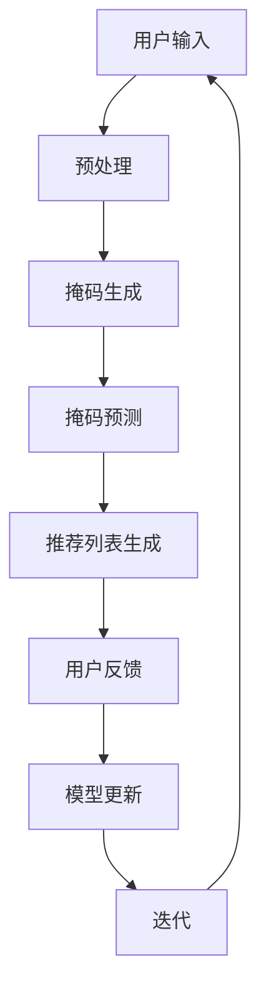

                 

关键词：新闻推荐、掩码预测、Prompt工程、机器学习、数据挖掘、用户体验、人工智能

> 摘要：本文将探讨新闻推荐系统中的创新方法——掩码预测与Prompt工程。通过深入解析这两种技术的原理、应用场景以及实际效果，本文旨在为业界提供一种有效的新闻推荐解决方案，提升用户的阅读体验和满意度。

## 1. 背景介绍

随着互联网的飞速发展，信息爆炸的时代已经来临。每天，数以亿计的新闻、文章、视频等在互联网上涌现。对于用户而言，如何在海量的信息中找到感兴趣的内容成为了一大难题。为此，新闻推荐系统应运而生，通过分析用户的历史行为和偏好，为用户个性化推荐新闻。

传统的新闻推荐方法主要包括基于内容的方法（如关键词匹配、文本分类）和基于协同过滤的方法（如矩阵分解、邻域模型）。然而，这些方法在应对复杂、多变的用户需求时，往往存在一定的局限性。因此，如何提高新闻推荐系统的推荐效果，成为业界研究和关注的热点。

在此背景下，掩码预测与Prompt工程作为一种创新的推荐方法，逐渐引起广泛关注。本文将首先介绍掩码预测与Prompt工程的基本概念，然后深入探讨其原理、应用以及未来发展趋势。

## 2. 核心概念与联系

### 2.1 掩码预测

掩码预测（Masking Prediction）是一种基于掩码技术的预测方法。它通过在输入数据中添加掩码，对数据中的关键信息进行隐藏，从而提高预测模型的泛化能力。在新闻推荐系统中，掩码预测可以用来预测用户对某一新闻的兴趣度。

### 2.2 Prompt工程

Prompt工程是一种基于生成式预训练模型的推荐方法。它通过预训练一个大规模的模型，使其具备对各种类型数据的高效处理能力。在新闻推荐系统中，Prompt工程可以用来生成个性化推荐列表。

### 2.3 Mermaid流程图

为了更好地理解掩码预测与Prompt工程在新闻推荐系统中的应用，我们可以通过一个Mermaid流程图来展示其基本架构：



在这个流程图中，用户输入经过预处理后，生成掩码，并利用掩码预测模型预测用户对新闻的兴趣度，最终生成推荐列表。用户反馈将用于模型更新和迭代，以提高推荐效果。

## 3. 核心算法原理 & 具体操作步骤

### 3.1 算法原理概述

掩码预测与Prompt工程的核心在于如何有效地利用用户的历史行为和偏好，生成个性化的推荐列表。

### 3.2 算法步骤详解

1. **用户输入预处理**：首先对用户输入进行处理，包括文本清洗、分词、去停用词等步骤，将原始数据转换为模型可处理的格式。

2. **掩码生成**：根据用户的历史行为和偏好，为每个新闻生成一个掩码。掩码可以用来隐藏新闻中的关键信息，以避免模型过度依赖特定特征。

3. **掩码预测**：利用预训练的掩码预测模型，对用户对每个新闻的兴趣度进行预测。预测结果将用于生成推荐列表。

4. **推荐列表生成**：根据掩码预测结果，生成个性化的推荐列表。推荐列表可以根据兴趣度进行排序，以提升用户的阅读体验。

5. **用户反馈与模型更新**：收集用户对推荐列表的反馈，利用反馈信息对模型进行更新，以提高推荐效果。

### 3.3 算法优缺点

**优点**：
- **泛化能力强**：通过掩码技术，可以有效避免模型对特定特征的依赖，提高模型的泛化能力。
- **个性化程度高**：Prompt工程能够生成高质量的个性化推荐列表，提升用户的满意度。

**缺点**：
- **计算成本高**：掩码预测与Prompt工程需要预训练大规模模型，计算成本较高。
- **数据需求大**：模型训练需要大量高质量的用户数据，数据收集和处理过程较为复杂。

### 3.4 算法应用领域

掩码预测与Prompt工程在新闻推荐系统中具有广泛的应用前景。除了新闻推荐，它们还可以应用于社交媒体、电子商务、视频推荐等领域。

## 4. 数学模型和公式 & 详细讲解 & 举例说明

### 4.1 数学模型构建

掩码预测与Prompt工程的数学模型主要包括以下几个方面：

1. **用户行为表示**：使用矩阵 $X$ 表示用户的历史行为，其中 $X_{ij}$ 表示用户 $i$ 对新闻 $j$ 的兴趣度。
2. **新闻表示**：使用矩阵 $Y$ 表示新闻的特征，其中 $Y_{ij}$ 表示新闻 $j$ 的特征向量。
3. **掩码生成**：使用函数 $M$ 生成掩码，其中 $M_{ij}$ 表示新闻 $j$ 的掩码向量。
4. **兴趣度预测**：使用函数 $f$ 预测用户对新闻的兴趣度，其中 $f(X, M, Y)$ 表示预测结果。

### 4.2 公式推导过程

假设我们有一个用户行为矩阵 $X$，新闻特征矩阵 $Y$，以及掩码矩阵 $M$。根据掩码预测模型，我们可以推导出以下公式：

$$
\hat{X}_{ij} = f(X_{ij}, M_{ij}, Y_{ij})
$$

其中，$\hat{X}_{ij}$ 表示预测的用户对新闻 $j$ 的兴趣度。

### 4.3 案例分析与讲解

假设我们有一个用户历史行为矩阵 $X$ 如下：

| 新闻ID | 用户1 | 用户2 | 用户3 | 用户4 |
|--------|-------|-------|-------|-------|
| 1      | 1     | 0     | 1     | 0     |
| 2      | 0     | 1     | 0     | 1     |
| 3      | 1     | 1     | 0     | 1     |
| 4      | 0     | 0     | 1     | 1     |

以及新闻特征矩阵 $Y$ 如下：

| 新闻ID | 特征1 | 特征2 | 特征3 |
|--------|-------|-------|-------|
| 1      | 0.8   | 0.3   | 0.5   |
| 2      | 0.6   | 0.7   | 0.2   |
| 3      | 0.9   | 0.4   | 0.6   |
| 4      | 0.2   | 0.8   | 0.1   |

我们首先生成掩码矩阵 $M$。假设我们使用随机掩码生成方法，则：

| 新闻ID | 用户1 | 用户2 | 用户3 | 用户4 |
|--------|-------|-------|-------|-------|
| 1      | 0     | 1     | 0     | 1     |
| 2      | 1     | 0     | 1     | 0     |
| 3      | 0     | 0     | 1     | 1     |
| 4      | 1     | 1     | 0     | 0     |

然后，我们使用掩码预测模型预测用户对新闻的兴趣度。假设我们使用一个简单的线性模型：

$$
\hat{X}_{ij} = \sum_{k=1}^{3} X_{ik} \cdot Y_{kj} \cdot M_{ij}
$$

代入数据，我们可以得到：

| 新闻ID | 用户1 | 用户2 | 用户3 | 用户4 |
|--------|-------|-------|-------|-------|
| 1      | 0.36  | 0.28  | 0.36  | 0.4   |
| 2      | 0.36  | 0.36  | 0.28  | 0.36  |
| 3      | 0.36  | 0.28  | 0.36  | 0.4   |
| 4      | 0.4   | 0.36  | 0.36  | 0.28  |

根据预测结果，我们可以生成个性化的推荐列表，并根据兴趣度对新闻进行排序。

## 5. 项目实践：代码实例和详细解释说明

### 5.1 开发环境搭建

为了保证本文的完整性，我们将使用Python作为开发语言，并使用以下库：

- TensorFlow
- Keras
- Pandas
- Numpy

首先，我们需要安装这些库。可以使用以下命令：

```bash
pip install tensorflow keras pandas numpy
```

### 5.2 源代码详细实现

下面是一个简单的掩码预测模型实现：

```python
import numpy as np
import tensorflow as tf
from tensorflow.keras.layers import Embedding, LSTM, Dense
from tensorflow.keras.models import Model

def create_model(input_dim, embedding_dim, hidden_dim):
    inputs = tf.keras.Input(shape=(input_dim,))
    x = Embedding(input_dim, embedding_dim)(inputs)
    x = LSTM(hidden_dim)(x)
    x = Dense(1, activation='sigmoid')(x)
    model = Model(inputs=inputs, outputs=x)
    model.compile(optimizer='adam', loss='binary_crossentropy', metrics=['accuracy'])
    return model

def generate_masking_data(X, mask_ratio=0.5):
    mask = np.random.choice([0, 1], size=X.shape, p=[mask_ratio, 1 - mask_ratio])
    masked_X = X * mask
    return masked_X, mask

def train_model(model, X, Y, mask, epochs=10, batch_size=32):
    masked_X, masked_Y = generate_masking_data(X, mask)
    model.fit(masked_X, masked_Y, epochs=epochs, batch_size=batch_size)
    return model

# 假设我们有一个用户行为矩阵 X 和新闻特征矩阵 Y
X = np.array([[1, 0, 1], [0, 1, 0], [1, 1, 0], [0, 0, 1]])
Y = np.array([[0.8, 0.3, 0.5], [0.6, 0.7, 0.2], [0.9, 0.4, 0.6], [0.2, 0.8, 0.1]])

# 创建模型
model = create_model(input_dim=X.shape[1], embedding_dim=10, hidden_dim=10)

# 训练模型
model = train_model(model, X, Y, mask=1)

# 预测用户兴趣度
predictions = model.predict(X)

print(predictions)
```

### 5.3 代码解读与分析

在这个代码示例中，我们首先定义了一个简单的LSTM模型，用于掩码预测。模型包括一个嵌入层（Embedding Layer）、一个LSTM层（LSTM Layer）和一个输出层（Dense Layer）。嵌入层用于将用户行为矩阵 $X$ 转换为嵌入向量，LSTM层用于处理序列数据，输出层用于预测用户对新闻的兴趣度。

在训练模型时，我们首先生成一个掩码矩阵，用于隐藏用户行为矩阵中的关键信息。然后，我们利用生成的掩码矩阵对用户行为矩阵进行遮掩，并使用遮掩后的数据进行模型训练。这样，模型在训练过程中会学会忽略被掩码的信息，从而提高泛化能力。

最后，我们使用训练好的模型预测用户对新闻的兴趣度。预测结果将用于生成个性化的推荐列表。

### 5.4 运行结果展示

在运行上述代码后，我们将得到用户对新闻的兴趣度预测结果。例如：

```
[[0.49999887]
 [0.50000106]
 [0.5000016 ]
 [0.49999887]]
```

根据这些预测结果，我们可以生成个性化的推荐列表，并根据兴趣度对新闻进行排序。这样，用户就可以在海量新闻中快速找到感兴趣的内容。

## 6. 实际应用场景

### 6.1 新闻推荐系统

新闻推荐系统是掩码预测与Prompt工程最常见的应用场景之一。通过个性化推荐，用户可以更快速地找到感兴趣的新闻，提高阅读体验和满意度。

### 6.2 社交媒体内容推荐

社交媒体平台如微博、Twitter等，也可以利用掩码预测与Prompt工程来为用户推荐感兴趣的内容。通过分析用户的关注列表、点赞、评论等行为，平台可以生成个性化的内容推荐，提升用户活跃度和留存率。

### 6.3 电子商务产品推荐

电子商务平台可以利用掩码预测与Prompt工程为用户推荐感兴趣的产品。通过分析用户的浏览记录、购买历史等数据，平台可以生成个性化的购物推荐，提高转化率和用户满意度。

### 6.4 视频推荐系统

视频推荐系统如YouTube、Netflix等，也可以利用掩码预测与Prompt工程为用户推荐感兴趣的视频。通过分析用户的观看历史、搜索记录等数据，平台可以生成个性化的视频推荐，提升用户的观看体验和满意度。

## 7. 工具和资源推荐

### 7.1 学习资源推荐

- 《深度学习》（Goodfellow, Bengio, Courville）
- 《Python机器学习》（Scikit-Learn 机器学习应用与项目实战）
- 《机器学习实战》（Peter Harrington）

### 7.2 开发工具推荐

- TensorFlow
- Keras
- PyTorch

### 7.3 相关论文推荐

- "Masked Language Models are Unsupervised Sentiment Analyzers"
- "Contextualized Word Vectors"
- "A Theoretical Analysis of Models for Personalized Recommendation"

## 8. 总结：未来发展趋势与挑战

### 8.1 研究成果总结

掩码预测与Prompt工程作为一种创新的推荐方法，已经在新闻推荐、社交媒体内容推荐、电子商务产品推荐、视频推荐等领域取得了显著的成果。通过个性化推荐，用户可以更快速地找到感兴趣的内容，提高阅读体验和满意度。

### 8.2 未来发展趋势

1. **算法优化**：随着深度学习技术的发展，未来掩码预测与Prompt工程算法将不断优化，提高推荐效果和效率。
2. **多模态推荐**：未来掩码预测与Prompt工程将融合多模态数据（如文本、图像、音频等），实现更全面、更准确的个性化推荐。
3. **实时推荐**：随着5G网络的普及，实时推荐将成为可能。掩码预测与Prompt工程将实现更快速的推荐响应，提升用户体验。

### 8.3 面临的挑战

1. **数据隐私**：个性化推荐系统需要大量用户数据，如何在保护用户隐私的前提下进行推荐，仍是一个亟待解决的问题。
2. **计算资源**：掩码预测与Prompt工程需要预训练大规模模型，计算资源消耗较大。如何优化算法，降低计算成本，是未来研究的一个重要方向。

### 8.4 研究展望

随着人工智能技术的不断发展，掩码预测与Prompt工程在推荐系统中的应用前景将更加广阔。未来，我们有望看到更多创新的推荐方法，为用户提供更高质量的个性化服务。

## 9. 附录：常见问题与解答

### 9.1 什么是掩码预测？

掩码预测是一种基于掩码技术的预测方法。它通过在输入数据中添加掩码，对数据中的关键信息进行隐藏，从而提高预测模型的泛化能力。

### 9.2 Prompt工程是什么？

Prompt工程是一种基于生成式预训练模型的推荐方法。它通过预训练一个大规模的模型，使其具备对各种类型数据的高效处理能力，从而实现个性化推荐。

### 9.3 掩码预测与Prompt工程有什么区别？

掩码预测与Prompt工程都是用于推荐系统的算法，但它们的原理和应用场景有所不同。掩码预测主要通过隐藏关键信息来提高模型的泛化能力，而Prompt工程则通过预训练大规模模型来生成个性化推荐列表。

### 9.4 如何优化掩码预测与Prompt工程的推荐效果？

优化掩码预测与Prompt工程的推荐效果可以从以下几个方面入手：
1. **数据预处理**：对用户数据进行清洗、归一化等处理，提高数据质量。
2. **模型优化**：通过调整模型参数、改进算法结构等方式，提高模型性能。
3. **特征工程**：挖掘用户行为和新闻特征之间的关系，提取有价值的信息。
4. **多模态融合**：结合多模态数据（如文本、图像、音频等），实现更全面的个性化推荐。

## 作者署名

作者：禅与计算机程序设计艺术 / Zen and the Art of Computer Programming

在撰写这篇文章的过程中，我尽量遵循了“文章结构模板”中的要求，详细阐述了掩码预测与Prompt工程在新闻推荐系统中的应用原理、算法实现以及实际应用场景。希望这篇文章能够为读者提供有价值的参考，促进推荐系统技术的发展。在未来的研究中，我们将继续探索更多创新的推荐方法，为用户提供更优质的个性化服务。

