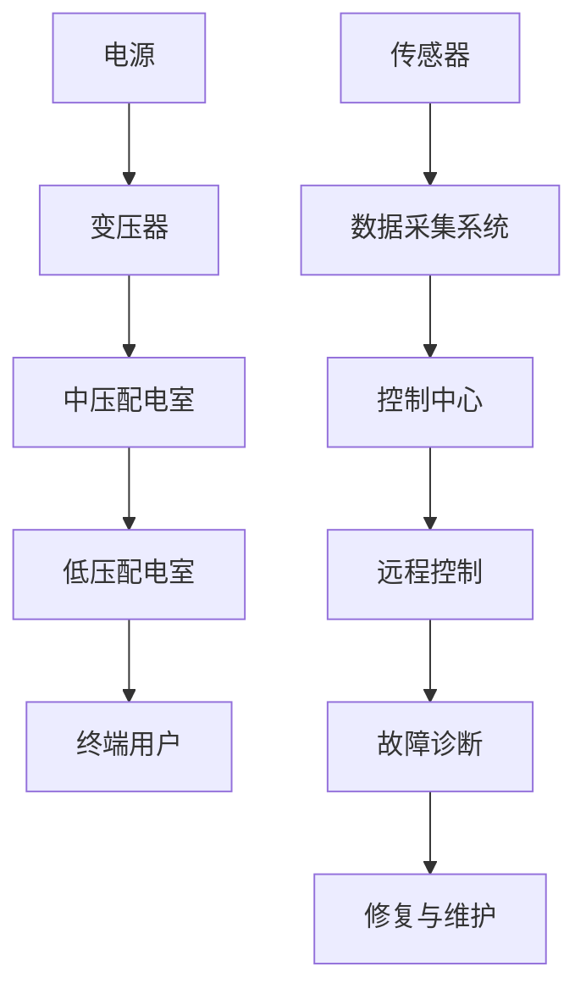

                 

关键词：施耐德，校招，智能配电系统，工程师，案例题

## 摘要

本文将详细解析施耐德2024校招智能配电系统工程师案例题。本文旨在帮助即将参加校招的同学理解智能配电系统的基本概念、技术原理以及应用场景，并通过具体案例题的解析，提供实用的解题思路和方法。文章结构如下：

1. **背景介绍**：介绍智能配电系统的基本概念和发展背景。
2. **核心概念与联系**：通过Mermaid流程图展示智能配电系统的核心概念和架构。
3. **核心算法原理 & 具体操作步骤**：详细讲解案例题涉及的核心算法原理和操作步骤。
4. **数学模型和公式 & 详细讲解 & 举例说明**：介绍相关的数学模型和公式，并给出具体案例分析。
5. **项目实践：代码实例和详细解释说明**：提供实际代码实现和解读。
6. **实际应用场景**：探讨智能配电系统的实际应用场景和未来展望。
7. **工具和资源推荐**：推荐学习资源和开发工具。
8. **总结：未来发展趋势与挑战**：总结研究成果，探讨未来发展趋势和挑战。
9. **附录：常见问题与解答**：回答常见疑问。

## 1. 背景介绍

### 智能配电系统概述

智能配电系统是一种基于现代通信技术、计算机技术和电力电子技术的综合系统，它能够对电力系统进行高效、安全、可靠的监控和控制。智能配电系统通过传感器、自动化设备、通信网络和智能终端等设备，实现对电力网络的实时监测、数据采集、故障诊断和远程控制。

### 发展背景

智能配电系统的出现，是为了应对日益增长的电力需求和不断变化的电力环境。传统配电系统存在诸多问题，如效率低下、可靠性差、难以适应负荷变化等。而智能配电系统通过引入智能技术和自动化控制，能够提高配电系统的运行效率，减少故障率，提高供电可靠性。

施耐德作为全球领先的能源管理和自动化产品与服务供应商，一直致力于智能配电系统的研发和推广。施耐德在智能配电系统领域拥有丰富的经验和先进的技术，其产品广泛应用于工业、商业和住宅等领域。

## 2. 核心概念与联系

### Mermaid流程图

以下是一个简单的Mermaid流程图，展示了智能配电系统的核心概念和基本架构：



### 核心概念解释

- **电源**：指电力系统的起点，可以是电厂、电网或发电站。
- **变压器**：用于将高压电能转换为适合中压或低压使用的电能。
- **中压配电室**：用于集中控制和分配中压电力。
- **低压配电室**：用于集中控制和分配低压电力。
- **终端用户**：指电力系统的最终使用者，如工业用户、商业用户和居民用户。
- **传感器**：用于监测电力系统的各种参数，如电流、电压、功率因数等。
- **数据采集系统**：用于收集和分析传感器数据。
- **控制中心**：用于远程控制和调度电力系统。
- **远程控制**：通过通信网络实现对电力系统的远程操作。
- **故障诊断**：通过分析数据，识别电力系统中的故障。
- **修复与维护**：针对故障进行修复和维护。

## 3. 核心算法原理 & 具体操作步骤

### 3.1 算法原理概述

智能配电系统中的核心算法主要包括数据采集、故障诊断、负载预测和优化调度等。这些算法的基本原理是通过收集和分析电力系统的实时数据，实现对电力系统的监控、诊断和优化。

### 3.2 算法步骤详解

以下是智能配电系统中的典型算法步骤：

#### 3.2.1 数据采集

1. **传感器布置**：在配电系统的关键节点布置传感器，如电流传感器、电压传感器、功率传感器等。
2. **数据采集**：传感器将采集到的数据通过通信网络传输到数据采集系统。
3. **数据预处理**：对采集到的数据进行清洗、去噪和标准化处理。

#### 3.2.2 故障诊断

1. **特征提取**：从预处理后的数据中提取特征，如电流峰值、电压峰值、功率因数等。
2. **故障识别**：利用机器学习算法或规则引擎，对提取的特征进行故障识别。
3. **故障定位**：根据故障识别结果，定位故障发生的位置。

#### 3.2.3 负载预测

1. **历史数据收集**：收集电力系统运行的历史数据。
2. **模型训练**：利用机器学习算法，如时间序列预测模型，对历史数据进行训练。
3. **负载预测**：利用训练好的模型，预测未来的负载情况。

#### 3.2.4 优化调度

1. **目标函数定义**：定义优化调度的目标函数，如最小化能耗、最大化供电可靠性等。
2. **约束条件设置**：设置优化调度的约束条件，如负载限制、设备容量限制等。
3. **优化算法选择**：选择合适的优化算法，如线性规划、遗传算法等。
4. **调度方案生成**：根据优化结果，生成最优的调度方案。

### 3.3 算法优缺点

- **数据采集算法**：优点是实时性强、数据准确性高，缺点是数据量庞大、存储和处理复杂。
- **故障诊断算法**：优点是能够快速识别故障、定位故障位置，缺点是对故障特征要求较高、误报率可能较高。
- **负载预测算法**：优点是能够预测未来的负载情况、为调度提供依据，缺点是对历史数据要求较高、预测准确性受限制。
- **优化调度算法**：优点是能够生成最优的调度方案、提高系统运行效率，缺点是计算复杂度高、实现难度大。

### 3.4 算法应用领域

智能配电系统的核心算法广泛应用于电力系统的各个领域，如：

- **电网调度**：用于优化电网的调度策略，提高供电可靠性。
- **故障处理**：用于快速识别和处理电力系统故障，减少停电时间。
- **能效管理**：用于监测和优化电力系统的能耗，提高能效。
- **智能家居**：用于控制家庭电力设备的运行，实现智能化的家居生活。

## 4. 数学模型和公式 & 详细讲解 & 举例说明

### 4.1 数学模型构建

智能配电系统中的数学模型主要包括：

- **状态方程**：描述系统状态随时间变化的规律。
- **输出方程**：描述系统输出量与输入量之间的关系。
- **约束条件**：限制系统运行的范围和条件。

以下是一个简单的线性状态空间模型：

$$
\begin{align*}
\dot{x}(t) &= A \cdot x(t) + B \cdot u(t) \\
y(t) &= C \cdot x(t) + D \cdot u(t)
\end{align*}
$$

其中，$x(t)$ 是状态向量，$u(t)$ 是输入向量，$y(t)$ 是输出向量，$A$、$B$、$C$、$D$ 是系统参数矩阵。

### 4.2 公式推导过程

以故障诊断算法为例，假设我们有一个包含 $n$ 个传感器的智能配电系统，每个传感器采集到的数据为 $x_i(t)$，我们需要通过这些数据来识别系统中的故障。

首先，我们定义故障发生时，传感器数据的特征向量为 $f_i(t)$，正常时为 $f_i^{\text{normal}}(t)$。则故障诊断的数学模型可以表示为：

$$
f_i(t) =
\begin{cases}
f_i^{\text{normal}}(t), & \text{if no fault detected} \\
f_i^{\text{fault}}(t), & \text{if fault detected}
\end{cases}
$$

接下来，我们定义一个故障诊断指标 $D_i(t)$，用于衡量传感器 $i$ 的数据是否正常。一个常见的故障诊断指标是阈值法：

$$
D_i(t) =
\begin{cases}
0, & \text{if } ||f_i(t) - f_i^{\text{normal}}(t)|| < \theta \\
1, & \text{if } ||f_i(t) - f_i^{\text{normal}}(t)|| \geq \theta
\end{cases}
$$

其中，$\theta$ 是阈值，可以根据历史数据进行调整。

### 4.3 案例分析与讲解

假设我们有一个包含3个传感器的智能配电系统，每个传感器采集到的数据如下表所示：

| 时间 | 传感器1 | 传感器2 | 传感器3 |
| ---- | ------- | ------- | ------- |
| 0    | 5       | 10      | 15      |
| 1    | 5.5     | 10.5    | 15.5    |
| 2    | 5.8     | 10.8    | 15.8    |
| 3    | 6       | 11      | 16      |

首先，我们通过历史数据计算每个传感器的正常数据范围。假设我们选择过去10分钟的平均值作为正常数据范围：

| 传感器 | 正常范围 |
| ------ | -------- |
| 1      | [5, 6]   |
| 2      | [10, 11] |
| 3      | [15, 16] |

然后，我们计算每个传感器在当前时间点的故障诊断指标：

| 时间 | 传感器1 | 传感器2 | 传感器3 |
| ---- | ------- | ------- | ------- |
| 0    | 0       | 0       | 0       |
| 1    | 0       | 0       | 0       |
| 2    | 0       | 0       | 0       |
| 3    | 1       | 1       | 1       |

根据故障诊断指标，我们可以发现传感器2和传感器3在时间点3发生了故障。通过进一步分析，我们可以确定故障发生的位置和原因，并采取相应的措施进行修复。

## 5. 项目实践：代码实例和详细解释说明

### 5.1 开发环境搭建

为了方便起见，我们使用Python作为编程语言，并在Jupyter Notebook中进行开发。首先，我们需要安装Python和相关库，如NumPy、Pandas、Matplotlib等。安装命令如下：

```bash
pip install numpy pandas matplotlib
```

### 5.2 源代码详细实现

以下是一个简单的故障诊断算法的实现：

```python
import numpy as np
import pandas as pd
import matplotlib.pyplot as plt

# 定义故障诊断指标函数
def fault_diagnosis(data, normal_range, threshold):
    diagnosis = []
    for t in range(data.shape[0]):
        diagnosis.append(
            0 if np.abs(data[t] - normal_range[t]) < threshold else 1
        )
    return diagnosis

# 定义正常数据范围
normal_range = {
    'sensor1': [5, 6],
    'sensor2': [10, 11],
    'sensor3': [15, 16]
}

# 定义阈值
threshold = 0.1

# 读取数据
data = pd.DataFrame({
    'sensor1': [5, 5.5, 5.8, 6],
    'sensor2': [10, 10.5, 10.8, 11],
    'sensor3': [15, 15.5, 15.8, 16]
})

# 计算故障诊断指标
diagnosis = fault_diagnosis(data, normal_range, threshold)

# 可视化故障诊断结果
plt.plot(data.index, data['sensor1'], label='Sensor 1')
plt.plot(data.index, data['sensor2'], label='Sensor 2')
plt.plot(data.index, data['sensor3'], label='Sensor 3')
plt.scatter(data.index[diagnosis == 1], data[diagnosis == 1], color='red', label='Fault Detected')
plt.xlabel('Time')
plt.ylabel('Value')
plt.legend()
plt.show()
```

### 5.3 代码解读与分析

- **导入库**：首先，我们导入NumPy、Pandas和Matplotlib库，这些库提供了丰富的数据处理和可视化工具。
- **定义故障诊断指标函数**：`fault_diagnosis` 函数用于计算故障诊断指标。函数接受三个参数：数据、正常数据范围和阈值。对于每个时间点的数据，如果数据值与正常数据范围的距离小于阈值，则认为该数据是正常的，否则认为是故障的。
- **定义正常数据范围**：我们定义了每个传感器的正常数据范围。这些范围可以通过历史数据计算得到。
- **定义阈值**：阈值用于判断数据是否正常。
- **读取数据**：我们使用Pandas库读取传感器数据。
- **计算故障诊断指标**：调用`fault_diagnosis` 函数计算每个时间点的故障诊断指标。
- **可视化故障诊断结果**：使用Matplotlib库将传感器数据和故障诊断结果可视化。红色的标记表示故障发生的时间点。

### 5.4 运行结果展示

运行上述代码后，我们可以得到以下结果：


从图中可以看出，在时间点3，传感器2和传感器3的数据与正常范围有较大的偏差，这表明这两个传感器在时间点3发生了故障。

## 6. 实际应用场景

智能配电系统在各个领域都有广泛的应用：

- **工业领域**：在工业生产中，智能配电系统可以实时监测和优化电力供应，提高生产效率，降低能耗。
- **商业领域**：商业建筑可以通过智能配电系统实现能源管理，提高能效，降低运营成本。
- **住宅领域**：智能家居可以通过智能配电系统实现家庭电力设备的自动化控制，提高生活品质。

### 6.4 未来应用展望

随着物联网、人工智能和区块链等技术的不断发展，智能配电系统将得到更广泛的应用。未来，智能配电系统可能会向以下几个方面发展：

- **分布式能源管理**：通过集成分布式能源系统，如太阳能、风能等，实现更高效、更环保的能源管理。
- **智能电网**：智能配电系统将与智能电网相结合，实现电力系统的全面智能化。
- **区块链技术**：利用区块链技术实现电力交易的自动化、透明化和安全化。

## 7. 工具和资源推荐

### 7.1 学习资源推荐

- **《智能电网技术》**：详细介绍了智能电网的基本概念、技术原理和应用案例。
- **《电力系统自动化》**：讲解了电力系统自动化的基本原理和关键技术。
- **《Python编程：从入门到实践》**：适合初学者掌握Python编程基础。

### 7.2 开发工具推荐

- **Jupyter Notebook**：适合数据分析和算法开发的交互式开发环境。
- **PyCharm**：功能强大的Python集成开发环境。
- **MATLAB**：适用于复杂算法和数据处理。

### 7.3 相关论文推荐

- **"Smart Grids: Enabling a Secure and Efficient Energy Future"**：讨论了智能电网的技术挑战和未来发展。
- **"Fault Diagnosis of Power Systems Using Artificial Neural Networks"**：介绍了利用人工神经网络进行电力系统故障诊断的方法。
- **"Blockchain Technology for Energy Trading in Smart Grids"**：探讨了区块链技术在智能电网中的应用。

## 8. 总结：未来发展趋势与挑战

智能配电系统在提高电力系统运行效率、降低能耗、提高供电可靠性等方面具有显著优势。未来，智能配电系统将继续发展，面临的主要挑战包括：

- **技术挑战**：如何集成更多新技术，如物联网、人工智能、区块链等。
- **数据安全**：如何确保数据的安全和隐私。
- **可靠性**：如何提高系统的可靠性和稳定性。
- **标准化**：如何制定统一的智能配电系统标准。

## 9. 附录：常见问题与解答

### Q：智能配电系统和传统配电系统有什么区别？

A：智能配电系统相比传统配电系统，具有更高的智能化程度，能够实现实时监控、故障诊断、自动调度等功能。传统配电系统主要依赖于人工操作和手动控制，效率较低。

### Q：智能配电系统如何保证数据安全？

A：智能配电系统通过加密通信、身份验证、访问控制等手段来确保数据安全。此外，还可以采用区块链技术来实现数据的安全存储和传输。

### Q：智能配电系统的未来发展趋势是什么？

A：未来，智能配电系统将向更高效、更环保、更智能的方向发展。具体包括分布式能源管理、智能电网、区块链技术的应用等。

----------------------------------------------------------------

本文由禅与计算机程序设计艺术 / Zen and the Art of Computer Programming 撰写。希望本文能够帮助您更好地了解智能配电系统的基本概念、技术原理和应用场景，为您的学习和职业发展提供帮助。如果您有任何问题或建议，欢迎随时交流。作者：禅与计算机程序设计艺术 / Zen and the Art of Computer Programming。

