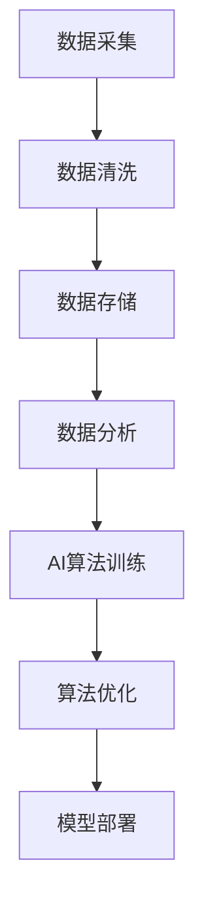

                 

关键词：AI，数据，企业，核心竞争力，算法，应用场景，未来展望

摘要：随着人工智能（AI）技术的迅速发展，数据的重要性日益凸显。本文旨在探讨数据在AI领域中扮演的关键角色，以及如何将数据转化为企业的核心竞争力。通过对核心算法原理、数学模型、项目实践等方面的详细解析，本文旨在为读者提供一个全面、深入的理解，帮助企业在AI领域取得成功。

## 1. 背景介绍

近年来，人工智能（AI）技术取得了飞速发展，从最初的模拟简单的逻辑推理，到如今的复杂模式识别、自然语言处理、自动驾驶等应用，AI正在深刻改变着我们的生活方式。而这一切，离不开数据的支撑。数据不仅是AI算法训练的基础，也是企业核心竞争力的重要组成部分。

在当今的商业环境中，数据已经成为一种新的生产要素，与劳动力、资本和技术一样，成为企业竞争的基石。企业通过收集、整理和分析数据，可以更准确地了解市场需求、优化业务流程、提高运营效率，从而在激烈的市场竞争中脱颖而出。

## 2. 核心概念与联系

为了更好地理解数据在AI领域中的关键作用，我们首先需要明确几个核心概念，并展示它们之间的联系。

### 2.1 数据种类

- 结构化数据：指具有固定格式和模型的数据，如数据库、电子表格等。
- 半结构化数据：指部分结构化的数据，如XML、JSON等。
- 非结构化数据：指没有固定模型和格式的大量数据，如图像、音频、视频等。

### 2.2 数据来源

- 内部数据：企业内部产生的数据，如销售记录、客户信息、生产数据等。
- 外部数据：来自企业外部的数据，如市场调查、社交媒体、新闻资讯等。

### 2.3 数据处理与分析

- 数据采集：从各种数据源收集数据。
- 数据清洗：去除数据中的噪声和不完整信息。
- 数据存储：将数据存储在合适的数据库或数据仓库中。
- 数据分析：使用统计方法和机器学习算法，从数据中提取有价值的信息。

### 2.4 数据与AI的关系

- 数据是AI算法的基础，没有数据，AI算法就无法进行有效的训练和学习。
- 数据的质量直接影响AI算法的性能，高质量的数据可以帮助算法更好地识别模式和规律。
- 数据的多样性和规模是AI算法实现突破的关键，丰富的数据可以为算法提供更广泛的学习空间。

下面是数据与AI关系的Mermaid流程图：



## 3. 核心算法原理 & 具体操作步骤

### 3.1 算法原理概述

在AI领域中，常见的算法包括监督学习、无监督学习、强化学习等。每种算法都有其独特的原理和应用场景。

- **监督学习**：通过已知输入输出对模型进行训练，从而实现对新数据的预测。常见的算法有线性回归、逻辑回归、决策树、随机森林、支持向量机等。
- **无监督学习**：在没有已知输出标签的情况下，通过数据间的内在规律进行训练。常见的算法有聚类、降维、关联规则挖掘等。
- **强化学习**：通过与环境交互，不断优化决策策略，以实现长期目标。常见的算法有Q学习、深度Q网络（DQN）、策略梯度方法等。

### 3.2 算法步骤详解

以监督学习为例，其基本步骤如下：

1. **数据预处理**：包括数据清洗、归一化、特征提取等。
2. **模型选择**：根据问题特点选择合适的算法模型。
3. **模型训练**：使用已知数据集对模型进行训练。
4. **模型评估**：使用验证集对模型性能进行评估。
5. **模型优化**：根据评估结果调整模型参数。
6. **模型部署**：将训练好的模型应用到实际问题中。

### 3.3 算法优缺点

- **监督学习**：优点是预测准确，缺点是需要大量标注数据。
- **无监督学习**：优点是不需要标注数据，缺点是难以保证预测准确。
- **强化学习**：优点是能够处理动态环境，缺点是训练过程相对复杂。

### 3.4 算法应用领域

- **监督学习**：广泛应用于图像识别、自然语言处理、推荐系统等领域。
- **无监督学习**：广泛应用于数据挖掘、模式识别、聚类分析等领域。
- **强化学习**：广泛应用于游戏AI、自动驾驶、机器人控制等领域。

## 4. 数学模型和公式 & 详细讲解 & 举例说明

### 4.1 数学模型构建

以线性回归为例，其数学模型可以表示为：

$$
y = \beta_0 + \beta_1x + \epsilon
$$

其中，$y$ 是因变量，$x$ 是自变量，$\beta_0$ 和 $\beta_1$ 是模型的参数，$\epsilon$ 是误差项。

### 4.2 公式推导过程

线性回归的推导过程如下：

1. **假设模型**：假设因变量 $y$ 与自变量 $x$ 存在线性关系。
2. **最小二乘法**：通过最小化误差平方和，求解模型的参数。
3. **推导结果**：得到线性回归的数学模型。

### 4.3 案例分析与讲解

假设我们要预测房价，已知自变量 $x$ 为房屋面积，因变量 $y$ 为房价。我们可以使用线性回归模型来建立预测模型。

1. **数据收集**：收集一定数量的房屋数据，包括房屋面积和房价。
2. **数据预处理**：对数据进行清洗和归一化处理。
3. **模型训练**：使用已知数据集对线性回归模型进行训练。
4. **模型评估**：使用验证集对模型性能进行评估。
5. **模型部署**：将训练好的模型应用到新的房屋数据中，进行房价预测。

## 5. 项目实践：代码实例和详细解释说明

### 5.1 开发环境搭建

在Python环境中，我们可以使用以下库进行线性回归模型的构建和训练：

- NumPy：用于数组计算和数据处理。
- pandas：用于数据操作和分析。
- scikit-learn：提供线性回归算法的实现。

### 5.2 源代码详细实现

以下是一个简单的线性回归代码实例：

```python
import numpy as np
import pandas as pd
from sklearn.linear_model import LinearRegression
from sklearn.model_selection import train_test_split

# 数据收集
data = pd.read_csv("house_data.csv")

# 数据预处理
X = data[['area']]
y = data['price']

# 模型训练
X_train, X_test, y_train, y_test = train_test_split(X, y, test_size=0.2, random_state=42)
model = LinearRegression()
model.fit(X_train, y_train)

# 模型评估
score = model.score(X_test, y_test)
print("Model accuracy:", score)

# 模型部署
new_data = np.array([[1500]])
predicted_price = model.predict(new_data)
print("Predicted price:", predicted_price)
```

### 5.3 代码解读与分析

上述代码首先导入所需的库，然后从CSV文件中读取数据，并进行预处理。接着，使用scikit-learn库的线性回归模型对数据集进行训练，并在测试集上评估模型性能。最后，使用训练好的模型对新数据进行房价预测。

## 6. 实际应用场景

### 6.1 金融领域

在金融领域，数据分析和AI算法被广泛应用于风险评估、股票交易、信用评分等方面。通过分析大量历史数据，金融机构可以更准确地评估风险，优化投资策略，提高业务效率。

### 6.2 零售行业

零售行业中的数据分析和AI算法可以帮助企业进行需求预测、库存管理、个性化推荐等。通过分析消费者的购物行为和偏好，零售企业可以提供更个性化的服务，提高客户满意度。

### 6.3 医疗领域

在医疗领域，AI算法可以帮助医生进行疾病诊断、手术规划、药物推荐等。通过分析大量的医学数据，AI系统可以提供更准确、个性化的医疗建议，提高医疗质量。

## 7. 未来应用展望

随着AI技术的不断进步和数据规模的不断扩大，未来数据在AI领域中的应用前景将更加广阔。以下是一些可能的未来应用方向：

### 7.1 自动驾驶

自动驾驶技术需要大量的实时数据来感知和决策。未来，数据分析和AI算法将进一步提高自动驾驶系统的安全性和可靠性，实现真正的无人驾驶。

### 7.2 智慧城市

智慧城市需要大量的数据来支持城市管理和规划。未来，数据分析和AI算法将帮助城市实现更智能的管理，提高市民的生活质量。

### 7.3 个性化医疗

个性化医疗需要根据患者的数据提供定制化的治疗方案。未来，数据分析和AI算法将帮助医生更好地了解患者病情，提供更有效的治疗方案。

## 8. 总结：未来发展趋势与挑战

### 8.1 研究成果总结

本文从多个角度探讨了数据在AI领域中的重要性，分析了数据与AI的关系、核心算法原理、数学模型、项目实践等方面。通过这些分析，我们得出了以下结论：

- 数据是AI算法的基础，数据质量直接影响算法性能。
- 数据的多样性和规模是AI算法实现突破的关键。
- 数据分析和AI算法在各个领域都有广泛的应用前景。

### 8.2 未来发展趋势

- 数据分析和AI算法将继续深度融合，推动技术进步。
- 数据隐私和安全将成为重要议题，影响数据应用的发展。
- 数据分析工具和平台将更加智能化，降低数据分析的门槛。

### 8.3 面临的挑战

- 数据隐私和安全：随着数据规模的扩大，如何保护用户隐私和安全成为一个重要问题。
- 数据质量：高质量的数据是AI算法成功的关键，如何保证数据质量是一个挑战。
- 技术门槛：数据分析技术较为复杂，如何降低技术门槛，让更多人能够应用数据分析技术。

### 8.4 研究展望

- 开发更高效、更鲁棒的数据分析算法，提高数据处理和分析能力。
- 研究数据隐私保护技术，保障数据安全。
- 推动数据分析工具和平台的智能化，降低应用门槛。

## 9. 附录：常见问题与解答

### 9.1 数据分析和AI算法有什么区别？

数据分析和AI算法都是基于数据的技术，但它们的应用范围和目标不同。数据分析侧重于从数据中提取有价值的信息，而AI算法则侧重于使用数据训练模型，实现自动化决策和预测。

### 9.2 数据质量对AI算法有什么影响？

数据质量直接影响AI算法的性能。高质量的数据可以帮助算法更好地识别模式和规律，提高预测准确性。而低质量的数据则可能导致算法性能下降，甚至产生错误的预测。

### 9.3 如何保证数据隐私和安全？

为了保证数据隐私和安全，可以采取以下措施：

- 数据加密：对数据进行加密，防止数据泄露。
- 数据匿名化：对数据进行匿名化处理，保护个人隐私。
- 数据访问控制：对数据的访问权限进行严格管理，防止未经授权的访问。
- 数据审计：定期对数据进行分析和审计，及时发现和处理异常情况。

---

作者：禅与计算机程序设计艺术 / Zen and the Art of Computer Programming


