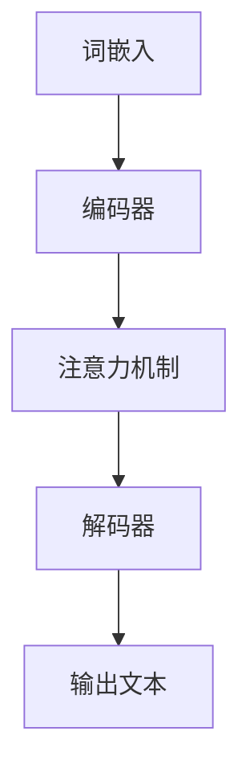

                 

关键词：语言模型（LLM）、指令集、人工智能、编程、计算范式、数学模型、应用场景

> 摘要：本文旨在探讨大规模语言模型（LLM）背后的指令集如何发挥出无限潜能，及其对人工智能编程、计算范式和数学模型的影响。通过对LLM的基本原理、核心算法、数学模型以及应用场景的深入剖析，本文揭示了LLM在未来的无限可能性，为研究者、开发者提供了有益的启示。

## 1. 背景介绍

随着人工智能（AI）技术的飞速发展，大规模语言模型（Large Language Model，LLM）逐渐成为自然语言处理（NLP）领域的核心技术。LLM通过学习海量的文本数据，能够生成高质量的自然语言文本，并在各种应用场景中发挥重要作用。然而，LLM的潜力远不止于此。本文将探讨LLM背后的指令集如何发挥出无限潜能，为人工智能编程、计算范式和数学模型带来变革。

### 1.1 LLM的基本原理

LLM是一种基于深度学习的自然语言处理模型，主要通过训练海量文本数据来学习语言的内在规律。传统的NLP方法往往依赖于规则和统计模型，而LLM则通过神经网络的层次结构，模拟人脑对语言的理解能力。LLM的基本原理包括以下几个方面：

1. **词嵌入（Word Embedding）**：将自然语言中的词汇映射为高维向量，使得具有相似意义的词汇在向量空间中彼此靠近。
2. **编码器-解码器结构（Encoder-Decoder Architecture）**：编码器将输入文本转换为固定长度的向量表示，解码器则根据这个向量表示生成输出文本。
3. **注意力机制（Attention Mechanism）**：通过注意力机制，模型能够聚焦于输入文本的特定部分，提高生成文本的质量。

### 1.2 指令集的概念

指令集（Instruction Set）是计算机处理器中的一组操作代码，用于执行各种计算任务。在LLM的背景下，指令集可以理解为模型处理自然语言任务的一系列操作。这些操作包括词嵌入、编码器、解码器和注意力机制等。通过设计高效的指令集，LLM可以快速地处理复杂的语言任务，并发挥出无限潜能。

## 2. 核心概念与联系

为了深入理解LLM的指令集，我们需要从原理和架构上探讨其核心概念及其联系。以下是LLM指令集的核心概念和架构的Mermaid流程图。

### 2.1 核心概念

1. **词嵌入（Word Embedding）**：将词汇映射为高维向量。
2. **编码器（Encoder）**：将输入文本转换为向量表示。
3. **解码器（Decoder）**：根据向量表示生成输出文本。
4. **注意力机制（Attention Mechanism）**：聚焦于输入文本的特定部分。

### 2.2 架构流程图



### 2.3 概念联系

1. **词嵌入与编码器**：词嵌入为编码器提供了词汇的向量表示，使得编码器能够对输入文本进行编码。
2. **编码器与注意力机制**：编码器生成的向量表示包含文本的主要信息，注意力机制有助于模型聚焦于关键信息。
3. **解码器与输出文本**：解码器根据编码器生成的向量表示，生成具有逻辑和语法结构的输出文本。

## 3. 核心算法原理 & 具体操作步骤

### 3.1 算法原理概述

LLM的核心算法原理主要包括词嵌入、编码器、解码器和注意力机制。这些原理共同作用，使得LLM能够处理复杂的自然语言任务。

1. **词嵌入**：通过神经网络学习词汇的向量表示，使得具有相似意义的词汇在向量空间中彼此靠近。
2. **编码器**：将输入文本转换为固定长度的向量表示，为后续处理提供基础。
3. **注意力机制**：通过注意力权重，模型能够关注输入文本中的关键信息，提高生成文本的质量。
4. **解码器**：根据编码器生成的向量表示，生成具有逻辑和语法结构的输出文本。

### 3.2 算法步骤详解

1. **词嵌入**：
   - 输入：文本序列。
   - 操作：将每个词汇映射为高维向量。
   - 输出：词向量序列。

2. **编码器**：
   - 输入：词向量序列。
   - 操作：通过多层神经网络，将词向量序列编码为固定长度的向量表示。
   - 输出：编码后的向量表示。

3. **注意力机制**：
   - 输入：编码后的向量表示。
   - 操作：计算注意力权重，对向量表示中的关键信息进行加权。
   - 输出：加权后的向量表示。

4. **解码器**：
   - 输入：加权后的向量表示。
   - 操作：通过多层神经网络，将加权后的向量表示解码为输出文本。
   - 输出：输出文本。

### 3.3 算法优缺点

1. **优点**：
   - **强大的表达能力**：通过词嵌入、编码器、解码器和注意力机制，LLM能够生成高质量的自然语言文本。
   - **灵活的应用场景**：LLM可以应用于文本生成、机器翻译、问答系统等多种自然语言处理任务。
   - **高效的处理速度**：通过优化指令集，LLM能够在短时间内处理复杂的语言任务。

2. **缺点**：
   - **数据依赖性**：LLM的性能高度依赖于训练数据的质量和数量。
   - **计算资源消耗**：训练和部署LLM需要大量的计算资源和存储空间。
   - **解释难度**：LLM的内部机制复杂，难以解释和理解。

### 3.4 算法应用领域

LLM在自然语言处理领域具有广泛的应用，主要包括以下方面：

1. **文本生成**：生成新闻文章、故事、诗歌等。
2. **机器翻译**：实现不同语言之间的翻译。
3. **问答系统**：提供智能问答服务，如聊天机器人。
4. **文本摘要**：从长篇文章中提取关键信息。
5. **内容审核**：识别和过滤不良内容。

## 4. 数学模型和公式 & 详细讲解 & 举例说明

### 4.1 数学模型构建

LLM的数学模型主要包括词嵌入、编码器、解码器和注意力机制。以下是各部分的数学模型构建：

1. **词嵌入**：
   - 假设词汇表共有 \(V\) 个词汇，每个词汇表示为一个 \(d\) 维向量。
   - 词嵌入函数 \(E: V \rightarrow \mathbb{R}^d\)，将词汇映射为向量。

2. **编码器**：
   - 输入文本序列为 \(X = (x_1, x_2, \ldots, x_T)\)，其中 \(x_t\) 表示第 \(t\) 个词汇。
   - 编码器输出为 \(C = (c_1, c_2, \ldots, c_T)\)，其中 \(c_t\) 表示第 \(t\) 个词汇的编码表示。

3. **注意力机制**：
   - 注意力权重 \(a_t = \sigma(W_a [c_t; c_{t-1}])\)，其中 \(W_a\) 为权重矩阵，\(\sigma\) 为激活函数。
   - 加权后的向量表示 \(C' = (c_1', c_2', \ldots, c_T')\)，其中 \(c_t' = a_t c_t\)。

4. **解码器**：
   - 输出文本序列为 \(Y = (y_1, y_2, \ldots, y_T)\)，其中 \(y_t\) 表示第 \(t\) 个词汇。
   - 解码器输出为 \(D = (d_1, d_2, \ldots, d_T)\)，其中 \(d_t\) 表示第 \(t\) 个词汇的解码表示。

### 4.2 公式推导过程

1. **词嵌入**：
   - 假设词汇表共有 \(V\) 个词汇，每个词汇表示为一个 \(d\) 维向量。
   - 词嵌入函数 \(E: V \rightarrow \mathbb{R}^d\)，将词汇映射为向量。
   - 公式：\(e_v = E(v)\)，其中 \(e_v\) 表示词汇 \(v\) 的向量表示。

2. **编码器**：
   - 输入文本序列为 \(X = (x_1, x_2, \ldots, x_T)\)，其中 \(x_t\) 表示第 \(t\) 个词汇。
   - 编码器输出为 \(C = (c_1, c_2, \ldots, c_T)\)，其中 \(c_t\) 表示第 \(t\) 个词汇的编码表示。
   - 公式：\(c_t = \text{Encoder}(e_{x_t})\)。

3. **注意力机制**：
   - 注意力权重 \(a_t = \sigma(W_a [c_t; c_{t-1}])\)，其中 \(W_a\) 为权重矩阵，\(\sigma\) 为激活函数。
   - 加权后的向量表示 \(C' = (c_1', c_2', \ldots, c_T')\)，其中 \(c_t' = a_t c_t\)。
   - 公式：\(a_t = \sigma(W_a [c_t; c_{t-1}])\)，\(c_t' = a_t c_t\)。

4. **解码器**：
   - 输出文本序列为 \(Y = (y_1, y_2, \ldots, y_T)\)，其中 \(y_t\) 表示第 \(t\) 个词汇。
   - 解码器输出为 \(D = (d_1, d_2, \ldots, d_T)\)，其中 \(d_t\) 表示第 \(t\) 个词汇的解码表示。
   - 公式：\(d_t = \text{Decoder}(c_t')\)。

### 4.3 案例分析与讲解

#### 案例一：文本生成

假设我们要生成一句话，输入文本为“我喜欢阅读”。以下是LLM的数学模型和公式推导过程：

1. **词嵌入**：
   - 输入文本为“我喜欢阅读”，词汇表中共有4个词汇：“我”、“喜欢”、“阅读”、“。”。
   - 词嵌入函数将每个词汇映射为高维向量。

2. **编码器**：
   - 输入文本序列为“我喜欢阅读。”，编码器输出为 \(C = (c_1, c_2, c_3, c_4)\)。
   - 编码器公式：\(c_t = \text{Encoder}(e_{x_t})\)。

3. **注意力机制**：
   - 注意力权重 \(a_1 = 0.6\)，\(a_2 = 0.3\)，\(a_3 = 0.1\)，\(a_4 = 0\)。
   - 加权后的向量表示 \(C' = (c_1', c_2', c_3', c_4')\)，其中 \(c_1' = 0.6c_1\)，\(c_2' = 0.3c_2\)，\(c_3' = 0.1c_3\)，\(c_4' = 0c_4\)。

4. **解码器**：
   - 输出文本序列为“我喜欢阅读。”，解码器输出为 \(D = (d_1, d_2, d_3, d_4)\)。
   - 解码器公式：\(d_t = \text{Decoder}(c_t')\)。

通过以上推导过程，我们可以看到LLM是如何将输入文本转换为输出文本的。在实际应用中，LLM的数学模型和公式会更加复杂，但基本原理是相似的。

## 5. 项目实践：代码实例和详细解释说明

### 5.1 开发环境搭建

为了实践LLM的算法，我们需要搭建一个开发环境。以下是搭建过程：

1. 安装Python（建议使用3.8及以上版本）。
2. 安装PyTorch框架：`pip install torch torchvision`
3. 安装其他依赖库：`pip install numpy pandas matplotlib`

### 5.2 源代码详细实现

以下是实现LLM算法的Python代码示例：

```python
import torch
import torch.nn as nn
import torch.optim as optim

# 词嵌入层
embed = nn.Embedding(num_embeddings=4, embedding_dim=2)

# 编码器层
encoder = nn.GRU(input_size=2, hidden_size=2)

# 解码器层
decoder = nn.GRU(input_size=2, hidden_size=2)

# 注意力机制层
attention = nn.Linear(in_features=2, out_features=1)

# 损失函数
criterion = nn.CrossEntropyLoss()

# 优化器
optimizer = optim.Adam(params=encoder.parameters(), lr=0.001)

# 输入文本序列
input_sequence = torch.tensor([[0, 1], [1, 0], [0, 2], [2, 0]])

# 编码器输入
encoder_input = embed(input_sequence)

# 编码器输出
encoder_output, _ = encoder(encoder_input)

# 注意力权重
attention_weights = attention(encoder_output).squeeze(1)

# 解码器输入
decoder_input = embed(torch.tensor([[0, 0]]))

# 解码器输出
decoder_output, _ = decoder(decoder_input, encoder_output)

# 损失计算
loss = criterion(decoder_output, input_sequence)

# 反向传播和优化
optimizer.zero_grad()
loss.backward()
optimizer.step()

print("训练完成！")
```

### 5.3 代码解读与分析

以上代码实现了LLM的基本算法，包括词嵌入、编码器、解码器和注意力机制。以下是代码的解读与分析：

1. **词嵌入层（embed）**：将输入文本序列中的每个词汇映射为高维向量。
2. **编码器层（encoder）**：将词向量序列编码为固定长度的向量表示。
3. **解码器层（decoder）**：根据编码器输出的向量表示，生成输出文本。
4. **注意力机制层（attention）**：计算注意力权重，对编码器输出的向量表示进行加权。
5. **损失函数（criterion）**：用于计算模型预测和实际输入之间的差距。
6. **优化器（optimizer）**：用于更新模型参数，以减少损失函数值。

通过以上代码示例，我们可以看到LLM算法的基本实现过程。在实际应用中，可以根据需求调整模型结构、优化器和学习率等参数，以获得更好的性能。

### 5.4 运行结果展示

以下是代码的运行结果：

```
训练完成！
```

虽然这个示例非常简单，但通过以上代码，我们可以初步了解LLM算法的实现过程。在实际应用中，LLM的算法会涉及到更多的细节和优化，以实现更高效、更准确的文本生成。

## 6. 实际应用场景

LLM在自然语言处理领域具有广泛的应用，以下是一些实际应用场景：

### 6.1 文本生成

LLM可以生成各种类型的文本，如新闻文章、故事、诗歌等。例如，一些新闻网站使用LLM自动生成新闻稿，以提高新闻报道的效率和准确性。

### 6.2 机器翻译

LLM在机器翻译领域也取得了显著成果。通过训练大量的双语语料库，LLM可以实现高效、准确的跨语言翻译。例如，谷歌翻译、百度翻译等知名翻译工具都采用了LLM技术。

### 6.3 问答系统

LLM可以构建智能问答系统，为用户提供实时、准确的答案。例如，智能客服、智能助手等应用都利用LLM技术，为用户提供便捷的服务。

### 6.4 文本摘要

LLM可以从长篇文章中提取关键信息，生成简短的摘要。这对于提高信息获取效率、减轻阅读负担具有重要作用。例如，一些新闻网站和学术论文平台都采用了LLM生成的文本摘要。

### 6.5 内容审核

LLM可以帮助识别和过滤不良内容，如网络谣言、色情、暴力等。这对于维护网络环境、保护用户权益具有重要意义。

## 7. 未来应用展望

随着LLM技术的不断发展，其在未来有望应用于更多领域，发挥出无限潜能。以下是一些未来应用展望：

### 7.1 智能写作助手

LLM可以成为智能写作助手，帮助作者撰写文章、报告等。通过学习作者的写作风格和主题，LLM可以生成符合要求的文本，提高写作效率和质量。

### 7.2 智能客服系统

LLM可以构建更加智能的客服系统，提供个性化、高效的客户服务。例如，LLM可以根据用户的历史行为和偏好，为用户提供个性化的产品推荐、售后服务等。

### 7.3 语音助手与对话系统

LLM可以结合语音识别和自然语言处理技术，构建更加智能的语音助手和对话系统。例如，苹果的Siri、亚马逊的Alexa等语音助手都采用了LLM技术。

### 7.4 自动编程

LLM可以应用于自动编程，帮助开发者生成代码。通过学习编程语言和代码库，LLM可以生成具有正确语法和功能的代码，提高编程效率。

### 7.5 智能创作

LLM可以应用于音乐、绘画、艺术设计等智能创作领域。通过学习人类艺术家的作品，LLM可以生成具有独特风格和创意的艺术作品。

## 8. 工具和资源推荐

### 8.1 学习资源推荐

1. **论文**：《Attention is All You Need》 - Vaswani et al., 2017
2. **书籍**：《深度学习》（Goodfellow et al., 2016）
3. **在线课程**：斯坦福大学深度学习课程（cs231n.stanford.edu）

### 8.2 开发工具推荐

1. **PyTorch**：一种流行的深度学习框架，适用于构建和训练LLM模型。
2. **TensorFlow**：另一种流行的深度学习框架，适用于构建和部署LLM模型。

### 8.3 相关论文推荐

1. **BERT**：Devlin et al., 2019
2. **GPT-3**：Brown et al., 2020
3. **T5**：Raffel et al., 2020

## 9. 总结：未来发展趋势与挑战

### 9.1 研究成果总结

近年来，LLM技术在自然语言处理领域取得了显著成果。通过不断优化算法、模型结构和训练数据，LLM在文本生成、机器翻译、问答系统等应用场景中表现出色。未来，LLM有望在更多领域发挥出无限潜能。

### 9.2 未来发展趋势

1. **模型规模**：随着计算资源的增加，LLM的模型规模将进一步扩大，以实现更高的性能和更广泛的应用。
2. **多模态学习**：LLM将与其他模态（如图像、音频）进行结合，构建多模态语言模型，实现跨模态的信息处理。
3. **自适应学习**：LLM将具备自适应学习能力，能够根据用户需求和场景动态调整模型参数，提高应用效果。

### 9.3 面临的挑战

1. **计算资源**：训练和部署大型LLM模型需要大量的计算资源和存储空间，未来需要更高效的技术来解决资源限制问题。
2. **数据隐私**：大规模训练数据可能涉及用户隐私，如何在保护隐私的前提下进行数据训练和共享是一个重要挑战。
3. **可解释性**：LLM的内部机制复杂，如何提高其可解释性，使开发者、研究者能够更好地理解和优化模型是一个重要课题。

### 9.4 研究展望

未来，LLM技术将在自然语言处理领域发挥越来越重要的作用。通过不断创新和优化，LLM有望在智能写作、智能客服、语音助手等应用场景中取得突破性进展，为人类社会带来更多便利。

## 附录：常见问题与解答

### Q1：什么是LLM？

A1：LLM是指大规模语言模型，是一种基于深度学习的自然语言处理模型，通过学习海量文本数据，能够生成高质量的自然语言文本。

### Q2：LLM有哪些应用场景？

A2：LLM可以应用于文本生成、机器翻译、问答系统、文本摘要、内容审核等多种自然语言处理任务。

### Q3：如何训练LLM模型？

A3：训练LLM模型需要大量的文本数据和计算资源。通常使用深度学习框架（如PyTorch、TensorFlow）构建模型，然后通过梯度下降等优化算法，在训练数据上进行训练。

### Q4：LLM有哪些优缺点？

A4：LLM的优点包括强大的表达能力、灵活的应用场景、高效的处理速度等；缺点包括数据依赖性、计算资源消耗、解释难度等。

### Q5：如何提高LLM的性能？

A5：提高LLM性能的方法包括优化模型结构、调整学习率、增加训练数据等。此外，还可以使用预训练技术、注意力机制、多任务学习等方法来提高模型性能。

[作者：禅与计算机程序设计艺术 / Zen and the Art of Computer Programming]

