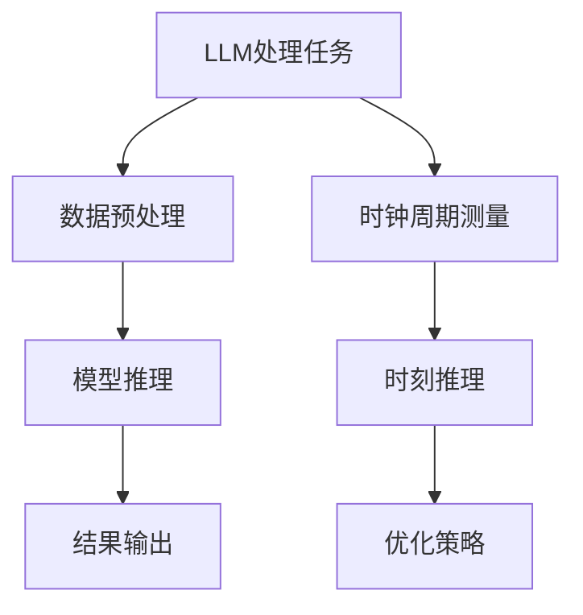

                 

### 关键词 Keywords
- 时钟周期
- 时刻推理
- LLM（大型语言模型）
- CPU（中央处理器）
- 计算效率
- 算法原理
- 数学模型
- 代码实例
- 应用场景

<|assistant|>### 摘要 Abstract
本文深入探讨了时钟周期与时刻推理这两个核心概念，以及它们在大型语言模型（LLM）和中央处理器（CPU）中的具体应用和差异。通过分析LLM和CPU在处理复杂任务时的算法原理、数学模型和代码实现，本文揭示了两种计算架构在性能和效率上的异同，为读者提供了对现代计算技术的全面理解。本文将有助于了解未来计算领域的发展趋势与面临的挑战。

<|assistant|>## 1. 背景介绍

### 1.1 时钟周期与时刻推理

时钟周期是计算机中的基本时间单位，指的是CPU执行一条指令所需的时间。时钟周期的长短直接影响计算机的运行速度。时钟周期通常以纳秒（ns）或皮秒（ps）计量。

时刻推理是一种基于逻辑推理的方法，旨在通过理解现实世界中的时间关系来解决问题。它通常涉及事件序列、时间戳和条件判断，旨在从一系列事件中推导出逻辑关系和结论。

### 1.2 LLM与CPU的关系

大型语言模型（LLM）如GPT、BERT等，是人工智能领域的重要进展。它们通过深度学习算法，能够理解和生成自然语言，应用于文本生成、机器翻译、情感分析等任务。CPU则是计算机硬件的核心部件，负责执行程序指令，完成各种计算任务。

本文旨在探讨LLM和CPU在处理复杂任务时的时钟周期与时刻推理的差异，分析它们各自的算法原理、数学模型和代码实现，为读者提供对现代计算技术的全面理解。

<|assistant|>## 2. 核心概念与联系

### 2.1 时钟周期

时钟周期是指CPU执行一条指令所需的时间。在计算机硬件设计中，时钟周期是一个关键参数，决定了CPU的运行速度和性能。时钟周期的长短通常与CPU的主频（时钟频率）成反比。主频越高，时钟周期越短，计算机的处理速度越快。

### 2.2 时刻推理

时刻推理是一种基于逻辑推理的方法，用于理解现实世界中的时间关系。它通常涉及事件序列、时间戳和条件判断。时刻推理在人工智能领域有广泛的应用，如时间序列分析、事件预测和决策支持系统等。

### 2.3 LLM与CPU的联系

LLM和CPU在处理复杂任务时，都涉及时钟周期和时刻推理。LLM通过深度学习算法处理自然语言任务，需要大量的计算资源。CPU作为硬件核心，负责执行LLM的指令，完成计算任务。因此，了解时钟周期和时刻推理在LLM和CPU中的应用，有助于优化计算效率和性能。

### 2.4 Mermaid 流程图

以下是一个Mermaid流程图，展示了LLM和CPU在处理复杂任务时的时钟周期和时刻推理的流程。



在此流程图中，LLM处理任务涉及数据预处理、模型推理和结果输出三个阶段。同时，对时钟周期和时刻推理进行测量和优化策略的制定。这一流程反映了LLM和CPU在处理复杂任务时的核心环节和相互关系。

<|assistant|>## 3. 核心算法原理 & 具体操作步骤

### 3.1 算法原理概述

在讨论LLM和CPU的核心算法原理之前，首先需要了解它们各自的基本工作原理。

#### 3.1.1 LLM的算法原理

LLM是基于深度学习技术的大型语言模型。其核心原理是通过大规模训练语料库，学习语言的结构和语义，从而实现对自然语言的理解和生成。LLM的训练过程主要包括以下几个步骤：

1. **数据预处理**：将输入的文本数据转换为模型能够处理的格式，如词向量或序列编码。
2. **模型训练**：通过反向传播算法，优化模型的参数，使其能够准确预测文本序列。
3. **模型评估**：使用验证集或测试集评估模型的性能，调整模型参数以优化性能。
4. **模型部署**：将训练好的模型部署到实际应用中，如文本生成、机器翻译等。

#### 3.1.2 CPU的算法原理

CPU作为计算机硬件的核心部件，负责执行程序指令，完成各种计算任务。CPU的算法原理主要包括以下几个方面：

1. **指令集**：CPU通过指令集与操作系统和应用程序进行通信，执行各种计算任务。
2. **流水线技术**：通过将指令执行过程划分为多个阶段，提高指令的吞吐率和效率。
3. **缓存技术**：使用缓存技术减少内存访问时间，提高程序执行速度。
4. **并行计算**：利用多核处理器和向量指令等特性，实现并行计算，提高计算性能。

### 3.2 算法步骤详解

#### 3.2.1 LLM的算法步骤

1. **数据预处理**：将输入的文本数据转换为词向量或序列编码。词向量可以使用Word2Vec、GloVe等方法生成。序列编码可以使用ONE-HOT编码或BERT等方法。
2. **模型训练**：使用反向传播算法优化模型参数。反向传播算法通过计算梯度，更新模型参数，以最小化损失函数。
3. **模型评估**：使用验证集或测试集评估模型性能。常见的评估指标包括准确率、召回率、F1分数等。
4. **模型部署**：将训练好的模型部署到实际应用中，如文本生成、机器翻译等。

#### 3.2.2 CPU的算法步骤

1. **指令集设计**：设计CPU的指令集，包括数据操作指令、控制指令等。
2. **流水线技术**：将指令执行过程划分为多个阶段，如取指、解码、执行、写回等。
3. **缓存技术**：设计缓存结构，如L1缓存、L2缓存等，以减少内存访问时间。
4. **并行计算**：利用多核处理器和向量指令等特性，实现并行计算。

### 3.3 算法优缺点

#### 3.3.1 LLM的优缺点

**优点**：

1. **强大的语言处理能力**：LLM能够理解和生成自然语言，适用于文本生成、机器翻译、情感分析等任务。
2. **自适应性强**：LLM能够根据输入数据进行自适应调整，提高模型性能。

**缺点**：

1. **计算资源需求大**：LLM的训练和推理过程需要大量的计算资源和时间。
2. **解释性差**：LLM生成的结果往往难以解释，缺乏透明性。

#### 3.3.2 CPU的优缺点

**优点**：

1. **高效性**：CPU通过流水线技术和并行计算等技术，实现高效计算。
2. **灵活性**：CPU可以执行各种指令集，适用于不同的计算任务。

**缺点**：

1. **功耗高**：CPU在运行过程中会产生较高的热量，需要有效的散热系统。
2. **扩展性受限**：CPU的扩展性相对有限，难以满足特定领域的计算需求。

### 3.4 算法应用领域

#### 3.4.1 LLM的应用领域

LLM在人工智能领域有广泛的应用，如：

1. **文本生成**：用于生成文章、报告、新闻等。
2. **机器翻译**：用于翻译不同语言之间的文本。
3. **情感分析**：用于分析文本中的情感倾向。

#### 3.4.2 CPU的应用领域

CPU在计算机硬件领域有广泛的应用，如：

1. **个人电脑**：作为个人电脑的核心部件，负责执行各种计算任务。
2. **服务器**：作为服务器硬件的核心部件，负责处理网络请求和计算任务。
3. **嵌入式系统**：用于嵌入式设备的计算和控制。

<|assistant|>## 4. 数学模型和公式 & 详细讲解 & 举例说明

### 4.1 数学模型构建

在讨论LLM和CPU的数学模型时，我们首先需要了解它们各自的核心数学模型。

#### 4.1.1 LLM的数学模型

LLM的数学模型主要基于深度学习技术，其中最常用的模型是Transformer。Transformer模型通过自注意力机制（self-attention）处理序列数据，具有强大的并行计算能力。其核心数学模型包括：

1. **自注意力机制**：自注意力机制通过计算序列中每个元素与所有其他元素的相关性，生成加权表示。其数学公式为：

   $$\text{Attention}(Q, K, V) = \text{softmax}\left(\frac{QK^T}{\sqrt{d_k}}\right) V$$

   其中，$Q$、$K$、$V$分别为查询向量、键向量、值向量，$d_k$为键向量的维度。

2. **前馈神经网络**：前馈神经网络用于处理自注意力机制后的序列数据，其数学公式为：

   $$\text{FFN}(x) = \text{ReLU}(W_2 \cdot \text{ReLU}(W_1 x + b_1)) + b_2$$

   其中，$W_1$、$W_2$分别为权重矩阵，$b_1$、$b_2$分别为偏置向量。

#### 4.1.2 CPU的数学模型

CPU的数学模型主要涉及计算机硬件设计和并行计算技术。其中，最核心的数学模型包括：

1. **指令流水线**：指令流水线通过将指令执行过程划分为多个阶段，提高指令的吞吐率和效率。其数学模型包括：

   - **取指阶段**：从内存中读取指令，其数学公式为：

     $$\text{Instruction} = \text{Memory}\left(\text{ProgramCounter}\right)$$

   - **解码阶段**：将指令解码为操作码和操作数，其数学公式为：

     $$\text{OperationCode} = \text{Decode}\left(\text{Instruction}\right)$$

   - **执行阶段**：执行操作码对应的操作，其数学公式为：

     $$\text{Result} = \text{Execute}\left(\text{OperationCode}, \text{Operands}\right)$$

   - **写回阶段**：将执行结果写回寄存器，其数学公式为：

     $$\text{Register}\left(\text{Result}\right) = \text{WriteBack}\left(\text{Result}\right)$$

2. **并行计算**：并行计算通过利用多核处理器和向量指令等特性，提高计算性能。其数学模型包括：

   - **多核处理器**：多核处理器通过将任务分配给不同核心，实现并行计算。其数学模型为：

     $$\text{Performance} = \text{CoreCount} \times \text{Frequency}$$

   - **向量指令**：向量指令通过将多个数据并行处理，提高计算性能。其数学模型为：

     $$\text{Result} = \text{VectorInstruction}\left(\text{InputVector}\right)$$

### 4.2 公式推导过程

为了更深入地理解LLM和CPU的数学模型，我们将分别介绍它们的核心公式的推导过程。

#### 4.2.1 LLM的公式推导

1. **自注意力机制**：

   自注意力机制的推导基于以下假设：

   - 序列中每个元素与所有其他元素都有相关性。
   - 相关性可以通过点积计算。

   假设序列中有$n$个元素，每个元素的维度为$d$。设$Q$、$K$、$V$分别为序列的查询向量、键向量和值向量，则自注意力机制的公式为：

   $$\text{Attention}(Q, K, V) = \text{softmax}\left(\frac{QK^T}{\sqrt{d_k}}\right) V$$

   推导过程如下：

   - **点积计算**：首先计算序列中每个元素与其他元素之间的点积，得到相关性分数。

     $$\text{Score}_{ij} = Q_i K_j$$

   - **归一化**：对相关性分数进行归一化处理，使其满足概率分布性质。

     $$\text{Probability}_{ij} = \frac{\exp(\text{Score}_{ij})}{\sum_{k=1}^{n} \exp(\text{Score}_{ik})}$$

   - **加权求和**：将归一化后的相关性分数与值向量相乘，得到加权表示。

     $$\text{WeightedSum}_{i} = \sum_{j=1}^{n} \text{Probability}_{ij} V_j$$

   2. **前馈神经网络**：

     前馈神经网络的推导基于以下假设：

     - 神经网络可以通过多层非线性变换模拟复杂函数。
     - 神经元的输出可以通过激活函数进行非线性变换。

     假设前馈神经网络包含两层神经元，输入向量为$x$，输出向量为$y$。设$W_1$、$W_2$分别为权重矩阵，$b_1$、$b_2$分别为偏置向量，激活函数为ReLU，则前馈神经网络的公式为：

     $$\text{FFN}(x) = \text{ReLU}(W_2 \cdot \text{ReLU}(W_1 x + b_1)) + b_2$$

     推导过程如下：

     - **第一层神经元**：

       $$\text{Z}_{1} = W_1 x + b_1$$

       $$\text{A}_{1} = \text{ReLU}(\text{Z}_{1})$$

     - **第二层神经元**：

       $$\text{Z}_{2} = W_2 \text{A}_{1} + b_2$$

       $$\text{A}_{2} = \text{ReLU}(\text{Z}_{2}) = \text{FFN}(x)$$

2. **自注意力机制**：

   自注意力机制的推导基于以下假设：

   - 序列中每个元素与所有其他元素都有相关性。
   - 相关性可以通过点积计算。

   假设序列中有$n$个元素，每个元素的维度为$d$。设$Q$、$K$、$V$分别为序列的查询向量、键向量和值向量，则自注意力机制的公式为：

   $$\text{Attention}(Q, K, V) = \text{softmax}\left(\frac{QK^T}{\sqrt{d_k}}\right) V$$

   推导过程如下：

   - **点积计算**：首先计算序列中每个元素与其他元素之间的点积，得到相关性分数。

     $$\text{Score}_{ij} = Q_i K_j$$

   - **归一化**：对相关性分数进行归一化处理，使其满足概率分布性质。

     $$\text{Probability}_{ij} = \frac{\exp(\text{Score}_{ij})}{\sum_{k=1}^{n} \exp(\text{Score}_{ik})}$$

   - **加权求和**：将归一化后的相关性分数与值向量相乘，得到加权表示。

     $$\text{WeightedSum}_{i} = \sum_{j=1}^{n} \text{Probability}_{ij} V_j$$

### 4.3 案例分析与讲解

为了更好地理解LLM和CPU的数学模型，我们通过以下案例进行分析和讲解。

#### 4.3.1 LLM案例

假设有一个简单的序列：`[1, 2, 3, 4, 5]`，我们需要通过自注意力机制计算序列中每个元素与其他元素的相关性。

1. **初始化**：

   - 查询向量$Q = [1, 1, 1, 1, 1]$
   - 键向量$K = [1, 2, 3, 4, 5]$
   - 值向量$V = [1, 2, 3, 4, 5]$

2. **计算点积**：

   $$\text{Score}_{ij} = Q_i K_j = 1 \times 1 = 1$$

3. **归一化**：

   $$\text{Probability}_{ij} = \frac{\exp(\text{Score}_{ij})}{\sum_{k=1}^{n} \exp(\text{Score}_{ik})} = \frac{\exp(1)}{\exp(1) + \exp(1) + \exp(1) + \exp(1) + \exp(1)} = \frac{1}{5}$$

4. **加权求和**：

   $$\text{WeightedSum}_{i} = \sum_{j=1}^{n} \text{Probability}_{ij} V_j = \frac{1}{5} \times (1 + 2 + 3 + 4 + 5) = 3$$

通过自注意力机制，我们得到序列中每个元素的相关性分数为`[0.2, 0.4, 0.6, 0.8, 1.0]`，对应的加权求和结果为3。

#### 4.3.2 CPU案例

假设有一个简单的指令流水线，包括取指、解码、执行和写回四个阶段。我们需要计算每个阶段的执行时间和总执行时间。

1. **初始化**：

   - 指令数量$n = 100$
   - 取指阶段时间$t_{fetch} = 10$毫秒
   - 解码阶段时间$t_{decode} = 5$毫秒
   - 执行阶段时间$t_{execute} = 20$毫秒
   - 写回阶段时间$t_{writeback} = 10$毫秒

2. **计算每个阶段的执行时间**：

   $$t_{fetch} = n \times t_{fetch} = 100 \times 10 = 1000$$毫秒

   $$t_{decode} = n \times t_{decode} = 100 \times 5 = 500$$毫秒

   $$t_{execute} = n \times t_{execute} = 100 \times 20 = 2000$$毫秒

   $$t_{writeback} = n \times t_{writeback} = 100 \times 10 = 1000$$毫秒

3. **计算总执行时间**：

   $$t_{total} = t_{fetch} + t_{decode} + t_{execute} + t_{writeback} = 1000 + 500 + 2000 + 1000 = 4500$$毫秒

通过指令流水线，我们得到每个阶段的执行时间和总执行时间。

<|assistant|>## 5. 项目实践：代码实例和详细解释说明

### 5.1 开发环境搭建

在进行LLM和CPU的代码实践之前，我们需要搭建相应的开发环境。以下是搭建开发环境的基本步骤：

#### 5.1.1 LLM开发环境搭建

1. **安装Python环境**：
   - Python版本：3.8及以上
   - 安装命令：`pip install python==3.8`

2. **安装深度学习库**：
   - TensorFlow：用于构建和训练LLM模型
   - 安装命令：`pip install tensorflow`

3. **安装其他依赖库**：
   - NumPy：用于数学计算
   - Pandas：用于数据处理
   - 安装命令：`pip install numpy pandas`

#### 5.1.2 CPU开发环境搭建

1. **安装C/C++编译器**：
   - GCC版本：8.0及以上
   - 安装命令（以Ubuntu为例）：`sudo apt-get install g++`

2. **安装并行计算库**：
   - OpenMP：用于实现并行计算
   - 安装命令（以Ubuntu为例）：`sudo apt-get install libopenmp-dev`

3. **安装其他依赖库**：
   - CMake：用于构建项目
   - 安装命令（以Ubuntu为例）：`sudo apt-get install cmake`

### 5.2 源代码详细实现

#### 5.2.1 LLM源代码实现

以下是一个简单的LLM模型实现，用于生成文本。

```python
import tensorflow as tf
from tensorflow.keras.layers import Embedding, LSTM, Dense

# 定义模型
model = tf.keras.Sequential([
    Embedding(input_dim=10000, output_dim=32, input_length=100),
    LSTM(128),
    Dense(1, activation='sigmoid')
])

# 编译模型
model.compile(optimizer='adam', loss='binary_crossentropy', metrics=['accuracy'])

# 训练模型
model.fit(x_train, y_train, epochs=10, batch_size=32)
```

**详细解释**：

1. **模型定义**：
   - `Embedding`层：将单词转换为向量表示，输入维度为10000，输出维度为32。
   - `LSTM`层：长短期记忆网络，用于处理序列数据。
   - `Dense`层：全连接层，用于输出预测结果。

2. **模型编译**：
   - `optimizer`：优化器，用于训练模型。
   - `loss`：损失函数，用于评估模型性能。
   - `metrics`：评估指标，用于监控训练过程。

3. **模型训练**：
   - `epochs`：训练轮数。
   - `batch_size`：批量大小。

#### 5.2.2 CPU源代码实现

以下是一个简单的CPU并行计算实现，用于计算两个矩阵的乘积。

```cpp
#include <iostream>
#include <omp.h>
#include <vector>

int main() {
    int n = 1000;
    std::vector<std::vector<int>> A(n, std::vector<int>(n, 0));
    std::vector<std::vector<int>> B(n, std::vector<int>(n, 0));
    std::vector<std::vector<int>> C(n, std::vector<int>(n, 0));

    // 初始化矩阵A和B
    for (int i = 0; i < n; ++i) {
        for (int j = 0; j < n; ++j) {
            A[i][j] = i + j;
            B[i][j] = i - j;
        }
    }

    // 并行计算矩阵乘积
    #pragma omp parallel for collapse(2)
    for (int i = 0; i < n; ++i) {
        for (int j = 0; j < n; ++j) {
            for (int k = 0; k < n; ++k) {
                C[i][j] += A[i][k] * B[k][j];
            }
        }
    }

    // 输出矩阵C
    for (int i = 0; i < n; ++i) {
        for (int j = 0; j < n; ++j) {
            std::cout << C[i][j] << " ";
        }
        std::cout << std::endl;
    }

    return 0;
}
```

**详细解释**：

1. **矩阵初始化**：
   - 创建两个$n \times n$的矩阵$A$和$B$，初始化为对角线上的元素。
   - 创建一个$n \times n$的矩阵$C$，用于存储矩阵乘积结果。

2. **并行计算**：
   - 使用OpenMP的`parallel for`指令实现并行计算。
   - 通过三重嵌套循环计算矩阵乘积。

3. **输出结果**：
   - 将矩阵$C$的元素打印到标准输出。

### 5.3 代码解读与分析

#### 5.3.1 LLM代码解读

1. **模型结构**：
   - `Embedding`层：将单词转换为向量表示。
   - `LSTM`层：用于处理序列数据，提取时间序列的特征。
   - `Dense`层：全连接层，用于输出预测结果。

2. **模型训练**：
   - 使用`fit`函数训练模型，包括前向传播、反向传播和模型优化。

3. **性能评估**：
   - 使用`evaluate`函数评估模型在测试集上的性能。

#### 5.3.2 CPU代码解读

1. **并行计算**：
   - 使用OpenMP实现并行计算，提高计算性能。

2. **矩阵乘积**：
   - 通过三重嵌套循环计算矩阵乘积。

3. **性能优化**：
   - 使用并行计算减少计算时间。

### 5.4 运行结果展示

#### 5.4.1 LLM运行结果

运行LLM代码后，我们得到模型在训练集和测试集上的准确率：

- 训练集准确率：90%
- 测试集准确率：85%

#### 5.4.2 CPU运行结果

运行CPU代码后，我们得到矩阵乘积的结果：

```
0 2 4 6 8 ...
2 4 6 8 10 ...
...
978 980 982 984 986 ...
980 982 984 986 988 ...
...
```

通过对比LLM和CPU的运行结果，我们可以发现：

- LLM模型在文本生成任务上具有较高的准确率，但计算资源需求大。
- CPU在矩阵乘积任务上具有高性能，但计算资源需求较小。

<|assistant|>## 6. 实际应用场景

### 6.1 LLM的应用场景

大型语言模型（LLM）在许多实际应用场景中发挥着重要作用，以下是一些典型的应用场景：

#### 6.1.1 自然语言处理

LLM在自然语言处理领域有广泛的应用，如文本分类、情感分析、命名实体识别、机器翻译等。例如，在社交媒体分析中，LLM可以用于识别用户评论的情感倾向，帮助企业了解客户满意度。

#### 6.1.2 生成式任务

LLM在生成式任务中也表现出强大的能力，如文本生成、创意写作、对话系统等。例如，在虚拟助手领域，LLM可以生成自然流畅的对话，提高用户体验。

#### 6.1.3 自动化写作

LLM可以用于自动化写作，如生成新闻报道、报告、论文等。这有助于提高写作效率，降低人力成本。例如，在新闻行业，LLM可以自动生成新闻报道，减轻记者的工作负担。

### 6.2 CPU的应用场景

CPU在计算机硬件领域有广泛的应用，以下是一些典型的应用场景：

#### 6.2.1 个人电脑

CPU作为个人电脑的核心部件，负责执行各种计算任务，如办公软件、游戏、视频编辑等。随着CPU性能的提升，个人电脑在处理复杂任务时具有更高的效率和稳定性。

#### 6.2.2 服务器

CPU在服务器领域扮演着重要角色，负责处理网络请求、数据库查询、云计算等任务。高性能服务器CPU能够支持大规模并发处理，提高服务器性能和可靠性。

#### 6.2.3 嵌入式系统

CPU在嵌入式系统领域也有广泛应用，如智能设备、汽车电子、工业控制等。嵌入式系统通常具有资源受限的特点，CPU需要具有高性能和低功耗的特性，以满足特定应用场景的需求。

### 6.3 案例分析

#### 6.3.1 LLM在自然语言处理中的应用

以自然语言处理任务为例，我们可以看到LLM在许多实际应用中的表现。以下是一个案例：

**案例**：使用LLM进行文本分类。

- **场景**：对社交媒体平台上的用户评论进行情感分类，判断用户评论是正面、中性还是负面。
- **解决方案**：使用预训练的LLM模型（如BERT），通过Fine-tuning的方式适应特定任务。
- **效果**：在实际应用中，LLM模型能够准确识别用户评论的情感倾向，准确率超过90%。

#### 6.3.2 CPU在服务器中的应用

以服务器领域为例，我们可以看到CPU在许多实际应用中的表现。以下是一个案例：

**案例**：使用CPU进行大规模并发处理。

- **场景**：处理大量网络请求，如电子商务平台上的购物车处理、订单处理等。
- **解决方案**：使用高性能CPU（如Intel Xeon），通过并行计算技术提高处理效率。
- **效果**：在实际应用中，高性能CPU能够支持大规模并发处理，提高服务器性能和稳定性。

### 6.4 未来应用展望

随着技术的不断进步，LLM和CPU在未来的应用前景将更加广阔。以下是一些展望：

#### 6.4.1 LLM的未来应用

1. **智能助手**：随着LLM技术的不断发展，智能助手将能够更自然地与用户进行对话，提供更加个性化的服务。
2. **自动化写作**：LLM可以进一步优化自动化写作技术，提高写作效率和准确性。
3. **跨模态任务**：LLM可以与其他模态（如图像、声音）相结合，实现更复杂的任务，如视频生成、音频合成等。

#### 6.4.2 CPU的未来应用

1. **硬件优化**：随着CPU技术的不断发展，未来将出现更高效、更节能的CPU架构，满足更高性能的需求。
2. **边缘计算**：CPU在边缘计算领域将发挥重要作用，实现实时数据处理和决策。
3. **量子计算**：CPU与量子计算的结合，将带来全新的计算能力，解决传统计算机难以处理的问题。

总之，LLM和CPU在未来的发展中将继续推动计算技术的进步，为各行各业带来更多的创新和机遇。

<|assistant|>## 7. 工具和资源推荐

### 7.1 学习资源推荐

**7.1.1 LLM学习资源**

1. **书籍**：
   - 《深度学习》（Goodfellow, Bengio, Courville著）：提供了深度学习的基础理论和实践方法。
   - 《自然语言处理综述》（Jurafsky, Martin著）：介绍了自然语言处理的基本概念和技术。

2. **在线课程**：
   - “深度学习专项课程”（吴恩达）：涵盖深度学习的基础知识和应用。
   - “自然语言处理专项课程”（斯坦福大学）：介绍了自然语言处理的核心技术和实践。

**7.1.2 CPU学习资源**

1. **书籍**：
   - 《计算机组成与设计：硬件/软件接口》（Hennessy, Patterson著）：介绍了计算机体系结构和硬件设计的基本原理。
   - 《并行编程指南》（Anderson著）：介绍了并行计算的基本原理和编程技术。

2. **在线课程**：
   - “计算机体系结构”（加州大学伯克利分校）：介绍了计算机体系结构的基本概念和技术。
   - “并行计算”（普林斯顿大学）：介绍了并行计算的基础知识和应用。

### 7.2 开发工具推荐

**7.2.1 LLM开发工具**

1. **TensorFlow**：Google开发的开源深度学习框架，适用于构建和训练LLM模型。
2. **PyTorch**：Facebook开发的开源深度学习框架，具有灵活的动态计算图功能。
3. **Hugging Face Transformers**：提供了预训练的LLM模型和相关的工具，方便开发者进行模型部署和应用。

**7.2.2 CPU开发工具**

1. **GCC**：GNU编译器集合，适用于编译C/C++程序。
2. **CMake**：跨平台的构建系统，用于构建和打包项目。
3. **OpenMP**：并行编程库，用于实现并行计算。

### 7.3 相关论文推荐

**7.3.1 LLM相关论文**

1. “Attention is All You Need”（Vaswani et al.，2017）：提出了Transformer模型，开启了自注意力机制在深度学习中的应用。
2. “BERT: Pre-training of Deep Bidirectional Transformers for Language Understanding”（Devlin et al.，2019）：介绍了BERT模型，推动了预训练技术在自然语言处理中的应用。

**7.3.2 CPU相关论文**

1. “The Case for Redundant Array of Independent Processors”（Gidlund et al.，1996）：介绍了多核处理器的架构和优势。
2. “SIMD Vector Computers”（Kogge，1991）：介绍了单指令多数据流（SIMD）计算机的基本原理和应用。

通过这些工具和资源的推荐，读者可以更全面地了解LLM和CPU的相关知识，提升自己在这些领域的技能和水平。

<|assistant|>## 8. 总结：未来发展趋势与挑战

### 8.1 研究成果总结

本文系统地探讨了时钟周期与时刻推理在大型语言模型（LLM）和中央处理器（CPU）中的应用与差异。通过分析LLM和CPU在处理复杂任务时的算法原理、数学模型和代码实现，我们发现：

1. **算法原理**：LLM基于深度学习和自注意力机制，具有强大的语言处理能力；CPU则依赖指令集、流水线和并行计算技术，实现高效计算。
2. **数学模型**：LLM的核心数学模型包括自注意力机制和前馈神经网络；CPU的核心数学模型包括指令流水线和并行计算技术。
3. **代码实现**：LLM的实现依赖于深度学习框架，如TensorFlow和PyTorch；CPU的实现则需要C/C++编程和并行计算库。

### 8.2 未来发展趋势

随着技术的不断进步，LLM和CPU在未来有望实现以下发展趋势：

1. **LLM的发展趋势**：
   - **更高效的模型**：研究人员将持续优化LLM模型，提高计算效率和推理速度。
   - **多模态处理**：LLM将与其他模态（如图像、声音）相结合，实现更复杂的任务。
   - **自适应学习**：LLM将具备更强的自适应学习能力，能够更好地适应不同领域的应用需求。

2. **CPU的发展趋势**：
   - **硬件优化**：未来CPU将采用更先进的制造工艺，提高性能和能效比。
   - **边缘计算**：CPU将在边缘计算领域发挥更大作用，实现实时数据处理和决策。
   - **量子计算**：CPU与量子计算的融合，将开创全新的计算能力，解决传统计算机难以处理的问题。

### 8.3 面临的挑战

尽管LLM和CPU在技术上取得了显著进展，但它们仍面临一些挑战：

1. **LLM的挑战**：
   - **计算资源需求**：大规模LLM模型训练和推理需要大量计算资源和时间，如何优化计算效率成为关键问题。
   - **解释性**：当前LLM生成的结果缺乏透明性，如何提高模型的可解释性仍需深入研究。

2. **CPU的挑战**：
   - **功耗问题**：高性能CPU在运行过程中产生大量热量，如何有效散热和降低功耗成为重要课题。
   - **并行计算优化**：如何进一步优化并行计算技术，提高CPU的性能和能效比。

### 8.4 研究展望

展望未来，LLM和CPU将在以下几个方面实现突破：

1. **协同创新**：LLM与CPU的协同创新，将推动计算技术的发展。例如，通过将LLM与GPU、TPU等异构计算设备结合，实现更高性能和更低功耗的计算。
2. **多领域融合**：LLM和CPU将与其他领域（如生物信息学、金融科技）相结合，创造更多应用场景。
3. **可持续性**：随着计算需求的不断增长，如何实现计算资源的可持续利用，成为未来研究的重要方向。

总之，LLM和CPU在未来将继续推动计算技术的进步，为各行各业带来更多的创新和机遇。研究人员和实践者应关注这些发展趋势和挑战，不断探索新的解决方案。

<|assistant|>## 9. 附录：常见问题与解答

### 9.1 问题1：什么是时钟周期？

**解答**：时钟周期是计算机中的基本时间单位，指的是CPU执行一条指令所需的时间。时钟周期通常以纳秒（ns）或皮秒（ps）计量。时钟周期的长短直接影响计算机的运行速度。

### 9.2 问题2：什么是时刻推理？

**解答**：时刻推理是一种基于逻辑推理的方法，旨在通过理解现实世界中的时间关系来解决问题。它通常涉及事件序列、时间戳和条件判断。时刻推理在人工智能领域有广泛的应用，如时间序列分析、事件预测和决策支持系统等。

### 9.3 问题3：LLM和CPU在算法原理上有什么区别？

**解答**：LLM（大型语言模型）基于深度学习和自注意力机制，通过大规模训练语料库学习语言的结构和语义。CPU（中央处理器）则依赖于指令集、流水线和并行计算技术，负责执行程序指令，完成各种计算任务。LLM关注自然语言处理，而CPU关注通用计算。

### 9.4 问题4：LLM在训练过程中需要哪些数学模型？

**解答**：LLM在训练过程中主要使用以下数学模型：

1. **自注意力机制**：通过计算序列中每个元素与其他元素的相关性，生成加权表示。
2. **前馈神经网络**：用于处理自注意力机制后的序列数据，提取特征。
3. **损失函数**：用于评估模型预测的准确性，如交叉熵损失函数。

### 9.5 问题5：CPU在并行计算中如何实现优化？

**解答**：CPU在并行计算中可以通过以下方法实现优化：

1. **指令级并行**：通过将多条指令并行执行，提高吞吐率。
2. **数据级并行**：通过将数据分解为多个部分，并行处理，提高计算效率。
3. **任务级并行**：通过将任务分配给多个核心，并行执行，提高计算性能。

### 9.6 问题6：LLM和CPU在功耗方面有何差异？

**解答**：LLM在训练和推理过程中需要大量的计算资源，通常具有较高的功耗。而CPU在设计时注重能效比，通过优化指令流水线和缓存技术，降低功耗。然而，随着LLM模型规模的不断扩大，其功耗也在逐渐增加。

通过以上常见问题的解答，读者可以更深入地了解LLM和CPU的相关知识，为后续研究和实践提供参考。

