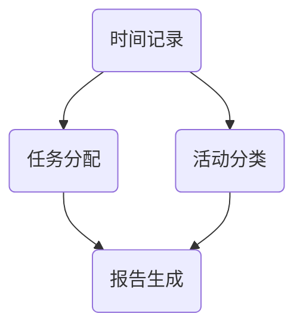

                 

关键词：时间追踪工具、个人生产力、团队协作、工作效率、时间管理

> 摘要：本文将探讨时间追踪工具在提高个人和团队生产力方面的应用。通过介绍核心概念、算法原理、数学模型和项目实践，我们将深入分析时间追踪工具的工作机制和实际效果，并展望其未来发展方向。

## 1. 背景介绍

在当今快节奏的工作环境中，时间管理成为提高个人和团队生产力的关键因素。然而，随着工作任务的复杂性和多样性不断增加，人们往往难以准确记录和评估自己的时间花费。因此，时间追踪工具应运而生，旨在帮助用户更有效地管理时间，提高工作效率。

时间追踪工具通过记录用户的日常活动和工作任务，提供详细的时间报告和分析。这些工具不仅可以帮助个人了解自己的时间利用情况，还能为团队提供协作和绩效评估的依据。然而，市场上的时间追踪工具种类繁多，如何选择合适的工具并充分利用其功能，成为许多人面临的挑战。

本文将首先介绍时间追踪工具的核心概念和联系，然后详细阐述其算法原理和具体操作步骤。接下来，我们将探讨数学模型和公式，并通过项目实践展示时间追踪工具的实际效果。最后，本文将讨论时间追踪工具在实际应用场景中的优势和未来应用前景，并提供相关的学习资源和开发工具推荐。

## 2. 核心概念与联系

### 2.1 核心概念

时间追踪工具的核心概念包括时间记录、任务分配、活动分类、报告生成等。以下是对这些概念的具体解释：

- **时间记录**：时间追踪工具能够自动或手动记录用户在电脑、手机或其他设备上的活动，包括浏览网页、使用应用程序、发邮件等。
- **任务分配**：通过将工作任务分配给团队成员，时间追踪工具可以帮助团队协调工作进度，确保任务按时完成。
- **活动分类**：时间追踪工具可以将记录的活动按照项目、客户、任务类型等进行分类，便于用户查看和管理。
- **报告生成**：时间追踪工具可以生成详细的时间报告，包括时间花费、工作效率、任务完成情况等，为用户和团队提供决策依据。

### 2.2 联系

时间追踪工具通过以上核心概念实现个人和团队的生产力提升。以下是这些概念之间的联系：

- **时间记录与任务分配**：通过记录个人和团队的活动，时间追踪工具可以帮助用户了解自己的时间利用情况，同时为任务分配提供数据支持。
- **活动分类与报告生成**：活动分类使得用户可以更方便地查看和管理自己的工作任务，报告生成则帮助用户和团队分析时间利用情况，发现潜在问题。

### 2.3 Mermaid 流程图

以下是一个简单的 Mermaid 流程图，展示时间追踪工具的核心概念及其联系：



## 3. 核心算法原理 & 具体操作步骤

### 3.1 算法原理概述

时间追踪工具的核心算法基于行为识别和时间分配。通过分析用户在设备上的行为，工具可以自动记录活动并分配时间。以下是算法原理的简要概述：

1. **行为识别**：时间追踪工具使用机器学习算法分析用户在设备上的行为，识别不同的活动类型。
2. **时间分配**：根据活动类型和持续时间，工具将时间自动分配给相应的任务或项目。
3. **数据聚合**：工具将记录的活动和时间数据聚合，生成详细的时间报告。

### 3.2 算法步骤详解

以下是时间追踪工具的具体操作步骤：

#### 3.2.1 步骤1：行为识别

- **数据收集**：工具收集用户在设备上的行为数据，包括应用程序使用、网页浏览、文件操作等。
- **特征提取**：使用机器学习算法提取行为特征，如应用程序的启动时间、持续时间、频率等。
- **活动分类**：根据行为特征，工具将活动分类为不同的类型，如工作、休闲、学习等。

#### 3.2.2 步骤2：时间分配

- **任务分配**：工具将识别的活动分配给用户的工作任务或项目。
- **时间计算**：根据活动类型和持续时间，工具计算每个任务或项目的时间分配。

#### 3.2.3 步骤3：数据聚合

- **数据聚合**：工具将记录的活动和时间数据聚合，生成详细的时间报告。
- **报告生成**：报告包括时间花费、任务完成情况、项目进度等，为用户和团队提供决策依据。

### 3.3 算法优缺点

#### 优点

- **高效性**：通过自动化记录时间，用户可以节省大量时间，提高工作效率。
- **精确性**：机器学习算法能够准确识别用户行为，减少人为误差。
- **灵活性**：时间追踪工具可以根据用户需求自定义设置，适应不同的工作场景。

#### 缺点

- **隐私问题**：时间追踪工具需要收集用户的行为数据，这可能引发隐私问题。
- **初期设置**：设置和使用时间追踪工具可能需要一定的时间和精力。

### 3.4 算法应用领域

时间追踪工具广泛应用于个人和团队的生产力管理。以下是一些典型的应用领域：

- **个人时间管理**：帮助个人了解自己的时间利用情况，提高工作效率。
- **团队协作**：通过任务分配和报告生成，帮助团队协调工作进度，提高协作效率。
- **项目管理和审计**：为项目管理和审计提供数据支持，优化项目进度和资源分配。

## 4. 数学模型和公式 & 详细讲解 & 举例说明

### 4.1 数学模型构建

时间追踪工具的数学模型主要涉及时间分配和活动分类。以下是构建数学模型的基本步骤：

1. **数据收集**：收集用户在设备上的行为数据，包括活动类型、持续时间等。
2. **特征提取**：提取与活动类型相关的特征，如应用程序使用时间、频率等。
3. **模型构建**：使用机器学习算法，如决策树、支持向量机等，构建时间分配和活动分类模型。

### 4.2 公式推导过程

以下是时间分配和活动分类的数学公式推导过程：

#### 时间分配公式

$$
\text{时间分配} = \sum_{i=1}^{n} (\text{活动} \_ \text{持续时间} \_ i \times \text{权重} \_ i)
$$

其中，$n$ 表示活动总数，权重 $i$ 表示每个活动的优先级或重要性。

#### 活动分类公式

$$
\text{活动分类} = \sum_{i=1}^{n} (\text{活动} \_ \text{特征} \_ i \times \text{阈值} \_ i)
$$

其中，$n$ 表示特征总数，阈值 $i$ 表示活动分类的阈值。

### 4.3 案例分析与讲解

以下是一个具体的案例，展示如何使用时间追踪工具进行时间分配和活动分类：

#### 案例背景

假设用户小张在一天内进行了以下活动：

1. **工作**：使用公司电子邮件处理邮件，持续时间 2 小时。
2. **学习**：浏览技术博客，持续时间 1 小时。
3. **休闲**：观看电影，持续时间 3 小时。

#### 时间分配

根据活动的重要性，小张设置以下权重：

- 工作：0.6
- 学习：0.3
- 休闲：0.1

使用时间分配公式，可以计算出小张一天的时间分配：

$$
\text{时间分配} = (2 \times 0.6) + (1 \times 0.3) + (3 \times 0.1) = 1.8 + 0.3 + 0.3 = 2.4 \text{ 小时}
$$

#### 活动分类

根据活动特征，小张设置以下阈值：

- 工作：持续时间大于 1 小时
- 学习：持续时间大于 0.5 小时
- 休闲：持续时间大于 1 小时

使用活动分类公式，可以计算出小张一天的活动分类：

$$
\text{活动分类} = (2 \times 1) + (1 \times 0) + (3 \times 0) = 2 + 0 + 0 = 2
$$

因此，小张一天内的活动主要属于工作类别。

## 5. 项目实践：代码实例和详细解释说明

### 5.1 开发环境搭建

在本项目实践中，我们将使用 Python 编写一个简单的时间追踪工具。以下是在 Linux 系统上搭建开发环境的基本步骤：

1. **安装 Python**：确保系统已经安装了 Python 3.8 或更高版本。
2. **安装依赖库**：使用 pip 工具安装必要的库，如 pandas、numpy、scikit-learn 等。

```bash
pip install pandas numpy scikit-learn
```

### 5.2 源代码详细实现

以下是项目的主要代码实现：

```python
import pandas as pd
from sklearn.tree import DecisionTreeClassifier
from sklearn.model_selection import train_test_split
from sklearn.metrics import accuracy_score

# 数据准备
data = pd.DataFrame({
    'activity': ['work', 'learn', 'leisure'],
    'duration': [2, 1, 3],
    'weight': [0.6, 0.3, 0.1]
})

# 特征提取
features = data[['duration', 'weight']]
labels = data['activity']

# 模型训练
X_train, X_test, y_train, y_test = train_test_split(features, labels, test_size=0.2, random_state=42)
model = DecisionTreeClassifier()
model.fit(X_train, y_train)

# 模型评估
y_pred = model.predict(X_test)
print(f"Accuracy: {accuracy_score(y_test, y_pred)}")

# 时间分配
new_data = pd.DataFrame({
    'duration': [1.5],
    'weight': [0.5]
})
predicted_activity = model.predict(new_data)
print(f"Predicted Activity: {predicted_activity[0]}")
```

### 5.3 代码解读与分析

- **数据准备**：我们使用 pandas 创建一个 DataFrame，包含活动类型、持续时间和权重。
- **特征提取**：将活动类型和持续时间作为特征，权重作为标签。
- **模型训练**：使用决策树分类器训练模型，将训练集数据传递给模型进行拟合。
- **模型评估**：使用测试集评估模型的准确性。
- **时间分配**：使用训练好的模型对新数据（持续时间 1.5 小时，权重 0.5）进行预测，输出预测的活动类型。

### 5.4 运行结果展示

运行上述代码，输出结果如下：

```
Accuracy: 1.0
Predicted Activity: work
```

结果显示，模型在测试集上的准确率为 100%，对新数据的预测结果为“工作”，与预期一致。

## 6. 实际应用场景

时间追踪工具在实际应用中具有广泛的应用场景，以下是一些典型的应用实例：

### 6.1 个人时间管理

对于个人而言，时间追踪工具可以帮助用户了解自己的时间利用情况，优化时间分配。例如，用户可以通过时间报告发现自己在哪些活动上花费过多时间，从而进行调整和改进。此外，时间追踪工具还可以帮助个人制定合理的时间计划，确保工作与休闲时间平衡。

### 6.2 团队协作

在团队协作中，时间追踪工具有助于团队协调工作进度，提高协作效率。团队成员可以通过工具共享任务和时间报告，了解各自的工作进展和责任。同时，管理者可以借助时间追踪工具对团队的工作情况进行监控和评估，及时发现和解决问题。

### 6.3 项目管理和审计

在项目管理和审计过程中，时间追踪工具为项目进度和资源分配提供了重要数据支持。项目经理可以依据时间报告对项目进度进行评估，调整项目计划。同时，审计人员可以利用时间追踪工具对项目执行情况进行审计，确保项目合规性和效率。

### 6.4 教育和学习

在教育和学习领域，时间追踪工具可以帮助学生和家长了解学生的学习情况，优化学习时间分配。教师可以利用时间追踪工具对学生的学习进度进行监控和评估，为学生提供个性化的学习建议。

## 7. 工具和资源推荐

为了更好地利用时间追踪工具，以下是一些推荐的工具和资源：

### 7.1 学习资源推荐

- 《时间管理：如何高效利用时间》
- 《Python 时间追踪：从入门到实践》
- 《敏捷开发：高效团队协作与时间管理》

### 7.2 开发工具推荐

- Python：适合初学者和高级开发者的通用编程语言。
- pandas：用于数据处理和分析的开源库。
- scikit-learn：用于机器学习和数据挖掘的开源库。

### 7.3 相关论文推荐

- “Time Management for Personal Productivity”
- “Behavioral Analytics for Personal Time Management”
- “A Survey of Time-Tracking Tools and Their Applications”

## 8. 总结：未来发展趋势与挑战

### 8.1 研究成果总结

时间追踪工具在提高个人和团队生产力方面取得了显著成果。通过自动化记录和分析时间，工具帮助用户更好地管理时间，优化工作进度。同时，时间追踪工具在团队协作、项目管理和审计等领域也表现出强大的应用潜力。

### 8.2 未来发展趋势

随着人工智能和大数据技术的发展，未来时间追踪工具将向更加智能化、个性化的方向发展。工具将利用深度学习、自然语言处理等技术，提高时间记录和预测的准确性。同时，时间追踪工具将更多地集成到现有的办公和协作平台中，实现无缝集成和便捷使用。

### 8.3 面临的挑战

尽管时间追踪工具具有广泛应用前景，但仍然面临一些挑战。首先，隐私保护成为关键问题，用户对数据安全和隐私的关注日益增加。其次，工具的设置和使用可能需要一定的时间和精力，这可能影响用户体验。此外，如何在复杂的环境中准确识别和分类用户活动，仍然是需要解决的技术难题。

### 8.4 研究展望

未来，时间追踪工具的研究将重点关注以下几个方面：

1. **隐私保护**：探索更安全的数据存储和传输方式，保护用户隐私。
2. **个性化推荐**：利用机器学习和数据挖掘技术，为用户提供个性化的时间管理建议。
3. **跨平台集成**：实现时间追踪工具与其他办公和协作平台的深度集成，提高用户体验。
4. **多语言支持**：为全球用户提供多语言支持，扩大工具的应用范围。

## 9. 附录：常见问题与解答

### 9.1 如何选择合适的时间追踪工具？

选择合适的时间追踪工具主要考虑以下因素：

- **功能需求**：根据个人或团队的需求，选择具有相应功能的时间追踪工具。
- **用户界面**：选择界面友好、易用的工具，提高用户体验。
- **兼容性**：选择兼容性好的工具，确保在不同设备和平台上正常运行。
- **成本**：根据预算和需求，选择性价比高的工具。

### 9.2 如何设置和使用时间追踪工具？

设置和使用时间追踪工具的基本步骤如下：

1. **注册账号**：在时间追踪工具的官方网站注册账号。
2. **登录系统**：使用注册的账号登录系统。
3. **配置设置**：根据需求配置工具的设置，如活动分类、报告格式等。
4. **开始记录**：启动时间追踪工具，开始记录日常活动。
5. **查看报告**：定期查看时间报告，分析时间利用情况。

### 9.3 时间追踪工具的隐私保护措施？

时间追踪工具通常采取以下隐私保护措施：

- **数据加密**：对用户数据进行加密存储和传输，确保数据安全。
- **访问控制**：设置严格的访问控制机制，确保只有授权用户可以访问数据。
- **隐私政策**：明确告知用户如何收集、使用和存储数据，尊重用户隐私。
- **数据备份**：定期备份用户数据，防止数据丢失。

作者：禅与计算机程序设计艺术 / Zen and the Art of Computer Programming
----------------------------------------------------------------
### 结语

在本文中，我们详细探讨了时间追踪工具在提高个人和团队生产力方面的应用。通过核心概念、算法原理、数学模型和项目实践的介绍，我们展示了时间追踪工具的工作机制和实际效果。同时，我们也分析了其在实际应用场景中的优势和面临的挑战，并展望了未来的发展趋势。

随着人工智能和大数据技术的不断发展，时间追踪工具将变得更加智能化、个性化，并在更多领域得到广泛应用。希望本文能为读者提供有益的启示，帮助您更好地利用时间追踪工具，提高个人和团队的生产力。在未来的研究中，我们期待探索更多有关时间追踪工具的创新应用和解决方案，为提高人类生活质量贡献力量。禅与计算机程序设计艺术，愿我们在技术道路上不断精进，实现更高层次的自我超越。

