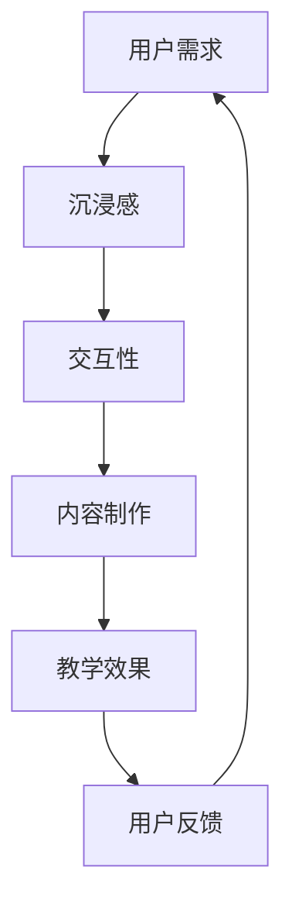

                 

在当今信息化时代，虚拟现实（VR）技术的飞速发展正深刻改变着各个行业的面貌，教育领域尤为显著。智能VR教育平台作为一种创新的教育模式，不仅能够提供沉浸式的学习体验，还极大地提升了教育的互动性和个性化。本文将探讨智能VR教育平台的商业化路径，分析其市场潜力、技术挑战以及未来的发展趋势。

## 关键词

- 智能VR教育平台
- 商业化路径
- 市场潜力
- 技术挑战
- 发展趋势

## 摘要

本文首先介绍了智能VR教育平台的概念和特点，接着分析了其商业化路径，包括市场需求、技术成熟度、商业模式以及潜在风险。随后，文章探讨了智能VR教育平台面临的几个关键技术挑战，如沉浸感、交互性和内容制作成本。最后，本文展望了智能VR教育平台的发展趋势，并提出了未来研究的方向和潜在的商业机会。

## 1. 背景介绍

虚拟现实（VR）技术起源于20世纪60年代，最初主要应用于军事模拟和娱乐领域。随着计算机技术和图形处理能力的提升，VR逐渐走进大众视野。智能VR教育平台是VR技术在教育领域的创新应用，它利用计算机图形系统和头戴式显示器（HMD）等设备，创建一个模拟的三维环境，使学生在其中进行互动学习。

智能VR教育平台与传统教育模式相比具有显著优势。首先，它能够提供沉浸式的学习体验，使学生身临其境，提高学习的趣味性和参与度。其次，智能VR教育平台支持个性化学习，根据学生的兴趣和水平提供定制化的教学内容和路径。此外，它还可以通过实时数据分析和反馈，帮助教师更好地了解学生的学习状况，从而进行针对性教学。

尽管智能VR教育平台具有巨大潜力，但其商业化进程却面临诸多挑战。首先，市场需求的培养需要时间和资源的投入。其次，VR硬件设备的成本较高，限制了其普及程度。此外，VR内容的制作和更新也需要专业的技术和人力投入，这对平台的可持续发展提出了挑战。

## 2. 核心概念与联系

为了更好地理解智能VR教育平台的工作原理和商业化路径，我们需要明确几个核心概念：沉浸感、交互性和内容制作。

### 沉浸感

沉浸感是VR技术的核心特征之一，它指的是用户在虚拟环境中感受到的深度和真实性。沉浸感越高，用户越容易忘却现实世界，完全投入到虚拟环境中。为了提升沉浸感，智能VR教育平台需要考虑以下几个方面：

- **硬件设备**：高分辨率的显示器、低延迟的头戴式显示器（HMD）和高质量的音效设备。
- **环境构建**：逼真的虚拟环境设计，包括角色、场景、光线和音效等。
- **运动跟踪**：精确的运动跟踪技术，确保用户在虚拟环境中的动作能够实时反映在屏幕上。

### 交互性

交互性是指用户在虚拟环境中的操作和反馈能力。一个良好的交互性设计能够增强用户的学习体验，使其更加自然和直观。智能VR教育平台在交互性方面需要考虑以下几个方面：

- **输入设备**：例如手柄、手套、眼球追踪设备等，提供多种输入方式。
- **反馈机制**：实时的视觉、听觉和触觉反馈，使学生在虚拟环境中感受到真实的交互。
- **任务设计**：设计有趣且具有挑战性的任务，激发学生的学习兴趣和参与度。

### 内容制作

内容制作是智能VR教育平台的核心组成部分，它决定了平台的教学质量和用户满意度。高质量的内容制作需要考虑以下几个方面：

- **内容策划**：明确教学目标，设计符合学生认知和兴趣的教学内容。
- **内容制作**：使用3D建模、动画和编程技术，制作高质量的虚拟环境和交互式学习内容。
- **内容更新**：定期更新教学内容，保持内容的时效性和吸引力。

### Mermaid 流程图

以下是一个简化的Mermaid流程图，展示了智能VR教育平台的核心概念和联系：



## 3. 核心算法原理 & 具体操作步骤

### 3.1 算法原理概述

智能VR教育平台的核心算法主要包括虚拟环境构建、交互设计和学习分析等。这些算法共同作用，为用户提供一个高效、有趣的学习体验。

- **虚拟环境构建**：利用计算机图形学技术，构建一个虚拟的三维环境。这个环境需要具备逼真的物理特性，如光线、阴影和反射等。
- **交互设计**：通过用户输入设备，如手柄、手势和语音，设计交互式学习任务。这些任务需要能够实时响应用户的操作，并提供即时反馈。
- **学习分析**：收集学生的学习数据，如学习时间、互动频率和成绩等，利用数据挖掘和机器学习技术，分析学生的学习行为和效果。

### 3.2 算法步骤详解

以下是智能VR教育平台核心算法的具体步骤：

1. **用户注册与登录**：用户通过平台进行注册和登录，获得个人账号。
2. **课程选择与预约**：用户根据兴趣和需求选择课程，并预约上课时间。
3. **虚拟环境构建**：平台根据课程内容，利用3D建模和渲染技术，构建虚拟环境。这个环境需要具备实时互动和动态变化的能力。
4. **交互设计**：根据课程内容，设计一系列交互式学习任务。这些任务需要能够与虚拟环境进行实时交互，并能够根据用户操作提供即时反馈。
5. **学习过程监控**：平台实时监控学生的学习过程，记录学习时间、互动频率和成绩等数据。
6. **学习数据分析**：平台利用数据挖掘和机器学习技术，分析学生的学习行为和效果，提供个性化的学习建议。
7. **课程反馈与改进**：根据学生的反馈，平台不断优化课程内容和交互设计，提高教学质量。

### 3.3 算法优缺点

**优点**：

- **个性化学习**：通过数据分析和个性化推荐，平台能够为每个学生提供定制化的学习内容和路径，提高学习效果。
- **沉浸式体验**：虚拟环境的设计和交互式任务使学习过程更加有趣和生动，提高了学生的参与度和兴趣。
- **实时反馈**：平台能够实时监控学生的学习过程，并提供即时反馈，帮助教师进行针对性教学。

**缺点**：

- **技术门槛高**：智能VR教育平台需要专业的技术团队进行开发和维护，技术门槛较高。
- **硬件设备成本高**：虚拟现实硬件设备（如HMD、手柄等）成本较高，限制了其普及程度。
- **内容制作难度大**：高质量的内容制作需要专业的技术和人力投入，内容制作周期较长。

### 3.4 算法应用领域

智能VR教育平台主要应用于以下领域：

- **高等教育**：利用智能VR教育平台，大学和研究生院可以为学生提供虚拟实验室和模拟课程，提高教学质量和实践能力。
- **职业教育**：职业培训机构可以利用智能VR教育平台，提供虚拟实习和技能培训，提高学员的实践能力和就业竞争力。
- **基础教育**：中小学可以利用智能VR教育平台，为学生提供沉浸式的学习体验，提高学生的学习兴趣和成绩。

## 4. 数学模型和公式 & 详细讲解 & 举例说明

### 4.1 数学模型构建

智能VR教育平台的核心算法涉及多个数学模型，包括虚拟环境构建、交互设计和学习分析等。以下是这些数学模型的简要概述：

- **虚拟环境构建**：采用三维空间中的几何模型和物理模型，构建虚拟环境。常用的数学工具包括向量运算、矩阵运算和微分方程等。
- **交互设计**：利用用户输入设备的坐标数据，设计交互式学习任务。常用的数学工具包括几何变换、曲线拟合和信号处理等。
- **学习分析**：收集学生的学习数据，利用数据挖掘和机器学习技术，分析学生的学习行为和效果。常用的数学工具包括统计分析、数据挖掘算法和神经网络等。

### 4.2 公式推导过程

以下是一个简单的例子，说明如何构建一个简单的虚拟环境。假设我们想要构建一个简单的三维空间，其中包含一个球体和一个长方体。我们可以使用以下数学公式：

- **球体模型**：

  - 球体方程：$$x^2 + y^2 + z^2 = r^2$$

  - 球面方程：$$\frac{x^2}{r^2} + \frac{y^2}{r^2} + \frac{z^2}{r^2} = 1$$

- **长方体模型**：

  - 长方体方程：$$x \leq a, y \leq b, z \leq c$$

  - 长方体表面方程：$$x = a, y = b, z = c$$

### 4.3 案例分析与讲解

假设我们想要设计一个交互式学习任务，让学生在虚拟环境中移动一个球体。我们可以使用以下数学模型：

- **用户输入**：用户输入设备的坐标数据，如$$x, y, z$$。
- **球体位置更新**：根据用户输入，更新球体的位置坐标，如$$x_{new}, y_{new}, z_{new}$$。
- **球体速度计算**：根据球体的位置更新，计算球体的速度，如$$v_x, v_y, v_z$$。

以下是一个简单的Python代码示例：

```python
import numpy as np

# 初始化球体位置和速度
x = 0
y = 0
z = 0
vx = 0
vy = 0
vz = 0

# 用户输入坐标
x_input = float(input("请输入x坐标："))
y_input = float(input("请输入y坐标："))
z_input = float(input("请输入z坐标："))

# 更新球体位置
x_new = x + vx * dt
y_new = y + vy * dt
z_new = z + vz * dt

# 输出球体位置
print("球体新位置：x = ", x_new, "y = ", y_new, "z = ", z_new)
```

## 5. 项目实践：代码实例和详细解释说明

### 5.1 开发环境搭建

要开发一个智能VR教育平台，我们需要搭建一个合适的开发环境。以下是一个简单的开发环境搭建步骤：

1. **硬件设备**：准备一台高性能的计算机，以及VR硬件设备（如HMD、手柄等）。
2. **操作系统**：安装一个支持VR开发的操作系统，如Windows 10或Linux。
3. **开发工具**：安装一个支持VR开发的集成开发环境（IDE），如Unity、Unreal Engine等。
4. **VR插件**：根据所选开发工具，安装相应的VR插件，如Unity的VR摄像机插件、Unreal Engine的VR框架插件等。

### 5.2 源代码详细实现

以下是一个简单的智能VR教育平台的源代码示例，使用Unity开发环境：

```csharp
using UnityEngine;

public class VRPlatform : MonoBehaviour
{
    public Camera vrCamera;
    public GameObject ball;

    // 球体初始位置和速度
    private float x = 0;
    private float y = 0;
    private float z = 0;
    private float vx = 0;
    private float vy = 0;
    private float vz = 0;

    // 用户输入坐标
    private float x_input;
    private float y_input;
    private float z_input;

    // 更新球体位置
    private void Update()
    {
        // 获取用户输入
        x_input = Input.GetAxis("Horizontal");
        y_input = Input.GetAxis("Vertical");
        z_input = Input.GetAxis("Mouse ScrollWheel");

        // 更新球体位置
        x = x + vx * Time.deltaTime;
        y = y + vy * Time.deltaTime;
        z = z + vz * Time.deltaTime;

        // 更新球体速度
        vx = x_input;
        vy = y_input;
        vz = z_input;

        // 设置球体位置
        ball.transform.position = new Vector3(x, y, z);
    }
}
```

### 5.3 代码解读与分析

以上代码是一个简单的智能VR教育平台示例，主要功能是让用户通过输入设备控制一个球体在虚拟环境中移动。

- **变量定义**：首先定义了球体的初始位置和速度，以及用户输入坐标。
- **用户输入获取**：使用Unity的输入系统获取用户输入坐标。
- **更新球体位置**：根据用户输入坐标，更新球体的位置和速度。
- **设置球体位置**：将更新后的球体位置设置到Unity的GameObject上。

### 5.4 运行结果展示

在Unity编辑器中运行以上代码，我们可以看到一个虚拟环境中的球体，用户可以通过输入设备（如手柄、手势等）控制球体的移动。当用户移动手柄或手势时，球体的位置会实时更新，实现一个简单的交互式学习任务。

## 6. 实际应用场景

智能VR教育平台在多个实际应用场景中显示出巨大的潜力。以下是一些典型的应用场景：

### 6.1 高等教育

在高等教育中，智能VR教育平台可以用于模拟实验、虚拟实验室和远程教学。例如，医学院学生可以通过虚拟手术台进行手术模拟，提高实践技能。工程专业的学生可以通过虚拟工厂了解生产线，进行故障排查和设备维护。此外，智能VR教育平台还可以用于在线课程和远程会议，为学生和教师提供虚拟课堂体验。

### 6.2 职业教育

在职业教育中，智能VR教育平台可以用于技能培训和职业认证。例如，航空公司的飞行员可以通过虚拟驾驶舱进行飞行训练，提高操作技能和应对突发事件的能力。汽车维修工人可以通过虚拟汽车进行故障诊断和维修练习，提高维修效率和质量。此外，智能VR教育平台还可以用于模拟职场环境和职业挑战，帮助学员提前适应职场环境。

### 6.3 基础教育

在基础教育中，智能VR教育平台可以用于课堂教学和课外活动。例如，小学教师可以通过虚拟动物园带领学生参观动物，增强学生的生物知识。初中教师可以通过虚拟历史场景，让学生亲身体验历史事件，提高历史学习兴趣。此外，智能VR教育平台还可以用于虚拟实验室，让学生在家中也能进行科学实验，激发学生对科学的热爱。

### 6.4 未来应用展望

随着虚拟现实技术和人工智能技术的不断发展，智能VR教育平台的未来应用将更加广泛。以下是一些未来的应用展望：

- **个性化学习**：智能VR教育平台可以结合人工智能技术，根据学生的学习情况和兴趣，提供更加个性化的学习内容和路径，提高学习效果。
- **虚拟实习**：智能VR教育平台可以模拟各种职业场景，让学生在虚拟环境中进行实习和职业体验，提高实践能力和就业竞争力。
- **虚拟校园**：智能VR教育平台可以构建一个虚拟校园，让学生在虚拟环境中体验校园生活，提前适应大学生活。
- **虚拟博物馆**：智能VR教育平台可以构建虚拟博物馆，让学生在虚拟环境中参观博物馆，了解历史文化和艺术知识。

## 7. 工具和资源推荐

### 7.1 学习资源推荐

- **VR开发入门教程**：[Unity VR入门教程](https://unity3d.com/learn/tutorials/topics/virtual-reality/unity-vr-getting-started)
- **VR内容创作教程**：[Unreal Engine VR内容创作教程](https://docs.unrealengine.com/4.26/en-US/InteractiveExperiences/VirtualReality/)
- **人工智能与机器学习教程**：[Machine Learning Mastery](https://machinelearningmastery.com/)
- **数学公式推导与讲解**：[Mathematics Stack Exchange](https://math.stackexchange.com/)

### 7.2 开发工具推荐

- **Unity**：一个广泛使用的游戏和VR开发引擎，提供丰富的VR插件和资源。
- **Unreal Engine**：一个强大的游戏和VR开发引擎，适合大型项目和高质量渲染。
- **Blender**：一个开源的3D建模和动画软件，适合制作高质量的VR内容。
- **TensorFlow**：一个开源的机器学习和深度学习框架，适合人工智能和机器学习应用。

### 7.3 相关论文推荐

- **Virtual Reality in Education: A Survey**：对VR在教育领域应用的研究综述。
- **A Survey of Virtual Reality Applications in Education**：对VR在教育中应用的研究综述。
- **Intelligent Virtual Reality Systems for Education**：关于智能VR教育平台的研究论文。
- **The Role of Virtual Reality in Enhancing Learning Outcomes**：关于VR在教育中提高学习效果的研究。

## 8. 总结：未来发展趋势与挑战

### 8.1 研究成果总结

智能VR教育平台作为一种新兴的教育模式，已取得了一系列重要成果。首先，VR技术的沉浸感、互动性和个性化特点，显著提升了学生的学习兴趣和参与度。其次，智能VR教育平台通过数据分析和个性化推荐，提高了教学质量和效果。此外，虚拟实验室、虚拟实习和虚拟校园等应用，为教育创新提供了新的途径。

### 8.2 未来发展趋势

随着虚拟现实技术和人工智能技术的不断发展，智能VR教育平台的发展趋势将体现在以下几个方面：

- **个性化学习**：结合人工智能技术，智能VR教育平台将更加精准地满足学生的学习需求，实现真正的个性化学习。
- **虚拟实习与职业体验**：智能VR教育平台将为学生提供更多模拟真实职场环境的实习和职业体验机会，提高实践能力和就业竞争力。
- **教育资源共享**：智能VR教育平台将打破地域和时间的限制，实现全球教育资源的共享和交流。
- **多感官融合**：未来的智能VR教育平台将更加注重多感官融合，提供更加真实和丰富的学习体验。

### 8.3 面临的挑战

尽管智能VR教育平台具有巨大潜力，但其商业化进程仍面临诸多挑战：

- **技术挑战**：智能VR教育平台需要不断优化和提升虚拟环境的沉浸感、交互性和内容制作质量，这对技术和资金提出了高要求。
- **成本问题**：VR硬件设备的成本较高，限制了其普及程度。此外，高质量的内容制作也需要专业的技术和人力投入。
- **用户接受度**：用户对智能VR教育平台的接受度仍需进一步提高，需要通过丰富的内容和良好的用户体验来吸引更多用户。
- **隐私与安全**：智能VR教育平台需要确保用户隐私和数据安全，避免数据泄露和滥用。

### 8.4 研究展望

未来，智能VR教育平台的研究将集中在以下几个方面：

- **技术创新**：不断探索和优化虚拟现实和人工智能技术，提升平台的功能和用户体验。
- **内容开发**：加强对高质量VR教育内容的研究和开发，提供丰富多样的教学内容和互动体验。
- **商业模式**：探索智能VR教育平台的商业模式，实现可持续发展。
- **政策法规**：关注教育政策和法规的变化，确保智能VR教育平台的发展与政策法规相符合。

## 9. 附录：常见问题与解答

### 问题1：智能VR教育平台有哪些优势？

解答：智能VR教育平台具有以下优势：

- **沉浸式学习体验**：通过虚拟现实技术，提供沉浸式的学习环境，增强学习趣味性。
- **个性化学习**：根据学生的学习兴趣和需求，提供定制化的学习内容和路径，提高学习效果。
- **互动性**：通过交互式设计，增强学生与虚拟环境的互动，提高学习参与度。
- **实时反馈**：通过实时数据分析和反馈，帮助教师更好地了解学生的学习状况，进行针对性教学。

### 问题2：智能VR教育平台的技术挑战有哪些？

解答：智能VR教育平台的技术挑战主要包括：

- **沉浸感**：提升虚拟环境的沉浸感，需要高分辨率显示器、低延迟设备和逼真的环境构建。
- **交互性**：设计良好的交互性，需要多种输入设备和实时反馈机制。
- **内容制作**：高质量的内容制作需要专业的技术和人力投入，包括3D建模、动画和编程等。

### 问题3：智能VR教育平台的成本如何？

解答：智能VR教育平台的成本包括以下几个方面：

- **硬件成本**：包括VR头戴显示器、手柄、传感器等设备的购买和维护费用。
- **软件开发成本**：包括VR平台开发、内容制作和平台运营的技术投入。
- **人力资源成本**：包括开发团队、内容创作团队和运维团队的工资和福利费用。

### 问题4：智能VR教育平台的安全问题如何解决？

解答：智能VR教育平台的安全问题主要包括数据隐私、数据安全和网络安全等。以下是一些解决方案：

- **数据加密**：对用户数据采用高强度加密算法，确保数据在传输和存储过程中安全。
- **访问控制**：设置严格的访问权限，确保只有授权用户才能访问敏感数据。
- **网络安全**：采用防火墙、入侵检测和防御系统等网络安全措施，防止网络攻击和数据泄露。

### 问题5：智能VR教育平台的商业化路径如何？

解答：智能VR教育平台的商业化路径主要包括以下几个方面：

- **B2B模式**：与教育机构合作，提供VR教育解决方案，面向学校、培训机构和企业等。
- **B2C模式**：面向个人用户，提供VR教育产品和服务，如在线课程、虚拟实验室等。
- **内容合作**：与教育内容提供商合作，引入优质的教育资源，丰富平台内容。
- **广告和赞助**：通过广告和赞助收入，实现平台的盈利。

### 问题6：智能VR教育平台的市场前景如何？

解答：智能VR教育平台的市场前景非常广阔。随着虚拟现实技术和人工智能技术的不断发展，以及人们对个性化教育和沉浸式学习需求的增加，智能VR教育平台有望在未来的教育市场中占据重要地位。此外，政府和社会对教育创新的重视，也为智能VR教育平台的发展提供了良好的政策环境。

## 结语

智能VR教育平台作为一种创新的教育模式，具有巨大的市场潜力和发展前景。然而，其商业化进程仍面临诸多挑战，需要不断优化技术、降低成本、提高用户接受度和保障数据安全。未来，随着技术的进步和市场需求的增长，智能VR教育平台有望在教育领域发挥更加重要的作用，推动教育的创新和发展。作者：禅与计算机程序设计艺术 / Zen and the Art of Computer Programming。

