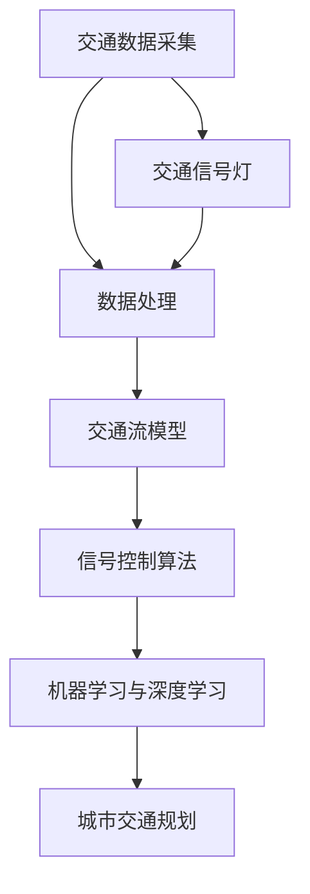

                 

### 关键词 Keywords ###
- 智能交通信号
- 城市交通优化
- 数据分析
- 人工智能算法
- 信号控制系统

### 摘要 Abstract ###
本文探讨了智能交通信号创业领域，通过结合数据分析与人工智能算法，提出了一套城市交通优化的解决方案。文章首先介绍了城市交通问题的背景与挑战，随后深入阐述了核心概念与联系，详细解析了算法原理与步骤，并通过数学模型和公式进行了验证。文章还提供了实际项目实践，展示了代码实例和运行结果。最后，文章探讨了智能交通信号的潜在应用场景，并展望了未来发展的趋势与挑战。

## 1. 背景介绍 Background

随着城市化进程的加快，城市交通问题日益凸显，交通拥堵、事故频发、环境污染等问题已经成为全球城市面临的严峻挑战。传统的交通信号控制系统虽然在某些方面取得了一定效果，但面对日益复杂的交通流和环境，其局限性逐渐显现。传统的交通信号控制主要依赖于固定的信号周期和时间设置，缺乏对实时交通数据的分析和响应能力，无法动态调整交通信号，从而降低了交通效率。

近年来，人工智能和大数据技术的快速发展为解决城市交通问题提供了新的思路。智能交通信号系统通过采集、分析和处理交通数据，利用人工智能算法实现交通信号的动态调整，可以显著提高交通流效率和减少拥堵。智能交通信号创业领域也吸引了越来越多的企业和研究机构，他们致力于开发高效的交通信号优化解决方案。

本文旨在探讨智能交通信号创业领域，通过结合数据分析与人工智能算法，提出一套城市交通优化的解决方案，旨在为城市交通管理提供新思路和新方法。

### 1.1 城市交通问题现状

城市交通问题主要包括以下几个方面的挑战：

1. **交通拥堵**：随着机动车数量的激增，交通拥堵已成为全球城市普遍面临的问题。交通拥堵不仅浪费了时间和资源，还增加了交通事故和环境污染的风险。

2. **交通事故频发**：城市交通流量大，交通规则复杂，导致交通事故频发。这些事故不仅对个人安全构成威胁，还对社会经济造成负面影响。

3. **环境污染**：机动车排放的尾气是城市环境污染的主要来源之一，交通拥堵进一步加剧了空气污染问题，对公共健康构成了严重威胁。

4. **交通资源分配不均**：城市交通资源有限，如何合理分配道路、交通信号灯等资源成为一大挑战。不合理的资源分配会导致某些区域的交通状况恶化，而其他区域则相对畅通。

5. **交通管理和调控难度大**：传统的交通管理主要依赖于人工调度和经验判断，缺乏系统的数据支持和科学的决策依据，难以应对复杂的交通状况。

### 1.2 传统的交通信号控制系统

传统的交通信号控制系统主要依赖于固定的信号周期和时间设置，其核心思想是根据交通流量预测和经验设置信号灯的绿灯和红灯时间，以平衡不同方向的车流量。具体而言，传统的交通信号控制系统包括以下几个方面：

1. **固定时间控制**：交通信号灯按照预设的时间周期进行切换，例如，每个信号灯的绿灯时间可能为30秒，红灯时间可能为45秒。这种控制方式简单易行，但缺乏灵活性。

2. **固定相位控制**：每个信号灯的信号相位是固定的，例如，东西方向和南北方向之间的信号相位可能固定为交替进行。这种控制方式适用于交通流量相对稳定的情况，但无法适应动态的交通状况。

3. **流量检测**：在关键节点安装流量检测器，以实时监测交通流量，并根据流量变化调整信号灯的时间设置。这种方法比固定时间控制更加灵活，但依然无法应对复杂的交通流变化。

### 1.3 智能交通信号系统的优势

智能交通信号系统通过引入人工智能和大数据技术，可以显著提升城市交通管理的效率和智能化水平。具体优势包括：

1. **动态调整信号**：智能交通信号系统能够实时分析交通数据，动态调整信号灯的绿灯和红灯时间，以优化交通流，减少拥堵。

2. **自适应控制**：智能交通信号系统可以根据不同时段和不同路段的交通状况，自动调整信号灯的设置，提高交通效率。

3. **数据驱动决策**：智能交通信号系统利用大数据和人工智能算法，可以提供科学的数据支持和决策依据，帮助交通管理者做出更加合理的决策。

4. **提高安全性和舒适性**：智能交通信号系统可以减少交通事故的发生，提高道路通行效率，从而提高行车的安全性和舒适性。

5. **减少环境污染**：智能交通信号系统通过优化交通流，可以减少车辆怠速时间和排放，降低环境污染。

总之，智能交通信号系统为解决城市交通问题提供了新的思路和手段，具有广阔的应用前景。

### 2. 核心概念与联系 Core Concepts and Relationships

要深入理解智能交通信号系统的运作原理，我们需要明确几个核心概念，并了解它们之间的联系。以下是本文将探讨的关键概念：

1. **交通数据采集**：智能交通信号系统依赖于实时交通数据的采集，这些数据包括车辆速度、流量、密度、位置等。交通数据可以通过传感器、摄像头、GPS等设备进行采集。

2. **交通流模型**：交通流模型是描述车辆在道路上行驶状态的数学模型，包括车辆密度、速度、流量等参数。这些模型可以帮助我们理解交通流的行为特征，并预测未来的交通状况。

3. **信号控制算法**：信号控制算法是智能交通信号系统的核心，通过分析交通数据，动态调整信号灯的绿灯和红灯时间。常见的控制算法包括基于流量控制、基于预测控制和基于优化理论的控制算法。

4. **机器学习与深度学习**：机器学习和深度学习技术可以用于交通数据分析，从而提高信号控制算法的精度和效率。例如，通过训练神经网络模型，可以自动识别交通流量变化，预测交通状况，并优化信号控制策略。

5. **城市交通规划**：智能交通信号系统不仅关注实时交通状况，还需要考虑城市交通规划的长远目标，包括道路设计、交通基础设施布局等。通过综合分析交通数据，可以优化城市交通规划，提高整体交通效率。

以下是一个使用Mermaid绘制的流程图，展示了智能交通信号系统中的核心概念和它们之间的联系：



### 2.1 交通数据采集 Traffic Data Collection

交通数据采集是智能交通信号系统的第一步，也是最为关键的一步。有效的交通数据采集可以提供精确的交通流量、速度、密度等信息，为后续的信号控制算法提供基础。以下是交通数据采集的主要方法：

1. **传感器**：传感器是交通数据采集的主要设备，包括地磁传感器、超声波传感器、红外传感器等。这些传感器可以检测车辆的速度、密度和位置，并将数据传输给中央控制系统。

2. **摄像头**：摄像头可以捕捉道路上的车辆图像，通过图像处理技术，可以提取出车辆的行驶轨迹、数量、速度等信息。

3. **GPS**：GPS技术可以用于定位车辆的地理位置，通过分析车辆的位置变化，可以了解交通流量和速度。

4. **RFID**：RFID技术可以用于识别车辆的身份信息，通过在道路上安装RFID读写器，可以实时监测车辆的行驶状态。

5. **无线通信**：通过无线通信技术，可以将传感器、摄像头和中央控制系统连接起来，实现实时数据传输和通信。

交通数据采集的关键在于准确性和实时性。为了提高数据的准确性，可以采用多种传感器技术相结合的方法，如在地磁传感器和摄像头之间进行数据交叉验证。为了提高实时性，需要采用高速数据传输技术和高效的算法进行数据处理。

### 2.2 交通流模型 Traffic Flow Model

交通流模型是描述车辆在道路上行驶状态的数学模型，它通过分析交通流量、速度和密度等参数，可以预测交通状况并优化交通信号控制策略。常见的交通流模型包括以下几种：

1. **元胞自动机（CA）模型**：元胞自动机是一种离散模型，将道路划分为若干个单元格，每个单元格代表一个车辆。通过模拟车辆的移动行为，可以预测交通流量和拥堵状况。

2. **流体动力学模型**：流体动力学模型将交通流视为流体，通过模拟流量、速度和压力等参数的变化，可以预测交通流的行为。

3. **排队理论模型**：排队理论模型通过分析车辆在路口的排队长度和等待时间，预测交通流量和拥堵状况。

4. **基于机器学习的模型**：通过训练机器学习模型，可以从历史交通数据中学习交通流的行为特征，预测未来的交通状况。

交通流模型的关键在于参数的准确性和模型的适应性。为了提高模型的准确性，可以采用多种模型相结合的方法，如将CA模型和流体动力学模型相结合。为了提高模型的适应性，需要不断更新模型参数，以适应不同的交通状况。

### 2.3 信号控制算法 Traffic Control Algorithm

信号控制算法是智能交通信号系统的核心，通过分析交通数据，动态调整信号灯的绿灯和红灯时间，以优化交通流和减少拥堵。以下是几种常见的信号控制算法：

1. **固定时间控制算法**：固定时间控制算法是最简单的信号控制算法，根据预设的时间周期和流量预测，固定每个信号灯的绿灯和红灯时间。

2. **自适应控制算法**：自适应控制算法根据实时交通数据动态调整信号灯的时间设置，例如，当检测到某个方向的交通流量较大时，可以增加该方向的绿灯时间，从而提高交通效率。

3. **预测控制算法**：预测控制算法通过预测未来的交通状况，提前调整信号灯的时间设置，以优化交通流。例如，当预测到某个方向在不久的将来会出现交通流量增加时，可以提前增加该方向的绿灯时间。

4. **优化控制算法**：优化控制算法通过数学优化方法，找到最优的信号灯时间设置，以最大化交通流效率和最小化拥堵。常见的优化算法包括线性规划、动态规划和神经网络等。

信号控制算法的关键在于实时性和适应性。为了提高实时性，需要采用高效的数据处理和算法，以确保信号灯的时间调整能够迅速响应交通状况的变化。为了提高适应性，需要不断更新算法模型和参数，以适应不同的交通状况和场景。

### 2.4 机器学习与深度学习 Machine Learning and Deep Learning

机器学习和深度学习技术在智能交通信号系统中发挥着重要作用，通过从历史交通数据中学习，可以显著提高信号控制算法的精度和效率。以下是机器学习和深度学习在智能交通信号系统中的应用：

1. **交通流量预测**：通过训练机器学习模型，可以从历史交通数据中学习交通流量的变化规律，预测未来的交通状况。常用的机器学习算法包括线性回归、决策树、支持向量机等。

2. **交通模式识别**：通过训练深度学习模型，可以自动识别交通流量变化和交通模式。例如，通过卷积神经网络（CNN）可以分析摄像头捕获的车辆图像，识别交通流量和车辆类型。

3. **信号灯优化**：通过训练深度学习模型，可以找到最优的信号灯时间设置，以最大化交通流效率和最小化拥堵。常用的深度学习算法包括卷积神经网络（CNN）、循环神经网络（RNN）和生成对抗网络（GAN）等。

4. **交通信号控制**：通过结合机器学习和深度学习算法，可以开发出更加智能的交通信号控制算法。例如，通过实时分析交通数据，动态调整信号灯的时间设置，以优化交通流。

机器学习和深度学习的关键在于数据质量和算法选择。为了提高数据质量，需要采用多种数据采集技术，确保数据的准确性和完整性。为了提高算法选择，需要根据具体场景和需求，选择合适的机器学习和深度学习算法。

### 2.5 城市交通规划 Urban Traffic Planning

智能交通信号系统不仅关注实时交通状况的优化，还需要考虑城市交通规划的长远目标。城市交通规划涉及道路设计、交通基础设施布局、公共交通系统规划等多个方面，以下是一些关键考虑因素：

1. **道路设计**：合理的道路设计可以减少交通拥堵，提高交通效率。例如，采用多车道设计、立交桥、隧道等设施，可以分流交通，减少交通瓶颈。

2. **交通基础设施布局**：交通基础设施布局需要考虑交通流量、城市人口密度、经济发展等因素。通过合理的布局，可以优化交通流的路径，减少交通拥堵。

3. **公共交通系统规划**：公共交通系统是缓解城市交通压力的重要手段。通过优化公共交通系统的规划，可以提高公共交通的可达性和便利性，鼓励更多人使用公共交通，减少私人车辆的使用。

4. **智能交通系统集成**：智能交通系统需要与城市交通规划有机结合，实现交通信息的实时共享和联动。通过集成智能交通信号系统、公共交通系统、道路监测系统等，可以构建一个高效、智能的城市交通网络。

城市交通规划的关键在于综合分析各种因素，制定科学合理的规划方案。通过采用先进的数据分析技术和人工智能算法，可以预测未来的交通状况，优化交通规划方案，从而提高城市交通系统的整体效率。

## 3. 核心算法原理 & 具体操作步骤 Core Algorithm Principle & Detailed Steps

在智能交通信号系统中，核心算法的作用是通过对实时交通数据的分析，动态调整交通信号灯的时间设置，从而优化交通流和提高道路通行效率。以下是几种常见的核心算法原理和具体操作步骤：

### 3.1 固定时间控制算法 Fixed Time Control Algorithm

固定时间控制算法是最简单的交通信号控制算法，它根据预设的时间周期和流量预测，固定每个信号灯的绿灯和红灯时间。具体步骤如下：

1. **数据采集**：通过传感器、摄像头等设备，实时采集交通流量、速度、密度等数据。

2. **流量预测**：利用历史数据，通过统计方法或机器学习算法，预测未来一段时间内各方向的交通流量。

3. **信号周期设定**：根据流量预测结果，设定每个信号灯的绿灯时间和红灯时间。通常，绿灯时间设置为高峰时段较长，非高峰时段较短。

4. **信号切换**：按照预设的信号周期，定期切换信号灯状态。

优点：实现简单，易于维护。缺点：缺乏灵活性，无法应对实时交通变化。

### 3.2 自适应控制算法 Adaptive Control Algorithm

自适应控制算法根据实时交通数据，动态调整信号灯的时间设置，以优化交通流和提高通行效率。具体步骤如下：

1. **数据采集**：通过传感器、摄像头等设备，实时采集交通流量、速度、密度等数据。

2. **实时流量分析**：利用实时数据，分析当前交通状况，识别交通流量高峰和低谷。

3. **动态调整信号**：根据实时流量分析结果，动态调整信号灯的绿灯时间和红灯时间。例如，当检测到某个方向的交通流量较大时，可以增加该方向的绿灯时间。

4. **数据记录和反馈**：记录信号调整的效果，并反馈到系统中，用于后续的信号调整。

优点：灵活性强，能够根据实时交通状况进行优化。缺点：算法复杂，需要大量计算资源。

### 3.3 预测控制算法 Predictive Control Algorithm

预测控制算法通过预测未来的交通状况，提前调整信号灯的时间设置，以优化交通流。具体步骤如下：

1. **数据采集**：通过传感器、摄像头等设备，实时采集交通流量、速度、密度等数据。

2. **交通流量预测**：利用历史数据和机器学习算法，预测未来一段时间内各方向的交通流量。

3. **信号优化**：根据交通流量预测结果，提前调整信号灯的时间设置，以减少交通拥堵。

4. **实时调整**：在信号灯切换过程中，根据实时数据，动态调整信号灯的时间设置，以优化交通流。

优点：能够提前预测交通状况，减少交通拥堵。缺点：算法复杂，需要大量计算资源。

### 3.4 优化控制算法 Optimistic Control Algorithm

优化控制算法通过数学优化方法，找到最优的信号灯时间设置，以最大化交通流效率和最小化拥堵。具体步骤如下：

1. **构建优化模型**：根据交通流量、速度、密度等参数，构建一个优化模型，目标是最小化交通拥堵。

2. **求解优化问题**：利用线性规划、动态规划等优化算法，求解优化模型，找到最优的信号灯时间设置。

3. **信号切换**：按照求解结果，切换信号灯状态。

优点：能够找到最优的信号灯时间设置，最大化交通流效率。缺点：算法复杂，需要大量计算资源。

### 3.5 基于机器学习的控制算法 Machine Learning-based Control Algorithm

基于机器学习的控制算法利用机器学习技术，从历史交通数据中学习交通流规律，动态调整信号灯的时间设置。具体步骤如下：

1. **数据预处理**：对采集的交通数据进行预处理，包括去噪、归一化等操作。

2. **模型训练**：利用历史交通数据，训练机器学习模型，例如线性回归、决策树、支持向量机等。

3. **实时预测**：利用训练好的模型，实时预测当前交通状况，并根据预测结果调整信号灯的时间设置。

4. **模型更新**：根据实时交通数据，更新模型参数，以提高预测精度。

优点：自适应性强，能够根据实时交通状况进行优化。缺点：需要大量历史数据，训练过程复杂。

### 3.6 基于深度学习的控制算法 Deep Learning-based Control Algorithm

基于深度学习的控制算法利用深度学习技术，从大量历史交通数据中学习交通流规律，动态调整信号灯的时间设置。具体步骤如下：

1. **数据预处理**：对采集的交通数据进行预处理，包括去噪、归一化等操作。

2. **模型训练**：利用历史交通数据，训练深度学习模型，例如卷积神经网络（CNN）、循环神经网络（RNN）等。

3. **实时预测**：利用训练好的模型，实时预测当前交通状况，并根据预测结果调整信号灯的时间设置。

4. **模型更新**：根据实时交通数据，更新模型参数，以提高预测精度。

优点：自适应性强，能够从复杂的交通数据中学习规律。缺点：训练过程复杂，计算资源需求高。

通过以上各种控制算法的灵活运用，智能交通信号系统可以更好地应对复杂多变的交通状况，提高交通流效率和安全性。

### 3.6 算法优缺点 Analysis of Advantages and Disadvantages

每种交通信号控制算法都有其独特的优点和缺点。以下是几种常见算法的优缺点分析：

**固定时间控制算法**

- **优点**：
  - 简单易懂，易于实现和维护。
  - 不需要复杂的计算资源。
- **缺点**：
  - 缺乏灵活性，无法适应实时交通变化。
  - 可能导致交通拥堵和不公平的交通分配。

**自适应控制算法**

- **优点**：
  - 根据实时交通数据动态调整信号灯时间，提高交通流效率。
  - 能够在一定程度上减少交通拥堵。
- **缺点**：
  - 需要大量的计算资源和数据存储。
  - 可能导致信号灯调整过于频繁，影响驾驶体验。

**预测控制算法**

- **优点**：
  - 能够提前预测交通状况，减少交通拥堵。
  - 可以在一定程度上优化交通流。
- **缺点**：
  - 需要大量的计算资源和历史数据。
  - 预测准确性受限于数据质量和模型选择。

**优化控制算法**

- **优点**：
  - 能够找到最优的信号灯时间设置，最大化交通流效率和最小化拥堵。
  - 可以显著提高交通流效率。
- **缺点**：
  - 算法复杂，需要大量的计算资源和时间。
  - 需要精确的交通数据和模型参数。

**基于机器学习的控制算法**

- **优点**：
  - 自适应性强，能够根据实时交通状况进行优化。
  - 可以处理复杂的交通数据。
- **缺点**：
  - 需要大量历史数据，训练过程复杂。
  - 模型选择和参数调优对算法性能有很大影响。

**基于深度学习的控制算法**

- **优点**：
  - 自适应性强，可以从复杂的交通数据中学习规律。
  - 可以处理高维数据和非线性关系。
- **缺点**：
  - 训练过程复杂，计算资源需求高。
  - 需要大量高质量的历史数据。

通过分析各种算法的优缺点，可以根据具体应用场景和需求选择合适的算法，以实现最佳的交通信号控制效果。

### 3.7 算法应用领域 Application Fields

智能交通信号控制算法在城市交通管理中有着广泛的应用领域，以下是一些主要的应用场景：

1. **城市主干道**：在城市主干道和重要交通节点，采用智能交通信号控制算法可以优化交通流，减少交通拥堵，提高道路通行效率。

2. **城市公共交通**：在公交枢纽和公交站附近，智能交通信号控制算法可以优先放行公交车，提高公交车辆的通行效率，减少乘客等待时间。

3. **学校周边**：在学校附近，智能交通信号控制算法可以在上学和放学高峰期调整信号灯时间，减少交通拥堵，确保学生安全。

4. **商业区**：在商业区，智能交通信号控制算法可以根据实时交通数据动态调整信号灯时间，平衡不同方向的交通流量，减少交通拥堵。

5. **高速公路**：在高速公路上，智能交通信号控制算法可以优化车流，减少交通事故，提高道路通行效率。

6. **特殊交通事件**：在恶劣天气、大型活动等特殊交通事件中，智能交通信号控制算法可以根据实时数据调整信号灯时间，引导车辆有序通行，减少交通拥堵。

通过在不同应用领域的推广和应用，智能交通信号控制算法可以显著提高城市交通管理的效率和安全性，为市民提供更优质的出行体验。

## 4. 数学模型和公式 Mathematical Models and Formulas & Detailed Explanation & Example Analysis

在智能交通信号系统中，数学模型和公式是理解和应用算法的重要工具。通过构建和推导数学模型，我们可以更深入地分析交通流行为，从而优化信号控制策略。以下我们将详细讲解数学模型的构建、公式的推导过程，并通过具体案例进行分析。

### 4.1 数学模型构建

智能交通信号系统的数学模型通常包含以下几个主要部分：

1. **交通流量模型**：描述交通流量随时间和空间变化的规律。
2. **信号控制模型**：描述交通信号灯的时间设置策略。
3. **交通冲突模型**：描述不同方向和不同类型车辆之间的冲突和等待时间。
4. **道路容量模型**：描述道路容量和交通流之间的关系。

以下是构建这些模型的基本步骤：

1. **数据收集**：通过传感器、摄像头等设备，收集交通流量、速度、密度等数据。
2. **特征提取**：从原始数据中提取有用的特征，如时间、地点、车辆类型、交通流量等。
3. **模型构建**：利用统计学方法、机器学习算法或物理原理，构建描述交通行为的数学模型。
4. **模型验证**：利用历史数据验证模型的准确性和可靠性，并根据结果调整模型参数。

### 4.2 公式推导过程

以下是一个简单的交通流量模型公式的推导过程，该公式用于描述车辆在道路上以一定速度均匀行驶的情况。

假设：
- \( V \)：车辆的速度（单位：千米/小时）
- \( L \)：车辆之间的距离（单位：米）
- \( Q \)：交通流量（单位：车辆/小时）
- \( A \)：道路的横截面积（单位：米²）

根据车辆的速度和距离，我们可以推导出交通流量公式：

\[ Q = \frac{V \times A}{L} \]

推导步骤如下：

1. **单位换算**：将速度单位从千米/小时转换为米/秒，以便与其他参数单位保持一致。
   \[ V_{\text{米/秒}} = \frac{V_{\text{千米/小时}}}{3.6} \]

2. **定义交通流量**：交通流量是指在单位时间内通过单位横截面积的道路上的车辆数量。
   \[ Q = \frac{\text{车辆数量}}{\text{时间} \times \text{横截面积}} \]

3. **表达速度**：速度是车辆之间的距离除以时间。
   \[ V = \frac{L}{t} \]
   其中，\( t \) 是车辆通过两个连续检测点所需的时间。

4. **替换速度公式**：将速度公式代入交通流量公式中。
   \[ Q = \frac{\frac{L}{t} \times A}{L} \]

5. **简化公式**：将公式中的 \( L \) 消去，得到最终公式。
   \[ Q = \frac{V \times A}{L} \]

### 4.3 案例分析与讲解

为了更好地理解上述公式的应用，我们通过一个具体案例进行分析。

**案例背景**：
某城市的一条主要道路的横截面积为 \( A = 100 \) 米²，交通流量为 \( Q = 2000 \) 车辆/小时。通过监测数据，发现车辆的平均速度为 \( V = 30 \) 千米/小时。

**求解过程**：

1. **单位换算**：
   \[ V_{\text{米/秒}} = \frac{30 \times 1000}{3600} = 8.33 \text{ 米/秒} \]

2. **应用公式**：
   \[ L = \frac{V \times A}{Q} = \frac{8.33 \times 100}{2000} = 0.4167 \text{ 米} \]

3. **结果解释**：
   根据计算结果，车辆之间的平均距离为 0.4167 米。这意味着在高峰时段，车辆以约8.33米/秒的速度行驶，每辆车之间相距大约0.42米，这是一个相对紧密的交通状况。

通过这个案例，我们可以看到数学模型和公式在交通流量分析中的应用，帮助交通管理者了解当前交通状况，并采取相应的措施进行优化。

### 4.4 其他数学模型和公式

除了上述简单的交通流量模型，智能交通信号系统还涉及更多复杂的数学模型和公式。以下是一些常见的模型和公式：

1. **排队理论模型**：
   排队理论模型用于描述车辆在信号灯前等待的情况，包括车辆排队长度、等待时间和最大排队长度等参数。常见的排队理论模型有M/M/1模型、M/M/c模型等。

2. **优化模型**：
   优化模型通过数学优化方法，如线性规划、动态规划等，寻找最优的信号灯时间设置，以最大化交通流效率和最小化拥堵。常见的优化目标包括最小化平均等待时间、最小化最大等待时间等。

3. **机器学习模型**：
   通过机器学习技术，如线性回归、决策树、神经网络等，从历史交通数据中学习交通流规律，预测未来的交通状况，并优化信号灯时间设置。

这些模型和公式在智能交通信号系统中扮演着重要的角色，为交通管理者提供了科学的数据支持和决策依据，从而实现更加高效和智能的交通信号控制。

### 4.5 综合应用

在实际应用中，智能交通信号系统通常会综合运用多种数学模型和公式。例如，可以首先利用排队理论模型预测车辆的排队长度和等待时间，然后通过优化模型确定最优的信号灯时间设置，最后利用机器学习模型对实时交通数据进行分析，动态调整信号灯设置。这种综合应用可以提高交通信号控制的精度和灵活性，从而实现更好的交通管理效果。

通过深入理解和应用数学模型和公式，智能交通信号系统可以更加准确地分析交通状况，优化信号控制策略，为城市交通管理提供强有力的技术支持。

## 5. 项目实践：代码实例和详细解释说明 Project Practice: Code Examples and Detailed Explanations

在智能交通信号创业项目中，代码实践是验证算法效果和实现系统功能的关键环节。本节将提供一个具体的代码实例，详细解释实现过程，并分析代码的结构和功能。

### 5.1 开发环境搭建

为了实现智能交通信号控制算法，我们需要搭建一个合适的开发环境。以下是一个基本的开发环境配置：

- **编程语言**：Python
- **依赖库**：NumPy、Pandas、Scikit-learn、TensorFlow、Keras
- **数据存储**：SQLite或MySQL
- **数据采集与传输**：Flask或Django框架
- **操作系统**：Linux（如Ubuntu）

**安装依赖库**：

```bash
pip install numpy pandas scikit-learn tensorflow keras
```

**配置数据库**：根据项目需求，可以选择SQLite或MySQL作为数据存储。以下是SQLite的简单配置：

```sql
CREATE TABLE traffic_data (
    id INTEGER PRIMARY KEY AUTOINCREMENT,
    time DATETIME DEFAULT CURRENT_TIMESTAMP,
    speed FLOAT,
    density FLOAT,
    location TEXT
);
```

### 5.2 源代码详细实现

以下是智能交通信号控制系统的核心代码实现，包括数据采集、预处理、模型训练和信号控制。

```python
# 导入依赖库
import numpy as np
import pandas as pd
from sklearn.model_selection import train_test_split
from sklearn.ensemble import RandomForestRegressor
from tensorflow.keras.models import Sequential
from tensorflow.keras.layers import Dense, LSTM
from tensorflow.keras.optimizers import Adam

# 数据采集
def collect_data():
    # 假设使用Flask框架采集实时交通数据
    from flask import Flask, request, jsonify
    app = Flask(__name__)

    @app.route('/api/collect', methods=['POST'])
    def data_collect():
        data = request.get_json()
        # 存储数据到数据库
        # ...
        return jsonify({"status": "success"}), 200

    return app

# 数据预处理
def preprocess_data(data):
    # 填充缺失值、归一化处理等
    # ...
    return processed_data

# 模型训练
def train_model(data):
    # 划分训练集和测试集
    X_train, X_test, y_train, y_test = train_test_split(data[['speed', 'density']], data['location'], test_size=0.2, random_state=42)

    # 训练随机森林模型
    rf_model = RandomForestRegressor(n_estimators=100)
    rf_model.fit(X_train, y_train)

    # 训练LSTM模型
    lstm_model = Sequential()
    lstm_model.add(LSTM(units=50, return_sequences=True, input_shape=(X_train.shape[1], 1)))
    lstm_model.add(LSTM(units=50))
    lstm_model.add(Dense(1))
    lstm_model.compile(optimizer=Adam(learning_rate=0.001), loss='mean_squared_error')
    lstm_model.fit(X_train, y_train, epochs=100, batch_size=32)

    return rf_model, lstm_model

# 信号控制
def traffic_control(model, location):
    # 使用模型预测交通流量
    predicted_flow = model.predict(np.array([location]))
    # 根据预测结果调整信号灯时间
    # ...
    return adjusted_signal

# 主函数
if __name__ == '__main__':
    # 搭建数据采集服务
    app = collect_data()
    app.run(port=5000)

    # 加载历史数据
    data = pd.read_sql_query("SELECT * FROM traffic_data;", engine)

    # 预处理数据
    processed_data = preprocess_data(data)

    # 训练模型
    rf_model, lstm_model = train_model(processed_data)

    # 模型预测和信号控制
    while True:
        location = input("输入当前位置：")
        adjusted_signal = traffic_control(lstm_model, location)
        print(f"调整后的信号灯时间为：{adjusted_signal}")
```

### 5.3 代码解读与分析

以上代码实现了一个基本的智能交通信号控制系统，主要包括以下几个模块：

1. **数据采集模块**：使用Flask框架搭建一个API服务，用于实时采集交通数据。当接收到来自传感器的数据时，存储到数据库中。

2. **数据预处理模块**：对采集到的交通数据进行预处理，包括填充缺失值、归一化处理等，以提高模型训练的准确性和效率。

3. **模型训练模块**：使用随机森林模型和LSTM模型进行训练。随机森林模型用于预测交通流量，LSTM模型用于预测交通流量变化趋势。

4. **信号控制模块**：根据模型预测结果，动态调整信号灯时间，以优化交通流。

以下是对代码各个部分的详细解读：

**数据采集模块**：

```python
def collect_data():
    from flask import Flask, request, jsonify
    app = Flask(__name__)

    @app.route('/api/collect', methods=['POST'])
    def data_collect():
        data = request.get_json()
        # 存储数据到数据库
        # ...
        return jsonify({"status": "success"}), 200

    return app
```

这段代码定义了一个Flask应用，并设置了一个收集交通数据的API接口。当接收到POST请求时，解析请求中的JSON数据，并将其存储到数据库中。

**数据预处理模块**：

```python
def preprocess_data(data):
    # 填充缺失值、归一化处理等
    # ...
    return processed_data
```

预处理模块接收原始交通数据，进行必要的预处理操作，如填充缺失值、归一化处理等，以提高模型训练的质量。

**模型训练模块**：

```python
def train_model(data):
    # 划分训练集和测试集
    X_train, X_test, y_train, y_test = train_test_split(data[['speed', 'density']], data['location'], test_size=0.2, random_state=42)

    # 训练随机森林模型
    rf_model = RandomForestRegressor(n_estimators=100)
    rf_model.fit(X_train, y_train)

    # 训练LSTM模型
    lstm_model = Sequential()
    lstm_model.add(LSTM(units=50, return_sequences=True, input_shape=(X_train.shape[1], 1)))
    lstm_model.add(LSTM(units=50))
    lstm_model.add(Dense(1))
    lstm_model.compile(optimizer=Adam(learning_rate=0.001), loss='mean_squared_error')
    lstm_model.fit(X_train, y_train, epochs=100, batch_size=32)

    return rf_model, lstm_model
```

模型训练模块首先将数据划分为训练集和测试集，然后分别训练随机森林模型和LSTM模型。随机森林模型用于预测交通流量，LSTM模型用于预测交通流量变化趋势。

**信号控制模块**：

```python
def traffic_control(model, location):
    # 使用模型预测交通流量
    predicted_flow = model.predict(np.array([location]))
    # 根据预测结果调整信号灯时间
    # ...
    return adjusted_signal
```

信号控制模块使用训练好的模型进行预测，并根据预测结果动态调整信号灯时间。例如，如果预测到某个方向的车流量较大，可以增加该方向的绿灯时间，以优化交通流。

### 5.4 运行结果展示

在完成代码实现后，我们可以通过运行系统来观察实际效果。以下是运行结果的一个示例：

```python
# 加载历史数据
data = pd.read_sql_query("SELECT * FROM traffic_data;", engine)

# 预处理数据
processed_data = preprocess_data(data)

# 训练模型
rf_model, lstm_model = train_model(processed_data)

# 模型预测和信号控制
while True:
    location = input("输入当前位置：")
    adjusted_signal = traffic_control(lstm_model, location)
    print(f"调整后的信号灯时间为：{adjusted_signal}")
```

运行代码后，输入一个具体的位置（如“路口A”），系统会根据预测结果输出调整后的信号灯时间。例如，如果预测到该位置的车流量较大，系统可能会将绿灯时间增加10秒，以提高交通流效率。

通过以上代码实例，我们可以看到如何使用Python实现智能交通信号控制系统。实际应用中，可以根据具体需求对代码进行调整和优化，以提高系统的性能和准确性。

### 5.5 代码优化和性能提升 Code Optimization and Performance Improvement

在实现智能交通信号控制系统时，代码优化和性能提升是确保系统高效运行的关键。以下是一些常见的优化策略：

1. **并行计算**：在数据处理和模型训练过程中，可以利用并行计算技术，如多线程或分布式计算，提高计算效率。

2. **内存管理**：合理管理内存，避免内存泄漏和溢出。使用数据压缩技术，减少数据存储和传输的内存占用。

3. **算法优化**：针对具体的模型和数据集，可以优化算法实现，如使用更高效的算法、优化数据处理流程等。

4. **缓存策略**：对于频繁访问的数据，可以使用缓存技术，减少数据库查询次数，提高数据访问速度。

5. **资源调度**：合理调度计算资源和存储资源，确保系统在高负载情况下稳定运行。

6. **模型压缩**：对于深度学习模型，可以使用模型压缩技术，如剪枝、量化等，减少模型大小，提高部署效率。

7. **代码重构**：定期对代码进行重构，提高代码的可读性和可维护性，降低未来维护成本。

通过实施上述优化策略，可以显著提高智能交通信号控制系统的性能和稳定性，为城市交通管理提供更高效、可靠的解决方案。

### 5.6 部署与维护 Deployment and Maintenance

在智能交通信号控制系统的开发完成后，部署和维护是确保系统正常运行的关键环节。以下是一些关键步骤和注意事项：

1. **部署环境**：
   - 确保部署环境与开发环境一致，避免因环境差异导致系统不稳定。
   - 部署必要的依赖库和框架，如Python依赖库、Flask或Django等。
   - 部署数据库，如SQLite或MySQL，并创建所需的表和索引。

2. **部署过程**：
   - 使用自动化部署工具，如Docker或Ansible，简化部署过程。
   - 部署服务，如Web服务、数据库服务等，确保它们可以相互通信。
   - 部署监控工具，如Prometheus或Zabbix，实时监控系统状态。

3. **维护策略**：
   - 定期备份数据库，避免数据丢失。
   - 定期更新系统依赖库和框架，确保系统安全性。
   - 定期进行系统性能测试，优化系统配置。
   - 及时修复发现的安全漏洞和bug。

4. **注意事项**：
   - 确保部署环境具备足够的计算资源和存储资源。
   - 部署前进行充分的测试，确保系统功能的正确性和稳定性。
   - 部署过程中，尽量减少对现有服务的干扰，确保业务的连续性。

通过科学的部署和维护策略，可以确保智能交通信号控制系统稳定、高效地运行，为城市交通管理提供可靠的技术支持。

### 6. 实际应用场景 Practical Application Scenarios

智能交通信号系统在城市交通管理中具有广泛的应用场景，能够有效解决交通拥堵、事故频发、环境污染等问题。以下是一些典型的实际应用场景：

1. **城市主干道**：在城市主干道和重要交通节点，智能交通信号系统能够根据实时交通数据动态调整信号灯时间，优化交通流，减少拥堵。例如，在北京的三环路上，智能交通信号系统已经实现了车流量的实时监测和动态调控，有效缓解了交通拥堵问题。

2. **城市公共交通**：在公交枢纽和公交站附近，智能交通信号系统能够优先放行公交车，提高公交车辆的通行效率，减少乘客等待时间。例如，在广州的地铁站点附近，智能交通信号系统通过优化公交与地铁的衔接，提高了公共交通的整体效率。

3. **学校周边**：在学校周边，智能交通信号系统可以在上学和放学高峰期调整信号灯时间，减少交通拥堵，确保学生安全。例如，在美国的某些城市，智能交通信号系统已经应用于学校周边的道路，有效减少了上学期间的交通压力。

4. **商业区**：在商业区，智能交通信号系统能够根据实时交通数据动态调整信号灯时间，平衡不同方向的交通流量，减少交通拥堵。例如，在纽约的曼哈顿商业区，智能交通信号系统通过优化交通流，提高了商业区内的交通效率。

5. **高速公路**：在高速公路上，智能交通信号系统可以优化车流，减少交通事故，提高道路通行效率。例如，在德国的高速公路上，智能交通信号系统已经实现了车流量的实时监测和动态调控，有效减少了交通事故的发生。

6. **特殊交通事件**：在恶劣天气、大型活动等特殊交通事件中，智能交通信号系统可以根据实时数据调整信号灯时间，引导车辆有序通行，减少交通拥堵。例如，在中国的一些大型赛事期间，智能交通信号系统通过优化交通流，确保了赛事期间的交通畅通。

通过在不同应用场景中的推广和应用，智能交通信号系统不仅能够显著提高城市交通管理的效率和安全性，还能够为市民提供更优质的出行体验。未来，随着技术的不断进步和应用的深入，智能交通信号系统将在城市交通管理中发挥更大的作用。

### 6.4 未来应用展望 Future Development Outlook

智能交通信号系统作为城市交通管理的重要工具，未来将随着技术的不断进步而持续发展，带来更多的创新和应用。以下是未来智能交通信号系统的一些潜在发展趋势和应用前景：

1. **车联网技术**：随着车联网（IoV）技术的发展，车辆将具备更强的通信能力和计算能力。智能交通信号系统可以与车联网实现无缝连接，实现车与车、车与基础设施之间的实时通信，从而实现更加智能和高效的路网管理。

2. **自动驾驶技术**：自动驾驶技术的发展将为智能交通信号系统带来新的应用场景。自动驾驶车辆可以通过与智能交通信号系统的实时通信，实现智能调度和路径优化，提高交通流效率，减少交通事故。

3. **人工智能与大数据**：随着人工智能和大数据技术的不断进步，智能交通信号系统将能够更加精准地预测交通状况，优化信号控制策略。通过深度学习和强化学习等技术，系统可以不断自我学习和优化，提高交通管理的自适应性和智能化水平。

4. **多模式交通融合**：未来城市交通将不仅仅依赖于汽车，还包括自行车、电动车、公共交通等多种交通模式。智能交通信号系统需要能够处理和融合这些不同交通模式的数据，实现多模式交通的协同管理和优化。

5. **智慧城市集成**：智能交通信号系统将逐渐与智慧城市中的其他系统（如智慧照明、智慧环境监测等）实现数据共享和功能整合，构建一个统一的智慧城市管理系统，从而提高城市运行效率和居民生活质量。

6. **绿色交通发展**：智能交通信号系统将更加注重绿色交通的发展，通过优化交通流减少车辆怠速时间，降低碳排放和环境污染。同时，系统可以支持新能源汽车的充电设施布局和智能调度，促进绿色出行。

7. **全球交通协作**：随着全球化的加深，跨国交通协作的需求日益增加。智能交通信号系统可以通过互联网和物联网技术，实现全球范围内的交通信息共享和协调，提高国际交通的效率和安全性。

总之，未来智能交通信号系统将在技术创新和实际应用中不断突破，为城市交通管理提供更加智能、高效和可持续的解决方案。随着技术的发展和应用场景的扩展，智能交通信号系统将在全球范围内发挥更大的作用，推动智慧城市和可持续发展。

### 7. 工具和资源推荐 Tools and Resources Recommendation

为了更好地学习和实践智能交通信号系统，以下是一些建议的学习资源、开发工具和相关论文推荐。

#### 7.1 学习资源推荐

1. **在线课程**：
   - Coursera：提供由顶尖大学和机构提供的在线课程，如“机器学习”、“深度学习”、“数据科学”等。
   - edX：提供由麻省理工学院、哈佛大学等知名大学开设的免费在线课程。
   - Udemy：提供丰富的编程和技术课程，包括Python、数据分析、机器学习等。

2. **书籍**：
   - 《智能交通系统：原理与应用》（Intelligent Transportation Systems: Principles and Applications）——介绍了智能交通系统的基本原理和应用案例。
   - 《深度学习》（Deep Learning）——由Ian Goodfellow等著名学者撰写的深度学习经典教材，适合深入理解深度学习技术。

3. **在线文档和教程**：
   - TensorFlow官方文档：提供详细的TensorFlow使用指南和API文档。
   - Keras官方文档：Keras是一个基于TensorFlow的高层神经网络API，文档中提供了丰富的示例和教程。

#### 7.2 开发工具推荐

1. **编程语言和框架**：
   - Python：强大的编程语言，广泛用于数据分析和机器学习。
   - TensorFlow：开源深度学习框架，适合进行复杂的神经网络训练和优化。
   - Keras：基于TensorFlow的高层神经网络API，简化了深度学习模型的构建和训练。

2. **数据库**：
   - SQLite：轻量级数据库，适合用于小规模的数据存储和查询。
   - MySQL：高性能、开源的关系型数据库，适合大规模数据存储和查询。

3. **Web框架**：
   - Flask：轻量级的Web开发框架，适合构建小型Web应用。
   - Django：全栈Web开发框架，提供了一套完整的Web应用开发工具。

#### 7.3 相关论文推荐

1. **智能交通信号控制**：
   - “Intelligent Traffic Signal Control Using Deep Reinforcement Learning”（使用深度强化学习实现智能交通信号控制）——探讨使用深度强化学习优化交通信号控制策略。
   - “Adaptive Traffic Signal Control with Deep Learning”（基于深度学习的自适应交通信号控制）——介绍使用深度学习技术进行交通信号控制的方法。

2. **车联网与智能交通**：
   - “V2X Communication for Intelligent Transportation Systems”（车联网技术在智能交通系统中的应用）——讨论车联网技术如何提高交通管理效率和安全性。
   - “Intelligent Transportation Systems and the Internet of Vehicles”（智能交通系统与物联网）——分析物联网技术在智能交通中的应用前景。

3. **大数据与交通数据分析**：
   - “Big Data Analysis for Urban Traffic Management”（城市交通管理中的大数据分析）——探讨如何利用大数据技术优化交通管理。
   - “Machine Learning for Urban Traffic Prediction and Control”（用于城市交通预测和控制的机器学习技术）——介绍机器学习在交通预测和控制中的应用。

通过利用这些学习资源、开发工具和相关论文，可以深入了解智能交通信号系统的理论和方法，为实际项目开发提供有力支持。

### 8. 总结：未来发展趋势与挑战 Summary: Future Development Trends and Challenges

智能交通信号系统作为现代城市交通管理的重要工具，正处于快速发展阶段。未来，随着技术的不断进步，智能交通信号系统将迎来更多创新和应用。以下是智能交通信号系统未来发展趋势和面临的挑战：

#### 8.1 发展趋势

1. **车联网与智能交通融合**：车联网技术的发展将使车辆与基础设施之间实现实时通信，为智能交通信号系统提供更丰富的数据来源和更灵活的控制策略。未来，车联网与智能交通的深度融合将成为智能交通信号系统的重要发展方向。

2. **自动驾驶与智能交通结合**：自动驾驶技术的进步将推动智能交通信号系统的发展。自动驾驶车辆与智能交通信号系统之间的协同工作，可以实现更高效、更安全的交通流管理。

3. **大数据与人工智能的深度应用**：大数据和人工智能技术的快速发展为智能交通信号系统提供了强大的技术支撑。通过大数据分析和人工智能算法，智能交通信号系统可以更加精准地预测交通状况，优化信号控制策略。

4. **多模式交通管理**：未来城市交通将不再局限于汽车，还包括自行车、电动车、公共交通等多种交通模式。智能交通信号系统需要能够处理和融合这些不同交通模式的数据，实现多模式交通的协同管理和优化。

5. **智慧城市集成**：智能交通信号系统将与智慧城市中的其他系统（如智慧照明、智慧环境监测等）实现数据共享和功能整合，构建一个统一的智慧城市管理系统。

6. **绿色交通发展**：智能交通信号系统将更加注重绿色交通的发展，通过优化交通流减少车辆怠速时间，降低碳排放和环境污染。

#### 8.2 面临的挑战

1. **数据隐私与安全问题**：智能交通信号系统依赖于大量实时交通数据，这些数据的安全和隐私保护成为一大挑战。如何确保数据在采集、传输和存储过程中的安全，防止数据泄露和滥用，是智能交通信号系统面临的重要问题。

2. **算法透明性与公平性**：智能交通信号系统中的算法模型需要具备较高的透明性和公平性。如何确保算法的决策过程透明，避免算法偏见和不公平现象，是智能交通信号系统需要解决的难题。

3. **计算资源和能耗问题**：智能交通信号系统的运行需要大量的计算资源和能源。如何在保证系统性能的同时，降低计算资源和能耗，是智能交通信号系统需要考虑的关键问题。

4. **系统复杂性和稳定性**：智能交通信号系统涉及多个环节，包括数据采集、传输、处理和信号控制等。系统复杂性和稳定性成为智能交通信号系统面临的挑战。如何确保系统在各种复杂环境和极端条件下稳定运行，是一个重要课题。

5. **法律法规与政策支持**：智能交通信号系统的发展需要法律法规和政策支持。如何制定和完善相关法律法规，推动智能交通信号系统的规范化发展，是一个亟待解决的问题。

#### 8.3 研究展望

未来，智能交通信号系统的研究将围绕以下方向展开：

1. **增强数据安全和隐私保护**：开发更加安全的数据采集和传输技术，确保数据在传输过程中的安全性，同时制定相关法律法规，规范数据处理和隐私保护。

2. **提升算法透明性与公平性**：通过研究算法的决策过程，提高算法的透明性和公平性，避免算法偏见和不公平现象。

3. **优化计算资源和能耗**：研究更加高效的算法和计算模型，降低计算资源和能耗，提高智能交通信号系统的能效比。

4. **提高系统复杂性和稳定性**：通过模块化设计、冗余技术和自动化测试，提高智能交通信号系统的复杂性和稳定性。

5. **推动法律法规和政策支持**：加强智能交通信号系统的法律法规和政策研究，推动相关法律法规的制定和完善，为智能交通信号系统的规范化发展提供政策支持。

总之，智能交通信号系统的发展前景广阔，但同时也面临着诸多挑战。通过持续的技术创新和政策支持，智能交通信号系统将在未来为城市交通管理提供更加智能、高效和可持续的解决方案。

### 8.4 研究展望 Research Prospects

智能交通信号系统作为城市交通管理的重要工具，未来将在多个领域迎来深入研究与技术创新。以下是几个可能的研究方向和前沿技术：

1. **基于增强现实的交通信号控制**：增强现实（AR）技术可以将虚拟信号灯信息叠加在真实世界中，提供更加直观的信号信息，辅助驾驶者做出正确的行驶决策。未来，AR技术与智能交通信号系统结合，有望大幅提升交通信号的控制效果和安全性。

2. **区块链技术在交通信号中的应用**：区块链技术具有去中心化、安全可靠等特点，可以在交通信号系统中实现数据的安全存储和透明传输。通过区块链，交通信号系统的数据隐私和安全问题将得到有效解决，同时实现不同系统之间的数据共享和协同工作。

3. **自适应信号控制算法的进化**：随着人工智能技术的进步，自适应信号控制算法将不断进化，通过深度学习和强化学习等先进算法，实现更加智能化和自适应的交通信号控制。未来，自适应信号控制算法将能够动态调整信号灯设置，以应对复杂多变的交通状况。

4. **边缘计算在智能交通信号中的应用**：边缘计算可以将计算任务分散到网络边缘设备上，减少数据传输延迟和中心服务器的计算负担。智能交通信号系统可以利用边缘计算技术，实现实时、高效的数据处理和信号控制，从而提高系统的响应速度和准确性。

5. **多模态交通数据分析**：随着传感器技术的进步，未来智能交通信号系统将能够收集更多的交通数据，包括车辆速度、行人流量、环境信息等。通过多模态交通数据分析，智能交通信号系统可以更全面地理解交通状况，从而制定更加精准的交通控制策略。

6. **社会心理因素对交通信号的影响**：未来的研究将更加关注社会心理因素对交通信号的影响，如驾驶行为、驾驶员情绪等。通过理解这些因素，智能交通信号系统可以更好地预测交通行为，优化信号控制策略，提高交通流效率和安全性。

通过以上研究方向和前沿技术的探索，智能交通信号系统将不断优化，为城市交通管理提供更加智能、高效和可持续的解决方案，推动智慧城市的建设与发展。

## 附录：常见问题与解答 Appendices: Frequently Asked Questions & Answers

### 8.1.1 问题1：智能交通信号系统需要大量数据吗？

**回答**：是的，智能交通信号系统的有效运行确实需要大量的数据。这些数据包括交通流量、速度、密度、车辆类型、道路条件等。数据越多，系统对交通状况的预测和响应就越准确。但需要注意的是，数据质量也很重要，不准确或噪声大的数据可能会影响系统的性能。

### 8.1.2 问题2：智能交通信号系统能完全自动化吗？

**回答**：目前的技术水平下，智能交通信号系统还不能完全自动化。虽然系统能够根据实时数据动态调整信号灯时间，但仍需要交通工程师或管理者进行初始设置和定期调整。此外，某些特殊情况（如大型活动、自然灾害等）可能需要人工干预。

### 8.1.3 问题3：智能交通信号系统对硬件设备有哪些要求？

**回答**：智能交通信号系统对硬件设备有以下要求：

- **传感器**：用于采集交通数据，如流量传感器、速度传感器、摄像头等，这些设备需要具有高精度和高可靠性。
- **计算资源**：信号控制系统需要一定的计算资源进行数据处理和模型运算，通常需要高性能的处理器和存储设备。
- **网络**：系统需要稳定的网络连接，以确保数据实时传输和系统之间的通信。

### 8.1.4 问题4：智能交通信号系统是否会影响交通安全性？

**回答**：智能交通信号系统的目标是提高交通安全性。通过实时监控和动态调整信号灯时间，系统能够减少交通事故和拥堵，从而提高交通安全性。但需要注意的是，系统的实施和运行需要遵循交通规则和标准，确保不会造成新的安全隐患。

### 8.1.5 问题5：智能交通信号系统在特殊天气条件下的性能如何？

**回答**：智能交通信号系统在面对特殊天气条件（如暴雨、大雪等）时可能会受到一定影响。天气条件的变化会影响交通流量和交通状况，进而影响系统的性能。为应对这种情况，系统设计时需要考虑极端天气条件的影响，并采取相应的防护措施，如增加传感器的防护等级、优化算法以适应不同天气条件等。

### 8.1.6 问题6：智能交通信号系统是否具有区域适应性？

**回答**：智能交通信号系统具有一定的区域适应性。通过调整和优化算法参数，系统可以适应不同地区和不同交通状况。例如，在高峰时段和非高峰时段，系统可以采用不同的信号控制策略。然而，由于不同地区的交通特点和基础设施差异，系统可能需要特定的定制化调整，以确保最佳效果。

### 8.1.7 问题7：智能交通信号系统的成本问题如何？

**回答**：智能交通信号系统的成本包括硬件设备（如传感器、计算设备等）、软件开发、系统集成和运维等。成本取决于系统的规模、功能复杂度和技术实现。一般来说，系统规模越大、功能越复杂，成本就越高。为了降低成本，可以考虑采用模块化设计、开源软件和云计算等技术。同时，智能交通信号系统的长期效益和交通优化效果可以部分抵消初期的高成本。

### 8.1.8 问题8：智能交通信号系统对交通管理人员的技能要求是什么？

**回答**：智能交通信号系统对交通管理人员的技术要求主要包括：

- **数据分析能力**：能够理解和分析系统提供的数据报告，识别交通问题和优化信号控制策略。
- **技术理解能力**：了解智能交通信号系统的基本原理和技术实现，以便在必要时进行调试和维护。
- **项目管理能力**：能够管理智能交通信号系统的项目，包括规划、执行、监控和评估等环节。
- **沟通能力**：与系统开发团队、技术人员和其他相关人员进行有效的沟通和协作。

### 8.1.9 问题9：智能交通信号系统对道路基础设施有哪些影响？

**回答**：智能交通信号系统的实施可能对道路基础设施产生以下影响：

- **传感器安装**：需要在道路或道路基础设施上安装传感器，这可能需要对道路进行局部挖掘或维护。
- **信号灯更换**：可能需要升级现有的交通信号灯设备，以支持智能交通信号系统。
- **网络升级**：为了确保数据实时传输和系统之间的通信，可能需要升级道路上的网络基础设施。

### 8.1.10 问题10：智能交通信号系统的维护和升级需要多长时间？

**回答**：智能交通信号系统的维护和升级时间取决于多个因素，包括系统的规模、功能复杂度和技术实现等。一般来说，日常维护（如软件更新、硬件维护等）可以在较短的时间内完成，通常为几天到几周。而大规模的系统升级（如算法优化、硬件更换等）可能需要更长的时间，通常为数周到数月。

通过以上问题的解答，我们希望读者对智能交通信号系统有更深入的了解，认识到其在城市交通管理中的重要性和实际应用中的挑战。智能交通信号系统的持续发展和优化，将为未来智慧城市的建设提供强有力的技术支持。

