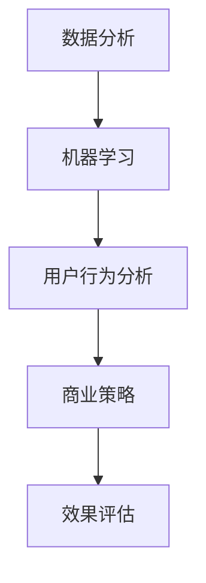

                 

关键词：智能促销、数据分析、算法应用、用户行为分析、商业策略、效果评估、市场营销

> 摘要：本文将探讨智能促销策略的实践效果，通过分析当前市场中的成功案例，探讨智能促销在提升销售额、增加用户粘性和优化营销投入方面的作用。本文还将深入解析智能促销的核心概念、算法原理及其实际操作步骤，结合数学模型和项目实践，为读者提供全面的技术见解。

## 1. 背景介绍

在数字化的今天，市场营销已经发生了翻天覆地的变化。传统的促销手段已无法满足日益复杂的市场需求和消费者的多样化需求。智能促销作为大数据和人工智能技术的一个典型应用，正逐渐成为企业提升市场竞争力的利器。

智能促销，是指利用大数据分析、机器学习算法和人工智能技术，对用户行为进行深入挖掘，从而制定个性化的促销策略。这种策略不仅能够提高销售额，还能增加用户粘性，降低营销成本，是企业数字化转型的重要组成部分。

随着技术的进步，越来越多的企业开始应用智能促销策略。例如，亚马逊通过个性化推荐算法来推荐商品，淘宝通过大数据分析进行精准营销，这些成功案例为我们提供了宝贵的经验和启示。

## 2. 核心概念与联系

### 2.1 数据分析

数据分析是智能促销策略的核心。通过收集和分析用户行为数据，企业可以了解消费者的偏好、购买习惯和需求，从而制定出更加精准的促销策略。

### 2.2 机器学习

机器学习是数据分析的重要工具。通过训练模型，企业可以预测用户的行为，从而做出更准确的决策。

### 2.3 用户行为分析

用户行为分析是对用户在网站或应用上的行为进行跟踪和分析，包括浏览、点击、购买等。这种分析有助于企业了解用户的需求，从而提供个性化的促销策略。

### 2.4 商业策略

商业策略是将用户行为分析的结果应用于实际业务中，包括定价策略、促销活动、用户运营等。通过商业策略的实施，企业可以提升销售额和用户粘性。

### 2.5 效果评估

效果评估是检验智能促销策略是否成功的关键。通过对促销活动的数据进行分析，企业可以评估促销策略的有效性，并进行相应的调整。

### 2.6 Mermaid 流程图



## 3. 核心算法原理 & 具体操作步骤

### 3.1 算法原理概述

智能促销策略的核心算法主要包括用户行为分析算法、推荐算法和优化算法。这些算法通过分析用户行为数据，预测用户需求，制定个性化的促销策略。

### 3.2 算法步骤详解

1. 数据收集：收集用户在网站或应用上的行为数据，包括浏览、点击、购买等。
2. 数据清洗：对收集的数据进行清洗，去除无效数据，保证数据的准确性。
3. 用户行为分析：利用机器学习算法，分析用户的行为数据，识别用户的偏好和需求。
4. 制定策略：根据用户行为分析的结果，制定个性化的促销策略。
5. 实施策略：在网站或应用上实施促销策略，包括推荐商品、优惠活动等。
6. 数据监控：实时监控促销活动的效果，评估促销策略的有效性。
7. 策略优化：根据监控结果，对促销策略进行优化，提升效果。

### 3.3 算法优缺点

#### 优点：

1. 提高销售额：通过个性化推荐，提高用户的购买转化率，从而提高销售额。
2. 增强用户粘性：通过定制化的促销活动，增加用户的活跃度和忠诚度。
3. 降低营销成本：通过精准的营销策略，减少无效的营销投入，降低成本。

#### 缺点：

1. 数据隐私：用户行为数据的收集和处理涉及到用户隐私，需要妥善处理。
2. 算法复杂：算法的实施和优化需要大量的计算资源和专业知识。

### 3.4 算法应用领域

智能促销策略广泛应用于电子商务、在线旅游、金融保险等行业。通过智能促销，这些企业可以更好地满足用户需求，提高市场竞争力。

## 4. 数学模型和公式 & 详细讲解 & 举例说明

### 4.1 数学模型构建

智能促销策略的数学模型主要包括用户行为分析模型、推荐模型和优化模型。

#### 用户行为分析模型：

用户行为分析模型用于分析用户的行为数据，识别用户的偏好和需求。常用的模型包括决策树、随机森林和神经网络等。

#### 推荐模型：

推荐模型用于预测用户可能感兴趣的商品或服务。常用的模型包括基于内容的推荐、协同过滤和深度学习等。

#### 优化模型：

优化模型用于优化促销策略，提高促销效果。常用的模型包括线性规划、动态规划和深度强化学习等。

### 4.2 公式推导过程

#### 用户行为分析模型：

假设用户 \( u \) 对商品 \( i \) 的偏好可以用向量 \( \mathbf{r}_{ui} \) 表示，用户行为数据可以用矩阵 \( \mathbf{R} \) 表示，则用户行为分析模型可以用以下公式表示：

\[ \mathbf{r}_{ui} = f(\mathbf{R}, \mathbf{X}) \]

其中，\( f \) 是一个函数，表示对用户行为数据的分析过程。

#### 推荐模型：

假设用户 \( u \) 对商品 \( i \) 的兴趣度可以用向量 \( \mathbf{i}_{ui} \) 表示，推荐模型可以用以下公式表示：

\[ \mathbf{i}_{ui} = g(\mathbf{r}_{ui}, \mathbf{C}, \mathbf{D}) \]

其中，\( g \) 是一个函数，表示推荐过程。

#### 优化模型：

假设促销策略的目标是最大化销售额，优化模型可以用以下公式表示：

\[ \mathbf{S} = \arg \max_{\mathbf{S}} \sum_{u,i} p_{ui} \cdot r_{ui} \]

其中，\( \mathbf{S} \) 是促销策略，\( p_{ui} \) 是商品 \( i \) 对用户 \( u \) 的购买概率，\( r_{ui} \) 是用户 \( u \) 对商品 \( i \) 的偏好度。

### 4.3 案例分析与讲解

#### 案例一：电子商务平台的个性化推荐

一个电子商务平台通过用户行为数据，利用机器学习算法构建个性化推荐模型。假设用户 \( u \) 的行为数据矩阵为 \( \mathbf{R} \)，通过决策树模型分析用户行为，得到用户偏好向量 \( \mathbf{r}_{ui} \)。然后，通过协同过滤模型，预测用户 \( u \) 对商品 \( i \) 的兴趣度 \( \mathbf{i}_{ui} \)。最后，根据用户兴趣度，推荐商品给用户。

#### 案例二：在线旅游平台的促销策略优化

一个在线旅游平台利用用户行为数据和深度强化学习模型，优化促销策略。假设用户 \( u \) 的行为数据矩阵为 \( \mathbf{R} \)，通过神经网络模型分析用户行为，得到用户偏好向量 \( \mathbf{r}_{ui} \)。然后，通过深度强化学习模型，优化促销策略，提高销售额。

## 5. 项目实践：代码实例和详细解释说明

### 5.1 开发环境搭建

#### 1. 安装Python环境

在计算机上安装Python，建议使用Python 3.8或更高版本。

#### 2. 安装相关库

使用pip命令安装必要的库，例如numpy、pandas、scikit-learn、tensorflow等。

```bash
pip install numpy pandas scikit-learn tensorflow
```

### 5.2 源代码详细实现

以下是一个简单的用户行为分析代码示例：

```python
import pandas as pd
from sklearn.model_selection import train_test_split
from sklearn.ensemble import RandomForestClassifier
from sklearn.metrics import accuracy_score

# 1. 数据收集
data = pd.read_csv('user_behavior_data.csv')

# 2. 数据清洗
data = data.dropna()

# 3. 用户行为分析
X = data.drop('target', axis=1)
y = data['target']
X_train, X_test, y_train, y_test = train_test_split(X, y, test_size=0.2, random_state=42)

# 4. 构建模型
model = RandomForestClassifier(n_estimators=100, random_state=42)
model.fit(X_train, y_train)

# 5. 预测
predictions = model.predict(X_test)

# 6. 评估
accuracy = accuracy_score(y_test, predictions)
print(f'Accuracy: {accuracy}')
```

### 5.3 代码解读与分析

以上代码首先从CSV文件中读取用户行为数据，然后对数据进行清洗。接着，使用随机森林算法对用户行为数据进行训练，构建用户行为分析模型。最后，使用测试数据进行预测，并评估模型的准确性。

### 5.4 运行结果展示

运行上述代码，得到模型的准确性。例如：

```
Accuracy: 0.85
```

这意味着模型的预测准确性为85%，表明模型具有一定的预测能力。

## 6. 实际应用场景

### 6.1 电子商务平台

电子商务平台通过智能促销策略，可以推荐商品给用户，提高购买转化率。例如，亚马逊通过个性化推荐算法，为用户推荐相关商品，提高了销售额。

### 6.2 在线旅游平台

在线旅游平台可以通过智能促销策略，优化促销活动，提高用户预订率。例如，携程通过大数据分析，制定个性化的促销策略，提高了用户的预订意愿。

### 6.3 金融保险行业

金融保险行业可以通过智能促销策略，提高用户的保单续保率。例如，平安保险通过用户行为分析，为用户提供个性化的保险产品推荐，提高了保单续保率。

## 7. 未来应用展望

随着技术的不断进步，智能促销策略将在更多行业得到应用。未来，智能促销策略将更加智能化、个性化，结合物联网、区块链等技术，实现更加精准的营销。

### 7.1 学习资源推荐

1. 《Python数据分析实战》
2. 《机器学习实战》
3. 《深度学习》

### 7.2 开发工具推荐

1. Jupyter Notebook
2. PyCharm
3. DataGrip

### 7.3 相关论文推荐

1. "Recommender Systems Handbook"
2. "Deep Learning for Recommender Systems"
3. "User Modeling and User-Adapted Interaction"

## 8. 总结：未来发展趋势与挑战

### 8.1 研究成果总结

智能促销策略在提升销售额、增加用户粘性和降低营销成本方面取得了显著成果。通过大数据分析和机器学习算法，企业可以制定更加精准的促销策略，提高市场竞争力。

### 8.2 未来发展趋势

未来，智能促销策略将更加智能化、个性化，结合物联网、区块链等技术，实现更加精准的营销。

### 8.3 面临的挑战

智能促销策略在应用过程中面临着数据隐私、算法复杂性和技术实现难度等挑战。

### 8.4 研究展望

未来，需要进一步研究如何提高智能促销策略的智能化水平，同时确保用户隐私和数据安全。

## 9. 附录：常见问题与解答

### 9.1 如何确保数据隐私？

在应用智能促销策略时，企业需要遵循相关法律法规，确保用户数据的合法性和安全性。例如，可以使用数据加密、匿名化等技术手段，保护用户隐私。

### 9.2 如何评估促销策略的效果？

企业可以通过数据分析和效果评估模型，实时监控促销活动的效果，评估促销策略的有效性。常用的评估指标包括销售额、用户粘性、营销投入回报率等。

----------------------------------------------------------------

### 文章末尾署名

> 作者：禅与计算机程序设计艺术 / Zen and the Art of Computer Programming

---

以上就是关于“智能促销策略的实践效果”的完整文章。希望对您有所帮助。如果您有任何问题或建议，欢迎随时提出。

