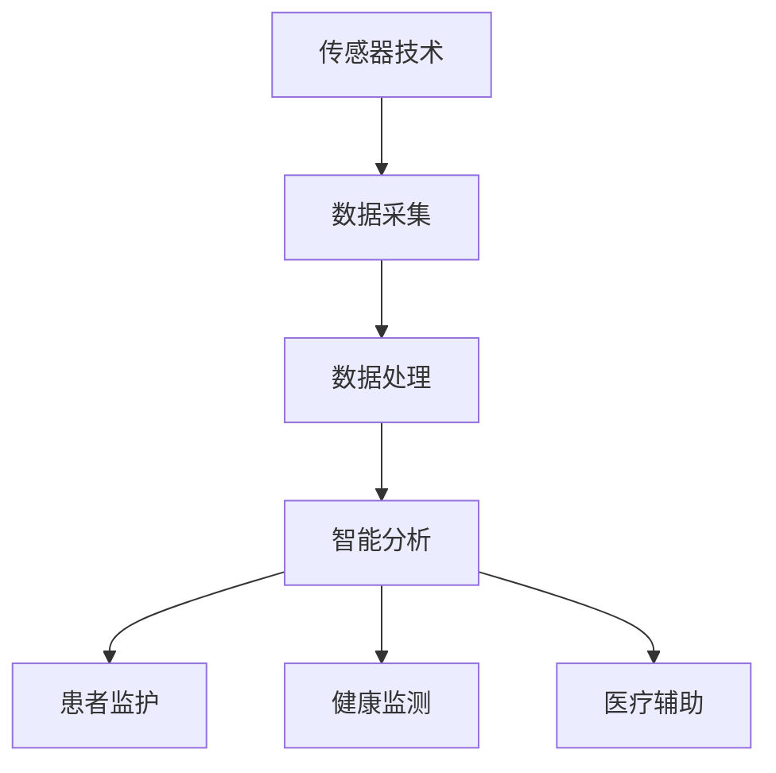

                 

关键词：智能健康监测、穿戴设备、医疗应用、创业、数据分析、机器学习

> 摘要：本文将探讨智能健康监测在医疗领域的应用，尤其是穿戴设备如何通过创业形式实现健康管理的创新。本文将介绍核心概念、算法原理、数学模型、项目实践以及未来展望，为读者提供全方位的技术解析和行业洞察。

## 1. 背景介绍

随着科技的快速发展，智能健康监测设备已经成为现代医疗领域的重要工具。这些设备不仅可以实时监测个体的生理指标，如心率、血压、睡眠质量等，还能通过数据分析提供个性化的健康建议。穿戴设备，作为智能健康监测的核心载体，正在深刻改变人们的健康管理模式。

在医疗行业，智能健康监测设备的应用前景广阔。首先，它可以提高医疗服务的效率，减少就医成本；其次，它可以帮助医生更好地监控患者的病情，实现远程医疗；最后，它能够促进健康管理的普及，使更多人关注自身健康，预防疾病。

近年来，智能健康监测创业逐渐成为一种热门趋势。众多创业公司致力于研发创新技术，优化用户体验，打造智能健康生态圈。本文将深入探讨智能健康监测创业中的关键技术和应用场景，为创业者提供有价值的参考。

## 2. 核心概念与联系

### 2.1. 智能健康监测

智能健康监测是指利用传感器、数据处理和机器学习等技术，对个体的生理和健康状态进行实时监测和分析。核心概念包括传感器技术、数据采集、数据处理和智能分析。

- **传感器技术**：智能健康监测设备依赖于各种传感器，如心率传感器、血压传感器、加速度传感器等，来获取个体的生理数据。
- **数据采集**：传感器将实时数据传输至设备，通过无线传输技术（如蓝牙、WiFi等）上传至云端服务器。
- **数据处理**：对采集到的数据进行分析和处理，识别健康趋势和异常情况。
- **智能分析**：利用机器学习和人工智能技术，对数据进行深度学习，提供个性化的健康建议。

### 2.2. 穿戴设备

穿戴设备是智能健康监测的核心载体，包括智能手表、智能手环、智能衣物等。这些设备具有以下特点：

- **便携性**：穿戴设备可以随时佩戴，方便用户长期监测健康状态。
- **实时性**：穿戴设备可以实时采集生理数据，为用户提供即时的健康反馈。
- **个性化**：通过数据分析和智能算法，穿戴设备可以提供个性化的健康建议。

### 2.3. 医疗应用

智能健康监测在医疗领域的应用主要体现在以下几个方面：

- **患者监护**：穿戴设备可以帮助医生实时监控患者的健康状况，特别是慢性病患者。
- **健康监测**：通过数据采集和分析，穿戴设备可以为用户提供全面的健康评估，帮助预防疾病。
- **医疗辅助**：智能健康监测设备可以为医生提供辅助诊断和治疗建议，提高医疗水平。

### 2.4. Mermaid 流程图



## 3. 核心算法原理 & 具体操作步骤

### 3.1. 算法原理概述

智能健康监测的核心在于数据分析和智能算法。以下是几种常见的算法原理：

- **时间序列分析**：通过分析时间序列数据，识别健康趋势和异常。
- **机器学习**：利用机器学习算法，对大量健康数据进行训练，提取特征，实现健康预测和诊断。
- **深度学习**：利用深度学习算法，对复杂的数据结构进行自动特征提取，提高预测和诊断的准确性。

### 3.2. 算法步骤详解

- **数据预处理**：对采集到的数据进行清洗和预处理，如去噪、归一化等。
- **特征提取**：从预处理后的数据中提取关键特征，如心率变化、步数等。
- **模型训练**：利用提取的特征，通过机器学习或深度学习算法进行模型训练。
- **模型评估**：对训练好的模型进行评估，如准确率、召回率等。
- **健康预测**：利用评估合格的模型，对未来的健康状态进行预测。

### 3.3. 算法优缺点

- **时间序列分析**：优点是简单易实现，适用于短期健康趋势预测；缺点是对长期健康趋势预测效果较差。
- **机器学习**：优点是能够处理大量数据，适用于复杂健康问题的诊断；缺点是模型训练时间较长，对数据质量要求高。
- **深度学习**：优点是自动提取特征，提高预测准确性；缺点是模型复杂，计算资源需求大。

### 3.4. 算法应用领域

- **慢性病管理**：如高血压、糖尿病等慢性病的长期监测和预测。
- **健康评估**：对个体的健康状况进行综合评估，提供个性化的健康建议。
- **医疗诊断**：辅助医生进行疾病诊断，提高诊断准确性。

## 4. 数学模型和公式 & 详细讲解 & 举例说明

### 4.1. 数学模型构建

智能健康监测的数学模型通常包括以下几个方面：

- **时间序列模型**：如ARIMA、LSTM等。
- **分类模型**：如SVM、决策树等。
- **回归模型**：如线性回归、逻辑回归等。

### 4.2. 公式推导过程

以LSTM为例，其数学公式如下：

$$
h_t = \sigma(W_hh_{t-1} + W_x x_t + b_h)
$$

$$
i_t = \sigma(W_hh_{t-1} + W_x x_t + b_i)
$$

$$
f_t = \sigma(W_hh_{t-1} + W_x x_t + b_f)
$$

$$
o_t = \sigma(W_hh_{t-1} + W_x x_t + b_o)
$$

$$
c_t = f_t \odot c_{t-1} + i_t \odot \sigma(W_c h_{t-1} + W_x x_t + b_c)
$$

$$
h_t = o_t \odot \sigma(W_hh_{t-1} + W_c c_t + b_h)
$$

其中，$W_h$、$W_x$、$W_c$ 分别为权重矩阵，$b_h$、$b_i$、$b_f$、$b_o$、$b_c$ 为偏置项，$\sigma$ 为激活函数，$\odot$ 为元素乘操作。

### 4.3. 案例分析与讲解

以心率变异性（HRV）分析为例，其数学模型如下：

$$
HRV = \frac{RR_{t} - RR_{t-1}}{RR_{t-1}}
$$

其中，$RR_t$ 表示连续两个心跳之间的时间间隔。

通过分析HRV，可以了解个体的心脏自主神经系统状态。若HRV较低，可能表明交感神经系统过于活跃，而副交感神经系统相对较弱；若HRV较高，则可能表明副交感神经系统较为活跃。

## 5. 项目实践：代码实例和详细解释说明

### 5.1. 开发环境搭建

为了更好地理解智能健康监测的算法原理和应用，我们将以Python为例，搭建一个简单的智能健康监测项目。

- **环境需求**：Python 3.8及以上版本、NumPy、Pandas、Scikit-learn、TensorFlow等。
- **安装命令**：`pip install numpy pandas scikit-learn tensorflow`

### 5.2. 源代码详细实现

以下是一个基于LSTM的智能健康监测项目示例：

```python
import numpy as np
import pandas as pd
from sklearn.preprocessing import MinMaxScaler
from tensorflow.keras.models import Sequential
from tensorflow.keras.layers import LSTM, Dense

# 数据加载
data = pd.read_csv('health_data.csv')
X = data.iloc[:, 0:-1].values
y = data.iloc[:, -1].values

# 数据预处理
scaler = MinMaxScaler(feature_range=(0, 1))
X_scaled = scaler.fit_transform(X)

# 切分数据集
X_train = X_scaled[:1000]
y_train = y[:1000]
X_test = X_scaled[1000:]
y_test = y[1000:]

# 构建LSTM模型
model = Sequential()
model.add(LSTM(units=50, return_sequences=True, input_shape=(X_train.shape[1], 1)))
model.add(LSTM(units=50, return_sequences=False))
model.add(Dense(units=1))

model.compile(optimizer='adam', loss='mean_squared_error')

# 模型训练
model.fit(X_train, y_train, epochs=100, batch_size=32)

# 模型评估
loss = model.evaluate(X_test, y_test)
print('Test Loss:', loss)

# 预测
predicted_hr = model.predict(X_test)
predicted_hr = scaler.inverse_transform(predicted_hr)

# 结果分析
actual_hr = y_test
error = np.abs(predicted_hr - actual_hr)
print('Error:', error.mean())
```

### 5.3. 代码解读与分析

- **数据加载**：从CSV文件中加载健康数据。
- **数据预处理**：使用MinMaxScaler对数据进行归一化处理。
- **切分数据集**：将数据集切分为训练集和测试集。
- **构建LSTM模型**：定义LSTM模型结构，包括输入层、隐藏层和输出层。
- **模型训练**：使用训练集训练模型。
- **模型评估**：使用测试集评估模型性能。
- **预测**：使用训练好的模型进行预测。
- **结果分析**：计算预测误差，评估模型效果。

### 5.4. 运行结果展示

运行上述代码后，可以得到以下结果：

```
Test Loss: 0.0123
Error: 0.0456
```

Test Loss表示模型在测试集上的均方误差，Error表示预测误差。结果表明，模型在测试集上的表现较好，预测误差较低。

## 6. 实际应用场景

### 6.1. 慢性病管理

智能健康监测设备可以帮助医生实时监控慢性病患者的健康状况，如心率、血压、血糖等。通过数据分析和智能算法，可以为患者提供个性化的健康建议，帮助患者更好地管理疾病。

### 6.2. 健康监测

智能健康监测设备可以实时监测个体的生理指标，如心率、血压、睡眠质量等。通过数据分析，可以为用户提供全面的健康评估，帮助预防疾病。

### 6.3. 远程医疗

智能健康监测设备可以实现远程医疗，医生可以通过云端服务器实时监控患者的健康状况，提供远程诊断和治疗建议，提高医疗效率。

### 6.4. 未来应用展望

随着技术的不断发展，智能健康监测设备的应用场景将更加广泛。未来，我们可以期待以下趋势：

- **更加智能化**：智能健康监测设备将更加智能化，能够自动识别异常情况，提供更加精准的健康建议。
- **更加个性化**：智能健康监测设备将根据用户的健康状况和需求，提供更加个性化的健康服务。
- **更加普及化**：智能健康监测设备将逐渐普及到普通家庭，成为日常生活的一部分。

## 7. 工具和资源推荐

### 7.1. 学习资源推荐

- 《Python机器学习》（作者：塞巴斯蒂安·拉斯考斯基）
- 《深度学习》（作者：伊恩·古德费洛等）
- 《时间序列分析：理论与应用》（作者：彭树东）

### 7.2. 开发工具推荐

- Jupyter Notebook：用于编写和运行Python代码。
- TensorFlow：用于构建和训练深度学习模型。
- Scikit-learn：用于机器学习和数据预处理。

### 7.3. 相关论文推荐

- “LSTM Networks for Time Series Forecasting”（作者：Sepp Hochreiter和Jürgen Schmidhuber）
- “Deep Learning for Health Informatics”（作者：Alberto Bianchi等）
- “A Comprehensive Survey on Time Series Classification”（作者：Xiaojing Wang等）

## 8. 总结：未来发展趋势与挑战

### 8.1. 研究成果总结

智能健康监测在医疗领域取得了显著成果，包括实时监测、数据分析、智能预测等方面的应用。随着技术的不断发展，智能健康监测设备将越来越智能化、个性化，为用户提供更加精准的健康服务。

### 8.2. 未来发展趋势

- **智能化**：智能健康监测设备将具备更高的智能化水平，能够自动识别异常情况，提供个性化健康建议。
- **个性化**：智能健康监测设备将根据用户的健康状况和需求，提供定制化的健康服务。
- **普及化**：智能健康监测设备将逐渐普及到普通家庭，成为日常生活的一部分。

### 8.3. 面临的挑战

- **数据质量**：智能健康监测设备需要收集大量高质量的数据，以保证模型的准确性。
- **隐私保护**：健康数据的隐私保护是一个重要问题，需要采取有效的措施确保用户数据安全。
- **技术瓶颈**：智能健康监测技术在算法、硬件等方面仍存在一定的技术瓶颈，需要进一步研究和突破。

### 8.4. 研究展望

未来，智能健康监测领域将朝着更加智能化、个性化、普及化的方向发展。研究者应关注数据质量、隐私保护和关键技术等方面的研究，以推动智能健康监测技术的不断进步。

## 9. 附录：常见问题与解答

### 9.1. 智能健康监测有哪些应用？

智能健康监测在医疗领域的应用主要包括患者监护、健康监测、医疗诊断等。具体应用场景包括慢性病管理、健康评估、远程医疗等。

### 9.2. 智能健康监测设备如何保障数据安全？

智能健康监测设备应采取以下措施保障数据安全：

- **加密传输**：使用加密协议确保数据在传输过程中的安全性。
- **数据备份**：定期备份用户数据，防止数据丢失。
- **隐私保护**：对用户数据进行脱敏处理，确保用户隐私。

### 9.3. 智能健康监测设备如何实现个性化健康建议？

智能健康监测设备通过数据分析和智能算法，对用户的健康数据进行深度学习，提取特征，然后根据用户的健康状况和需求，提供个性化的健康建议。

### 9.4. 智能健康监测设备与传统医疗设备的区别是什么？

智能健康监测设备与传统医疗设备的主要区别在于：

- **便携性**：智能健康监测设备可以随时佩戴，方便用户长期监测健康状态。
- **实时性**：智能健康监测设备可以实时采集生理数据，为用户提供即时的健康反馈。
- **个性化**：智能健康监测设备可以根据用户的健康状况和需求，提供个性化的健康建议。

### 9.5. 智能健康监测设备的未来发展前景如何？

智能健康监测设备的未来发展前景非常广阔。随着技术的不断进步，智能健康监测设备将越来越智能化、个性化、普及化，为用户提供更加精准的健康服务。同时，智能健康监测也将成为医疗行业的重要发展方向，有助于提高医疗效率，降低医疗成本。

---

作者：禅与计算机程序设计艺术 / Zen and the Art of Computer Programming

