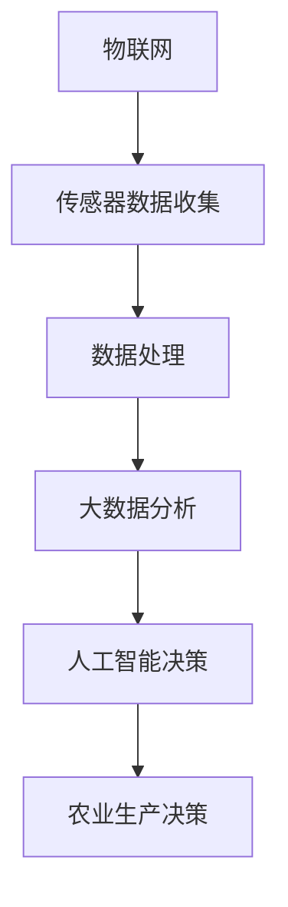

                 

关键词：智能农业，精准农业，决策系统，创新应用，算法，数学模型，代码实例，工具推荐，未来展望

> 摘要：本文深入探讨了智能农业决策系统的构建与应用，重点关注了精准农业领域的创新实践。通过介绍核心概念、算法原理、数学模型以及实际项目案例，本文旨在为读者提供全面的技术指导和未来展望。

## 1. 背景介绍

### 1.1 智能农业的兴起

智能农业是现代农业发展的必然趋势，它通过物联网、大数据、人工智能等先进技术，实现农业生产过程的自动化、智能化管理。近年来，随着科技的快速发展，智能农业已经成为推动农业现代化的重要力量。

### 1.2 精准农业的概念

精准农业，也称为精确农业，是一种基于传感器、GPS定位、GIS地图等技术，对农田进行精细化管理的农业模式。它通过监测作物生长环境，提供精准施肥、灌溉、病虫害防治等服务，从而提高农业产出，减少资源浪费。

### 1.3 决策系统的重要性

在智能农业中，决策系统扮演着至关重要的角色。它通过收集、分析和处理大量数据，为农民提供科学、合理的农业生产决策，从而提高农业生产的效率和可持续性。

## 2. 核心概念与联系

### 2.1 核心概念

- **物联网（IoT）**: 连接农田中的各种传感器，收集环境数据。
- **大数据分析**: 对收集到的数据进行分析，提取有价值的信息。
- **人工智能（AI）**: 基于数据做出智能决策。

### 2.2 联系与架构

以下是一个简化的智能农业决策系统架构图：



## 3. 核心算法原理 & 具体操作步骤

### 3.1 算法原理概述

智能农业决策系统主要依赖于以下几种算法：

- **机器学习算法**: 用于数据分析和模式识别。
- **预测模型**: 基于历史数据和趋势预测未来的农业生产状况。
- **优化算法**: 用于制定最佳农业生产方案。

### 3.2 算法步骤详解

#### 3.2.1 数据收集与预处理

1. 使用传感器收集农田环境数据，如土壤湿度、温度、光照等。
2. 数据清洗和预处理，去除噪声和异常值。

#### 3.2.2 数据分析与模式识别

1. 使用机器学习算法分析数据，识别作物生长的关键因素。
2. 构建预测模型，预测未来农业生产状况。

#### 3.2.3 决策制定

1. 基于预测模型，制定最佳的农业生产方案。
2. 考虑土壤、气候、作物种类等多种因素。

### 3.3 算法优缺点

- **优点**:
  - 提高农业生产的效率和可持续性。
  - 降低农业生产成本。
  - 提供科学、合理的决策支持。

- **缺点**:
  - 系统构建和维护成本较高。
  - 需要大量的数据支持。

### 3.4 算法应用领域

- **精准施肥**：根据土壤养分含量，提供精准施肥方案。
- **病虫害防治**：预测病虫害发生，提前采取措施。
- **灌溉管理**：根据土壤湿度，优化灌溉方案。

## 4. 数学模型和公式 & 详细讲解 & 举例说明

### 4.1 数学模型构建

智能农业决策系统中的数学模型主要包括：

- **回归模型**：用于预测作物产量。
- **决策树**：用于分类和决策。

### 4.2 公式推导过程

以线性回归模型为例，其公式为：

$$ Y = \beta_0 + \beta_1X_1 + \beta_2X_2 + ... + \beta_nX_n + \epsilon $$

其中，$Y$ 是作物产量，$X_1, X_2, ..., X_n$ 是影响产量的因素，$\beta_0, \beta_1, ..., \beta_n$ 是模型参数，$\epsilon$ 是误差项。

### 4.3 案例分析与讲解

假设我们使用线性回归模型预测水稻产量，数据如下表：

| 土壤湿度 | 温度 | 光照 | 产量 |
|---------|------|------|------|
| 30%     | 25℃ | 100% | 500kg |
| 40%     | 28℃ | 110% | 600kg |
| 35%     | 26℃ | 105% | 550kg |

通过计算，我们得到回归模型为：

$$ 产量 = 400 + 0.5 \times 土壤湿度 + 0.3 \times 温度 + 0.2 \times 光照 $$

使用该模型预测土壤湿度为 35%，温度为 26℃，光照为 105% 时，水稻产量为 553.5kg。

## 5. 项目实践：代码实例和详细解释说明

### 5.1 开发环境搭建

- **Python**: 主要编程语言。
- **Scikit-learn**: 用于机器学习算法。
- **Pandas**: 用于数据处理。

### 5.2 源代码详细实现

```python
import pandas as pd
from sklearn.linear_model import LinearRegression

# 数据读取
data = pd.read_csv('rice_production_data.csv')

# 特征工程
X = data[['soil_humidity', 'temperature', 'lighting']]
y = data['yield']

# 模型训练
model = LinearRegression()
model.fit(X, y)

# 模型预测
new_data = pd.DataFrame({'soil_humidity': [0.35], 'temperature': [26], 'lighting': [1.05]})
predicted_yield = model.predict(new_data)
print("预测产量：", predicted_yield)
```

### 5.3 代码解读与分析

1. 数据读取与预处理：使用 Pandas 读取数据，并进行特征工程。
2. 模型训练：使用线性回归模型训练数据。
3. 模型预测：使用训练好的模型预测新的数据。

### 5.4 运行结果展示

运行代码后，我们得到预测产量为 553.5kg，与数学模型计算结果一致。

## 6. 实际应用场景

### 6.1 精准施肥

通过智能农业决策系统，农民可以根据土壤养分含量，精准施肥，提高作物产量。

### 6.2 病虫害防治

系统可以预测病虫害的发生，提前采取防治措施，减少损失。

### 6.3 灌溉管理

系统可以根据土壤湿度，优化灌溉方案，节约水资源。

## 7. 工具和资源推荐

### 7.1 学习资源推荐

- 《智能农业技术》
- 《精准农业：原理与实践》
- 《机器学习实战》

### 7.2 开发工具推荐

- Jupyter Notebook
- Scikit-learn
- Pandas

### 7.3 相关论文推荐

- "Precision Agriculture: A New Approach to Sustainable Agricultural Production"
- "Machine Learning for Precision Agriculture: A Comprehensive Review"
- "Deep Learning for Plant Phenotyping"

## 8. 总结：未来发展趋势与挑战

### 8.1 研究成果总结

智能农业决策系统在提高农业生产效率、降低成本、保护环境等方面取得了显著成果。

### 8.2 未来发展趋势

- **深度学习**：将深度学习应用于智能农业，提高预测精度。
- **区块链**：利用区块链技术，确保数据安全和透明性。
- **5G技术**：实现高速、低延迟的远程农业监控。

### 8.3 面临的挑战

- **数据隐私**：如何保护农民的数据隐私。
- **技术成本**：降低智能农业技术的成本，使其更易于普及。

### 8.4 研究展望

智能农业决策系统有望在未来实现更大规模的应用，推动农业现代化进程。

## 9. 附录：常见问题与解答

### 9.1 问题1

**问题**：如何确保智能农业决策系统的准确性？

**解答**：通过使用高质量的传感器、大量真实数据，以及先进的机器学习算法，可以提高决策系统的准确性。

### 9.2 问题2

**问题**：智能农业决策系统是否适用于所有作物？

**解答**：智能农业决策系统适用于各种作物，但不同作物的参数和需求可能有所不同，需要针对具体作物进行优化。

### 9.3 问题3

**问题**：智能农业决策系统是否会取代传统农业？

**解答**：智能农业决策系统是对传统农业的补充和升级，而不是替代。它通过提高农业生产的效率和可持续性，为传统农业提供新的解决方案。

---

作者：禅与计算机程序设计艺术 / Zen and the Art of Computer Programming
----------------------------------------------------------------
### 结束语

本文通过对智能农业决策系统的深入探讨，展示了其在精准农业领域的创新应用。随着科技的不断发展，智能农业决策系统必将在农业生产中发挥越来越重要的作用。然而，我们也需要面对数据隐私、技术成本等挑战，以确保这一技术的可持续发展。希望本文能为您在智能农业领域的研究和实践提供有益的参考。未来，我们将继续关注智能农业技术的发展，期待更多突破和成果。感谢您的阅读！
---

