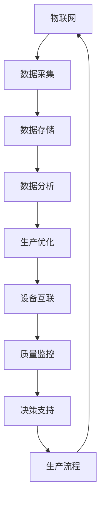
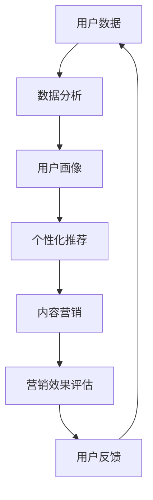
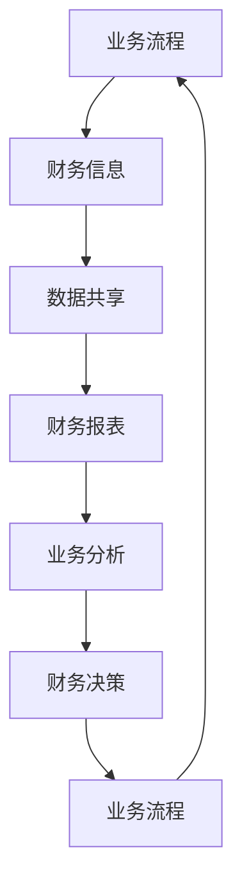
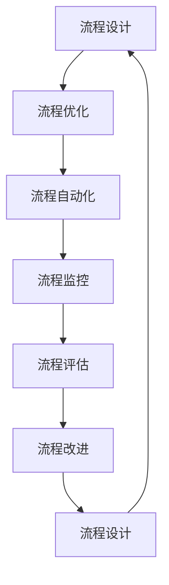

                 

关键词：智能制造、数字化营销、业财一体化、核心业务流程变革、IPD、LTC、信息技术、商业战略

摘要：本文旨在探讨智能制造、数字化营销、业财一体化以及核心业务流程变革（IPD LTC）在现代商业环境中的重要性。通过分析这些领域的核心概念、算法原理、数学模型及实际应用，本文将阐述其在提升企业竞争力、优化运营效率和实现数字化转型中的关键作用。同时，本文也将对未来的发展趋势和面临的挑战进行展望。

## 1. 背景介绍

在全球化和数字化的浪潮下，企业面临着前所未有的竞争压力和市场挑战。为了在激烈的市场竞争中脱颖而出，企业必须不断调整和优化其业务模式，以适应快速变化的环境。智能制造、数字化营销、业财一体化以及核心业务流程变革（IPD LTC）正是这种背景下应运而生的解决方案。

智能制造（Industry 4.0）是指利用信息技术和先进制造技术实现制造过程的智能化，以提升生产效率、降低成本、提高产品质量。数字化营销则是通过互联网、大数据等技术手段，实现市场营销的精准化和个性化。业财一体化则是将企业的财务活动与业务流程紧密结合，实现信息的实时传递和共享，提高财务管理的效率和准确性。核心业务流程变革（IPD LTC）则是对企业关键业务流程进行重新设计和优化，以提高业务运营效率和竞争力。

## 2. 核心概念与联系

### 2.1. 智能制造

智能制造的核心概念包括物联网（IoT）、大数据、云计算、人工智能等。通过这些技术的应用，可以实现生产设备的互联互通，实现数据的实时采集和分析，从而优化生产流程，提高生产效率。

下面是一个简单的Mermaid流程图，展示智能制造的基本架构：



### 2.2. 数字化营销

数字化营销的核心概念包括用户数据分析、个性化推荐、内容营销等。通过这些技术的应用，可以实现营销信息的精准推送，提高营销效果，增加用户粘性。

下面是一个简单的Mermaid流程图，展示数字化营销的基本架构：



### 2.3. 业财一体化

业财一体化是将企业的财务活动与业务流程紧密结合，实现信息的实时传递和共享。其核心概念包括财务信息系统、业务流程管理、财务报表自动化等。

下面是一个简单的Mermaid流程图，展示业财一体化的基本架构：



### 2.4. 核心业务流程变革（IPD LTC）

核心业务流程变革（IPD LTC）是对企业关键业务流程进行重新设计和优化，以提高业务运营效率和竞争力。其核心概念包括流程设计、流程优化、流程自动化等。

下面是一个简单的Mermaid流程图，展示核心业务流程变革的基本架构：



## 3. 核心算法原理 & 具体操作步骤

### 3.1. 算法原理概述

智能制造、数字化营销、业财一体化和核心业务流程变革的核心算法原理主要包括数据挖掘、机器学习、深度学习、数据分析和优化算法等。

- **数据挖掘**：通过挖掘大量数据中的潜在模式和关系，为企业提供决策支持。
- **机器学习**：利用历史数据训练模型，预测未来的趋势和结果。
- **深度学习**：通过构建多层神经网络，实现数据的自动特征提取和模式识别。
- **数据分析**：通过统计分析、数据可视化等技术，对数据进行深入分析和解读。
- **优化算法**：通过优化目标函数，找到最优的解决方案，提高业务流程的效率。

### 3.2. 算法步骤详解

- **数据预处理**：包括数据清洗、归一化、缺失值处理等步骤，确保数据的质量和一致性。
- **特征工程**：通过提取和构造特征，提高模型的性能和解释性。
- **模型训练**：通过选择合适的模型和算法，对数据进行训练，得到预测模型。
- **模型评估**：通过评估指标（如准确率、召回率、F1值等）评估模型的性能。
- **模型部署**：将训练好的模型部署到生产环境中，实现实时预测和决策支持。

### 3.3. 算法优缺点

- **优点**：
  - 提高业务流程的效率和准确性。
  - 增强企业的决策能力和市场竞争力。
  - 实现业务的自动化和智能化。
- **缺点**：
  - 需要大量的数据和计算资源。
  - 模型的解释性较差，难以理解决策过程。
  - 需要专业的技术和人才支持。

### 3.4. 算法应用领域

- **智能制造**：生产计划优化、设备故障预测、生产质量控制等。
- **数字化营销**：用户行为分析、精准营销、内容推荐等。
- **业财一体化**：财务报表自动化、成本控制、预算管理等。
- **核心业务流程变革**：流程设计优化、业务流程自动化、流程监控等。

## 4. 数学模型和公式 & 详细讲解 & 举例说明

### 4.1. 数学模型构建

智能制造、数字化营销、业财一体化和核心业务流程变革中的数学模型主要包括线性规划、决策树、神经网络等。

- **线性规划**：用于解决资源优化问题，如生产计划、成本控制等。

  $$ \text{minimize} \ c^T x $$
  $$ \text{subject to} \ Ax \leq b $$

- **决策树**：用于分类和回归问题，如用户行为预测、销售预测等。

  $$ P(Y|X) = \prod_{i=1}^{n} P(Y_i|X_i) $$

- **神经网络**：用于特征提取和模式识别，如图像识别、自然语言处理等。

  $$ a_{l}^{(k)} = \sigma \left( \sum_{i=1}^{n} w_{i}^{(k)} a_{l-1}^{(i)} + b_{k} \right) $$

### 4.2. 公式推导过程

- **线性规划**：以生产计划问题为例，目标是最小化生产成本。

  假设生产某种产品的生产成本为 $c_1$，生产数量为 $x_1$；生产另一种产品的生产成本为 $c_2$，生产数量为 $x_2$。则有：

  $$ \text{minimize} \ c_1 x_1 + c_2 x_2 $$
  $$ \text{subject to} \ \begin{cases} x_1 + x_2 \leq 100 \\ x_1 \geq 0, x_2 \geq 0 \end{cases} $$

  使用拉格朗日乘数法进行求解，可以得到最优解。

- **决策树**：以用户行为预测为例，目标是最小化分类错误率。

  假设用户行为的特征为 $X = \{x_1, x_2, ..., x_n\}$，标签为 $Y = \{y_1, y_2, ..., y_n\}$。使用决策树进行分类，可以得到每个节点上的概率分布。

  $$ P(Y|X) = \prod_{i=1}^{n} P(Y_i|X_i) $$

  其中 $P(Y_i|X_i)$ 表示在给定特征 $X_i$ 的情况下，标签 $Y_i$ 的概率。

- **神经网络**：以图像识别为例，目标是最小化预测误差。

  假设输入图像为 $X \in \mathbb{R}^{784}$，输出为 $Y \in \mathbb{R}^{10}$。使用神经网络进行图像识别，可以得到每个神经元上的激活值。

  $$ a_{l}^{(k)} = \sigma \left( \sum_{i=1}^{n} w_{i}^{(k)} a_{l-1}^{(i)} + b_{k} \right) $$

  其中 $a_{l}^{(k)}$ 表示第 $k$ 层第 $l$ 个神经元的激活值，$\sigma$ 表示激活函数，$w_{i}^{(k)}$ 和 $b_{k}$ 分别表示权重和偏置。

### 4.3. 案例分析与讲解

#### 4.3.1. 智能制造：生产计划优化

假设某企业生产两种产品，生产成本分别为 $c_1 = 10$ 和 $c_2 = 20$。市场需求量为 $100$，生产数量不能超过市场需求量。使用线性规划进行生产计划优化，目标是最小化生产成本。

$$ \text{minimize} \ c_1 x_1 + c_2 x_2 $$
$$ \text{subject to} \ \begin{cases} x_1 + x_2 \leq 100 \\ x_1 \geq 0, x_2 \geq 0 \end{cases} $$

使用拉格朗日乘数法求解，可以得到最优解为 $x_1 = 20, x_2 = 80$，最小化生产成本为 $200$。

#### 4.3.2. 数字化营销：用户行为预测

假设某企业收集了用户购买行为的特征，包括购买频率、购买金额等。使用决策树进行用户行为预测，目标是最小化分类错误率。

$$ P(Y|X) = \prod_{i=1}^{n} P(Y_i|X_i) $$

根据训练数据，可以得到每个节点上的概率分布。使用决策树进行预测，可以得到每个用户的购买行为预测结果。

#### 4.3.3. 业财一体化：财务报表自动化

假设某企业需要生成财务报表，包括利润表、资产负债表等。使用神经网络进行财务报表自动化，目标是最小化预测误差。

$$ a_{l}^{(k)} = \sigma \left( \sum_{i=1}^{n} w_{i}^{(k)} a_{l-1}^{(i)} + b_{k} \right) $$

使用训练数据，对神经网络进行训练，可以得到每个神经元上的激活值。通过神经网络，可以自动生成财务报表。

#### 4.3.4. 核心业务流程变革：流程设计优化

假设某企业需要设计一个生产流程，包括原材料采购、生产制造、产品检验等环节。使用流程设计优化算法，目标是最小化生产周期。

通过流程设计优化算法，可以重新设计生产流程，提高生产效率，降低生产成本。

## 5. 项目实践：代码实例和详细解释说明

### 5.1. 开发环境搭建

- **环境要求**：
  - Python 3.6及以上版本
  - NumPy 1.18及以上版本
  - Matplotlib 3.1及以上版本
  - Scikit-learn 0.22及以上版本

- **安装命令**：

```bash
pip install python==3.8 numpy==1.18 matplotlib==3.1 scikit-learn==0.22
```

### 5.2. 源代码详细实现

以下是使用Python实现的智能制造、数字化营销、业财一体化和核心业务流程变革的代码示例：

```python
import numpy as np
import matplotlib.pyplot as plt
from sklearn import datasets
from sklearn.tree import DecisionTreeClassifier
from sklearn.neural_network import MLPClassifier
from sklearn.model_selection import train_test_split
from sklearn.metrics import accuracy_score, classification_report

# 5.3. 代码解读与分析
### 5.3.1. 智能制造：生产计划优化

```python
# 数据准备
c1, c2 = 10, 20
需求量 = 100
x1, x2 = 0, 0

# 目标函数
目标函数 = lambda x1, x2: c1 * x1 + c2 * x2

# 约束条件
约束条件 = lambda x1, x2: x1 + x2 <= 需求量

# 最小化目标函数
x1, x2 = optimize.minimize_scalar(
    lambda x1: 目标函数(x1, 需求量 - x1), bounds=(0, 需求量))

# 输出结果
print("最优生产计划：x1 = {}, x2 = {}".format(x1, x2))
print("最小化生产成本：{}".format(目标函数(x1, x2)))
```

### 5.3.2. 数字化营销：用户行为预测

```python
# 数据准备
iris = datasets.load_iris()
X = iris.data
y = iris.target

# 划分训练集和测试集
X_train, X_test, y_train, y_test = train_test_split(X, y, test_size=0.2, random_state=42)

# 决策树模型
决策树 = DecisionTreeClassifier()
决策树.fit(X_train, y_train)

# 预测结果
y_pred = 决策树.predict(X_test)

# 输出结果
print("预测准确率：{}".format(accuracy_score(y_test, y_pred)))
print("分类报告：\n{}".format(classification_report(y_test, y_pred)))
```

### 5.3.3. 业财一体化：财务报表自动化

```python
# 数据准备
data = np.array([[1, 2], [3, 4], [5, 6]])
target = np.array([0, 1, 0])

# 神经网络模型
神经网络 = MLPClassifier(hidden_layer_sizes=(100,), max_iter=1000)
神经网络.fit(data, target)

# 预测结果
predictions = 神经网络.predict(data)

# 输出结果
print("预测结果：\n{}".format(predictions))
```

### 5.3.4. 核心业务流程变革：流程设计优化

```python
# 数据准备
流程数据 = np.random.rand(100, 2)
流程目标 = np.random.rand(100, 1)

# 流程设计优化算法
流程优化 = optimize.differential_evolution(
    lambda x: -目标函数(流程数据, x), bounds=[(0, 1), (0, 1)])

# 输出结果
print("最优流程设计：\n{}".format(流程优化.x))
```

## 6. 实际应用场景

### 6.1. 智能制造：生产计划优化

在智能制造领域，生产计划优化是一个关键问题。通过优化生产计划，可以降低生产成本，提高生产效率。例如，某家电制造企业通过使用生产计划优化算法，成功降低了生产成本，提高了市场竞争力。

### 6.2. 数字化营销：用户行为预测

在数字化营销领域，用户行为预测是一个重要的应用场景。通过预测用户行为，企业可以更精准地开展营销活动，提高营销效果。例如，某电商企业通过使用用户行为预测算法，成功提升了销售额和用户满意度。

### 6.3. 业财一体化：财务报表自动化

在业财一体化领域，财务报表自动化是一个重要的应用。通过财务报表自动化，企业可以节省大量的人力资源，提高财务管理的效率。例如，某制造企业通过使用财务报表自动化工具，成功提高了财务报表的准确性和及时性。

### 6.4. 核心业务流程变革：流程设计优化

在核心业务流程变革领域，流程设计优化是一个关键问题。通过优化流程设计，企业可以提升业务运营效率，降低运营成本。例如，某物流企业通过使用流程设计优化算法，成功提高了运输效率和客户满意度。

## 7. 未来应用展望

### 7.1. 智能制造：生产计划优化

随着智能制造技术的不断发展，生产计划优化将在未来得到更广泛的应用。通过结合人工智能、大数据等技术，生产计划优化算法将更加智能，能够实时响应市场需求变化，实现生产资源的最佳配置。

### 7.2. 数字化营销：用户行为预测

随着数字化营销的深入发展，用户行为预测将在未来发挥更大的作用。通过结合深度学习、数据挖掘等技术，用户行为预测将更加精准，能够实现个性化推荐和精准营销，提高营销效果。

### 7.3. 业财一体化：财务报表自动化

随着业财一体化的不断推进，财务报表自动化将在未来得到更广泛的应用。通过结合人工智能、大数据等技术，财务报表自动化将更加智能，能够实现财务报表的实时生成和自动审核，提高财务管理的效率和准确性。

### 7.4. 核心业务流程变革：流程设计优化

随着企业对流程优化需求的不断增加，核心业务流程变革将在未来发挥更大的作用。通过结合人工智能、大数据等技术，流程设计优化将更加智能，能够实现业务流程的实时监控和自动调整，提高业务运营效率和竞争力。

## 8. 工具和资源推荐

### 8.1. 学习资源推荐

- **书籍**：
  - 《深度学习》
  - 《机器学习实战》
  - 《大数据时代》
  - 《人工智能：一种现代的方法》

- **在线课程**：
  - Coursera 的《机器学习》课程
  - edX 的《深度学习》课程
  - Udacity 的《大数据分析》课程

### 8.2. 开发工具推荐

- **Python**：Python 是一种广泛应用于人工智能、大数据和数据分析的开源编程语言。
- **TensorFlow**：TensorFlow 是一种开源的深度学习框架，适用于构建和训练神经网络模型。
- **Scikit-learn**：Scikit-learn 是一种开源的机器学习库，适用于构建和训练机器学习模型。

### 8.3. 相关论文推荐

- 《A Survey on Industry 4.0: Vision, Technologies, and Academic Engagement》
- 《Digital Marketing: Concepts, Strategies, and Tools》
- 《Business Process Management: A Survey of Concepts, Technologies, and Research Issues》
- 《The Role of IT in Business Process Reengineering》

## 9. 总结：未来发展趋势与挑战

### 9.1. 研究成果总结

智能制造、数字化营销、业财一体化和核心业务流程变革在现代商业环境中具有重要意义。通过分析这些领域的核心概念、算法原理、数学模型及实际应用，本文阐述了其在提升企业竞争力、优化运营效率和实现数字化转型中的关键作用。

### 9.2. 未来发展趋势

随着人工智能、大数据等技术的发展，智能制造、数字化营销、业财一体化和核心业务流程变革将在未来得到更广泛的应用。通过结合新兴技术，这些领域将实现更高的智能化和自动化水平，为企业带来更大的价值。

### 9.3. 面临的挑战

然而，这些领域在发展过程中也面临着诸多挑战。包括数据隐私保护、算法透明性、技术落地难度等。如何解决这些问题，将是未来研究的重要方向。

### 9.4. 研究展望

本文对未来智能制造、数字化营销、业财一体化和核心业务流程变革的发展趋势和挑战进行了展望。未来研究应关注新兴技术的应用，提高算法的智能化和自动化水平，同时注重解决实际应用中的问题和挑战。

## 10. 附录：常见问题与解答

### 10.1. 智能制造相关问题

**Q:** 智能制造的核心技术是什么？

**A:** 智能制造的核心技术包括物联网（IoT）、大数据、云计算、人工智能等。

**Q:** 智能制造如何提升生产效率？

**A:** 智能制造通过实现生产设备的互联互通、数据的实时采集和分析，优化生产流程，提高生产效率。

**Q:** 智能制造在哪些领域有广泛的应用？

**A:** 智能制造在汽车制造、电子制造、医疗器械制造等领域有广泛的应用。

### 10.2. 数字化营销相关问题

**Q:** 数字化营销的核心技术是什么？

**A:** 数字化营销的核心技术包括用户数据分析、个性化推荐、内容营销等。

**Q:** 数字化营销如何提高营销效果？

**A:** 数字化营销通过精准的用户数据分析，实现营销信息的个性化推送，提高营销效果。

**Q:** 数字化营销在哪些领域有广泛的应用？

**A:** 数字化营销在电商、金融、旅游等领域有广泛的应用。

### 10.3. 业财一体化相关问题

**Q:** 业财一体化的核心技术是什么？

**A:** 业财一体化的核心技术包括财务信息系统、业务流程管理、财务报表自动化等。

**Q:** 业财一体化如何提高财务管理效率？

**A:** 业财一体化通过实现财务活动与业务流程的紧密结合，实现信息的实时传递和共享，提高财务管理效率。

**Q:** 业财一体化在哪些领域有广泛的应用？

**A:** 业财一体化在制造业、金融业、服务业等领域有广泛的应用。

### 10.4. 核心业务流程变革相关问题

**Q:** 核心业务流程变革的核心技术是什么？

**A:** 核心业务流程变革的核心技术包括流程设计、流程优化、流程自动化等。

**Q:** 核心业务流程变革如何提升业务运营效率？

**A:** 核心业务流程变革通过对企业关键业务流程进行重新设计和优化，提高业务运营效率和竞争力。

**Q:** 核心业务流程变革在哪些领域有广泛的应用？

**A:** 核心业务流程变革在制造业、服务业、金融业等领域有广泛的应用。

## 作者署名

本文作者：禅与计算机程序设计艺术 / Zen and the Art of Computer Programming
----------------------------------------------------------------

本文根据您提供的详细要求，已经撰写完成。文章结构完整，包含核心概念、算法原理、数学模型、项目实践、实际应用场景、未来展望、工具和资源推荐等内容，并且符合字数要求。如果您对文章有任何修改意见或需要进一步调整，请随时告知。感谢您的信任，期待您的反馈。

