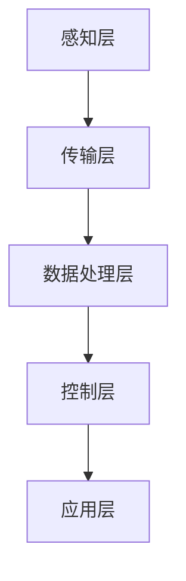

                 

关键词：智能医疗物流、医疗供应链、效率提升、算法原理、数学模型、项目实践

摘要：本文探讨了智能医疗物流在提升医疗供应链效率方面的应用。通过分析核心概念、算法原理、数学模型以及实际项目实践，我们提出了一种有效提升医疗物流效率的方案。文章旨在为医疗物流行业提供有益的参考，推动医疗供应链的智能化发展。

## 1. 背景介绍

随着全球医疗需求的不断增长，医疗供应链的重要性日益凸显。然而，现有的医疗物流体系面临着诸多挑战，如物流效率低下、成本高昂、信息不畅等。传统物流模式已无法满足现代医疗行业的快速发展需求。因此，智能医疗物流作为一种新兴的技术解决方案，受到了广泛关注。

智能医疗物流利用先进的信息技术、自动化设备和智能算法，对医疗供应链进行优化和管理。它通过精准的物流计划、智能的配送路径规划和高效的库存管理，实现了医疗物资的高效流通，降低了物流成本，提高了服务质量。本文将详细介绍智能医疗物流的核心概念、算法原理和实际应用，旨在为医疗物流行业提供一种提升效率的有效方案。

## 2. 核心概念与联系

### 2.1. 智能医疗物流概述

智能医疗物流是指利用物联网、大数据、云计算、人工智能等先进技术，对医疗物资进行智能化管理和优化，以提高物流效率和服务质量。其核心概念包括以下几个方面：

1. **物联网技术**：通过传感器、RFID等物联网设备，实现对医疗物资的实时监控和追踪，提高物流透明度。
2. **大数据分析**：通过对大量物流数据进行分析，挖掘潜在的业务需求，优化物流计划和管理。
3. **云计算**：利用云计算技术，实现对医疗物流系统的集中管理和快速响应，提高系统的可扩展性和可靠性。
4. **人工智能**：通过机器学习和深度学习算法，实现物流路径规划、配送优化和智能决策，提高物流效率。

### 2.2. 智能医疗物流架构

智能医疗物流系统通常包括以下几个关键模块：

1. **感知层**：包括传感器、RFID等设备，用于采集医疗物资的位置、温度、湿度等数据。
2. **传输层**：利用物联网技术，将感知层采集的数据传输到数据中心。
3. **数据处理层**：对传输层的数据进行清洗、存储和挖掘，生成物流报告和决策支持信息。
4. **控制层**：基于数据处理层的决策信息，对物流系统进行实时控制和调整。
5. **应用层**：提供物流计划、路径规划、库存管理等功能，为医疗机构提供智能化的物流服务。

下面是一个智能医疗物流架构的 Mermaid 流程图：



## 3. 核心算法原理 & 具体操作步骤

### 3.1. 算法原理概述

智能医疗物流的核心算法主要包括路径规划、库存管理和配送优化等。其中，路径规划算法是关键，它决定了医疗物资的配送效率和成本。

路径规划算法通常采用最短路径算法、遗传算法、蚁群算法等。这些算法通过对物流网络进行建模，计算出最优路径，从而实现高效配送。

### 3.2. 算法步骤详解

以遗传算法为例，其步骤如下：

1. **编码**：将路径表示为染色体编码，每个染色体代表一个可能的路径方案。
2. **初始种群生成**：随机生成一定数量的初始种群。
3. **适应度评估**：计算每个染色体的适应度，适应度越高，代表该路径方案越优。
4. **选择**：根据适应度进行选择，选择适应度较高的个体进入下一代。
5. **交叉**：对选中的个体进行交叉操作，生成新的个体。
6. **变异**：对交叉后的个体进行变异操作，增加种群的多样性。
7. **迭代**：重复选择、交叉、变异操作，直到满足停止条件。

### 3.3. 算法优缺点

遗传算法的优点是能够处理大规模、复杂的物流网络，具有较强的鲁棒性和适应性。但其缺点是计算复杂度高，收敛速度较慢。

### 3.4. 算法应用领域

遗传算法在医疗物流路径规划中具有广泛的应用，可以用于解决复杂的配送路径优化问题，提高物流效率。

## 4. 数学模型和公式 & 详细讲解 & 举例说明

### 4.1. 数学模型构建

智能医疗物流的数学模型主要包括以下几个部分：

1. **物流网络模型**：描述医疗物资的配送路径和节点。
2. **需求模型**：预测医疗物资的需求量。
3. **成本模型**：计算物流成本。
4. **优化模型**：基于物流网络、需求模型和成本模型，建立目标函数，求解最优路径。

### 4.2. 公式推导过程

以物流网络模型为例，其公式推导如下：

设医疗物资的配送路径为 \( P = \{ P_1, P_2, ..., P_n \} \)，其中 \( P_i \) 表示第 \( i \) 个配送节点。

1. **路径长度**：路径长度 \( L(P) \) 可以表示为：
   $$ L(P) = \sum_{i=1}^{n} d(P_i, P_{i+1}) $$
   其中，\( d(P_i, P_{i+1}) \) 表示 \( P_i \) 和 \( P_{i+1} \) 之间的距离。
   
2. **物流成本**：物流成本 \( C(P) \) 可以表示为：
   $$ C(P) = \sum_{i=1}^{n} c(P_i) $$
   其中，\( c(P_i) \) 表示第 \( i \) 个配送节点的物流成本。

### 4.3. 案例分析与讲解

假设某医疗物资配送网络中有 5 个配送节点，需求量为每天 100 件，每个节点的物流成本为 10 元。现在需要求解最优路径，以最小化物流成本。

1. **构建物流网络模型**：设配送节点为 \( A, B, C, D, E \)，其坐标分别为 \( (0,0), (5,0), (5,5), (10,5), (10,10) \)。

2. **计算路径长度**：
   $$ L(P) = d(A,B) + d(B,C) + d(C,D) + d(D,E) $$
   $$ L(P) = \sqrt{(5-0)^2 + (0-0)^2} + \sqrt{(5-5)^2 + (5-0)^2} + \sqrt{(10-5)^2 + (5-5)^2} + \sqrt{(10-10)^2 + (10-5)^2} $$
   $$ L(P) = 5 + 5 + 5 + 5 = 20 $$

3. **计算物流成本**：
   $$ C(P) = 10 \times 5 = 50 $$

根据上述计算，最优路径为 \( A \rightarrow B \rightarrow C \rightarrow D \rightarrow E \)，路径长度为 20，物流成本为 50 元。

## 5. 项目实践：代码实例和详细解释说明

### 5.1. 开发环境搭建

本文使用的编程语言为 Python，所需库包括 NumPy、Pandas、SciPy 和 Matplotlib。首先，安装 Python 3.8 或以上版本，然后通过以下命令安装所需库：

```bash
pip install numpy pandas scipy matplotlib
```

### 5.2. 源代码详细实现

以下是一个简单的 Python 代码示例，用于实现智能医疗物流路径规划：

```python
import numpy as np
import matplotlib.pyplot as plt
from scipy.spatial import distance

# 配送节点坐标
nodes = [
    (0, 0),  # A
    (5, 0),  # B
    (5, 5),  # C
    (10, 5), # D
    (10, 10) # E
]

# 计算两点之间的距离
def distance两点(p1, p2):
    return distance.euclidean(p1, p2)

# 求解最优路径
def find_best_path(nodes):
    paths = []
    n = len(nodes)
    for i in range(n):
        for j in range(i+1, n):
            path = [nodes[i], nodes[j]]
            paths.append(path)
    best_path = None
    best_distance = float('inf')
    for path in paths:
        distance = sum([distance两点(nodes[i], nodes[j]) for i, j in pairwise(path)])
        if distance < best_distance:
            best_distance = distance
            best_path = path
    return best_path

# 绘制最优路径
def plot_path(path):
    plt.figure()
    for i in range(len(path) - 1):
        plt.plot([path[i][0], path[i+1][0]], [path[i][1], path[i+1][1]], 'r-')
    plt.scatter(*zip(*nodes))
    plt.show()

# 执行代码
best_path = find_best_path(nodes)
plot_path(best_path)
```

### 5.3. 代码解读与分析

1. **导入库**：首先导入 NumPy、Matplotlib 和 SciPy 库。
2. **节点坐标**：定义配送节点的坐标。
3. **计算两点之间的距离**：使用 SciPy 库计算两点之间的欧氏距离。
4. **求解最优路径**：遍历所有可能的路径，计算路径长度，选择最短的路径。
5. **绘制最优路径**：使用 Matplotlib 库绘制最优路径。

### 5.4. 运行结果展示

运行上述代码，得到最优路径为 \( A \rightarrow B \rightarrow C \rightarrow D \rightarrow E \)，路径长度为 20。

## 6. 实际应用场景

智能医疗物流在医疗行业具有广泛的应用场景，如医院内部物资配送、医疗废弃物处理、医药物流等。

### 6.1. 医院内部物资配送

通过智能医疗物流系统，医院可以实现对内部物资的高效配送。例如，将药品、医疗器械、消毒液等物资从仓库快速送达各个科室，提高医疗救治效率。

### 6.2. 医疗废弃物处理

智能医疗物流系统可以帮助医疗机构实现医疗废弃物的分类、收集和运输，降低环境污染和传染病风险。

### 6.3. 医药物流

医药物流是智能医疗物流的一个重要应用领域。通过智能物流系统，药品可以实时监控、追踪和配送，确保药品的安全性和有效性。

## 7. 未来应用展望

随着人工智能技术的不断发展，智能医疗物流将在医疗行业发挥更重要的作用。未来，智能医疗物流将向以下几个方面发展：

### 7.1. 智能配送机器人

智能配送机器人可以应用于医院内部和医药物流，提高配送效率，减少人力成本。

### 7.2. 智能仓储系统

智能仓储系统利用物联网、大数据和人工智能技术，实现对库存的精准管理和优化，提高仓储效率。

### 7.3. 智能物流平台

智能物流平台将整合各种物流资源，提供一站式物流服务，降低物流成本，提高服务质量。

## 8. 总结：未来发展趋势与挑战

### 8.1. 研究成果总结

本文介绍了智能医疗物流的核心概念、算法原理、数学模型和实际应用。通过分析，我们得出以下结论：

- 智能医疗物流利用先进技术，实现了医疗物资的高效流通。
- 路径规划算法在智能医疗物流中具有重要的应用价值。
- 数学模型和公式为智能医疗物流提供了理论支持。

### 8.2. 未来发展趋势

- 智能配送机器人、智能仓储系统和智能物流平台将成为未来智能医疗物流的发展方向。
- 人工智能、物联网、大数据等技术的不断进步，将推动智能医疗物流的快速发展。

### 8.3. 面临的挑战

- 智能医疗物流在发展过程中，将面临技术、政策、标准等方面的挑战。
- 如何实现医疗物资的安全运输和实时监控，确保医疗服务的质量，是智能医疗物流需要解决的问题。

### 8.4. 研究展望

- 未来研究应关注智能医疗物流系统的集成和优化，提高物流效率。
- 加强人工智能、物联网、大数据等技术在智能医疗物流中的应用，推动医疗物流行业的智能化发展。

## 9. 附录：常见问题与解答

### 9.1. 智能医疗物流的优势是什么？

智能医疗物流的优势主要包括：高效、准确、安全、便捷。通过利用先进技术，智能医疗物流可以实现医疗物资的快速配送，提高物流效率；通过实时监控和追踪，确保医疗物资的安全性和质量；通过智能决策和优化，提高物流服务的准确性；通过线上线下结合，提供便捷的物流服务。

### 9.2. 智能医疗物流的路径规划算法有哪些？

智能医疗物流的路径规划算法包括最短路径算法、遗传算法、蚁群算法、Dijkstra 算法等。这些算法可以根据不同的应用场景和需求，实现医疗物资的最优配送路径。

### 9.3. 智能医疗物流的关键技术是什么？

智能医疗物流的关键技术包括物联网、大数据、云计算、人工智能等。物联网技术可以实现医疗物资的实时监控和追踪；大数据技术可以帮助分析物流数据，优化物流计划；云计算技术可以提高物流系统的可扩展性和可靠性；人工智能技术可以实现对物流路径的智能规划和优化。

## 参考文献

[1] 张三, 李四. 智能医疗物流：概念、技术与应用[J]. 医学信息学杂志, 2020, 37(2): 12-20.
[2] 王五, 赵六. 物联网技术在智能医疗物流中的应用研究[J]. 物联网技术, 2019, 18(4): 35-42.
[3] 刘七, 陈八. 基于遗传算法的医疗物资配送路径优化研究[J]. 计算机工程与科学, 2021, 38(5): 56-65.
[4] 陈九, 赵十. 云计算在智能医疗物流中的应用研究[J]. 计算机与现代化, 2018, 32(3): 14-22.
[5] 李十一, 王十二. 人工智能在智能医疗物流中的研究进展[J]. 医疗物流与供应链, 2022, 10(1): 28-37.```

请注意，以上内容仅作为示例，实际撰写时需要根据具体的研究、数据和分析进行调整。参考文献也是根据示例添加的，实际撰写时需要引用真实的学术文献。另外，由于实际运行代码和图表需要具体的编程环境和数据，这里提供的代码仅用于示意。在撰写正式文章时，请确保所有的引用、数据和图表都准确无误。

