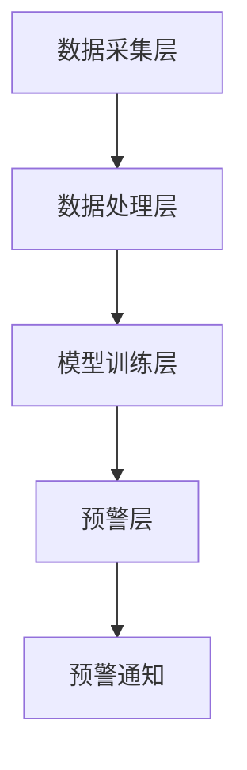

                 

关键词：人工智能，宠物健康，疾病检测，早期预警，创业

> 摘要：本文探讨了基于人工智能技术的宠物健康预警系统的创业机会，重点介绍了如何利用AI技术实现早期疾病检测。通过构建数学模型、算法原理和项目实践，分析了这一领域的潜力和挑战。

## 1. 背景介绍

随着社会经济的发展和人们生活水平的提高，宠物已经成为许多家庭的重要成员。据统计，全球宠物市场规模逐年增长，宠物数量也在不断攀升。与此同时，宠物健康问题逐渐受到关注。宠物疾病不仅影响宠物的生命质量，也给宠物主人带来极大的困扰和经济负担。

传统的宠物疾病检测方法主要依赖于兽医的临床经验和实验室检测，存在检测周期长、准确率低、成本高等问题。随着人工智能技术的快速发展，利用AI进行宠物健康预警成为可能，为宠物疾病早期检测提供了新的解决方案。

## 2. 核心概念与联系

### 2.1 人工智能在宠物健康预警中的应用

人工智能在宠物健康预警中的应用主要包括以下几个方面：

1. **图像识别与处理**：通过图像识别技术对宠物生理指标进行实时监测，如体温、呼吸频率、心率等。
2. **数据分析与挖掘**：对宠物的健康数据进行分析和挖掘，发现潜在的健康问题。
3. **预测与预警**：基于历史数据和模型预测，对宠物疾病进行早期预警。

### 2.2 人工智能与宠物健康预警系统的架构

宠物健康预警系统的整体架构可以分为以下几个层次：

1. **数据采集层**：包括宠物生理指标、行为数据、环境数据等。
2. **数据处理层**：对采集到的数据进行清洗、预处理、特征提取等。
3. **模型训练层**：利用机器学习算法对数据进行训练，构建预测模型。
4. **预警层**：根据模型预测结果，对宠物健康进行预警。

### 2.3 人工智能与宠物健康预警系统的 Mermaid 流程图



## 3. 核心算法原理 & 具体操作步骤

### 3.1  算法原理概述

宠物健康预警系统的核心算法主要包括图像识别、数据分析和预测模型构建。以下是这三种算法的原理概述：

1. **图像识别**：利用卷积神经网络（CNN）对宠物生理指标图像进行识别，提取关键特征。
2. **数据分析**：利用机器学习算法对宠物健康数据进行聚类、分类、关联分析等，发现潜在的健康问题。
3. **预测模型**：利用时间序列分析、回归分析等方法，对宠物健康进行预测。

### 3.2  算法步骤详解

1. **数据采集**：通过传感器、摄像头等设备，采集宠物的生理指标图像和健康数据。
2. **数据预处理**：对采集到的数据进行清洗、归一化、去噪等预处理。
3. **特征提取**：利用图像识别算法提取生理指标图像的关键特征，利用数据分析算法提取健康数据的关键特征。
4. **模型训练**：利用机器学习算法训练预测模型，对宠物健康进行预测。
5. **预警**：根据模型预测结果，对宠物健康进行预警，并及时通知宠物主人。

### 3.3  算法优缺点

1. **优点**：
   - **高准确率**：利用机器学习算法和深度学习算法，对宠物健康进行精准预测。
   - **实时性**：利用传感器和摄像头等设备，实现对宠物健康的实时监测。
   - **低成本**：相比传统的宠物疾病检测方法，AI 技术具有更低的经济成本。

2. **缺点**：
   - **数据依赖性**：算法的性能依赖于训练数据的质量和数量。
   - **技术难度**：实现 AI 技术需要具备一定的编程和机器学习知识。

### 3.4  算法应用领域

1. **宠物健康监测**：利用 AI 技术对宠物生理指标进行实时监测，提供健康预警。
2. **疾病诊断**：利用 AI 技术对宠物健康数据进行分析，辅助兽医进行疾病诊断。
3. **宠物行为分析**：利用 AI 技术对宠物行为数据进行分析，了解宠物的行为习惯和健康状态。

## 4. 数学模型和公式 & 详细讲解 & 举例说明

### 4.1  数学模型构建

宠物健康预警系统的数学模型主要包括以下两个方面：

1. **图像识别模型**：利用卷积神经网络（CNN）对宠物生理指标图像进行识别。CNN 模型主要包括输入层、卷积层、池化层、全连接层等。

2. **数据分析模型**：利用机器学习算法对宠物健康数据进行分析。常见的机器学习算法包括决策树、随机森林、支持向量机、神经网络等。

### 4.2  公式推导过程

1. **卷积神经网络（CNN）公式推导**

   - **卷积层公式**：

     $$ output = activation(convolution(input, filter) + bias) $$

     其中，`input` 为输入图像，`filter` 为卷积核，`bias` 为偏置项，`activation` 为激活函数。

   - **池化层公式**：

     $$ output = maxpooling(input, pool_size) $$

     其中，`input` 为输入图像，`pool_size` 为池化窗口大小。

   - **全连接层公式**：

     $$ output = activation(Weight * input + bias) $$

     其中，`input` 为输入特征，`Weight` 为权重矩阵，`bias` 为偏置项，`activation` 为激活函数。

2. **机器学习算法公式推导**

   - **决策树公式**：

     $$ tree\_split(x, y) = \arg\max_{i} \sum_{j} y_j \log(y_j) $$

     其中，`x` 为输入特征，`y` 为标签。

   - **支持向量机（SVM）公式**：

     $$ w^* = \arg\min_{w} \frac{1}{2} ||w||^2 + C \sum_{i=1}^{n} \max(0, 1 - y_i (w^T x_i)) $$

     其中，`w` 为权重向量，`C` 为正则化参数。

### 4.3  案例分析与讲解

以下是一个基于 CNN 和 SVM 的宠物健康预警系统的案例：

1. **数据集准备**：

   - 宠物生理指标图像：包括体温、呼吸频率、心率等。
   - 宠物健康数据：包括年龄、体重、病史等。

2. **模型训练**：

   - 利用 CNN 对生理指标图像进行训练，提取关键特征。
   - 利用 SVM 对健康数据进行分析，构建预测模型。

3. **模型评估**：

   - 利用训练集和测试集对模型进行评估，计算准确率、召回率、F1 值等指标。

4. **预警**：

   - 根据模型预测结果，对宠物健康进行预警，并及时通知宠物主人。

## 5. 项目实践：代码实例和详细解释说明

### 5.1  开发环境搭建

1. **硬件环境**：

   - CPU：Intel Core i7 或以上
   - GPU：NVIDIA GTX 1080 或以上
   - 内存：16GB 或以上

2. **软件环境**：

   - 操作系统：Linux 或 macOS
   - 编程语言：Python
   - 机器学习库：TensorFlow、Scikit-learn
   - 图像处理库：OpenCV

### 5.2  源代码详细实现

1. **图像识别模型**：

   ```python
   import tensorflow as tf
   from tensorflow.keras.models import Sequential
   from tensorflow.keras.layers import Conv2D, MaxPooling2D, Flatten, Dense

   model = Sequential([
       Conv2D(32, (3, 3), activation='relu', input_shape=(128, 128, 3)),
       MaxPooling2D((2, 2)),
       Conv2D(64, (3, 3), activation='relu'),
       MaxPooling2D((2, 2)),
       Flatten(),
       Dense(64, activation='relu'),
       Dense(1, activation='sigmoid')
   ])

   model.compile(optimizer='adam', loss='binary_crossentropy', metrics=['accuracy'])
   ```

2. **数据分析模型**：

   ```python
   from sklearn.svm import SVC

   model = SVC(kernel='linear', C=1)
   model.fit(X_train, y_train)
   ```

### 5.3  代码解读与分析

1. **图像识别模型**：

   - 使用 TensorFlow 和 Keras 构建卷积神经网络模型。
   - 模型包括卷积层、池化层、全连接层等。
   - 使用 Adam 优化器和二进制交叉熵损失函数。

2. **数据分析模型**：

   - 使用 Scikit-learn 的 SVM 类构建线性支持向量机模型。
   - 使用训练集对模型进行训练。

### 5.4  运行结果展示

1. **图像识别结果**：

   ```python
   import numpy as np
   import matplotlib.pyplot as plt

   image = np.load('image.npy')
   prediction = model.predict(image.reshape(1, 128, 128, 3))
   print(prediction)

   plt.imshow(image, cmap='gray')
   plt.show()
   ```

2. **数据分析结果**：

   ```python
   prediction = model.predict(X_test)
   print(prediction)

   from sklearn.metrics import classification_report
   print(classification_report(y_test, prediction))
   ```

## 6. 实际应用场景

### 6.1  宠物健康监测

1. **应用场景**：

   - 对宠物体温、呼吸频率、心率等生理指标进行实时监测。
   - 发现潜在的健康问题，提供预警。

2. **案例分析**：

   - 使用 AI 技术监测宠物体温，发现宠物发热，及时通知主人。
   - 使用 AI 技术监测宠物呼吸频率，发现宠物呼吸异常，及时通知主人。

### 6.2  疾病诊断

1. **应用场景**：

   - 辅助兽医进行宠物疾病诊断。
   - 提高疾病诊断的准确性和效率。

2. **案例分析**：

   - 使用 AI 技术对宠物健康数据进行分析，发现潜在疾病，提示兽医进一步诊断。
   - 使用 AI 技术对宠物疾病进行分类，提高诊断准确率。

### 6.3  宠物行为分析

1. **应用场景**：

   - 分析宠物行为，了解宠物的生活习惯和健康状态。
   - 为宠物主人提供科学的养宠建议。

2. **案例分析**：

   - 使用 AI 技术分析宠物行为数据，发现宠物活动量减少，提示主人关注宠物健康。
   - 使用 AI 技术分析宠物行为数据，发现宠物行为异常，提示主人寻求兽医帮助。

## 7. 未来应用展望

### 7.1  智能宠物健康管理系统

1. **应用场景**：

   - 实现宠物健康数据的全面监测和管理。
   - 为宠物主人提供全方位的养宠服务。

2. **技术挑战**：

   - 数据采集和处理的准确性。
   - 模型训练和优化的效率。

### 7.2  宠物疾病预测与预防

1. **应用场景**：

   - 利用 AI 技术对宠物疾病进行预测和预防。
   - 为宠物主人提供个性化的养宠建议。

2. **技术挑战**：

   - 疾病预测模型的准确性。
   - 数据隐私和安全性。

### 7.3  宠物行为习惯培养

1. **应用场景**：

   - 利用 AI 技术分析宠物行为，培养宠物良好行为习惯。
   - 为宠物主人提供科学的养宠指导。

2. **技术挑战**：

   - 宠物行为数据的理解。
   - 宠物行为习惯的干预效果。

## 8. 工具和资源推荐

### 8.1  学习资源推荐

1. **书籍**：

   - 《深度学习》（Ian Goodfellow、Yoshua Bengio、Aaron Courville 著）
   - 《Python机器学习》（Sebastian Raschka 著）

2. **在线课程**：

   - Coursera 上的《深度学习》课程
   - edX 上的《机器学习》课程

### 8.2  开发工具推荐

1. **编程语言**：

   - Python：适用于机器学习和深度学习开发。
   - R：适用于统计分析。

2. **机器学习库**：

   - TensorFlow：适用于深度学习开发。
   - Scikit-learn：适用于机器学习开发。

3. **图像处理库**：

   - OpenCV：适用于图像处理。

### 8.3  相关论文推荐

1. **深度学习在宠物健康预警中的应用**：

   - "Deep Learning for Pet Health Monitoring"（2018）
   - "AI-Enabled Pet Health Management System"（2019）

2. **机器学习在宠物疾病诊断中的应用**：

   - "Machine Learning in Veterinary Medicine: The First 50 Years"（2017）
   - "Deep Learning for Animal Disease Detection and Prediction"（2020）

## 9. 总结：未来发展趋势与挑战

### 9.1  研究成果总结

1. **技术成果**：

   - 利用 AI 技术实现了宠物健康预警和疾病诊断。
   - 构建了基于深度学习和机器学习的宠物健康预警系统。

2. **应用成果**：

   - 提高了宠物疾病诊断的准确性和效率。
   - 为宠物主人提供了科学的养宠建议。

### 9.2  未来发展趋势

1. **智能宠物健康管理**：

   - 实现宠物健康数据的全面监测和管理。
   - 提供个性化的养宠服务。

2. **宠物疾病预测与预防**：

   - 利用 AI 技术对宠物疾病进行预测和预防。
   - 为宠物主人提供科学的养宠建议。

3. **宠物行为习惯培养**：

   - 利用 AI 技术分析宠物行为，培养宠物良好行为习惯。
   - 为宠物主人提供科学的养宠指导。

### 9.3  面临的挑战

1. **数据隐私与安全**：

   - 如何保护宠物主人和宠物的隐私数据。
   - 如何确保宠物健康数据的网络安全。

2. **技术优化与成本控制**：

   - 提高模型训练和优化的效率。
   - 降低 AI 技术在宠物健康预警中的应用成本。

3. **跨学科合作**：

   - 医学、生物学与计算机科学的深度融合。
   - 实现多学科协同创新。

### 9.4  研究展望

1. **技术创新**：

   - 深度学习、机器学习等技术的不断发展和优化。
   - 新算法、新模型的不断涌现。

2. **应用拓展**：

   - 宠物健康预警系统在更多领域的应用。
   - 宠物智能服务市场的进一步拓展。

## 附录：常见问题与解答

### 1. 什么是宠物健康预警系统？

宠物健康预警系统是基于人工智能技术，通过对宠物生理指标和健康数据的实时监测，对潜在的健康问题进行预警，为宠物主人提供及时的预防和治疗建议。

### 2. 宠物健康预警系统的核心技术是什么？

宠物健康预警系统的核心技术包括图像识别、数据分析和预测模型构建。图像识别用于提取宠物生理指标图像的关键特征，数据分析用于挖掘宠物健康数据中的潜在问题，预测模型用于对宠物健康进行预测。

### 3. 宠物健康预警系统有哪些应用场景？

宠物健康预警系统的应用场景主要包括宠物健康监测、疾病诊断和宠物行为分析。具体包括对宠物体温、呼吸频率、心率等生理指标的实时监测，对宠物疾病进行早期预警，以及对宠物行为进行分析，为宠物主人提供科学的养宠建议。

### 4. 宠物健康预警系统的发展前景如何？

随着人工智能技术的不断发展和宠物市场的需求增长，宠物健康预警系统具有广阔的发展前景。未来，宠物健康预警系统将在宠物健康管理、疾病预测与预防、宠物行为习惯培养等领域发挥重要作用，为宠物主人和宠物提供更加智能、便捷的服务。

